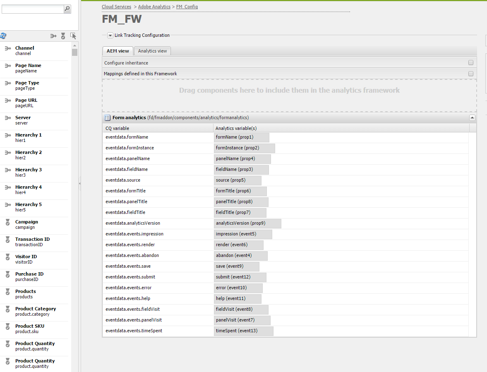

# Analyse met gebruik van Cloud Service Framework {#analyticsusingcloudframework}

AEM Forms integreert met Analytics waarmee u prestatiegegevens voor uw gepubliceerde formulieren en documenten kunt vastleggen en bijhouden. Het doel van de analyse van deze gegevens is om geïnformeerde beslissingen te nemen op basis van gegevens over de wijzigingen die nodig zijn om formulieren of documenten bruikbaarder te maken.

>[!NOTE]
>
>De functie Analytics in AEM Forms is beschikbaar als onderdeel van het invoegpakket voor AEM Forms. Voor informatie over het installeren van het toe:voegen-op pakket, zie [&#x200B; Installerend en het vormen AEM Forms &#x200B;](../../forms/using/installing-configuring-aem-forms-osgi.md).
>
>Naast het invoegpakket hebt u een Adobe Analytics-account en beheerdersrechten voor de AEM nodig. Voor informatie over de oplossing, zie [&#x200B; Adobe Analytics &#x200B;](https://www.adobe.com/solutions/digital-analytics.html).

U kunt ook analyses uitvoeren met de Adobe Launch. Voor meer informatie over hoe te om AEM Forms met de Lancering van de Adobe te integreren, zie [&#x200B; Analytics gebruikend de Lancering van de Adobe &#x200B;](/help/forms/using/integrate-aem-forms-with-adobe-analytics.md).

## Overzicht {#overview}

U kunt Adobe Analytics gebruiken om interactiepatronen en problemen te detecteren waarmee gebruikers worden geconfronteerd bij het gebruik van adaptieve formulieren, HTML5-formulieren en interactieve communicatie. Uit de doos, volgt de analytische sporen van de Adobe en slaat informatie over de volgende parameters op:

* **Gemiddelde vultijd**: Gemiddelde die tijd wordt doorgebracht om de vorm te vullen.
* **Vertoningen**: Aantal tijden een vorm wordt geopend.
* **Concepten**: Aantal tijden een vorm wordt bewaard in de ontwerpstaat.
* **Voorleggen**: Aantal tijden een vorm wordt voorgelegd.
* **Afbreken**: Aantal tijden de gebruikers verlaten zonder de vorm te voltooien.

U kunt Adobe Analytics aanpassen om meer parameters toe te voegen of te verwijderen. Het verslag bevat naast de bovenstaande informatie de volgende informatie over elk panel van de HTML5 en het adaptieve formulier:

* **Tijd**: Tijd besteed aan het paneel en de gebieden van het paneel.
* **Fout**: Aantal fouten die op het paneel en op de gebieden van het paneel worden ontmoet.
* **Hulp**: Aantal tijden een gebruiker opent hulp van een paneel en de gebieden van het paneel.

## Rapportsuite maken {#creating-report-suite}

De analysegegevens worden opgeslagen in klant-specifieke bewaarplaatsen genoemd rapportreeksen. Als u een rapportenpakket wilt maken en Adobe Analytics wilt gebruiken, hebt u een geldig Adobe Marketing Cloud-account nodig. Controleer voordat u de volgende stappen uitvoert of u een geldige Adobe Marketing Cloud-account hebt.

Voer de volgende stappen uit om een rapportsuite te maken.

1. Login bij [&#x200B; https://sc.omniture.com/login/](https://sc.omniture.com/login/)
1. In de Marketing Cloud, uitgezochte **Admin** > **Admin Console** > **de Reeksen van het Rapport**.
1. Selecteer **creeer Nieuwe** > **Reeks van het Rapport** in de Manager van de Reeks van het Rapport.

   

   Nieuwe rapportsuite maken

1. Zorg ervoor de eerste dropdown lijst wordt geplaatst aan **creeer van een Malplaatje** en selecteer dan **Commerce**.
1. Bepaal de plaats van het **gebied van identiteitskaart van de Reeks van het 0&rbrace; Rapport en voeg nieuwe identiteitskaart van de Reeks van het Rapport toe.** JJEsquire. Een rapportsuite-id wordt weergegeven onder het veld Report Suite-id. Het omvat een automatisch voorvoegsel, dat vaak de bedrijfsnaam is.
1. Voeg nieuwe **Titel van de Plaats** toe. JJEsquire Getting Started Suite. Deze titel wordt gebruikt binnen Analytics UI. Gebruik de rapportsuite-id in de code.
1. Selecteer de Zone van de a **Tijd** van dropdown. Alle gegevens die in deze rapportreeks komen worden geregistreerd gebaseerd op bepaalde tijdzone.
1. Verlaat **Basis URL** en **GebrekPagina** gebieden leeg. Deze twee waarden worden alleen via de Adobe Marketing Cloud-interface gebruikt om een koppeling naar uw website te maken.
1. Verlaat **gaan Levende Datum** aan vandaag wordt geplaatst die. De Go Live Date bepaalt de dag waarop de rapportsuite wordt geactiveerd.
1. Op het **Geschatte Mening van de Pagina per Dag** gebied, type 100. Met dit veld kunt u het aantal pagina&#39;s schatten dat u per dag voor uw website verwacht. Met deze schatting kan de Adobe de juiste hoeveelheid hardware instellen voor de verwerking van de gegevens die u wilt verzamelen.
1. Selecteer a **Valuta van de Basis** van dropdown. Alle valutagegevens die in deze rapportsuite worden ingevoerd, worden geconverteerd en opgeslagen in deze valutanotatie.
1. Klik **creëren de Reeks van het Rapport**. De pagina wordt vernieuwd met een bericht dat de rapportsuite is gemaakt.
1. Selecteer de nieuwe rapportsuite. Navigeer aan **uitgeven Montages** > **Algemene** > **Algemene Montages van de Rekening**.

   

   Algemene accountinstellingen

1. In het Algemene scherm van de Montages van de Rekening, laat **Geografie toe die** meldt, en klikt **sparen.**
1. Navigeer aan **uitgeven Montages** > **Verkeer** > **Variabelen van het Verkeer**.
1. In de rapportreeks, vorm en laat volgende verkeersvariabelen toe.

   * **formName**: Herkenningsteken voor een adaptieve vorm.
   * **formInstance**: Herkenningsteken van een adaptieve vorminstantie. Padrapporten inschakelen voor deze variabele.
   * **fieldName**: Herkenningsteken van een adaptief vormgebied. Padrapporten inschakelen voor deze variabele.
   * **panelName**: Herkenningsteken van een adaptief vormpaneel. Padrapporten inschakelen voor deze variabele.
   * **formTitle**: Titel van de vorm.
   * **fieldTitle**: Titel van het vormgebied.
   * **panelTitle**: Titel van het vormpaneel.
   * **analyticsVersion**: Versie van vormanalyse.

1. Navigeer aan **uitgeven Montages** > **Omzetting** > **Gebeurtenissen van het Succes**. Definieer en schakel de volgende succesgebeurtenissen in:

   | Gebeurtenis geslaagd | Type |
   |---|---|
   | opgeven | Teller |
   | renderen | Teller |
   | panelVisit | Teller |
   | fieldVisit | Teller |
   | opslaan | Teller |
   | fout | Teller |
   | help | Teller |
   | indienen | Teller |
   | timeSpent | Numeriek |

   >[!NOTE]
   >
   >Een gebeurtenisaantal en pro aantal dat wordt gebruikt om de analyses van AEM Forms te vormen moet van gebeurtenisaantal en pro-aantal verschillend zijn dat in [&#x200B; wordt gebruikt AEM analytische &#x200B;](/help/sites-administering/adobeanalytics.md) configuratie.

1. Afmelden bij Adobe Marketing Cloud-account.

## Configuratie van Cloud Service maken {#creating-cloud-service-configuration}

Configuratie van Cloud Servicen is informatie over uw Adobe Analytics-account. Met de configuratie kan Adobe Experience Manager (AEM) verbinding maken met Adobe Analytics. Maak een aparte configuratie voor elke analytische account die u gebruikt.

1. Meld u als beheerder aan bij de AEM auteur-instantie.
1. In de top-linkerhoek, klik **Adobe Experience Manager** > **Hulpmiddelen**  > **Cloud Servicen** > **Verouderde Cloud Servicen**.
1. Bepaal de plaats van **Adobe Analytics** pictogram. Klik **tonen Configuraties** en ga dan te werk om **[+]** te klikken om nieuwe configuratie toe te voegen.

   Als u een eerste gebruiker bent, klik **nu** vormen.

1. Voeg een Titel toe aan uw nieuwe configuratie (het invullen van het gebied van de Naam is facultatief). Bijvoorbeeld, Mijn analytische configuratie. Klik **creëren**.

1. Wanneer het deelvenster Bewerken wordt geopend op de configuratiepagina, vult u de velden in:

   * **Bedrijf**: De naam van uw bedrijf zoals vermeld op Adobe Analytics.
   * **Gebruikersnaam**: De naam die aan login aan Adobe Analytics wordt gebruikt.
   * **Wachtwoord**: Het wachtwoord van Adobe Analytics voor de bovengenoemde rekening.
   * **Centrum van Gegevens**: Het Centrum van Gegevens van uw rekening van Adobe Analytics.

1. Klik **verbinden met Analytics**. Er wordt een dialoogvenster weergegeven met het bericht dat de verbinding is gelukt. Klik **OK**.

## Kader voor Cloud Service maken {#creating-cloud-service-framework}

Een Adobe Analytics-framework is een set toewijzingen tussen Adobe Analytics-variabelen en AEM. Gebruik een framework om te configureren hoe uw formulieren gegevens invullen in Adobe Analytics-rapporten. Frameworks zijn gekoppeld aan een Adobe Analytics-configuratie. U kunt veelvoudige kaders voor elke configuratie tot stand brengen.

1. Op de AEM console van de wolkendiensten, klik **tonen configuraties**, onder Adobe Analytics.
1. Klik op de koppeling **[+]** naast de configuratie Analytics.

   

   Adobe Analytics-configuratie

1. Typ a **Titel** en **Naam** voor het kader, selecteer **Adobe Analytics** Kader, en klik **creeer**. Het framework wordt geopend voor bewerking.
1. In de sectie van de Reeksen van het Rapport van de zijpeul, klik **Punt** toevoegen, dan gebruik drop-down om identiteitskaart van de Reeks van het Rapport (bijvoorbeeld, JJEsquire) te selecteren waarmee het kader zal communiceren.
1. Naast de ID van de Reeks van het Rapport, selecteer de serverinstanties die u informatie naar de Reeks van het Rapport wilt verzenden.

   

1. Sleep de component van de Analyse van de a **Vorm** van de **andere** categorie van Sidekick op het kader.
1. Als u analytische variabelen wilt toewijzen aan variabelen die in de component zijn gedefinieerd, sleept u een variabele van AEM Content Finder naar een veld in de component tracking.

   

1. Activeer het kader gebruikend het **paginatablad** in sidekick, klik **Activate Kader**.

## Configuratieservice voor AEM Forms Analytics configureren {#configuring-aem-forms-analytics-configuration-service}

1. Voor auteurinstantie, open AEM Manager van de Configuratie van de Console van het Web bij `https://<server>:<port>;/system/console/configMgr`.
1. AEM Forms Analytics Configuration zoeken en openen

   

   AEM Forms Analytics Configuration-service

1. Specificeer aangewezen waarden voor de volgende gebieden en klik **sparen**.

   * **Kader van de SiteCatalyst**: Selecteer het kader/de configuratie die u in Opstelling een kader voor het volgen van sectie bepaalde.
   * **tijd die basislijn van het Gebied &lbrace;** volgen: Specificeer de duur, in seconden, waarna het gebiedsbezoek moet worden gevolgd. De standaardwaarde is 0. Wanneer de waarde groter is dan 0 (nul), worden twee afzonderlijke volggebeurtenissen verzonden naar de Adobe Analytics-server. De eerste gebeurtenis geeft de analyseserver de opdracht het verlaten veld niet meer te volgen. De tweede gebeurtenis wordt verzonden nadat de opgegeven tijdsduur is verstreken. De tweede gebeurtenis geeft de analyseserver de opdracht het bezochte veld te volgen. Het gebruik van twee afzonderlijke gebeurtenissen helpt de tijd die aan een veld wordt doorgebracht nauwkeurig te meten. Wanneer de waarde 0 (nul) is, wordt een enkele volggebeurtenis verzonden naar de Adobe Analytics-server.

   * **Analytics rapport synchroon**: Specificeer cron uitdrukking voor het halen van rapporten van Adobe Analytics. De standaardwaarde is 0 0 2? &#42; &#42; .

   * **het rapportonderbreking van de Vetch:** specificeer de duur, in seconden, om op server te wachten om op het analyserapport te antwoorden. De standaardtijd is 120 seconden.

   >[!NOTE]
   >
   >Het kan tot 10 seconden meer aan onderbrekingsrapport nemen haal verrichting toen het gespecificeerde aantal seconden.

1. Herhaal stap 1-3 op publicatieinstantie om analyses te configureren.

Nu kunt u analyses inschakelen voor formulieren en een analyserapport genereren.

## Analyses inschakelen voor een formulier of document {#enabling-analytics-for-a-form-or-document}

1. Meld u aan bij AEM portal op `https://[hostname]:'port'` .
1. Klik **Forms > Forms &amp; Documenten**, selecteer een vorm of een document, en klik **laat Analytics** toe. De analysemogelijkheden zijn ingeschakeld.

   

   Analyses inschakelen voor een formulier

   **A.** laat knoop Analytics **B.** Geselecteerde vorm toe

   Voor gedetailleerde informatie bij het bekijken van de rapporten van de vormenanalyse, zie [&#x200B; het Bekijken van en het begrip van de analyserapporten van AEM Forms &#x200B;](../../forms/using/view-understand-aem-forms-analytics-reports.md).
