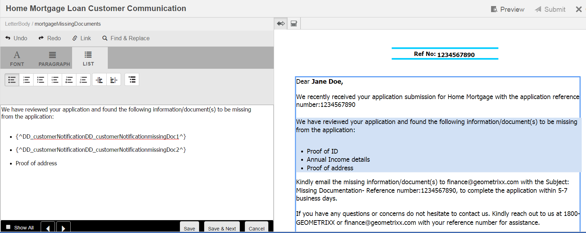
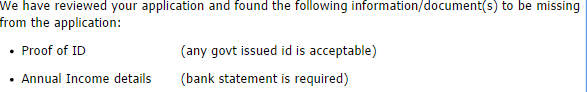
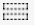

# Correspondentie maken{#create-correspondence}

## E-mailcorrespondentie maken in de gebruikersinterface Correspondentie maken {#create-correspondence-in-the-create-correspondence-user-interface}

Nadat een [brievenmalplaatje in het Beheer](../../forms/using/create-letter.md)van de Correspondentie wordt gecreeerd, kan het eind - gebruiker/agent/bewering aanpast de brief in Create de gebruikersinterface van de Correspondentie openen en een correspondentie creëren door gegevens in te gaan, inhoud te plaatsen, en gehechtheid te beheren. Tot slot kan de eisencorrector of de agent de inhoud in de voorvertoningsmodus beheren en de brief verzenden.

### Een voorbeeld van een overeenkomst bekijken {#preview-a-correspondence}

Selecteer de brief aan voorproef gebruikend de volgende stappen:

1. Tik op de pagina Letters op **Selecteren**.
1. Selecteer de gewenste letter door erop te tikken.

   

   Letter selecteren

1. Selecteer **Voorvertoning** > **Voorvertoning** voor een op gegevenswoordenboek gebaseerde letter. Of selecteer **Voorvertoning** voor een niet-op data-woordenboeken gebaseerde letter. U kunt de muisaanwijzer ook boven een letter plaatsen (zonder deze te selecteren) en op het pictogram Lettertypevoorvertoning tikken om een voorvertoning van de letter weer te geven.

   >[!NOTE]
   >
   >Als er geen gegevenswoordenboek aan de letter is gekoppeld, wordt de lettervoorvertoning geopend. Als de letter anders is gebaseerd op gegevenswoordenboeken, worden in het menu Voorbeeld van Correspondentenbeheer de opties Voorbeeld en Aangepast weergegeven en kunt u een van de twee opties selecteren. U kunt testgegevens ook koppelen aan een gegevenswoordenboek. Wanneer het [gegevenswoordenboek testgegevens](../../forms/using/data-dictionary.md#p-working-with-test-data-p)heeft gekoppeld en vervolgens de voorvertoningsoptie selecteert, wordt de normale voorvertoning geopend met de testgegevens gevuld.

1. Als u een correspondentie wilt kunnen weergeven terwijl u een voorvertoning weergeeft, moet u een beheerder of een deel van een van de volgende groepen zijn:

   * formulieren-gebruikers (voor voorbeeld op auteurinstantie)
   * cm-agent-gebruikers (voor vertoning op publicatieinstantie)

   Als u niet de vereiste toestemmingen hebt, verzoek admin voor de aangewezen toegang. Zie Gebruikers of groepen [toevoegen aan een groep](/help/sites-administering/security.md)voor meer informatie over het maken en toevoegen van gebruikers aan groepen. Als u een correspondentie probeert terug te geven zonder de aangewezen toestemmingen te hebben, verschijnt de 404 foutenpagina.

1. Als u **Voorvertoning** > **Aangepast** hebt geselecteerd, wordt een dialoogvenster geopend. Selecteer in het dialoogvenster een gegevensbestand dat overeenkomt met het gegevenswoordenboek, om een voorvertoning van de letter weer te geven en selecteer vervolgens **Voorvertoning**. Er wordt een gegevensbestand gemaakt op basis van een gegevenswoordenboek voor een specifieke letter. Zie [Gegevenswoordenboek](../../forms/using/data-dictionary.md#p-working-with-test-data-p)voor meer informatie over het gegevensbestand.

   

1. De HTML-voorvertoning met de letter (voorvertoning voor mobiele formulieren) wordt standaard geopend en het tabblad Gegevens krijgt de focus.

   Voor meer informatie over mobiele formulieren en de functies die ze ondersteunen, raadpleegt u het verschil in [functies tussen Mobile Forms en PDF forms](https://helpx.adobe.com/livecycle/help/mobile-forms/feature-differentiation-mobile-forms-pdf.html).

   Er zijn drie tabbladen: gegevens, inhoud en bijlagen. Als er geen gegevenselementen zijn (plaatsaanduidingsvariabelen en layoutvelden), wordt de letter rechtstreeks geopend met het tabblad Inhoud weergegeven. Het tabblad Bijlagen is alleen beschikbaar wanneer bijlagen aanwezig zijn of bibliotheektoegang is ingeschakeld.

   >[!NOTE]
   >
   >Zie [De weergavemodus letter](#changerenditionmode)wijzigen voor meer informatie over het schakelen tussen de weergavemodus HTML of PDF. Zie [Stoppen met insteekmodules voor NPAPI-browsers en de impact](https://helpx.adobe.com/aem-forms/kb/discontinuation-of-npapi-plugins-impact-on-aem-forms.html) en [PDF forms op HTML5 Forms](https://helpx.adobe.com/aem-forms/kb/pdf-forms-to-html5-forms.html)voor meer informatie over PDF-ondersteuning in Correspondence Management en AEM.

### Gegevens invoeren {#enterdata}

Vul op het tabblad Gegevens de beschikbare lay-outvelden en plaatsaanduidingen in.

1. Voer de vereiste gegevens- en inhoudsvariabelen in de velden in. Vul alle verplichte velden in die zijn gemarkeerd met een sterretje (*) om de knop **Verzenden** in te schakelen.

   Tik op een gegevensveldwaarde in de HTML-lettertypevoorvertoning om het bijbehorende gegevensveld op het tabblad Gegevens te markeren.

    

### Inhoud beheren {#managecontent}

Beheer op het tabblad Inhoud de inhoud, zoals documentfragmenten en inhoudsvariabelen in de letter.

1. Selecteer **Inhoud**. Correspondence Management geeft het tabblad Inhoud van de brief weer.

   

1. Bewerk desgewenst de inhoudsmodules op het tabblad Inhoud. Als u de relevante inhoudsmodule in de inhoudshiërarchie de focus wilt geven, kunt u op de desbetreffende regel of alinea in de lettervoorvertoning tikken of rechtstreeks in de inhoudshiërarchie op de inhoudsmodule tikken.

   Bijvoorbeeld de regel &quot;We hebben gereviseerd... &quot; is geselecteerd in de onderstaande afbeelding en de relevante inhoudsmodule is geselecteerd op het tabblad Inhoud.

   

   Op het tabblad Inhoud of Gegevens kunt u door te tikken op Geselecteerde modules markeren ( ) linksboven in de HTML-lettertypevoorvertoning, de functionaliteit uitschakelen of inschakelen om naar de inhoud/gegevensmodule te gaan wanneer de relevante tekst, alinea of gegevensveld is geselecteerd in de lettertypevoorvertoning.

   Zie [Handelingen en informatie in de gebruikersinterface](#actions-and-info-available-in-the-create-correspondence-content-tab)Correspondentie maken voor meer informatie over de acties die beschikbaar zijn voor verschillende modules in de gebruikersinterfaceCorrespondentie maken.

1. Gebruik het veld Zoeken om inhoudsmodules te zoeken. Voer een volledige of gedeeltelijke naam of titel van de inhoudsmodule in om deze in de correspondentie te zoeken.
1. Tik op het weergavepictogram ( ) vóór een lijst, tekst, voorwaarde of doelgebied om deze in de letter weer te geven of te verbergen.
1. Tik op het desbetreffende pictogram **Bewerken** ( ) of dubbelklik op de relevante tekstmodule in de lettervoorvertoning om een inline- of bewerkbare tekstmodule te bewerken.

   Het systeem geeft een teksteditor weer om de tekst te bewerken en op te maken.

   De standaardspellingcontrole in uw browser controleert spelling in de redacteur van de Tekst. Als u de spelling en grammatica wilt controleren, kunt u de instellingen voor spellingcontrole van uw browser bewerken of browserinsteekmodules/invoegtoepassingen installeren om de spelling en de grammatica te controleren.

   U kunt ook de verschillende sneltoetsen in de teksteditor gebruiken voor het beheren, bewerken en opmaken van tekst. Voor meer informatie over [de toetsenbordkortere weg van de Redacteur](/help/forms/using/keyboard-shortcuts.md#correspondence-management) van de Tekst in de Kortere weg van het Beheer van de Correspondentie.

   

   U kunt een van meerdere alinea&#39;s tekst die in een andere toepassing van het document voorkomen, opnieuw gebruiken. U kunt tekst rechtstreeks kopiëren en plakken, zoals vanuit MS Word, HTML-pagina&#39;s of een andere toepassing.

   U kunt een of meer alinea&#39;s tekst in een bewerkbare tekstmodule kopiëren en plakken. U hebt bijvoorbeeld een MS Word-document met een lijst met geldige verblijfstitels, zoals:

   

   U kunt de tekst rechtstreeks vanuit het MS Word-document naar een bewerkbare tekstmodule kopiëren en plakken. De opmaak, zoals een lijst met opsommingstekens, lettertype en tekstkleur, blijft behouden in de tekstmodule.

   

   >[!NOTE]
   >
   >De opmaak van geplakte tekst heeft echter enkele [beperkingen](https://helpx.adobe.com/aem-forms/kb/cm-copy-paste-text-limitations.html).

   Met de Tab-toets kunt u de tekst en de nummers in de letter laten inspringen. Met de Tab-toets kunt u bijvoorbeeld meerdere tekstkolommen in een lijst uitlijnen in een tabelindeling.

   

   Voorbeeld: Meerdere tekstkolommen uitlijnen met de Tab-toets in een tabelindeling

   >[!NOTE]
   >
   >Zie [Meer informatie over het gebruik van tabspatiëring voor het rangschikken van tekst](https://helpx.adobe.com/aem-forms/kb/cm-tab-spacing-limitations.html)voor meer informatie over het instellen van tabspatiëring voor uw tekstmodules en letters.

1. Voeg zo nodig speciale tekens in de correspondentie in. U kunt bijvoorbeeld het palet Speciale tekens gebruiken om het volgende in te voegen:

   * Valutasymbolen zoals €, ¥ en £
   * Wiskundige symbolen zoals A, Ö, ∂ en ^
   * Interpunctiesymbolen zoals ‟ en&quot;

   

   Correspondence Management biedt ondersteuning voor 210 speciale tekens. De beheerder kan ondersteuning voor meer/aangepaste speciale tekens [toevoegen door deze aan te passen](../../forms/using/custom-special-characters.md).

1. Selecteer de tekst en tik op Markeringskleur om\gedeelten van tekst in een bewerkbare inlinemodule te benadrukken.

   

   U kunt rechtstreeks op een basiskleur in het palet Standaardkleuren tikken of op `**[A]**` Selecteren **tikken nadat u de schuifregelaar hebt gebruikt** `**[B]**` om de juiste kleurtint te kiezen.

   Desgewenst kunt u ook naar het tabblad Geavanceerd gaan om de juiste kleurtoon, helderheid en verzadiging te selecteren `**[C]**` en vervolgens op Selecteren tikken `**[D]**` om de tekst te markeren.

   

1. Breng de gewenste wijzigingen in de inhoud en de indeling aan en tik op **Opslaan**. Tik ( ) om te schakelen tussen bewerkbare tekstmodules of tik op **Opslaan en Volgende** om de wijzigingen op te slaan en naar de volgende bewerkbare tekstmodule te gaan.
1. Het systeem geeft ook de niet-ingevulde variabelen voor elk van de vertakkingen weer. Wanneer er geen niet-gevulde variabelen zijn, worden niet-gevulde variabelen weergegeven als 0. Als er een variabele zonder vulling is, kunt u op een vertakking tikken om deze uit te vouwen en de variabele zonder vulling te zoeken. Gebruik de inhoudwerkbalk om inhoud te verwijderen, de inspringing van de inhoud te vergroten/verkleinen en pagina-einden voor/na de inhoud in te voegen.

   U kunt pagina-einden boven en onder gegevensmodules invoegen, zelfs als deze deel uitmaken van lijsten en voorwaarden.

1. Tik op Inhoudsvariabele openen/sluiten ( ) om de inhoudsvariabelen te openen en op de juiste wijze in te vullen.
1. Wanneer u de niet-gevulde variabele correct hebt ingevuld, wordt het aantal niet-gevulde variabelen ingesteld op 0.

   In het Create de gebruikersinterface van de Correspondentie, wordt het niet gevulde veranderlijke aantal getoond op elk niveau van de hiërarchie van om het even welke module die minstens één variabele bevat. Als een module niet-gevulde variabelen bevat, wordt de telling getoond bij de variabele, de module, het doelgebied, en het niveau van de brievenmalplaatje.

   Het aantal niet-gevulde variabelen bevat:

   * Alleen variabelen voor niet-beveiligd gegevenswoordenboek en plaatsaanduiding. Het aantal variabelen omvat geen variabelen voor de indeling of het beveiligde gegevenswoordenboek.
   * Verplichte velden.
   * Indelingsvelden als deze verplicht zijn en aan de gebruiker zijn gebonden.
   * Alleen instanties van unieke variabelen. Als een module, doelgebied of lettertypesjabloon twee of meer exemplaren van dezelfde variabele bevat, wordt de telling weergegeven als 1 (één). Nochtans, voor elk van de instanties, wordt de telling getoond als 1.

   Het aantal niet-gevulde variabelen bevat geen niet-geselecteerde modules. Als een module is opgenomen in een lettertypesjabloon maar niet in de letter staat, wordt de telling voor niet-gevulde variabelen in deze module niet weergegeven.

   Voor het doelgebied, de module, en de variabele wordt de telling getoond rechts van elk voorwerp in het brievenmalplaatje. Voor de volledige sjabloon wordt het aantal echter weergegeven in de statusbalk voor correspondentie maken.

   De modules in een lettertypesjabloon geven het aantal niet-gevulde variabelen weer zoals hieronder wordt beschreven:

   * **Met Tekst** wordt de som van de unieke niet-gevulde plaatsaanduidingsvariabelen en gegevenswoordenboekelementen in de tekstmodule weergegeven.
   * **De voorwaarde** toont de som unieke niet-gevulde voorwaardenvariabelen in de voorwaarde en de variabelen in de resulterende modules.
   * **De lijst** toont de som alle unieke niet-gevulde variabelen in de modules die aan de lijst worden toegewezen.
   * **In het doelgebied** wordt de som weergegeven van alle unieke niet-gevulde variabelen in de modules die aan het doelgebied zijn toegewezen.

   Let op het volgende met betrekking tot variabelen met standaardwaarden:

   * Een Booleaans variabel veld is standaard *false*. De variabele wordt echter als niet-gevuld beschouwd. Dit houdt in dat het aantal variabelen alle Booleaanse variabele velden met de waarde *false* bevat.

   * Een numeriek variabel veld heeft de standaardwaarde *0 (nul)*. De variabele wordt echter als niet-gevuld beschouwd. Dit houdt in dat het aantal variabelen alle numerieke variabele velden met waarde *0 (nul)* bevat.

#### Handelingen en informatie beschikbaar op het tabblad Correspondentie-inhoud maken {#actions-and-info-available-in-the-create-correspondence-content-tab}

**Doelgebied**

* Lege regel invoegen: Hiermee voegt u een nieuwe lege regel in.
* Inline tekst invoegen: Hiermee wordt een nieuwe tekstmodule ingevoegd.
* Order Lock (info): Geeft aan dat de volgorde van de inhoud niet kan worden gewijzigd.
* Niet-gevulde waarden (info): Hiermee wordt het aantal niet-gevulde variabelen in het doelgebied aangegeven.

**Module**

* Selectie (oogpictogram): Hiermee sluit u de module\n uit van de letter.
* Opsommingstekens overslaan (van toepassing op lijstmodules en de bijbehorende onderliggende modules): Hiermee slaat u opsommingstekens over in een bepaalde module.
* Pagina-einde vóór (van toepassing op onderliggende modules van het doelgebied): Hiermee voegt u vóór de module een pagina-einde in.
* Pagina-einde na (van toepassing op onderliggende modules van het doelgebied): Hiermee voegt u vóór de module een pagina-einde in.
* Niet-gevulde waarden (info): Hiermee wordt het aantal niet-gevulde variabelen in het doelgebied aangegeven.
* Bewerken (alleen tekstmodules): Open een RTF-editor voor het bewerken van de tekstmodule.
* Deelvenster Gegevens (modules voor tekst en voorwaarden): Open alle variabelen van de module.

**Lijstmodule**

* Lege regel invoegen: Hiermee voegt u een nieuwe lege regel in.
* Inhoudsbibliotheek: Opent de inhoudsbibliotheek om modules aan de lijst toe te voegen.
* Lijstinstelling (alleen geneste lijst):
* Order Lock (info): Geeft aan dat de volgorde van de lijstitems niet kan worden gewijzigd.

### Bijlagen beheren {#manage-attachments}

1. Selecteer **Bijlagen**. Met Correspondentiebeheer worden de beschikbare bijlagen weergegeven, zoals ingesteld tijdens het maken van de lettertypesjabloon.
1. U kunt ervoor kiezen geen bijlage samen met de brief te verzenden door op het weergavepictogram te tikken en u kunt op het kruis in de bijlage tikken om het uit de brief te verwijderen. Voor de opgegeven bijlagen worden tijdens het maken van een lettertypesjabloon (verplicht) de pictogrammen Weergeven en Verwijderen uitgeschakeld.
1. Tik op het pictogram Library Access ( ) om toegang te krijgen tot de inhoudsbibliotheek en DAM-elementen in te voegen als bijlagen.

   >[!NOTE]
   >
   >Bibliotheektoegangspictogram is alleen beschikbaar als bibliotheektoegang is ingeschakeld tijdens het ontwerpen van de letter.

1. Als de volgorde van de bijlagen niet is vergrendeld tijdens het maken van de overeenkomst, kunt u de bijlagen opnieuw ordenen door een bijlage te selecteren en op de pijl omlaag en omhoog te tikken.

   Voor meer informatie, zie de levering van de [Bijlage](#attachmentdelivery).

### Inhoud in voorvertoning beheren en de brief verzenden {#manage-content-in-preview-and-submit-the-letter}

U kunt de lay-out en de inhoud aanpassen om ervoor te zorgen dat de brief de manier kijkt u het aan en het voorleggen aan de diverse postprocessen bent.

1. Tik op Bewerkbare secties **** markeren om alle bewerkbare inhoud in de letter te markeren.

   De bewerkbare inhoud van de letter wordt gemarkeerd met een grijze achtergrond.

   

1. Bewerk desgewenst de inhoudsmodules op het tabblad Inhoud. Als u de relevante inhoudsmodule in de inhoudshiërarchie de focus wilt geven, kunt u op de desbetreffende regel of alinea in de lettervoorvertoning tikken of rechtstreeks in de inhoudshiërarchie op de inhoudsmodule tikken.

   Bijvoorbeeld de regel &quot;Toestaan dat we toegang hebben tot...&quot; is geselecteerd in de onderstaande afbeelding en de bijbehorende inhoudsmodule is geselecteerd op het tabblad Inhoud.

   Door op Geselecteerde modules markeren in inhoud te tikken ( markeren), kunt u functionaliteit uitschakelen of inschakelen om de inhoudsmodule op het tabblad Inhoud te markeren wanneer in de lettervoorvertoning op de desbetreffende tekst, alinea of gegevensveld wordt getikt.

   Zie [Handelingen en informatie in de gebruikersinterface](#actions-and-info-available-in-the-create-correspondence-content-tab)Correspondentie maken voor meer informatie over de acties die beschikbaar zijn voor verschillende modules in de gebruikersinterfaceCorrespondentie maken.

1. Als u een pagina-einde aan de letter wilt toevoegen, tikt u op de plaats waar u een pagina-einde wilt invoegen en selecteert u Pagina-einde voor of Pagina-einde na ( ).

   Er wordt een expliciete tijdelijke aanduiding voor een pagina-einde ingevoegd in de letter. Zie de afgevlakte PDF-voorvertoning als u wilt zien hoe een expliciet pagina-einde de letter beïnvloedt.

   >[!NOTE]
   >
   >Aangezien mobiele formulieren geen ondersteuning bieden voor pagina-einden, worden kop- en voetteksten slechts eenmaal weergegeven. U kunt kop- en voetteksten echter expliciet instellen in de indeling (per pagina), zodat deze worden weergegeven in de voorvertoning van mobiele formulieren. Eventuele lege pagina&#39;s in de letter worden ook niet weergegeven in de voorbeeldweergave van mobiele formulieren.

   

1. Tik op Opslaan als concept om de brief als concept op te slaan. U kunt deze later blijven bewerken. Als u deze optie wilt gebruiken, moet uw brief worden [gepubliceerd](../../forms/using/publishing-unpublishing-forms.md#publishanasset). Voor meer informatie, zie de Instantie van het Ontwerp onder het [Opslaan van concepten en het voorleggen van brievenexemplaren](#savingdrafts).

   

   Het dialoogvenster Letternaam concept wordt weergegeven met de id van het lettertype. U kunt deze id desgewenst bewerken. Noteer de letter-id en tik op **Gereed**. U kunt deze id later gebruiken om de [conceptbrief](submit-letter-topostprocess.md#reloaddraft)opnieuw te laden.

1. Tik op Voorvertoning ( ) om een voorvertoning van de brief weer te geven als een samengevoegde PDF met de exacte indeling en pagina-einden zoals deze worden verzonden.

   De letter wordt weergegeven als een afgevlakte PDF. De afgevlakte PDF is de exacte weergave van de letter zoals deze wordt verzonden met de juiste lettertypen, einden en layout van de letter.

   >[!NOTE]
   >
   >Als u Mozilla Firefox en HTML-vertoningstype gebruikt, kunt u een voorvertoning van de letter weergeven als afgevlakte PDF. Zorg er daarbij voor dat u de native browserinsteekmodule gebruikt en niet de Acrobat-insteekmodule. Als u de eigen browserplug-in wilt selecteren, gaat u naar de instellingen van Mozilla Firefox en selecteert u Voorvertoning in Firefox voor het inhoudstype PDF.

1. Als de afgevlakte PDF-voorvertoning naar wens is, tikt u op **Verzenden** om de brief te verzenden. Als u de letter wilt wijzigen, tikt u op Voorvertoning **** afsluiten om terug te keren naar de voorvertoning van de letter &#39;Correspondentie maken&#39; om wijzigingen in de letter aan te brengen. Wanneer u op Verzenden tikt en de configuratie Letterinstantie beheren is ingeschakeld in de instantie Publiceren, wordt de instantie Verzendbrief gegenereerd.

   Voor meer informatie, zie de Instantie van het Ontwerp onder het Opslaan van concepten en het voorleggen van brievenexemplaren.

   U kunt de brief ook opslaan als concept om de brief later te wijzigen.

   Nadat u de vereiste wijzigingen hebt aangebracht, kunt u de brief vanuit de HTML5-voorvertoning verzenden of nogmaals op Voorvertoning tikken om de afgevlakte PDF-uitvoer te bekijken.

   Zie [Functieverschil tussen HTML5-formulieren en PDF forms voor informatie over de verschillen tussen HTML5-formulieren en PDF forms](../../forms/using/feature-differentiation-html5-forms-pdf-forms.md).

## Concepten opslaan en briefinstanties verzenden {#savingdrafts}

Wanneer een letter wordt weergegeven in de gebruikersinterface Correspondentie maken, kunt u de letter opslaan als een brief die wordt weergegeven.

U kunt twee typen lettervarianten opslaan: Concept-instantie en Submit-instantie.

* **Conceptinstantie**: Conceptinstantie legt de huidige status vast van de letter waarvan u een voorbeeld weergeeft. Als u een conceptinstantie wilt opslaan, moet u eerst zorgen dat de letter en alle elementen waarnaar de letter verwijst, de status Published hebben. Zie Een element publiceren voor informatie over het publiceren van een brief. U moet een brief publiceren alvorens u het als ontwerp kon bewaren, omdat wanneer u een brief publiceert, u een versie van de brief, zijn afhankelijke activa, en gegevens op dat punt creeert. De gepubliceerde versie van een brief kan niet door u of een andere gebruiker worden uitgegeven en kan later zonder onverwachte verschillen van de gepubliceerde versie worden hersteld. U kunt later terugkeren naar dit exemplaar en verdergaan vanaf het punt waar u wegging.

* **Exemplaar** verzenden: Met Verzenden worden exemplaren vastgelegd in de verzonden brief. Bij Verzenden wordt de PDF-status van de letter opgeslagen nadat deze is verwerkt samen met de gegevens die door de gebruiker zijn ingevoerd in de gebruikersinterface Correspondentie maken.

Dergelijke exemplaren kunnen alleen worden opgeslagen wanneer de brief in een publicatieexemplaar wordt weergegeven. Het opslaan op instanties is standaard uitgeschakeld. Voer de volgende stappen uit om het opslaan van lettervarianten in te schakelen.

1. Open in AEM Adobe Experience Manager Web Console Configuration voor uw server met behulp van de volgende URL: https://&lt;server>:&lt;port>/&lt;contextpath>/system/console/configMgr
1. Zoek **[!UICONTROL Correspondence Management Configurations]** en klik erop.
1. Controleer de **[!UICONTROL Manage Letter Instances on Publish]** configuratie en klik op **[!UICONTROL Save]**.

Wanneer het opslaan van lettervarianten is ingeschakeld, kunt u kiezen waar u de lettervarianten wilt opslaan. Er zijn twee opties om de lettervarianten op te slaan: Lokaal opslaan of Extern opslaan.

### Lokaal opslaan {#local-save}

Letter-instanties worden opgeslagen op de publicatie-instantie en worden omgekeerd gerepliceerd op de auteurinstantie.

### Extern opslaan {#remote-save}

Deze optie is beschikbaar voor mensen die zich zorgen maken over het opslaan van gebruikersgegevens bij publicatie-instanties, die doorgaans buiten de bedrijfsfirewall vallen. Wanneer extern opslaan is ingeschakeld, worden de lettervarianten niet opgeslagen op een publicatieexemplaar, maar op afstand opgeslagen op de verwerkingsauteur die is opgegeven via de LiveCycle Client SDK-configuraties.

#### Extern opslaan inschakelen {#enable-remote-save}

1. Open in AEM Adobe Experience Manager Web Console Configuration voor uw server met behulp van de volgende URL: `https://<server>:<port>/<contextpath>/system/console/configMgr`
1. Zoek naar **[!UICONTROL Correspondence Management Configurations]** en klik het.
1. Zoek de **[!UICONTROL Remote Save]** configuratie, controleer deze en klik op **[!UICONTROL Save]**.

#### Instellingen van de verwerkingsauteur opgeven {#specify-processing-author-settings}

1. Open in AEM Adobe Experience Manager Web Console Configuration voor uw server met behulp van de volgende URL: `https://<server>:<port>/<contextpath>/system/console/configMgr`

   

1. Voor deze pagina, bepaal de plaats van de Configuratie van SDK van de Cliënt van Adobe LiveCycle en breid het uit door het te klikken.

1. Voer in de URL Verwerkingsserver de naam van de LiveCycle-server in, geef de aanmeldingsgegevens op en klik op **Opslaan**.

   

1. Stel zo nodig de gebruikersnaam en het wachtwoord in waarmee u toegang wilt krijgen tot de server.

#### Oplevering van bijlage {#attachmentdelivery}

* De letterbijlagen zijn beschikbaar na het proces in de PDF, die wordt gemaakt na het verzenden van de brief.
* Wanneer de Letter wordt gerenderd met API&#39;s aan de serverzijde als een interactieve of niet-interactieve PDF, bevat de gerenderde PDF bijlagen als PDF-bijlagen.
* Wanneer een postproces verbonden aan een brievenmalplaatje als deel van de Verzenden of Volledige verrichtingen van de Correspondentie gebruikend de Create Correspondentie gebruikersinterface wordt geladen, worden de gehechtheid overgegaan als Lijst&lt;com.adobe.idp.Document> in parameter AttachmentDocs.
* Verzendmechanismen buiten de verpakking, zoals e-mail en Afdrukken, leveren ook bijlagen bij de PDF van de gegenereerde correspondentie.

## Renderingsmodi van lettervoorvertoning: Voorvertoning van mobiele formulieren en PDF-voorbeeld {#rendition-modes-of-letter-preview-mobile-forms-preview-and-pdf-preview}

In AEM Forms Correspondence Management wordt een letter als HTML weergegeven in de gebruikersinterface Correspondentie maken. Correspondence Management ondersteunt echter nog steeds het terugkeren naar de PDF-voorvertoning in plaats van HTML-voorvertoning. Zie [De weergavemodus letter](#changerenditionmode)wijzigen voor meer informatie over het schakelen tussen de modus HTML en de modus PDF van de voorvertoning.

Hieronder vindt u de voordelen en functionaliteit die beschikbaar zijn in HTML- en PDF-voorvertoning.

**Voordelen van mobiele formulieren/HTML-voorbeeld**

* **Tik op een gegevensveldwaarde om het desbetreffende gegevensveld** te markeren: In de gebruikersinterface Correspondentie maken kunt u tikken op een gegevensveldwaarde in de letter om het corresponderende gegevensveld te markeren op het tabblad Gegevens. Zie Gegevens invoeren voor meer informatie.

* **Browserondersteuning**: Browsers een intrekkingsondersteuning voor NPAPI die geleidelijk van invloed is op de PDF-voorvertoning van de letter. Dit heeft geen invloed op de voorbeeldweergave van HTML/mobiele formulieren.
* **Bewerkbare inhoud in een letter** markeren: In de gebruikersinterface Correspondentie maken kunt u op Bewerkbare inhoud markeren tikken om alle bewerkbare inhoud in de letter grijs te markeren. Zie Inhoud beheren voor meer informatie.

`<li>` `<li>Benefits of HTML preview  <ul>   <li>Right to left</li>   <li>NPAPI</li>   <li>Highlight Editable Content</li>  </ul> </li>` `<li>Benefits of PDF preview  <ul>   <li>Page Break</li>   <li>Final Preview</li>  </ul> </li>`
`<li>` `<li>Benefits of HTML preview  <ul>   <li>Right to left</li>   <li>NPAPI</li>   <li>Highlight Editable Content</li>  </ul> </li>` `<li>Benefits of PDF preview  <ul>   <li>Page Break</li>   <li>Final Preview</li>  </ul> </li>`  **Voordelen van PDF-voorvertoning**

* **Pagina-einde**: In het PDF-voorbeeld kunt u precies zien hoe de pagina-einden in de letter de uitvoer beïnvloeden.
* **Eindvoorbeeld**: In het PDF-voorbeeld kunt u de exacte opmaak en weergave van de letter bekijken zoals de letter in de uitvoer wordt weergegeven.

Zie [Scriptondersteuning](https://help.adobe.com/en_US/livecycle/11.0/ScriptingSupport/index.html)voor informatie over scriptondersteuning in PDF forms.

Zie [Scriptondersteuning voor HTML5-formulieren](/help/forms/using/scripting-support.md)voor meer informatie over scriptondersteuning in HTML5-formulieren.

### Weergavemodus van letter wijzigen {#changerenditionmode}

Standaard gebruikt de gebruikersinterface Correspondentie maken de HTML- of mobiele formulieren om de lettertypevoorvertoning weer te geven. De voorvertoning van mobiele formulieren geeft in geen enkele browser een renderingprobleem omdat deze de native plug-in van de browser gebruikt en geen extra plug-ins nodig heeft. U kunt de modus voor lettertypevoorvertoning wijzigen in PDF. Browserbeperkingen kunnen echter problemen veroorzaken voor verschillende functies van de interactieve PDF-voorvertoning van de letter.

Zie [Stoppen met insteekmodules voor NPAPI-browsers en het effect](https://helpx.adobe.com/aem-forms/kb/discontinuation-of-npapi-plugins-impact-on-aem-forms.html)ervan voor meer informatie over browsercompatibiliteit met lettervoorvertoning.

Voer de volgende stappen uit om de modus Voorvertoning van de letter te wijzigen:

1. Ga naar `https://[system]:'port'/system/console/configMgr` en meld u indien nodig aan als Admin.
1. Ga naar **[!UICONTROL Correspondence Management Configurations]** > **[!UICONTROL Rendition Type]** en selecteer **HTML-uitvoering** (standaard) of **PDF-uitvoering**.
1. Klik op **[!UICONTROL Save]**.

