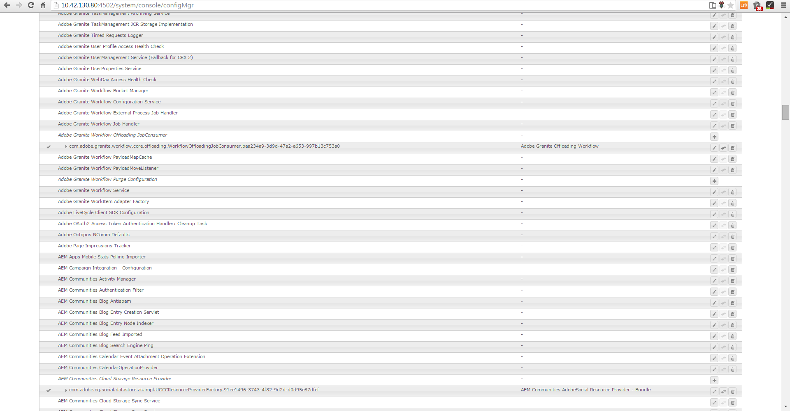

# Correspondentie maken{#create-correspondence}

## E-mailcorrespondentie maken in de gebruikersinterface Correspondentie maken {#create-correspondence-in-the-create-correspondence-user-interface}

Nadat het a [ brievenmalplaatje in het Beheer van de Correspondentie ](../../forms/using/create-letter.md) wordt gecreeerd, kan het eind - gebruiker/agent/bewering aanpast de brief in het Create de gebruikersinterface van de Correspondentie openen en tot een correspondentie leiden door gegevens in te gaan, inhoud te vestigen, en gehechtheid te beheren. Tot slot kan de eisencorrector of de agent de inhoud in de voorvertoningsmodus beheren en de brief verzenden.

### Een voorbeeld van een overeenkomst bekijken {#preview-a-correspondence}

Selecteer de brief aan voorproef gebruikend de volgende stappen:

1. Voor de pagina van Letters, uitgezochte **Uitgezochte**.
1. Selecteer de gewenste letter door erop te tikken.

   

   Letter selecteren

1. Voor een op Woordenboek van Gegevens gebaseerde brief, uitgezochte **Voorproef** > **Voorproef**. Of voor een op niet-gegeven-Woordenboek-gebaseerde brief, uitgezochte **Voorproef**. U kunt de muisaanwijzer ook boven een letter plaatsen (zonder deze te selecteren) en het pictogram Lettertypevoorvertoning selecteren om een voorvertoning van de letter weer te geven.

   >[!NOTE]
   >
   >Als er geen gegevenswoordenboek aan de letter is gekoppeld, wordt de lettervoorvertoning geopend. Als de letter anders is gebaseerd op gegevenswoordenboeken, worden in het menu Voorbeeld van Correspondentenbeheer de opties Voorbeeld en Aangepast weergegeven en kunt u een van de twee opties selecteren. U kunt testgegevens ook koppelen aan een gegevenswoordenboek. Wanneer het [ Woordenboek van Gegevens testgegevens ](../../forms/using/data-dictionary.md#p-working-with-test-data-p) heeft geassocieerd, dan bij het selecteren van de voorproefoptie, opent de normale voorproef met de bevolkte testgegevens.

1. Als u een correspondentie wilt kunnen weergeven terwijl u een voorvertoning weergeeft, moet u een beheerder of een deel van een van de volgende groepen zijn:

   * formulieren-gebruikers (voor voorbeeld op auteurinstantie)
   * cm-agent-gebruikers (voor vertoning op publicatieinstantie)

   Als u niet de vereiste toestemmingen hebt, verzoek admin voor de aangewezen toegang. Voor meer informatie bij het creëren van en het toevoegen van gebruikers aan groepen, zie [ Toevoegend Gebruikers of Groepen aan een Groep ](/help/sites-administering/security.md). Als u een correspondentie probeert terug te geven zonder de aangewezen toestemmingen te hebben, verschijnt de 404 foutenpagina.

1. Als u **Voorproef** > **Douane** hebt geselecteerd, opent een dialoog. In de dialoog, selecteer een gegevensdossier, die aan het gegevenswoordenboek beantwoorden, om de brief met te voorproef en dan **Voorproef** te selecteren. Er wordt een gegevensbestand gemaakt op basis van een gegevenswoordenboek voor een specifieke letter. Voor meer informatie over het gegevensdossier, zie [ Woordenboek van Gegevens ](../../forms/using/data-dictionary.md#p-working-with-test-data-p).

   

1. De HTML-voorvertoning met de letter (voorvertoning voor mobiele formulieren) wordt standaard geopend en het tabblad Gegevens krijgt de focus.

   Voor meer informatie over mobiele vormen en de eigenschappen die zij steunen, zie [ verschil van de Eigenschap tussen Mobiele Forms en PDF forms ](https://helpx.adobe.com/livecycle/help/mobile-forms/feature-differentiation-mobile-forms-pdf.html).

   Er zijn drie tabbladen: gegevens, inhoud en bijlagen. Als er geen gegevenselementen zijn (plaatsaanduidingsvariabelen en layoutvelden), wordt de letter rechtstreeks geopend met het tabblad Inhoud weergegeven. Het tabblad Bijlagen is alleen beschikbaar wanneer bijlagen aanwezig zijn of bibliotheektoegang is ingeschakeld.

   >[!NOTE]
   >
   >Voor meer informatie bij het schakelen tussen de vertoningswijze van de HTML of van de PDF vertoning van brievenvoorproef, zie [ de vertoningswijze van de Vertoning van de Verandering van brief ](#changerenditionmode). Voor meer informatie over de steun van PDF in het Beheer en AEM van de Correspondentie, zie [ Sluiting van NPAPI browser stop-ins en zijn effect ](https://helpx.adobe.com/nl/acrobat/kb/change-in-support-for-acrobat-and-reader-plug-ins-in-modern-web-.html). <!-- and [PDF Forms to HTML5 Forms](https://helpx.adobe.com/aem-forms/kb/pdf-forms-to-html5-forms.html). THIS URL IS A 404 AND NO SUITABLE REPLACEMENT TOPIC WAS FOUND. CONSIDER DELETING OR ADDING NEW LINK. COMMENTING OUT SO USERS DON'T CLICK IT. -->

### Gegevens invoeren {#enterdata}

Vul op het tabblad Gegevens de beschikbare lay-outvelden en plaatsaanduidingen in.

1. Voer de vereiste gegevens- en inhoudsvariabelen in de velden in. Vul alle verplichte gebieden duidelijk met een asterisk (&#42;) om **toe te laten legt** knoop voor.

   Selecteer een gegevensveldwaarde in de voorvertoning van de HTML letter om het bijbehorende gegevensveld op het tabblad Gegevens te markeren.

    

### Inhoud beheren {#managecontent}

Beheer op het tabblad Inhoud de inhoud, zoals documentfragmenten en inhoudsvariabelen in de letter.

1. Selecteer **Inhoud**. Correspondence Management geeft het tabblad Inhoud van de brief weer.

   

1. Bewerk desgewenst de inhoudsmodules op het tabblad Inhoud. Als u de relevante inhoudsmodule in de inhoudshiërarchie de focus wilt geven, kunt u de desbetreffende regel of alinea in de lettervoorvertoning selecteren of de inhoudsmodule rechtstreeks in de inhoudshiërarchie selecteren.

   De regel &#39;&#39;We hebben reviseren...&#39;&#39; wordt bijvoorbeeld geselecteerd in de onderstaande afbeelding en de relevante inhoudsmodule wordt geselecteerd op het tabblad Inhoud.

   

   In de Inhoud of het lusje van Gegevens, door Hoogtepunt Geselecteerde Modules ( ) op hogere linkerzijde van de HTML brievenvoorproef, kunt u functionaliteit onbruikbaar maken of toelaten om naar de inhoud/gegevensmodule te gaan wanneer de relevante tekst, de paragraaf, of het gegevensgebied in de brievenvoorproef wordt geselecteerd.

   Voor meer informatie over de acties beschikbaar voor diverse modules in Create Correspondence gebruikersinterface, zie [ Acties en info beschikbaar in Create Correspondence gebruikersinterface ](#actions-and-info-available-in-the-create-correspondence-content-tab).

1. Gebruik het veld Zoeken om de inhoudsmodules te zoeken. Voer een volledige of gedeeltelijke naam of titel van de inhoudsmodule in om deze in de correspondentie te zoeken.
1. Selecteer het pictogram van de Vertoning ( ) vóór een lijst, tekst, voorwaarde, of doelgebied om het in de brief te tonen of te verbergen.
1. Om een gealigneerde of editable tekstmodule uit te geven, selecteer het relevante **uitgeven** pictogram ( ) of klik de relevante tekstmodule in de brievenvoorproef tweemaal.

   Het systeem geeft een teksteditor weer om de tekst te bewerken en op te maken.

   De standaardspellingcontrole in uw browser controleert spelling in de redacteur van de Tekst. Als u de spelling en grammatica wilt controleren, kunt u de instellingen voor spellingcontrole van uw browser bewerken of browserinsteekmodules/invoegtoepassingen installeren om de spelling en de grammatica te controleren.

   U kunt ook de verschillende sneltoetsen in de teksteditor gebruiken voor het beheren, bewerken en opmaken van tekst. Voor meer informatie over [&#128279;](/help/forms/using/keyboard-shortcuts.md#correspondence-management) toetsenbordkortere weg van de Redacteur van de Tekst van 0&rbrace; &lbrace;in de Sneltoetsen van het Beheer van de Correspondentie.

   

   U kunt een van meerdere alinea&#39;s tekst die in een andere toepassing van het document voorkomen, opnieuw gebruiken. U kunt tekst rechtstreeks kopiëren en plakken, zoals van MS Word-, HTML-pagina&#39;s of een andere toepassing.

   U kunt een of meer alinea&#39;s tekst in een bewerkbare tekstmodule kopiëren en plakken. U hebt bijvoorbeeld een MS Word-document met een lijst met geldige verblijfstitels, zoals:

   

   U kunt de tekst rechtstreeks vanuit het MS Word-document naar een bewerkbare tekstmodule kopiëren en plakken. De opmaak, zoals een lijst met opsommingstekens, lettertype en tekstkleur, blijft behouden in de tekstmodule.

   

   >[!NOTE]
   >
   >Het formatteren van gekleefde tekst, echter, heeft sommige [ beperkingen ](https://helpx.adobe.com/aem-forms/kb/cm-copy-paste-text-limitations.html).

   Met de Tab-toets kunt u de tekst en de nummers in de letter laten inspringen. Met de Tab-toets kunt u bijvoorbeeld meerdere tekstkolommen in een lijst uitlijnen in een tabelindeling.

   

   Voorbeeld: met de Tab-toets meerdere tekstkolommen uitlijnen in een tabellarische indeling

   >[!NOTE]
   >
   >Voor meer informatie bij vestiging lusje het uit elkaar plaatsen voor uw tekstmodules en brieven, zie [ Meer informatie bij het gebruiken van lusje het uit elkaar plaatsen voor het schikken van tekst ](https://helpx.adobe.com/aem-forms/kb/cm-tab-spacing-limitations.html).

1. Voeg zo nodig speciale tekens in de correspondentie in. U kunt bijvoorbeeld het palet Speciale tekens gebruiken om het volgende in te voegen:

   * Valutasymbolen zoals €, ¥ en £
   * Wiskundige symbolen zoals A, Ö, ∂ en ^
   * Interpunctiesymbolen zoals ‟ en &quot;

   

   Correspondence Management biedt ondersteuning voor 210 speciale tekens. Admin kan [ steun voor meer/douane speciale karakters door aanpassing ](../../forms/using/custom-special-characters.md) toevoegen.

1. Als u\gedeelten van tekst in een bewerkbare inline-module wilt benadrukken, selecteert u de tekst en selecteert u Markeringskleur.

   

   U kunt of een basiskleur `**[A]**` direct selecteren in het Basispalet van Kleuren of **Uitgezocht** selecteren na het gebruiken van de schuif `**[B]**` om de aangewezen schaduw van de kleur te kiezen.

   U kunt ook naar het tabblad Geavanceerd gaan om de juiste kleurtoon, helderheid en verzadiging `**[C]**` te selecteren en vervolgens Selecteren `**[D]**` selecteren om de tekst te markeren.

   

1. Maak de aangewezen inhoud en formaatveranderingen en selecteer **sparen**. Selecteer ( ) zich tussen editable tekstmodules te bewegen, of **te selecteren sparen en daarna** om de veranderingen te bewaren en naar de volgende editable tekstmodule te bewegen.
1. Het systeem geeft ook de niet-ingevulde variabelen voor elk van de vertakkingen weer. Wanneer er geen niet-gevulde variabelen zijn, worden niet-gevulde variabelen weergegeven als 0. Als er een variabele zonder vulling is, kunt u een vertakking selecteren om deze uit te breiden en de variabele zonder vulling te zoeken. Gebruik de inhoudwerkbalk om inhoud te verwijderen, de inspringing van de inhoud te vergroten/verkleinen en pagina-einden voor/na de inhoud in te voegen.

   U kunt pagina-einden boven en onder gegevensmodules invoegen, zelfs als deze deel uitmaken van lijsten en voorwaarden.

1. Selecteer Open/Sluiten de Variabele van de Inhoud ( ) om de inhoudsvariabelen te openen en hen te vullen geschikt.
1. Wanneer u de niet-gevulde variabele correct hebt ingevuld, wordt het aantal niet-gevulde variabelen ingesteld op 0.

   In het Create de gebruikersinterface van de Correspondentie, wordt het niet gevulde veranderlijke aantal getoond op elk niveau van de hiërarchie van om het even welke module die minstens één variabele bevat. Als een module niet-gevulde variabelen bevat, wordt de telling getoond bij de variabele, de module, het doelgebied, en het niveau van de brievenmalplaatje.

   Het aantal niet-gevulde variabelen bevat:

   * Alleen variabelen voor niet-beveiligd gegevenswoordenboek en plaatsaanduiding. Het aantal variabelen omvat geen variabelen voor de indeling of het beveiligde gegevenswoordenboek.
   * Verplichte velden.
   * Indelingsvelden als deze verplicht zijn en aan de gebruiker zijn gebonden.
   * Alleen instanties van unieke variabelen. Als een module, doelgebied of lettertypesjabloon twee of meer exemplaren van dezelfde variabele bevat, wordt de telling weergegeven als 1 (één). Nochtans, voor elk van de instanties, wordt de telling getoond als 1.

   Het aantal niet-gevulde variabelen bevat geen niet-geselecteerde modules. Als een module is opgenomen in een lettertypesjabloon maar niet in de letter staat, wordt de telling voor niet-gevulde variabelen in deze module niet weergegeven.

   Voor het doelgebied, de module, en de variabele wordt de telling getoond rechts van elk voorwerp in het brievenmalplaatje. Voor de volledige sjabloon wordt het aantal echter weergegeven in de statusbalk voor correspondentie maken.

   De modules in een lettertypesjabloon geven het aantal niet-gevulde variabelen weer zoals hieronder wordt beschreven:

   * **Tekst** toont de som unieke niet gevulde placeholder variabelen en de elementen van het gegevenswoordenboek in de tekstmodule.
   * **Voorwaarde** toont de som unieke niet gevulde voorwaardenvariabelen in de voorwaarde en de variabelen bevat in de resulterende modules.
   * **Lijst** toont de som alle unieke niet gevulde variabelen in de modules die aan de lijst worden toegewezen.
   * **het gebied van het Doel** toont de som alle unieke niet gevulde variabelen in de modules die aan het doelgebied worden toegewezen.

   Let op het volgende met betrekking tot variabelen met standaardwaarden:

   * Een veranderlijk gebied Van Boole blijft aan *vals* in gebreke. De variabele wordt echter als niet-gevuld beschouwd. Dit impliceert dat de veranderlijke telling alle veranderlijke gebieden Van Boole met waarde *vals* omvat.

   * Een numeriek veranderlijk gebied blijft aan *0 (nul)* in gebreke. De variabele wordt echter als niet-gevuld beschouwd. Dit impliceert dat de veranderlijke telling alle numerieke veranderlijke gebieden met waarde *0 (nul)* omvat.

#### Handelingen en informatie beschikbaar op het tabblad Correspondentie-inhoud maken {#actions-and-info-available-in-the-create-correspondence-content-tab}

**Gebied van het Doel**

* Lege regel invoegen: voegt nieuwe lege regel in.
* Inline-tekst invoegen: hiermee wordt een nieuwe tekstmodule ingevoegd.
* Order Lock (info): geeft aan dat de volgorde van de inhoud niet kan worden gewijzigd.
* Niet-gevulde waarden (info): geeft het aantal niet-gevulde variabelen in het doelgebied aan.

**Module**

* Selectie (oogpictogram): hiermee\tSluit de module uit van de letter.
* Opsommingstekens overslaan (van toepassing op lijstmodules en de bijbehorende onderliggende modules): hiermee slaat u opsommingstekens over in een bepaalde module.
* Pagina-einde vóór (van toepassing op onderliggende modules van het doelgebied): voegt vóór de module een pagina-einde in.
* Pagina-einde na (van toepassing op onderliggende modules van het doelgebied): voegt vóór de module een pagina-einde in.
* Niet-gevulde waarden (info): geeft het aantal niet-gevulde variabelen in het doelgebied aan.
* Bewerken (alleen tekstmodules): RTF-editor openen voor het bewerken van de tekstmodule.
* Deelvenster Gegevens (modules tekst en voorwaarde): open alle variabelen van de module.

**Module van de Lijst**

* Lege regel invoegen: voegt nieuwe lege regel in.
* Inhoudsbibliotheek: opent de inhoudsbibliotheek om modules aan de lijst toe te voegen.
* Lijstinstelling (alleen geneste lijst):
* Order Lock (info): geeft aan dat de volgorde van de lijstitems niet kan worden gewijzigd.

### Bijlagen beheren {#manage-attachments}

1. Selecteer **Gehechtheid**. Met Correspondentiebeheer worden de beschikbare bijlagen weergegeven, zoals ingesteld tijdens het maken van de lettertypesjabloon.
1. U kunt ervoor kiezen geen bijlage samen met de letter te verzenden door op het weergavepictogram te tikken en u kunt het kruis in de bijlage selecteren om het uit de letter te verwijderen. Voor de opgegeven bijlagen worden tijdens het maken van een lettertypesjabloon (verplicht) de pictogrammen Weergeven en Verwijderen uitgeschakeld.
1. Selecteer het pictogram van de Toegang van de Bibliotheek ( ) om tot de Bibliotheek van de Inhoud toegang te hebben om activa DAM als gehechtheid op te nemen.

   >[!NOTE]
   >
   >Bibliotheektoegangspictogram is alleen beschikbaar als bibliotheektoegang is ingeschakeld tijdens het ontwerpen van de letter.

1. Als de volgorde van de bijlagen niet is vergrendeld tijdens het maken van de overeenkomst, kunt u de bijlagen opnieuw ordenen door een bijlage te selecteren en op de pijl omlaag en omhoog te tikken.

   Voor meer informatie, zie [ levering van de Bijlage ](#attachmentdelivery).

### Inhoud in voorvertoning beheren en de brief verzenden {#manage-content-in-preview-and-submit-the-letter}

U kunt de lay-out en de inhoud aanpassen om ervoor te zorgen dat de brief de manier kijkt u het aan en voorlegt aan de diverse postprocessen.

1. Om alle editable inhoud in de brief te benadrukken, selecteer **Bewerkbare Secties van het Hoogtepunt**.

   De bewerkbare inhoud van de letter wordt gemarkeerd met een grijze achtergrond.

   

1. Bewerk desgewenst de inhoudsmodules op het tabblad Inhoud. Als u de relevante inhoudsmodule in de inhoudshiërarchie de focus wilt geven, kunt u de desbetreffende regel of alinea in de lettervoorvertoning selecteren of de inhoudsmodule rechtstreeks in de inhoudshiërarchie selecteren.

   De regel &quot;Toegang verlenen tot...&quot; wordt bijvoorbeeld in de onderstaande afbeelding geselecteerd en de bijbehorende inhoudsmodule op het tabblad Inhoud geselecteerd.

   Door de Geselecteerde Modules van het Hoogtepunt in Inhoud te tikken ( ), kunt u functionaliteit onbruikbaar maken of toelaten om de inhoudsmodule op het lusje van de Inhoud te benadrukken wanneer de relevante tekst, de paragraaf, of het gegevensgebied in de brievenvoorproef wordt getikt.

   Voor meer informatie over de acties beschikbaar voor diverse modules in Create Correspondence gebruikersinterface, zie [ Acties en info beschikbaar in Create Correspondence gebruikersinterface ](#actions-and-info-available-in-the-create-correspondence-content-tab).

1. Als u een pagina-einde aan de letter wilt toevoegen, selecteert u waar u een pagina-einde wilt invoegen en selecteert u Pagina-einde voor of Pagina-einde na (  ).

   Er wordt een expliciete tijdelijke aanduiding voor een pagina-einde ingevoegd in de letter. Zie de voorvertoning van de afgevlakte PDF als u wilt zien hoe een expliciet pagina-einde de letter beïnvloedt.

   >[!NOTE]
   >
   >Aangezien mobiele formulieren geen ondersteuning bieden voor pagina-einden, worden kop- en voetteksten slechts eenmaal weergegeven. U kunt kop- en voetteksten echter expliciet instellen in de indeling (per pagina), zodat deze worden weergegeven in de voorvertoning van mobiele formulieren. Eventuele lege pagina&#39;s in de letter worden ook niet weergegeven in de voorbeeldweergave van mobiele formulieren.

   

1. Als u de brief wilt opslaan als een concept, waaraan u later kunt blijven werken, selecteert u Opslaan als concept. Om deze optie te gebruiken, moet uw brief [ worden gepubliceerd ](../../forms/using/publishing-unpublishing-forms.md#publishanasset). Voor meer informatie, zie de Instantie van het Ontwerp onder [ Besparend concepten en het voorleggen van brieveninstanties ](#savingdrafts).

   

   Het dialoogvenster Letternaam concept wordt weergegeven met de id van het lettertype. U kunt deze id desgewenst bewerken. Maak een nota van briefIdentiteitskaart en selecteer dan **Gereed**. U kunt dit identiteitskaart aan [ later gebruiken herlaad de ontwerp brief ](submit-letter-topostprocess.md#reloaddraft).

1. Om de brief als afgevlakte PDF met de nauwkeurige lay-out en de pagina onderbrekingen voor te vertonen aangezien het zal worden voorgelegd, uitgezochte ( ) Voorproef.

   De letter wordt weergegeven als een samengevoegde PDF. De afgevlakte PDF is de exacte weergave van de letter zoals deze wordt verzonden met de juiste lettertypen, onderbrekingen en layout van de letter.

   >[!NOTE]
   >
   >Als u Mozilla Firefox en het type van de vertoning van HTML gebruikt, om de brief als afgevlakte PDF te voorproef, zorg ervoor dat u de inheemse browser stop-in en niet de stop van Acrobat gebruikt. Als u de eigen browserplug-in wilt selecteren, gaat u naar de instellingen van Mozilla Firefox en selecteert u Voorvertoning in Firefox voor inhoudstype PDF.

1. Als u de afgevlakte voorproef van de PDF bevredigend vindt, uitgezochte **legt** voor om de brief voor te leggen. Of, om de brief te veranderen, uitgezochte **Voorproef van de Uitgang** om terug naar de Create Voorproef van de Correspondentie UI van de brief te gaan om veranderingen in de brief aan te brengen. Wanneer u Verzenden selecteert, wordt de verzendinstantie gegenereerd als de configuratie Letterinstantie beheren is ingeschakeld in de Publish-instantie.

   Voor meer informatie, zie de Instantie van het Ontwerp onder het Opslaan van concepten en het voorleggen van brievenexemplaren.

   U kunt de brief als ontwerp ook bewaren om de brief later te veranderen.

   Nadat u de vereiste wijzigingen hebt aangebracht, kunt u de letter verzenden vanuit de HTML5-voorvertoning of nogmaals Voorvertoning selecteren om de afgevlakte PDF-uitvoer te bekijken.

   Voor informatie over verschillen tussen HTML5 vormen en PDF forms, zie [ verschil van de Eigenschap tussen HTML5 vormen en PDF forms ](../../forms/using/feature-differentiation-html5-forms-pdf-forms.md).

## Concepten opslaan en briefinstanties verzenden {#savingdrafts}

Wanneer een letter wordt weergegeven in de gebruikersinterface Correspondentie maken, kunt u de letter opslaan als een brief die wordt weergegeven.

Er zijn twee typen lettertypen die kunnen worden opgeslagen: Conceptinstantie en Submit-instantie.

* **Instantie van het Ontwerp**: De instantie van het Ontwerp vangt de huidige staat van de brief u previewing. Als u een conceptinstantie wilt opslaan, moet u eerst zorgen dat de letter en alle elementen waarnaar de letter verwijst, de status Published hebben. Voor informatie bij het publiceren van een brief, zie [ Publish en activa ](../../forms/using/publishing-unpublishing-forms.md#publishanasset). U moet een brief Publish alvorens u het als ontwerp kon bewaren, omdat wanneer u een brief publiceert, u een versie van de brief, zijn afhankelijke activa, en gegevens op dat punt creeert. De gepubliceerde versie van een brief kan niet door u of een andere gebruiker worden uitgegeven en kan later zonder onverwachte verschillen van de gepubliceerde versie worden hersteld. U kunt later terugkeren naar dit exemplaar en verdergaan vanaf het punt waar u wegging.

* **legt Instantie** voor: legt instanties voor vangt de staat van brief aangezien het wordt voorgelegd. Met Verzenden wordt de PDF-status van de letter opgeslagen nadat deze is verwerkt samen met de gegevens die door de gebruiker zijn ingevoerd in de gebruikersinterface Correspondentie maken.

Dergelijke exemplaren kunnen alleen worden opgeslagen wanneer de brief in een publicatieexemplaar wordt weergegeven. Het opslaan op instanties is standaard uitgeschakeld. Voer de volgende stappen uit om het opslaan van lettervarianten in te schakelen.

1. Open in AEM de webconsoleconfiguratie van Adobe Experience Manager voor uw server met de volgende URL: https://&lt;port>:/&lt;contextpath>/system/console/configMgr
1. Zoek **[!UICONTROL Correspondence Management Configurations]** en klik erop.
1. Controleer de **[!UICONTROL Manage Letter Instances on Publish]** -configuratie en klik op **[!UICONTROL Save]** .

### Conceptfunctie opslaan inschakelen {#enable-save-draft-feature}

Voordat u letters publiceert of concepten opslaat op de publicatie-instantie, voert u de volgende stappen uit op de auteur- en publicatie-instantie om de functie Opslaan als concept in te schakelen:

*cq:lastReplicationAction*, *cq:gelastrepliceerde* en *cq:lastReplicatedBy* eigenschappen worden niet overgedragen om instantie door gebrek te publiceren. Om over *cq over te dragen:lastReplicationAction*, *cq:lastreplicated* en *cq:lastReplicatedBy* eigenschappen om instantie te publiceren, maak de [!UICONTROL com.day.cq.replication.impl.ReplicationPropertiesFilterFactory] component onbruikbaar. De component uitschakelen:

1. Open de Adobe Experience Manager Web Console Components Console in de auteurinstantie. De standaard-URL is `http://author-server:port/system/console/components`

1. Zoek naar de **[!UICONTROL com.day.cq.replication.impl.ReplicationPropertiesFilterFactory]** component.

1. Klik  pictogram om de [!UICONTROL com.day.cq.replication.impl.ReplicationPropertiesFilterFactory] component onbruikbaar te maken.

Als u de functie Opslaan als concept wilt inschakelen, vervangt u de bestaande URL bij [!UICONTROL VersionRestoreManager Author URL] door de URL van de auteur. De URL vervangen:

1. Open [!UICONTROL Aode Manager Web Console Configuration] in de publicatie-instantie. De standaard-URL is `https://publish-server:port/system/console/configMgr`

1. Zoek en open de component **[!UICONTROL Correspondence Management - Author instance Version Restore configurations]** .

1. Zoek het veld **[!UICONTROL VersionRestoreManager Author URL]** en geef de URL voor de auteurinstantie op.

1. Klik op Opslaan.

Wanneer het opslaan van lettervarianten is ingeschakeld, kunt u kiezen waar u de lettervarianten wilt opslaan. Er zijn twee opties om de lettervarianten op te slaan: Lokaal opslaan of Extern opslaan.

### Lokaal opslaan {#local-save}

Letter-instanties worden opgeslagen op de publicatie-instantie en worden omgekeerd gerepliceerd op de auteurinstantie.

### Extern opslaan {#remote-save}

Deze optie is beschikbaar voor mensen die zich zorgen maken over het opslaan van gebruikersgegevens bij publicatie-instanties, die doorgaans buiten de bedrijfsfirewall vallen. Wanneer extern opslaan is ingeschakeld, worden de lettervarianten niet opgeslagen op een publicatieexemplaar, maar op afstand opgeslagen op de verwerkingsauteur die is opgegeven via de LiveCycle Client SDK-configuraties.

#### Extern opslaan inschakelen {#enable-remote-save}

1. Open in AEM Adobe Experience Manager Web Console Configuration voor uw server met behulp van de volgende URL: `https://<server>:<port>/<contextpath>/system/console/configMgr`
1. Zoek naar **[!UICONTROL Correspondence Management Configurations]** en klik het.
1. Zoek de **[!UICONTROL Remote Save]** -configuratie, controleer deze en klik op **[!UICONTROL Save]** .

#### Instellingen van de verwerkingsauteur opgeven {#specify-processing-author-settings}

1. Open in AEM Adobe Experience Manager Web Console Configuration voor uw server met behulp van de volgende URL: `https://<server>:<port>/system/console/configMgr`

   

1. Voor deze pagina, bepaal de plaats van de Configuratie van SDK van de Cliënt van het LiveCycle van de Adobe en breid het uit door het te klikken.

1. In de Server URL van de Verwerking, ga de naam van uw server van het LiveCycle in, verstrek de login informatie, en klik dan **sparen**.

    in

1. Stel zo nodig de gebruikersnaam en het wachtwoord in waarmee u toegang wilt krijgen tot de server.

#### Oplevering van bijlage {#attachmentdelivery}

* De letterbijlagen zijn beschikbaar na het proces in de PDF, die wordt gemaakt na het verzenden van de brief.
* Wanneer de Letter wordt gerenderd met server-side API&#39;s als een interactieve of niet-interactieve PDF, bevat de gerenderde PDF bijlagen als PDF-bijlagen.
* Wanneer een postproces verbonden aan een brievenmalplaatje als deel van de Verzenden of Volledige verrichtingen van de Correspondentie gebruikend de Create Correspondentie gebruikersinterface wordt geladen, worden de gehechtheid overgegaan als Lijst&lt;com.adobe.idp.Document> in parameter AttachmentDocs.
* De leveringsmechanismen buiten de verpakking, zoals e-mail en Druk af, leveren ook bijlagen samen met de PDF van de gegenereerde correspondentie.

## Uitvoermodi van lettertypevoorvertoning: mobiele formulieren voorvertonen en PDF voorvertonen {#rendition-modes-of-letter-preview-mobile-forms-preview-and-pdf-preview}

In AEM Forms Correspondence Management wordt een letter als HTML weergegeven in de gebruikersinterface Correspondentie maken. Correspondentiebeheer biedt echter nog steeds ondersteuning voor het terugkeren naar de voorvertoning van de PDF in plaats van de voorvertoning van de HTML. Voor meer informatie bij het schakelen tussen HTML en de wijze van PDF van voorproef, zie [ de vertoningswijze van de Vertoning van de Verandering van brief ](#changerenditionmode).

Hieronder vindt u de voordelen en functionaliteit die beschikbaar zijn in de HTML- en PDF-voorvertoning.

**Voordelen van mobiele vormen/HTML voorproef**

* **selecteer een waarde van het gegevensgebied om het overeenkomstige gegevensgebied** te benadrukken: In Create Correspondence gebruikersinterface, kunt u een waarde van het gegevensgebied in de brief selecteren om het overeenkomstige gegevensgebied op het lusje van Gegevens te benadrukken. Voor meer informatie, zie [ gegevens ](#enterdata) ingaan.

* **Browser steun**: Browsers een terugtrekkende steun voor NPAPI geleidelijk, die PDF voorproef van brief beïnvloedt. Dit heeft geen invloed op de voorbeeldweergave van HTML/mobiele formulieren.
* **benadruk editable inhoud in een brief**: In het Create de gebruikersinterface van de Correspondentie, kunt u de Bewerkbare Inhoud van het Hoogtepunt selecteren om alle editable inhoud in de brief in grijs te benadrukken. Voor meer informatie, zie [ inhoud ](#managecontent) beheren.

`<li>` `<li>Benefits of HTML preview  <ul>   <li>Right to left</li>   <li>NPAPI</li>   <li>Highlight Editable Content</li>  </ul> </li>` `<li>Benefits of PDF preview  <ul>   <li>Page Break</li>   <li>Final Preview</li>  </ul> </li>`
`<li>` `<li>Benefits of HTML preview  <ul>   <li>Right to left</li>   <li>NPAPI</li>   <li>Highlight Editable Content</li>  </ul> </li>` `<li>Benefits of PDF preview  <ul>   <li>Page Break</li>   <li>Final Preview</li>  </ul> </li>` **Voordelen van de voorproef van PDF**

* **de onderbreking van de Pagina**: In de voorproef van de PDF, kunt u precies bekijken hoe de pagina in de brief zijn output beïnvloedt.
* **Definitieve voorproef**: In de voorproef van PDF, kunt u het nauwkeurige formatteren en de verschijning van de brief bekijken aangezien de brief in zijn output zal verschijnen.

Voor informatie bij scripting steun in PDF forms, zie [ Scripting Steun ](https://help.adobe.com/en_US/livecycle/11.0/ScriptingSupport/index.html).

Voor meer informatie bij scripting steun in vormen HTML5, zie [ Scripting steun voor vormen HTML5 ](/help/forms/using/scripting-support.md).

### Weergavemodus van letter wijzigen {#changerenditionmode}

Standaard gebruikt de gebruikersinterface Correspondentie maken de HTML- of mobiele formulieren om de lettertypevoorvertoning weer te geven. De voorvertoning van mobiele formulieren geeft in geen enkele browser een renderingprobleem omdat deze de native plug-in van de browser gebruikt en geen extra plug-ins nodig heeft. U kunt de modus voor lettertypevoorvertoning wijzigen in PDF. Browserbeperkingen kunnen echter problemen veroorzaken voor verschillende functies van de interactieve PDF-voorvertoning van de letter.

Voor meer informatie over browser verenigbaarheid met brievenvoorproef, zie [ Sluiting van NPAPI browser stop-ins en zijn effect ](https://helpx.adobe.com/nl/acrobat/kb/change-in-support-for-acrobat-and-reader-plug-ins-in-modern-web-.html).

Voer de volgende stappen uit om de modus Voorvertoning van de letter te wijzigen:

1. Ga naar `https://[system]:'port'/system/console/configMgr` en meld u indien nodig aan als Admin.
1. Ga naar **[!UICONTROL Correspondence Management Configurations]** > **[!UICONTROL Rendition Type]** en selecteer **Vertoning van de HTML** (Gebrek) of **Vertoning van de PDF**.
1. Klik op **[!UICONTROL Save]**.
