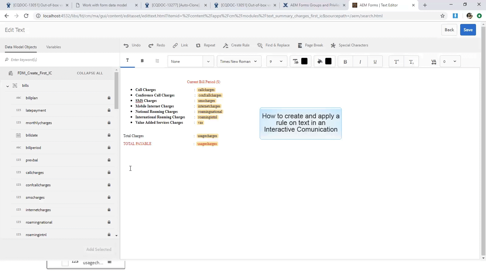

# Zelfstudie: Documentfragmenten maken{#tutorial-create-document-fragments}

Deze zelfstudie is een stap in de serie [Maak uw eerste interactieve communicatiemodellen](/help/forms/using/create-your-first-interactive-communication.md). U wordt aangeraden de reeks in chronologische volgorde te volgen om het volledige gebruik van de zelfstudie te begrijpen, uit te voeren en aan te tonen.

Documentfragmenten zijn herbruikbare componenten van een correspondentie die worden gebruikt om een interactieve communicatie samen te stellen. De documentfragmenten zijn van de volgende typen:

* Tekst - Een tekstelement is een stuk inhoud dat bestaat uit een of meer tekstalinea&#39;s. Een alinea kan statisch of dynamisch zijn.
* List - List is een groep documentfragmenten, waaronder tekst, lijsten, voorwaarden en afbeeldingen.
* Voorwaarde - De Voorwaarden laten u toe om te bepalen welke inhoud inbegrepen in Interactieve Mededeling wordt gebaseerd op de gegevens die van het Model van de Gegevens van het Vorm worden ontvangen.

Deze zelfstudie begeleidt u door de stappen om veelvoudige fragmenten van het tekstdocument tot stand te brengen die op de anatomie worden gebaseerd die in [Plan de Interactieve Communicatie](/help/forms/using/planning-interactive-communications.md) sectie wordt verstrekt. Aan het einde van deze zelfstudie kunt u het volgende doen:

* Documentfragmenten maken
* Variabelen maken
* Regels maken en toepassen

Hier volgt een lijst met documentfragmenten die in deze zelfstudie worden gemaakt:

* [Details van facturering](../../forms/using/create-document-fragments.md#step-create-bill-details-text-document-fragment)
* [Klantgegevens](../../forms/using/create-document-fragments.md#step-create-customer-details-text-document-fragment)
* [Overzicht van Bill](../../forms/using/create-document-fragments.md#step-create-bill-summary-text-document-fragment)
* [Overzicht van kosten](../../forms/using/create-document-fragments.md#step-create-summary-of-charges-text-document-fragment)

Elk documentfragment bevat velden met statische tekst, gegevens die zijn ontvangen van het formuliergegevensmodel en gegevens die zijn ingevoerd met de gebruikersinterface van de agent. Al deze gebieden zijn getoond in [Plan de Interactieve Communicatie](/help/forms/using/planning-interactive-communications.md) sectie.

Terwijl het creëren van documentfragmenten in dit leerprogramma, worden de variabelen gecreeerd voor gebieden die gegevens gebruikend de Agent UI ontvangen.

Gebruik **FDM_Create_First_IC**, zoals beschreven in de sectie [Formuliergegevensmodel maken](../../forms/using/create-form-data-model0.md), als het formuliergegevensmodel om documentfragmenten te maken in deze zelfstudie.

## Stap 1: Tekstdocumentfragment {#step-create-bill-details-text-document-fragment} maken met Bill Details

Het documentfragment Bill Details bevat de volgende velden:

| Veld | Gegevensbron |
|---|---|
| Factuurnummer | Gebruikersinterface van agent |
| Bill Period | Gebruikersinterface van agent |
| Bill Date | Gebruikersinterface van agent |
| Uw abonnement | Formuliergegevensmodel |

Voer de volgende stappen uit om variabelen voor gebieden met Agent UI als gegevensbron tot stand te brengen, statische teksten tot stand te brengen, en de modelelementen van het de vormgegevensmodel in het documentfragment te gebruiken:

1. Selecteer **[!UICONTROL Forms]** > **[!UICONTROL Document Fragments]**.

1. Selecteer **Maken** > **Tekst**.
1. Geef de volgende informatie op:

   1. Typ **bill_details_first_ic** als naam in het veld **Title**. De titel wordt automatisch ingevuld in het veld **Naam**.

   1. Selecteer **Formuliergegevensmodel** in de sectie **Gegevensmodel**.

   1. Selecteer **FDM_Create_First_IC** als het formuliergegevensmodel en tik **Select**.

   1. Tik **Volgende**.

1. Selecteer het tabblad **Variabelen** in het linkerdeelvenster en tik op **Maken**.
1. In de sectie **Variabele maken**:

   1. Ga **InvoiceNumber** als naam van de variabele in.
   1. Selecteer **String** als type.
   1. Tik **Maken**.

   

   Herhaal stap 4 en 5 om de volgende variabelen te maken:

   * Billperiod: Het type String
   * BillDate: Het type Date

   

1. Maak statische tekst voor de volgende velden met behulp van het rechterdeelvenster:

   * Factuurnummer
   * Bill Period
   * Bill Date
   * Uw abonnement

   

1. Plaats de curseur naast **Flaat nr.** en klik **InvoiceNumber** veranderlijk van **Variabelen** in de linkerruit tweemaal.
1. Plaats de curseur naast **de Periode van de Rekening** gebied en klik **Billperiod** veranderlijk tweemaal.
1. Plaats de curseur naast **de Datum van de Rekening** gebied en klik **Bill Date** variabele tweemaal.
1. Selecteer het tabblad **Gegevensmodelobjecten** in het linkerdeelvenster.
1. Plaats de cursor naast het veld **Uw abonnement** en dubbelklik op de eigenschap **customer** > **customerplan**.

   

1. Klik **Opslaan** om het tekstdocumentfragment Bill Details te maken.

## Stap 2: Tekstdocumentfragment {#step-create-customer-details-text-document-fragment} voor klantgegevens maken

Het documentfragment Customer Details bevat de volgende velden:

| Veld | Gegevensbron |
|---|---|
| Naam klant | Formuliergegevensmodel |
| Adres | Formuliergegevensmodel |
| Plaats van levering | Gebruikersinterface van agent |
| Statuscode | Gebruikersinterface van agent |
| Mobiel nummer | Formuliergegevensmodel |
| Alternatief contactnummer | Formuliergegevensmodel |
| Relatie-nummer | Formuliergegevensmodel |
| Aantal verbindingen | Gebruikersinterface van agent |

Voer de volgende stappen uit om variabelen voor gebieden met Agent UI als gegevensbron tot stand te brengen, statische teksten tot stand te brengen, en de modelelementen van het de vormgegevensmodel in het documentfragment te gebruiken:

1. Selecteer **[!UICONTROL Forms]** > **[!UICONTROL Document Fragments]**.
1. Selecteer **Maken** > **Tekst**.
1. Geef de volgende informatie op:

   1. Typ **customer_details_first_ic** als naam in het veld **Title**. De titel wordt automatisch ingevuld in het veld **Naam**.

   1. Selecteer **Formuliergegevensmodel** in de sectie **Gegevensmodel**.

   1. Selecteer **FDM_Create_First_IC** als het formuliergegevensmodel en tik **Select**.

   1. Tik **Volgende**.

1. Selecteer het tabblad **Variabelen** in het linkerdeelvenster en tik op **Maken**.
1. In de sectie **Variabele maken**:

   1. Voer **Placesupply** in als de naam van de variabele.
   1. Selecteer **String** als type.
   1. Tik **Maken**.

   Herhaal stap 4 en 5 om de volgende variabelen te maken:

   * Statcode: Het type Number
   * Nummerverbindingen: Het type Number

1. Selecteer het tabblad **Gegevensmodelobjecten**, plaats de cursor in het rechtervenster en dubbelklik op de eigenschap **customer** > **name**.
1. Druk op Enter om de cursor naar de volgende regel te verplaatsen en dubbelklik op de eigenschap **customer** > **address**.
1. Maak statische tekst voor de volgende velden met behulp van het rechterdeelvenster:

   * Mobiel nummer
   * Alternatief contactnummer
   * Plaats van levering
   * Relatie-nummer
   * Statuscode
   * Aantal verbindingen

   

1. Plaats de cursor naast het veld **Mobiel nummer** en dubbelklik op de eigenschap **klant** > **mobilenum**.
1. Plaats de cursor naast het veld **Alternatief contactnummer** en dubbelklik op de eigenschap** klant** > **alternatemobilenumber**.
1. Plaats de cursor naast het veld **Relationship Number** en dubbelklik op de eigenschap **customer** > **relationship number**.
1. Selecteer het **tabblad Variabelen**, plaats de cursor naast het veld **Plaats van levering** en dubbelklik op de variabele **Placesupply**.
1. Plaats de curseur naast het **gebied van de Code van de Staat** en klik **Statecode** variabele tweemaal.
1. Plaats de curseur naast **Aantal gebieden van Verbindingen** en klik **Numberconnections** veranderlijk tweemaal.

   

1. Klik op **Opslaan** om het tekstdocumentfragment Klantgegevens te maken.

## Stap 3: Samenvattingstekstdocumentfragment {#step-create-bill-summary-text-document-fragment} maken

Het documentfragment Bill Summary bevat de volgende velden:

| Veld | Gegevensbron |
|---|---|
| Vorig saldo | Gebruikersinterface van agent |
| Betalingen | Gebruikersinterface van agent |
| Aanpassingen | Gebruikersinterface van agent |
| Lopende factuurperiode | Formuliergegevensmodel |
| Te betalen bedrag | Gebruikersinterface van agent |
| Vervaldatum | Gebruikersinterface van agent |

Voer de volgende stappen uit om variabelen voor gebieden met Agent UI als gegevensbron tot stand te brengen, statische teksten tot stand te brengen, en de modelelementen van het de vormgegevensmodel in het documentfragment te gebruiken:

1. Selecteer **[!UICONTROL Forms]** > **[!UICONTROL Document Fragments]**.
1. Selecteer **Maken** > **Tekst**.
1. Geef de volgende informatie op:

   1. Typ **bill_summary_first_ic** als naam in het veld **Title**. De titel wordt automatisch ingevuld in het veld **Naam**.

   1. Selecteer **Formuliergegevensmodel** in de sectie **Gegevensmodel**.

   1. Selecteer **FDM_Create_First_IC** als het formuliergegevensmodel en tik **Select**.

   1. Tik **Volgende**.

1. Selecteer het tabblad **Variabelen** in het linkerdeelvenster en tik op **Maken**.
1. In de sectie **Variabele maken**:

   1. Voer **Previousbalance** in als de naam van de variabele.
   1. Selecteer **Number** als type.
   1. Tik **Maken**.

   Herhaal stap 4 en 5 om de volgende variabelen te maken:

   * Betalingen: Het type Number
   * Aanpassingen: Het type Number
   * Bedrag: Het type Number
   * Duur: Het type Date

1. Maak statische tekst voor de volgende velden met behulp van het rechterdeelvenster:

   * Vorig saldo
   * Betalingen
   * Aanpassingen
   * Lopende factuurperiode
   * Te betalen bedrag
   * Vervaldatum
   * Betalingskosten na vervaldatum zijn $ 20

   

1. Plaats de cursor naast het veld **Vorige balans** en dubbelklik op de variabele **Vorige balans**.
1. Plaats de cursor naast het veld **Payments** en dubbelklik op de variabele **Payments**.
1. Plaats de cursor naast het veld **Aanpassingen** en dubbelklik op de variabele **Aanpassingen**.
1. Plaats de cursor naast het veld **Bedrag verschuldigd** en dubbelklik op de variabele **Aantal**.
1. Plaats de curseur naast **Vervaldatum** gebied en klik **Duedate** variabele tweemaal.
1. Selecteer het tabblad **Gegevensmodelobjecten**, plaats de cursor naast het veld **Huidige factureringsperiode laden** in het rechtervenster en dubbelklik op de eigenschap **rekeningen** > **usageladingen**.

   

1. Klik op **Opslaan** om het tekstdocumentfragment Klantgegevens te maken.

## Stap 4: Samenvatting maken van tekstdocumentfragment {#step-create-summary-of-charges-text-document-fragment} laden

Het fragment Overzicht van ladingen bevat de volgende velden:

| Veld | Gegevensbron |
|---|---|
| Oproepkosten | Formuliergegevensmodel |
| Kosten voor conferentiegesprek | Formuliergegevensmodel |
| SMS-kosten | Formuliergegevensmodel |
| Mobiele internetkosten | Formuliergegevensmodel |
| Nationale roamingkosten | Formuliergegevensmodel |
| Internationale roamingkosten | Formuliergegevensmodel |
| Kosten voor toegevoegde services | Formuliergegevensmodel |
| Totale kosten | Formuliergegevensmodel |
| TOTAAL BETAALBAAR | Formuliergegevensmodel |

Voer de volgende stappen uit om statische tekst te maken en formuliergegevensmodelelementen in het documentfragment te gebruiken:

1. Selecteer **[!UICONTROL Forms]** > **[!UICONTROL Document Fragments]**.
1. Selecteer **Maken** > **Tekst**.
1. Geef de volgende informatie op:

   1. Typ **summary_charges_first_ic** als naam in het veld **Title**. De titel wordt automatisch ingevuld in het veld Naam.

   1. Selecteer **Formuliergegevensmodel** in de sectie **Gegevensmodel**.

   1. Selecteer **FDM_Create_First_IC** als het formuliergegevensmodel en tik **Select**.

   1. Tik **Volgende**.

1. Maak statische tekst voor de volgende velden met behulp van het rechterdeelvenster:

   * Oproepkosten
   * Kosten voor conferentiegesprek
   * SMS-kosten
   * Mobiele internetkosten
   * Nationale roamingkosten
   * Internationale roamingkosten
   * Kosten voor toegevoegde services
   * Totale kosten
   * TOTAAL BETAALBAAR

   

1. Selecteer het tabblad **Gegevensmodelobjecten**.
1. Plaats de curseur naast het **gebied van de Laden van de Vraag** en klik **rekeningen** > **calllades** bezit tweemaal.
1. Plaats de curseur naast het **gebied van de Vraag van de Conferentie** en klik **rekeningen** > **confcallladings** bezit tweemaal.
1. Plaats de cursor naast het veld **SMS Charges** en dubbelklik op de eigenschap **facetten** > **smesarges**.
1. Plaats de curseur naast het **Mobiele gebied van Internet Charges** en klik **rekeningen** > **onderlinge verbindings van netwerkeneigenschappen** tweemaal.
1. Plaats de cursor naast het veld **Nationale roamingkosten** en dubbelklik op de eigenschap **facetten** > **roamingnational**.
1. Plaats de cursor naast het veld **Internationale roamingkosten** en dubbelklik op de eigenschap **Bill** > **roamingintl**.
1. Plaats de curseur naast **Value Added Services Charges** gebied en klik **rekeningen** > **vas** bezit tweemaal.
1. Plaats de cursor naast het veld **Totale kosten** en dubbelklik op de eigenschap **nota** > **gebruiksheffingen**.
1. Plaats de cursor naast het veld **TOTAAL BETAALBAAR** en dubbelklik op de eigenschap **rekeningen** > **useLaks**.

   

1. Selecteer de tekst in **Value Added Services Charges** rij en tik **Create Rule** om een voorwaarde te maken op basis waarvan de rij wordt weergegeven in de Interactive Communication:
1. In het pop-upvenster **Regel maken**:

   1. Selecteer **Gegevensmodellen en Variabelen** en **rekeningen** > **calllades**.

   1. Selecteer **is minder dan** als exploitant.
   1. Selecteer **Number** en voer de waarde in als **60**.

   Gebaseerd op deze voorwaarde, wordt de rij van de Heffingen van de Diensten van de Waarde Toegevoegde getoond slechts als de waarde voor het gebied van de Heffingen van de Vraag minder dan 60 is.

   

1. Klik op **Opslaan** om de samenvatting van het fragment van het ladingstekstdocument te maken.
