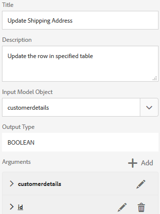

# Zelfstudie: Formuliergegevensmodel {#tutorial-create-form-data-model} maken

Deze zelfstudie is een stap in de serie [Uw eerste adaptieve vorm maken](../../forms/using/create-your-first-adaptive-form.md). U wordt aangeraden de reeks in chronologische volgorde te volgen om het volledige gebruik van de zelfstudie te begrijpen, uit te voeren en aan te tonen.

## Informatie over de zelfstudie {#about-the-tutorial}

AEM [!DNL Forms] de module van de gegevensintegratie van gegevens staat u toe om een model van vormgegevens van verschillende achterste gegevensbronnen zoals AEM gebruikersprofiel, RESTful Webdiensten, op SOAP-Gebaseerde Webdiensten, de diensten van OData, en relationele gegevensbestanden tot stand te brengen. U kunt gegevensmodelobjecten en -services configureren in een formuliergegevensmodel en deze koppelen aan een adaptief formulier. Adaptieve formuliervelden zijn gebonden aan objecteigenschappen van gegevensmodellen. Met deze services kunt u het aangepaste formulier vooraf invullen en ingediende formuliergegevens terugschrijven naar het gegevensmodelobject.

Zie [AEM Forms Data Integration](../../forms/using/data-integration.md) voor meer informatie over de integratie van formuliergegevens en het formuliergegevensmodel.

Deze zelfstudie begeleidt u door de stappen voor het voorbereiden, maken, configureren en koppelen van een formuliergegevensmodel aan een adaptief formulier. Aan het einde van deze zelfstudie kunt u het volgende doen:

* [MySQL-database configureren als gegevensbron](#config-database)
* [Formuliergegevensmodel maken met MySQL-database](#create-fdm)
* [Formuliergegevensmodel configureren](#config-fdm)
* [Formuliergegevensmodel testen](#test-fdm)

Het formuliergegevensmodel ziet er ongeveer als volgt uit:

**A.** Gevormde gegevensbronnen  **B.** Gegevensbronschema&#39;s  **C.** Available de modelvoorwerpen  **D.** Data  **E.** Configured de diensten

## Vereisten {#prerequisites}

Voordat u begint, moet u het volgende doen:

* [!DNL MySQL] database met voorbeeldgegevens zoals vermeld in de sectie Voorwaarden van  [Uw eerste adaptieve formulier maken](../../forms/using/create-your-first-adaptive-form.md)
* OSGi-bundel voor [!DNL MySQL] JDBC-stuurprogramma, zoals uitgelegd in [Bundling the JDBC Database Driver](/help/sites-developing/jdbc.md#bundling-the-jdbc-database-driver)
* Adaptief formulier zoals uitgelegd in de eerste zelfstudie [Een adaptief formulier maken](/help/forms/using/create-adaptive-form.md)

## Stap 1: MySQL-database configureren als gegevensbron {#config-database}

U kunt verschillende typen gegevensbronnen configureren om een formuliergegevensmodel te maken. Voor dit leerprogramma, zullen wij het gegevensbestand vormen MySQL dat u met steekproefgegevens vormde en bevolkt. Voor informatie over andere gesteunde gegevensbronnen en hoe te om hen te vormen, zie [de Integratie van Gegevens van AEM Forms](../../forms/using/data-integration.md).

Ga als volgt te werk om uw [!DNL MySQL]-database te configureren:

1. Installeer het JDBC-stuurprogramma voor de [!DNL MySQL]-database als een OSGi-bundel:

   1. Meld u aan bij AEM [!DNL Forms] Instantie auteur als beheerder en ga naar AEM bundels voor webconsoles. De standaard-URL is [https://localhost:4502/system/console/bundles](https://localhost:4502/system/console/bundles).

   1. Tik op **[!UICONTROL Install/Update]**. Er wordt een dialoogvenster [!UICONTROL Upload / Install Bundles] weergegeven.

   1. Tik op **[!UICONTROL Choose File]** om door de bundel [!DNL MySQL] JDBC-stuurprogramma OSGi te bladeren en deze te selecteren. Selecteer **[!UICONTROL Start Bundle]** en **[!UICONTROL Refresh Packages]** en tik **[!UICONTROL Install or Update]**. Zorg ervoor dat het [!DNL Oracle Corporation's] JDBC-stuurprogramma voor [!DNL MySQL] actief is. Het stuurprogramma is geïnstalleerd.

1. [!DNL MySQL]-database configureren als gegevensbron:

   1. Ga naar AEM webconsole op [https://localhost:4502/system/console/configMgr](https://localhost:4502/system/console/configMgr).
   1. Zoek **Apache Sling Connection Pooled DataSource** configuratie. Tik om de configuratie te openen in de bewerkingsmodus.
   1. Geef in het dialoogvenster Configuratie de volgende gegevens op:

      * **Naam gegevensbron:** u kunt elke gewenste naam opgeven. Geef bijvoorbeeld **WeRetailMySQL** op.
      * **Naam** van de de diensteigenschap DataSource: Specificeer naam van het de dienstbezit die de naam DataSource bevat. Het wordt gespecificeerd terwijl het registreren van de gegevensbroninstantie als dienst OSGi. Bijvoorbeeld **datasource.name**.
      * **JDBC-stuurprogrammaklasse**: Geef de Java-klassenaam van het JDBC-stuurprogramma op. Geef voor [!DNL MySQL]-database **com.mysql.jdbc.Driver** op.
      * **URI** JDBC-verbinding: Geef de verbindings-URL van de database op. Voor [!DNL MySQL] gegevensbestand die op haven 3306 en schema weretail lopen, is URL: `jdbc:mysql://'server':3306/weretail?autoReconnect=true&useUnicode=true&characterEncoding=utf-8`
      * **Gebruikersnaam:** Gebruikersnaam van de database. Het is vereist om JDBC-stuurprogramma in staat te stellen een verbinding met de database tot stand te brengen.
      * **Wachtwoord:** Wachtwoord van de database. Het is vereist om JDBC-stuurprogramma in staat te stellen een verbinding met de database tot stand te brengen.
      * **Testen op morgen:** Schakel de  **[!UICONTROL Test on Borrow]** optie in.
      * **Testen op Return:** Schakel de  **[!UICONTROL Test on Return]** optie in.
      * **Validatiecequery:** Geef een SQL SELECT-query op om verbindingen vanuit de pool te valideren. De query moet ten minste één rij retourneren. Bijvoorbeeld **selecteer * uit klantdetails**.
      * **Transactieisolatie**: Stel de waarde in op  **READ_COMTED**.

         Laat andere eigenschappen standaard [waarden](https://tomcat.apache.org/tomcat-7.0-doc/jdbc-pool.html) en tik **[!UICONTROL Save]**.

         Er wordt een configuratie gemaakt die lijkt op de volgende configuratie.

         

## Stap 2: Formuliergegevensmodel {#create-fdm} maken

AEM [!DNL Forms] biedt een intuïtieve gebruikersinterface voor het [maken van een formuliergegevensmodel](data-integration.md) op basis van geconfigureerde gegevensbronnen. U kunt meerdere gegevensbronnen gebruiken in een formuliergegevensmodel. Voor ons gebruiksgeval, zullen wij de gevormde [!DNL MySQL] gegevensbron gebruiken.

Ga als volgt te werk om het formuliergegevensmodel te maken:

1. Navigeer in AEM auteurinstantie naar **[!UICONTROL Forms]** > **[!UICONTROL Data Integrations]**.
1. Tik op **[!UICONTROL Create]** > **[!UICONTROL Form Data Model]**.
1. Geef in het dialoogvenster Formuliergegevensmodel maken een **naam** op voor het formuliergegevensmodel. Bijvoorbeeld **customer-Shipping-billing-details**. Tik op **[!UICONTROL Next]**.
1. Het uitgezochte scherm van gegevensbron maakt een lijst van alle gevormde gegevensbronnen. Selecteer **WeRetailMySQL** gegevensbron en tik **[!UICONTROL Create]**.

   

Het formuliergegevensmodel **customer-Shipping-billing-details** wordt gemaakt.

## Stap 3: Formuliergegevensmodel {#config-fdm} configureren

Het configureren van het formuliergegevensmodel omvat:

* toevoegen, gegevensmodelobject en -services
* het vormen lees en schrijf de diensten voor de voorwerpen van het gegevensmodel

Voer de volgende handelingen uit om het formuliergegevensmodel te configureren:

1. Navigeer bij AEM auteurinstantie naar **[!UICONTROL Forms]** > **[!UICONTROL Data Integrations]**. De standaard-URL is [https://localhost:4502/aem/forms.html/content/dam/formsanddocuments-fdm](https://localhost:4502/aem/forms.html/content/dam/formsanddocuments-fdm).
1. Het model **customer-Shipping-billing-details** formuliergegevens dat u eerder hebt gemaakt, wordt hier weergegeven. Open het in bewerkingsmodus.

   De geselecteerde gegevensbron **WeRetailMySQL** wordt gevormd in het model van vormgegevens.

   

1. Vouw de WebRailMySQL-gegevensbronstructuur uit. Selecteer de volgende gegevensmodelvoorwerpen en de diensten van **weretail** > **customerdetails** schema aan vormgegevensmodel:

   * **Objecten** gegevensmodel:

      * id
      * name
      * ShippingAddress
      * stad
      * state
      * postcode
   * **Services:**

      * get
      * update

   Tik op **Geselecteerde objecten toevoegen** om geselecteerde gegevensmodelobjecten en -services toe te voegen aan het formuliergegevensmodel.

   

   >[!NOTE]
   >
   >De standaard krijgt, update, en neemt de diensten voor JDBC- gegevensbronnen op uit-van-de-doos met het model van vormgegevens.

1. Configureer lees- en schrijfservices voor het gegevensmodelobject.

   1. Selecteer het **customerdetails** gegevensmodelobject en tik **[!UICONTROL Edit Properties]**.
   1. Selecteer **[!UICONTROL get]** in de vervolgkeuzelijst Leesservice. Het **id** argument, dat de primaire sleutel in het voorwerp van het klantdetailgegevensmodel is wordt automatisch toegevoegd. Tik  en configureer het argument als volgt.

      

   1. Selecteer **[!UICONTROL update]** ook als de schrijfservice. Het **customerdetails** voorwerp wordt automatisch toegevoegd als argument. Het argument is als volgt geconfigureerd.

      

      Voeg het **id** argument als volgt toe en vorm.

      

   1. Tik **[!UICONTROL Done]** om de eigenschappen van het gegevensmodel op te slaan. Tik vervolgens op **[!UICONTROL Save]** om het formuliergegevensmodel op te slaan.

      De services **[!UICONTROL get]** en **[!UICONTROL update]** worden toegevoegd als standaardservices voor het gegevensmodelobject.

      

1. Ga naar de **[!UICONTROL Services]** tabel en configureer **[!UICONTROL get]** en **[!UICONTROL update]** services.

   1. Selecteer de **[!UICONTROL get]** service en tik **[!UICONTROL Edit Properties]**. Het dialoogvenster Eigenschappen wordt geopend.
   1. Geef het volgende op in het dialoogvenster Eigenschappen bewerken:

      * **Titel**: Geef de titel van de service op. Bijvoorbeeld: Verzendadres ophalen.
      * **Omschrijving**: Geef een beschrijving op met een gedetailleerde werking van de service. Bijvoorbeeld:

         Deze service haalt het verzendadres en andere klantgegevens op uit de [!DNL MySQL]-database

      * **Uitvoermodelobject**: Selecteer schema met klantgegevens. Bijvoorbeeld:

         customerdetail-schema

      * **Retourarray**: Schakel de optie  **Return-** array uit.
      * **Argumenten**: Selecteer een argument met de naam  **ID**.

      Tik op **[!UICONTROL Done]**. De dienst om klantendetails van het gegevensbestand terug te winnen MySQL wordt gevormd.

      

   1. Selecteer de **[!UICONTROL update]** service en tik **[!UICONTROL Edit Properties]**. Het dialoogvenster Eigenschappen wordt geopend.

   1. Geef het volgende op in het dialoogvenster [!UICONTROL Edit Properties]:

      * **Titel**: Geef de titel van de service op. Bijvoorbeeld Verzendadres bijwerken.
      * **Omschrijving**: Geef een beschrijving op met een gedetailleerde werking van de service. Bijvoorbeeld:

         Deze service werkt het verzendadres en verwante velden in de MySQL-database bij

      * **Invoermodelobject**: Selecteer schema met klantgegevens. Bijvoorbeeld:

         customerdetail-schema

      * **Uitvoertype**: Selecteer  **BOOLEAN**.

      * **Argumenten**: Selecteer een argument met de naam  **** ID en  **klantgegevens**.
      Tik op **[!UICONTROL Done]**. De **[!UICONTROL update]**-service voor het bijwerken van klantgegevens in de [!DNL MySQL]-database is geconfigureerd.

      

Het gegevensmodelvoorwerp en de diensten in het model van vormgegevens worden gevormd. U kunt nu het formuliergegevensmodel testen.

## Stap 4: Formuliergegevensmodel testen {#test-fdm}

U kunt het gegevensmodelobject en de services testen om te controleren of het formuliergegevensmodel correct is geconfigureerd.

Voer de volgende handelingen uit om de test uit te voeren:

1. Ga naar de **[!UICONTROL Model]** tabel, selecteer **customerdetails** gegevensmodelobject en tik **[!UICONTROL Test Model Object]**.
1. Selecteer [!UICONTROL Test Model/Service] in het &lt;a0/>-venster in de vervolgkeuzelijst **[!UICONTROL Select Model/Service]**.**[!UICONTROL Read model object]**
1. Geef in de sectie **customerdetails** een waarde op voor het argument **id** in de geconfigureerde [!DNL MySQL]-database en tik **[!UICONTROL Test]**.

   De klantgegevens voor de opgegeven id worden opgehaald en weergegeven in de sectie **[!UICONTROL Output]**, zoals hieronder wordt weergegeven.

   

1. Op dezelfde manier kunt u het Schrijven modelvoorwerp en de diensten testen.

   In het volgende voorbeeld werkt de updateservice de adresgegevens voor de id 7102715 in de database bij.

   

   Nu, als u de gelezen modeldienst opnieuw voor identiteitskaart 7107215 test, zal het de bijgewerkte klantendetails terugwinnen en tonen zoals hieronder getoond.

   
