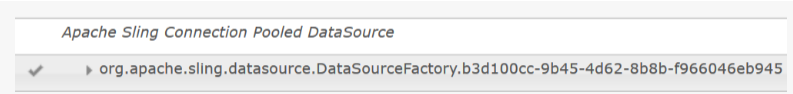
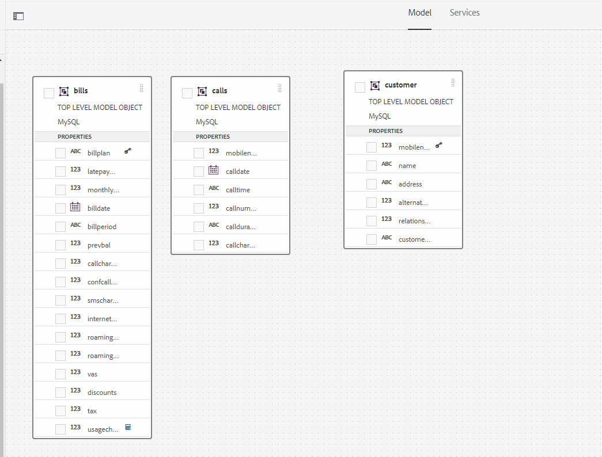
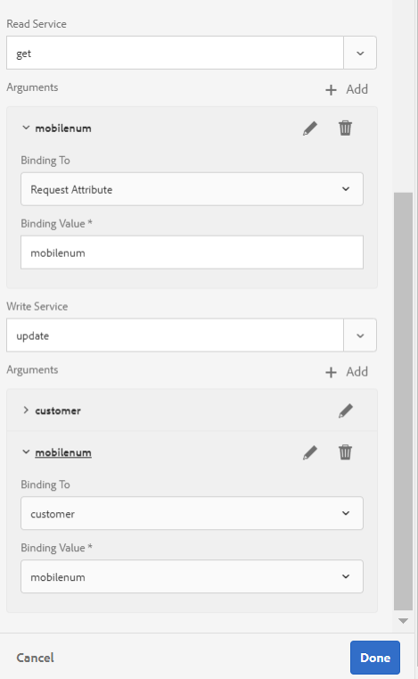
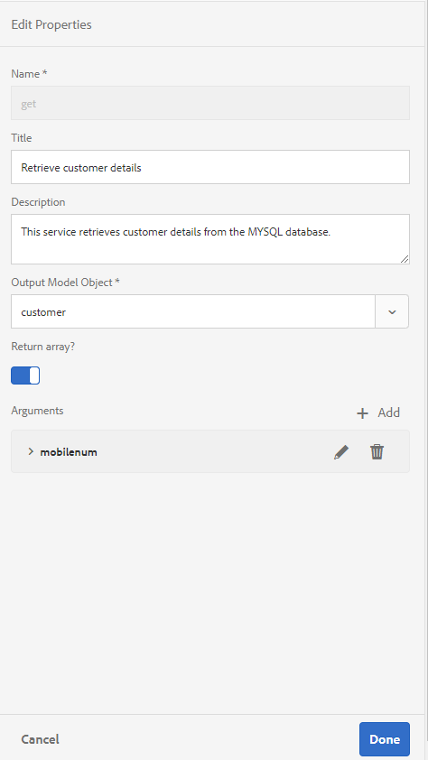

# Zelfstudie: Formuliergegevensmodel maken{#tutorial-create-form-data-model}


Deze zelfstudie is een stap in de [eerste interactieve communicatiereeks](/help/forms/using/create-your-first-interactive-communication.md) maken. U wordt aangeraden de reeks in chronologische volgorde te volgen om het volledige gebruik van de zelfstudie te begrijpen, uit te voeren en aan te tonen.

## Over de zelfstudie {#about-the-tutorial}

Met de gegevensintegratiemodule van AEM Forms kunt u een formuliergegevensmodel maken op basis van verschillende bronnen van back-endgegevens, zoals het AEM-gebruikersprofiel, RESTful-webservices, SOAP-webservices, OData-services en relationele databases. U kunt gegevensmodelobjecten en -services configureren in een formuliergegevensmodel en deze koppelen aan een adaptief formulier. Adaptieve formuliervelden zijn gebonden aan objecteigenschappen van gegevensmodellen. Met deze services kunt u het adaptieve formulier vooraf invullen en verzonden formuliergegevens terugschrijven naar het gegevensmodelobject.

Zie [AEM Forms Data Integration](https://helpx.adobe.com/experience-manager/6-3/forms/using/data-integration.html)voor meer informatie over de integratie van formuliergegevens en het formuliergegevensmodel.

Deze zelfstudie begeleidt u door de stappen om een formuliergegevensmodel voor te bereiden, te maken, te configureren en aan een interactieve communicatie te koppelen. Aan het einde van deze zelfstudie kunt u het volgende doen:

* [De database instellen](../../forms/using/create-form-data-model0.md#step-set-up-the-database)
* [MySQL-database configureren als gegevensbron](../../forms/using/create-form-data-model0.md#step-configure-mysql-database-as-data-source)
* [Formuliergegevensmodel maken](../../forms/using/create-form-data-model0.md#step-create-form-data-model)
* [Formuliergegevensmodel configureren](../../forms/using/create-form-data-model0.md#step-configure-form-data-model)
* [Formuliergegevensmodel testen](../../forms/using/create-form-data-model0.md#step-test-form-data-model-and-services)

Het formuliergegevensmodel ziet er ongeveer als volgt uit:


**A.** Gevormde gegevensbronnen **B.** Gegevensbronschema&#39;s **C.** Beschikbare diensten **D.** Gegevensmodelobjecten **E.** Gevormde services

## Vereisten {#prerequisites}

Voordat u begint, moet u het volgende doen:

* MySQL-database met voorbeeldgegevens zoals vermeld in de sectie [Database](../../forms/using/create-form-data-model0.md#step-set-up-the-database) instellen.
* OSGi-bundel voor MySQL JDBC-stuurprogramma, zoals wordt uitgelegd in [Bundling the JDBC Database Driver](https://helpx.adobe.com/experience-manager/6-3/help/sites-developing/jdbc.html#bundling-the-jdbc-database-driver)

## Stap 1: De database instellen {#step-set-up-the-database}

Een gegevensbestand is essentieel om een Interactieve Mededeling tot stand te brengen. Deze zelfstudie gebruikt een database voor het weergeven van het formuliergegevensmodel en persistentiemogelijkheden van interactieve communicatie. Opstelling een gegevensbestand dat klant, rekeningen, en vraaglijsten bevat.
De volgende afbeelding illustreert voorbeeldgegevens voor de klantentabel:


Gebruik de volgende verklaring DDL om de **klantenlijst** in gegevensbestand tot stand te brengen.

```sql
CREATE TABLE `customer` (
   `mobilenum` int(11) NOT NULL,
   `name` varchar(45) NOT NULL,
   `address` varchar(45) NOT NULL,
   `alternatemobilenumber` int(11) DEFAULT NULL,
   `relationshipnumber` int(11) DEFAULT NULL,
   `customerplan` varchar(45) DEFAULT NULL,
   PRIMARY KEY (`mobilenum`),
   UNIQUE KEY `mobilenum_UNIQUE` (`mobilenum`)
 ) ENGINE=InnoDB DEFAULT CHARSET=utf8
```

Gebruik de volgende verklaring DDL om de **rekeningen** lijst in gegevensbestand tot stand te brengen.

```sql
CREATE TABLE `bills` (
   `billplan` varchar(45) NOT NULL,
   `latepayment` decimal(4,2) NOT NULL,
   `monthlycharges` decimal(4,2) NOT NULL,
   `billdate` date NOT NULL,
   `billperiod` varchar(45) NOT NULL,
   `prevbal` decimal(4,2) NOT NULL,
   `callcharges` decimal(4,2) NOT NULL,
   `confcallcharges` decimal(4,2) NOT NULL,
   `smscharges` decimal(4,2) NOT NULL,
   `internetcharges` decimal(4,2) NOT NULL,
   `roamingnational` decimal(4,2) NOT NULL,
   `roamingintnl` decimal(4,2) NOT NULL,
   `vas` decimal(4,2) NOT NULL,
   `discounts` decimal(4,2) NOT NULL,
   `tax` decimal(4,2) NOT NULL,
   PRIMARY KEY (`billplan`)
 ) ENGINE=InnoDB DEFAULT CHARSET=utf8
```

Gebruik de volgende verklaring DDL om de **vraaglijst** in gegevensbestand tot stand te brengen.

```sql
CREATE TABLE `calls` (
   `mobilenum` int(11) DEFAULT NULL,
   `calldate` date DEFAULT NULL,
   `calltime` varchar(45) DEFAULT NULL,
   `callnumber` int(11) DEFAULT NULL,
   `callduration` varchar(45) DEFAULT NULL,
   `callcharges` decimal(4,2) DEFAULT NULL,
   `calltype` varchar(45) DEFAULT NULL
 ) ENGINE=InnoDB DEFAULT CHARSET=utf8
```

De **vraaglijst** omvat de vraagdetails zoals vraagdatum, vraagtijd, vraagaantal, vraagduur, en vraaglasten. De **klantenlijst** is verbonden met de vraaglijst gebruikend het Mobiele gebied van het Aantal (mobilenum). Voor elk mobiel aantal dat in de **klantenlijst** wordt vermeld, zijn er veelvoudige verslagen in de **vraaglijst** . Bijvoorbeeld, kunt u de vraagdetails voor **1457892541** mobiel aantal terugwinnen door naar de **vraaglijst** te verwijzen.

De **rekeningstabel** bevat de gegevens van de factuur, zoals de datum van de rekening, de factuurperiode, de maandelijkse kosten en de kosten van de factuur. De **klantenlijst** is verbonden met de **rekeningen** lijst gebruikend het gebied van het Plan van de Rekening. Er is een plan verbonden aan elke klant in de **klantenlijst** . De **rekeningtabel** bevat de prijsgegevens voor alle bestaande plannen. Bijvoorbeeld, kunt u de plandetails voor **Sarah** van de **klantenlijst** terugwinnen en die details gebruiken om prijsdetails van de **rekeningslijst** terug te winnen.

## Stap 2: MySQL-database configureren als gegevensbron {#step-configure-mysql-database-as-data-source}

U kunt verschillende typen gegevensbronnen configureren om een formuliergegevensmodel te maken. Voor dit leerprogramma, zult u het gegevensbestand vormen MySQL dat met steekproefgegevens wordt gevormd en bevolkt. Voor informatie over andere gesteunde gegevensbronnen en hoe te om hen te vormen, zie de Integratie [van de Gegevens van](https://helpx.adobe.com/experience-manager/6-3/forms/using/data-integration.html)Vormen AEM.

Ga als volgt te werk om uw MySQL-database te configureren:

1. Installeer het JDBC-stuurprogramma voor MySQL-database als een OSGi-bundel:

   1. Meld u als beheerder aan bij AEM Forms Author Instance en ga naar AEM-webconsolesbundels. De standaard-URL is [https://localhost:4502/system/console/bundles](https://localhost:4502/system/console/bundles).
   1. Tik op **Installeren/bijwerken**. Het dialoogvenster **Bundels** uploaden/installeren wordt weergegeven.

   1. Tik op Bestand **** kiezen om door de OSGi-bundel van het MySQL-stuurprogramma te bladeren en deze te selecteren. Selecteer **Bundel** starten en Pakketten **** vernieuwen en tik op **Installeren** of **Bijwerken**. Zorg ervoor dat het JDBC-stuurprogramma voor MySQL van Oracle Corporation actief is. Het stuurprogramma is geïnstalleerd.

1. MySQL-database configureren als gegevensbron:

   1. Ga naar AEM-webconsole op [https://localhost:4502/system/console/configMgr](https://localhost:4502/system/console/configMgr).
   1. Zoek de configuratie **van Apache Sling Connection Pooled DataSource** . Tik om de configuratie te openen in de bewerkingsmodus.
   1. Geef in het dialoogvenster Configuratie de volgende gegevens op:

      * **Naam gegevensbron:** U kunt elke gewenste naam opgeven. Geef bijvoorbeeld **MySQL** op.

      * **Naam** van de de diensteigenschap DataSource: Specificeer naam van het de dienstbezit die de naam DataSource bevat. Het wordt gespecificeerd terwijl het registreren van de gegevensbroninstantie als dienst OSGi. Bijvoorbeeld, **datasource.name**.

      * **JDBC-stuurprogrammaklasse**: Geef de Java-klassenaam van het JDBC-stuurprogramma op. Geef voor MySQL-database **com.mysql.jdbc.Driver** op.

      * **URI** JDBC-verbinding: Geef de verbindings-URL van de database op. Voor MySQL-database die wordt uitgevoerd op poort 3306 en schema-teleca, is de URL: `jdbc:mysql://'server':3306/teleca?autoReconnect=true&useUnicode=true&characterEncoding=utf-8`
      * **Gebruikersnaam:** Gebruikersnaam van de database. Het is vereist om JDBC-stuurprogramma in staat te stellen een verbinding met de database tot stand te brengen.
      * **Wachtwoord:** Wachtwoord van de database. Het is vereist om JDBC-stuurprogramma in staat te stellen een verbinding met de database tot stand te brengen.
      * **Testen op lenen:** Schakel de optie **Testen op lening** in.

      * **Testen op rendement:** Schakel de optie **Testen op terugkeer** in.

      * **Validatiezoekopdracht:** Geef een SQL SELECT-query op om verbindingen vanuit de pool te valideren. De query moet ten minste één rij retourneren. Bijvoorbeeld, **selecteer * van klant**.

      * **Transactieisolatie**: Stel de waarde in op **READ_COMTED**.
   Laat andere eigenschappen de [standaardwaarden](https://tomcat.apache.org/tomcat-7.0-doc/jdbc-pool.html) behouden en tik op **Opslaan**.

   Er wordt een configuratie gemaakt die lijkt op de volgende configuratie.

   

## Stap 3: Formuliergegevensmodel maken {#step-create-form-data-model}

AEM Forms biedt een intuïtieve gebruikersinterface voor het [maken van een](https://helpx.adobe.com/experience-manager/6-3/forms/using/data-integration.html#main-pars_header_1524967585)formuliergegevensmodel op basis van geconfigureerde gegevensbronnen. U kunt meerdere gegevensbronnen gebruiken in een formuliergegevensmodel. Voor het gebruiksgeval in deze zelfstudie, zult u MySQL als gegevensbron gebruiken.

Ga als volgt te werk om het formuliergegevensmodel te maken:

1. Navigeer in de auteur van AEM naar **Forms** > **Gegevensintegratie**.
1. Tik op **Maken** > **Formuliergegevensmodel**.
1. Geef in de wizard Formuliergegevensmodel maken een **naam** op voor het gegevensmodel van het formulier. Bijvoorbeeld **FDM_Create_First_IC**. Tik op **Volgende**.
1. Het uitgezochte scherm van gegevensbron maakt een lijst van alle gevormde gegevensbronnen. Selecteer **MySQL** -gegevensbron en tik op **Maken**.

   

1. Klik op **Gereed**. Het **gegevensmodel FDM_Create_First_IC** wordt gemaakt.

## Stap 4: Formuliergegevensmodel configureren {#step-configure-form-data-model}

Het formuliergegevensmodel configureren omvat:

* [gegevensmodelobjecten en services toevoegen](#add-data-model-objects-and-services)
* [berekende onderliggende eigenschappen maken voor gegevensmodelobject](#create-computed-child-properties-for-data-model-object)
* [koppelingen tussen gegevensmodelobjecten toevoegen](#add-associations-between-data-model-objects)
* [bewerken van objecteigenschappen van gegevensmodellen](#edit-data-model-object-properties)
* [configureren van services voor gegevensmodelobjecten](#configure-services)

### Objecten en services voor gegevensmodellen toevoegen {#add-data-model-objects-and-services}

1. Navigeer in de auteur van AEM naar **Forms** > **Gegevensintegratie**. De standaard-URL is [https://localhost:4502/aem/forms.html/content/dam/formsanddocuments-fdm](https://localhost:4502/aem/forms.html/content/dam/formsanddocuments-fdm).
1. Het **FDM_Create_First_IC** -formuliergegevensmodel dat u eerder hebt gemaakt, wordt hier weergegeven. Selecteer het en tik **uitgeven**.

   De geselecteerde gegevensbron **MySQL** wordt getoond in de ruit van **Gegevensbronnen** .

   

1. Vouw de gegevensbronstructuur van **MySQL** uit. Selecteer de volgende gegevensmodelvoorwerpen en de diensten van **teleca** schema:

   * **Objecten** gegevensmodel:

      * rekeningen
      * oproepen
      * klant
   * **Services:**

      * get
      * update
   Tik op Geselecteerde **gegevensmodelobjecten en -services** toevoegen aan het formuliergegevensmodel.

   

   De rekeningen, de vraag, en de objecten van het klantengegevensmodel worden getoond in de juiste ruit op het **Model** lusje. De get- en updateservices worden weergegeven op het tabblad **Services** .

   

### Berekende onderliggende eigenschappen maken voor gegevensmodelobject {#create-computed-child-properties-for-data-model-object}

Een berekende eigenschap is de eigenschap waarvan de waarde wordt berekend op basis van een regel of expressie. Met behulp van een regel kunt u de waarde van een berekende eigenschap instellen op een letterlijke tekenreeks, een getal, het resultaat van een wiskundige expressie of de waarde van een andere eigenschap in het formuliergegevensmodel.

Gebaseerd op het gebruiksgeval, creeer de **gebruiksheadingen** kindgegevens gegevens gegevens gegevens gegevens verwerkte bezit in het voorwerp van het **rekeningen** gegevensmodel gebruikend de volgende wiskundige uitdrukking:

* gebruikskosten = gesprekskosten + kosten voor conferentiegesprekken + sms-tarieven + tarieven voor mobiel internet + roaming nationaal + internationaal + VAS (al deze eigenschappen bestaan in het object van het factureringsgegevensmodel)Zie **Plan interactieve communicatie** voor meer informatie over de [gebruiksrechten](/help/forms/using/planning-interactive-communications.md)voor onderliggende computereigendommen.

Voer de volgende stappen uit om berekende onderliggende eigenschappen voor het modelobject van rekeningen te maken:

1. Schakel het selectievakje boven aan het **gegevensmodelobject voor facturen** in om dit te selecteren en tik op Onderliggend **element** maken.
1. In het deelvenster **Onderliggende eigenschap** maken:

   1. Voer **gebruiksheffingen** in als de naam van de onderliggende eigenschap.
   1. Schakel **Berekend** in.
   1. Selecteer **Zwevend** als het type en tik op **Gereed** om de onderliggende eigenschap toe te voegen aan het **gegevensmodelobject van de factuur** .
   

1. Tik op Regel **** bewerken om de regeleditor te openen.
1. Tik op **Maken**. Het venster **Waarde** instellen wordt geopend.
1. Selecteer **Wiskundige expressie** in het keuzemenu Optie selecteren.

   

1. Selecteer in de wiskundige expressie **callloads** en **confcallloads** als respectievelijk eerste en tweede object. Selecteer **plus** als exploitant. Tik binnen de wiskundige expressie en tik op **Expressie** uitbreiden om **scharges**, **onderlinge koppelingen**, **roamingnational**, **roamingintl****** envas-objecten aan de expressie toe te voegen.

   De volgende afbeelding toont de wiskundige expressie in de regeleditor:

   

1. Tik **op Gereed**. De regel wordt gecreeerd in de Redacteur van de Regel.
1. Tik op **Sluiten** om het venster Regeleditor te sluiten.

### Koppelingen tussen gegevensmodelobjecten toevoegen {#add-associations-between-data-model-objects}

Nadat de gegevensmodelobjecten zijn gedefinieerd, kunt u koppelingen tussen deze objecten maken. De koppeling kan een-op-een of een-op-een zijn. Bijvoorbeeld, kunnen er veelvoudige gebiedsdelen verbonden aan een werknemer zijn. Het wordt bedoeld als één-aan-vele vereniging en afgebeeld door 1:n op de lijn die bijbehorende voorwerpen van het gegevensmodel verbindt. Nochtans, als een vereniging een unieke werknemersnaam voor een bepaalde werknemersidentiteitskaart terugkeert, wordt het bedoeld als één-op-één vereniging.

Wanneer u gekoppelde gegevensmodelobjecten in een gegevensbron toevoegt aan een formuliergegevensmodel, blijven de koppelingen behouden en worden ze weergegeven als verbonden door pijllijnen.

Op basis van het gebruiksgeval kunt u de volgende koppelingen maken tussen de gegevensmodelobjecten:

| Associatie | Gegevensmodelobjecten |
|---|---|
| 1:n | klant:vraag (De veelvoudige vraag kan met een klant in een maandelijkse rekening worden geassocieerd) |
| 1:1 | klant:rekeningen (één rekening wordt geassocieerd met een klant voor een bepaalde maand) |

Voer de volgende stappen uit om koppelingen te maken tussen gegevensmodelobjecten:

1. Schakel het selectievakje boven aan het gegevensmodelobject van de **klant** in om het te selecteren en op Koppeling **** toevoegen te tikken. Het **Add de bezitsruit van de Vereniging** opent.
1. In het deelvenster **Koppeling** toevoegen:

   * Geef een titel op voor de koppeling. Het is een optioneel veld.
   * Selecteer **een tot veel** in de vervolgkeuzelijst **Type** .

   * Selecteer **vraag** van de drop-down lijst van het **ModelVoorwerp** .

   * Selecteer **krijgen** van de drop-down lijst van de **Dienst** .

   * Tik op **Toevoegen** om het gegevensmodelobject van de **klant** te koppelen aan **aanroepen** van een gegevensmodelobject met behulp van een eigenschap. Gebaseerd op het gebruiksgeval, moet het modelvoorwerp van vraaggegevens met het mobiele aantalbezit in het voorwerp van het klantengegevensmodel worden verbonden. Het dialoogvenster **Argument** toevoegen wordt geopend.
   

1. In het dialoogvenster **Argument** toevoegen:

   * Selecteer **mobiel** in de vervolgkeuzelijst **Naam** . De eigenschap mobile number is een algemene eigenschap die beschikbaar is in de klant en die gegevensmodelobjecten aanroept. Dientengevolge, wordt het gebruikt om een verband tussen klant tot stand te brengen en de voorwerpen van het gegevensmodel te roepen.
Voor elk mobiel aantal beschikbaar in het modelvoorwerp van klantengegevens, zijn er veelvoudige vraagverslagen beschikbaar in de vraaglijst.

   * Geef een optionele titel en beschrijving voor het argument op.
   * Selecteer **klant** in de vervolgkeuzelijst **Binding aan** .

   * Selecteer **mobiel** in de vervolgkeuzelijst **Bindingswaarde** .

   * Tik op **Toevoegen**.
   

   De eigenschap mobilenum wordt weergegeven in de sectie **Argumenten** .

   

1. Tik **Gereed** om een koppeling van 1:n tussen klant en aanroepobjecten van gegevensmodellen te maken.

   Zodra u een vereniging tussen klant en vraag de modelvoorwerpen van gegevens hebt gecreeerd, creeer een 1:1 vereniging tussen de klant en de modelvoorwerpen van rekeningen.

1. Schakel het selectievakje boven aan het gegevensmodelobject van de **klant** in om het te selecteren en op Koppeling **** toevoegen te tikken. Het **Add de bezitsruit van de Vereniging** opent.
1. In het deelvenster **Koppeling** toevoegen:

   * Geef een titel op voor de koppeling. Het is een optioneel veld.
   * Selecteer **een voor een** in de vervolgkeuzelijst **Type** .

   * Selecteer **facturen** in de vervolgkeuzelijst **Modelobject** .

   * Selecteer **krijgen** van de drop-down lijst van de **Dienst** . De eigenschap **billplan** , de primaire sleutel voor de tabel met facturen, is al beschikbaar in de sectie **Argumenten** .
De rekeningen en de objecten van het klantengegevensmodel zijn verbonden gebruikend billplan (rekeningen) en klant (klant) eigenschappen. Creeer een band tussen deze eigenschappen om de plandetails voor om het even welke klant terug te winnen beschikbaar in het gegevensbestand MySQL.

   * Selecteer **klant** in de vervolgkeuzelijst **Binding aan** .

   * Selecteer **klantplan** van de **Bindende drop-down lijst van de Waarde** .

   * Tik **op Gereed** om een binding te maken tussen de eigenschappen billplan en customerplan.
   

   In de volgende afbeelding ziet u de koppelingen tussen de gegevensmodelobjecten en de eigenschappen die worden gebruikt om koppelingen tussen deze objecten te maken:

   

### Eigenschappen van gegevensmodelobjecten bewerken {#edit-data-model-object-properties}

Nadat het creëren van verbindingen tussen de klant en andere voorwerpen van het gegevensmodel, geef de klanteneigenschappen uit om het bezit te bepalen dat wordt gebaseerd waarop de gegevens van het voorwerp van het gegevensmodel worden teruggewonnen. Gebaseerd op het gebruiksgeval, wordt het mobiele aantal gebruikt als bezit om gegevens van het voorwerp van het klantengegevensmodel terug te winnen.

1. Schakel het selectievakje boven aan het gegevensmodelobject van de **klant** in om het te selecteren en op Eigenschappen **** bewerken te tikken. Het deelvenster Eigenschappen **bewerken** wordt geopend.
1. Geef de **klant** op als het **bovenste modelobject**.
1. Selecteer **krijgen** van de **Gelezen drop-down lijst van de Dienst** .
1. In de **sectie Argumenten** :

   * Selecteer **Request-kenmerk** in de vervolgkeuzelijst **Binding aan** .

   * Geef **mobienum** op als bindingswaarde.

1. Selecteer **update** van de **Write** drop-down lijst van de Dienst.
1. In de **sectie Argumenten** :

   * Selecteer voor de eigenschap **mobile** de **klant** in de vervolgkeuzelijst **Binding aan** .

   * Selecteer **mobiel** in de vervolgkeuzelijst **Bindingswaarde** .

1. Tik op **Gereed** om de eigenschappen op te slaan.

   

1. Schakel het selectievakje boven aan het **aanroepgegevensmodelobject** in om het te selecteren en op Eigenschappen **** bewerken te tikken. Het deelvenster Eigenschappen **bewerken** wordt geopend.
1. Schakel het modelobject **op** hoofdniveau voor **aanroepen** van gegevensmodelobjecten uit.
1. Tik **op Gereed**.

   Herhaal stap 8 - 10 om de eigenschappen voor het modelobject van **rekeningen** te configureren.

### Services configureren {#configure-services}

1. Ga naar het tabblad **Services** .
1. Selecteer de **get** service en tik op Eigenschappen **** bewerken. Het deelvenster Eigenschappen **bewerken** wordt geopend.
1. In het deelvenster **Eigenschappen** bewerken:

   * Voer een optionele titel en beschrijving in.
   * Selecteer **klant** in de vervolgkeuzelijst **Uitvoermodelobject** .

   * Tik op **Gereed** om de eigenschappen op te slaan.
   

1. Selecteer de **updateservice** en tik op **Eigenschappen** bewerken. Het deelvenster Eigenschappen **bewerken** wordt geopend.
1. In het deelvenster **Eigenschappen** bewerken:

   * Voer een optionele titel en beschrijving in.
   * Selecteer **klant** in de vervolgkeuzelijst **Invoermodelobject** .

   * Tik **op Gereed**.
   * Tik op **Opslaan** om het formuliergegevensmodel op te slaan.
   

## Stap 5: Formuliergegevensmodel en services testen {#step-test-form-data-model-and-services}

U kunt het gegevensmodelobject en de services testen om te controleren of het formuliergegevensmodel correct is geconfigureerd.

Voer de volgende handelingen uit om de test uit te voeren:

1. Ga naar het tabblad **Model** , selecteer het gegevensmodelobject van de **klant** en tik op **Testmodelobject**.
1. Selecteer in het venster **Formuliergegevensmodel** testen de optie **Modelobject** lezen in de vervolgkeuzelijst Model/service **** selecteren.
1. In de sectie van de **Input** , specificeer een waarde voor het **mobilenum** bezit dat in het gevormde gegevensbestand MySQL bestaat en tikt **Test**.

   De klantgegevens die aan de opgegeven eigenschap mobileEnum zijn gekoppeld, worden opgehaald en weergegeven in de sectie Uitvoer, zoals hieronder wordt weergegeven. Sluit het dialoogvenster.

   

1. Ga naar het tabblad **Services** .
1. Selecteer de **get** service en tik op **Testservice.**
1. In de sectie van de **Input** , specificeer een waarde voor het **mobilenum** bezit dat in het gevormde gegevensbestand MySQL bestaat en tikt **Test**.

   De klantgegevens die aan de opgegeven eigenschap mobileEnum zijn gekoppeld, worden opgehaald en weergegeven in de sectie Uitvoer, zoals hieronder wordt weergegeven. Sluit het dialoogvenster.

   

### Voorbeeldgegevens bewerken en opslaan {#edit-and-save-sample-data}

Met de formuliergegevensmodeleditor kunt u voorbeeldgegevens genereren voor alle eigenschappen van gegevensmodelobjecten, inclusief berekende eigenschappen, in een formuliergegevensmodel. Het is een reeks willekeurige waarden die met het gegevenstype voldoen dat voor elk bezit wordt gevormd. U kunt ook gegevens bewerken en opslaan. Deze blijven behouden, zelfs als u de voorbeeldgegevens opnieuw genereert.

Voer de volgende handelingen uit om voorbeeldgegevens te genereren, te bewerken en op te slaan:

1. Tik op de pagina met formuliergegevensmodellen op Voorbeeldgegevens **** bewerken. De voorbeeldgegevens worden gegenereerd en weergegeven in het venster Voorbeeldgegevens bewerken.

   

1. Bewerk in het venster Voorbeeldgegevens **** bewerken de vereiste gegevens en tik op **Opslaan**. Sluit het venster.


