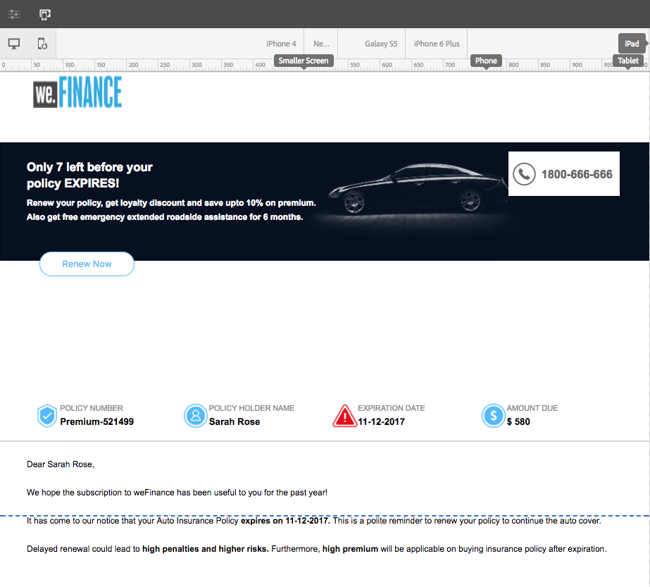
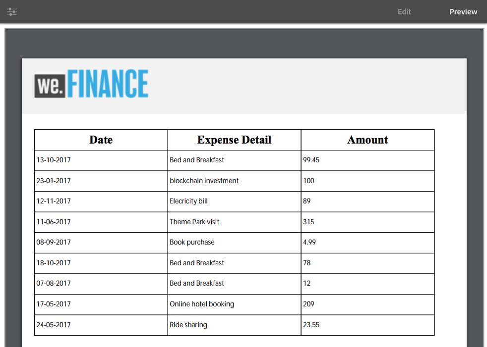

# Een interactieve communicatie maken{#create-an-interactive-communication}

## Overzicht {#overview}

De interactieve Mededelingen centraliseren en beheert de verwezenlijking, de assemblage, en de levering gepersonaliseerde, en interactieve correspondentie. Gebruik afdrukken als master kanaal voor het web om dubbel werk te minimaliseren bij het maken van de webinvoer van de interactieve communicatie.

### Vereisten {#prerequisites}

Het volgende is de eerste vereisten voor het creëren van een Interactieve Mededeling:

* Stel een [Formuliergegevensmodel](/help/forms/using/data-integration.md) in dat testgegevens of een werkelijke gegevensbron bevat, zoals een instantie van Microsoft® Dynamics.
* Zorg ervoor dat u de [Documentfragmenten](/help/forms/using/document-fragments.md) hebt.
* Zorg ervoor dat u [Sjablonen hebt voor afdrukken en webkanaal](/help/forms/using/web-channel-print-channel.md).
* Zorg ervoor dat u het vereiste [thema](/help/forms/using/themes.md) voor het Webkanaal hebt.

## Interactieve communicatie {#createic} maken

1. Meld u aan bij de AEM auteur en navigeer naar **[!UICONTROL Adobe Experience Manager]** > **[!UICONTROL Forms]** > **[!UICONTROL Forms & Documents]**.
1. Tik **[!UICONTROL Create]** en selecteer **[!UICONTROL Interactive Communication]**. De pagina Interactieve communicatie maken wordt weergegeven.

   

1. Voer de volgende gegevens in. :

   * **[!UICONTROL Title]**: Voer de titel van de interactieve communicatie in.
   * **[!UICONTROL Name]**: De naam van de Interactieve Mededeling wordt afgeleid uit de titel u ingaat. Bewerk indien nodig de selectie.
   * **[!UICONTROL Description]**: Ga een beschrijving over de Interactieve Communicatie in.
   * **[!UICONTROL Form Data Model]**: Blader naar het gegevensmodel van het formulier en selecteer dit. Zie [AEM Forms Data Integration](/help/forms/using/data-integration.md) voor meer informatie over het formuliergegevensmodel.

   * **[!UICONTROL Prefill Service]**: Selecteer de prefill dienst om de gegevens terug te winnen en de Interactieve Communicatie vooraf in te vullen.
   * **[!UICONTROL Post Process Type]**: U kunt AEM of Forms-workflow selecteren die moet worden geactiveerd wanneer de interactieve communicatie wordt verzonden. Selecteer het type workflow dat moet worden geactiveerd.

   * **[!UICONTROL Post Process]**: Selecteer de naam van de workflow die moet worden geactiveerd. Wanneer u AEM workflow selecteert, moet u het pad naar Bijlage, Lay-out, PDF-pad, Gegevenspad afdrukken en Webgegevenspad opgeven.
   * **[!UICONTROL Tags]**: Selecteer de tags die u wilt toepassen op Interactieve communicatie. U kunt ook een nieuwe/aangepaste tagnaam typen en op Enter drukken om deze te maken.
   * **[!UICONTROL Author]**:De auteursnaam wordt automatisch genomen van de het programma geopende gebruikersnaam.
   * **[!UICONTROL Publish Date:]** Voer de datum in waarop u de interactieve communicatie wilt publiceren.
   * **[!UICONTROL Unpublish Date]**: Voer de datum in waarop u de publicatie van de interactieve communicatie ongedaan wilt maken.

1. Tik op **[!UICONTROL Next]**. Het scherm waarop u afdruk- en webkanaalgegevens wilt opgeven, wordt weergegeven.
1. Voer het volgende in:

   * **[!UICONTROL Print]**: Selecteer deze optie om het afdrukkanaal van de interactieve communicatie te genereren.
   * **[!UICONTROL Print Template]**: Blader naar een XDP als afdruksjabloon en selecteer deze.
   * **[!UICONTROL Web]**: Selecteer deze optie om het webkanaal of de responsieve uitvoer van Interactieve communicatie te genereren.
   * **[!UICONTROL Interactive Communication Web Template]**: Blader naar de websjabloon en selecteer deze.
   * **[!UICONTROL Theme]** en  **[!UICONTROL Select Theme]**: Blader en selecteer het thema om het webkanaal van de interactieve communicatie op te maken. Zie [Thema&#39;s in AEM Forms](/help/forms/using/themes.md) voor meer informatie.

   * **[!UICONTROL Use Print As Master for Web Channel]**: Selecteer deze optie om het webkanaal synchroon met het afdrukkanaal te maken. Als u het afdrukkanaal gebruikt als master voor het webkanaal, zorgt u ervoor dat de inhoud en de gegevensbinding van het webkanaal worden afgeleid van het afdrukkanaal en dat de wijzigingen die u in het afdrukkanaal hebt aangebracht, worden weerspiegeld in het webkanaal wanneer u op Synchroniseren tikt. De auteurs mogen echter desgewenst de overerving voor specifieke componenten in het webkanaal verbreken. Zie [Webkanaal synchroniseren met afdrukkanaal](../../forms/using/create-interactive-communication.md#synchronize) voor meer informatie.
Als u de optie **[!UICONTROL Use Print As Master for Web Channel]** selecteert, kunt u een van de volgende modi selecteren om een webkanaal te genereren:

      * **[!UICONTROL Auto layout]**: Selecteer deze modus om automatisch plaatsaanduidingen, inhoud en gegevensbinding voor het webkanaal te genereren via het kanaal Afdrukken.
      * **[!UICONTROL Manually organize]**: Selecteer deze modus om de kanaalelementen Afdrukken handmatig te selecteren en aan het webkanaal toe te voegen met behulp van de master inhoud die op het  **[!UICONTROL Data Sources]** tabblad beschikbaar is. Zie [Kanaalelementen afdrukken selecteren om webkanaalinhoud te maken](#selectprintchannelelements) voor meer informatie.

   Zie [Kanaal en webkanaal afdrukken](/help/forms/using/web-channel-print-channel.md) voor meer informatie over het afdrukkanaal en het webkanaal.

1. Tik op **[!UICONTROL Create]**. De interactieve communicatie wordt gemaakt en er verschijnt een waarschuwingsvenster. Tik **[!UICONTROL Edit]** om de inhoud van de interactieve communicatie op te bouwen, zoals wordt uitgelegd in [Inhoud toevoegen met de interactieve gebruikersinterface voor communicatie ontwerpen](#step2). U kunt ook **[!UICONTROL Done]** tikken en ervoor kiezen om de interactieve communicatie later te bewerken.

## Inhoud toevoegen aan de interactieve communicatie {#step2}

Nadat u een Interactieve Communicatie hebt gecreeerd, kunt u de Interactieve Communicatie auteursinterface gebruiken om zijn inhoud te construeren.

Voor meer informatie over de Interactieve Communicatie auteursinterface, zie [Inleiding aan Interactieve Communicatie creatie](/help/forms/using/introduction-interactive-communication-authoring.md).

1. De Interactieve Communicatie auteursinterface wordt gelanceerd wanneer u Tik geef zoals vermeld in [Interactieve Communicatie](#createic) tot stand brengen. Alternatief, kunt u aan een bestaand Interactief Communicatie middel op AEM navigeren, het selecteren, en tikken **[!UICONTROL Edit]** om de Interactieve Communicatie auteursinterface te lanceren.

   Standaard wordt het afdrukkanaal van de interactieve communicatie weergegeven, tenzij Interactieve communicatie alleen via het web plaatsvindt. In het afdrukkanaal van de interactieve communicatie worden de doelgebieden weergegeven die beschikbaar zijn in de geselecteerde XDP/afdruksjabloon. In deze doelgebieden en -velden kunt u componenten of elementen toevoegen.

1. Selecteer het kanaal Afdrukken en selecteer het tabblad **[!UICONTROL Components]**. De volgende componenten zijn beschikbaar in het afdrukkanaal:

   | **Component** | **Functionaliteit** |
   |---|---|
   | Diagram | Hiermee voegt u een grafiek toe die u in Interactieve communicatie kunt gebruiken voor de visuele weergave van tweedimensionale gegevens die zijn opgehaald uit een verzameling formuliergegevensmodellen. Voor meer informatie, zie [Het gebruiken van grafieken in Interactieve Mededelingen](/help/forms/using/chart-component-interactive-communications.md). |
   | Documentfragment | Staat u toe om een herbruikbare component, zoals tekst, lijst, of voorwaarde, aan een Interactieve Communicatie toe te voegen. De toegevoegde component kan gebaseerd zijn op een formuliergegevensmodel of zonder een formuliergegevensmodel. |
   | Afbeelding | Hiermee kunt u een afbeelding invoegen. |

   Sleep de componenten in uw Interactieve Communicatie en vorm hen zoals vereist.

   U kunt ook de bewerkingen Ongedaan maken en Opnieuw gebruiken tijdens het ontwerpen van een interactieve communicatie voor zowel de afdruk- als de webkanalen.

   Gebruik de bewerking Ongedaan maken om de laatst uitgevoerde actie te verwijderen en de bewerking Opnieuw om de verwijderde actie opnieuw op te nemen. Als u bijvoorbeeld een afbeelding hebt ingevoegd of een gegevensbinding hebt gemaakt in een interactieve communicatie en deze moet verwijderen, gebruikt u de bewerking Ongedaan maken.

   

   De opties voor Ongedaan maken en Opnieuw worden weergegeven op de werkbalk van de pagina UI-ontwerppagina. De optie Ongedaan maken wordt alleen weergegeven nadat een handeling is uitgevoerd. De optie Opnieuw uitvoeren wordt alleen op de paginabalk weergegeven nadat een bewerking Ongedaan maken is uitgevoerd. Deze handelingen worden opnieuw ingesteld bij het vernieuwen van de pagina.

1. Selecteer het afdrukkanaal en ga naar het tabblad **[!UICONTROL Assets]** en pas het filter toe om alleen de elementen weer te geven die u wilt zien.

   Met behulp van de middelenbrowser kunt u ook rechtstreeks elementen slepen en neerzetten in interactieve communicatiedoelgebieden.

   

1. Sleep de documentfragmenten naar de interactieve communicatie. Hier volgen de typen documentfragmenten die u kunt gebruiken in het afdrukkanaal van de interactieve communicatie.

<table>
 <tbody>
  <tr>
   <td><strong>Type documentfragment</strong></td>
   <td><strong>Voorbeeld</strong></td>
  </tr>
  <tr>
   <td><a href="/help/forms/using/texts-interactive-communications.md" target="_blank">Tekst</a></td>
   <td>Tekst voor het toevoegen van het adres, de e-mail van de ontvanger en de platte tekst van de brief </td>
  </tr>
  <tr>
   <td><a href="/help/forms/using/conditions-interactive-communications.md" target="_blank">Voorwaarde</a></td>
   <td>Voorwaarde om het aangewezen kopbalbeeld aan de mededeling toe te voegen die op het type van het beleid wordt gebaseerd: Standaard of Premium.   </td>
  </tr>
  <tr>
   <td>Lijst</td>
   <td>Groep documentfragmenten, zoals tekst, voorwaarden, andere lijsten en afbeeldingen.   </td>
  </tr>
 </tbody>
</table>

U kunt de binding tussen een doelgebied en een documentfragment ook vervangen door het nieuwe fragment op het doelgebied neer te zetten met de tab **[!UICONTROL Assets]**. De blauwe kleurschaduw van het doelgebied tijdens het slepen van het fragment geeft aan dat het documentfragment naar het doelgebied kan worden neergezet.

Zie [Documentfragmenten](/help/forms/using/document-fragments.md) voor meer informatie over documentfragmenten.

Met de ontwerpinterface kunt u onderscheid maken tussen de niet-gebonden en gebonden velden en variabelen in een interactieve communicatie. De interface markeert de niet-gebonden velden en variabelen met een oranje rand.

Wanneer u de muisaanwijzer op deze elementen plaatst, wordt bovendien knopinfo weergegeven met het bericht Veld (niet geconsolideerd) of Variabele (niet geconsolideerd).

Een niet-gebonden variabele die in een documentfragment wordt gebruikt, wordt soms niet weergegeven in de ontwerpinterface. Dit kan gebeuren door een inline tekstregel in een documentfragment of in het geval van een voorwaardelement. In dergelijke gevallen wordt knopinfo, gemarkeerd in blauw, weergegeven als onderdeel van het documentfragment. In de knopinfo wordt het aantal niet-gebonden variabelen weergegeven dat in een documentfragment wordt gebruikt.

Tik op het documentfragment, tik  (Configure) en tik **[!UICONTROL Properties]** vanaf de assistent van de interactieve communicatie. In de sectie **[!UICONTROL Variables and Data Model Objects]** worden de variabelen vermeld, inclusief de verborgen variabelen en de gegevensmodelobjecten die in de documentfragmenten worden gebruikt. Gebruik het  (geef uit) pictogram naast elk voorwerp of variabele van het gegevensmodel om de eigenschappen uit te geven.

1. Tik op een variabele om de binding van variabelen in te stellen en selecteer  (Configure) en stel vervolgens de bindingseigenschappen in het deelvenster Eigenschappen in het zijpaneel in.

   * **Geen**: De agent zal de waarde voor de variabele invullen.
   * **Tekstfragment**: Als deze optie is geselecteerd, kunt u door een tekstdocumentfragment bladeren en dit selecteren waarvan de inhoud in het veld wordt weergegeven. Alleen tekstdocumentfragmenten kunnen worden gebonden aan variabelen die geen variabelen bevatten.
   * **Gegevensmodelobject**: Selecteer een eigenschap van het formuliergegevensmodel waarvan de waarde in het veld is ingevuld.
   * **Standaardwaarde:** u kunt een standaardwaarde voor de variabele definiëren met dit veld. De waarde wordt getoond wanneer u voorproef de Interactieve Communicatie of in de Agent UI.
   * **Weergavepatroon:** u kunt ook een weergave-indeling voor een variabele definiëren. Selecteer om het even welke vooraf bepaalde opties van **Type** drop-down lijst om een vertoningsformaat op een variabele toe te passen. Selecteer **Aangepast** om een weergavepatroon te definiëren dat niet beschikbaar is in de lijst. Zie [Gegevenspatronen](../../forms/using/create-interactive-communication.md#datadisplaypatterns) voor meer informatie.

   Navigeer naar [Variabelen en gegevensmodelobjecten](../../forms/using/create-interactive-communication.md#hiddenvariables) om de binding van verborgen variabelen in het documentfragment in te stellen.

   U kunt ook gegevensbronelementen of tekstdocumentfragmenten slepen en neerzetten om de binding van variabelen in te stellen.  Als u een binding wilt maken met een van de gegevensbronelementen, selecteert u het tabblad **Gegevensbronnen** en sleept u het element naar de naam van de variabele. Het gegevensbronelement en de variabele moeten van het zelfde type zijn aan opstelling met succes bindt. Als u een gegevensbronelement naar een reeds gebonden variabele sleept, vervangt het nieuwe element vorige om een nieuwe band met de variabele tot stand te brengen. Selecteer op dezelfde manier de **Elementen** tab en sleep het tekstdocumentfragment naar de naam van de variabele om de binding tussen de elementen in te stellen. Het tekstdocumentfragment mag geen variabelen bevatten.

1. Als u een tabel wilt toevoegen terwijl het afdrukkanaal is geselecteerd, past u op het tabblad **[!UICONTROL Assets]** het filter toe om alleen de layoutfragmenten weer te geven. Sleep het vereiste lay-outfragment naar de interactieve communicatie en zet het neer. Een lay-outfragment is gebaseerd op een XDP en kan worden gebruikt om grafische lay-outs of statische en dynamische lijsten in Interactieve Communicatie tot stand te brengen die met dynamische gegevens worden bevolkt.

   Voorbeeld: Een lay-outlijst om bruto premie, loyaliteitskorting %, en noodhulp langs de weg voor oud en nieuw beleid te tonen.

   Zie [Documentfragmenten](/help/forms/using/document-fragments.md) voor meer informatie over layoutfragmenten.

1. Selecteer het afdrukkanaal en pas op het tabblad **[!UICONTROL Assets]** het filter toe op de weergave van afbeeldingen. Sleep de vereiste afbeeldingen naar de interactieve communicatie, bijvoorbeeld voor het bedrijfslogo.

   Bovendien, beheer het volgende in de Interactieve Mededeling:

   * [Grafieken toevoegen en configureren](/help/forms/using/chart-component-interactive-communications.md)
   * [Webkanaal synchroniseren met afdrukkanaal](../../forms/using/create-interactive-communication.md#synchronize)

      * Automatisch synchroniseren
      * Overerving annuleren
      * Overerving opnieuw inschakelen
      * Synchroniseren
   * [Bijlagen en bibliotheektoegang](../../forms/using/create-interactive-communication.md#attachmentslibrary)
   * [Eigenschappen van XDP/Layout-velden](../../forms/using/create-interactive-communication.md#xdplayoutfieldproperties)
   * [Regels toevoegen aan componenten](../../forms/using/create-interactive-communication.md#rules)

1. Schakel over naar **[!UICONTROL Web Channel]**. Het webkanaal wordt weergegeven in de interactieve communicatieeditor. Wanneer u voor het eerst van het kanaal van de Druk aan het kanaal van het Web schakelt, vindt de automatische synchronisatie plaats. Zie [Webkanaal synchroniseren vanuit het afdrukkanaal](../../forms/using/create-interactive-communication.md#synchronize) voor meer informatie.

   Omdat we Afdrukken in dit voorbeeld als master voor het web gebruiken, worden de plaatsaanduidingen, inhoud en gegevensbinding van het kanaal Afdrukken gesynchroniseerd met het webkanaal. U kunt de specifieke inhoud in het webkanaal echter wijzigen en aanpassen. [Annuleer ](#cancelinheritance) overerving voor de doelgebieden en variabelen die met het afdrukkanaal zijn gegenereerd om de inhoud aan te passen.

   

   Tik op het documentfragment, tik  (Configure) en tik **[!UICONTROL Properties]** vanaf de assistent van de interactieve communicatie. In de sectie **[!UICONTROL Variables and Data Model Objects]** worden de variabelen vermeld, inclusief de verborgen variabelen en de gegevensmodelobjecten die in de documentfragmenten worden gebruikt. Gebruik het  (geef uit) pictogram naast elk voorwerp of variabele van het gegevensmodel om de eigenschappen uit te geven. Voor documentfragmenten die [automatisch gegenereerd](#synchronize) zijn via het webkanaal Afdrukken, gebruikt u bovendien het pictogram  (Overerving annuleren) naast elk gegevensmodelobject en de variabele [Overerving annuleren](#cancelinheritance) en kan u deze bewerken.

1. Tik **[!UICONTROL Components]** om extra componenten aan het webkanaal toe te voegen terwijl het webkanaal is geselecteerd. De belemmering-en-dalingscomponenten in het Webkanaal van uw Interactieve Communicatie zoals vereist en ga te werk om hen te vormen.

   | Onderdelen | Functionaliteit |
   |---|---|
   | Diagram | Hiermee voegt u een grafiek toe die u in Interactieve communicatie kunt gebruiken voor de visuele weergave van tweedimensionale gegevens die zijn opgehaald uit een verzameling formuliergegevensmodellen. Voor meer informatie, zie [Het gebruiken van grafiekcomponent](../../forms/using/chart-component-interactive-communications.md). |
   | Documentfragment | Staat u toe om een herbruikbare component, een tekst, een lijst, of een voorwaarde, aan een Interactieve Communicatie toe te voegen. De herbruikbare component die u toevoegt aan een interactieve communicatie kan gebaseerd zijn op een formuliergegevensmodel of geen formuliergegevensmodel. |
   | Afbeelding | Hiermee kunt u een afbeelding invoegen. |
   | Deelvenster | Staat u toe om [Panel](../../forms/using/create-interactive-communication.md#add-panel-component-to-the-web-channel) aan de Interactieve Mededeling toe te voegen. |
   | Tabel | Hiermee voegt u een tabel toe waarin u gegevens in rijen en kolommen kunt ordenen. |
   | Doelgebied | Hiermee voegt u een doelgebied in een webkanaal in om de webkanaalspecifieke componenten te ordenen. Het doelgebied is een normale container waarmee u webkanaalspecifieke componenten kunt groeperen. |
   | Tekst | Voegt rijke tekst aan het Webkanaal van een Interactieve Mededeling toe. Tekst kan ook gebruikmaken van formuliergegevensmodelobjecten om de inhoud dynamisch te maken. |
   | Knop | Staat u toe om een [Knoop ](../../forms/using/create-interactive-communication.md#add-button-component-to-the-web-channel) aan de Interactieve Mededeling toe te voegen. U kunt de component Button gebruiken om naar andere interactieve communicatie, adaptieve formulieren, andere elementen zoals afbeeldingen of documentfragmenten of een externe URL te navigeren. |
   | Scheidingsteken | Staat u toe om een horizontale lijn binnen een Interactieve Mededeling op te nemen. Gebruik deze component om onderscheid te maken tussen secties in een overeenkomst. U kunt bijvoorbeeld de sectie Scheidingsteken gebruiken om onderscheid te maken tussen Customer Details en Credit Card Details in een creditcardoverzicht. |

1. Voeg desgewenst elementen in uw webkanaal in.

   U kunt [voorproef uw Interactieve Communicatie](#previewic) om te zien wat de druk en Weboutput van de Interactieve Communicatie kijken als en verder makend veranderingen, zoals vereist.

## Een voorvertoning weergeven van de interactieve communicatie {#previewic}

U kunt de **optie van de Voorproef** gebruiken om verschijning van de Interactieve Mededeling te evalueren. Het Webkanaal van Interactieve Communicatie verstrekt ook een optie om ervaring van een Interactieve Mededeling voor diverse apparaten te simuleren. Bijvoorbeeld iPhone, iPad en Desktop. U kunt zowel **Voorvertoning** als **Emulator**  opties in combinatie met elkaar gebruiken om de webuitvoer voor apparaten van verschillende schermgrootten voor te vertonen. De voorbeeldgegevens in de voorbeeldweergave worden gevuld vanuit het opgegeven gegevensmodel voor formulieren.

1. Selecteer het kanaal (afdrukken of web) voor een voorvertoning en tik op de voorvertoning. De interactieve communicatie wordt weergegeven.

   >[!NOTE]
   >
   >Het voorbeeld wordt gevuld met de voorbeeldgegevens van het opgegeven formuliergegevensmodel. Zie [Formuliergegevensmodel gebruiken](/help/forms/using/using-form-data-model.md) en [Werken met formuliergegevensmodel](/help/forms/using/work-with-form-data-model.md) voor meer informatie over het bekijken van een voorbeeld van de interactieve communicatie met andere gegevens of het gebruik van de Prefill-service.

1. Voor het Webkanaal, gebruik  om te bekijken hoe de Interactieve Communicatie op diverse apparaten kijkt.

   

Verder, kunt u [Interactieve Mededeling voorbereiden en verzenden gebruikend de Agent UI](/help/forms/using/prepare-send-interactive-communication.md).

## Eigenschappen configureren in interactieve communicatie {#configure-properties-in-interactive-communication}

### Bijlagen en bibliotheektoegang {#attachmentslibrary}

In het kanaal van de Druk, kunt u de gehechtheid en bibliotheektoegang vormen om de Agent toe te staan beheer gehechtheid in de Agent UI voor de Interactieve Mededeling:

1. Markeer in het kanaal Afdrukken de documentcontainer en tik **Eigenschappen**.

   

   Het deelvenster Eigenschappen wordt weergegeven in het zijpaneel.

   

1. Vouw **Bijlagen** uit en geef de volgende eigenschappen op:

   * **[!UICONTROL Allow Library Access]**: Selecteer om bibliotheektoegang voor de agent in de Agent UI toe te laten. Indien toegelaten, kan de Agent dossiers van de bibliotheek toevoegen terwijl het voorbereiden van de Interactieve Communicatie.
   * **[!UICONTROL Allow Re-Ordering Of Attachments]**: Selecteer om de Agent toe te laten om de gehechtheid met de Interactieve Mededeling opnieuw in orde te brengen.
   * **[!UICONTROL Max Number Of Attachments Allowed]**: Geef het maximumaantal toegestane bijlagen voor de interactieve communicatie op.
   * **[!UICONTROL Files To Be Attached]**: Tik op de bestanden  **[!UICONTROL Add]** en blader naar de bestanden die u wilt bijvoegen en geef de volgende instellingen op:

      * **[!UICONTROL Attach This File To Document By Default]**: U kunt deze optie wijzigen als alleen de bijlage niet verplicht is.
      * **[!UICONTROL Mandatory:]** De agent zal niet de gehechtheid in de Agent UI kunnen verwijderen.

   

1. Tik op **[!UICONTROL Done]**.

### XDP/Layout-veldeigenschappen {#xdplayoutfieldproperties}

1. Terwijl het uitgeven van het kanaal van de Druk van een Interactieve Mededeling, houd over een gebied, dat in het het kanaalmalplaatje van de Druk wordt gebouwd, en selecteer  (vorm).

   Het dialoogvenster Eigenschappen wordt weergegeven in het zijpaneel.

   

1. Geef het volgende op:

   * **[!UICONTROL Name]**: JCR-knooppuntnaam.
   * **[!UICONTROL Title]**: Ga een titel in die aan de Agent in de Agent UI en in de boom van de Container van het Document zichtbaar zal zijn.
   * **[!UICONTROL Binding Type]**: Selecteer een van de volgende bindingstypen voor het veld.

      * Geen: De agent zal de waarde voor het bezit invullen.
      * Tekstfragment: Als deze optie is geselecteerd, kunt u door een tekstdocumentfragment bladeren en dit selecteren waarvan de inhoud in het veld wordt weergegeven. U kunt ook het tekstdocumentfragment naar de veldnaam slepen en neerzetten om de binding tussen de tekstfragmenten in te stellen. Het tekstdocumentfragment mag geen variabelen bevatten.
      * Gegevensmodelobject: Selecteer een eigenschap van het formuliergegevensmodel waarvan de waarde in het veld is ingevuld. U kunt ook het tabblad **Gegevensbronnen** selecteren en de eigenschap naar het veld slepen.
   * **[!UICONTROL Default Values]**: De standaardwaarde zorgt ervoor dat het veld niet leeg is wanneer er geen waarde wordt opgegeven door het opgegeven gegevensmodelobject of tekstfragment. Als het type gegevensbinding geen is, wordt de standaardwaarde in het veld vooraf ingevuld.
   * **[!UICONTROL Display Pattern]**: U kunt ook een weergave-indeling voor een veld definiëren. Selecteer een van de vooraf gedefinieerde opties in de vervolgkeuzelijst **Type** om een weergave-indeling toe te passen op een veld. Selecteer **Aangepast** om een weergavepatroon te definiëren dat niet beschikbaar is in de lijst. Zie [Gegevenspatronen](../../forms/using/create-interactive-communication.md#datadisplaypatterns) voor meer informatie

   * **[!UICONTROL Editable By Agent]**: Selecteer om de agent toe te staan om de waarde op het gebied in de Agent UI uit te geven. Deze instelling is niet van toepassing als Type binding tekstfragment is.
   * **[!UICONTROL Label]**: Specificeer een tekstkoord dat met het gebied aan de Agent in Agent UI wordt getoond. Deze instelling is niet van toepassing als Type binding tekstfragment is.
   * **[!UICONTROL Tooltip]**: Ga een tekstkoord in dat op muis over aan de Agent in Agent UI zichtbaar zal zijn. Deze instelling is niet van toepassing als Type binding tekstfragment is.
   * **[!UICONTROL Required]**: Selecteer deze optie om het veld verplicht te maken voor de Agent. Deze instelling is niet van toepassing als Type binding tekstfragment is.
   * **[!UICONTROL Allow multiple lines]**: Selecteer dit veld als u meerdere tekstregels als invoer in het veld wilt toestaan. Deze instelling is niet van toepassing als Type binding tekstfragment is.

1. Tik .

### Gegevenspatronen {#datadisplaypatterns}

Met de ontwerpinterface kunt u gegevenspatronen definiëren voor velden, variabelen en formuliergegevensmodelelementen die beschikbaar zijn tijdens het maken van een interactieve communicatie voor afdruk- en webkanalen.

Tik op het element om het weergavepatroon voor gegevens te configureren, selecteer  (Configureren) en stel het weergavepatroon in het deelvenster **[!UICONTROL Properties]** in de zijbalk in. Selecteer een vooraf gedefinieerde optie in de vervolgkeuzelijst **[!UICONTROL Type]** om het patroon weer te geven dat aan het geselecteerde type is gekoppeld. Selecteer **[!UICONTROL Custom]** in de vervolgkeuzelijst **[!UICONTROL Type]** om een patroon te definiëren dat niet beschikbaar is in de lijst. Als u waarden bewerkt in het veld **[!UICONTROL Pattern]**, wordt het type automatisch gewijzigd in **[!UICONTROL Custom]**.

Als u het weergavepatroon wilt toepassen, moet het aantal tekens of cijfers dat in het veld Patroon is gedefinieerd, overeenkomen met of groter zijn dan de tekens of cijfers die in de waarde voor velden, variabelen en formuliergegevensmodelelementen zijn gedefinieerd. Zie [example](../../forms/using/create-interactive-communication.md#greaternumberofdigits) voor meer informatie.

Nadat u webinhoud hebt gegenereerd vanuit het afdrukkanaal, kunt u het weergavepatroon voor een veld, variabele of formuliergegevensmodelelement opnieuw definiëren. Dientengevolge, kan een element verschillende vertoningspatronen hebben die voor druk en Webkanalen worden bepaald. Als u geen weergavepatroon definieert voor een element in een afdrukkanaal en webinhoud automatisch genereert met behulp van een afdrukkanaal, definieert de gegevensbinding die voor het element in het afdrukkanaal is gedefinieerd, de weergavepatroon-opties die beschikbaar zijn in de vervolgkeuzelijst **[!UICONTROL Type]**. Als er geen binding is gedefinieerd voor het element, definieert het gegevenstype van het element de beschikbare opties voor weergavepatronen. Als u bijvoorbeeld een gegevensbinding van het type Number maakt voor een element in een afdrukkanaal, zijn de opties voor weergavepatronen in de vervolgkeuzelijst **[!UICONTROL Type]** van het type Number in verschillende indelingen.

Schakel over naar de modus **Voorvertoning** of de gebruikersinterface van de open agent om het weergavepatroon weer te geven dat op deze elementen is toegepast.

In de volgende tabel ziet u een voorbeeld van de waarden die worden weergegeven als gevolg van het instellen van het weergavepatroon voor gegevens van een variabele:

| Type | Standaardwaarde | Weergavepatroon | Weergavewaarde | Beschrijving |
|---|---|---|---|---|
| SocialSecurityNumber | 123456789 | text{999-99-9999} | 123-45-6789 | Het aantal cijfers in het veld Standaardwaarde komt overeen met het aantal cijfers in het veld Patroon. De waarde op basis van het patroon wordt weergegeven. |
| SocialSecurityNumber | 1234567 | text{999-99-9999} | 1-23-4567 | Het aantal cijfers in het veld Standaardwaarde is kleiner dan het aantal cijfers in het veld Patroon. Het patroon wordt toegepast op de 7 beschikbare cijfers. |
| SocialSecurityNumber | 1234567890 | text{999-99-9999} | 1234567890 | Het aantal cijfers in het veld Standaardwaarde is groter dan het aantal cijfers in het veld Patroon. Het resultaat is dat de weergavewaarde niet wordt gewijzigd. |

Als er geen weergavepatroon is opgegeven voor een variabele of een formuliergegevensmodelelement, wordt standaard de [algemene documentfragmentconfiguratie](https://helpx.adobe.com//experience-manager/6-5/forms/using/interactive-communication-configuration-properties.html) gebruikt.

Als u geen weergavepatroon toepast op een variabele van het gegevenstype Number, wordt in de afdrukvoorbeeld het patroon weergegeven op basis van de algemene configuratie van het documentfragment. Als u veranderingen op de standaard globale configuratie van het documentfragment toepast, toont de UI van de Agent nog het patroon volgens de standaardseparators die voor de scène worden bepaald.

Als er voor velden geen weergavepatroon is opgegeven, wordt het patroon dat tijdens het maken van de afdruksjabloon (XDP) is gedefinieerd, op dezelfde manier op het veld toegepast. Als er geen patroon is tijdens het maken van de afdruksjabloon, worden de standaardpatronen op basis van XFA-specificaties toegepast op de velden.

Als het opgegeven weergavepatroon onjuist is of niet kan worden toegepast, worden de standaardpatronen op basis van XFA-specificaties toegepast op de velden, variabelen of elementen van het formuliergegevensmodel.

## Pas regels op Interactieve Communicatie componenten {#rules} toe

Als u componenten of inhoud in de interactieve communicatie wilt conditionaliseren, tikt u op de component/het stuk inhoud en selecteert u  (Regel maken) om de Rule Editor te starten.

Meer informatie:

* [Regeleditor](/help/forms/using/rule-editor.md)
* [Inleiding tot interactieve communicatie authoring](/help/forms/using/introduction-interactive-communication-authoring.md)

## Werken met tabellen {#tables}

### Dynamische tabellen in interactieve communicatie {#dynamic-tables-in-interactive-communication}

U kunt dynamische tabellen toevoegen in Interactieve communicatie met behulp van lay-outfragmenten. De volgende stappen gebruiken een voorbeeld van een creditcardverklaring om het gebruik van een lay-outfragment voor het creëren van een dynamische lijst in een Interactieve Mededeling te illustreren.

1. Zorg ervoor dat het vereiste layoutfragment voor het maken van de tabel in AEM beschikbaar is.
1. Sleep in het afdrukkanaal van uw interactieve communicatie een lay-outfragment (met een tabel met meerdere kolommen) in een doelgebied vanuit de browser Asset.

   

   Een tabel wordt weergegeven in het lay-outgebied Interactieve communicatie.

   

1. Geef de gegevensbinding op voor elk van de cellen in de tabel. Als u een herhaalbare rij wilt maken, voegt u eigenschappen van het formuliergegevensmodel in de rij in die bij een algemene eigenschap voor de verzameling horen.

   1. Tik op een cel in de tabel en selecteer  (Configure).

      Het dialoogvenster Eigenschappen wordt weergegeven in het zijpaneel.

      

   1. Configureer de eigenschappen:

      * **[!UICONTROL Name]**: JCR-knooppuntnaam.
      * **[!UICONTROL Title]**: Ga een titel in die in de Interactieve Communicatie redacteur zichtbaar zal zijn.
      * **[!UICONTROL Binding Type]**: Selecteer een van de volgende bindingstypen voor het veld.

         * **[!UICONTROL None]**
         * **[!UICONTROL Data model object]**: De waarde van de eigenschap van een formuliergegevensmodel wordt in het veld ingevuld. U kunt ook het tabblad **Gegevensbronnen** selecteren en de eigenschap naar het veld slepen.
      * **[!UICONTROL Data Model Object]**: De eigenschap van het gegevensmodel van het formulier waarvan de waarde in het veld wordt ingevuld.
      * **[!UICONTROL Default Value]**: De standaardwaarde zorgt ervoor dat het veld niet leeg is wanneer het opgegeven gegevensmodelobject geen waarde bevat. De standaardwaarde is vooraf ingevuld in het veld.

      * **[!UICONTROL Editable By Agent]**: Selecteer om de agent toe te staan om de waarde op het gebied in de Agent UI uit te geven.
   1. Tik .

1. Bekijk een voorvertoning van de interactieve communicatie om te zien welke tabel met de gegevens wordt weergegeven.

   

### Alleen webkanaaltabellen {#webchanneltables}

Tik op het hoofdvenster in de websjabloon en tik **+** om een **Tabel**-component aan de interactieve communicatie toe te voegen. In de interactieve communicatie wordt een tabel met twee rijen ingevoegd. De eerste rij van de tabel staat voor de tabelkop.

#### Rijen en kolommen toevoegen aan de tabel {#addrowscolumnstable}

**Kolommen toevoegen of verwijderen:**

1. Tik op het standaardtekstvak in de tabelkoptekstrij om de componentwerkbalk weer te geven.
1. Selecteer **Kolom toevoegen** of **Kolom** verwijderen om respectievelijk tabelkolommen toe te voegen of te schrappen.

**Rijen toevoegen of verwijderen:**

1. Tik op een van de tabelrijen om de werkbalk van de component weer te geven. U kunt ook tabelrij selecteren met de Inhoudsbrowser in de assistent van de Interactieve communicatie.
1. Selecteer **Rij toevoegen** of **Rij verwijderen** om respectievelijk tabelrijen toe te voegen of te verwijderen. Met de opties **Omhoog verplaatsen** en **Omlaag verplaatsen** op de werkbalk kunt u de rijen in de tabel opnieuw rangschikken.

**A.** Rij  **B toevoegen.** Rij  **C verwijderen.** Omhoog  **D verplaatsen.** Omlaag verplaatsen

#### Tekst toevoegen of bewerken in tabelcellen {#addedittexttable}

1. Selecteer het standaardtekstvak in de tabelcel en tik op  (Bewerken).
1. Typ de tekst in de tabelcel en tik  om deze op te slaan.

#### Binding maken tussen tabelcellen en elementen van gegevensmodelobjecten {#createbindingtablecells}

1. Selecteer het standaardtekstvak in de tabelrij en tik  (Bewerken).
1. Tik op de vervolgkeuzelijst Gegevensmodelobjecten en selecteer de eigenschap.
1. Tik om de tabelcel en de objecteigenschap van het gegevensmodel op te slaan en een binding te maken.

#### Een hyperlink maken voor tekst in de tabelcel {#createhyperlinktable}

1. Selecteer het standaardtekstvak in de tabelcel en tik op  (Bewerken).
1. Selecteer de tekst in de tabelcel en tik op het pictogram Hyperlink.
1. Geef de URL op in het veld **Pad**.
1. Tik  om de hyperlinkeigenschappen op te slaan.

#### Dynamische tabellen maken {#createdynamictables}

U kunt een Web-kanaal slechts dynamische lijst in een Interactieve Mededeling tot stand brengen gebruikend een bezit van het gegevensmodel van typeinzameling. Een dergelijke tabel is een weergave van de onderliggende eigenschappen van een eigenschap van een verzameling. U kunt alleen de opmaakeigenschappen van de verschillende cellen in de tabel bewerken.

1. Ga naar het webkanaal en kies vervolgens om de browser Gegevensbronnen weer te geven.
1. Sleep een verzamelingseigenschap naar een subformulier. Er wordt een tabel gemaakt in het subformulier.
1. Geef een voorvertoning van de tabel weer in de webvoorvertoning van de interactieve communicatie.

#### Kolommen sorteren in een tabel {#sortcolumns}

U kunt gegevens sorteren die op om het even welke kolom in een lijst in de Interactieve Mededeling worden gebaseerd. De waarden in de kolom kunnen in oplopende of aflopende volgorde worden gesorteerd.

Sorteren kan worden toegepast op tabelkolommen met:

* Statische tekst
* Objecteigenschappen gegevensmodel
* Combinatie van statische tekst en eigenschappen van gegevensmodelobjecten

Sorteren inschakelen:

1. Selecteer de tabel en tik  (Configure). U kunt de lijst ook selecteren gebruikend **Content** browser in het hulpje van de Interactieve Mededeling.
1. Selecteer **Sorteren inschakelen.**
1. Tik  om de tabeleigenschappen op te slaan. De sorteerpictogrammen, pijlen omhoog en omlaag, in kolomkoppen geven aan dat het sorteren is ingeschakeld.

   

1. Schakel over naar de modus **Voorvertoning** om de uitvoer weer te geven. De tabel wordt automatisch gesorteerd op basis van de eerste kolom van de tabel.
1. Klik op de kolomkop om de waarden te sorteren op basis van de kolom.

   Een kolomkop met een pijl-omhoog geeft aan dat de instelling:

   * tabel wordt gesorteerd op basis van die kolom.
   * De waarden in de kolom worden in oplopende volgorde weergegeven.

   

   Op dezelfde manier vertegenwoordigt een kolomkopbal met een benedenpijl dat de waarden in de kolom in dalende orde worden getoond.

## Interactieve communicatie-eigenschappen bewerken {#edit-interactive-communication-properties}

Zodra u een Interactieve Communicatie creeert, kunt u zijn eigenschappen in een recentere fase uitgeven.

Gebruik de pagina **Eigenschappen** om:

* Bewerk waarden voor de opgegeven velden tijdens het maken van de interactieve communicatie, zoals Titel en Beschrijving.
* Voeg of schrap het kanaal van het Web voor bestaande Interactieve Mededeling toe.
* Interactieve communicatie voorvertonen, downloaden of verwijderen
* Open [Agent UI](/help/forms/using/prepare-send-interactive-communication.md).

De pagina **Eigenschappen** openen:

1. Meld u aan bij de AEM auteur en navigeer naar **Adobe Experience Manager** > **Forms** > **Forms &amp; Documents**.
1. Selecteer de Interactieve Communicatie en tik **Eigenschappen**.
1. Selecteer het tabblad **Algemeen** om de velden **Titel** en **Beschrijving** te bewerken.

### Het webkanaal {#add-or-delete-the-web-channel} toevoegen of verwijderen

Voer de volgende stappen uit om het kanaal van het Web voor een bestaande Interactieve Mededeling toe te voegen:

1. Selecteer op de pagina **Eigenschappen** de tab **Kanalen**.
1. Selecteer **Web** checkbox en selecteer een malplaatje voor het kanaal van het Web.
1. Selecteer **Afdrukken als Master gebruiken voor webkanaal** om synchronisatie tussen het webkanaal en het kanaal Afdrukken in te schakelen.
1. Tik **Opslaan en sluiten** om de wijzigingen op te slaan.

   Op dezelfde manier kunt u **Web** checkbox op **Kanalen** tabel tikken om het kanaal van het Web van de Interactieve Mededeling te schrappen.

## De component Button toevoegen aan het webkanaal {#add-button-component-to-the-web-channel}

U kunt knoop als component aan het Webkanaal van de Interactieve Communicatie toevoegen. Bepaal regels gebruikend [regelredacteur](../../forms/using/rule-editor.md) om aan andere Interactieve Mededelingen, aanpassingsvormen, andere activa zoals beelden of documentfragmenten, of een externe URL op de kraan van de knoop te kunnen navigeren.

Om knoop toe te voegen en regels te bepalen over het:

1. Tik op het hoofdvenster in de websjabloon en tik **+** om de component **Button** toe te voegen aan de interactieve communicatie.
1. Tik op de knopcomponent en tik  om regels voor de tik van de knop te definiëren.
1. Selecteer **clicked** in de sectie **When** in de status van de vervolgkeuzelijst.
1. In de sectie **Dan**:

   1. Selecteer een actie in de vervolgkeuzelijst. Selecteer bijvoorbeeld **Navigeren naar** als actietype.

   1. Geef de URL van de interactieve communicatie, het adaptieve formulier, een element of een webpagina op. Geef bijvoorbeeld de URL op in de volgende notatie om naar een andere interactieve communicatie te navigeren: https://&lt;server-name>:&lt;port>/editor.html/content/forms/af/&lt;Interactive Communication name>/kanalen/&lt;channel name - print or web>.html
   1. Geef de optie op om het element op hetzelfde tabblad, op een nieuw tabblad of in een nieuw venster te openen.
   1. Tik **Done** en tik **Close** om de regel op te slaan.

   Op dezelfde manier kunt u andere beschikbare opties selecteren in de vervolgkeuzelijst Type actie, zoals Invoke Service en Formulier verzenden. Voor meer informatie, zie [regelredacteur](../../forms/using/rule-editor.md).

1. Geef een voorvertoning van de interactieve communicatie weer en tik op de knop om de interactieve communicatie, het adaptieve formulier, een element of een webpagina als gespecificeerd in stap 4 b) weer te geven.

## Deelvenstercomponent toevoegen aan webkanaal {#add-panel-component-to-the-web-channel}

De component van het Comité is placeholder voor het groeperen van andere componenten samen en controleert hoe een groep componenten, zoals accordeon en lusjes, in de Interactieve Mededeling worden uiteengezet. Met een deelvenstercomponent kunt u ook een groep componenten herhaalbaar maken voor de eindgebruiker, bijvoorbeeld in meerdere items die nodig zijn om de gegevens van het onderwijs in te vullen.

Voer de volgende stappen uit om een component van het Comité aan het Webkanaal toe te voegen:

1. Voeg de component **Panel** in het webkanaal in met een van de volgende opties:

   * Tik op een component, tik **+** en selecteer de component **Panel**.

   * Van **Component** browser paneel, belemmering-daling de **component** op Interactieve Mededeling.

   * Tik op **Panel** in het **Content** browservenster en tik **Onderliggend deelvenster toevoegen**. Als u de optie **Onderliggend deelvenster toevoegen** selecteert, wordt het dialoogvenster **Onderliggend deelvenster toevoegen** weergegeven. Voer de titel en een optionele beschrijving en naam voor de component Panel in.

1. Tik op het deelvenster vanuit de browser **Inhoud** om aanvullende handelingen uit te voeren in het deelvenster, zoals regels configureren, bewerken, kopiëren, verwijderen en component invoegen.

   U kunt ook een deelvenster slepen en neerzetten in de browser **Inhoud** om de wijziging in de structuur van de interactieve communicatie in het rechterdeelvenster te weerspiegelen.

## Webkanaal synchroniseren met afdrukkanaal {#synchronize}

Wanneer u Afdrukken als Master voor webkanaal selecteert terwijl u een interactieve communicatie maakt, wordt het webkanaal gemaakt in synchronisatie met het kanaal Afdrukken en wordt de inhoud en gegevensbinding van het webkanaal afgeleid van het afdrukkanaal en kunnen de wijzigingen die in het afdrukkanaal zijn aangebracht, worden doorgevoerd in het webkanaal wanneer u op Synchroniseren tikt.

De auteurs mogen echter desgewenst de overerving voor componenten in het webkanaal verbreken.

 

### Automatisch synchroniseren {#autosync}

Als u de optie **[!UICONTROL Use Print As Master for Web Channel]** selecteert, kunt u een van de volgende modi selecteren om een webkanaal te genereren:

* **[!UICONTROL Auto layout]**: Selecteer deze modus om automatisch plaatsaanduidingen, inhoud en gegevensbinding voor het webkanaal te genereren via het kanaal Afdrukken.
* **[!UICONTROL Manually organize]**: Selecteer deze wijze om de kanaalelementen van de Druk aan het kanaal van het Web manueel te selecteren en toe te voegen gebruikend de master inhoud beschikbaar op het Bronnen van Gegevens. Zie [Kanaalelementen afdrukken selecteren om webkanaalinhoud te maken](#selectprintchannelelements) voor meer informatie.

>[!NOTE]
>
>Als u de kanalen synchroniseert, worden alleen de documentfragmenten, afbeeldingen, voorwaarden, lijsten en layoutfragmenten gesynchroniseerd van het afdrukkanaal naar het webkanaal. De subformulieren of bovenliggende knooppunten die dergelijke elementen bevatten, worden niet gesynchroniseerd.

### Selecteer de kanaalelementen van de Druk om de inhoud van het Webkanaal {#selectprintchannelelements} tot stand te brengen

Als u Afdrukken als master selecteert tijdens het maken van de interactieve communicatie en de optie voor automatisch synchroniseren niet selecteert, kunt u ook de kanaalelementen van de Afdruk naar de ontwerpinterface van het webkanaal slepen en neerzetten.

Navigeer naar **Gegevensbronnen** > **Master inhoud** om de kanaalelementen van de Druk te bekijken. Sleep de doelgebieden, velden of tabellen naar de ontwerpinterface van het webkanaal en zet deze neer. Een blauw cirkelpictogram naast de elementnaam geeft aan dat het afdrukkanaalelement al in het webkanaal is opgenomen.

### Overerving {#cancelinheritance} annuleren

In het webkanaal worden de componenten ingesloten in de doelgebieden.

Houd de cursor boven het desbetreffende doelgebied of de relevante variabele in het webkanaal en selecteer  (Overerving annuleren) en tik **[!UICONTROL Yes]** in het dialoogvenster Overerving annuleren.

De overerving van de componenten binnen het doelgebied wordt geannuleerd en u kunt ze nu naar wens bewerken.

### Overerving opnieuw inschakelen {#re-enable-inheritance}

In het kanaal van het Web, als u overerving van een component hebt geannuleerd, kunt u het re-toelaten. Als u overerving weer wilt inschakelen, plaatst u de cursor boven de grens van het desbetreffende doelgebied, dat de component omvat, en tikt u op .

Het dialoogvenster Overerving herstellen wordt weergegeven.

Selecteer **[!UICONTROL Synchronize The Page After Reverting Inheritance]** indien nodig. Selecteer deze optie om de volledige interactieve communicatie te synchroniseren. Als u deze optie niet selecteert, wordt alleen het desbetreffende doelgebied gesynchroniseerd bij het opnieuw instellen van de overerving.

Tik op **[!UICONTROL Yes]**.

### {#synchronize-1} synchroniseren

Als u Afdrukken gebruikt als Master voor webkanaal en wijzigingen aanbrengt in het kanaal Afdrukken, kunt u de inhoud synchroniseren om de zojuist aangebrachte wijzigingen door te voeren in het webkanaal.

1. Als u het webkanaal wilt synchroniseren met het kanaal Afdrukken, schakelt u over naar het kanaal Web en tikt u op het pictogram Meer opties.

   

1. Tik op een van de volgende opties:

   * **[!UICONTROL Sync with Print]**: Hiermee wordt de inhoud alleen gesynchroniseerd voor de doelgebieden waarin overerving niet is geannuleerd.
   * **[!UICONTROL Reset]**: Synchroon de het kanaalinhoud van het Web met het kanaal van de Druk en verwerpt alle veranderingen die aan het kanaal van het Web worden aangebracht.

### De componententoolbar van het gebruik om acties op geërfte componenten {#componenttoolbar} uit te voeren

Als u automatisch gegenereerde inhoud in het webkanaal hebt met de optie Synchroniseren, kunt u meer acties op componenten uitvoeren zonder dat de overerving wordt geannuleerd.

Tik op de component om de volgende opties weer te geven:

* **Kopiëren:** Kopieer een component en plak deze op andere plaatsen in de interactieve communicatie.
* **Knippen:** Verplaats een component van één plaats naar een andere in de Interactieve Communicatie.
* **Component invoegen:component boven de geselecteerde component** invoegen.
* **Plakken:** plak de component die u hebt geknipt of gekopieerd met de hierboven beschreven opties.
* **Groep:** Selecteer meerdere componenten als u meerdere componenten tegelijk wilt knippen, kopiëren of plakken.
* **Bovenliggend element:** selecteer het bovenliggende element van een component.
* **SOM-expressie weergeven:** bekijk de  [SOM-](../../forms/using/using-som-expressions-adaptive-forms.md) expressie voor de component.

* **Objecten groeperen in deelvenster:** groepeer de componenten in een deelvenster om bewerkingen op die componenten tegelijk uit te voeren. Zie [Objecten groeperen in Panel](#groupobjectspanel) voor meer informatie.

* **Overerving annuleren:** [Annuleer de ](#cancelinheritance) overerving van de componenten binnen het doelgebied om deze te bewerken.

### Objecten groeperen in deelvenster {#groupobjectspanel}

Met de ontwerpinterface voor webkanalen kunt u de componenten groeperen in een deelvenster en vervolgens tegelijkertijd bewerkingen op die componenten uitvoeren. Op het tabblad **Inhoud** worden de gegroepeerde componenten weergegeven als onderliggende elementen van het deelvenster in de inhoudsstructuur.

1. Tik op een component en selecteer de bewerking Groep ( ).
1. Selecteer meerdere componenten en tik **Objecten groeperen in Panel**.

   

1. Voer in het dialoogvenster **Objecten groeperen in deelvenster** een naam in voor het deelvenster.
1. Voer een optionele titel en beschrijving in voor het deelvenster.
1. Klik .

   De gegroepeerde componenten worden als onderliggende elementen van het deelvenster weergegeven in de inhoudsstructuur.

   

