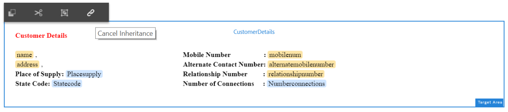

# Zelfstudie: Interactieve communicatie maken {#tutorial-create-interactive-communication}

Deze zelfstudie is een stap in de [eerste interactieve communicatiereeks](/help/forms/using/create-your-first-interactive-communication.md) maken. U wordt aangeraden de reeks in chronologische volgorde te volgen om het volledige gebruik van de zelfstudie te begrijpen, uit te voeren en aan te tonen.

Nadat u alle bouwstenen voor de webversie hebt gemaakt, zoals het formuliergegevensmodel, documentfragmenten, sjablonen en thema&#39;s, kunt u een interactieve communicatie maken.

De interactieve Mededelingen kunnen door twee kanalen worden geleverd: Afdrukken en web. U kunt ook een interactieve communicatie maken met Afdrukkanaal als stramien. De druk als hoofdoptie voor het kanaal van het Web verzekert de inhoud, de overerving, en de gegevensband van het kanaal van het Web wordt afgeleid uit het kanaal van de Druk. Het zorgt ook dat de veranderingen in het kanaal van de Druk worden aangebracht gesynchroniseerd in het kanaal van het Web. De interactieve auteurs van Communicatie worden, echter, toegestaan om de overerving voor specifieke componenten in het kanaal van het Web te breken.

Dit leerprogramma begeleidt u door de stappen om interactieve mededelingen voor de kanalen van de Druk en van het Web tot stand te brengen. Aan het einde van deze zelfstudie kunt u het volgende doen:

* Interactieve communicatie maken voor het afdrukkanaal
* Interactieve communicatie voor het webkanaal maken
* Interactieve communicatie voor afdrukken en web maken met Afdrukken als origineel

## Interactieve communicatie voor afdrukken en web maken zonder synchronisatie {#create-interactive-communications-for-print-and-web-with-no-synchronization}

### Interactieve communicatie voor afdrukkanaal maken {#create-interactive-communication-for-print-channel}

Hier volgt een lijst met bronnen die al in deze zelfstudie zijn gemaakt en die nodig zijn tijdens het maken van de interactieve communicatie voor het kanaal Afdrukken:

**Afdruksjabloon:** [create_first_ic_print_template](../../forms/using/create-templates-print-web.md)

**Formuliergegevensmodel:** [FDM_Create_First_IC](../../forms/using/create-form-data-model0.md)

**Documentfragmenten:** [bill_details_first_ic, customer_details_first_ic, bill_summary_first_ic, summary_charges_first_ic](../../forms/using/create-document-fragments.md)

**Lay-outfragmenten:** [table_lf](../../forms/using/create-templates-print-web.md)

**Afbeeldingen:** PayNow en ValueAddedServices

1. Meld u aan bij de AEM-auteur en navigeer naar **[!UICONTROL Adobe Experience Manager]** > **[!UICONTROL Formulieren]** > **[!UICONTROL Formulieren en documenten]**.
1. Tik op **Maken** en selecteer **Interactieve communicatie**. De **Create Interactive Communication** tovenaar wordt getoond.
1. Geef **create_first_ic** op in het veld **Titel** en **Naam** . Selecteer **FDM_Create_First_IC** als het Model van de Gegevens van het Vorm en tik **daarna**.
1. In de wizard **Kanalen** :

   1. Geef **create_first_ic_print_template** op als de afdruksjabloon en tik op **Selecteren**. Zorg ervoor dat het selectievakje Afdrukken als stramien **gebruiken voor webkanaal** niet is ingeschakeld.

   1. Specificeer **Create_First_IC_templates** omslag > **Create_First_IC_Web_Template** als malplaatje van het Web en tik **Uitgezocht**.

   1. Tik op **Maken**.
   Er wordt een bevestigingsbericht weergegeven dat de interactieve communicatie is gemaakt.

1. Tik op **Bewerken** om de interactieve communicatie in het rechterdeelvenster te openen.
1. Ga naar het tabblad **Middelen** en pas het filter toe om alleen de documentfragmenten in het linkervenster weer te geven.
1. Sleep de volgende documentfragmenten naar het doelgebied in de interactieve communicatie.

   | Documentfragment | Doelgebied |
   |---|---|
   | bill_details_first_ic | BillDetails |
   | customer_details_first_ic | CustomerDetails |
   | bill_summary_first_ic | BillSummary |
   | summary_charges_first_interactive_communication | Heffingen |

   

1. Tik op het doelgebied **Teksten** en tik op **+** om een **diagramcomponent** toe te voegen.
1. Tik op de component Chart en selecteer  (Configureren). De grafiekeigenschappen worden weergegeven in het linkerdeelvenster:

   1. Geef een naam op voor het diagram.
   1. Selecteer **Schijf** van de drop-down lijst van het Type **van** Grafiek.
   1. Selecteer het **calltype** bezit van het **type van objecten van het vraaggegevensmodel** in de **x-as** sectie. Tik op .
   1. Selecteer **Frequentie** in de vervolgkeuzelijst **Functie** .
   1. Selecteer het **calltype** bezit van het **type van objecten van het vraaggegevensmodel** in de **y-as** sectie. Tik op .
   1. Tik  om de diagrameigenschappen op te slaan.

1. Ga naar het tabblad **Middelen** en pas het filter toe om alleen de layoutfragmenten in het linkerdeelvenster weer te geven. De belemmering-en-daling het **table_lf** lay-outfragment aan het **Gespecialiseerde het doelgebied van Vraag** .
1. Selecteer het Tekstveld in de kolom **Datum** en tik op  (Configureren).
1. Selecteer **Gegevensmodelobject** in de vervolgkeuzelijst **Bindingstype** en selecteer **aanroepen** > **calldate**. Tik  tweemaal om de eigenschappen op te slaan.

   Op dezelfde manier creeer band met **calltime**, **callnumber**, **callduration**, en **calllasten** voor tekstgebieden in de kolommen **Tijd************** ,Number,Duration, enCharges.

1. Tik op **het doelgebied van PayNow** en tik op **+** om een **afbeeldingscomponent** toe te voegen.
1. Tik op de component Image en selecteer  (Configureren). De eigenschappen van de afbeelding worden weergegeven in het linkervenster:

   1. Geef **PayNow** op als naam voor de afbeelding in het veld **Naam** .
   1. Tik op **Uploaden**, selecteer de afbeelding die u in het lokale bestandssysteem hebt opgeslagen en tik op **Openen**.
   1. Tik  om de afbeeldingseigenschappen op te slaan.

1. Herhaal stap 13 en 14 om **beeld ValueAddedServices** aan het **doelgebied ValueAddedServices** toe te voegen.

### Interactieve communicatie voor webkanaal maken {#create-interactive-communication-for-web-channel}

Hier volgt een lijst met bronnen die al in deze zelfstudie zijn gemaakt en die nodig zijn tijdens het maken van de interactieve communicatie voor het webkanaal:

**Websjabloon:** [Create_First_IC_Web_Template](../../forms/using/create-templates-print-web.md)

**Formuliergegevensmodel:** [FDM_Create_First_IC](../../forms/using/create-form-data-model0.md)

**Documentfragmenten:** [bill_details_first_ic, customer_details_first_ic, bill_summary_first_ic, summary_charges_first_ic](../../forms/using/create-document-fragments.md)

**Afbeeldingen:** PayNowWeb en ValueAddedServicesWeb

1. Meld u aan bij de AEM-auteur en navigeer naar **[!UICONTROL Adobe Experience Manager]** > **[!UICONTROL Formulieren]** > **[!UICONTROL Formulieren en documenten]**.
1. Tik op **Maken** en selecteer **Interactieve communicatie**. De **Create Interactive Communication** tovenaar wordt getoond.
1. Geef **create_first_ic** op in het veld **Titel** en **Naam** . Selecteer **FDM_Create_First_IC** als het Model van de Gegevens van het Vorm en tik **daarna**.
1. In de wizard **Kanalen** :

   1. Geef **create_first_ic_print_template** op als de afdruksjabloon en tik op **Selecteren**. Zorg ervoor dat het selectievakje Afdrukken als stramien **gebruiken voor webkanaal** niet is ingeschakeld.

   1. Specificeer **Create_First_IC_templates** omslag > **Create_First_IC_Web_Template** als malplaatje van het Web en tik **Uitgezocht**.

   1. Tik op **Maken**.
   Er wordt een bevestigingsbericht weergegeven dat de interactieve communicatie is gemaakt.

1. Tik op **Bewerken** om de interactieve communicatie in het rechterdeelvenster te openen.
1. Tik op het tabblad **Kanalen** in het linkerdeelvenster en tik op **Web**.
1. Ga naar het tabblad **Middelen** en pas het filter toe om alleen de documentfragmenten in het linkervenster weer te geven.
1. Sleep de volgende documentfragmenten naar het doelgebied in de interactieve communicatie.

   | Documentfragment | Doelgebied |
   |---|---|
   | bill_details_first_ic | BillDetails |
   | customer_details_first_ic | CustomerDetails |
   | bill_summary_first_ic | BillSummary |
   | summary_charges_first_interactive_communication | Heffingen |

1. Tik op **Overzicht van laden** in het doelgebied en tik op **+** om een **diagramcomponent** toe te voegen.
1. Tik op de component Chart en selecteer  (Configureren). De grafiekeigenschappen worden weergegeven in het linkerdeelvenster:

   1. Geef een naam op voor het diagram.
   1. Selecteer **Schijf** van de drop-down lijst van het Type **van** Grafiek.

   1. Selecteer het **calltype** bezit van het **type van objecten van het vraaggegevensmodel** in de **x-as** sectie. Tik op .

   1. Selecteer **Frequentie** in de vervolgkeuzelijst **Functie** .

   1. Selecteer het **calltype** bezit van het **type van objecten van het vraaggegevensmodel** in de **y-as** sectie. Tik op .

   1. Tik  om de diagrameigenschappen op te slaan.

1. Selecteer het lusje van **Gegevensbronnen** van de linkerruit en belemmering-en-daling het voorwerp van het **vraaggegevensmodel** aan het **Gedetailleerde doelgebied van Vraag** . Alle eigenschappen in het voorwerp van het **vraaggegevensmodel** worden getoond als lijstkolommen in het **Gespecialiseerde het doelgebied van Vraag** in de juiste ruit.

   Gebaseerd op het gebruiksgeval, vereist u de Datum van de Vraag, de Tijd van de Vraag, het Aantal van de Vraag, de Duur van de Vraag, en de kolommen van de Heffingen van de Vraag in de lijst.

   

1. Selecteer de kolomkop van de **Mobilenum** -tabel en selecteer **Meer opties** > **Kolom** verwijderen. Op dezelfde manier schrap de **Calltype** kolom.
1. Selecteer de de kolomrubriek van de **Lijst van de Bijgewerkte** lijst en tik  (geef uit) om de tekst anders te noemen in de Datum **van de** Vraag. Wijzig de naam van de andere kolomkoppen in de tabel.
1. Op basis van het gebruikscase voegt u een knop Nu **** betalen in de interactieve communicatie in waarmee de gebruiker de betaling kan uitvoeren door op de knop te klikken. Voer de volgende stappen uit om de knop in te voegen:

   1. Tik op het doelgebied Nu **** betalen en tik op **+** om een **tekstcomponent** toe te voegen.

   1. Tik op de tekstcomponent en tik op  (Bewerken).
   1. Wijzig de naam van de tekst in Nu **betalen**.
   1. Selecteer de tekst en tik op het hyperlinkpictogram.
   1. Geef de betalings-URL op in het veld **Pad** .
   1. Selecteer **Nieuw tabblad** in de vervolgkeuzelijst **Doel** .

   1. Tik  om de eigenschappen van de hyperlink op te slaan.

1. Selecteer **Stijl** in de vervolgkeuzelijst naast de optie **Voorvertoning** .

   

1. Maak de hyperlinktekst zodanig op dat deze als een knop in de interactieve communicatie wordt weergegeven. Ga hierbij als volgt te werk:

   1. Tik op de tekstcomponent en selecteer  (Bewerken).
   1. Geef in de sectie **Rand** **1,5 px** op als **Randbreedte**, selecteer **Effen** als **Randstijl****** **** en geef 46 pxop als Grensstraal.

   1. Selecteer Rood als achtergrondkleur voor de knop in het gedeelte **Achtergrond** .
   1. Tik in het veld **Marge** voor de sectie **Afmetingen en positie** op het pictogram Gelijktijdig **** bewerken en stel de **rechtermarge** in op **450 px**. De velden Boven, Onder en Links worden ingesteld als leeg.
   

1. Tik op het doelgebied Nu **betalen** en tik op **+** om een **afbeeldingscomponent** toe te voegen.
1. Tik op de component Image en selecteer  (Configureren). De eigenschappen van de afbeelding worden weergegeven in het linkervenster:

   1. Geef **PayNow** op als naam voor de afbeelding in het veld **Naam** .

   1. Tik op **Uploaden**, selecteer de **PayNowWeb** -afbeelding die is opgeslagen op het lokale bestandssysteem en tik op **Openen**.

   1. Tik  om de afbeeldingseigenschappen op te slaan.

1. Gebaseerd op het gebruiksgeval, neem een **Abonneren** knoop in de Interactieve Mededeling op die de gebruiker een optie verstrekt om aan de diensten van de toegevoegde waarde in te tekenen door de knoop te klikken.

   Herhaal stappen 13 - 17 om een **knoop van het Abonneren** aan het **Waarde Toegevoegde het doelgebied van de Diensten** toe te voegen en het beeld **ValueAddedServicesWeb** toe te voegen.

## Interactieve communicatie voor afdrukken en web maken met automatische synchronisatie {#create-interactive-communications-for-print-and-web-with-auto-synchronization}

U kunt ook een interactieve communicatie maken door automatische synchronisatie tussen Afdrukken en Webkanalen in te schakelen. Als u automatische synchronisatie wilt inschakelen, selecteert u de optie Afdrukken als stramien tijdens het maken van de interactieve communicatie. Als u de optie Afdrukken als stramien selecteert, wordt de inhoud, overerving en gegevensbinding van het webkanaal afgeleid van het kanaal Afdrukken. Het zorgt ook dat de veranderingen in het kanaal van de Druk worden aangebracht weerspiegeld in het kanaal van het Web.

Voer de volgende stappen uit om de inhoud van het Kanaal van het Web af te leiden gebruikend het kanaal van de Druk:

1. Meld u aan bij de AEM-auteur en navigeer naar **[!UICONTROL Adobe Experience Manager]** > **[!UICONTROL Formulieren]** > **[!UICONTROL Formulieren en documenten]**.
1. Tik op **Maken** en selecteer **Interactieve communicatie**. De **Create Interactive Communication** tovenaar wordt getoond.
1. Geef **create_first_ic** op in het veld **Titel** en **Naam** . Selecteer **FDM_Create_First_IC** als het Model van de Gegevens van het Vorm en tik **daarna**.
1. In de wizard **Kanalen** :

   1. Geef **create_first_ic_print_template** op als de afdruksjabloon en tik op **Selecteren**.

   1. Schakel het selectievakje Afdrukken als stramien **gebruiken voor webkanaal** in.
   1. Specificeer **Create_First_IC_templates** omslag > **Create_First_IC_Web_Template** als malplaatje van het Web en tik **Uitgezocht**.

   1. Tik op **Maken**.
   Er wordt een bevestigingsbericht weergegeven dat de interactieve communicatie is gemaakt.

1. Tik op **Bewerken** om de interactieve communicatie in het rechterdeelvenster te openen.
1. Voer stap 6 - 15 uit van de sectie Interactieve communicatie [maken voor het kanaal](../../forms/using/create-interactive-communication0.md#create-interactive-communication-for-print-channel) Afdrukken.
1. Tik op het tabblad **Kanalen** in het linkerdeelvenster en tik op **Web** om automatisch inhoud voor het webkanaal te genereren via het kanaal Afdrukken.
1. Aangezien het **selectievakje Afdrukken als stramien voor webkanaal** gebruiken is ingeschakeld in stap 4, worden de inhoud en bindingen automatisch gegenereerd voor webkanaal via het kanaal Afdrukken.

   De inhoud van het afdrukkanaal wordt ingevoegd onder de inhoud van de webkanaalsjabloon. Als u de inhoud van het webkanaal wilt wijzigen die automatisch is gegenereerd via het kanaal Afdrukken, kunt u de overerving voor elk doelgebied annuleren.

   Houd de cursor boven het desbetreffende doelgebied in het webkanaal en selecteer  annuleren (Overerving annuleren). Tik vervolgens op **Ja** in het dialoogvenster Overerving **** annuleren.

   

   Als u de overerving van een component hebt geannuleerd, kunt u deze opnieuw inschakelen. Als u overerving weer wilt inschakelen, plaatst u de cursor boven de grens van het desbetreffende doelgebied, dat de component omvat, en tikt u op .

1. Selecteer het tabblad **Inhoud** in het linkerdeelvenster.
1. Sleep de automatisch gegenereerde webkanaalinhoud naar de bestaande deelvensters in de websjabloon met de inhoudsstructuur. Hieronder volgt een lijst met onderdelen die opnieuw moeten worden gerangschikt:

   * De component van Details van de rekening aan het paneel van Details van de Rekening
   * Customer Details component naar het deelvenster Customer Details
   * De Samenvattingscomponent van de Rekening aan het paneel van de Samenvatting van de Rekening
   * Samenvatting van de component van Heffingen aan Samenvatting van het paneel van Heffingen
   * Het fragment van de lay-out (lijst) aan het Gespecialiseerde paneel van Vraag
   

1. Herhaal stap 13 - 18 van [Create Interactive Communication for Web channel](../../forms/using/create-interactive-communication0.md#create-interactive-communication-for-web-channel) om de hyperlinks van het **betalen nu** op te nemen en in het kanaal van het Web van de Interactieve Mededeling **te abonneren** .

