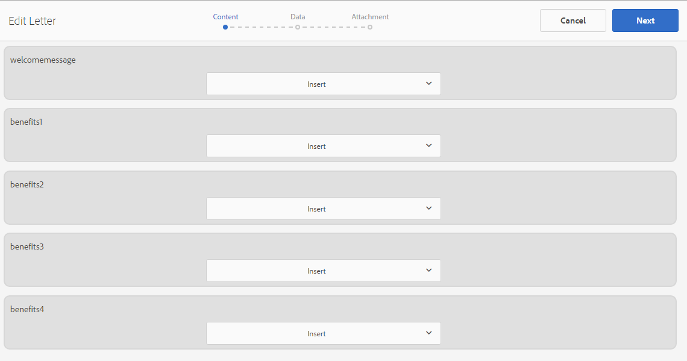

# Letter maken {#create-letter}

## Workflow voor Correspondentenbeheer {#correspondence-management-workflow}

De Correspondentiebeheerworkflow bestaat uit vier fasen:

1. Sjabloon maken
1. Documentfragment maken
1. Letter maken
1. Postverwerking

### Sjabloon maken {#template-creation}

In de volgende afbeelding ziet u een typische workflow voor het maken van een correspondentiesjabloon.

In deze workflow:

1. Formulierontwerpers maken lay-outs en fragmentlay-outs met behulp van Adobe Forms Designer en uploaden deze naar een CRX-opslagplaats. De indelingen bevatten standaardformuliervelden, indelingsfuncties zoals een kop- en voettekst en lege doelgebieden voor de plaatsing van inhoud. Later, brengen de Specialisten van de Toepassing de inhoud in kaart die voor deze doelgebieden wordt vereist. Meer informatie over [ontwerpen, lay-out](/help/forms/using/layout-design-details.md).
1. Experts op het gebied van Onderwerpen van juridische afdelingen, financiën of marketing maken en uploaden inhoud, zoals disclaimers van tekstclausules, voorwaarden en afbeeldingen, zoals logo&#39;s, die opnieuw worden gebruikt in verschillende correspondentiesjablonen.
1. Toepassingsspecialisten maken correspondentiesjablonen. De toepassingsspecialist

   * Hiermee kunt u tekstclausules en afbeeldingen toewijzen aan doelgebieden in lay-outsjablonen
   * Definieert voorwaarden/regels voor het opnemen van inhoud
   * Hiermee bindt u indelingsvelden en variabelen aan onderliggende gegevensmodellen

1. De auteur geeft een voorvertoning van de brief weer en verzendt deze voor nabewerking. Meer informatie over [postverwerking](/help/forms/using/submit-letter-topostprocess.md).

#### Het gebruiken van brievenmalplaatjes die met Correspondentenbeheer worden verstrekt {#using-letter-templates-provided-with-correspondence-management}

In plaats van een lay-outsjabloon helemaal zelf te maken, kunt u de sjablonen die Correspondence Management biedt, wijzigen en opnieuw gebruiken. U kunt ontwerper gebruiken om de branding en de gegevens en inhoudsgebieden van de malplaatjes snel te wijzigen om de behoeften van uw organisatie aan te passen. Zie voor meer informatie over Correspondentenbeheersjablonen [Referentielettersjablonen](/help/forms/using/reference-cm-layout-templates.md).

### Document fragment maken {#document-fragment-creation}

Documentfragmenten zijn herbruikbare\nonderdelen van correspondentie waarmee u letters\correspondentie kunt samenstellen.

De documentfragmenten zijn van de volgende typen:

#### Tekst {#text}

Een tekstelement is een stuk inhoud dat bestaat uit een of meer tekstalinea&#39;s. Een alinea kan statisch of dynamisch zijn. Een dynamische alinea bevat verwijzingen naar gegevenselementen waarvan de waarden bij uitvoering worden verschaft.

#### Lijst {#list}

List is een reeks documentfragmenten, zoals tekst, lijsten (dezelfde lijst kan niet op zichzelf worden toegevoegd), voorwaarden en afbeeldingen. De volgorde van de lijstelementen kan vast of bewerkbaar zijn. Tijdens het maken van een letter kunt u enkele of alle lijstelementen gebruiken om een herbruikbaar patroon van elementen te repliceren.

#### Voorwaarde {#condition}

De voorwaarden laten u toe om te bepalen welke inhoud inbegrepen bij de tijd van de brievenverwezenlijking wordt, die op de geleverde gegevens wordt gebaseerd. De voorwaarde wordt beschreven in termen van controlevariabelen. De variabelen kunnen een gegevenswoordenboekelement of een plaatsaanduiding zijn. Wanneer u een voorwaarde toevoegt, kunt u verkiezen om een activa op te nemen die op de waarde wordt gebaseerd die de controlevariabele heeft. Voorwaarden hebben één uitvoer op basis van een expressie. De eerste expressie wordt op basis van de variabele van de huidige voorwaarde op true ingesteld. De waarde ervan wordt de uitvoer van de voorwaarde.

#### Lay-outfragment {#layout-fragment}

Een lay-outfragment is een lay-out die binnen één of meerdere letters kan worden gebruikt. Een lay-outfragment wordt gebruikt om herhaalbare patronen, vooral dynamische lijsten tot stand te brengen. De indeling kan typische formuliervelden bevatten, zoals &quot;Adres&quot; en &quot;Referentienummer&quot;. Het bevat ook lege subformulieren die doelgebieden aangeven. De lay-outs (XDP&#39;s) worden gemaakt in Designer en worden vervolgens [geüpload naar Forms en Documenten](/help/forms/using/get-xdp-pdf-documents-aem.md).

### Letter maken {#letter-creation}

Er zijn twee manieren om de correspondentie te produceren die naar uw klanten wordt verzonden: gebruiker-gedreven en systeem-gedreven.

#### Door gebruiker aangedreven {#user-driven}

Aan de klant gerichte werknemers zoals schaderegelaars of casewerkers kunnen aangepaste correspondentie maken. Met een eenvoudige en intuïtieve interface voor het vullen van letters kunnen zakelijke gebruikers optionele tekst aan de correspondentie toevoegen, bewerkbare inhoud personaliseren en de correspondentie in real-time voorvertonen. Zij kunnen dan de aangepaste correspondentie aan een achtereind proces voorleggen.

#### Systeemgestuurd {#system-driven}

Het genereren van correspondentie wordt geautomatiseerd, gestuurd door gebeurtenistriggers. Een herinnering die bijvoorbeeld naar een burger wordt gestuurd en die haar vraagt om een voorafgaande belastingaangifte, wordt gegenereerd door de vooraf gedefinieerde sjabloon samen te voegen met burgergegevens. De laatste letter kan worden gemaild, afgedrukt, gefaxt of gearchiveerd.

### Nabewerking {#post-processing}

De uiteindelijke correspondentie kan voor nabewerking naar een back-end proces worden gestuurd. De correspondentie kan zijn:

1. Verwerkt voor afdrukken via e-mail, fax of batch of in een map geplaatst voor afdrukken of e-mailen.
1. Ter controle en goedkeuring ingediend.
1. Beveiligd door het toepassen van digitale handtekeningen, certificering, codering of rechtenbeheer.
1. Omgezet in een doorzoekbaar PDF-document dat alle metagegevens bevat die nodig zijn voor archivering en controle.
1. Opgenomen in een PDF-Portfolio dat meer documenten bevat, zoals marketingmateriaal. Het PDF-Portfolio kan vervolgens als laatste briefwisseling worden verzonden.

### Correspondentenbeheeroplossingsarchitectuur {#correspondence-management-solution-architecture}

De volgende afbeelding biedt een overzicht van een voorbeeldarchitectuur van de Letters Solution.

## Een letter deconstrueren {#deconstructing-a-letter}

Dit annuleringsdocument is een voorbeeld van een gebruikelijke correspondentie:

<table> 
 <tbody> 
  <tr> 
   <td><strong>Letter-elementen</strong></td> 
   <td><strong>Beschrijving</strong></td> 
   <td><strong>Opgemaakt met</strong></td> 
  </tr> 
  <tr> 
   <td>Gegevens van back-end bedrijfssystemen</td> 
   <td>Gegevens die afkomstig zijn van back-end bedrijfssystemen. De gegevens worden dynamisch samengevoegd met de correspondentiesjabloon.</td> 
   <td>De  Gegevensbestand gemaakt op basis van een gegevenswoordenboek</td> 
  </tr> 
  <tr> 
   <td>Gegevens  Door eerstelijnsambtenaar ingevoerd</td> 
   <td>Gegevens die kunnen worden verstrekt door een eerstelijns werknemer die de brief alvorens het uit te verzenden aanpast.  </td> 
   <td>
Onbeschermde DD-elementen  Bewerkbare tekstalinea's  Variabelen/plaatsaanduidingen  
 </td> 
  </tr> 
  <tr> 
   <td>Vooraf goedgekeurd  Tekstalinea's</td> 
   <td>Vooraf goedgekeurde tekstinhoud. Deskundigen in Juridische Zaken, Financiën, of een lijn van zaken die de bedrijfscontext van de brief begrijpen, typisch auteur de tekstinhoud. De meeste letters bevatten inhoud zoals koptekst, voettekst, disclaimers en aanhef. Inhoud zoals "reden tot beëindiging" zou echter specifiek zijn voor de desbetreffende brief.</td> 
   <td>
Tekst\Lijsten\  Voorwaarden\Layout
 
 
 </td> 
  </tr> 
  <tr> 
   <td>Gegevens  Gebaseerd op aangepaste logica?</td> 
   <td>Voor sommige letters, zoals een brief om meer informatie over een claim te vragen, kunnen gebruikers zoals de Aanpassing van claims aangepaste tekst toevoegen.</td> 
   <td>Document  Fragment van type Condition </td> 
  </tr> 
  <tr> 
   <td>Opgeslagen  Afbeeldingen uit centrale opslagplaats</td> 
   <td>Afbeeldingen zoals logo's en handtekeningafbeeldingen. Afbeeldingen zoals bedrijfslogo's worden in de meeste of alle correspondentie weergegeven. Afbeeldingen van handtekeningen zijn specifiek voor de brief en voor de persoon namens wie de brief wordt verzonden.</td> 
   <td>
Afbeeldingen opgeslagen in AEM (DAM)  
 
 
 </td> 
  </tr> 
 </tbody> 
</table>

## Een brief analyseren voordat u deze samenstelt {#analyze-a-letter-before-you-construct-it}

Analyseer elke brief om de verschillende stukken te ontdekken die de brief vormen. De toepassingsspecialist analyseert de correspondentie die wordt gegenereerd.

* Welke delen van de correspondentie statisch en dynamisch zijn. De variabelen die worden ingevuld vanuit achterwaartse gegevensbronnen of door eindgebruikers.
* De volgorde waarin de verschillende tekstalinea&#39;s in de correspondentie worden weergegeven, bijvoorbeeld of een zakelijke gebruiker alinea&#39;s kan wijzigen tijdens het maken van correspondentie.
* Is het correspondentiesysteem gegenereerd of vereist het dat een eindgebruiker de correspondentie bewerkt? Hoeveel correspondentie wordt door het systeem gegenereerd en hoeveel gebruikers moeten ingrijpen?
* Hoe vaak verandert het correspondentiesjabloon? Wordt het jaarlijks, driemaandelijks, of slechts wanneer een bepaalde wetgeving verandert, bijgewerkt? Welk type van veranderingen wordt verwacht? Is het een verandering om typografische fouten, een lay-outverandering te bevestigen, meer gebieden toe te voegen, meer paragrafen toe te voegen, etc.
* Wanneer u uw correspondentievereisten plant, stel de lijst van nieuwe correspondentiesjablonen samen. Voor elke correspondentiesjabloon hebt u het volgende nodig:

   * Tekstclausules, afbeeldingen en tabellen
   * Gegevenswaarden van back-endsystemen
   * De lay-out en fragmentlay-outs van de overeenkomst
   * De volgorde waarin de inhoud in de brief staat en de regels voor het opnemen en uitsluiten van inhoud

* De voorwaarden waaronder zakelijke gebruikers, zoals schaderegelaars of casewerkers, inhoud of gedeelten van de letter wijzigen.
* Scenario&#39;s zijn verhalen die de gebruikerservaring, de vereisten, en de voordelen beschrijven om de Oplossing van Letters te gebruiken.
* De scenario&#39;s verstrekken ook:De vereiste vaardigheidsreeksen en de hulpmiddelen u voor uw project vereist.
* Aanbevolen procedures voor het plannen van uw implementatie. &quot;Implementatieoverzicht op hoog niveau.

## Voordelen van het uitvoeren van de analyse {#benefits-of-performing-the-analysis}

**Inhoud opnieuw gebruiken** U hebt een geconsolideerde lijst met nieuwe inhoud vereist voor het genereren van correspondentie. Veel van de inhoud, zoals kop- en voetteksten, disclaimers en introducties, komt voor in veel letters en kan in verschillende letters worden hergebruikt. Al dergelijke gemeenschappelijke inhoud kan eenmaal door deskundigen worden gecreëerd en goedgekeurd en vervolgens in veel correspondentie worden hergebruikt.

**Het gegevenswoordenboek samenstellen** Er zijn gegevenswaarden zoals &quot;Customer ID&quot; en &quot;Customer Name&quot; die veel letters bevatten. U kunt een geconsolideerde lijst van al dergelijke gegevenswaarden opstellen. Meestal wordt iemand van het middleware-team van de onderneming geraadpleegd bij het plannen van de structuur. Dit vormt de basis voor het samenstellen van het gegevenswoordenboek.

**Bronnen voor gegevens van back-end bedrijfssystemen** U zult ook alle gegevenswaarden kennen die nodig zijn en van waar de gegevens van het ondernemingssysteem worden verkregen. U kunt de implementatie vervolgens archiveren om de gegevens uit het bedrijfssysteem te halen en de oplossing Letters te gebruiken.

**De complexiteit van letters schatten** Het is belangrijk te bepalen hoe complex het zal zijn om een bepaalde correspondentie te creëren. Deze analyse helpt in het bepalen van de hoeveelheid tijd en vaardigheidsreeksen die zullen worden vereist om de brievenmalplaatjes tot stand te brengen. Dit zal op zijn beurt helpen bij het schatten van de middelen en kosten voor de implementatie van de oplossing Letters.

## Correspondentie-complexiteit {#correspondence-complexity}

De complexiteit van de correspondentie kan worden bepaald door de volgende parameters te analyseren:

**Indelingscomplexiteit** Hoe complex is de lay-out? Letters zoals Bericht van annulering hebben eenvoudige lay-outs. Terwijl letters zoals de bevestiging van de dekking voor claims een complexe indeling hebben met verschillende tabellen en meer dan 60 formuliervelden. Het maken van complexe lay-outs kost meer tijd en vereist geavanceerde vaardigheden voor het ontwerpen van lay-outs.

**Aantal tekstalinea&#39;s en -voorwaarden** Een leningscontract kan 10 pagina&#39;s lang zijn en meer dan 40 tekstclausules bevatten. Veel van deze clausules zouden afhangen van &quot;leningparameters. Op basis van de exacte voorwaarden zouden de clausules worden opgenomen in of uitgesloten van het contract. Het creëren van dergelijke brieven vereist grondige planning en zorgvuldige definitie van de complexe voorwaarden.

In deze tabel vindt u een aantal richtlijnen waarmee u uw letters kunt classificeren:

<table> 
 <tbody> 
  <tr> 
   <td>
<strong>Complexiteitsniveau</strong>
 </td> 
   <td>
<strong>Indelingscomplexiteit (subjectief)</strong>
 </td> 
   <td>
<strong>Aantal tekstalinea's</strong>
 </td> 
   <td>
<strong>Aantal voorwaardelijke teksten of afbeeldingen</strong>
 </td> 
   <td>
<strong>Vereiste vaardigheidsset</strong>
 </td> 
  </tr> 
  <tr> 
   <td>
Lage complexiteit
 </td> 
   <td>
Laag. Indeling heeft weinig formuliervelden (&lt;15).
 
Doorgaans één pagina.
 </td> 
   <td>
8
 </td> 
   <td>
1
 </td> 
   <td>
Normale Designer-vaardigheden.
 </td> 
  </tr> 
  <tr> 
   <td>
Normale complexiteit
 </td> 
   <td>
Lay-out met gemiddelde complexiteit. Omvat structuren zoals tabellen. Doorgaans meerdere pagina's lang.
 </td> 
   <td>
16
 </td> 
   <td>
2
 </td> 
   <td>
Normale Designer-vaardigheden.
 
 
 
Mogelijkheid om complexe expressies te maken met gebruikersinterfaces.
 </td> 
  </tr> 
  <tr> 
   <td>
Hoge complexiteit
 </td> 
   <td>
Complexe indeling. Kan uit meer dan drie pagina's bestaan. Bevat tabellen en meer dan 60 formuliervelden.
 </td> 
   <td>
40
 </td> 
   <td>
8
 </td> 
   <td>
Expert Designer-vaardigheden.
 
 
 
Mogelijkheid om complexe expressies te maken met gebruikersinterfaces.
 </td> 
  </tr> 
 </tbody> 
</table>

## Overzicht van het maken van een letter {#overview-of-creating-a-letter}

1. Selecteer de juiste indeling die als basis voor de letter fungeert en maak een letter.
1. Voeg gegevensmodules of lay-outfragmenten aan de brief toe en vorm hen.
1. Geef een voorvertoning van de correspondentie weer.
1. Bewerk de velden, variabelen, inhoud en bijlagen en stel deze in.

### Vereisten {#prerequisites}

U hebt eerst het volgende nodig om een correspondentie te maken:

* [Compatibiliteitspakket](compatibility-package.md). Installeer het compatibiliteitspakket om het dialoogvenster **Letters** de optie **Forms** pagina.
* De letter XDP ([layout](/help/forms/using/document-fragments.md)).
* Overige XDP&#39;s ([lay-outfragmenten](document-fragments.md#document-fragments)) die deel uitmaken van de letter. De XDPs \ Lay-outs worden gecreeerd in [Designer](https://www.adobe.com/go/learn_aemforms_designer_65).
* De relevante [gegevenswoordenboek](/help/forms/using/data-dictionary.md) (Optioneel).
* De [gegevensmodules](/help/forms/using/document-fragments.md) wilt gebruiken in de correspondentie.
* [Testgegevens](/help/forms/using/data-dictionary.md#p-working-with-test-data-p) Dit is het XML-bestand met de testgegevens die erin worden geëxporteerd. Testgegevens zijn vereist als u een gegevenswoordenboek gebruikt.

## Een lettertypesjabloon maken {#create-a-letter-template}

### Selecteer een lay-out en voer de lettereigenschappen in {#select-a-layout-and-enter-the-letter-properties}

1. Selecteren **Forms** > **Letters**.

1. Selecteren **Maken > Letter**. Correspondence Management geeft de beschikbare lay-outs (XDP&#39;s) weer. Deze indelingen zijn afkomstig van Designer. De indelingen bevatten ook de lettertypesjablonen die in het vak Correspondentiebeheer zijn opgegeven. Zie voor meer informatie over Correspondentenbeheersjablonen [Referentielettersjablonen](/help/forms/using/reference-cm-layout-templates.md). Als u uw eigen lay-outs wilt toevoegen, maakt u XDP-bestanden (layout) in Designer en [uploaden naar AEM Forms](/help/forms/using/get-xdp-pdf-documents-aem.md).

   

1. Selecteer een lay-out door erop te tikken en selecteer **Volgende**.

   

1. Voer de eigenschappen voor de correspondentie in en selecteer **Opslaan:**

   * **Titel (optioneel):** Voer de titel voor de letter in. De titel hoeft niet uniek te zijn en kan speciale tekens en niet-Engelse tekens bevatten.
   * **Naam:** De unieke naam voor de letter. Geen twee letters in een staat kunnen bestaan met dezelfde naam. In het veld Naam kunt u alleen Engelse tekens, cijfers en afbreekstreepjes invoeren. Het veld Naam wordt automatisch ingevuld op basis van het veld Titel. De speciale tekens, spaties, getallen en niet-Engelse tekens die in het veld Titel zijn ingevoerd, worden vervangen door afbreekstreepjes in het veld Naam. Hoewel de waarde in het veld Titel automatisch naar de naam wordt gekopieerd, kunt u de waarde bewerken.
   * **Beschrijving (optioneel):** Beschrijf de letter ter referentie.
   * **Gegevenswoordenboek (optioneel)**: Het gegevenswoordenboek kan aan de correspondentie worden gekoppeld. De elementen die u later in deze correspondentie invoegt, moeten ofwel hetzelfde gegevenswoordenboek hebben als het gegevenswoordenboek dat u hier voor de correspondentie kiest, ofwel geen gegevenswoordenboek.
   * **Tags (optioneel):** Selecteer de tags die u op de correspondentie wilt toepassen. U kunt ook een nieuwe/aangepaste tagnaam typen en op Enter drukken om deze te maken.
   * **Nabewerking (optioneel):** Selecteer het postproces dat op het brievenmalplaatje moet worden toegepast. Er zijn geen postprocessen in de doos en degenen u gebruikend AEM, zoals e-mail en druk hebt gecreeerd.

   

1. Het systeem geeft een bericht weer: &quot;Letter created successfully.&quot; (in het waarschuwingsbericht) Selecteer **Openen** om de gegevensmodules en lay-outfragmenten in het te vormen. Of selecteer **Gereed** om terug te gaan naar de vorige pagina.

   

   **Volgende**: Wanneer u **Openen** In Correspondence Management wordt een voorstelling van de layout weergegeven met alle componenten in de weergegeven layout (XDP). Ga verder met het invoegen van de [De Modules van gegevens en de Fragmenten van de Lay-out en het Vormen hen](/help/forms/using/create-letter.md#p-insert-data-modules-and-layout-fragments-in-a-letter-and-configure-them-p).

### Gegevensmodules en lay-outfragmenten in een brief opnemen en hen vormen {#insert-data-modules-and-layout-fragments-in-a-letter-and-configure-them}

Wanneer u een correspondentie hebt gemaakt, selecteert u Openen, wordt in Correspondentiebeheer een weergave weergegeven van de indeling met alle subformulieren/doelgebieden in de indeling (XDP). In elk van de doelgebieden kunt u een gegevensmodule of een layoutfragment invoegen (en vervolgens gegevensmodules in het lay-outfragment).

>[!NOTE]
>
>U kunt er ook voor kiezen om het pictogram Bewerken te selecteren voor een letter op de pagina Letters om gegevensmodules en lay-outfragmenten in een letter in te voegen en ze te configureren.

1. Selecteren **Invoegen** voor elk subformulier en selecteer Gegevensmodules of een indelingsfragment dat u in elk subformulier wilt invoegen.

   

1. Selecteer Gegevensmodule of Lay-outfragment voor deze opties voor elk van de subformulieren en kies vervolgens de gegevensmodules of de layoutfragmenten die u wilt invoegen. Met een lay-outfragment kunt u verder gegevensmodules of lay-outfragmenten in het fragment invoegen op basis van het ontwerp (maximaal vier niveaus).

   

1. Als u een indelingsfragment invoegt, wordt de naam van het indelingsfragment in het subformulier weergegeven. En volgens het geselecteerde fragment worden geneste subformulieren weergegeven in het subformulier.
1. Nadat de gekozen Modules van Gegevens in de lay-out worden opgenomen, kunt u vormen wijze selecteren en het volgende plaatsen nadat het Tikken van het Edit pictogram voor elk van de modules:

   1. **Bewerkbaar**: Als deze optie is geselecteerd, kan de inhoud worden bewerkt in de gebruikersinterface Correspondentie maken. Inhoud alleen als bewerkbaar markeren als de zakelijke gebruiker deze hoeft te wijzigen (bijvoorbeeld Aanpassingen).
   1. **Verplicht**: Als deze optie is geselecteerd, is de inhoud vereist in de gebruikersinterface Correspondentie maken.
   1. **Geselecteerd**: Als deze optie is geselecteerd, wordt de inhoud standaard geselecteerd in de gebruikersinterface Correspondentie maken.
   1. **Inspringing**: Verhoog of verlaag de inspringing van de module/inhoud in de letter. De inspringing wordt opgegeven in niveaus, vanaf 0. Elk niveau springt 36 punten in. Zie voor meer informatie over het aanpassen van formulieren **[!UICONTROL Correspondence Management Configurations]** in [Forms-workflow](submit-letter-topostprocess.md#formsworkflow).
   1. **Pagina-einde voor**: Als u Pagina-einde voor instelt op Aan, wordt de inhoud van deze module altijd weergegeven op een nieuwe pagina.
   1. **Pagina-einde na**: Als u Pagina-einde na instelt op ingeschakeld voor een specifieke module, wordt de inhoud van de module NEXT altijd weergegeven op een nieuwe pagina.

   

1. Als u een module wilt bewerken, selecteert u het pictogram Bewerken naast de module. Nadat u de modules hebt bewerkt, selecteert u **Opslaan**.

   Op deze pagina kunt u ook het volgende doen voor de subformulieren:

   1. **Vrije tekst toestaan**: Als de optie Vrije tekst toestaan is ingeschakeld, kan de gebruiker inline tekst in letter toevoegen in de CCR-weergave. In de CCR-weergave is de actie &#39;T&#39; ingeschakeld voor de doelgebieden waarvoor de optie Vrije tekst toestaan is ingeschakeld. Wanneer de gebruiker deze optie selecteert, wordt om de naam en beschrijving van de tekst gevraagd en wordt bij het tikken de tekst geopend in de bewerkingsmodus waar de gebruiker tekst kan toevoegen. Dit werkt dus net als andere tekstmodules
   1. **Vergrendelingsvolgorde**: Hiermee vergrendelt u de volgorde van de subformulieren in de letter. De auteur mag de subformulieren/componenten niet opnieuw ordenen tijdens het maken van de letter.

   Op deze pagina kunt u ook het volgende doen voor elk element in de subformulieren:

   1. **De volgorde van de elementen wijzigen**: een element slepen en neerzetten met het pictogram voor opnieuw ordenen van een element ( ).
   1. **Elementen verwijderen**: Selecteer het pictogram Verwijderen naast een element om het te verwijderen.
   1. **Elementen voorvertonen**: Selecteer het voorvertoningspictogram ( ) naast een element.

1. Selecteren **Volgende**.
1. Op de gegevenspagina ziet u hoe gegevensvelden en variabelen in de sjabloon worden gebruikt. Gegevens kunnen worden gekoppeld aan gegevensbronnen zoals een gegevenswoordenboek of gebruikersinvoer. Elk veld definieert eigenschappen waarvan gegevens in gegevenswoordenboeken worden toegewezen of welk bijschrift wordt weergegeven voor invoervelden van gebruikers.

   Koppeling:

   * De **field** elementen kunnen worden gekoppeld aan een letterlijke waarde, een gegevenswoordenboekelement, een element of een door de gebruiker opgegeven waarde. U kunt een veldelement ook negeren door het aan de Negeren optie te binden.
   * De **variabel** elementen kunnen worden gekoppeld aan een letterlijke waarde, een gegevenswoordenboekelement, een veld, een variabele, een element of een door de gebruiker opgegeven waarde.

   Hier volgen enkele hoofdvelden in de koppeling:

   * **Meerdere regels**: U kunt opgeven of de gegevensinvoer voor een veld of variabele uit meerdere regels bestaat. Als u deze optie selecteert, wordt het invoervak voor het veld of de variabele weergegeven als een invoervak met meerdere regels in de weergave Gegevens bewerken. Het veld of de variabele wordt ook als meerdere regels weergegeven in de weergave Gegevens en inhoud in de gebruikersinterface Correspondentie maken. Het invoerveld met meerdere regels is vergelijkbaar met het veld voor het invoeren van een opmerking in een TextModule. De optie voor meerdere regels is alleen beschikbaar voor velden en variabelen met het koppelingstype Gebruiker of niet-beveiligde gegevenswoordenboekelementen.
   * **Optioneel**: U kunt opgeven of de waarde voor veld of variabele optioneel is of niet. De optionele veldoptie is beschikbaar voor velden en variabelen met koppelingstype Gebruiker of niet-beveiligde gegevenswoordenboekelementen.

   * **Veld/variabele validatie**: Als u de validatie van de waarde van een veld of variabele wilt verbeteren, kunt u een validator toewijzen aan het veld of de variabele. Deze optie is alleen beschikbaar voor velden en variabelen met het koppelingstype Gebruiker of niet-beveiligde gegevenswoordenboekelementen.
   * **Bijschrift** en **Knopinfo**: Bijschrift is het label van het veld dat voor het veld in de gebruikersinterface CCR wordt weergegeven. Deze optie is beschikbaar voor velden en variabelen met het koppelingstype Gebruiker of niet-beveiligde gegevenswoordenboekelementen.

   Hieronder vindt u de validatietypen die u kunt gebruiken voor de velden:

   * **Tekenreeksvalidatie**: Gebruik de tekenreeksvalidator om een minimale en maximale lengte op te geven voor de tekenreeks die in het veld of de variabele wordt ingevoerd. Wanneer u een validator voor tekenreeksen maakt, moet u geldige validatieparameters opgeven. Voer een geldige lengte in voor zowel de minimum- als de maximumwaarde. Voor de validator van het Koord, kunt u de min en maximumlengte van de waarde specificeren die kan worden ingegaan. Als de ingevoerde waarde niet overeenkomt met de opgegeven minimale en maximale waarde, wordt het desbetreffende veld in de CCR-gebruikersinterface rood weergegeven.

   * **Getalvalidator**: Gebruik de Number Validator om de minimale en maximale numerieke waarde op te geven die in een veld of variabele wordt ingevoerd. Wanneer u een Number Validator maakt, moet u geldige validatieparameters opgeven. Voer numerieke waarden in voor zowel de minimum- als de maximumwaarde.

   * **Validator voor reguliere expressies**: Gebruik Validator voor reguliere expressie om een reguliere expressie te definiëren waarmee de waarde van een veld of variabele wordt gevalideerd. Daarnaast kunt u het foutbericht aanpassen. Wanneer u een validator voor reguliere expressies maakt, moet u geldige reguliere expressies opgeven.

   >[!NOTE]
   >
   >De validators voor velden en variabelen zijn alleen beschikbaar voor velden of variabelen met het koppelingstype Gebruiker of niet-beveiligde gegevenswoordenboekelementen.

   

1. Selecteer **Volgende**. Correspondentiebeheer geeft het scherm Bijlagen weer.

### De bijlagen instellen {#set-up-the-attachments}

1. Selecteren **Element toevoegen**.
1. Selecteer in het scherm Element selecteren de elementen die u bij de letter wilt voegen en selecteer **Gereed**. U moet de elementen eerst naar Elementen uploaden. U kunt het beste alleen PDF- en Microsoft Office-documenten bijvoegen, maar ook afbeeldingen. Zie voor meer informatie over het uploaden van middelen in DAM [Elementen uploaden](/help/assets/manage-assets.md).
1. Selecteer **Vergrendelingsvolgorde**. Als u deze optie niet selecteert, kan de Aanpassing van claims de volgorde van de lijstitems wijzigen.
1. Als u de volgorde van de elementen wilt wijzigen, sleept u een element met het pictogram voor herschikking van een element ( ).
1. Selecteren **Bewerken** vóór een bijlage en geef een bijlage als verplicht op als u niet wilt dat de auteur deze kan verwijderen. Specificeer een gehechtheid zoals Geselecteerd als u het in de interface wilt vooraf worden geselecteerd CCR.
1. Selecteren **Bibliotheektoegang** om de bibliotheek te openen. Als Bibliotheektoegang is ingeschakeld, heeft de Aanpasser voor claims toegang tot de inhoudsbibliotheek terwijl een brief wordt gemaakt en bijlagen worden ingevoegd.
1. Selecteren **Configuratie bijlagen** en geeft u het maximumaantal bijlagen op.

1. Selecteren **Opslaan**. Uw correspondentie wordt gecreeerd en op de pagina van Letters vermeld.

Nadat een brievenmalplaatje in het Beheer van de Correspondentie wordt gecreeerd, kan het eind - gebruiker/agent/bewering aanpast de brief in het gebruikersinterface openen CCR en een correspondentie tot stand brengen door gegevens in te gaan, inhoud te plaatsen, en gehechtheid te beheren. Zie voor meer informatie [Correspondentie maken](/help/forms/using/create-correspondence.md).

## Typen koppelingen beschikbaar voor elk veld {#types-of-linkage-available-for-each-of-the-fields}

In de volgende tabel wordt beschreven welke typen koppelingen beschikbaar zijn voor verschillende typen velden.

De volgende waarden in de tabel

* **Ja**: Het veldtype in de kolom uiterst links ondersteunt dat type toewijzing
* **Nee**: Het veldtype in de kolom uiterst links ondersteunt dat type toewijzing niet
* **NVT**: Het veldtype in de kolom uiterst links is niet van toepassing

<table> 
 <tbody> 
  <tr> 
   <td> </td> 
   <td><strong>Letterlijk</strong></td> 
   <td><strong>Element</strong></td> 
   <td><strong>Gegevenswoordenboek</strong></td> 
   <td><strong>Negeren</strong></td> 
   <td><strong>Gebruiker</strong></td> 
   <td><strong>Veld</strong></td> 
   <td><strong>Variabele</strong></td> 
  </tr> 
  <tr> 
   <td><strong>date</strong></td> 
   <td>Ja</td> 
   <td>Nee</td> 
   <td>Ja</td> 
   <td>Ja</td> 
   <td>Ja</td> 
   <td>NVT</td> 
   <td>NVT</td> 
  </tr> 
  <tr> 
   <td><strong>tijd</strong></td> 
   <td>Ja</td> 
   <td>Nee</td> 
   <td>Ja</td> 
   <td>Ja</td> 
   <td>Ja</td> 
   <td>NVT</td> 
   <td>NVT</td> 
  </tr> 
  <tr> 
   <td><strong>datetime</strong></td> 
   <td>Ja</td> 
   <td>Nee</td> 
   <td>Ja</td> 
   <td>Ja</td> 
   <td>Ja</td> 
   <td>NVT</td> 
   <td>NVT</td> 
  </tr> 
  <tr> 
   <td><strong>integer</strong></td> 
   <td>Ja</td> 
   <td>Nee</td> 
   <td>Ja</td> 
   <td>Ja</td> 
   <td>Ja  </td> 
   <td>NVT</td> 
   <td>NVT</td> 
  </tr> 
  <tr> 
   <td><strong>zweven</strong></td> 
   <td>Ja</td> 
   <td>Nee</td> 
   <td>Ja</td> 
   <td>Ja</td> 
   <td>Ja  </td> 
   <td>NVT</td> 
   <td>NVT  </td> 
  </tr> 
  <tr> 
   <td><strong>richtext</strong></td> 
   <td>Ja</td> 
   <td>alleen tekst</td> 
   <td>Ja</td> 
   <td>Ja</td> 
   <td>Ja</td> 
   <td>NVT</td> 
   <td>NVT</td> 
  </tr> 
  <tr> 
   <td><strong>onbewerkt</strong> <strong>text</strong></td> 
   <td>Ja</td> 
   <td>alleen tekst</td> 
   <td>Ja</td> 
   <td>Ja</td> 
   <td>Ja</td> 
   <td>NVT</td> 
   <td>NVT</td> 
  </tr> 
  <tr> 
   <td><strong>image</strong></td> 
   <td>Nee</td> 
   <td>alleen afbeelding</td> 
   <td>Nee</td> 
   <td>Ja</td> 
   <td>Nee</td> 
   <td>NVT</td> 
   <td>NVT</td> 
  </tr> 
  <tr> 
   <td><strong>handtekening</strong></td> 
   <td>Nee</td> 
   <td>Nee</td> 
   <td>Nee  </td> 
   <td>Ja</td> 
   <td>Nee</td> 
   <td>NVT</td> 
   <td>NVT  </td> 
  </tr> 
 </tbody> 
</table>

## Kopie van een lettertypesjabloon maken {#createcopylettertemplate}

Met een bestaande lettertypesjabloon kunt u snel een lettertypesjabloon maken met vergelijkbare eigenschappen, inhoud en overgeërfde elementen, zoals documentfragmenten en gegevenswoordenboek. Kopieer en plak een brief om dit te doen.

1. Selecteer een of meer letters op de pagina Letters. In de gebruikersinterface wordt het pictogram Kopiëren weergegeven.
1. Selecteer Copy. In de gebruikersinterface wordt het pictogram Plakken weergegeven. U kunt er ook voor kiezen om in een map te gaan voordat u plakt. Verschillende mappen kunnen elementen met dezelfde naam bevatten. Zie voor meer informatie over mappen [Mappen en elementen ordenen](/help/forms/using/import-export-forms-templates.md#folders-and-organizing-assets).
1. Selecteer Plakken. Het dialoogvenster Plakken wordt geopend. Als u de letters op dezelfde plaats kopieert en plakt, wijst het systeem automatisch namen en titels toe aan de nieuwe exemplaren van letters, maar u kunt de titels en namen van de letters bewerken.
1. Bewerk indien nodig de titel en de naam waarmee u de kopie van de brief wilt opslaan.
1. Selecteer Plakken. De kopie van de brief wordt gemaakt. Nu kunt u de vereiste wijzigingen aanbrengen in uw nieuwe brief.
