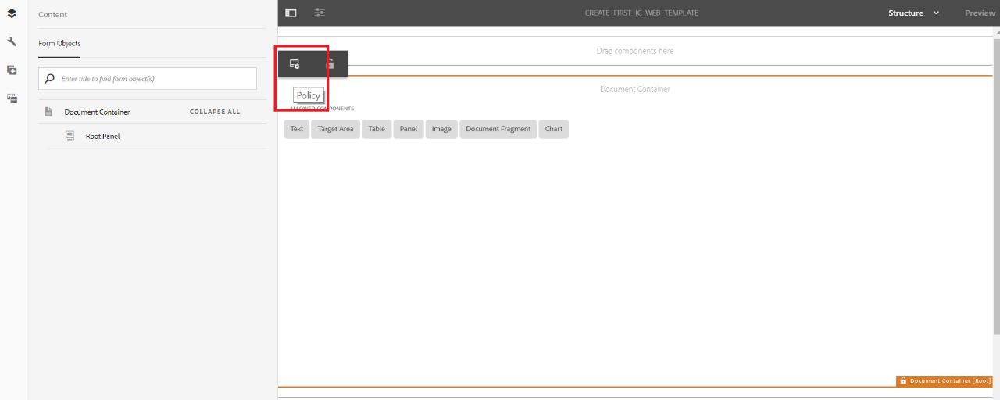

# Zelfstudie: Sjablonen maken{#tutorial-create-templates}

Deze zelfstudie is een stap in de [eerste interactieve communicatiereeks](/help/forms/using/create-your-first-interactive-communication.md) maken. U wordt aangeraden de reeks in chronologische volgorde te volgen om het volledige gebruik van de zelfstudie te begrijpen, uit te voeren en aan te tonen.

Als u een interactieve communicatie wilt maken, moet u sjablonen op de AEM-server beschikbaar hebben voor Afdrukken en Webkanalen.

De sjablonen voor het kanaal Afdrukken worden gemaakt in Adobe Forms Designer en geüpload naar de AEM-server. Deze malplaatjes zijn dan beschikbaar voor gebruik terwijl het creëren van een Interactieve Mededeling.

De sjablonen voor het webkanaal worden gemaakt in AEM. Sjabloonauteurs en -beheerders kunnen websjablonen maken, bewerken en inschakelen. Zodra gecreeerd en toegelaten, zijn deze malplaatjes beschikbaar voor gebruik terwijl het creëren van een Interactieve Communicatie.

Dit leerprogramma begeleidt u door de stappen om malplaatjes voor de kanalen van de Druk en van het Web tot stand te brengen zodat zij voor gebruik terwijl het creëren van Interactieve Mededelingen beschikbaar zijn. Aan het einde van deze zelfstudie kunt u het volgende doen:

* XDP-sjablonen maken voor het afdrukkanaal met Adobe Forms Designer
* De XDP-sjablonen uploaden naar de AEM Forms Server
* Sjablonen voor het webkanaal maken en inschakelen

## Sjabloon maken voor afdrukkanaal {#create-template-for-print-channel}

Creeer en beheer malplaatje voor het kanaal van de Druk van Interactieve Communicatie gebruikend de volgende taken:

* [XDP-sjabloon maken met Forms Designer](../../forms/using/create-templates-print-web.md#create-xdp-template-using-forms-designer)
* [XDP-sjabloon uploaden naar de AEM Forms-server](../../forms/using/create-templates-print-web.md#upload-xdp-template-to-the-aem-forms-server)
* [XDP-sjabloon maken voor layoutfragmenten](../../forms/using/create-templates-print-web.md#create-xdp-template-for-layout-fragments)

### XDP-sjabloon maken met Forms Designer {#create-xdp-template-using-forms-designer}

Op basis van het [gebruiksgeval](/help/forms/using/create-your-first-interactive-communication.md) en de [anatomie](/help/forms/using/planning-interactive-communications.md)maakt u de volgende subformulieren in de XDP-sjabloon:

* Bill Details: Bevat een documentfragment
* Klantgegevens: Bevat een documentfragment
* Bill Summary: Bevat een documentfragment
* Overzicht: Bevat een documentfragment (subformulier Laden) en een diagram (subformulier Teksten)
* Gespecialiseerde Vraag: Bevat een tabel (layoutfragment)
* Nu betalen: Bevat een afbeelding
* Services voor toegevoegde waarde: Bevat een afbeelding

Deze subformulieren worden als doelgebieden weergegeven in de afdruksjabloon nadat het XDP-bestand naar de Forms-server is geüpload. Alle entiteiten zoals documentfragmenten, grafieken, lay-outfragmenten en afbeeldingen worden aan doelgebieden toegevoegd tijdens het maken van de interactieve communicatie.

Voer de volgende stappen uit om een XDP malplaatje voor het kanaal van de Druk tot stand te brengen:

1. Open Forms Designer, selecteer **Bestand** > **Nieuw** > **Een leeg formulier gebruiken,** tik op **Volgende** en vervolgens op **Voltooien** om het formulier te openen voor het maken van een sjabloon.

   Selecteer de opties **Objectbibliotheek** en **Object** in het menu **Venster** .

1. Sleep de **subformuliercomponent** van de **objectbibliotheek** naar het formulier.
1. Selecteer het subformulier om de opties voor het subformulier in het venster **Object** in het rechterdeelvenster weer te geven.
1. Selecteer het tabblad **Subformulier** en selecteer **Overlopen** in de vervolgkeuzelijst **Inhoud** . Sleep het linkereindpunt van het subformulier om de lengte aan te passen.
1. Op het tabblad **Bindingen** :

   1. Geef **BillDetails** op in het veld **Naam** .

   1. Selecteer **Geen gegevensbinding** in de vervolgkeuzelijst **Gegevensbinding** .
   

1. Selecteer op dezelfde manier het basissubformulier, selecteer het tabblad **Subformulier** en selecteer **Overlopen** in de vervolgkeuzelijst **Inhoud** . Op het tabblad **Bindingen** :

   1. Geef **TelecaBill** op in het veld **Naam** .

   1. Selecteer **Geen gegevensbinding** in de vervolgkeuzelijst **Gegevensbinding** .
   

1. Herhaal stap 2 tot en met 5 om de volgende subformulieren te maken:

   * BillDetails
   * CustomerDetails
   * BillSummary
   * Samenvatting - Selecteer het tabblad **Subformulier** en selecteer **Geplaatst** in de vervolgkeuzelijst **Inhoud** voor dit subformulier. Voeg de volgende subformulieren in het subformulier **Samenvatting** in.

      * Heffingen
      * Grafieken
   * ItemCalls
   * Nu betalen
   * ValueAddedServices
   Als u tijd wilt besparen, kunt u ook bestaande subformulieren kopiëren en plakken om nieuwe subformulieren te maken.

   Als u het subformulier **Teksten** rechts van het subformulier Laden wilt plaatsen, selecteert u het subformulier **Teksten** in het linkerdeelvenster, selecteert u het tabblad **Lay-out** en geeft u een waarde op voor het veld **AnkerX** . De waarde moet groter zijn dan de waarde voor het veld **Breedte** voor het subformulier **Laden** . Selecteer het subformulier **Laden** en selecteer het tabblad **Indeling** om de waarde van het veld **Breedte** weer te geven.

1. Sleep het **tekstobject** van de **Objectbibliotheek** naar het formulier en zet het object **Dial XXXX neer om tekst in het vak te abonneren** .
1. Klik met de rechtermuisknop op het tekstobject in het linkerdeelvenster, selecteer **Naam van object** wijzigen en voer de naam van het tekstobject in als **Abonneren**.

   

1. Selecteer **Bestand** > **Opslaan als** om het bestand op te slaan op het lokale bestandssysteem:

   1. Navigeer naar de locatie waar u het bestand wilt opslaan en geef de naam op als **create_first_ic_print_template**.
   1. Selecteer **.xdp** in de vervolgkeuzelijst **Opslaan als type** .

   1. Tik op **Opslaan**.

### XDP-sjabloon uploaden naar de AEM Forms-server {#upload-xdp-template-to-the-aem-forms-server}

Nadat u een XDP-sjabloon hebt gemaakt met de Forms Designer, moet u de sjabloon uploaden naar de AEM Forms-server, zodat de sjabloon beschikbaar is voor gebruik tijdens het maken van de interactieve communicatie.

1. Selecteer **Formulieren** > **Formulieren en documenten**.
1. Tik op **Maken** > **Bestand uploaden**.

   Navigeer en selecteer het sjabloon **create_first_ic_print_template** (XDP) en tik op **Openen** om de XDP-sjabloon te importeren naar de AEM Forms-server.

### XDP-sjabloon maken voor layoutfragmenten {#create-xdp-template-for-layout-fragments}

Als u een lay-outfragment wilt maken voor het afdrukkanaal van de interactieve communicatie, maakt u een XDP met Forms Designer en uploadt u deze naar de AEM Forms-server.

1. Open Forms Designer, selecteer **Bestand** > **Nieuw** > **Een leeg formulier gebruiken,** tik op **Volgende** en vervolgens op **Voltooien** om het formulier te openen voor het maken van een sjabloon.

   Selecteer de opties **Objectbibliotheek** en **Object** in het menu **Venster** .

1. Sleep de component **Tabel** van de **Objectbibliotheek** naar het formulier.
1. In het dialoogvenster Tabel invoegen:

   1. Geef het aantal kolommen op als **5**.
   1. Geef het aantal tekstrijen op als **1**.
   1. Schakel het selectievakje Koptekstrij **opnemen in tabel** in.
   1. Tab **OK**.

1. Tik **+** in het linkerdeelvenster naast **Tabel** 1 en klik met de rechtermuisknop op **Cell1** en selecteer **Naam van object** wijzigen in **Datum**.

   Wijzig op dezelfde manier de namen **Cell2**, **Cell3**, **Cell4** en **Cell5** in respectievelijk **Time************** , Number,Duration, enCharges.

1. Klik op de tekstvelden Koptekst in de **Designer-weergave** en wijzig de naam van de velden in **Tijd**, **Aantal**, **Duur** en **Laden**.

   

1. Selecteer **Rij 1** in de linkerruit en selecteer **Voorwerp** > **Binding** > **Rij voor Elk Punt** van Gegevens herhalen.

   

1. Sleep de component **Tekstveld** van de **Objectbibliotheek** naar de **Designer-weergave**.

   

   Op dezelfde manier sleept u de component **Tekstveld** naar de rijen **Tijd**, **Aantal**, **Duur** en **Laden** .

1. Selecteer **Bestand** > **Opslaan als** om het bestand op te slaan op het lokale bestandssysteem:

   1. Navigeer naar de locatie waar u het bestand wilt opslaan en geef de naam op als **table_lf**.
   1. Selecteer **.xdp** in de vervolgkeuzelijst **Opslaan als type** .

   1. Tik op **Opslaan**.
   Nadat u een XDP-sjabloon voor een lay-outfragment hebt gemaakt met de Forms Designer, moet u deze naar de AEM Forms-server [uploaden](../../forms/using/create-templates-print-web.md#upload-xdp-template-to-the-aem-forms-server) , zodat de sjabloon beschikbaar is voor gebruik tijdens het maken van lay-outfragmenten.

## Sjabloon maken voor webkanaal {#create-template-for-web-channel}

Creeer en beheer malplaatje voor het kanaal van het Web van Interactieve Communicatie gebruikend de volgende taken:

* [Map maken voor sjablonen](../../forms/using/create-templates-print-web.md#create-folder-for-templates)
* [De sjabloon maken](../../forms/using/create-templates-print-web.md#create-the-template)
* [De sjabloon inschakelen](../../forms/using/create-templates-print-web.md#enable-the-template)
* [Knoppen inschakelen in Interactieve communicatie](../../forms/using/create-templates-print-web.md#enabling-buttons-in-interactive-communications)

### Map maken voor sjablonen {#create-folder-for-templates}

Als u een webkanaalsjabloon wilt maken, definieert u een map waarin u de gemaakte sjablonen kunt opslaan. Zodra u een malplaatje binnen die omslag creeert, laat het malplaatje toe om de vormengebruikers toe te staan om het kanaal van het Web van een Interactieve Communicatie tot stand te brengen die op het malplaatje wordt gebaseerd.

Voer de volgende stappen uit om een map voor de bewerkbare sjablonen te maken:

1. Tik op **Gereedschappen**  > **Configuratiebrowser**.
1. Tik op **Maken** op de pagina Configuration Browser.
1. Geef in het dialoogvenster **Configuratie** maken de titel **Create_First_IC_templates** op als de titel voor de map, controleer **Bewerkbare sjablonen** en tik op **Maken**.

   

   De **Create_First_IC_templates** omslag wordt gecreeerd en vermeld op Browser **van de** Configuratie pagina.

### De sjabloon maken {#create-the-template}

Gebaseerd op het [gebruiksgeval](/help/forms/using/create-your-first-interactive-communication.md) en de [anatomie](/help/forms/using/planning-interactive-communications.md), creeer de volgende panelen in het malplaatje van het Web:

* Bill Details: Bevat een documentfragment
* Klantgegevens: Bevat een documentfragment
* Bill Summary: Bevat een documentfragment
* Overzicht van kosten: Bevat een documentfragment en een diagram (lay-out met twee kolommen)
* Gespecialiseerde Vraag: Bevat een tabel
* Nu betalen: Bevat een knop **Nu** betalen en een afbeelding
* Services voor toegevoegde waarde: Bevat een afbeelding en een **knop Abonneren** .

Alle entiteiten zoals documentfragmenten, grafieken, tabellen, afbeeldingen en knoppen worden toegevoegd tijdens het maken van de interactieve communicatie.

Voer de volgende stappen uit om een malplaatje voor het kanaal van het Web in de **Create_First_IC_templates** omslag tot stand te brengen:

1. Navigeer naar de juiste sjabloonmap door **Opties** > **Sjablonen** > **Create_First_IC_templates** te selecteren.
1. Tik op **Maken**.
1. Voor de **Kiezen een de configuratietovenaar van het Type** van Malplaatje, uitgezochte **Interactieve Communicatie - het Kanaal** van het Web en tik **daarna**.
1. Voor de de configuratietovenaar van de Details **van het** Malplaatje, specificeer **Create_First_IC_Web_Template** als malplaatjetitel. Geef een optionele beschrijving op en tik op **Maken**.

   Een bevestigingsbericht dat **Create_First_IC_Web_Template** wordt getoond.

1. Tik op **Openen** om de sjabloon te openen in de sjablooneditor.
1. Selecteer **Eerste inhoud** in de vervolgkeuzelijst naast de optie **Voorvertoning** .

   

1. Tik op **Hoofdvenster** en tik vervolgens op **+** om de lijst met componenten weer te geven die u aan de sjabloon kunt toevoegen.
1. Selecteer **Deelvenster** in de lijst om een deelvenster boven het **hoofddeelvenster** toe te voegen.
1. Selecteer het tabblad **Inhoud** in het linkerdeelvenster. Het nieuwe deelvenster dat u in stap 8 hebt toegevoegd, wordt weergegeven onder het deelvenster **Hoofdmap** in de inhoudsstructuur.

   

1. Selecteer het deelvenster en tik op  (Configureren).
1. In het deelvenster Eigenschappen:

   1. Geef in het veld Naam de **details** van de facturering op.
   1. Geef **Bill Details** op in het veld Titel.
   1. Selecteer **1** in de vervolgkeuzelijst **Aantal kolommen** .

   1. Tik  om de eigenschappen op te slaan.
   De naam van het deelvenster wordt bijgewerkt naar **Bill Details** in de inhoudsstructuur.

1. Herhaal stap 7 - 11 om deelvensters met de volgende eigenschappen toe te voegen aan de sjabloon:

   | Naam | Titel | Aantal kolommen |
   |---|---|---|
   | klantgegevens | Klantgegevens | 1 |
   | billsummary | Bill Summary | 1 |
   | samenvattingskosten | Overzicht van heffingen | 2 |
   | gespecificeerde vraag | Gespecificeerde Vraag | 1 |
   | uitbetaling | Nu betalen | 2 |
   | vas | Services voor toegevoegde waarde | 1 |

   In de volgende afbeelding wordt de inhoudsstructuur weergegeven nadat alle deelvensters aan de sjabloon zijn toegevoegd:

   

### De sjabloon inschakelen {#enable-the-template}

Zodra u het malplaatje van het Web hebt gecreeerd, moet u het toelaten om het malplaatje te gebruiken terwijl het creëren van de Interactieve Communicatie.

Voer de volgende stappen uit om het malplaatje van het Web toe te laten:

1. Tik op **Gereedschappen**  > **Sjablonen**.
1. Navigeer naar de sjabloon **Create_First_IC_Web_Template** , selecteer deze en tik op **Enable**.
1. Tab **Schakel** opnieuw in om te bevestigen.

   Het malplaatje wordt toegelaten en zijn status wordt getoond zoals Toegelaten. U kunt dit malplaatje gebruiken terwijl het creëren van Interactieve Communicatie voor het kanaal van het Web.

### Knoppen inschakelen in Interactieve communicatie {#enabling-buttons-in-interactive-communications}

Op basis van het gebruiksscenario moet u de knoppen **Nu** betalen en **Abonneren** (adaptieve formuliercomponenten) opnemen in interactieve communicatie. Voer de volgende stappen uit om het gebruik van deze knoppen in de interactieve communicatie mogelijk te maken:

1. Selecteer **Structuur** in de vervolgkeuzelijst naast de optie **Voorvertoning** .
1. Selecteer het hoofddeelvenster van de **Documentcontainer** met de inhoudsstructuur en tik op **Beleid** om de componenten te selecteren die zijn toegestaan voor gebruik in de interactieve communicatie.

   

1. Selecteer op het tabblad **Toegestane componenten** van de sectie **Eigenschappen** de optie **Knop** in de **componenten Adaptief formulier** .

   

1. Tik  om de eigenschappen op te slaan.