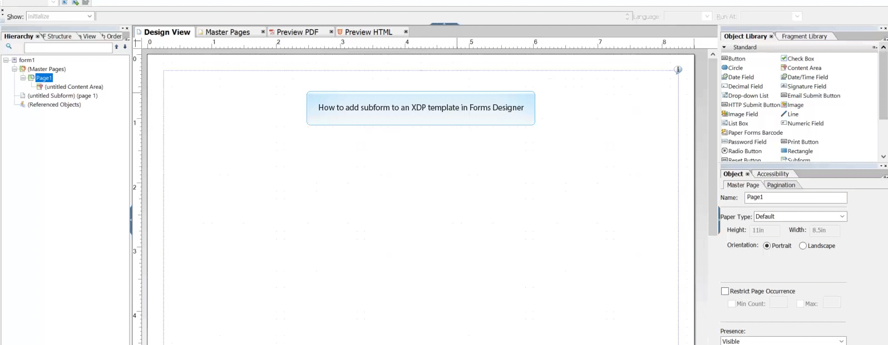

# Zelfstudie: sjablonen maken{#tutorial-create-templates}

Dit leerprogramma is een stap in [ creeer uw eerste Interactieve Communicatie ](/help/forms/using/create-your-first-interactive-communication.md) reeks. U wordt aangeraden de reeks in chronologische volgorde te volgen om het volledige gebruik van de zelfstudie te begrijpen, uit te voeren en aan te tonen.

Om een Interactieve Mededeling tot stand te brengen, moet u malplaatjes beschikbaar op de AEM server voor de Kanalen van de Druk en van het Web hebben.

De sjablonen voor het afdrukkanaal worden gemaakt in Adobe Forms Designer en geüpload naar de AEM server. Deze malplaatjes zijn dan beschikbaar voor gebruik terwijl het creëren van een Interactieve Mededeling.

De malplaatjes voor het kanaal van het Web worden gecreeerd in AEM. Sjabloonauteurs en -beheerders kunnen websjablonen maken, bewerken en inschakelen. Zodra gecreeerd en toegelaten, zijn deze malplaatjes beschikbaar voor gebruik terwijl het creëren van een Interactieve Communicatie.

Dit leerprogramma begeleidt u door de stappen om malplaatjes voor de kanalen van de Druk en van het Web tot stand te brengen zodat zij voor gebruik terwijl het creëren van Interactieve Mededelingen beschikbaar zijn. Aan het einde van deze zelfstudie kunt u het volgende doen:

* XDP-sjablonen maken voor het afdrukkanaal met Adobe Forms Designer
* De XDP-sjablonen uploaden naar de AEM Forms-server
* Sjablonen voor het webkanaal maken en inschakelen

## Sjabloon maken voor het afdrukkanaal {#create-template-for-print-channel}

Creeer en beheer een malplaatje voor het kanaal van de Druk van Interactieve Communicatie gebruikend de volgende taken:

* [Een XDP-sjabloon maken met Forms Designer](../../forms/using/create-templates-print-web.md#create-xdp-template-using-forms-designer)
* [Een XDP-sjabloon uploaden naar de AEM Forms Server](../../forms/using/create-templates-print-web.md#upload-xdp-template-to-the-aem-forms-server)
* [Een XDP-sjabloon maken voor lay-outfragmenten](../../forms/using/create-templates-print-web.md#create-xdp-template-for-layout-fragments)

### Een XDP-sjabloon maken met Forms Designer {#create-xdp-template-using-forms-designer}

Gebaseerd op het [ gebruiksgeval ](/help/forms/using/create-your-first-interactive-communication.md) en [ anatomie ](/help/forms/using/planning-interactive-communications.md), creeer de volgende subforms in het malplaatje XDP:

* Bill Details: bevat een documentfragment
* Klantgegevens: bevat een documentfragment
* Bill Summary: bevat een documentfragment
* Samenvatting: bevat een documentfragment (subformulier Laden) en een diagram (subformulier Teksten)
* Gespecialiseerde Vraag: Omvat een lijst (lay-outfragment)
* Nu betalen: neemt een afbeelding op
* Services voor toegevoegde waarde: bevat een afbeelding

Deze subformulieren worden weergegeven als doelgebieden in de afdruksjabloon nadat het XDP-bestand naar de Forms-server is geüpload. Alle entiteiten zoals documentfragmenten, grafieken, lay-outfragmenten en afbeeldingen worden aan doelgebieden toegevoegd tijdens het maken van de interactieve communicatie.

Ga als volgt te werk om een XDP-sjabloon voor het afdrukkanaal te maken:

1. Open Forms Designer, uitgezochte **Dossier** > **Nieuw** > **Gebruik een lege vorm,** selecteer **daarna**, en selecteer dan **Afwerking** om de vorm voor malplaatjeverwezenlijking te openen.

   Zorg ervoor dat de **Bibliotheek van Objecten** en **3} opties van Objecten {van het** Venster **menu worden geselecteerd.**

1. Sleep-en-daling de **Subform** component van de **Bibliotheek van Objecten** aan de vorm.
1. Selecteer subform zodat kunt u de opties voor subform in het **venster van Objecten** in de juiste ruit zien.
1. Selecteer het **Subform** lusje en selecteer **Overlopen** van de **Inhoud** drop-down lijst. Als u de lengte wilt aanpassen, sleept u het linkereindpunt van het subformulier.
1. In het **Bindingen** lusje:

   1. Specificeer **BillDetails** op het **gebied van de Naam**.

   1. Selecteer **Geen gegevensband** van de **Gegevens die** drop-down lijst binden.

   

1. Op dezelfde manier selecteer het wortelsubform, selecteer het **Subform** lusje, en selecteer **Overlopen** van de **Inhoud** drop-down lijst. In het **Bindingen** lusje:

   1. Specificeer **TelecaBill** op het **gebied van de Naam**.

   1. Selecteer **Geen gegevensband** van de **Gegevens die** drop-down lijst binden.

   

1. Herhaal stap 2 tot en met 5 om de volgende subformulieren te maken:

   * BillDetails
   * CustomerDetails
   * BillSummary
   * Samenvatting - selecteer het **Subform** lusje en selecteer **Geplaatst** van de **Inhoud** drop-down lijst voor dit subform. Neem de volgende subforms in het **Samenvatting** subform op.

      * Heffingen
      * Grafieken

   * ItemCalls
   * Nu betalen
   * ValueAddedServices

   Als u tijd wilt besparen, kunt u ook bestaande subformulieren kopiëren en plakken om aanvullende subformulieren te maken.

   Om het **subform van Hart** aan het recht van het subformulier van Helden te verschuiven, selecteer het **subform van Grafieken** van de linkerruit, selecteer het **Lay-out** lusje, en specificeer een waarde voor het **AnchorX** gebied. De waarde moet groter zijn dan de waarde voor het **1} gebied van de Breedte {voor het** subform van Heffingen **.** Selecteer het **subformulier van Heffingen** en selecteer het **3} lusje van de Lay-out {zodat kunt u de waarde van het** Breedte **gebied bekijken.**

1. Sleep-en-daling het **voorwerp van de Tekst** van de **Bibliotheek van Objecten** aan de vorm en ga **Wijzerplaat XXXX in om** tekst in de doos in te tekenen.
1. Klik het tekstvoorwerp in de linkerruit met de rechtermuisknop aan, uitgezocht **noem Voorwerp** anders, en ga de naam van het tekstvoorwerp in aangezien **** intekent.

   

1. Selecteer **Dossier** > **sparen als** om het dossier op het lokale dossiersysteem op te slaan:

   1. Navigeer aan de plaats waar u het dossier kunt bewaren en de naam als **specificeren create_first_ic_print_template**.
   1. Selecteer **.xdp** van **sparen als type** drop-down lijst.

   1. Selecteer **sparen**.

### Een XDP-sjabloon uploaden naar de AEM Forms Server {#upload-xdp-template-to-the-aem-forms-server}

Nadat u een XDP-sjabloon hebt gemaakt met de Forms Designer, moet u de sjabloon uploaden naar de AEM Forms-server, zodat de sjabloon beschikbaar is voor gebruik tijdens het maken van de interactieve communicatie.

1. Selecteer **[!UICONTROL Forms]** > **[!UICONTROL Forms & Documents]** .
1. Selecteer **creëren** > **Dossier uploadt**.

   Navigeer en selecteer **create_first_ic_print_template** malplaatje (XDP) en selecteer **Open** om het malplaatje XDP in de Server van AEM Forms in te voeren.

### Een XDP-sjabloon maken voor lay-outfragmenten {#create-xdp-template-for-layout-fragments}

Als u een lay-outfragment wilt maken voor het afdrukkanaal van de interactieve communicatie, maakt u een XDP met Forms Designer en uploadt u deze naar de AEM Forms-server.

1. Open Forms Designer, uitgezochte **Dossier** > **Nieuw** > **Gebruik een lege vorm,** selecteer **daarna**, en selecteer dan **Afwerking** om de vorm voor malplaatjeverwezenlijking te openen.

   Zorg ervoor dat de **Bibliotheek van Objecten** en **3} opties van Objecten {van het** Venster **menu worden geselecteerd.**

1. Sleep-en-daling de **component van de Lijst** van de **Bibliotheek van Objecten** aan de vorm.
1. In het dialoogvenster Tabel invoegen:

   1. Specificeer het aantal kolommen als **5**.
   1. Specificeer het aantal lichaamstrijen als **1**.
   1. Selecteer **omvatten de Rij van de Kopbal in Lijst** checkbox.
   1. Het lusje **O.K.**.

1. Selecteer **+** in de linkerruit naast **Lijst** 1 en klik met de rechtermuisknop aan **Cell1** en selecteer **anders noemen Voorwerp** aan **Datum**.

   Op dezelfde manier anders noemen **Cell2**, **Cell3**, **Cell4**, en **Cell5** aan **Tijd**, **Aantal**, **Duur**, en **Tarieven**.

1. Klik de de tekstgebieden van de Kopbal in de **Mening van Designer** en noem hen **Tijd** anders, **Aantal**, **Duur**, en **Tarieven**.

   

1. Selecteer **Rij 1** van de linkerruit en selecteer **Voorwerp** > **Bindend** > **Herhaal Rij voor Elk Punt van Gegevens**.

   

1. De belemmering-en-daling de **component van het Gebied van de Tekst van de** Bibliotheek van Objecten **aan de** Mening van Designer **.**

   

   Op dezelfde manier belemmering-en-daling de **component van het Gebied van de Tekst** {aan de **Tijd**, **Aantal**, **Duur**, en **de rijen van de Laden**.

1. Selecteer **Dossier** > **sparen als** om het dossier op het lokale dossiersysteem op te slaan:

   1. Navigeer aan de plaats waar u het dossier kunt bewaren en de naam als **table_lf** specificeren.
   1. Selecteer **.xdp** van **sparen als type** drop-down lijst.

   1. Selecteer **sparen**.

   Zodra u een malplaatje XDP voor lay-outfragment gebruikend Forms Designer hebt gecreeerd, moet u  het aan de Server van AEM Forms uploaden zodat het malplaatje voor gebruik terwijl het creëren van lay-outfragmenten beschikbaar is.

## Een sjabloon maken voor het webkanaal {#create-template-for-web-channel}

Creeer en beheer een malplaatje voor het kanaal van het Web van Interactieve Mededeling gebruikend de volgende taken:

* [Map maken voor sjablonen](../../forms/using/create-templates-print-web.md#create-folder-for-templates)
* [De sjabloon maken](../../forms/using/create-templates-print-web.md#create-the-template)
* [De sjabloon inschakelen](../../forms/using/create-templates-print-web.md#enable-the-template)
* [Knoppen inschakelen in Interactieve communicatie](../../forms/using/create-templates-print-web.md#enabling-buttons-in-interactive-communications)

### Een map voor sjablonen maken {#create-folder-for-templates}

Als u een webkanaalsjabloon wilt maken, definieert u een map waarin u de gemaakte sjablonen kunt opslaan. Zodra u een malplaatje binnen die omslag creeert, laat het malplaatje toe om de vormengebruikers toe te staan om een kanaal van het Web van een Interactieve Communicatie tot stand te brengen die op het malplaatje wordt gebaseerd.

Ga als volgt te werk om een map voor de bewerkbare sjablonen te maken:

1. Selecteer **Hulpmiddelen**  > **Browser van de Configuratie**.
   * Zie Browser van de Configuratie ](/help/sites-administering/configurations.md) documentatie 0} {voor meer informatie.[
1. In Browser van de Configuratie pagina, creeer de uitgezochte ****.
1. In **creeer de dialoog van de Configuratie**, specificeer **Create_First_IC_templates** als titel voor de omslag, controleer **Bewerkbare Malplaatjes**, en selecteer **creeer**.

   

   De **Create_First_IC_templates** omslag wordt gecreeerd en op **Browser van de Configuratie** pagina vermeld.

### De sjabloon maken {#create-the-template}

Gebaseerd op het [ gebruiksgeval ](/help/forms/using/create-your-first-interactive-communication.md) en [ anatomie ](/help/forms/using/planning-interactive-communications.md), creeer de volgende panelen in het malplaatje van het Web:

* Bill Details: bevat een documentfragment
* Klantgegevens: bevat een documentfragment
* Bill Summary: bevat een documentfragment
* Overzicht van kosten: bevat een documentfragment en een diagram (lay-out met twee kolommen)
* Gespecialiseerde Vraag: Omvat een lijst
* Nu betalen: Omvat a **nu betalen** knoop en een beeld
* De toegevoegde diensten van de waarde: Omvat een beeld en a **Abonneren** knoop.

Alle entiteiten zoals documentfragmenten, grafieken, tabellen, afbeeldingen en knoppen worden toegevoegd tijdens het maken van de interactieve communicatie.

Om een malplaatje voor het kanaal van het Web in de **te creëren Create_First_IC_templates** omslag, doe de volgende stappen:

1. Navigeer aan de aangewezen malplaatjeomslag door **Hulpmiddelen** te selecteren > **Malplaatjes** > **Create_First_IC_templates** omslag.
1. Selecteer **creeer**.
1. Op **kies een 1} configuratietovenaar van het Type van Malplaatje {, uitgezochte** Interactieve Communicatie - het Kanaal van het Web **en selecteer** daarna **.**
1. Op de **tovenaar van de de configuratiedetails van het Malplaatje**, specificeer **Create_First_IC_Web_Template** als malplaatjetitel. Specificeer een facultatieve beschrijving en selecteer **creëren**.

   Een bevestigingsbericht dat **Create_First_IC_Web_Template** wordt getoond.

1. Selecteer **Open** om het malplaatje in de malplaatjeredacteur te openen.
1. Selecteer **Aanvankelijke Inhoud** van de drop-down lijst naast de **optie van de Voorproef**.

   

1. Selecteer **Comité van de Wortel** en selecteer dan **+** om de lijst van componenten te bekijken die u aan het malplaatje kunt toevoegen.
1. Om een paneel boven het **Comité van de Wortel** toe te voegen, selecteer **Comité** van de lijst.
1. Selecteer het **lusje van de Inhoud** in de linkerruit. Het nieuwe paneel dat in stap 8 wordt toegevoegd wordt getoond onder het **Comité van de Wortel** in de inhoudsboom.

   

1. Selecteer het paneel en selecteer  (vorm).
1. In het deelvenster Eigenschappen:

   1. Specificeer **billdetails** op het gebied van de Naam.
   1. Specificeer **Details van de Rekening** op het gebied van de Titel.
   1. Selecteer **1** van het **Aantal Kolommen** drop-down lijst.

   1. Om de eigenschappen te bewaren, uitgezocht .

   De naam van het paneel wordt bijgewerkt aan **Details van de Rekening** in de inhoudsboom.

1. Herhaal stap 7 - 11 om deelvensters met de volgende eigenschappen toe te voegen aan de sjabloon:

   | Naam | Titel | Aantal kolommen |
   |---|---|---|
   | klantgegevens | Klantgegevens | 1 |
   | billsummary | Bill Summary | 1 |
   | samenvattingskosten | Overzicht van heffingen | 2 |
   | gespecificeerde vraag | Gespecificeerde Vraag | 1 |
   | uitbetaling | Nu betalen | 2 |
   | vas | Services voor toegevoegde waarde | 1 |

   In de volgende afbeelding wordt de inhoudsstructuur weergegeven nadat alle deelvensters aan de sjabloon zijn toegevoegd:

   

### De sjabloon inschakelen {#enable-the-template}

Zodra u het malplaatje van het Web hebt gecreeerd, moet u het toelaten om het malplaatje te gebruiken terwijl het creëren van de Interactieve Communicatie.

Ga als volgt te werk om de websjabloon in te schakelen:

1. Selecteer **Hulpmiddelen**  > **Malplaatjes**.
1. Navigeer aan **Create_First_IC_Web_Template** malplaatje, selecteer het, en selecteer **toelaten**.
1. Selecteer **toelaten** opnieuw om te bevestigen.

   Het malplaatje wordt toegelaten en zijn status wordt getoond zoals Toegelaten. U kunt dit malplaatje gebruiken terwijl het creëren van Interactieve Communicatie voor het kanaal van het Web.

### Knoppen inschakelen in Interactieve communicatie {#enabling-buttons-in-interactive-communications}

Gebaseerd op het gebruiksgeval, moet u **nu betalen** omvatten en **3} knopen (adaptieve vormencomponenten) in Interactieve Communicatie intekenen.** Ga als volgt te werk om het gebruik van deze knoppen in de interactieve communicatie in te schakelen:

1. Selecteer **Structuur** van de drop-down lijst naast de **optie van de Voorproef**.
1. Selecteer het **wortelpaneel van de Container van het 0} Document {gebruikend de inhoudsboom en selecteer** Beleid **om de componenten te selecteren die voor gebruik in de Interactieve Mededeling worden toegestaan.**

   

1. In het **Toegestane lusje van Componenten** van de **sectie van Eigenschappen**, uitgezochte **Knoop** van de **Aangepaste componenten van de Vorm**.

   

1. Om de eigenschappen te bewaren, sparen .
