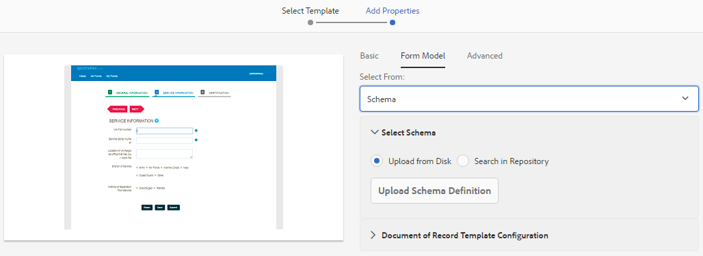

# Een adaptief formulier maken {#creating-an-adaptive-form}

 de Adobe adviseert gebruikend de moderne en verlengbare gegevens vangen [ Componenten van de Kern ](https://experienceleague.adobe.com/docs/experience-manager-core-components/using/adaptive-forms/introduction.html?lang=nl-NL) voor [ het creëren van nieuwe Aangepaste Forms ](/help/forms/using/create-an-adaptive-form-core-components.md) of [ het toevoegen van Aangepaste Forms aan de pagina&#39;s van AEM Sites ](/help/forms/using/create-or-add-an-adaptive-form-to-aem-sites-page.md). Deze componenten betekenen een aanzienlijke vooruitgang in de aanmaak van Adaptive Forms en zorgen voor indrukwekkende gebruikerservaring. In dit artikel wordt een oudere aanpak beschreven voor de auteur Adaptive Forms die gebruikmaakt van stichtingscomponenten. 

| Versie | Artikelkoppeling |
| -------- | ---------------------------- |
| AEM as a Cloud Service | [ klik hier ](https://experienceleague.adobe.com/docs/experience-manager-cloud-service/content/forms/adaptive-forms-authoring/authoring-adaptive-forms-foundation-components/create-an-adaptive-form-on-forms-cs/creating-adaptive-form.html?lang=nl-NL) |
| AEM 6,5 | Dit artikel |

## Een adaptief formulier maken {#strong-create-an-adaptive-form-strong}

Ga als volgt te werk om een adaptief formulier te maken.

1. Toegang krijgen tot [!DNL Experience Manager Forms] instantie Auteur op `https://'[server]:[port]'/<custom-context-if-any>.`

1. Ga uw geloofsbrieven op de Experience Manager login pagina in.

   Nadat u zich hebt aangemeld, selecteert u in de linkerbovenhoek **[!UICONTROL Adobe Experience Manager]** > **[!UICONTROL Forms]** > **[!UICONTROL Forms & Documents]** .

   >[!NOTE]
   >
   >Voor een standaardinstallatie is de aanmelding `admin` en is het wachtwoord `admin` .

1. Selecteer **[!UICONTROL Create]** en selecteer **[!UICONTROL Adaptive Form]** .
1. Er verschijnt een optie voor het selecteren van een sjabloon. Voor meer informatie over malplaatjes, zie [ Aangepaste vormmalplaatjes ](creating-adaptive-form.md#p-adaptive-form-templates-p). Selecteer een sjabloon om deze te selecteren en selecteer Volgende.
1. Er wordt een optie voor &#39;Eigenschappen toevoegen&#39; weergegeven. Geef de waarden op voor de volgende eigenschapvelden. De velden Titel en Naam zijn verplicht:

   * **[!UICONTROL Title:]** Hiermee geeft u de weergavenaam van het formulier op. Met de titel kunt u het formulier identificeren in de gebruikersinterface van [!DNL Experience Manager Forms] .
   * **[!UICONTROL Name:]** Hiermee geeft u de naam van het formulier op. Er wordt een knooppunt met de opgegeven naam gemaakt in de repository. Wanneer u een titel begint te typen, wordt automatisch een waarde voor het naamveld gegenereerd. U kunt de voorgestelde waarde wijzigen. Het naamveld mag alleen alfanumerieke tekens, afbreekstreepjes en onderstrepingstekens bevatten. Alle ongeldige invoer wordt vervangen door een afbreekstreepje.
   * **[!UICONTROL Description:]** Hiermee geeft u gedetailleerde informatie over het formulier op.
   * **[!UICONTROL Tags:]** Hiermee geeft u codes op waarmee het adaptieve formulier op unieke wijze wordt geïdentificeerd. Tags helpen u bij het zoeken naar het formulier. Als u tags wilt maken, typt u nieuwe tagnamen in het vak **[!UICONTROL Tags]** .

1. U kunt een adaptief formulier maken op basis van een van de volgende formuliermodellen:

   * [Formuliergegevensmodel](#fdm)
   * [XFA-formuliersjabloon](#create-an-adaptive-form-based-on-an-xfa-form-template)
   * [XML- of JSON-schema](#create-an-adaptive-form-based-on-xml-or-json-schema)
   * Geen of geen formuliermodel

   U kunt deze configureren op het tabblad **[!UICONTROL Form Model]** op de pagina **[!UICONTROL Add Properties]** . Standaard is het geselecteerde formuliermodel **[!UICONTROL None]** .

1. Selecteer **[!UICONTROL Create]**. Er wordt een adaptief formulier gemaakt en er wordt een dialoogvenster weergegeven om het formulier te openen voor bewerking.

   Wanneer u alle eigenschappen hebt opgegeven, klikt u op **[!UICONTROL Create]** . Er wordt een adaptief formulier gemaakt en er wordt een dialoogvenster weergegeven om het formulier te openen voor bewerking.

   Wanneer u alle eigenschappen hebt opgegeven, klikt u op **[!UICONTROL Create]** . Er wordt een adaptief formulier gemaakt en er wordt een dialoogvenster weergegeven om het formulier te openen voor bewerking.

1. Selecteer **[!UICONTROL Open]** om het nieuwe formulier op een nieuw tabblad te openen. Het formulier wordt geopend voor bewerking en geeft de inhoud weer die beschikbaar is in de sjabloon. De zijbalk wordt ook weergegeven om het nieuwe formulier aan te passen aan de behoeften.

   Op basis van het type adaptief formulier worden de formulierelementen die aanwezig zijn in de bijbehorende XFA-formuliersjabloon, het XML-schema of het JSON-schema weergegeven op het tabblad **[!UICONTROL Data Model Objects]** van **[!UICONTROL Content Browser]** in het zijpaneel. U kunt deze elementen ook slepen en neerzetten om het aangepaste formulier samen te stellen.

   Voor informatie over adaptieve vorm auteursinterface en beschikbare componenten, zie [ Inleiding aan creatie adaptieve vormen ](introduction-forms-authoring.md).

   >[!NOTE]
   >
   >Laat pop-upvensters in uw browser het nieuwe formulier openen op een nieuw tabblad.

## Een adaptief formulier maken op basis van een formuliergegevensmodel {#fdm}

[[!DNL Experience Manager Forms]  gegevensintegratie ](data-integration.md) laat u veelvoudige gegevensbronnen integreren en hun entiteiten en diensten samenbrengen om een model van vormgegevens tot stand te brengen. Het is een uitbreiding van het JSON-schema. U kunt een formuliergegevensmodel gebruiken om een adaptief formulier te maken. De entiteiten of gegevensmodelobjecten die in een formuliergegevensmodel zijn geconfigureerd, zijn beschikbaar als gegevensmodelobjecten voor het ontwerpen van formulieren. Zij zijn gebonden aan de respectieve gegevensbronnen en worden gebruikt om een formulier vooraf in te vullen en ingediende gegevens terug te schrijven naar de respectieve gegevensbronnen. U kunt ook services bellen die zijn geconfigureerd in een formuliergegevensmodel met behulp van adaptieve formulierregels.

Een formuliergegevensmodel gebruiken voor het maken van een adaptief formulier:

1. Selecteer op het tabblad Formuliermodel in het scherm Eigenschappen toevoegen de optie **[!UICONTROL Form Data Model]** in de vervolgkeuzelijst **[!UICONTROL Select From]** .

   

1. Selecteer deze optie om **[!UICONTROL Select Form Data Model]** uit te vouwen. Alle beschikbare formuliergegevensmodellen worden weergegeven.

   Selecteer een gegevensmodel.

   

>[!NOTE]
>
>U kunt ook het gegevensmodel van het formulier wijzigen voor een adaptief formulier. Voor gedetailleerde stappen, zie [ Eigenschappen van het Model van de Vorm van een adaptieve vorm ](#edit-form-model) uitgeven.

## Een adaptief formulier maken op basis van een XFA-formuliersjabloon {#create-an-adaptive-form-based-on-an-xfa-form-template}

U kunt uw XFA-formuliersjablonen opnieuw gebruiken om adaptieve formulieren te maken. Als u een XFA-formuliersjabloon opnieuw wilt gebruiken, uploadt en koppelt u dit aan een adaptief formulier. De elementen van het formuliersjabloon (XFA-formulier) worden beschikbaar gesteld voor gebruik in de zoekfunctie voor inhoud op het moment dat het formulier wordt aangepast. Vanuit de Inhoudszoeker kunt u de formuliersjabloonelementen naar het formulier slepen en neerzetten.

<!-- >>[!NOTE]
>
>[Upload the XFA Form Template](get-xdp-pdf-documents-aem.md) to AEM Forms before you start creating an adaptive form based on the form template.

Do the following to use an XFA form template as form model for your adaptive form:

1. On the **[!UICONTROL Add Properties]** page, open the **[!UICONTROL Form Model]** tab.
1. In the Form Model tab, from the drop-down list, select **[!UICONTROL Form Templates]**. All the form templates that are uploaded to the repository via AEM Forms UI are listed for selection. Select a template from the list.

   
**Figure:** *Selecting a form template*

   >[!NOTE]
   >
   >You can also change the form template for an adaptive form. For detailed steps, see [Edit Form Model properties of an adaptive form](#edit-form-model). -->

## Een adaptief formulier maken op basis van het XML- of JSON-schema {#create-an-adaptive-form-based-on-xml-or-json-schema}

De schema&#39;s van XML en JSON vertegenwoordigen de structuur waarin de gegevens door het achterste deelsysteem in uw organisatie worden geproduceerd of worden verbruikt. U kunt een schema aan een adaptief formulier koppelen en de elementen ervan gebruiken om dynamische inhoud aan het aangepaste formulier toe te voegen. De elementen van het schema zijn beschikbaar op het tabblad Gegevensmodel van de inhoudbrowser voor het ontwerpen van adaptieve formulieren. U kunt de schema-elementen slepen en neerzetten om het formulier samen te stellen.

Zie de volgende documenten voor informatie over het ontwerpen van XML- of JSON-schema&#39;s voor het ontwerpen van adaptieve formulieren.

* [Aangepaste formulieren maken met XML-schema](adaptive-form-xml-schema-form-model.md)
* [Aangepaste formulieren maken met JSON-schema](adaptive-form-json-schema-form-model.md)

Ga als volgt te werk om het XML- of JSON-schema als formuliermodel voor een adaptief formulier te gebruiken:

1. Selecteer op het tabblad **[!UICONTROL Form Model]** in de stap **[!UICONTROL Add Properties]** Aanpassen pagina voor het maken van formulieren.
1. Selecteer op het tabblad Formuliermodel **[!UICONTROL Schema]** in de vervolgkeuzelijst **[!UICONTROL Select From]** .

1. Selecteer **[!UICONTROL Select Schema]** en voer een van de volgende handelingen uit:

   * **[!UICONTROL Upload from disk]** - Selecteer deze optie en selecteer Schemadefinitie uploaden om een XML-schema of JSON-schema in uw bestandssysteem te zoeken en te uploaden. Het geüploade schemabestand bevindt zich bij het formulier en is niet toegankelijk voor andere adaptieve formulieren.
   * **[!UICONTROL Search in repository]** - Selecteer deze optie om een keuze te maken uit de lijst met schemadefinitiebestanden in de gegevensopslagruimte. Selecteer het XML- of JSON-schemabestand als formuliermodel. Het geselecteerde schema is gekoppeld aan het formulier via verwijzing en is toegankelijk voor gebruik in andere adaptieve formulieren.

   >[!CAUTION]
   >
   >Zorg ervoor dat de naam van het JSON-schema eindigt met **.schema.json** . Bijvoorbeeld: mySchema.schema.json

   
   **Cijfer:** *Selecterend XML of JSON schema*

1. (Alleen voor het XML-schema) Nadat u een XML-schema hebt geselecteerd of geüpload, geeft u een hoofdelement op van het geselecteerde XSD-bestand dat u wilt toewijzen met het aangepaste formulier.

   
   **Cijfer:** *Selecterend XSD wortelelement*

>[!NOTE]
>
>U kunt het schema ook wijzigen voor een adaptief formulier. Voor gedetailleerde stappen, zie [ Eigenschappen van het Model van de Vorm van een adaptieve vorm ](#edit-form-model) uitgeven.

## Aangepaste formuliersjablonen {#adaptive-form-templates}

Een sjabloon biedt een basisstructuur en definieert de vormgeving (lay-outs en stijlen) van een adaptief formulier. Het heeft vooraf opgemaakte componenten die bepaalde eigenschappen en inhoudsstructuur bevatten. <!-- Out of the box, AEM Forms provides some adaptive form templates. To get the complete template package including advanced templates, you need to install the AEM Forms add-on package. For more information, see [Installing AEM Forms add-on package](installing-configuring-aem-forms-osgi.md).-->

Daarnaast kunt u de sjablooneditor gebruiken om uw eigen sjablonen te maken. Voor meer informatie over het werken met malplaatjes, zie [ Aangepaste vormmalplaatjes ](template-editor.md).

>[!NOTE]
>
>Als u een adaptief formulier opent dat is gemaakt met de geavanceerde sjabloon voor bewerken, wordt een foutbericht weergegeven. De geavanceerde sjabloon heeft een Signature Step-component en Adobe Sign is er standaard voor ingeschakeld. Creeer en selecteer een [ de wolkenconfiguratie van Adobe Sign ](adobe-sign-integration-adaptive-forms.md) en [ vorm een ondertekenaar ](working-with-adobe-sign.md#addsignerstoanadaptiveform) om de fout op te lossen.

## Eigenschappen van een formuliermodel bewerken in een adaptief formulier {#edit-form-model}

Aangepaste formulieren worden gemaakt zonder formuliermodel (met de optie Geen voor formuliermodel) of met een formuliermodel zoals een formuliersjabloon, XML-schema of JSON-schema of formuliergegevensmodel. U kunt het formuliermodel voor een adaptief formulier wijzigen van Geen in een ander formuliermodel. Voor een adaptief formulier op basis van een formuliermodel kunt u een andere formuliersjabloon, een XML-schema, een JSON-schema of een formuliergegevensmodel kiezen voor hetzelfde formuliermodel. U kunt echter niet van het ene formuliermodel naar het andere gaan.

1. Selecteer de adaptieve vorm en selecteer het **pictogram van Eigenschappen**.
1. Open het tabblad **[!UICONTROL Form Model]** en voer een van de volgende handelingen uit.

   * Als het adaptieve formulier geen formuliermodel heeft, kunt u een ander formuliermodel kiezen en dienovereenkomstig een formuliersjabloon, XML- of JSON-schema of formuliergegevensmodel selecteren.
   * Als het adaptieve formulier is gebaseerd op een formuliermodel, kunt u een andere formuliersjabloon, een XML- of JSON-schema of een formuliergegevensmodel kiezen voor hetzelfde formuliermodel.

1. Selecteer **[!UICONTROL Save]** om de eigenschappen op te slaan.

## Een adaptief formulier automatisch opslaan {#auto-save-an-adaptive-form}

Standaard wordt de inhoud van een adaptief formulier opgeslagen op een handeling van de gebruiker, bijvoorbeeld wanneer u op de knop Opslaan drukt. U kunt ook een adaptief formulier configureren om automatisch te beginnen met het opslaan van de inhoud op basis van een gebeurtenis of tijdsinterval. De optie Automatisch opslaan is handig in:

* De inhoud automatisch opslaan voor anonieme en aangemelde gebruikers
* De inhoud van een formulier opslaan zonder minimale tussenkomst van de gebruiker
* Inhoud van een formulier opslaan op basis van een gebruikersgebeurtenis
* De inhoud van een formulier herhaaldelijk opslaan na een opgegeven tijdsinterval

### Automatisch opslaan inschakelen voor een adaptief formulier {#enable-auto-save-for-an-adaptive-form}

De optie Automatisch opslaan is standaard niet ingeschakeld. U kunt de optie Automatisch opslaan inschakelen op het tabblad Automatisch opslaan van een adaptief formulier. Het tabblad Automatisch opslaan bevat ook diverse andere configuratieopties. Voer de volgende stappen uit om de optie Automatisch opslaan in te schakelen en te configureren voor een adaptief formulier:

1. Om tot de auto-sparen sectie in de eigenschappen toegang te hebben, selecteer een component, dan  > **[!UICONTROL Adaptive Form Container]**, en selecteer dan .
1. In de **[!UICONTROL Auto Save]** sectie, **[!UICONTROL Enable]** de auto-sparen optie.
1. Geef in het vak **[!UICONTROL Adaptive Form Event]** 1 of TRUE op om het formulier automatisch op te slaan wanneer het formulier in de browser wordt geladen. U kunt ook een voorwaardelijke expressie opgeven voor een gebeurtenis die, wanneer deze wordt geactiveerd en waar wordt geretourneerd, de inhoud van het formulier opslaat.
1. Geef de trigger op. Automatisch opslaan wordt geactiveerd op basis van uw configuratie. U kunt kiezen uit de volgende opties:

   * **[!UICONTROL Time based:]** Selecteer de optie om de inhoud op te slaan op basis van een specifiek tijdsinterval.
   * **[!UICONTROL Event based:]** Selecteer de optie om de inhoud op te slaan op basis van de gebeurtenis die wordt gestart.

   Wanneer u een trigger selecteert, wordt het vak Strategieconfiguratie ingeschakeld. Met het vak Strategieconfiguratie kunt u:

   * Geef een tijdsinterval op als u **[!UICONTROL Time based]** trigger selecteert.
   * Geef een gebeurtenisnaam op als u **[!UICONTROL Event based]** trigger selecteert.

   <!-- You can also create and add your own custom strategy to the list. For details, see [Implement a custom strategy to autosave the forms](auto-save-an-adaptive-form.md#p-implement-a-custom-strategy-to-enable-autosave-for-adaptive-forms-p). -->

1. (Alleen op tijd gebaseerde automatische opslag) Voer de volgende stappen uit om opties voor op tijd gebaseerde automatische opslag te configureren.

   1. Geef in het vak **[!UICONTROL Auto save on this interval]** het tijdsinterval in seconden op. Het formulier wordt herhaaldelijk opgeslagen nadat het aantal seconden is verstreken dat in het intervalvak is opgegeven.

1. (Alleen op gebeurtenissen gebaseerde automatische opslag) Voer de volgende stappen uit om opties voor automatisch opslaan op basis van gebeurtenissen te configureren.

   1. In het **[!UICONTROL Auto save after this event]** vakje, specificeer a [ GuideBridge ](https://helpx.adobe.com/nl/aem-forms/6/javascript-api/GuideBridge.html) gebeurtenis. Het formulier wordt opgeslagen telkens wanneer de expressie de waarde TRUE oplevert.

1. (Optioneel) Als u de inhoud automatisch wilt opslaan voor anonieme gebruikers, selecteert u de optie **[!UICONTROL Enable Autosave for anonymous users]** en klikt u op **[!UICONTROL OK]** .

   >[!NOTE]
   >
   >Als u de optie Automatisch opslaan wilt gebruiken voor anonieme gebruikers, moet u de Forms Common Configuration Service zodanig configureren dat alle gebruikers formulieren kunnen bekijken, verifiëren en ondertekenen.
   >
   >Als u de service wilt configureren, gaat u naar de Adobe Experience Manager-webconsoleconfiguratie op `https://'[server]:[port]'system/console/configMgr` en bewerkt u **[!UICONTROL Forms Common Configuration Service]** om de optie **[!UICONTROL All Users]** in het veld **[!UICONTROL Allow]** te kiezen en slaat u de configuratie op.

## Hoe wijzigt u de naam van een AEM adaptief formulier? {#rename-an-AEM-Adaptive-Form}

Voer de volgende stappen uit om de naam van een adaptief formulier te wijzigen:

1. Selecteer een adaptief formulier in uw AEM Forms-gebruikersinterface.
1. Klik op **Eigenschappen** die op de hogere spoorstaaf wordt gevestigd.

   

1. Verander de naam van de vorm op het **lusje van de Titel**, zoals aangetoond in het hieronder beeld.
1. Klik **sparen en Sluiten**.

    anders
