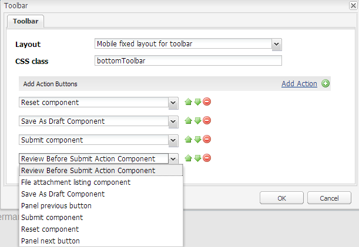

# Een aangepaste werkbalkactie maken{#creating-a-custom-toolbar-action}

## Vereisten {#prerequisite}

Voordat u een aangepaste werkbalkactie maakt, moet u zich vertrouwd maken met Bibliotheken [aan de clientzijde en](/help/sites-developing/clientlibs.md) Ontwikkelen met CRXDE Lite [](/help/sites-developing/developing-with-crxde-lite.md).

## Wat is een handeling? {#what-is-an-action-br}

Een adaptief formulier biedt een werkbalk waarmee een auteur van een formulier een set opties kan configureren. Deze opties worden gedefinieerd als handelingen voor het aangepaste formulier. Klik op de knop Bewerken op de werkbalk voor het deelvenster om de acties in te stellen die worden ondersteund door adaptieve formulieren.


Naast de set met acties die standaard worden geleverd, kunt u aangepaste handelingen op de werkbalk maken. U kunt bijvoorbeeld een handeling toevoegen waarmee de gebruiker alle aangepaste formuliervelden kan bekijken voordat een formulier wordt verzonden.

## Stappen voor het maken van een aangepaste handeling in een adaptieve vorm {#steps}

Aan de hand van de volgende stappen kunt u het maken van een aangepaste werkbalkactie illustreren. Zo kunt u een knop maken waarmee eindgebruikers alle aangepaste formuliervelden kunnen bekijken voordat ze een ingevuld formulier indienen.

1. Alle standaardacties die door adaptieve formulieren worden ondersteund, bevinden zich in de `/libs/fd/af/components/actions` map. Kopieer het `fileattachmentlisting` knooppunt in CRXDE van `/libs/fd/af/components/actions/fileattachmentlisting` naar `/apps/customaction`.

1. Nadat u het knooppunt naar de `apps/customaction` map hebt gekopieerd, wijzigt u de naam van het knooppunt in `reviewbeforesubmit`. Wijzig ook de `jcr:title` en `jcr:description` eigenschappen van het knooppunt.

   De `jcr:title` eigenschap bevat de naam van de handeling die wordt weergegeven in het werkbalkdialoogvenster. De `jcr:description` eigenschap bevat meer informatie die wordt weergegeven wanneer een gebruiker de aanwijzer op de handeling plaatst.

   

1. Selecteer `cq:template` knooppunt in `reviewbeforesubmit` knooppunt. Zorg ervoor dat de waarde van de `guideNodeClass` eigenschap is `guideButton` en wijzig de `jcr:title` eigenschap dienovereenkomstig.
1. Wijzig de eigenschap type in het `cq:Template` knooppunt. In het huidige voorbeeld wijzigt u de eigenschap type in button.

   De typewaarde wordt toegevoegd als CSS klasse in geproduceerde HTML voor de component. Gebruikers kunnen die CSS-klasse gebruiken om hun handelingen op te maken. De standaardstijl voor zowel mobiele als desktopapparaten is beschikbaar voor het verzenden, verzenden, opnieuw instellen en opslaan van tekstwaarden.

1. Selecteer de aangepaste handeling in het dialoogvenster van de werkbalk voor het bewerken van het aangepaste formulier. De knop Revisie wordt weergegeven op de werkbalk voor het deelvenster.

    waarop de actie Aangepaste werkbalk wordt 

1. Om functionaliteit aan de knoop van het Overzicht te verstrekken, voeg sommige code JavaScript en CSS en server-zijcode in het init.jsp- dossier toe, aanwezig binnen de `reviewbeforesubmit` knoop.

   Voeg de volgende code in `init.jsp`.

   ```jsp
   <%@include file="/libs/fd/af/components/guidesglobal.jsp" %>
   <guide:initializeBean name="guideField" className="com.adobe.aemds.guide.common.GuideButton"/>
   
   <c:if test="${not isEditMode}">
           <cq:includeClientLib categories="reviewsubmitclientlibruntime" />
   </c:if>
   
   <%--- BootStrap Modal Dialog  --------------%>
   <div class="modal fade" id="reviewSubmit" tabindex="-1">
       <div class="modal-dialog">
           <div class="modal-content">
               <div class="modal-header">
                   <h3>Review the Form Fields</h3>
               </div>
               <div class="modal-body">
                   <div class="modal-list">
                       <table class="table table-bordered">
                           <tr class="name">
                               <td class="reviewlabel col-md-3 active">
                                   <label>Your Name is: </label>
                               </td>
                           </tr>
                           <tr class="pan">
                               <td class="reviewlabel col-md-3 active">
                                   <label>Your Pan Number is: </label>
                               </td>
                           </tr>
                           <tr class="dob">
                               <td class="reviewlabel col-md-3 active">
                                   <label>Your Date Of Birth is: </label>
                               </td>
                           </tr>
                           <tr class="80cdeclaration">
                               <td class="reviewlabel col-md-3 active">
                                   <label>Your Total 80C Declaration Amount is: </label>
                               </td>
                           </tr>
                           <tr class="rentpaid">
                               <td class="reviewlabel col-md-3 active">
                                   <label>Your Total HRA Amount is: </label>
                               </td>
                           </tr>
                       </table>
                   </div>
               </div><!-- /.modal-body -->
               <div class="modal-footer">
                   <div class="fileAttachmentListingCloseButton col-md-2 col-xs-2 col-sm-2">
                       <button data-dismiss="modal">Close</button>
                   </div>
               </div>
           </div><!-- /.modal-content -->
       </div><!-- /.modal-dialog -->
   </div><!-- /.modal -->
   ```

   Voeg de volgende code toe aan het `ReviewBeforeSubmit.js` bestand.

   ```javascript
   /*anonymous function to handle show of review before submit view */
   $(function () {
       if($("div.reviewbeforesubmit button[id*=reviewbeforesubmit]").length > 0) {
           $("div.reviewbeforesubmit button[id*=reviewbeforesubmit]").click(function(){
               // Create the options object to be passed to the getElementProperty API
               var options = {},
                   result = [];
               options.somExpressions = [];
               options.propertyName = "value";
               guideBridge.visit(function(model){
                   if(model.name === "name" || model.name === "pan" || model.name === "dateofbirth" || model.name === "total" || model.name === "totalmonthlyrent"){
                           options.somExpressions.push(model.somExpression);
                   }
               }, this);
               result = guideBridge.getElementProperty(options);
   
               $('#reviewSubmit .reviewlabel').each(function(index, item){
                   var data = ((result.data[index] == null) ? "No Data Filled" : result.data[index]);
                   if($(this).next().hasClass("reviewlabelvalue")){
                       $(this).next().html(data);
                   } else {
                       $(this).after($("<td></td>").addClass("reviewlabelvalue col-md-6 active").html(data));
                   }
               });
               // added because in mobile devices it was causing problem of backdrop
               $("#reviewSubmit").appendTo('body');
               $("#reviewSubmit").modal("show");
           });
       }
   });
   ```

   Voeg de volgende code toe aan het `ReviewBeforeSubmit.css` bestand.

   ```css
   .modal-list .reviewlabel {
       white-space: normal;
       text-align: right;
       padding:2px;
   }
   
   .modal-list .reviewlabelvalue {
       border: #cde0ec 1px solid;
       padding:2px;
   }
   
   /* Adding icon for this action in mobile devices */
   /* This is the glyphicon provided by bootstrap eye-open */
   /* .<type> .iconButton-icon */
   .reviewbeforesubmit .iconButton-icon {
       position: relative;
       top: -8px;
       font-family: 'Glyphicons Halflings';
       font-style: normal;
   }
   
   .reviewbeforesubmit .iconButton-icon:before {
       content: "\e105"
   }
   ```

1. Als u de functionaliteit van de aangepaste handeling wilt controleren, opent u het aangepaste formulier in de modus Voorbeeld en klikt u op Revisie op de werkbalk.

   >[!NOTE]
   >
   >De `GuideBridge` bibliotheek wordt niet geladen in de ontwerpmodus. Deze aangepaste handeling werkt dus niet in de ontwerpmodus.

   

## Voorbeelden {#samples}

Het volgende archief bevat een inhoudspakket. Het pakket bevat een adaptief formulier dat betrekking heeft op de bovenstaande demo van aangepaste werkbalkactie.

[Bestand ophalen](assets/customtoolbaractiondemo.zip)
