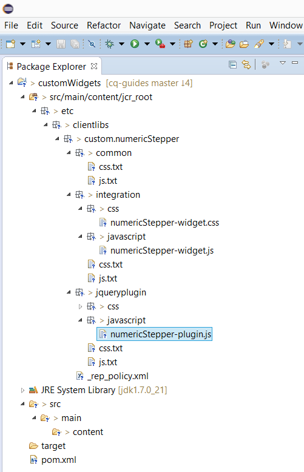

# Aangepaste weergaven maken voor adaptieve formuliervelden{#create-custom-appearances-for-adaptive-form-fields}

## Inleiding {#introduction}

Bij adaptieve formulieren wordt het [weergaveframework](/help/forms/using/introduction-widgets.md) gebruikt om aangepaste weergaven voor adaptieve formuliervelden te maken en een andere gebruikerservaring te bieden. Vervang bijvoorbeeld keuzerondjes en selectievakjes door schakelknoppen of gebruik aangepaste jQuery-plug-ins om gebruikersinvoer in velden zoals telefoonnummers of e-mailadressen te beperken.

In dit document wordt uitgelegd hoe u met een jQuery-insteekmodule deze alternatieve ervaringen voor adaptieve formuliervelden kunt maken. Daarnaast wordt een voorbeeld weergegeven voor het maken van een aangepaste weergave voor numerieke veldcomponenten die worden weergegeven als een numerieke stapfunctie of schuifregelaar.

Laten we eerst kijken naar de belangrijkste termen en concepten die in dit artikel worden gebruikt.

**Weergave** verwijst naar de stijl, het uiterlijk en de organisatie van verschillende elementen van een adaptief formulierveld. Het omvat gewoonlijk een etiket, een interactief gebied om input, een hulppictogram, en korte en lange beschrijvingen van het gebied te verstrekken. De aanpassing van de weergave die in dit artikel wordt besproken, is van toepassing op de weergave van het invoergebied van het veld.

**jQuery-insteekmodule** biedt een standaardmechanisme op basis van het jQuery-widgetframework voor het implementeren van een alternatieve weergave.

**ClientLib** Een client-side bibliotheeksysteem in AEM client-side verwerking aangedreven door complexe JavaScript- en CSS-code. Zie Client-Side Libraries gebruiken voor meer informatie.

**Archetype** een Maven werkset voor projectsjabloon dat is gedefinieerd als een origineel patroon of model voor Maven-projecten. Voor meer informatie, zie Inleiding aan Archetypes.

**Gebruikersbeheer** verwijst naar het hoofdelement in een widget die de waarde van het veld bevat en wordt gebruikt door het weergaveframework om de aangepaste widgetinterface te binden aan het aangepaste formuliermodel.

## Stappen om een aangepaste weergave te maken {#steps-to-create-a-custom-appearance}

Op hoog niveau zijn de volgende stappen nodig om een aangepaste weergave te maken:

1. **Een project** maken: Creeer een Geweven project dat een inhoudspakket om op AEM produceert op te stellen.
1. **Een bestaande widgetklasse** uitbreiden: Een bestaande widgetklasse uitbreiden en de vereiste klassen overschrijven.
1. **Een clientbibliotheek** maken: Maak een `clientLib: af.customwidget` bibliotheek en voeg de vereiste JavaScript- en CSS-bestanden toe.

1. **Het project** bouwen en installeren: Bouw het Maven project en installeer het geproduceerde inhoudspakket op AEM.
1. **Het aangepaste formulier** bijwerken: Pas de eigenschappen van formuliervelden aan om de aangepaste weergave te gebruiken.

### Een project maken {#create-a-project}

Een bepaald archetype is een uitgangspunt voor het creëren van een douaneverschijning. De details van het te gebruiken archetype zijn als volgt:

* **Bewaarplaats**: https://repo.adobe.com/nexus/content/groups/public/
* **Artefact-id**: custom-appearance-archetype
* **Groep-id**: com.adobe.aemforms
* **Versie**: 1.0.4.

Voer het volgende bevel uit om een lokaal project tot stand te brengen dat op archetype wordt gebaseerd:

`mvn archetype:generate -DarchetypeRepository=https://repo.adobe.com/nexus/content/groups/public/ -DarchetypeGroupId=com.adobe.aemforms -DarchetypeArtifactId=custom-appearance-archetype -DarchetypeVersion=1.0.4`

De opdracht downloadt de Maven-plug-ins en archetype-informatie van de opslagplaats en genereert een project op basis van de volgende informatie:

* **groupId**: Groep-id gebruikt door het gegenereerde Maven-project
* **artefactId**: Artefact-id die wordt gebruikt door het gegenereerde Maven-project.
* **versie**: Versie voor het gegenereerde Maven-project.
* **pakket**: Pakket gebruikt voor de bestandsstructuur.
* **artifactName**: Artefactnaam van het gegenereerde AEM-pakket.
* **packageGroup**: Pakketgroep van het gegenereerde AEM-pakket.
* **widgetName**: Weergavenaam die ter referentie wordt gebruikt.

Het gegenereerde project heeft de volgende structuur:

```java
─<artifactId>

 └───src

     └───main

         └───content

             └───jcr_root

                 └───etc

                     └───clientlibs

                         └───custom

                             └───<widgetName>

                                 ├───common [client library - af.customwidgets which encapsulates below clientLibs]

                                 ├───integration [client library - af.customwidgets.<widgetName>_widget which contains template files for integrating a third-party plugin with Adaptive Forms]

                                 │   ├───css

                                 │   └───javascript

                                 └───jqueryplugin [client library - af.customwidgets.<widgetName>_plugin which holds the third-party plugins and related dependencies]

                                     ├───css

                                     └───javascript
```

### Een bestaande widgetklasse uitbreiden {#extend-an-existing-widget-class}

Zodra het projectmalplaatje wordt gecreeerd, doe de volgende veranderingen, zoals vereist:

1. Neem de afhankelijkheid van de externe plug-in van het project op.

   1. Plaats de externe of aangepaste jQuery-plug-ins in de `jqueryplugin/javascript` map en de bijbehorende CSS-bestanden in de `jqueryplugin/css` map. Zie de JS- en CSS-bestanden in de `jqueryplugin/javascript and jqueryplugin/css` map voor meer informatie.

   1. Wijzig de `js.txt` en `css.txt` bestanden om eventuele extra JavaScript- en CSS-bestanden van de jQuery-insteekmodule op te nemen.

1. Integreer de externe insteekmodule met het framework om interactie mogelijk te maken tussen het aangepaste weergaveframework en de jQuery-insteekmodule. De nieuwe widget werkt alleen nadat u de volgende functies hebt uitgebreid of genegeerd.

<table>
 <tbody>
  <tr>
   <td><strong>-functie</strong></td>
   <td><strong>Beschrijving</strong></td>
  </tr>
  <tr>
   <td><code>render</code></td>
   <td>De renderfunctie retourneert het jQuery-object voor het standaard HTML-element van de widget. Het standaard-HTML-element moet van het brandpunttype zijn. Bijvoorbeeld, <code>&lt;a&gt;</code>, <code>&lt;input&gt;</code>en <code>&lt;li&gt;</code>. Het geretourneerde element wordt gebruikt als <code>$userControl</code>. Als de instructie de bovenstaande beperking <code>$userControl</code> opgeeft, werken de functies van de <code>AbstractWidget</code> klasse zoals verwacht, anders vereisen sommige gemeenschappelijke API's (focus, klikken) wijzigingen. </td>
  </tr>
  <tr>
   <td><code>getEventMap</code></td>
   <td>Retourneert een kaart voor het converteren van HTML-gebeurtenissen naar XFA-gebeurtenissen. <br /> <code class="code">{
      blur: XFA_EXIT_EVENT,
      }</code><br /> In dit voorbeeld wordt getoond dat het een HTML-gebeurtenis <code>blur</code> is en dat het de overeenkomstige XFA-gebeurtenis <code>XFA_EXIT_EVENT</code> is. </td>
  </tr>
  <tr>
   <td><code>getOptionsMap</code></td>
   <td>Retourneert een kaart met details over de handeling die moet worden uitgevoerd bij de wijziging van een optie. De sleutels zijn de opties die aan widget worden verstrekt en de waarden zijn functies die worden geroepen wanneer een verandering in de optie wordt ontdekt. De widget biedt handlers voor alle algemene opties (behalve <code>value</code> en <code>displayValue</code>).</td>
  </tr>
  <tr>
   <td><code>getCommitValue</code></td>
   <td>Het jQuery-widgetframework laadt de functie wanneer de waarde van de jQuery-widget in het XFA-model wordt opgeslagen (bijvoorbeeld bij afsluitgebeurtenis van een tekstveld). De implementatie moet de waarde retourneren die is opgeslagen in de widget. De handler krijgt de nieuwe waarde voor de optie.</td>
  </tr>
  <tr>
   <td><code>showValue</code></td>
   <td>Standaard wordt in XFA bij Enter de <code>rawValue</code> waarde van het veld weergegeven. Deze functie wordt aangeroepen om het <code>rawValue</code> aan de gebruiker te tonen. </td>
  </tr>
  <tr>
   <td><code>showDisplayValue</code></td>
   <td>Standaard wordt in XFA bij afsluitgebeurtenis de waarde <code>formattedValue</code> van het veld weergegeven. Deze functie wordt aangeroepen om het <code>formattedValue</code> aan de gebruiker te tonen. </td>
  </tr>
 </tbody>
</table>

1. Werk het JavaScript-bestand in de `integration/javascript` map naar wens bij.

   * Vervang de tekst `__widgetName__` door de werkelijke naam van de widget.
   * Breid de widget uit van een geschikte buitenste widgetklasse. In de meeste gevallen is dit de klasse widget die overeenkomt met de bestaande widget die wordt vervangen. De naam van de bovenliggende klasse wordt op meerdere locaties gebruikt. Het wordt daarom aanbevolen naar alle instanties van de tekenreeks `xfaWidget.textField` in het bestand te zoeken en deze te vervangen door de werkelijk gebruikte bovenliggende klasse.
   * Breid de `render` methode uit om een afwisselende UI te verstrekken. Dit is de locatie vanwaar de jQuery-insteekmodule wordt aangeroepen om de gebruikersinterface of het interactiegedrag bij te werken. De `render` methode zou een user-control element moeten terugkeren.

   * Breid de `getOptionsMap` methode uit om het even welke optie met voeten te treden die als gevolg van een verandering in widget wordt beïnvloed. De functie retourneert een toewijzing die details bevat voor de actie die moet worden uitgevoerd bij wijziging van een optie. De sleutels zijn de opties die aan widget worden verstrekt en de waarden zijn de functies die worden geroepen wanneer een verandering in de optie wordt ontdekt.
   * De `getEventMap` methode wijst gebeurtenissen toe die door de widget worden geactiveerd, met de gebeurtenissen die door het adaptieve formuliermodel worden vereist. De standaardwaarde wijst standaard HTML-gebeurtenissen toe voor de standaardwidget en moet worden bijgewerkt als een alternatieve gebeurtenis wordt geactiveerd.
   * De afbeeldingsvoorwaarde weergeven `showDisplayValue` en bewerken kan worden overschreven zodat deze een ander gedrag heeft. `showValue` Pas de afbeeldingsvoorwaarde toe.

   * De `getCommitValue` methode wordt aangeroepen door het adaptieve formulierframework wanneer de `commit`gebeurtenis plaatsvindt. Over het algemeen is dit de afsluitgebeurtenis, behalve voor de vervolgkeuzelijst, het keuzerondje en de selectievakjes (waar deze voorkomt bij wijziging). Zie Expressies voor [adaptieve formulieren](../../forms/using/adaptive-form-expressions.md#p-value-commit-script-p)voor meer informatie.

   * Het sjabloonbestand biedt voorbeeldimplementatie voor verschillende methoden. Verwijder methoden die niet moeten worden uitgebreid.

### Een clientbibliotheek maken {#create-a-client-library}

Het voorbeeldproject dat door het Maven archetype wordt geproduceerd leidt automatisch tot vereiste cliëntbibliotheken, en verpakt hen in een cliëntbibliotheek met een categorie `af.customwidgets`. De JavaScript- en CSS-bestanden die beschikbaar zijn in de runtime `af.customwidgets` worden automatisch opgenomen.

### Samenstellen en installeren {#build-and-install}

Om het project te bouwen, voer het volgende bevel op shell uit om een pakket te produceren CRX dat op de server moet worden geïnstalleerd AEM.

`mvn clean install`

>[!NOTE]
>
>Het beheerde project verwijst naar een externe opslagplaats binnen het POM-bestand. Dit is alleen ter referentie en volgens Maven-standaarden wordt de opslagplaats-informatie vastgelegd in het `settings.xml` bestand.

### Het aangepaste formulier bijwerken {#update-the-adaptive-form}

De aangepaste weergave toepassen op een adaptief formulierveld:

1. Open het adaptieve formulier in de bewerkingsmodus.
1. Open het dialoogvenster **Eigenschap** voor het veld waarop u de aangepaste weergave wilt toepassen.
1. Werk op het tabblad **Stijl** de `CSS class` eigenschap bij en voeg de naam van de vormgeving toe aan de `widget_<widgetName>` indeling. Bijvoorbeeld: **widget_numericstepper**

## Voorbeeld: Een aangepaste weergave maken   {#sample-create-a-custom-appearance-nbsp}

Bekijk nu een voorbeeld om een douaneverschijning voor een numeriek gebied tot stand te brengen om als numerieke stapper of schuif te verschijnen. Voer de volgende stappen uit:

1. Voer het volgende bevel uit om een lokaal project tot stand te brengen dat op Maven archetype wordt gebaseerd:

   `mvn archetype:generate -DarchetypeRepository=https://repo.adobe.com/nexus/content/groups/public/ -DarchetypeGroupId=com.adobe.aemforms -DarchetypeArtifactId=custom-appearance-archetype -DarchetypeVersion=1.0.4`

   U wordt gevraagd waarden op te geven voor de volgende parameters.
   *De in dit voorbeeld gebruikte waarden worden vet* gemarkeerd.

   `Define value for property 'groupId': com.adobe.afwidgets`

   `Define value for property 'artifactId': customWidgets`

   `Define value for property 'version': 1.0.1-SNAPSHOT`

   `Define value for property 'package': com.adobe.afwidgets`

   `Define value for property 'artifactName': customWidgets`

   `Define value for property 'packageGroup': adobe/customWidgets`

   `Define value for property 'widgetName': numericStepper`

1. Navigeer naar de map `customWidgets` (opgegeven waarde voor de `artifactID` eigenschap) en voer de volgende opdracht uit om een Eclipse-project te genereren:

   `mvn eclipse:eclipse`

1. Open het gereedschap Eclipse en voer de volgende handelingen uit om het Eclipse-project te importeren:

   1. Selecteer **[!UICONTROL File > Import > Existing Projects into Workspace]**.

   1. Blader naar de map waarin u de `archetype:generate` opdracht hebt uitgevoerd en selecteer deze.

   1. Klik op **[!UICONTROL Finish]**.

      

1. Selecteer de widget die voor de aangepaste weergave moet worden gebruikt. In dit voorbeeld wordt de volgende numerieke stepper-widget gebruikt:

   [https://www.jqueryscript.net/form/User-Friendly-Number-Input-Spinner-with-jQuery-Bootstrap.html](https://www.jqueryscript.net/form/User-Friendly-Number-Input-Spinner-with-jQuery-Bootstrap.html)

   Controleer in het Eclipse-project de insteekcode in het `plugin.js` bestand om te controleren of deze voldoet aan de vereisten voor de weergave. In dit voorbeeld voldoet de weergave aan de volgende vereisten:

   * De numerieke stapfunctie moet worden uitgebreid van `- $.xfaWidget.numericInput`.
   * De `set value` methode van widget stelt de waarde in nadat de focus zich op het veld bevindt. Dit is een verplichte vereiste voor een adaptieve formulierwidget.
   * De `render` methode moet worden overschreven om de `bootstrapNumber` methode aan te roepen.

   * Er is geen andere afhankelijkheid van de plug-in dan de hoofdbroncode van de plug-in.
   * In het voorbeeld wordt geen stijl toegepast op de stapfunctie. Er is dus geen extra CSS vereist.
   * Het `$userControl` object moet beschikbaar zijn voor de `render` methode. Dit is een veld van het `text` type dat wordt gekloond met de insteekmodulecode.

   * De knoppen **+** en **-** moeten worden uitgeschakeld wanneer het veld wordt uitgeschakeld.

1. Vervang de inhoud van de `bootstrap-number-input.js` (jQuery-plug-in) door de inhoud van het `numericStepper-plugin.js` bestand.
1. Voeg in het `numericStepper-widget.js` bestand de volgende code toe om de rendermethode te overschrijven om de insteekmodule aan te roepen en het `$userControl` object te retourneren:

   ```javascript
   render : function() {
        var control = $.xfaWidget.numericInput.prototype.render.apply(this, arguments);
        var $control = $(control);
        var controlObject;
        try{
            if($control){
            $control.bootstrapNumber();
            var id = $control.attr("id");
            controlObject = $("#"+id);
            }
        }catch (exc){
             console.log(exc);
        }
        return controlObject;
   }
   ```

1. Overschrijf in het `numericStepper-widget.js` bestand de `getOptionsMap` eigenschap om de toegangsoptie te negeren en verberg de knoppen + en - in de uitgeschakelde modus.

   ```javascript
   getOptionsMap: function(){
       var parentOptionsMap = $.xfaWidget.numericInput.prototype.getOptionsMap.apply(this,arguments),
   
       newMap = $.extend({},parentOptionsMap,
   
        {
   
              "access": function(val) {
              switch(val) {
                 case "open" :
                   this.$userControl.removeAttr("readOnly");
                   this.$userControl.removeAttr("aria-readonly");
                   this.$userControl.removeAttr("disabled");
                   this.$userControl.removeAttr("aria-disabled");
                   this.$userControl.parent().find(".input-group-btn button").prop('disabled',false);
                   break;
                 case "nonInteractive" :
                 case "protected" :
                   this.$userControl.attr("disabled", "disabled");
                   this.$userControl.attr("aria-disabled", "true");
                   this.$userControl.parent().find(".input-group-btn button").prop('disabled',true);
                   break;
                case "readOnly" :
                   this.$userControl.attr("readOnly", "readOnly");
                   this.$userControl.attr("aria-readonly", "true");
                   this.$userControl.parent().find(".input-group-btn button").prop('disabled',true);
                   break;
               default :
                   this.$userControl.removeAttr("disabled");
                   this.$userControl.removeAttr("aria-disabled");
                   this.$userControl.parent().find(".input-group-btn button").prop('disabled',false);
                   break;
             }
          },
      });
      return newMap;
    }
   ```

1. Sla de wijzigingen op, navigeer naar de map met het `pom.xml` bestand en voer de volgende Maven-opdracht uit om het project te maken:

   `mvn clean install`

1. Installeer het pakket met AEM Package Manager.

1. Open het adaptieve formulier in de bewerkingsmodus waarop u de aangepaste weergave wilt toepassen en voer de volgende handelingen uit:

   1. Klik met de rechtermuisknop op het veld waarop u de weergave wilt toepassen en klik om het dialoogvenster Component bewerken **[!UICONTROL Edit]** te openen.

   1. Werk op het tabblad Stijl de **[!UICONTROL CSS class]** eigenschap bij die u wilt toevoegen `widget_numericStepper`.

De nieuwe weergave die u zojuist hebt gemaakt, is nu beschikbaar voor gebruik.
