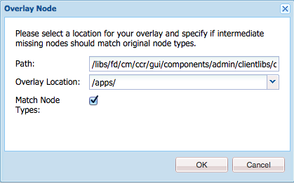

# Gebruikersinterface voor maken van correspondentie aanpassen{#customize-create-correspondence-ui}

## Overzicht {#overview}

Met Correspondence Management kunt u het servicesjabloon van de oplossing vernieuwen voor een betere merkwaarde en de brandstandaarden van uw organisatie naleven. Als u de gebruikersinterface opnieuw brandt, wijzigt u het bedrijfslogo, dat in de linkerbovenhoek van de interface Correspondentie maken wordt weergegeven.

U kunt het logo in de interface Correspondentie maken wijzigen met het logo van uw organisatie.


Het aangepaste pictogram in de gebruikersinterface voor correspondentie maken

### Het logo wijzigen in de gebruikersinterface Correspondentie maken {#changing-the-logo-in-the-create-correspondence-ui}

Ga als volgt te werk om een door u gekozen logoafbeelding in te stellen:

1. Maak de juiste [mapstructuur in CRX](#creatingfolderstructure).
1. [Upload het nieuwe logobestand](#uploadlogo) in de map die u in CRX hebt gemaakt.

1. [Stel de CSS](#createcss) in op CRX om naar het nieuwe logo te verwijzen.
1. Wis de browsergeschiedenis en [vernieuw de interface](#refreshccrui)Correspondentie maken.

## De vereiste mapstructuur maken {#creatingfolderstructure}

Maak de mapstructuur, zoals hieronder wordt uitgelegd, voor het hosten van de aangepaste logoafbeelding en het stijlblad. De nieuwe mapstructuur met de hoofdmap /apps is vergelijkbaar met de structuur van de map /libs.

Voor elke aanpassing maakt u een parallelle mapstructuur, zoals hieronder wordt uitgelegd, in de tak /apps.

De tak /apps (omslagstructuur):

* Zorgt ervoor dat uw bestanden veilig zijn in het geval van een update van het systeem. In het geval van verbetering, eigenschappak, of een hete moeilijke situatie, wordt de /libs tak bijgewerkt en als u uw veranderingen in de /libs tak ontvangt, worden zij beschreven.
* Hiermee kunt u het huidige systeem/de huidige vertakking niet verstoren. U kunt dit probleem per ongeluk oplossen als u de standaardlocaties gebruikt voor het opslaan van de aangepaste bestanden.
* Helpt uw middelen hogere prioriteit te krijgen wanneer AEM naar middelen zoekt. AEM wordt gevormd om de /apps tak eerst en dan de /libs tak te zoeken om een middel te vinden. Dit mechanisme houdt in dat het systeem uw bedekking gebruikt (en de aanpassingen die daar zijn gedefinieerd).

Gebruik de volgende stappen om de vereiste mapstructuur in de tak /apps te maken:

1. Ga naar Beheerder `https://'[server]:[port]'/[ContextPath]/crx/de` en meld u aan.
1. Maak in de map Apps een map met de naam pad/structuur, vergelijkbaar met de map css (in de map ccrui). `css`

   Stappen voor het maken van de css-map:

   1. Klik met de rechtermuisknop op de **css** -map in het volgende pad en selecteer **Overlay Node**: `/libs/fd/cm/ccr/gui/components/admin/clientlibs/ccrui/css`

      

   1. Zorg ervoor dat het dialoogvenster Overlay-knooppunt de volgende waarden heeft:

      **Pad:** /libs/fd/cm/ccr/gui/components/admin/clientlibs/ccrui/css

      **Locatie bedekking:** /apps/

      **Identieke knooppunttypen:** Ingeschakeld

      

      >[!NOTE]
      >
      >Breng geen veranderingen in de /libs tak aan. Alle wijzigingen die u aanbrengt, kunnen verloren gaan, omdat deze vertakking mogelijk wordt gewijzigd wanneer u:
      >
      >    
      >    
      >    * Upgrade op uw exemplaar
      >    * Een hotfix toepassen
      >    * Een functiepakket installeren


   1. Click **OK**. De css-map wordt gemaakt in het opgegeven pad.


1. Maak in de map Apps een map met de naam pad/structuur, vergelijkbaar `imgs` met de map imgs (in de map ccrui).

   1. Klik met de rechtermuisknop op de map **imgs** in het volgende pad en selecteer **Overlay Node**: `/libs/fd/cm/ccr/gui/components/admin/clientlibs/ccrui/imgs`
   1. Zorg ervoor dat het dialoogvenster Overlay-knooppunt de volgende waarden heeft:

      **Pad:** /libs/fd/cm/ccr/gui/components/admin/clientlibs/ccrui/imgs

      **Locatie bedekking:** /apps/

      **Identieke knooppunttypen:** Ingeschakeld

   1. Click **OK**.

      >[!NOTE]
      >
      >U kunt de mapstructuur ook handmatig in de map /apps maken.

1. Klik op Alles **** opslaan om de wijzigingen op de server op te slaan.

## Het nieuwe logo uploaden naar CRX {#uploadlogo}

Upload uw aangepaste logobestand naar CRX. De standaard HTML-regels bepalen de rendering van het logo. De ondersteunde indelingen voor afbeeldingsbestanden zijn gebaseerd op de browser die u gebruikt voor toegang tot AEM Forms. Alle browsers ondersteunen JPEG, GIF en PNG. Zie de browserspecifieke documentatie over de ondersteunde afbeeldingsindelingen voor meer informatie.

* De standaardafmetingen van de logoafbeelding zijn 48 px * 48 px. Zorg ervoor dat de afbeelding even groot is als deze of groter is dan 48 px * 48 px.
* Als de hoogte van de logoafbeelding groter is dan 50 px, wordt de afbeelding in de gebruikersinterface Correspondentie maken verkleind tot een maximale hoogte van 50 px, aangezien dit de hoogte van de koptekst is. Wanneer u de afbeelding verkleint, blijft de hoogte-breedteverhouding van de afbeelding behouden in de gebruikersinterface Correspondentie maken.
* Als de afbeelding klein is, wordt de schaal van de gebruikersinterface Correspondentie maken niet vergroot. Zorg er dus voor dat u een logoafbeelding van minimaal 48 pixels hoog en voldoende breed gebruikt voor meer duidelijkheid.

Ga als volgt te werk om het aangepaste logobestand naar CRX te uploaden:

1. Ga naar `https://'[server]:[port]'/[contextpath]/crx/de`. Meld u indien nodig aan als beheerder.
1. Klik in CRXDE met de rechtermuisknop op de map **imgs** in het volgende pad en selecteer **Maken > Bestand** maken:

   `/apps/fd/cm/ccr/gui/components/admin/clientlibs/ccrui/imgs/`

   

1. Voer in het dialoogvenster Bestand maken de naam van het bestand in als CustomLogo.png (of de naam van het logobestand).

   

1. Klik op Alles **opslaan**.

   Onder het nieuwe bestand dat u hebt gemaakt (hier CustomLogo.png), wordt de eigenschap jcr:content weergegeven.

1. Klik op jcr:inhoud in de mapstructuur.

   jcr:eigenschappen van inhoud worden weergegeven.

   

1. Dubbelklik op de eigenschap **jcr:data** .

   Het dialoogvenster JCR:gegevens bewerken wordt geopend.

   Klik nu op de map newlogo.png, dubbelklik op jcr:content (grijze optie) en stel type nt:resource in. Maak indien niet aanwezig een eigenschap met de naam jcr:content.

1. Klik in het dialoogvenster Jcr:data bewerken op **Bladeren** en selecteer het afbeeldingsbestand dat u als logo wilt gebruiken (hier CustomLogo.png).

   De ondersteunde indelingen voor afbeeldingsbestanden zijn gebaseerd op de browser die u gebruikt voor toegang tot AEM Forms. Alle browsers ondersteunen JPEG, GIF en PNG. Zie de browserspecifieke documentatie over de ondersteunde afbeeldingsindelingen voor meer informatie.

   

   Voorbeeld: CustomLogo.png voor gebruik als aangepast logo

1. Klik op Alles **opslaan**.

## CSS maken om het logo te integreren met de gebruikersinterface {#createcss}

Voor de aangepaste logoafbeelding moet een extra stijlpagina worden geladen in de context van de inhoud.

Gebruik de volgende stappen om de stijlpagina in te stellen voor het renderen van het logo:

1. Ga naar `https://'[server]:[port]'/[contextpath]/crx/de`. Meld u indien nodig aan als beheerder.
1. Maak een bestand met de naam customcss.css (u kunt geen andere bestandsnaam gebruiken) op de volgende locatie:

   `/apps/fd/cm/ccr/gui/components/admin/clientlibs/ccrui/css/`

   Stappen om het bestand customcss.css te maken:

   1. Klik met de rechtermuisknop op de **css** -map en selecteer **Maken > Bestand** maken.
   1. Geef in het dialoogvenster Nieuw bestand de naam van de CSS op als `customcss.css`(u kunt geen andere bestandsnaam gebruiken) en klik op **OK**.
   1. Voeg de volgende code toe aan het nieuwe CSS-bestand. In inhoud:url in de code, specificeer de beeldnaam u aan de omslag van imgs in CRXDE hebt geupload.

      ```css
      .logo, .logo:after {
      content:url("../imgs/CustomLogo.png");
      }
      ```

   1. Klik op Alles **opslaan**.

## De gebruikersinterface Correspondentie maken vernieuwen om het aangepaste logo weer te geven {#refreshccrui}

Wis de browsercache en open vervolgens de instantie Correspondentie-UI maken in uw browser. Je moet het aangepaste logo zien.


Het aangepaste pictogram in de gebruikersinterface voor correspondentie maken

