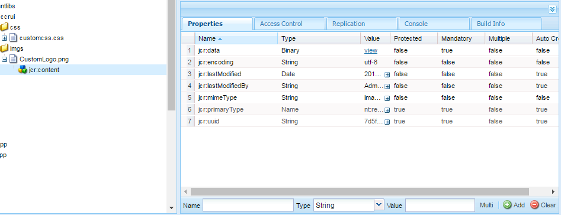

# Gebruikersinterface voor maken van correspondentie aanpassen{#customize-create-correspondence-ui}

## Overzicht {#overview}

Met Correspondence Management kunt u het servicesjabloon van de oplossing herdefiniëren voor een betere merkwaarde en kunt u voldoen aan de brandstandaarden van uw organisatie. Als u de gebruikersinterface opnieuw brandt, wijzigt u het bedrijfslogo, dat in de linkerbovenhoek van de interface Correspondentie maken wordt weergegeven.

U kunt het logo in de interface Correspondentie maken wijzigen met het logo van uw organisatie.


Het aangepaste pictogram in de gebruikersinterface voor correspondentie maken

### Het logo wijzigen in de gebruikersinterface Correspondentie maken {#changing-the-logo-in-the-create-correspondence-ui}

Ga als volgt te werk om een door u gekozen logoafbeelding in te stellen:

1. Creeer de aangewezen [ omslagstructuur in CRX ](#creatingfolderstructure).
1. [ upload het nieuwe logodossier ](#uploadlogo) in de omslag die u in CRX hebt gecreeerd.

1. [ opstelling CSS ](#createcss) op CRX om naar het nieuwe embleem te verwijzen.
1. Wis de browser geschiedenis en [ verfrissen creeer Correspondentie UI ](#refreshccrui).

## De vereiste mapstructuur maken {#creatingfolderstructure}

Maak de mapstructuur, zoals hieronder wordt uitgelegd, voor het hosten van de aangepaste logoafbeelding en het stijlblad. De nieuwe mapstructuur met de hoofdmap /apps is vergelijkbaar met de structuur van de map /libs.

Voor elke aanpassing maakt u een parallelle mapstructuur, zoals hieronder wordt uitgelegd, in de tak /apps.

De `/apps` -vertakking (mapstructuur):

* Zorgt ervoor dat uw bestanden veilig zijn als het systeem wordt bijgewerkt. Als er een upgrade, functiepak of hotfix is, wordt de `/libs` -vertakking bijgewerkt en als u uw wijzigingen host in de `/libs` -vertakking, worden deze overschreven.
* Het huidige systeem of de huidige vertakking mag niet worden verstoord. U kunt dit probleem per ongeluk oplossen als u de standaardlocaties gebruikt voor het opslaan van de aangepaste bestanden.
* Helpt uw middelen een hogere prioriteit krijgen wanneer AEM naar middelen zoekt. AEM is geconfigureerd om eerst in de `/apps` -vertakking te zoeken en vervolgens in de `/libs` -vertakking om een bron te zoeken. Dit mechanisme houdt in dat het systeem uw bedekking gebruikt (en de aanpassingen die daar zijn gedefinieerd).

Gebruik de volgende stappen om de vereiste mapstructuur in de `/apps` -vertakking te maken:

1. Ga naar `https://'[server]:[port]'/[ContextPath]/crx/de` en meld u aan als beheerder.
1. Maak in de map Apps een map met de naam `css` met een pad/structuur die lijkt op de map css (in de map ccrui).

   Stappen voor het maken van de css-map:

   1. Klik met de rechtermuisknop op de **css** omslag bij de volgende weg en selecteer **Knoop van de Bedekking**: `/libs/fd/cm/ccr/gui/components/admin/clientlibs/ccrui/css`

      

   1. Zorg ervoor dat het dialoogvenster Overlay-knooppunt de volgende waarden heeft:

      **Weg:** `/libs/fd/cm/ccr/gui/components/admin/clientlibs/ccrui/css`

      **Plaats van de Bedekking:** `/apps/`

      **de Types van Knoop van de Gelijke:** Gecontroleerd

      

      >[!NOTE]
      >
      >Wijzig de `/libs` -vertakking niet. Alle wijzigingen die u aanbrengt, kunnen verloren gaan, omdat deze vertakking wijzigingen kan ondergaan wanneer u:
      >
      >    
      >    
      >    * Upgrade op uw exemplaar
      >    * Een hotfix toepassen
      >    * Een functiepakket installeren
      >    
      >

   1. Klik **OK**. De css-map wordt gemaakt in het opgegeven pad.

1. Maak in de map Apps een map met de naam `imgs` met een pad/structuur die lijkt op de map `imgs` (in de map ccrui).

   1. Klik met de rechtermuisknop op de **imgs** omslag bij de volgende weg en selecteer **Knoop van de Bedekking**: `/libs/fd/cm/ccr/gui/components/admin/clientlibs/ccrui/imgs`
   1. Zorg ervoor dat het dialoogvenster Overlay-knooppunt de volgende waarden heeft:

      **Weg:** /libs/fd/cm/ccr/gui/components/admin/clientlibs/ccrui/imgs

      **Plaats van de Bedekking:** /apps/

      **de Types van Knoop van de Gelijke:** Gecontroleerd

   1. Klik **OK**.

      >[!NOTE]
      >
      >U kunt de mapstructuur ook handmatig in de map /apps maken.

1. Klik **sparen allen** om de veranderingen op de server te bewaren.

## Het nieuwe logo uploaden naar CRX {#uploadlogo}

Upload je aangepaste logobestand naar CRX. De standaard HTML-regels bepalen de rendering van het logo. De ondersteunde indelingen voor afbeeldingsbestanden zijn gebaseerd op de browser die u gebruikt om toegang te krijgen tot AEM Forms. Alle browsers ondersteunen JPEG, GIF en PNG. Zie de browserspecifieke documentatie over de ondersteunde afbeeldingsindelingen voor meer informatie.

* De standaardafmetingen van de logoafbeelding zijn 48 px &#42; en 48 px. Zorg ervoor dat de afbeelding even groot is als deze of groter dan 48 px &#42; 48 px.
* Als de hoogte van de logoafbeelding groter is dan 50 px, wordt de afbeelding in de gebruikersinterface Correspondentie maken verkleind tot een maximale hoogte van 50 px, aangezien dit de hoogte van de koptekst is. Tijdens het verkleinen van de afbeelding behoudt de gebruikersinterface Correspondentie maken de hoogte-breedteverhouding van de afbeelding.
* Als de afbeelding klein is, wordt de schaal van de gebruikersinterface Correspondentie maken niet vergroot. Zorg er dus voor dat u een logoafbeelding van minimaal 48 pixels hoog en voldoende breed gebruikt voor meer duidelijkheid.

Ga als volgt te werk om het aangepaste logobestand naar CRX te uploaden:

1. Ga naar `https://'[server]:[port]'/[contextpath]/crx/de` . Meld u indien nodig aan als beheerder.
1. In CRXDE, klik de **imgs** omslag bij de volgende weg met de rechtermuisknop aan en selecteer **creëren > Dossier** creëren:

   `/apps/fd/cm/ccr/gui/components/admin/clientlibs/ccrui/imgs/`

   

1. Voer in het dialoogvenster Bestand maken de naam van het bestand in als CustomLogo.png (of de naam van het logobestand).

   

1. Klik **sparen allen**.

   Onder het nieuwe bestand dat u hebt gemaakt (hier CustomLogo.png), wordt de eigenschap jcr:content weergegeven.

1. Klik op jcr:inhoud in de mapstructuur.

   jcr:eigenschappen van inhoud worden weergegeven.

   

1. Dubbelklik **jcr:gegevens** bezit.

   Het dialoogvenster jcr:gegevens bewerken wordt geopend.

   Klik nu op de map newlogo.png, dubbelklik vervolgens op jcr:content (grijze optie) en stel het type nt:resource in. Als deze niet aanwezig is, maakt u een eigenschap met de naam jcr:content.

1. In Edit jcr:gegevensdialoog, doorbladert de klik **&#x200B;**&#x200B;en selecteert het beelddossier u als embleem (hier CustomLogo.png) wilt gebruiken.

   De ondersteunde indelingen voor afbeeldingsbestanden zijn gebaseerd op de browser die u gebruikt om toegang te krijgen tot AEM Forms. Alle browsers ondersteunen JPEG, GIF en PNG. Zie de browserspecifieke documentatie over de ondersteunde afbeeldingsindelingen voor meer informatie.

   

   Voorbeeld: CustomLogo.png te gebruiken als het aangepaste logo

1. Klik **sparen allen**.

## CSS maken voor het renderen van het logo met de gebruikersinterface {#createcss}

Voor de aangepaste logoafbeelding moet een extra stijlpagina worden geladen in de context van de inhoud.

Gebruik de volgende stappen om de stijlpagina te maken voor het renderen van het logo met de gebruikersinterface:

1. Ga naar `https://'[server]:[port]'/[contextpath]/crx/de` . Meld u indien nodig aan als beheerder.
1. Maak een bestand met de naam customcss.css (u kunt geen andere bestandsnaam gebruiken) op de volgende locatie:

   `/apps/fd/cm/ccr/gui/components/admin/clientlibs/ccrui/css/`

   Stappen om het bestand customcss.css te maken:

   1. Klik met de rechtermuisknop op de **css** omslag en selecteer **creeer > tot Dossier** leidt.
   1. In de Nieuwe dialoog van het Dossier, specificeer de naam van CSS als `customcss.css` (u kunt geen verschillende filename) gebruiken, en klik **O.K.**.
   1. Voeg de volgende code toe aan het nieuwe CSS-bestand. In inhoud:url in de code, specificeer de beeldnaam u aan de omslag van imgs in CRXDE hebt geupload.

      ```css
      .logo, .logo:after {
      content:url("../imgs/CustomLogo.png");
      }
      ```

   1. Klik **sparen allen**.

## De interface Correspondentie maken vernieuwen zodat u het aangepaste logo kunt zien {#refreshccrui}

Wis het browsercache en open vervolgens de instantie Correspondentie-UI maken in uw browser, zodat u het aangepaste logo kunt zien.


Het aangepaste pictogram in de gebruikersinterface voor correspondentie maken
