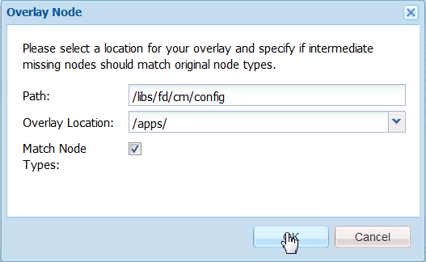

# Teksteditor aanpassen{#customize-text-editor}

## Overzicht {#overview}

U kunt de teksteditor aanpassen in Middelen beheren en de gebruikersinterface voor correspondentie maken om meer lettertypen en tekengrootten toe te voegen. Deze lettertypen bevatten Engels en niet-Engels, zoals Japans, lettertypen.

U kunt het volgende wijzigen in de lettertype-instellingen:

* Lettertypefamilie en -grootte
* Eigenschappen zoals hoogte- en letterspatiëring
* Standaardwaarden van lettertypefamilie en -grootte, hoogte, letterspatiëring en datumnotatie
* Opsommingstekens

Hiervoor moet u:

1. [Lettertypen aanpassen door het bestand tbxeditor-config.xml in CRX te bewerken](#customizefonts)
1. [Aangepaste lettertypen toevoegen aan de clientcomputer](#addcustomfonts)

## Lettertypen aanpassen door het bestand tbxeditor-config.xml in CRX te bewerken {#customizefonts}

Ga als volgt te werk om lettertypen aan te passen door het bestand tbxeditor-config.xml te bewerken:

1. Ga naar Beheerder `https://'[server]:[port]'/[ContextPath]/crx/de` en meld u aan.
1. Maak in de map apps een map met de naam config met een pad/structuur die lijkt op de configuratiemap (libs/fd/cm/config). Ga hierbij als volgt te werk:

   1. Klik met de rechtermuisknop op de itemmap in het volgende pad en selecteer **Overlayknooppunt**:

      `/libs/fd/cm/config`

      

   1. Zorg ervoor dat het dialoogvenster Overlay-knooppunt de volgende waarden heeft:

      **Pad:** /libs/fd/cm/config

      **Locatie:** /apps/

      **Identieke knooppunttypen:** Geselecteerd

      

   1. Click **OK**. De mapstructuur wordt gemaakt in de map apps.

   1. Klik op Alles **opslaan**.

1. Maak een kopie van het bestand tbxeditor-config.xml in de nieuw gemaakte config-map met de volgende stappen:

   1. Klik met de rechtermuisknop op het bestand tbxeditor-config.xml in libs/fd/cm/config en selecteer **Kopiëren**.
   1. Klik met de rechtermuisknop op de volgende map en selecteer **Plakken:**

      `apps/fd/cm/config`

   1. De naam van het geplakte bestand is standaard `copy of tbxeditor-config.xml.` Naam van het bestand wijzigen in `tbxeditor-config.xml` en klikken op Alles **** opslaan.

1. Open het bestand tbxeditor-config.xml in apps/fd/cm/config en breng de vereiste wijzigingen aan.

   1. Dubbelklik op het bestand tbxeditor-config.xml in apps/fd/cm/config. Het bestand wordt geopend.

      ```xml
      <editorConfig>
         <bulletIndent>0.25in</bulletIndent>
      
         <defaultDateFormat>DD-MM-YYYY</defaultDateFormat>
      
         <fonts>
            <default>Times New Roman</default>
            <font>_sans</font>
            <font>_serif</font>
            <font>_typewriter</font>
            <font>Arial</font>
            <font>Courier</font>
            <font>Courier New</font>
            <font>Geneva</font>
            <font>Georgia</font>
            <font>Helvetica</font>
            <font>Tahoma</font>
            <font>Times New Roman</font>
            <font>Times</font>
            <font>Verdana</font>
         </fonts>
      
         <fontSizes>
            <default>12</default>
            <fontSize>8</fontSize>
            <fontSize>9</fontSize>
            <fontSize>10</fontSize>
            <fontSize>11</fontSize>
            <fontSize>12</fontSize>
            <fontSize>14</fontSize>
            <fontSize>16</fontSize>
            <fontSize>18</fontSize>
            <fontSize>20</fontSize>
            <fontSize>22</fontSize>
            <fontSize>24</fontSize>
            <fontSize>26</fontSize>
            <fontSize>28</fontSize>
            <fontSize>36</fontSize>
            <fontSize>48</fontSize>
            <fontSize>72</fontSize>
         </fontSizes>
      
         <lineHeights>
            <default>2</default>     
            <lineHeight>2</lineHeight>
            <lineHeight>3</lineHeight>
            <lineHeight>4</lineHeight>
            <lineHeight>5</lineHeight>
            <lineHeight>6</lineHeight>
            <lineHeight>7</lineHeight>
            <lineHeight>8</lineHeight>
            <lineHeight>9</lineHeight>
            <lineHeight>10</lineHeight>
            <lineHeight>11</lineHeight>
            <lineHeight>12</lineHeight>
            <lineHeight>13</lineHeight>
            <lineHeight>14</lineHeight>
            <lineHeight>15</lineHeight>
            <lineHeight>16</lineHeight>
         </lineHeights>
      
         <letterSpacings>
            <default>0</default>
            <letterSpacing>0</letterSpacing>
            <letterSpacing>1</letterSpacing>
            <letterSpacing>2</letterSpacing>
            <letterSpacing>3</letterSpacing>
            <letterSpacing>4</letterSpacing>
            <letterSpacing>5</letterSpacing>
            <letterSpacing>6</letterSpacing>
            <letterSpacing>7</letterSpacing>
            <letterSpacing>8</letterSpacing>
            <letterSpacing>9</letterSpacing>
            <letterSpacing>10</letterSpacing>
            <letterSpacing>11</letterSpacing>
            <letterSpacing>12</letterSpacing>
            <letterSpacing>13</letterSpacing>
            <letterSpacing>14</letterSpacing>
            <letterSpacing>15</letterSpacing>
            <letterSpacing>16</letterSpacing>
         </letterSpacings>
      </editorConfig>
      ```

   1. Breng de gewenste wijzigingen aan in het bestand om de volgende wijzigingen in de lettertype-instellingen aan te brengen:

      * Lettertypefamilie en -grootte toevoegen of verwijderen
      * Eigenschappen zoals hoogte- en letterspatiëring
      * Standaardwaarden van lettertypefamilie en -grootte, hoogte, letterspatiëring en datumnotatie
      * Opsommingstekens

      Als u bijvoorbeeld een Japans lettertype met de naam Sazanami Mincho Medium wilt toevoegen, moet u het volgende item in het XML-bestand invoeren: `<font>Sazanami Mincho Medium</font>`. Dit lettertype moet ook op de clientcomputer zijn geïnstalleerd om het lettertype te kunnen aanpassen en er toegang toe te hebben. Zie Aangepaste lettertypen [toevoegen aan de clientcomputer](#addcustomfonts)voor meer informatie.

      U kunt ook de standaardinstellingen voor verschillende aspecten van tekst wijzigen en de lettertypen uit de teksteditor verwijderen door de items te verwijderen.

   1. Klik op Alles **opslaan**.


## Aangepaste lettertypen toevoegen aan de clientcomputer {#addcustomfonts}

Als u een lettertype opent in de teksteditor voor Correspondentiebeheer, moet dit lettertype aanwezig zijn op de clientcomputer die u gebruikt voor toegang tot Correspondentiebeheer. Als u een aangepast lettertype in de teksteditor wilt gebruiken, moet u dit eerst op de client installeren.

Raadpleeg de volgende secties voor meer informatie over het installeren van lettertypen:

* [Lettertypen installeren of verwijderen in Windows](https://windows.microsoft.com/en-us/windows-vista/install-or-uninstall-fonts)
* [Basisprincipes van Mac: Lettertypeboek](https://support.apple.com/en-us/HT201749)

## Lettertypeaanpassingen openen {#access-font-customizations}

Nadat u wijzigingen hebt aangebracht in de lettertypen in het bestand tbxeditor-config.xml in CRX en de vereiste lettertypen hebt geïnstalleerd op de clientcomputer die wordt gebruikt voor toegang tot AEM Forms, worden de wijzigingen weergegeven in de teksteditor.

Het lettertype Sazanami Mincho Medium dat bijvoorbeeld wordt toegevoegd aan het bestand [Customize fonts door het bestand tbxeditor-config.xml in de CRX](#customizefonts) -procedure te bewerken, wordt als volgt weergegeven in de gebruikersinterface van de teksteditor:


>[!NOTE]
>
>Als u tekst in het Japans wilt zien, moet u eerst de tekst met Japanse tekens invoeren. De toepassing van een aangepast Japans lettertype maakt de tekst alleen op een bepaalde manier op. De toepassing van een aangepast Japans lettertype wijzigt geen Engelse of andere tekens in Japanse tekens.

