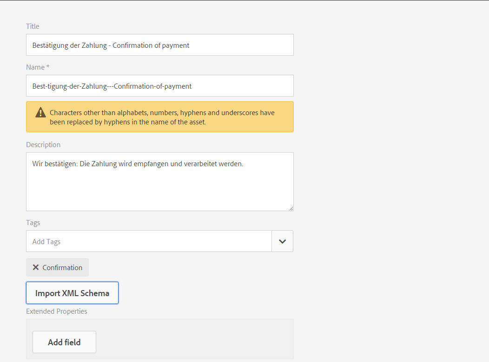

# Gegevenswoordenboek{#data-dictionary}

## Inleiding {#introduction}

Een gegevenswoordenboek laat bedrijfsgebruikers toe om informatie van achterste-eindgegevensbronnen te gebruiken zonder technische details over hun onderliggende gegevensmodellen te kennen. Een gegevenswoordenboek bestaat uit gegevenswoordenboekelementen (DDE&#39;s). U gebruikt deze gegevenselementen om back-end gegevens aan de brieven als input voor gebruik in een klantencorrespondentie te integreren.

Een gegevenswoordenboek is een onafhankelijke weergave van metagegevens waarin de onderliggende gegevensstructuren en de bijbehorende kenmerken worden beschreven. Een gegevenswoordenboek wordt gecreeerd gebruikend bedrijfswoordenlijst. Deze kan aan een of meer onderliggende gegevensmodellen worden toegewezen.

Het gegevenswoordenboek bestaat uit elementen van drie typen: Eenvoudige, samengestelde en verzamelingselementen. Eenvoudige DDE&#39;s zijn primitieve elementen, zoals tekenreeksen, getallen, datums en Booleaanse waarden die informatie bevatten zoals een plaatsnaam. Een samengestelde DDE bevat andere DDE&#39;s, die van het type primitief, samengesteld of verzameling kunnen zijn. Een adres bestaat bijvoorbeeld uit een adres, plaats, provincie, land en postcode. Een verzameling is een lijst met vergelijkbare eenvoudige of samengestelde DDE&#39;s. Een klant met bijvoorbeeld meerdere locaties of een ander factuuradres en verzendadres.

Het Beheer van de correspondentie gebruikt het achtereind, de klant, of de ontvanger-specifieke gegevens die volgens de structuur van het gegevenswoordenboek worden opgeslagen om correspondentie tot stand te brengen die voor verschillende klanten wordt bedoeld. U kunt bijvoorbeeld een document maken met een vriendelijke naam, zoals &quot;Beste {voornaam}&quot; of &quot;Mr. {Achternaam}&quot;.

Zakelijke gebruikers hebben doorgaans geen kennis nodig van metagegevensrepresentaties zoals XSD (XML-schema) en Java-klassen. Nochtans, vereisen zij gewoonlijk toegang tot deze gegevensstructuren en attributen om oplossingen te bouwen.

### Workflow gegevenswoordenboek {#data-dictionary-workflow}

1. Een auteur [maakt het gegevenswoordenboek](#createdatadictionary) door een schema of helemaal opnieuw te uploaden.
1. De auteur creeert brief en Interactieve Mededelingen die op het gegevenswoordenboek wordt gebaseerd en associeert de elementen van het gegevenswoordenboek in brief en Interactieve Mededelingen waar nodig.
1. Een auteur kan het XML-bestand met voorbeeldgegevens downloaden. Dit bestand is gebaseerd op het schema van een gegevenswoordenboek. De auteur kan het XML-bestand met voorbeeldgegevens wijzigen. Dit bestand kan als testgegevens worden gekoppeld aan het gegevenswoordenboek. Hetzelfde wordt gebruikt tijdens de lettertypevoorvertoning.
1. Tijdens het [voorvertonen van een letter](../../forms/using/create-letter.md#p-types-of-linkage-available-for-each-of-the-fields-p)kiest een auteur ervoor de letter met gegevens voor te vertonen (Aangepaste voorvertoning). De brief wordt geopend vooraf gevuld met de gegevens die Auteur heeft verstrekt. Dit opent in creeer correspondentieinterface. De agent die deze brief previewing kan de inhoud, de gegevens, en de gehechtheid in deze brief wijzigen en kan de definitieve brief voorleggen. Zie [Correspondentie](../../forms/using/create-letter.md)maken voor meer informatie over het maken van letters.

## Vereiste {#prerequisite}

Installeer het [compatibiliteitspakket](compatibility-package.md) om de optie **Gegevenswoordenboeken** op de pagina **Formulieren** weer te geven.

## Een gegevenswoordenboek maken {#createdatadictionary}

U gebruikt de Editor gegevenswoordenboek om een gegevenswoordenboek te maken of u kunt een XSD-schemabestand uploaden om op basis daarvan een gegevenswoordenboek te maken. U kunt het gegevenswoordenboek vervolgens uitbreiden door meer vereiste informatie toe te voegen, waaronder velden. Ongeacht hoe het gegevenswoordenboek werd gecreeerd, heeft de eigenaar van het bedrijfsproces geen kennis van de achterste deelsystemen nodig. De eigenaar van het bedrijfsproces heeft slechts kennis van de domeinvoorwerpen, en hun definities, voor hun proces nodig.

>[!NOTE]
>
>Voor meerdere letters met vergelijkbare elementen kunt u een algemeen gegevenswoordenboek maken. Een groot gegevenswoordenboek met een groot aantal elementen kan echter prestatieproblemen veroorzaken bij het gebruik van het gegevenswoordenboek en het laden van de elementen, zoals letters en documentfragmenten. Als u problemen ondervindt met de prestaties, kunt u verschillende gegevenswoordenboeken voor verschillende letters maken.

1. Selecteer **Formulieren** > **Gegevenswoordenboeken**.
1. Tik op Gegevenswoordenboek **maken**.
1. Voeg het volgende toe in het scherm Eigenschappen:

   * **Titel:** (Optioneel) Voer de titel in voor het gegevenswoordenboek. De titel mag niet uniek zijn en mag speciale tekens en niet-Engelse tekens bevatten. Letters en andere documentfragmenten worden met hun titel bedoeld (indien beschikbaar), zoals in miniaturen en elementeigenschappen. Er wordt naar gegevenswoordenboeken verwezen met hun naam en niet met titels.
   * **Naam:** De unieke naam voor het gegevenswoordenboek. In het veld Naam kunt u alleen Engelse tekens, cijfers en afbreekstreepjes invoeren. Het veld Naam wordt automatisch ingevuld op basis van het veld Titel en de speciale tekens, spaties, cijfers en niet-Engelse tekens die in het veld Titel zijn ingevoerd, worden vervangen door afbreekstreepjes. Hoewel de waarde in het veld Titel automatisch naar de naam wordt gekopieerd, kunt u de waarde bewerken.

   * **Omschrijving**: (Optioneel) Beschrijving van het gegevenswoordenboek.
   * **Tags:** (Optioneel) Als u een aangepaste tag wilt maken, voert u een waarde in het tekstveld in en drukt u op Enter. U ziet de tag onder het tekstveld met tags. Wanneer u deze tekst opslaat, worden ook de toegevoegde tags gemaakt.
   * **Uitgebreide eigenschappen**: (Optioneel) Tik op Veld **** toevoegen om metagegevenskenmerken voor uw gegevenswoordenboek op te geven. Voer in de kolom Naam eigenschap een unieke eigenschapnaam in. Voer in de kolom Waarde een waarde in die u aan de eigenschap wilt koppelen.

   

1. (Optioneel) Tik op XML-schema **uploaden om een XSD-schemadefinitie voor uw gegevenswoordenboek te uploaden onder het deelvenster Structuur gegevenswoordenboek**. Blader naar het XSD-bestand, selecteer het en tik op **Openen**. Er wordt een gegevenswoordenboek gemaakt op basis van het geüploade XML-schema. U moet de weergavenamen en beschrijvingen van de elementen in het gegevenswoordenboek aanpassen. U doet dit door de namen van de elementen te selecteren door erop te tikken en de beschrijvingen, weergavenamen en andere details in de velden in het rechterdeelvenster te bewerken.

   Zie [Berekende gegevenswoordenboekelementen](#computedddelements)voor meer informatie over Berekende DD-elementen.

   >[!NOTE]
   >
   >U kunt het uploaden van het schemadossier overslaan en uw gegevenswoordenboek van kras bouwen gebruikend het gebruikersinterface. U doet dit door deze stap over te slaan en door te gaan met de volgende stappen.

1. Tik op **Volgende**.
1. Voeg in het scherm Eigenschappen toevoegen de elementen toe aan het gegevenswoordenboek. U kunt ook elementen toevoegen/verwijderen en de details ervan bewerken als u een schema hebt geüpload voor een basisstructuur van het gegevenswoordenboek.

   U kunt op de drie punten aan de rechterkant van een element tikken en een element toevoegen aan de gegevenswoordenboekstructuur.

   

   Selecteer Samengesteld element, Verzamelingselement of Primitief element.

   * Een samengestelde DDE bevat andere DDEs, die van type primitief, samenstelling, of inzameling kunnen zijn. Een adres bestaat bijvoorbeeld uit een adres, plaats, provincie, land en postcode.
   * Primitieve DDEs is elementen zoals koorden, aantallen, data, en Booleaanse waarden die informatie zoals een plaatsnaam houden.
   * Een verzameling is een lijst met vergelijkbare eenvoudige of samengestelde DDE&#39;s. Een klant met bijvoorbeeld meerdere locaties of een ander factuuradres en verzendadres.

   Hier volgen enkele regels voor het maken van een gegevenswoordenboek:

   * Alleen samengestelde typen zijn toegestaan als DDE op hoofdniveau in een gegevenswoordenboek.
   * Naam, referentienaam en elementtype zijn verplichte velden voor een gegevenswoordenboek en DDE&#39;s.
   * De referentienaam moet uniek zijn.
   * Een ouder DDE (samenstelling) kan twee kinderen met de zelfde naam niet hebben.
   * Cijfers bevatten alleen primitieve tekenreekstypen.

   Voor meer informatie over Samenstelling, Verzameling, en Primitieve elementen en het werken met de elementen van het gegevenswoordenboek, zie de Elementen van het Woordenboek van Gegevens van de [Toewijzing aan het Schema](#mappingddetoschema)van XML.

   Zie Validaties in de [gegevenswoordenboekeditor voor informatie over validaties in gegevenswoordenboek](#ddvalidations).

   

1. (Optioneel) Nadat u een element hebt geselecteerd, kunt u op het tabblad Geavanceerd eigenschappen (kenmerken) toevoegen. U kunt ook op Veld **** toevoegen tikken en de eigenschappen van een DD-element uitbreiden.

   

1. (Optioneel) U kunt elk element verwijderen door op de drie punten rechts van een element te tikken en **Verwijderen** te selecteren.

   

   >[!NOTE]
   >
   >Als u een samengesteld element/verzamelingselement met onderliggende knooppunten verwijdert, worden ook de onderliggende knooppunten verwijderd.

1. (Optioneel) Selecteer een element in het deelvenster Structuur gegevenswoordenboek en in het deelvenster Lijst met velden en variabelen. Wijzig de vereiste kenmerken die aan het element zijn gekoppeld of voeg deze toe.
1. Tik op **Opslaan**.

### Kopieën maken van een of meer gegevenswoordenboeken {#create-copies-of-one-or-more-data-dictionary}

Als u snel een of meer gegevenswoordenboeken wilt maken met eigenschappen en elementen die lijken op bestaande gegevenswoordenboeken, kunt u deze kopiëren en plakken.

1. Selecteer de juiste gegevenswoordenboeken in de lijst met gegevenswoordenboeken. In de gebruikersinterface wordt het pictogram Kopiëren weergegeven.
1. Tik op Kopiëren. In de gebruikersinterface wordt het pictogram Plakken weergegeven.
1. Tik op Plakken. Het dialoogvenster Plakken wordt geopend. Het systeem wijst automatisch namen en titels toe aan de nieuwe gegevenswoordenboeken.
1. Bewerk indien nodig de titel en naam waarmee u de kopie van het gegevenswoordenboek wilt opslaan.
1. Tik op Plakken. De kopie van het gegevenswoordenboek wordt gemaakt. Nu kunt u de vereiste wijzigingen aanbrengen in het nieuwe gegevenswoordenboek.

## Zie documentfragmenten of documenten die naar een element van het Woordenboek van Gegevens verwijzen {#see-the-document-fragments-or-documents-that-refer-to-a-data-dictionary-element}

Tijdens het bewerken of weergeven van een gegevenswoordenboek kunt u zien naar welke elementen in het gegevenswoordenboek wordt verwezen in welke teksten, voorwaarden, letters en interactieve communicatie.

1. Voer een van de volgende handelingen uit om het gegevenswoordenboek te bewerken:

   * Houd de cursor boven een gegevenswoordenboek en tik op Bewerken.
   * Selecteer een gegevenswoordenboek en tik op Bewerken in de koptekst.
   * Houd de cursor boven een gegevenswoordenboek en tik op Selecteren. Tik vervolgens op Bewerken in de koptekst.

   Of tik op een gegevenswoordenboek om dit weer te geven.

1. Tik in het gegevenswoordenboek op een eenvoudig element om dit te selecteren. Samengestelde elementen en verzamelingselementen hebben geen verwijzingen.

   Naast de eigenschappen Standaard en Geavanceerd van het element wordt ook de eigenschap Lent Content weergegeven.

1. Tik op Inhoud lent.

   Het tabblad Inhoud van Inhoud wordt als volgt weergegeven: Teksten, voorwaarden, letters en interactieve communicatie. In elk van deze koppen wordt ook het aantal verwijzingen naar het geselecteerde element weergegeven.

1. Tik op een kop om de naam weer te geven van de elementen die naar het element verwijzen.

   

1. Tik op het element om de inhoud van de bovenliggende inhoud voor een ander element weer te geven.
1. Tik op de naam van een element om een element weer te geven dat naar het element verwijst. De browser geeft het element, de letter of de interactieve communicatie weer.

## Werken met testgegevens {#working-with-test-data}

1. Tik op **Selecteren** op de pagina Gegevenswoordenboeken.
1. Tik op een gegevenswoordenboek waarvoor u testgegevens wilt downloaden en tik vervolgens op XML-voorbeeldgegevens **** downloaden.
1. Tik op **OK** in het waarschuwingsbericht. Een XML-bestand wordt gedownload.
1. Open het XML-bestand met Kladblok of een andere XML-editor. Het XML-bestand heeft dezelfde structuur als het gegevenswoordenboek en de plaatsaanduidingstekenreeksen in de elementen. Vervang de tekenreeksen voor plaatsaanduidingen door de gegevens waarmee u een letter wilt testen.

   ```xml
   <?xml version="1.0" encoding="UTF-8" standalone="no"?>
   <Company>
   <Name>string</Name>
   <Type>string</Type>
   <HeadOfficeAddress>
   <Street>string</Street>
   <City>string</City>
   <State>string</State>
   <Zip>string</Zip>
   </HeadOfficeAddress>
   <SalesOfficeAddress>
   <Street>string</Street>
   <City>string</City>
   <State>string</State>
   <Zip>string</Zip>
   </SalesOfficeAddress>
   <HeadCount>1.0</HeadCount>
   <CEO>
   <PersonName>
   <FirstName>string</FirstName>
   <MiddleName>string</MiddleName>
   <LastName>string</LastName>
   </PersonName>
   <DOB>string</DOB>
   <CurrAddress>
   <Street>string</Street>
   <City>string</City>
   <State>string</State>
   <Zip>string</Zip>
   </CurrAddress>
   <DOJ>14-04-1973</DOJ>
   <Phone>1.0</Phone>
   </CEO>
   </Company>
   ```

   >[!NOTE]
   >
   >In dit voorbeeld maakt XML ruimte voor drie waarden aan een verzamelingselement, maar het aantal waarden kan naar behoefte worden verhoogd of verlaagd.

1. Nadat u de gegevensinvoer hebt gemaakt, kunt u dit XML-bestand gebruiken wanneer u een voorbeeld van een letter weergeeft met testgegevens.

   U kunt deze testgegevens toevoegen met DD (Selecteer DD en tik op Testgegevens uploaden en upload dit XML-bestand)Als u de standaardvoorvertoning van de brief (niet de aangepaste versie) gebruikt, worden deze XML-gegevens gebruikt in letter. U kunt ook op Aangepast tikken en deze XML uploaden.

## Voorbeelden {#samples}

De volgende codesteekproeven tonen implementatiedetails voor het Woordenboek van Gegevens.

### Voorbeeldschema dat kan worden geüpload naar het gegevenswoordenboek {#sample-schema-that-can-be-uploaded-to-the-data-dictionary}

```xml
<?xml version="1.0" encoding="utf-8"?>
<xs:schema xmlns="DCT" targetNamespace="DCT" xmlns:xs="https://www.w3.org/2001/XMLSchema"
  elementFormDefault="qualified" attributeFormDefault="unqualified">
  <xs:element name="Company">
    <xs:complexType>
      <xs:sequence>
        <xs:element name="Name" type="xs:string"/>
        <xs:element name="Type" type="xs:anySimpleType"/>
        <xs:element name="HeadOfficeAddress" type="Address"/>
        <xs:element name="SalesOfficeAddress" type="Address" minOccurs="0"/>
        <xs:element name="HeadCount" type="xs:integer"/>
        <xs:element name="CEO" type="Employee"/>
        <xs:element name="Workers" type="Employee" maxOccurs="unbounded"/>
      </xs:sequence>
    </xs:complexType>
  </xs:element>
  <xs:complexType name="Employee">
    <xs:complexContent>
      <xs:extension  base="Person">
        <xs:sequence>
          <xs:element name="CurrAddress" type="Address"/>
          <xs:element name="DOJ" type="xs:date"/>
          <xs:element name="Phone" type="xs:integer"/>
        </xs:sequence>
      </xs:extension>
    </xs:complexContent>
  </xs:complexType>
  <xs:complexType name="Person">
    <xs:sequence>
      <xs:element name="PersonName" type="Name"/>
      <xs:element name="DOB" type="xs:dateTime"/>
    </xs:sequence>
  </xs:complexType>
  <xs:complexType name="Name">
    <xs:sequence>
      <xs:element name="FirstName" type="xs:string"/>
      <xs:element name="MiddleName" type="xs:string"/>
      <xs:element name="LastName" type="xs:string"/>
    </xs:sequence>
  </xs:complexType>
  <xs:complexType name="Address">
    <xs:sequence>
      <xs:element name="Street" type="xs:string"/>
      <xs:element name="City" type="xs:string"/>
      <xs:element name="State" type="xs:string"/>
      <xs:element name="Zip" type="xs:string"/>
    </xs:sequence>
  </xs:complexType>
</xs:schema>
```

## Algemene kenmerken die zijn gekoppeld aan een DDE {#common-attributes-associated-with-a-dde}

In de volgende tabel worden de algemene kenmerken beschreven die aan een DDE zijn gekoppeld:

<table>
 <tbody>
  <tr>
   <td><strong>Kenmerk</strong></td>
   <td><strong>Type</strong></td>
   <td><strong>Beschrijving</strong></td>
  </tr>
  <tr>
   <td>Naam</td>
   <td>Tekenreeks</td>
   <td>Vereist.<br /> Naam van de DDE. Het moet uniek zijn.</td>
  </tr>
  <tr>
   <td>Referentienaam<br /></td>
   <td>Tekenreeks</td>
   <td>Vereist. Unieke referentienaam voor de DDE die verwijzingen naar DDE toestaat die van veranderingen in de hiërarchie of de structuur van het gegevenswoordenboek onafhankelijk zijn. Tekstmodules worden met deze naam toegewezen</td>
  </tr>
  <tr>
   <td>displaynaam</td>
   <td>Tekenreeks</td>
   <td>Een optionele gebruiksvriendelijke naam van de DDE.</td>
  </tr>
  <tr>
   <td>beschrijving</td>
   <td>Tekenreeks</td>
   <td>Beschrijving van de DDE.</td>
  </tr>
  <tr>
   <td>elementType</td>
   <td>Tekenreeks</td>
   <td>Vereist. Het type DDE: STRING, NUMBER, DATE, Boolean, COMPOSITE, COLLECTION.</td>
  </tr>
  <tr>
   <td>elementSubType</td>
   <td>Tekenreeks</td>
   <td>Het subtype voor DDE: ENUM. Alleen toegestaan voor STRING en NUMBER-elementtype.</td>
  </tr>
  <tr>
   <td>Sleutel</td>
   <td>Boolean</td>
   <td>Een Booleaans veld dat aangeeft of een DDE een sleutelelement is.</td>
  </tr>
  <tr>
   <td>Berekend</td>
   <td>Boolean</td>
   <td>Een Booleaans veld dat aangeeft of een DDE is berekend. Een berekende DDE-waarde is een functie van andere DDE-waarden. JPEG-expressies worden standaard ondersteund.</td>
  </tr>
  <tr>
   <td>expression</td>
   <td>Tekenreeks</td>
   <td>De expressie voor de 'berekende' DDE. De dienst van de uitdrukkingsevaluatie die door gebrek wordt verscheept steunt uitdrukkingen JSP EL. U kunt de expressieservice vervangen door een aangepaste implementatie.</td>
  </tr>
  <tr>
   <td>valueSet</td>
   <td>Lijst</td>
   <td>Een set toegestane waarden voor een Enum-type DDE. Het accounttype kan bijvoorbeeld alleen waarden (Opslaan, Huidig) hebben.</td>
  </tr>
  <tr>
   <td>extendedProperties</td>
   <td>Object</td>
   <td>A Map of custom properties added to DDE (user interface specific or any other information).</td>
  </tr>
  <tr>
   <td>Vereist</td>
   <td>Boolean</td>
   <td>De vlag wijst erop dat de bron van instantiegegevens die aan het gegevenswoordenboek beantwoorden de waarde van deze bepaalde DDE moet bevatten.</td>
  </tr>
  <tr>
   <td>Binding</td>
   <td>BindingElement</td>
   <td>De XML- of Java-binding van het element.</td>
  </tr>
 </tbody>
</table>

### Berekende gegevenswoordenboekelementen {#computedddelements}

Een gegevenswoordenboek kan ook berekende elementen bevatten. Een gegevenswoordenboekelement wordt altijd gekoppeld aan een expressie. Deze expressie wordt geëvalueerd om de waarde van een gegevenswoordenboekelement bij uitvoering op te halen. Een berekende DDE-waarde is een functie van andere DDE-waarden of -literalen. Standaard JSP Expression Language (EL)-expressies worden ondersteund. De EL-expressies gebruiken de ${ }-tekens en geldige expressies kunnen letterlijke tekens, operatoren, variabelen (gegevenswoordenboekelementverwijzingen) en functieaanroepen bevatten. Bij het verwijzen naar een gegevenswoordenboekelement in de expressie wordt de referentienaam van de DDE gebruikt. De referentienaam is uniek voor elk gegevenswoordenboekelement binnen een gegevenswoordenboek.

Een berekende DDE PersonFullName kan met een EL aaneenschakelingsuitdrukking zoals $ worden geassocieerd {PersonFirstName} ${PersonLastName}.

## Gegevenstype toewijzen tussen XSD en gegevenswoordenboek {#data-type-mapping-between-xsd-and-data-dictionary-br}

Voor het exporteren van een XSD-bestand zijn specifieke gegevenstoewijzingen nodig, die in de volgende tabel worden beschreven. De kolom DDI wijst op het type van de waarde DDE zoals beschikbaar in DDI.

<table>
 <tbody>
  <tr>
   <td>XSD <br /> </td>
   <td><p>Gegevenswoordenboek <br /> </p> </td>
   <td>DDI (Gegevenstype Instantiewaarde)<br /> </p> </td>
  </tr>
  <tr>
   <td><p>xs:element van type - Samengesteld type<br /> </p> </td>
   <td>DDE van het type - SAMENGESTELD<br /> </p> </td>
   <td>java.util.Map<br /> </td>
  </tr>
  <tr>
   <td><p>xs:element waarbij maxOccurs &gt; 1<br /> </p> </td>
   <td>DDE van type - COLLECTION-<br /> een knoop DDE wordt gecreeerd naast COLLECTION DDE die informatie van de knoop van de ouderVERZAMELING vangt. Het zelfde wordt gecreeerd voor beide inzameling van eenvoudige/samengestelde gegevenstypes. Wanneer u een VERZAMELING van de typesamenstelling hebt, vangt de boom van het Woordenboek van Gegevens de samenstellende gebieden in de kinderen van DDE die voor het vangen van typeinformatie wordt gecreeerd.<br /> - DDE (COLLECTION)<br /> - DDE(COMPOSITE voor type info)<br /> - DDE(STRING) field1<br /> - DDE(STRING) field2<br /> <br /> </p> </td>
   <td>java.util.List<br /> </td>
  </tr>
  <tr>
   <td>Kenmerk van type - xs:id <br /> </p> </td>
   <td>DDE van het type - STRING <br /> </td>
   <td>java.lang.String<br /> </td>
  </tr>
  <tr>
   <td>xs:attribute /xs:element van type - xs:string</p> </td>
   <td>DDE van het type - STRING<br /> </td>
   <td>java.lang.String<br /> </td>
  </tr>
  <tr>
   <td>xs:attribute /xs:element of type - xs: boolean <br /> </td>
   <td>DDE van het type - Boolean <br /> </td>
   <td>java.lang.Boolean<br /> </td>
  </tr>
  <tr>
   <td>xs:attribute /xs:element van type - xs:date </td>
   <td>DDE van het type - DATUM </td>
   <td>java.lang.String</td>
  </tr>
  <tr>
   <td>xs:attribute /xs:element van type - xs:integer </td>
   <td>DDE van type - NUMBER </td>
   <td>java.lang.Double</td>
  </tr>
  <tr>
   <td>xs:attribute /xs:element van type - xs:long</td>
   <td>DDE van type - NUMBER </td>
   <td>java.lang.Double</td>
  </tr>
  <tr>
   <td>xs:attribute /xs:element van type - xs:double</td>
   <td>DDE van type - NUMBER </td>
   <td>java.lang.Double</td>
  </tr>
  <tr>
   <td>Element van opsommingstype en baseType - xs:string</td>
   <td>DDE van<br /> type - STRING<br /> subtype - ENUM<br /> valueSet - de toegestane waarden voor ENUM<br /> </td>
   <td>java.lang.String</td>
  </tr>
 </tbody>
</table>

## Een bestand met voorbeeldgegevens downloaden uit een gegevenswoordenboek {#download-a-sample-data-file-from-a-data-dictionary}

Nadat u een gegevenswoordenboek hebt gemaakt, kunt u dit downloaden als een XML-voorbeeldgegevensbestand om er tekstgegevens in te maken.

1. Tik op de pagina Gegevenswoordenboeken op **Selecteren** en tik vervolgens op een gegevenswoordenboek om dit te selecteren.
1. Selecteer XML-voorbeeldgegevens **** downloaden.
1. Tik op **OK** in het waarschuwingsbericht.

   Correspondence Management maakt een XML-bestand op basis van de structuur van het geselecteerde gegevenswoordenboek en downloadt het bestand naar de computer met de naam &lt;data-dictionary-name>-SampleData. Nu kunt u dit bestand bewerken in een XML- of teksteditor om gegevensitems te maken terwijl u een letter [maakt](../../forms/using/create-letter.md).

## Internationalisatie van meta-gegevens {#internationalization-of-meta-data}

Wanneer u dezelfde letter in verschillende talen naar uw klanten wilt verzenden, kunt u de sets met weergavenamen, beschrijvingen en opsommingswaarden van het gegevenswoordenboek en gegevenswoordenboekelementen lokaliseren.

### Gegevenswoordenboek lokaliseren {#localize-data-dictionary}

1. Tik op de pagina Gegevenswoordenboeken op **Selecteren** en tik vervolgens op een gegevenswoordenboek om dit te selecteren.
1. Tik op Localisatiegegevens **** downloaden.
1. Tik op **OK** in de waarschuwing. Correspondence Management downloadt een zip-bestand met de naam DataDictionary-&lt;DDname>.zip naar de computer.
1. Het Zip-bestand bevat een .properties-bestand. In dit bestand wordt het gedownloade gegevenswoordenboek gedefinieerd. De inhoud van het eigenschappenbestand is vergelijkbaar met het volgende:

   ```ini
   #Wed May 20 16:06:23 BST 2015
   DataDictionary.EmployeeDD.description=
   DataDictionary.EmployeeDD.displayName=EmployeeDataDictionary
   DataDictionaryElement.name.description=
   DataDictionaryElement.name.displayName=name
   DataDictionaryElement.person.description=
   DataDictionaryElement.person.displayName=person
   ```

   In de structuur van het eigenschappenbestand wordt één regel gedefinieerd voor de beschrijving en de weergavenaam voor het gegevenswoordenboek en elk gegevenswoordenboekelement in het gegevenswoordenboek. Daarnaast definieert het eigenschappenbestand één regel voor een opsommingswaarde die is ingesteld voor elk gegevenswoordenboekelement. Net als bij een gegevenswoordenboek kan het corresponderende eigenschappenbestand meerdere definities van gegevenswoordenboekelementen bevatten. Bovendien kan het bestand de definities bevatten voor een of meer opsommingssets.

1. Als u het eigenschappenbestand wilt bijwerken naar een andere landinstelling, werkt u de waarden voor de weergavenaam en beschrijving in het bestand bij. Maak meer instanties van het bestand voor elke taal waarin u wilt lokaliseren. Alleen Franse, Duitse, Japanse en Engelse talen worden ondersteund.

1. Sla de verschillende bijgewerkte eigenschappenbestanden op met de volgende namen:

   _fr_FR.properties French

   _de_DE.properties German

   _ja_JA.properties Japanese

   _nl_NL.properties English

1. Archiveer het .properties-bestand (of bestanden voor meerdere landinstellingen) in één zip-bestand.

1. Selecteer **Meer** > Localisatiegegevens **** uploaden op de pagina Gegevenswoordenboeken en selecteer het ZIP-bestand met gelokaliseerde eigenschappenbestanden.
1. Wijzig de landinstelling van uw browser om de wijzigingen in de lokalisatie weer te geven.

## Validaties gegevenswoordenboek {#ddvalidations}

De Editor gegevenswoordenboek past de volgende validaties toe bij het maken of bijwerken van een gegevenswoordenboek.

* Alleen samengestelde tekst is toegestaan als Element op hoofdniveau in een gegevenswoordenboek.
* Samengestelde elementen en verzamelingselementen zijn niet toegestaan op bladniveau. Alleen primitieve elementen (String, Date, Number, Boolean) zijn toegestaan op bladniveau. Deze bevestiging zorgt ervoor dat er geen samenstelling en inzamelingselement zonder kindDDE is.
* Tijdens het uploaden van een XSD-bestand om een gegevenswoordenboek te maken, vraagt de Editor gegevenswoordenboek om een element op hoofdniveau, indien meerdere, om het gegevenswoordenboek te maken.
* De naam is de enige vereiste parameter voor een gegevenswoordenboek.
* Een ouder DDE (samenstelling) kan twee kinderen met de zelfde naam niet hebben
* Zorgt ervoor dat een DDE wordt gemerkt gegevens verwerkt, slechts als het geen vereiste parameter is. Een vereist element kan niet worden berekend en een berekend element kan niet worden vereist. Verzameling en samengesteld element kunnen ook geen elementen worden berekend.
* Zorgt ervoor dat een DDE wordt gemerkt vereist, slechts wanneer het niet wordt berekend. Het zorgt er ook voor dat het niet het &#39;collectionElement&#39; is waarmee het type verzameling wordt aangeduid (dat zijn de enige onderliggende elementen van een verzamelingselement).
* Lege toetsen of Dubbele toetsen zijn niet toegestaan in extendedProperties voor een gegevenswoordenboek of DDE.
* Gebruik de dubbele punt (:) of verticale bar (|) karakters binnen de sleutel of de waarde van een uitgebreide bezit niet. Er is geen validatie voor het gebruik van deze niet-toegestane tekens.

Validaties die worden toegepast op het niveau van het gegevenswoordenboek

* De naam van het gegevenswoordenboek mag niet null zijn.
* De naam van het gegevenswoordenboek mag alleen alfanumerieke tekens bevatten.
* De lijst met onderliggende elementen in het gegevenswoordenboek mag niet null of leeg zijn.
* Het gegevenswoordenboek mag niet meer dan één gegevenswoordenboekelement op hoofdniveau bevatten.
* Alleen samengestelde tekst is toegestaan als Element op hoofdniveau in een gegevenswoordenboek.

Validaties die worden toegepast op het niveau van het Element van het Woordenboek van Gegevens.

* Alle namen DDE moeten niet ongeldig zijn en mogen geen ruimten bevatten.
* Alle DDEs moet een &quot;niet ongeldig/niet ongeldig&quot;elementtype hebben.
* Alle DDE verwijzingsnamen moeten niet ongeldig zijn.
* Alle DDE verwijzingsnamen moeten uniek zijn.
* Alle DDE-verwijzingen mogen alleen alfanumerieke tekens en &quot;_&quot; bevatten.
* Alle DDE-weergavenamen mogen alleen alfanumerieke tekens en &quot;_&quot; bevatten.
* Samengestelde elementen en verzamelingselementen zijn niet toegestaan op bladniveau. Alleen primitieve elementen (String, Date, Number, Boolean) zijn toegestaan op bladniveau. Deze bevestiging zorgt ervoor dat er geen samenstelling en inzamelingselement zonder kindDDE is.
* Een samengestelde bovenliggende DDE mag geen twee onderliggende elementen met dezelfde naam hebben.
* Het subtype ENUM wordt alleen gebruikt voor de elementen String en Number.
* Verzameling en samengestelde elementen kunnen niet worden berekend.
* Een DDE kan niet zowel worden berekend als worden vereist.
* Berekende DDEs moet een geldige uitdrukking bevatten.
* Berekende DDEs moet geen band van XML hebben.
* Een DDE die het type voor een Inzameling DDE aangeeft kan niet worden berekend of vereist.
* DDE&#39;s van het subtype ENUM mogen geen null- of lege waardensets bevatten.
* De band van XML van een inzameling DDE moet niet aan een attribuut in kaart brengen.
* De syntaxis van de XML-binding moet geldig zijn, zoals er slechts één @ wordt weergegeven. @ is alleen toegestaan als gevolgd door een kenmerknaam.

## Gegevenswoordenboekelementen toewijzen aan XML-schema {#mappingddetoschema}

U kunt een gegevenswoordenboek van een Schema van XML tot stand brengen of het bouwen gebruikend het gebruikersinterface van het Woordenboek van Gegevens. Alle elementen van het Woordenboek van Gegevens (DDEs) binnen een gegevenswoordenboek hebben een Bindend gebied van XML om de band van DDE aan een element in het schema van XML op te slaan. De binding in elke DDE is relatief ten opzichte van de bovenliggende DDE.

De volgende detailmodellen en codesteekproeven die implementatiedetails voor het Woordenboek van Gegevens tonen.

## Eenvoudige (primitieve) elementen toewijzen {#mapping-simple-primitive-elements}

Een primitieve DDE vertegenwoordigt een veld of kenmerk dat atomisch van aard is. Primitieve DDEs die buiten het werkingsgebied van een complex type (samengestelde DDE) of een herhalend element (inzameling DDE) worden bepaald kan in om het even welke plaats binnen het Schema van XML worden opgeslagen. De locatie van de gegevens die overeenkomen met een primitieve DDE is niet afhankelijk van de toewijzing van de bovenliggende DDE. Primitieve DDE gebruikt de toewijzingsinformatie van het Bindende gebied van XML om zijn waarde te bepalen en de afbeeldingen vertalen in één van het volgende:

* een attribuut
* een element
* een tekstcontext
* niets (een genegeerde DDE)

In het volgende voorbeeld wordt een eenvoudig schema getoond.

```xml
<?xml version="1.0" encoding="UTF-8"?>
<xs:schema xmlns:xs="https://www.w3.org/2001/XMLSchema">
  <xs:element name='age' type='integer'/>
  <xs:element name='price' type='decimal'/>
</xs:schema>
```

| **Element gegevenswoordenboek** | **Standaardbinding XML** |
|---|---|
| age | /age |
| prijs | /prijs |

### Samengestelde elementen toewijzen {#mapping-composite-elements}

Binding wordt niet ondersteund voor samengestelde elementen. Als binding is opgegeven, wordt deze genegeerd. De binding voor alle samenstellende onderliggende DDE&#39;s van primitief type moet absoluut zijn. Het toestaan van absolute afbeelding voor kindelementen van samengestelde DDE verstrekt meer flexibiliteit in termen van de Binding van XPath. Als u een samengestelde DDE toewijst aan een complex tekstelement in een XML-schema, beperkt u het bereik van de binding voor de onderliggende elementen.

In het volgende voorbeeld ziet u het schema voor een notitie.

```xml
<xs:element name="note">
    <xs:complexType>
        <xs:sequence>
            <xs:element name="to" type="xs:string"/>
            <xs:element name="from" type="xs:string"/>
            <xs:element name="heading" type="xs:string"/>
            <xs:element name="body" type="xs:string"/>
        </xs:sequence>
    </xs:complexType>
</xs:element>
```

<table>
 <tbody>
  <tr>
   <td><strong>Element gegevenswoordenboek</strong></td>
   <td><strong>Standaardbinding XML</strong></td>
  </tr>
  <tr>
   <td>notitie</td>
   <td>empty(null)<br /> </td>
  </tr>
  <tr>
   <td>tot</td>
   <td>/note/to</td>
  </tr>
  <tr>
   <td>Van</td>
   <td>/note/from</td>
  </tr>
  <tr>
   <td>kop</td>
   <td>/notitie/kop</td>
  </tr>
  <tr>
   <td>lichaam</td>
   <td>/noot/body</td>
  </tr>
 </tbody>
</table>

### Elementen van verzamelingen toewijzen {#mapping-collection-elements}

Een verzamelingselement wordt alleen toegewezen aan een ander verzamelingselement met een kardinaliteit > 1. De onderliggende DDEs van een inzameling DDE heeft relatieve (lokale) Binding van XML met betrekking tot de Binding van XML van zijn ouder. Aangezien onderliggende DDEs van een inzamelingselement de zelfde kardinaliteit moet hebben zoals die van ouder, wordt de relatieve band verplicht om de kardinaliteitsbeperking te verzekeren zodat kind DDEs niet aan een niet herhalend element van het Schema van XML richt. In het onderstaande voorbeeld moet de kardinaliteit van &quot;TokenID&quot; hetzelfde zijn als &quot;Tokens&quot;, de bovenliggende verzameling van DDE.

Wanneer het in kaart brengen van een inzameling DDE aan een element van het Schema van XML:

* de binding voor DDE die aan het element van de Inzameling beantwoordt moet absolute XPath zijn

* Verstrek geen band voor DDE die het type van element van de Inzameling vertegenwoordigen. Indien deze is opgegeven, wordt de binding genegeerd.

* De binding voor alle onderliggende DDE&#39;s van het element Collection moet relatief zijn ten opzichte van het bovenliggende element Collection.

In het XML-schema hieronder wordt een element gedeclareerd met de naam Tokens en een kenmerk maxOccurs van &quot;unbounded&quot;. Tokens is dus een verzamelingselement.

```xml
<?xml version="1.0" encoding="utf-8"?>
<Root>
  <Tokens>
    <TokenID>string</TokenID>
    <TokenText>
      <TextHeading>string</TextHeading>
      <TextBody>string</TextBody>
    </TokenText>
  </Tokens>
  <Tokens>
    <TokenID>string</TokenID>
    <TokenText>
      <TextHeading>string</TextHeading>
      <TextBody>string</TextBody>
    </TokenText>
  </Tokens>
  <Tokens>
    <TokenID>string</TokenID>
    <TokenText>
      <TextHeading>string</TextHeading>
      <TextBody>string</TextBody>
    </TokenText>
  </Tokens>
</Root>
```

De Token.xsd verbonden aan deze steekproef zou zijn:

```xml
<xs:element name="Root">
  <xs:complexType>
    <xs:sequence>
      <xs:element name="Tokens" type="TokenType" maxOccurs="unbounded"/>
    </xs:sequence>
  </xs:complexType>
</xs:element>

<xs:complexType name="TokenType">
  <xs:sequence>
    <xs:element name="TokenID" type="xs:string"/>
    <xs:element name="TokenText">
      <xs:complexType>
        <xs:sequence>
          <xs:element name="TextHeading" type="xs:string"/>
          <xs:element name="TextBody" type="xs:string"/>
        </xs:sequence>
      </xs:complexType>
    </xs:element>
  </xs:sequence>
</xs:complexType>
```

| **Element gegevenswoordenboek** | **Standaardbinding XML** |
|---|---|
| Root | empty(null) |
| Tokens | /Root/Tokens |
| Samengesteld | empty(null) |
| TokenID | TokenID |
| TokenText | empty(null) |
| TokenHeading | TokenText/TextHeading |
| TokenBody | TokenText/TextBody |

