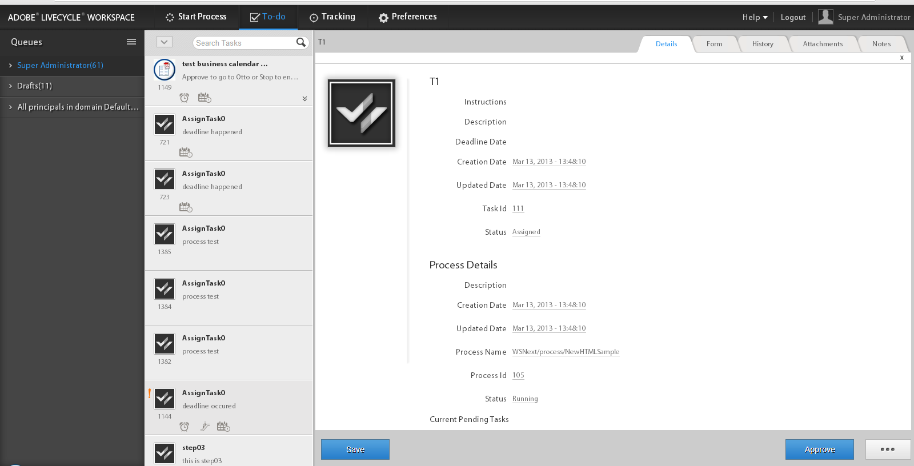

# Extra gegevens weergeven in de lijst ToDo{#displaying-additional-data-in-todo-list}

Standaard worden in de lijst Taak-weergavenaam en -beschrijving van de AEM Forms-werkruimte weergegeven. U kunt echter andere gegevens toevoegen, zoals de aanmaakdatum en de einddatum. U kunt ook pictogrammen toevoegen en de stijl van de weergave wijzigen.



In dit artikel worden de stappen beschreven die moeten worden uitgevoerd om informatie toe te voegen voor elke taak in de lijst AanDoe.

## Wat kan worden toegevoegd {#what-can-be-added}

U kunt de informatie toevoegen die beschikbaar is in `task.json` die door de server wordt verzonden. De informatie kan als gewone tekst worden toegevoegd of u kunt stijlen gebruiken om de informatie te formatteren.

Voor meer informatie over de beschrijving van het Voorwerp JSON, zie [&#x200B; dit &#x200B;](/help/forms/using/html-workspace-json-object-description.md) artikel.

## Informatie weergeven over een taak {#displaying-information-on-a-task}

1. Volg de [&#x200B; Algemene stappen voor de werkruimte van AEM Forms aanpassing &#x200B;](../../forms/using/generic-steps-html-workspace-customization.md).
1. Als u aanvullende informatie voor een taak wilt weergeven, moeten de corresponderende sleutel-waardeparen binnen het taakblok van `translation.json` worden toegevoegd.

   Wijzig bijvoorbeeld `/apps/ws/locales/en-US/translation.json` voor Engels:

   ```json
   "task" : {
           "reminder" : {
               "value" : "Reminder",
               "tooltip" : "This is reminder __reminderCount__, for this task."
           },
           "deadlined" : {
               "value" : "Deadlined",
               "tooltip" : "This task has deadlined"
           },
           "save" : {
               "message" : "Task has been saved successfully"
           },
           "status" : {
               "deadlined" : "Deadlined",
               "created" : "Created",
               "assignedsaved" : "Draft from assigned task",
               "terminated" : "Terminated",
               "assigned" : "Assigned",
               "unknown" : "Unknown",
               "createdsaved" : "Draft from created task",
               "completed" : "Completed"
           },
           "draft" : {
               "value" : "Saved",
               "tooltip" : "This task is marked as a draft"
           },
           "escalated" : {
               "value" : "Escalated",
               "tooltip" : "This task has been escalated"
           },
           "forward" : {
               "value" : "Forwarded",
               "tooltip" : "This task was forwarded"
           },
           "priority" : {
               "highest" : "Highest priority",
               "normal" : "Normal priority",
               "high" : "High priority",
               "low" : "Low priority",
               "lowest" : "Lowest priority"
           },
           "claimed" : {
               "value" : "Claimed",
               "tooltip" : "This task has been claimed"
           },
           "locked" : {
               "value" : "Locked",
               "tooltip" : "This task is locked"
           },
           "consulted" : {
               "value" : "Consulted",
               "tooltip" : "This task has been consulted"
           },
           "returned" : {
               "value" : "Returned",
               "tooltip" : "This task was returned back"
           },
           "multiplesubmitbuttons" : {
               "message" : "The form associated with this task has multiple submit buttons so the Workspace Complete button will be disabled. Click the appropriate button on the form to submit it."
           },
           "nosubmitbutton" : {
               "message" : "The form associated with this task does not appear to have submit buttons. You may need to upgrade your Adobe Reader version to 9.1 or greater and enable the Reader Submit option in your process."
           },
           "icon" : {
               "tooltip" : "open the task __taskName__"
           }
       }
   ```

   >[!NOTE]
   >
   >Voeg overeenkomstige sleutel-waarde paren voor alle gesteunde talen toe.

1. Voeg bijvoorbeeld informatie toe in het taakblok:

   ```json
   "stepname" : {
               "value" : "Step Name",
               "tooltip" : "This task belongs to __stepName__ step"
   }
   ```

## CSS definiëren voor de nieuwe eigenschap {#defining-css-for-the-new-property}

1. U kunt stijl toepassen op de informatie (eigenschap) die aan een taak is toegevoegd. Hiervoor moet u stijlinformatie toevoegen voor de nieuwe eigenschap die aan `/apps/ws/css/newStyle.css` is toegevoegd.

   Bijvoorbeeld:

   ```css
   .task .taskProperties .stepname{
       width: 25px;
       background: url(../images/stepname.png) no-repeat; /*-------- Or just reuse background image / image-sprite defined .task .taskProperties span of style.css---------------------*/
       background-position: 0px 0px; /*-------- Dummy values, need to be configured as per user background image / image-sprite ---------------------*/
   }
   ```

## Item toevoegen in de HTML-sjabloon {#adding-entry-in-the-html-template}

Tot slot moet u een ingang in het dev pakket voor elk bezit omvatten dat u aan de taak wilt toevoegen. Als u er een wilt maken, raadpleegt u de code voor de AEM Forms-werkruimte samenstellen.

1. Kopiëren `task.html`:

   * van: `/libs/ws/js/runtime/templates/`
   * to: `/apps/ws/js/runtime/templates/`

1. Voeg de nieuwe informatie toe aan `/apps/ws/js/runtime/templates/task.html`.

   Voeg bijvoorbeeld toe onder `div class="taskProperties"` :

   ```jsp
   <span class="stepname" alt="<%= $.t('task.stepname.value')%>" title = '<%= $.t("task.stepname.tooltip",{stepName:stepName})%>'/>
   ```
