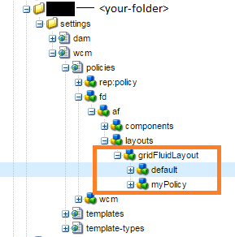

# Componenten weergeven die zijn gebaseerd op de gebruikte sjabloon{#displaying-components-based-on-the-template-used}

Wanneer een formulierauteur een adaptief formulier maakt met behulp van een [template](../../forms/using/template-editor.md), kan de auteur van het formulier specifieke componenten zien en gebruiken die op sjabloonbeleid zijn gebaseerd. U kunt een beleid voor sjablooninhoud opgeven waarmee u een groep componenten kunt kiezen die de auteur van het formulier ziet op het moment van het ontwerpen van het formulier.

## Het inhoudsbeleid van een sjabloon wijzigen {#changing-the-content-policy-of-a-template}

Wanneer u een sjabloon maakt, wordt deze onder `/conf` in de inhoudsopslagplaats. Gebaseerd op de mappen die u hebt gemaakt in het dialoogvenster `/conf` map, pad naar uw sjabloon is: `/conf/<your-folder>/settings/wcm/templates/<your-template>`.

Voer de volgende stappen uit om de componenten in de zijbalk weer te geven op basis van het inhoudsbeleid van een sjabloon:

1. CRXDE-lijst openen.\
   URL: `https://<server>:<port>/crx/de/index.jsp`
1. Navigeer in CRXDE naar de map waarin de sjabloon is gemaakt.

   Bijvoorbeeld: `/conf/<your-folder>/`

1. Navigeer in CRXDE naar: `/conf/<your-folder>/settings/wcm/policies/fd/af/layouts/gridFluidLayout/`

   Voor het selecteren van een groep componenten is een nieuw inhoudsbeleid vereist. Om een beleid tot stand te brengen, kopieer-kleef het standaardbeleid, en noem het anders.

   Het pad naar het standaardbeleid voor inhoud is: `/conf/<your-folder>/settings/wcm/policies/fd/af/layouts/gridFluidLayout/default`

   In de `gridFluidLayout` , kopieert en plakt u het standaardbeleid en wijzigt u de naam ervan. Bijvoorbeeld: `myPolicy`.

   

1. Selecteer het nieuwe beleid u creeert, en selecteer **componenten** eigenschap in het rechterdeelvenster met tekst `string[]`.

   Wanneer u het componentenbezit selecteert en opent, ziet u het Edit de dialoogvakje van Componenten. In het dialoogvenster Componenten bewerken kunt u componentgroepen toevoegen of verwijderen met de opdracht **+** en **-** knoppen. U kunt componentengroep toevoegen die componenten omvat die vorm u auteurs aan gebruik wilt.

   

   Nadat u een componentgroep hebt toegevoegd, klikt u op **OK** om de lijst bij te werken, en klik dan **Alles opslaan** boven CRXDE-adresbalk en vernieuwen.

1. Wijzig in de sjabloon het inhoudsbeleid van standaard in het nieuwe beleid dat u hebt gemaakt. ( `myPolicy` in dit voorbeeld.)

   Om het beleid, in CRXDE te veranderen, navigeer aan `/conf/<your-folder>/settings/wcm/templates/<your-template>/policies/jcr:content/guideContainer/rootPanel/items`.

   In de `cq:policy` eigenschap, wijzigen `default` op de nieuwe beleidsnaam ( `myPolicy`).

   

   Wanneer u een formulier ontwerpt dat u met de sjabloon maakt, kunt u de toegevoegde componenten in het zijpaneel zien.
