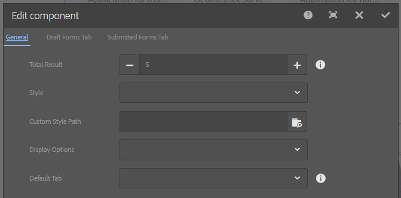

# Concepten en verzendingen{#drafts-and-submissions-component}

In de component Concepten en verzendingen worden alle formulieren weergegeven die zich in de conceptstatus bevinden en de formulieren die al zijn verzonden. De component heeft afzonderlijke secties (tabbladen) voor concepten en verzonden formulieren. De gebruikers kunnen alleen hun concepten en verzonden formulieren bekijken.

## De component configureren {#configuring-the-component}

De component Concepten en verzendingen heeft twee tabbladen: Concepten en verzendingen.

Als u het verzenden van een adaptief formulier wilt weergeven op het tabblad Verzending, stelt u de optie **Handeling verzenden** tot **[Forms Portal-verzendactie](../../forms/using/configuring-submit-actions.md). Alternatief,** Schakel de optie Forms Portal verzenden in. Telkens wanneer een gebruiker het formulier verzendt, wordt het formulier toegevoegd aan het tabblad Verzending.

De conceptfunctionaliteit is uit het vak ingeschakeld. Wanneer een gebruiker klikt **Opslaan** op een adaptief formulier wordt het formulier toegevoegd aan het tabblad Concepten.

Voer de volgende stappen uit om een component Concepten en verzendingen toe te voegen en te configureren:

1. Sleep de **Concepten en verzendingen** onder de categorie Document Services in de componentenbrowser op de pagina.
1. Selecteer de component en selecteer vervolgens  om het dialoogvenster Bewerken voor de component te openen.

   

1. Geef in het dialoogvenster Bewerken de volgende details op en selecteer **Gereed** om de instellingen op te slaan.

<table>
 <tbody>
  <tr>
   <th>Tab</th>
   <th>Configuratie</th>
   <th>Beschrijving</th>
  </tr>
  <tr>
   <td>Algemeen</td>
   <td>Totaal resultaat</td>
   <td>Hiermee geeft u het maximale aantal resultaten op dat moet worden weergegeven. Als de totale resultaatlimiet wordt verhoogd door het aantal resultaten, kan een <strong>Meer </strong>wordt onder aan de component weergegeven. Klikken <strong>Meer </strong>geeft alle formulieren weer. </td>
  </tr>
  <tr>
   <td> </td>
   <td>Stijltype</td>
   <td>Hiermee wordt de stijl van de component opgegeven. U kunt <strong>Geen stijl</strong>, <strong>Standaardstijl</strong>, of <strong>Aangepaste stijl</strong> voor het weergeven van de formulieren. Voor de optie Aangepaste stijl kunt u het pad van een aangepast CSS-bestand opgeven in het dialoogvenster <strong>Pad aangepaste stijl </strong>field<strong>.</strong></td>
  </tr>
  <tr>
   <td> </td>
   <td>Pad aangepaste stijl</td>
   <td>Als u <strong>Aangepaste stijl</strong> in de <strong>Stijltype</strong> veld gebruiken <strong>Pad aangepaste stijl</strong> veld om het pad van een aangepast CSS-bestand op te geven. </td>
  </tr>
  <tr>
   <td> </td>
   <td>Weergaveopties</td>
   <td>
Hiermee geeft u de tabbladen op die u wilt weergeven. U kunt ervoor kiezen om conceptformulieren, verzonden formulieren of beide weer te geven. 
 
<strong>Opmerking</strong>:<em> Voor <strong>Weergaveopties</strong>als u een andere optie dan <strong>Beide</strong>de <strong>Standaardtabblad</strong> veldoptie wordt niet gebruikt.</em>
 </td>
  </tr>
  <tr>
   <td> </td>
   <td>Standaardtabblad</td>
   <td>Hiermee geeft u het tabblad op dat moet worden weergegeven wanneer de pagina voor het portal Formulieren wordt geladen. U kunt kiezen tussen <strong>Concept Forms Tab</strong> en <strong>Verzonden Forms-tab</strong>.</td>
  </tr>
  <tr>
   <td>Concept configuratie Forms-tabblad</td>
   <td>Aangepaste titel</td>
   <td>Hiermee wordt de titel van de <strong>Concept Forms</strong> tab. De standaardwaarde is <strong>Concept Forms.</strong></td>
  </tr>
  <tr>
   <td> </td>
   <td>Lay-outsjabloon</td>
   <td>Hiermee geeft u de lay-out op die moet worden gebruikt voor de lijst Concept Forms.</td>
  </tr>
  <tr>
   <td>Ingediende Forms Tab-configuratie</td>
   <td>Aangepaste titel </td>
   <td>Hiermee wordt de titel van de <strong>Verzonden Forms </strong>tab. De standaardwaarde is <strong>Verzonden Forms.</strong></td>
  </tr>
  <tr>
   <td> </td>
   <td>Lay-outsjabloon</td>
   <td>Hiermee wordt de lay-out opgegeven die moet worden gebruikt voor Verzonden Forms<strong> </strong>lijst. </td>
  </tr>
 </tbody>
</table>

## De opslag aanpassen {#customizing-the-storage}

Wanneer u de verzendactie Forms Portal gebruikt of de optie voor het opslaan van gegevens in het formulierportaal in een adaptieve vorm inschakelt, worden de formuliergegevens opgeslagen in AEM opslagplaats. In een productieomgeving wordt aanbevolen geen concept- of verzonden formuliergegevens in AEM opslagplaats op te slaan. In plaats daarvan moet u de concepten en verzendingscomponent integreren met een beveiligde opslag, zoals een bedrijfsdatabase, om concepten en verzonden formuliergegevens op te slaan.

Met Forms Portal kunt u gegevens opslaan in een lokale AEM opslagplaats, een externe AEM opslagplaats of een database. Met AEM Forms kunt u de implementatie van het opslaan van gebruikersgegevens voor concepten en verzendingen aanpassen. U kunt standaardmethoden negeren om op te geven hoe concepten en verzendgegevens worden opgeslagen bij een door u gekozen opslaglocatie. U kunt de gegevens bijvoorbeeld opslaan in een gegevensopslagruimte die momenteel in uw organisatie is geïmplementeerd.

Forms Portal biedt vanuit de boxservices (API&#39;s) voor het opslaan van gegevens in de crx-opslagruimte van lokale en externe AEM Forms-publicatie-instanties. U kunt de standaardimplementaties vervangen, die worden beschreven in [Opslagservices configureren voor concepten en verzending](/help/forms/using/configuring-draft-submission-storage.md) artikel, met aangepaste implementaties ter vervanging van de standaardfunctionaliteit. Voor gedetailleerde informatie over de methodes die in een douaneimplementatie worden vereist om inhoud op een beveiligde plaats op te slaan, zie [Services voor ontwerp- en verzendgegevens aanpassen](/help/forms/using/custom-draft-submission-data-services.md) en [Aangepaste opslag voor concepten en verzendingscomponenten.](/help/forms/using/adding-custom-storage-provider-forms.md)

AEM Forms-documentatie biedt een [Voorbeeld voor het integreren van concepten en verzendingen in de database](integrate-draft-submission-database.md). Met de voorbeeldimplementatie kunt u uw eigen aangepaste implementatie ontwikkelen.

## Verwante artikelen

* [Formulierportonderdelen inschakelen](/help/forms/using/enabling-forms-portal-components.md)
* [Pagina Formulierportal maken](/help/forms/using/creating-form-portal-page.md)
* [Formulieren op een webpagina weergeven met API&#39;s](/help/forms/using/listing-forms-webpage-using-apis.md)
* [Concepten en verzendingscomponent gebruiken](/help/forms/using/draft-submission-component.md)
* [Opslag van concepten en verzonden formulieren aanpassen](/help/forms/using/draft-submission-component.md)
* [Voorbeeld voor het integreren van concepten en verzendingen in de database](/help/forms/using/integrate-draft-submission-database.md)
* [Sjablonen aanpassen voor componenten van een formulierportal](/help/forms/using/customizing-templates-forms-portal-components.md)
* [Inleiding tot het publiceren van formulieren op een portal](/help/forms/using/introduction-publishing-forms.md)
