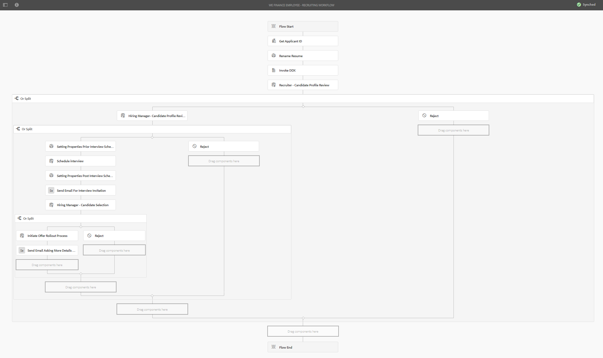
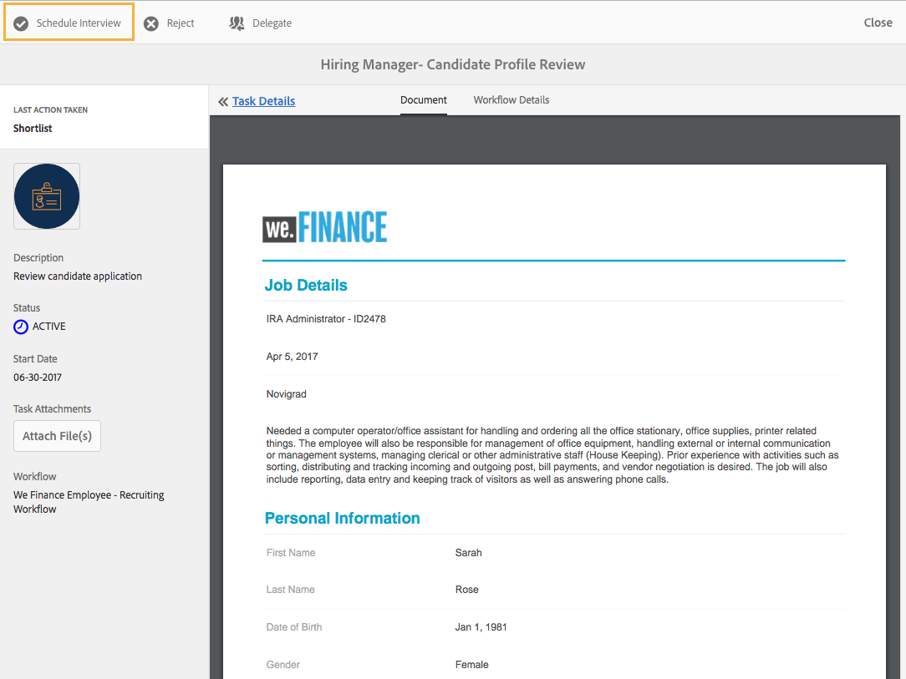
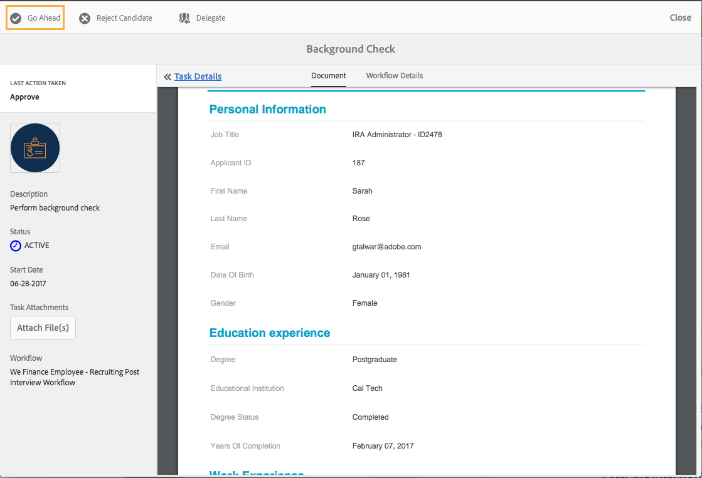

# Werknemersverwijzingssite doorloopt {#employee-recruitment-reference-site-walkthrough}

## Overzicht {#overview}

We.Finance is een organisatie die kandidaten in staat stelt om een aanvraag voor werk in te dienen via het portaal van de referentiesite. De organisatie gebruikt ook het portaal om het interviewing van kandidaten, kortere lijst, en interne mededeling te beheren. De site beheert het volgende:

* Kandidaten die werk zoeken en aanvragen
* Screening en verkorting van kandidaten
* Interviewproces
* Verzameling van kandidaatgegevens
* Kandidaatachtergrondcontrole
* Aanbiedingen aan geselecteerde kandidaten uitrollen

>[!NOTE]
>
>De de aanwervingsdossiers van werknemers zijn beschikbaar in zowel Wij.Finance als Wij.Gov verwijzingsplaatsen. De voorbeelden, de beelden, en de beschrijvingen die in de analyses worden gebruikt gebruiken Web.Finance verwijzingsplaats. U kunt deze gebruiksgevallen echter ook uitvoeren en artefacten controleren met Web.Gov. Hiervoor vervangt u **we-finance** door **we-gov** in de vermelde URL&#39;s.

### Werkstroommodellen {#workflow-models-involved}

De kwestie van het personeelswervingsgebruik omvat twee werkschema&#39;s:

* Voor het interview - We financieren de terugwinningsworkflow van werknemers
* Na het interview - We financieren werknemers die de Post Interview-workflow recruteren

Deze workflows worden gemaakt in AEM en zijn te vinden op:

`https://[authorHost]:[authorPort]/libs/cq/workflow/admin/console/content/models.html/etc/workflow/models/`

#### Wij financieren Werknemers die werkschema {#we-finance-employee-recruiting-workflow} terugwinnen

Het volgende is het model van de Werknemers van de Werknemers van Web die in dit document wordt gevolgd.

#### We financieren werknemers die de Post Interview-workflow opdoen {#we-finance-employee-recruiting-post-interview-workflow}

Het volgende is het model van het Web van de Werknemer van de Post van de Uitwisseling van de Financiën het Recruiting werkschema dat in dit document wordt gevolgd.

### Persoonlijk {#personas}

Het scenario omvat de volgende personen:

* Sarah Rose, kandidaat voor een baan bij de organisatie
* John Jacobs, rekruiter
* Gloria Rios, de huurder
* John Doe, de HR-persoon

## Sarah vraagt een baan {#sarah-applies-for-a-job} aan

Sarah Rose zoekt een baan in de organisatie. Ze bezoekt hun webportaal en verkent de vacatures die op de pagina Career staan vermeld. Ze vindt een overeenkomende functielijst en vraagt om deze.

We.Startpagina voor financiën

We.Pagina met carrière financieren

Sarah klikt op Toepassen op een baan posten. Het taaktoepassingsformulier wordt geopend. Zij vult alle details in de aanvraag in en dient deze in.

### Hoe werkt {#how-it-works}

De startpagina van We.Finance en de carrièrepagina zijn AEM Sites-pagina&#39;s. Op de pagina met carrièremogelijkheden wordt een adaptief formulier ingesloten, dat gebruikmaakt van een herhaalbaar deelvenster om vacatures op te halen met een service en deze op de pagina weer te geven. U kunt het aangepaste formulier bekijken op `https://[authorHost]:[authorPort]/editor.html/content/forms/af/we-finance/employee/recruitment/jobs.html`.

### Zie het zelf {#see-it-yourself}

Ga naar `https://[publishHost]:[publishPort]/content/we-finance/global/en.html` en klik **[!UICONTROL Career]**. Klik op **[!UICONTROL Search]** om de takenlijst te vullen en klik vervolgens op **[!UICONTROL Apply]** voor een taak. Vul het formulier in en verzend de aanvraag.

Zorg ervoor dat u een geldige e-mailid opgeeft in de toepassing omdat alle communicatie via deze analyse wordt verzonden naar de opgegeven e-mailid.

## John Jacobs verkiest het profiel van Sarah Rose voor de screening van de bedradingsmanager {#john-jacobs-shortlists-sarah-rose-s-profile-for-the-hiring-manager-s-screening}

De organisatie ontvangt de sollicitatie van Sarah. John Jacobs, een rekruteur, heeft de taak gekregen om Sarah&#39;s profiel te herzien. Hij evalueert de taak in zijn AEM Postvak In, zoekt het profiel dat overeenkomt met de vereiste taak en klikt op Snellijst. Sarah&#39;s profiel wordt doorgestuurd naar Gloria Rios, de huurmanager, voor haar goedkeuring.

John&#39;s AEM Inbox

John Jacobs verkiest het profiel van Sarah Rose voor de screening van de huurmanager

**Hoe werkt het**

De verzendactie in het formulier Taaktoepassing activeert een workflow die een taak maakt in het inbox van John Jacob voor het controleren van de toepassing. Als John de toepassing beoordeelt en verkort, wordt er een taak gemaakt in de huurmanager, Gloria&#39;s inbox.

### Zie het zelf {#see-it-yourself-1}

Ga naar `https://[publishHost]:[publishPort]/content/we-finance/global/en/login.html?resource=/aem/inbox.html`en login gebruikend jjacobs/password als gebruikersbenaming/wachtwoord voor John Jacobs. Open de Kandidaat-profielbeoordelingstaak en maak een shortlist met de aanvrager.

## Gloria herziet de aanvraag en keurt de aanvrager voor een interview goed {#gloria-reviews-the-application-and-approves-the-applicant-for-an-interview}

Gloria, de huurmanager, ontvangt het geshortlist profiel als taak in haar AEM Inbox. Ze bestudeert het en keurt de kandidaat, Sarah Rose, goed voor het interview.

Gloria&#39;s AEM inbox

Gloria keurt Sarah Rose goed voor een interview

**Hoe werkt het**

Als Gloria de kandidaat voor een interview goedkeurt, creëert de workflow een taak in het AEM Inbox van Jan Doe, die een rekruteur is voor We.Finance.

### Zie het zelf {#see-it-yourself-2}

Ga naar `https://[publishHost]:[publishPort]/content/we-finance/global/en/login.html?resource=/aem/inbox.html` en login gebruikend jjacobs/password als gebruikersbenaming/wachtwoord voor John Jacobs. Open de Kandidaat-profielbeoordelingstaak en maak een shortlist met de aanvrager.

Ga naar `https://[publishHost]:[publishPort]/content/we-finance/global/en/login.html?resource=/aem/inbox.html` en login die grios/wachtwoord als gebruikersbenaming/wachtwoord voor Gloria Rios gebruikt. Open de Kandidaat taak van het Overzicht van het Profiel en klik Interview van het Programma.

## John Doe plant een interview {#john-doe-schedules-an-interview}

John Doe krijgt de taak om een interview te plannen in zijn inbox. John Doe selecteert en opent de taak en bepaalt de interviewdatum, -tijd, -locatie en -persoon die verantwoordelijk is voor het interview als John Jacob. John Doe klikt op Uitnodiging-e-mail verzenden. Er wordt een e-mail verzonden naar Sarah en er wordt een taak toegewezen aan Gloria, de huurmanager, voor het interviewen van Sarah.

John Doe&#39;s AEM inbox

John Doe plant het interview en stuurt de details naar Sarah Rose

## Sarah Rose ontvangt een e-mail met een interviewschema {#sarah-rose-receives-the-email-with-interview-schedule}

Sarah Rose ontvangt de e-mail met interviewplanning, locatie en andere details. Ze klikt op Accepteren om aan te geven dat ze de interviewplanning en -locatie op orde heeft. Zoals de exacte informatie ons laat zien, maakt Sarah het aan de interviews.

Sarah Rose ontvangt het interviewschema

## Na de interviews verkort de Manager van de Bedrading Sarah Rose {#after-the-interviews-the-hiring-manager-shortlists-sarah-rose}

Nadat Sarah Rose door de interviews gaat en hen ontruimt, opent Gloria Rios, de Manager van de Verhuur, de Kandidaatselectietaak van haar inbox en klikt Uitgezocht. Het besluit van Gloria Rios wordt voor verdere verwerking doorgezonden naar de HR-persoon, John Doe.

Gloria&#39;s AEM inbox

Gloria Rios selecteert Sarah Rose na de interviews

## John Doe vraagt om meer informatie {#john-doe-requests-more-information}

Voordat een kandidaat wordt gevraagd om deel te nemen aan de organisatie, moet zijn achtergrond worden gecontroleerd. John Doe opent en bekijkt de details van de geselecteerde aanvrager en constateert dat sommige van haar gegevens over werkgelegenheid en onderwijs nog niet zijn ingevuld. John Doe klikt heeft Meer Informatie nodig.

 

John Doe vraagt om meer informatie van Sarah Rose over haar opleiding en werkervaring

## Sarah Rose ontvangt een e-mail met een verzoek om aanvullende informatie {#sarah-rose-receives-an-email-requesting-further-information}

Sarah Rose ontvangt een e-mail met de kennisgeving dat er meer informatie nodig is voor de behandeling van haar sollicitatie. Het e-mailbericht bevat een koppeling naar het formulier voor het invullen van de vereiste gegevens.

Sarah Rose ontvangt een e-mail met de kennisgeving dat er meer informatie nodig is voor de verwerking van haar sollicitatie.

Sarah klikt op de koppeling Details verstrekken in de e-mail. Er wordt een formulier weergegeven. Sarah vult de vereiste onderwijs- en werkgelegenheidsdetails op zoals gevraagd door Jan Smit en klikt op Indienen.

Sarah opent het formulier met aanvullende informatie door op de koppeling in de e-mail te klikken

Sarah vult aanvullende informatie in zoals gevraagd door Jan Smit en klikt op Verzenden

## John Doe evalueert het geselecteerde kandidaatprofiel voor de extra informatie die {#john-doe-reviews-the-selected-candidate-profile-for-the-additional-information-provided} wordt verstrekt

John Doe selecteert het verzoek van de kandidaat-beoordeling en opent het. John Doe vindt dat Sarah alle benodigde informatie heeft ingevuld. Nadat u de toepassing hebt gecontroleerd, klikt u op Goedkeuren. Na goedkeuring door John Doe wordt het verzoek om een achtergrondcontrole op Sarah Rose uit te voeren doorgestuurd naar John Jacobs.

John Doe&#39;s AEM Inbox

John Doe bestudeert de aanvullende informatie die Sarah heeft verstrekt en keurt deze goed

## John Jacobs ontvangt een verzoek van de achtergrondcontrole {#john-jacobs-receives-a-background-check-request}

John Jacobs ziet het verzoek van de achtergrondcontrole in zijn inbox. John Jacobs opent de taak en bekijkt de informatie van Sarah Rose. Nadat John Jacobs een achtergrondcontrole heeft uitgevoerd, klikt u op Vooruit om aan te geven dat de achtergrondcontrole is gelukt.

John Jacobs AEM inbox

Als John Jacobs de achtergrondcontrole heeft uitgevoerd, klikt u op Vooruit

## John Doe stuurt de gezamenlijke brief naar Sarah Rose {#john-doe-sends-out-the-joining-letter-to-sarah-rose}

John Doe ontvangt een verzoek in zijn AEM inbox voor het verzenden van de aansluitende brief. John opent het verzoek en bekijkt de details. John Doe voegt de bij elkaar behorende brief PDF toe en klikt dan Bijvoegen &amp; verzenden het Verbinden Letter.

John Doe&#39;s AEM inbox

John Doe verzendt de gezamenlijke brief voor ondertekening

## Sarah Rose ontvangt en ondertekent de aansluitende letter {#sarah-rose-receives-and-signs-the-joining-letter}

Sarah Rose ontvangt de aansluitende brief voor ondertekening. Sarah klikt hier om een brief te bekijken en te ondertekenen. De PDF met de gecombineerde brief wordt geopend met een veld om het document te ondertekenen.

Sarah Rose ontvangt de aansluitende brief voor ondertekening

Sarah kan kiezen of ze wil intypen, tekenen om te schrijven, een afbeelding van een handtekening in te voegen of het touchscreen van haar mobiele telefoon gebruiken om haar handtekening te tekenen. Sarah typt haar naam, klikt op Klik om te ondertekenen en downloadt de ondertekende kopie van de bij elkaar gevoegde brief.

Sarah typt in haar naam de aansluitende brief te ondertekenen

Sarah klikt op Ondertekenen om de ondertekening van de aansluitende brief te voltooien

