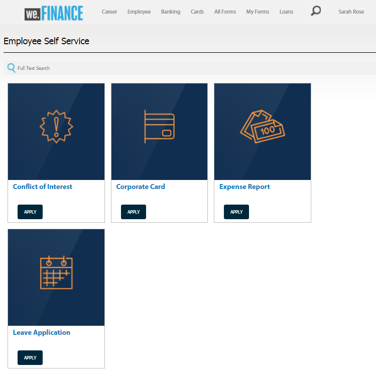
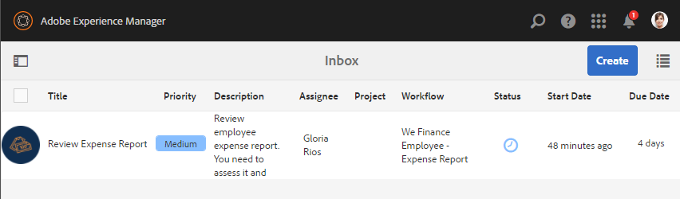

# Werknemerslijst voor zelfbedieningsverwijzingssite{#employee-self-service-reference-site-walkthrough}

## Vereiste {#prerequisite}

Stel de referentiesites in zoals beschreven in [Stel AEM Forms referentiesites](../../forms/using/setup-reference-sites.md)in en configureer deze.

## Overzicht {#overview}

De zelfdienstsystemen van de werknemer, over het algemeen ontvangen op het Intranet van het bedrijf, geven werknemers toegang tot een gastheer van informatie en de diensten die zij van hun bureaus kunnen genieten. Het geeft de werknemers de bevoegdheid en volledige controle om acties uit te voeren zoals toegang tot hun werkgelegenheidsdetails, het aanvragen van verlof, en het voorleggen van uitgavenverslagen. Anderzijds helpt het organisaties de efficiëntie van processen te verbeteren en de kosten te verlagen, terwijl werknemers op de hoogte worden gehouden en betrokken worden.

De zelfbedienings verwijzingsplaats van de werknemer toont hoe u hefboomwerking AEM Vormen kunt om werknemerszelf-dienstsysteem in uw organisatie uit te voeren.

>[!NOTE]
>
>De voorbeelden, de beelden, en de beschrijvingen die in de de zelfdienstanalyse van de Werknemer worden gebruikt gebruiken de Web.Finance verwijzingsplaats.

## Vragenlijst met belangenconflicten {#conflict-of-interest-questionnaire-walkthrough}

Organisaties vragen hun werknemers van tijd tot tijd om een vragenlijst over belangenconflicten in te dienen en identificeren externe activiteiten of persoonlijke relaties van hun werknemers die mogelijk in strijd zijn met hun organisatie.

De afdeling Naleving van Sarah&#39;s organisatie heeft werknemers gevraagd de vragenlijst over belangenconflicten in te dienen.

### Sarah legt de vragenlijst over belangenconflicten voor {#sarah-submits-the-conflict-of-interest-questionnaire}

Sarah gaat naar het portaal van haar organisatie, logt binnen, en klikt Werknemer om tot het werknemersdashboard toegang te hebben. Ze vindt een vragenlijst over belangenconflicten op het dashboard voor werknemers en klikt op **[!UICONTROL Toepassen]**.

Organisatieportaal

Werknemersdashboard

Sarah navigeert het formulier met de knop Volgende en leest door de secties Introductie en Definitie. Ze beantwoordt de vragen in de sectie Vragen. Tot slot ondertekent zij de vragenlijst en legt zij deze voor.

Het organisatieportaal en de vragenlijst zijn responsief en mobiel. In de volgende workflow ziet u hoe Sarah door de vragenlijst navigeert en deze verzendt op haar mobiele apparaat.

**Hoe werkt het**

De organisatieportal en het werknemersdashboard zijn pagina&#39;s van AEM-sites. Het dashboard bevat verschillende opties voor zelfbediening, zoals de vragenlijst voor belangenconflicten. De knop Toepassen is gekoppeld aan een adaptief formulier.

Het aangepaste formulier gebruikt regels voor het weergeven en verbergen van informatie op basis van het antwoord op het tabblad Vragen. Bovendien gebruikt het formulier de component Krabbelen voor ondertekening op het tabblad Declaratie. Controleer het adaptieve formulier op `https://[authorHost]:[authorPort]/editor.html/content/forms/af/we-finance/employee/self-service/conflict-of-interest.html`.

**Zie het zelf**

Ga naar `https://[publishHost]:[publishPort]/content/we-finance/global/en/self-service-forms.html` en meld u aan met `srose/srose` als gebruikersnaam/wachtwoord voor Sarah. Klik op **[!UICONTROL Werknemer]** om het dashboard te openen en klik vervolgens op **[!UICONTROL Toepassen]** op vragenlijst over belangenconflicten. Onderzoek de vragenlijst en dien deze in.

#### Gloria toetst en keurt de vragenlijst over belangenconflicten goed {#gloria-reviews-and-approves-the-conflict-of-interest-questionnaire-submission}

De vragenlijst over belangenconflicten die Sarah heeft ingediend, wordt ter beoordeling aan Gloria Rios toegewezen. Gloria werkt als nalevingsfunctionaris in de organisatie. Gloria meldt zich aan bij haar AEM Inbox en bekijkt de taken die aan haar zijn toegewezen. Zij keurt de vragenlijst van Sarah goed en voltooit de taak.

Gloria&#39;s inbox

Taak openen

**Hoe werkt het**

De verzendactie in de vragenlijst &quot;Conflict of Interest&quot; leidt tot een workflow die een taak in het postvak van Gloria voor goedkeuring creëert. Controleer de Forms Workflow op `https://[authorHost]:[authorPort]/editor.html/conf/global/settings/workflow/models/we-finance/employee/self-service/we-finance-employee-conflict-of-interest.html`

**Zie het zelf**

Ga naar `https://[publishHost]:[publishPort]/content/we-finance/global/en/login.html?resource=/aem/inbox.html` en meld u aan met `grios/password` als gebruikersnaam/wachtwoord voor Gloria Rios. Open de voor de vragenlijst voor belangenconflicten gecreëerde taak en keur deze goed.

## Analyse van bedrijfskaarttoepassing {#corporate-card-application-walkthrough}

Sarah reist veel voor zaken en heeft een bedrijfskrediet nodig om onderweg haar rekeningen te betalen. Ze vraagt een visitekaartje via het werknemersportaal van haar organisatie.

### Sarah dient de aanvraag voor de visitekaartje in {#sarah-submits-the-corporate-card-application}

Sarah gaat naar het portaal van haar organisatie, logt binnen, en klikt **[!UICONTROL Werknemer]** om tot het werknemersdashboard toegang te hebben. Ze vindt de toepassing Corporate Card op het dashboard voor werknemers en klikt op **[!UICONTROL Toepassen]**.

Organisatieportaal

Werknemersdashboard

Ze klikt op **[!UICONTROL Toepassen]** op de bedrijfskaart-toepassing. Er wordt een toepassing van één pagina geopend. Ze vult alle details en klikt op **[!UICONTROL Toepassen]** om de toepassing te verzenden.

**Hoe werkt het**

De organisatieportal en het werknemersdashboard zijn pagina&#39;s van AEM-sites. Het dashboard bevat een lijst met verschillende opties voor zelfbediening, zoals de toepassing voor de bedrijfskaart. De knop Toepassen op de toepassing is gekoppeld aan een adaptief formulier.

Het adaptieve formulier voor bedrijfskaarttoepassingen is een eenvoudig, responsief adaptief formulier van één pagina. Hierbij worden standaard adaptieve formuliercomponenten gebruikt, zoals tekst, telefoon, numeriek vak en numerieke stapfunctie. Herzie het adaptieve formulier op:\
`https://[authorHost]:[authorPort]/editor.html/content/forms/af/we-finance/employee/self-service/corporate-card.html`.

**Zie het zelf**

Ga naar `https://[publishHost]:[publishPort]/content/we-finance/global/en/self-service-forms.html` en meld u aan met `srose/srose` als gebruikersnaam/wachtwoord voor Sarah. Klik op **[!UICONTROL Werknemer]** om het dashboard te openen en klik vervolgens op **[!UICONTROL Toepassen]** op bedrijfskaart. Vul de gegevens in en verzend de aanvraag.

### Gloria beoordeelt en keurt de aanvraag voor een visitekaartje goed {#gloria-reviews-and-approves-the-corporate-card-application}

De door Sarah ingediende aanvraag voor een bedrijfskaart wordt ter beoordeling aan Gloria Rios toegewezen. Gloria meldt zich aan bij haar AEM Inbox en bekijkt de taken die aan haar zijn toegewezen. Zij keurt de aanvraag van Sarah goed en voltooit de taak.

Gloria&#39;s inbox

Taak openen

**Hoe werkt het**

De verzendworkflow in de toepassing Corporate Card activeert een Forms-workflow die een taak maakt in het postvak van Gloria voor goedkeuring. Controleer de Forms Workflow op `https://[authorHost]:[authorPort]/editor.html/conf/global/settings/workflow/models/we-finance/employee/self-service/we-finance-employee-corporate-card.html`

**Zie het zelf**

Ga naar `https://[publishHost]:[publishPort]/content/we-finance/global/en/login.html?resource=/aem/inbox.html` en meld u aan met `grios/password` als gebruikersnaam/wachtwoord voor Gloria Rios. Open de taak die voor de toepassing Bedrijfs van de Kaart wordt gecreeerd en keur het goed.

## Analyse van de rapportindiening van uitgaven {#expense-report-submission-walkthrough}

Aangezien Sarah tijdens bedrijfsreizen doorbrengt, moet zij uitgavenrapporten ter goedkeuring voorleggen. De optie voor zelfbediening in haar organisatie stelt haar in staat het onkostenrapport online in te dienen.

### Sarah dient het verzoek van het Rapport van de Uitgaven in {#sarah-submits-the-expense-report-application}

Sarah gaat naar het portaal van haar organisatie, logt binnen, en klikt **[!UICONTROL Werknemer]** om tot het werknemersdashboard toegang te hebben. Zij vindt de toepassing van het Rapport van de Uitgaven op het werknemersdashboard en klikt **[!UICONTROL Toepassen]**.

Organisatieportaal

Werknemersdashboard

Ze klikt op **[!UICONTROL Toepassen]** op de toepassing Onkostenrapport. Er wordt een toepassingsformulier geopend met twee tabbladen - Rapportnaam en Rapportdetails. Met het pictogram **+** op het tabblad Rapportdetails kunt u meer dan uitgaven toevoegen aan één rapport.

Het organisatieportaal en de toepassingen zijn ontvankelijk en mobiel-vriendelijk. In de volgende workflow ziet u hoe Sarah door het onkostenrapport op haar mobiele apparaat navigeert en het verzendt.

**Hoe werkt het**

De organisatieportal en het werknemersdashboard zijn pagina&#39;s van AEM-sites. Het dashboard maakt een lijst van verscheidene zelfbedieningsopties zoals de toepassing van het Rapport van de Uitgaven. De knop Toepassen is gekoppeld aan een adaptief formulier.

De tabbladen Rapportnaam en Rapportdetails in het aangepaste formulier zijn deelvenstercomponenten. Het deelvenster Rapportdetails bevat het deelvenster Kosten. Het is een herhaalbaar paneel dat toestaat toevoegend veelvoudige uitgaven in het rapport. Bekijk het adaptieve formulier en de configuraties ervan op `https://[authorHost]:[authorPort]/editor.html/content/forms/af/we-finance/employee/expense-report.html`.

**Zie het zelf**

Ga naar `https://[publishHost]:[publishPort]/content/we-finance/global/en/self-service-forms.html` en meld u aan met `srose/srose` als gebruikersnaam/wachtwoord voor Sarah. Klik op **[!UICONTROL Werknemer]** om het dashboard te openen en klik vervolgens op **[!UICONTROL Toepassen]** bij toepassing kostendapport. Vul de gegevens in en verzend de aanvraag.

### Gloria beoordeelt en keurt het uitgavenverslag goed {#gloria-reviews-and-approves-the-expense-report}

Het door Sarah ingediende onkostenverslag wordt ter controle aan Gloria Rios toegewezen. Gloria meldt zich aan bij haar AEM Inbox en bekijkt de taken die aan haar zijn toegewezen. Zij keurt de aanvraag van Sarah goed en voltooit de taak.

Gloria&#39;s inbox

Taak openen

**Hoe werkt het**

De verzendworkflow in de toepassing Rapport kosten leidt tot een Forms-workflow die een taak maakt in Gloria&#39;s inbox voor goedkeuring. Controleer de Forms Workflow op `https://[authorHost]:[authorPort]/editor.html/conf/global/settings/workflow/models/we-finance/employee/self-service/we-finance-employee-expense-report-workflow.html`

**Zie het zelf**

Ga naar `https://[publishHost]:[publishPort]/content/we-finance/global/en/login.html?resource=/aem/inbox.html` en meld u aan met `grios/password` als gebruikersnaam/wachtwoord voor Gloria Rios. Open de taak die voor de toepassing van het Rapport van de Uitgaven wordt gecreeerd en keur het goed.

## Toepassingsdoorloop verlaten {#leave-application-walkthrough}

Sarah is van plan volgende maand een gezinsvakantie te maken en wil een week verlof aanvragen.

### Sarah dient het verlofverzoek in {#sarah-submits-the-leave-application}

Sarah gaat naar het portaal van haar organisatie, logt binnen, en klikt **[!UICONTROL Werknemer]** om tot het werknemersdashboard toegang te hebben. Zij vindt verlaten toepassing op het werknemersdashboard en klikt **[!UICONTROL Toepassen]**.

Organisatieportaal

Werknemersdashboard

De verloftoepassing wordt geopend met de naam van Sarah en de werknemer ID vooraf ingevuld in het formulier. Het toont ook haar verlofbalans en geschiedenis. Zij vult de verlofgegevens in en dient de aanvraag tot goedkeuring in.

Het organisatieportaal en de toepassingen zijn ontvankelijk en mobiel-vriendelijk. In de volgende workflow ziet u hoe Sarah door de toepassing navigeert en deze verzendt op haar mobiele apparaat.

**Hoe werkt het**

De organisatieportal en het werknemersdashboard zijn pagina&#39;s van AEM-sites. Het dashboard bevat een lijst met verschillende zelfbedieningsopties, zoals de toepassing Verlaten. De knop Toepassen is gekoppeld aan een adaptief formulier.

Het adaptieve formulier voor de verloftoepassing is gebaseerd op het model Formuliergegevens door werknemer. In de sectie Balans verlaten wordt de tabel Balans gevuld met behulp van de service `getLeavesOf` Formuliergegevensmodel. In de datumvelden Begin en Einde worden regels gebruikt om te controleren of de datumwaarden gelijk zijn of na de huidige datum. De duur van het verlof wordt berekend gebruikend de `calcBusinessDays` functie.

U kunt het adaptieve formulier en het formuliergegevensmodel op de volgende locaties bekijken:

`https://[authorHost]:[authorPort]/editor.html/content/forms/af/we-finance/employee/self-service/leave-application.html`

`https://[authorHost]:[authorPort]/aem/fdm/editor.html/content/dam/formsanddocuments-fdm/db`

**Zie het zelf**

Ga naar `https://[publishHost]:[publishPort]/content/we-finance/global/en/self-service-forms.html` en meld u aan met `srose/srose` als gebruikersnaam/wachtwoord voor Sarah. Klik op **[!UICONTROL Werknemer]** om het dashboard te openen en klik vervolgens op **[!UICONTROL Toepassen]** bij Verlaten. Vul de gegevens in en verzend de aanvraag.

#### Gloria herziet en keurt de aanvraag om verlof goed {#gloria-reviews-and-approves-the-leave-application}

Het door Sarah ingediende verzoek om verlof wordt ter beoordeling aan Gloria Rios toegewezen. Gloria meldt zich aan bij haar AEM Inbox en bekijkt de taken die aan haar zijn toegewezen. Zij keurt de aanvraag van Sarah goed en voltooit de taak.

Gloria&#39;s inbox

Taak openen

**Hoe werkt het**

De verzendworkflow in de Verlaten activeert een Forms-workflow die een taak maakt in Gloria&#39;s postvak voor goedkeuring. Controleer de Forms Workflow op `https://[authorHost]:[authorPort]/editor.html/conf/global/settings/workflow/models/we-finance/employee/self-service/we-finance-employee-leave-application.html`

**Zie het zelf**

Ga naar `https://[publishHost]:[publishPort]/content/we-finance/global/en/login.html?resource=/aem/inbox.html` en meld u aan met `grios/password` als gebruikersnaam/wachtwoord voor Gloria Rios. Open de taak die u voor de verloftoepassing hebt gemaakt en keur deze goed.
