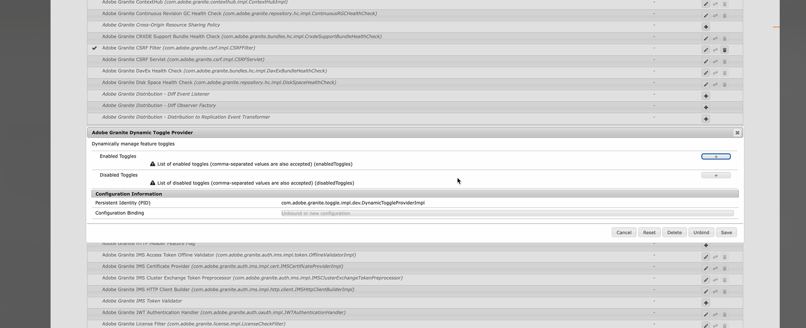

# Functie in Adobe Experience Manager (AEM) 6.5{#enable-feature-toggle-aem-forms-65}

In AEM is de functie In-/uitschakelen een functionaliteit waarmee beheerders bepaalde functies dynamisch kunnen in- of uitschakelen. Dit vermogen is met name nuttig om **Vroege eigenschappen van de Ontvanger** en **eigenschappen van de pre-uitgave** te beheren zonder belangrijke plaatsingen of veranderingen in codebase te vereisen. Het zorgt voor flexibiliteit en controle over welke functies in een AEM-omgeving toegankelijk zijn.

## Waarom de Toggles van de Eigenschap van het Gebruik in AEM 6.5 Opstelling?

Als u werkt in een AEM 6.5-configuratie, kunt u met de functie schakelen naar:

* Het testen van experimentele functies veilig.

* Nieuwe onderdelen in fasen implementeren.

* Eén codebase behouden in meerdere omgevingen.

* Risico&#39;s verminderen tijdens implementaties en upgrades.

## Overwegingen

Vanaf AEM 6.5 SP23, te hoeven u niet om de bundel [ com.adobe.granite.toggle.impl.dev ](http://com.adobe.granite.toggle.impl.dev/) te installeren aangezien het reeds met de toe:voegen-aan Forms geïnstalleerd is.

## Vereisten

Controleer het volgende voordat u functieschakelingen inschakelt in de AEM 6.5-installatie:

* Gebruiker is lid van de `forms-users` -groep.

* Navigeer naar `http://<author-instance-url>:portnumber/system/console/bundles` en controleer of **(com.adobe.granite.toggle.impl.dev-1.1.8.jar)** bundel aanwezig is of niet. Voor het geval dat het niet aanwezig [ is download de bundel van de verbinding ](https://experience.adobe.com/#/downloads/content/software-distribution/en/aem.html?package=%2Fcontent%2Fsoftware-distribution%2Fen%2Fdetails.html%2Fcontent%2Fdam%2Faem%2Fpublic%2Fadobe%2Fpackages%2Fcq650%2Fhotfix%2Fcom.adobe.granite.toggle.impl.dev-1.1.8.jar).

## Functie in-/uitschakelen {#enable-feature-toggle-65}

De Toggles van de eigenschap voor vroege adopters of nieuwe eigenschappen kunnen door de **Console van het Web van AEM** worden gevormd door de hieronder stappen te volgen:

1. Meld u aan bij uw AEM Forms-exemplaar.
2. Navigeer naar `http://<author-instance-url>:portnumber/system/console/configMgr` .
3. Onderzoek naar **de Dynamische Leverancier van de Knevel van Adobe Granite** in de Manager van de Configuratie.
4. Klik het pictogram .
5. In de [!UICONTROL Enabled Toggles] sectie, klik .
6. Voeg de functie-schakelings-id toe voor de functie, zoals in de onderstaande afbeelding wordt getoond.
    toe

   >[!NOTE]
   >
   >U kunt de functie-schakelfunctie vinden in de id in het document die specifiek is voor de functie voor vroege adoptie.

7. Klik op Opslaan.

## Functie in-/uitschakelen {#disable-feature-toggle-65}

Voer de onderstaande stappen uit om de functieschakeloptie(s) uit te schakelen voor functies waarvan de schakeloptie(s) is ingeschakeld:

1. Meld u aan bij uw AEM Forms-exemplaar.
2. Navigeer naar `http://<author-instance-url>:portnumber/system/console/configMgr` .
3. Onderzoek naar **de Dynamische Leverancier van de Knevel van Adobe Granite** in de Manager van de Configuratie.
4. Klik het pictogram .
5. In de [!UICONTROL Disabled Toggles] sectie, klik .
6. Voeg het wisselnummer toe voor de functie die moet worden uitgeschakeld.
   
7. Klik op Opslaan.

## Technische overweging

Functietogboeken zijn specifiek voor de omgeving en worden tijdens runtime beheerd. De server hoeft dus niet opnieuw te worden opgestart. Het is echter mogelijk dat voor bepaalde functies de relevante pagina&#39;s moeten worden vernieuwd of dat de cache moet worden gewist om wijzigingen te weerspiegelen.
Via `http://<author-instance-url>:4502/etc.clientlibs/toggles.json` hebt u toegang tot de lijst met functies die zijn ingeschakeld via de functie voor uw omgeving.
