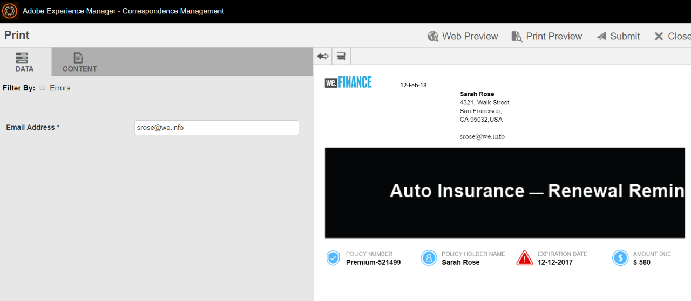

# We.Doorloop van de referentiewebsite voor Verzekering van financiële automatische vernieuwing{#we-finance-auto-insurance-renewal-reference-site-walkthrough}

## We.Finance Reference Site-scenario  {#we-finance-reference-site-scenario}

Wij.Finance-site is een site voor financiële services die u helpt interactieve communicatiemogelijkheden van AEM Forms te leren kennen.

Lees op gedetailleerde analyse van Wij.De Auto van de Verzekering van de Financiën gebruikscase die toont hoe AEM vormen en zijn integratie met de Dynamica van Microsoft klantenervaring in een financieel de dienstbedrijf verpersoonlijken. De interactieve analyse wordt ontworpen om implementatie van complexe digitale transacties en klantenmededeling in een financieel bedrijf te vergemakkelijken.

**De rit begint met de gebruikscase:**

Sarah Rose is een bestaande We.Finance-klant en heeft een autoverzekeringspolis gekocht. Het is nu de tijd van het jaar voor de verlenging van haar verzekeringspolis. Gloria Rios, verzekeringsagent, We.Finance stuurt een herinnering aan Sarah over haar beleidsvernieuwing. Sarah volgt de instructies in de e-mail en voltooit het proces.

## Doorloop van toepassing voor automatische verzekering {#auto-insurance-application-walkthrough}

Het Auto-Verzekeringstoepassingsscenario van Web.Finance is een visuele gesproken tekst voor de gebruiker en is gebaseerd op twee personen:

* Sarah Rose, een klant van We.Finance
* Gloria Rios, Verzekeringsagent, We.Finance

### Gloria stuurt een mededeling over de verlenging van het verzekeringsbeleid van We.Finance {#gloria-sends-an-insurance-policy-renewal-communication-from-we-finance}

Gloria logt in AEM instantie, klikt **Auto Verzekering Verlengt,** en klikt dan **Open Agent UI.** Klik vooraf vult het verzekeringsdocument met beleidsdetails van Sarah Rose. Gloria klikt **op Verzenden** en er wordt een bericht weergegeven op het scherm &quot;Verzending geïnitieerd&quot; en vervolgens in enkele seconden &quot;Verzenden met succes&quot;.

Sarah ontvangt een e-mail met het onderwerp &quot;Uw automatische Verzekering Verlenging&quot;.

#### Zie het zelf {#see-it-yourself}

Ga naar **Adobe Experience Manager** > **Forms** > **Forms &amp; Documents** > **We.Finance** > **Automatische verzekering**. Selecteer de Auto Verzekering Verlenging **interactieve mededeling** en klik **Open Agent UI**. De interactieve mededeling opent omhoog in de Agent UI. Voer een geldig e-mailadres in om de e-mail te ontvangen met het bijgevoegde beleidsdocument en klik op Verzenden.

U hebt rechtstreeks vanuit `https://[authorHost]: authorPort]/aem/formdetails.html/content/dam/formsanddocuments/we-finance/autoinsurance/auto-insurance-renewal.`

### Sarah ontvangt een mededeling over de verlenging van verzekeringsovereenkomsten van We.Finance en besluit te verlengen {#sarah-receives-an-insurance-policy-renewal-communication-from-we-finance-and-decides-to-renew}

Sarah ontvangt een e-mail met een bijlage van We.Finance die haar eraan herinnert dat haar Autoverzekeringspolis op het punt staat te verlopen. De bijlage is de afdrukversie van haar brief voor automatische verzekering.

Sarah klikt op **Nu** verlengen en wordt verwezen naar de webversie van haar brief over automatische verzekering. Naast deze brief vindt Sarah nog een aantal dagen dat haar beleid moet verlopen. De pagina biedt Sarah een basisoverzicht van haar verzekeringsbeleidsdetails zoals het aantal van het Beleid, het Gelverschuldigd Bedrag, en andere informatie zoals kortingsaanbiedingen en loyaliteitsbeloningen. Sarah klikt opnieuw op **Nu** vernieuwen onder aan het beleid.

#### Hoe werkt het {#how-it-works}

Het Web en de drukoutput van uw brief van de Verzekering van de Auto worden gecreeerd gebruikend de multikanaalsmogelijkheden van Interactieve Mededelingen.

De knop Nu vernieuwen in de e-mail is gekoppeld aan de toepassing voor automatisch vernieuwen van verzekering. Dit is een interactieve communicatie over een publicatie-instantie.

#### Zie het zelf {#see-it-yourself-1}

U moet een e-mail met een bijgevoegde PDF hebben ontvangen. Het PDF-bestand is een afdrukversie van uw brief voor automatische verzekering. Klik op Nu **vernieuwen** om de webversie van het beleid te openen. Controleer uw persoonlijke informatie en beleidsdetails en klik nu **Verlengen** die u aan een andere Interactieve Mededeling neemt.

Met de knop **Nu** vernieuwen in de e-mail stuurt u Sarah naar de webversie van het beleid. U kunt de volgende URL bezoeken:

`https://[authorServer]:[authorPort]/content/document.html?schema=fdm&documentId=/content/forms/af/we-finance/autoinsurance/auto-insurance-renewal/channels/web.html&customerId=1`

U kunt de gedetailleerde samenvatting van de functie voor automatische verlenging van verzekering controleren en onder aan de pagina op **Nu** vernieuwen klikken.

### Sarah bereikt de betalingspagina {#sarah-reaches-the-payment-page}

We. Finance brengt Sarah naar de betalingspagina. Sarah controleert haar Aantal van het Beleid en Datum van Vervalsing met haar verslagen opnieuw. Aan de rechterkant van de pagina controleert ze het betalingsoverzicht van haar verlenging met een premiekorting van 10% op het totale bedrag.

#### Hoe werkt het {#how-it-works-1}

Met de knop Nu vernieuwen wordt Sarah naar de betalingspagina geleid. De betalingspagina is een adaptief formulier.

#### Zie het zelf {#see-it-yourself-2}

Klik op Nu **vernieuwen** om naar de betalingspagina te gaan. Vul je creditcardgegevens in en klik op **Betalen**.

U kunt de betalingspagina bereiken in de ontwerpinstantie op

`https://[authorServer]:[authorPort]/content/document.html?documentId=/content/forms/af/we-finance/credit-card/ccbillpayment.html&schema=fdm&customerId=1`

### Sarah doet de betaling en voltooit het proces {#sarah-makes-the-payment-and-completes-the-process}

Sarah vult haar creditcardgegevens in en klikt op **Betaling** maken.

#### Hoe werkt het {#how-it-works-2}

Als Sarah de creditcardgegevens invult en op Indienen klikt, wordt de betaling van haar creditcard verwerkt en verschijnt een bedankbericht dat in het adaptieve formulier is geconfigureerd, op het scherm.

#### Zie het zelf {#see-it-yourself-3}

Je kunt het bevestigingsbericht bekijken nadat je op Betaling maken hebt geklikt op

`https://[authorServer]:[authorPort]/content/forms/af/we-finance/credit-card/ccbillpayment/jcr:content/guideContainer.guideThankYouPage.html?owner=admin&status=Submitted`
