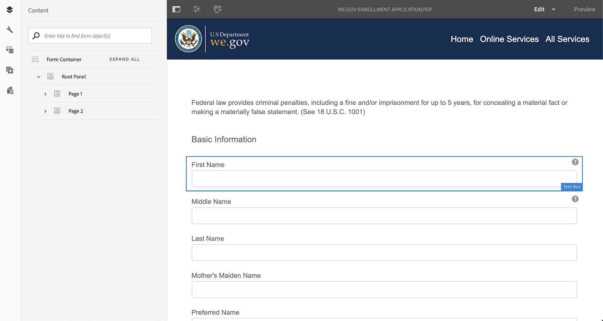
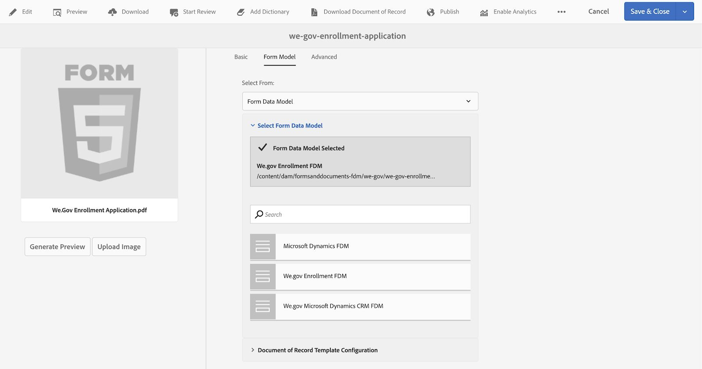
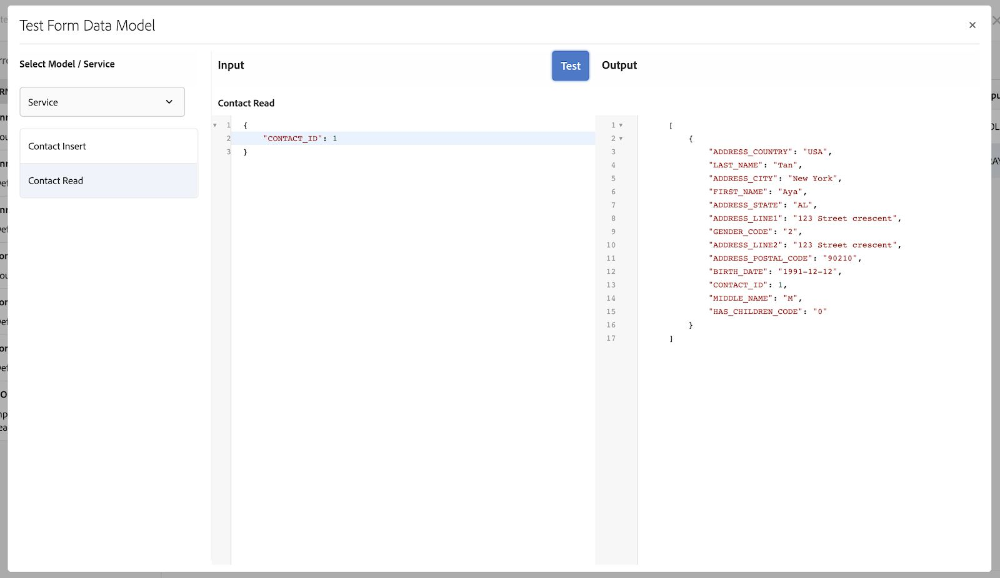

# We.Gov en We.Finance {#we-gov-reference-site-walkthrough}

## Voorwaarden {#pre-requisites}

De referentiesite instellen zoals beschreven in [De referentiesite Web.Gov en Web.Finance instellen en configureren](../../forms/using/forms-install-configure-gov-reference-site.md).

## Gebruikersartikel {#user-story}

* AEM Forms

   * Automatede form conversion
   * Authoring
   * Formuliergegevensmodellen/gegevensbronnen

* AEM Forms

   * Gegevens vastleggen
   * (Optioneel) Gegevensintegratie (MS® Dynamics)
   * (Optioneel) Adobe Sign

* Workflow
* E-mailmeldingen
* (Optioneel) Communicatie door klanten

   * Afdrukkanaal
   * Webkanaal

* Adobe Analytics
* Integratie van gegevensbron

### Mogelijke gebruikers en groepen {#fictitious-users-and-groups}

Het Wij.Gov-demopakket wordt geleverd met de volgende ingebouwde fictieve gebruikers:

* **Aya Tan** Betreft: Burgers die in aanmerking komen voor een dienst van een overheidsinstantie


* **George Lang**: We.Gov-bureau Business Analyst


* **Camila Santos**: Wij.Gov Agency CX Lead


De volgende groepen zijn eveneens opgenomen:

* **We.Gov Forms-gebruikers**

   * George Lang
   * Camila Santos (lid)

* **Wij.Gov-gebruikers**

   * George Lang
   * Camila Santos (lid)
   * Aya Tan (lid)

### Demo-overzicht: legenda {#demo-overview-terms-legend}

1. **Imiteren**: Gedefinieerde gebruikers en groepen in AEM demo.
1. **Knop**: De gekleurde rechthoek of de omcirkelde pijl voor het navigeren.
1. **Klikken**: Een handeling uitvoeren in het gebruikersartikel.
1. **Koppelingen**: Bovenaan in het hoofdmenu op de website We.Gov.
1. **Gebruikersinstructies**: Een reeks numerieke stappen die moet worden uitgevoerd wanneer de gebruiker door het artikel navigeert.
1. **Forms Portal**: *https://&lt;aemserver>:&lt;port>/content/we-gov/formsportal.html*
1. **Mobiele weergave**:Wij.Gov-gebruikers kunnen een mobiele weergave repliceren met een browser waarvan de grootte is gewijzigd.
1. **Bureaubladweergave**: We.gov.
1. **Pre-screener-formulier**: Formulier op de startpagina van de website Web.Gov.
1. **Adaptief formulier**: Inschrijvingsaanvraagformulier voor We.gov demo.

   *https://&lt;aemserver>:&lt;port>/content/forms/af/adobe-gov-forms/enrollment-application-for-health-benefits.html*

1. **Web-site Adobe**: *https://&lt;aemserver>:&lt;port>/content/we-gov/home.html*
1. **Adobe in vak**: Located top menu bar [Bell-pictogram](assets/bell.svg) AEM achterkant.

   *https://&lt;aemserver>:&lt;port>/aem/start.html*

1. **E-mailclient**: Voorkeursmanier om uw e-mails weer te geven (Gmail, Outlook)
1. **CTA**: Oproep tot actie
1. **Navigeren**: Een specifiek referentiepunt zoeken op de browserpagina.
1. **AFC**: AUTOMATEDE FORM CONVERSION

## Automatede form conversion (Camila) {#automated-forms-conversion}

**Deze sectie**: Camila de CX Lead heeft een bestaande op PDF gebaseerde vorm die werd gebruikt als onderdeel van een op papier gebaseerd proces. Als onderdeel van een moderniseringsinspanning wil Camila dit PDF formulier gebruiken om automatisch een modern Adaptief Forms te creëren.

### Automatede form conversion - We.Gov (Camila) {#automated-forms-conversion-wegov}

1. Navigeren naar *https://&lt;aemserver>:&lt;port>/aem/start.html*

1. Aanmelden met:
   * **Gebruiker**: camila.santos
   * **Wachtwoord**: password
1. Selecteer op de hoofdpagina Forms > Forms &amp; Documents > AEM Forms We.gov Forms > AFC.
1. Camila uploadt de PDF naar AEM Forms.

   

1. Camilla selecteert vervolgens het PDF-formulier en klikt op **Geautomatiseerde omzetting starten** om het conversieproces te starten. Mogelijk moet u op **Omzetting overschrijven** als u het formulier hebt geconverteerd.

   >[!NOTE]
   >
   >De instellingen in AFC zijn vooraf geconfigureerd voor de eindgebruiker, wat betekent dat deze instellingen niet mogen worden gewijzigd.

   * **Optioneel**: Als u het Accessible Ultramarine-thema wilt gebruiken, klikt u op het pictogram Een aangepast formulierthema opgeven en selecteert u het thema Toegankelijk ultramarijn dat wordt weergegeven in de lijst met opties.

   

   

   Het percentage voltooide status wordt weergegeven tijdens de conversie. Zodra de status wordt weergegeven **Omgezet** klikt u op de knop **output** Selecteer het aangepaste formulier en klik op **Bewerken** het geconverteerde formulier openen.

1. Camilla controleert vervolgens het formulier en controleert of alle velden aanwezig zijn

   

1. Camilla begint vervolgens met het bewerken van het formulier en selecteert Hoofdvenster > Bewerken (de moersleutel) > Tabs bovenaan in het vervolgkeuzemenu Indeling van deelvenster > Selecteert het selectievakje.

   

1. Camilla voegt vervolgens alle noodzakelijke CSS- en veldwijzigingen toe om het eindproduct te produceren.

   

### Formuliergegevensmodel en gegevensbronnen (Camila) {#data-sources}

**Deze sectie**: Nadat het document is geconverteerd en een adaptieve vorm heeft verkregen, moet Camila het adaptieve formulier verbinden met een gegevensbron.

1. Camila opent de eigenschappen op het formulier dat is geconverteerd naar [Automatede form conversion - We.Gov](#automated-forms-conversion-wegov).

1. In Camila selecteert u vervolgens Formuliermodel > Formuliergegevensmodel selecteren in het keuzemenu Selecteren uit > Selecteert We.gov Inschrijving FDM in de lijst met opties.

1. Klik op Opslaan en sluiten.

   

1. Camila klikt op de knop **output** , selecteert het aangepaste formulier en klikt u op **Bewerken** om het ingevulde We.Gov-formulier te openen.
1. Camila selecteert een adaptief formulierveld en klikt op  en maakt binding met de formuliergegevensmodelentiteiten met de **Bindverwijzing** veld. Camila herhaalt deze stap voor alle velden in het adaptieve formulier.

### Toegankelijkheidstest formulier (Camila) {#form-accessibility-testing}

Camila controleert ook of de gemaakte inhoud correct en volledig toegankelijk is volgens de bedrijfsnormen.

1. Camila klikt op de knop **output** , selecteert het aangepaste formulier en klikt u op **Voorvertoning** om het ingevulde We.Gov-formulier te openen.

1. Hiermee opent u het tabblad Audit in het Chrome Developer Tool.

1. Voert een toegankelijkheidscontrole uit om het adaptieve formulier te valideren.

   

## Aanpassingsformulier voor mobiele weergave (Aya) {#mobile-view-demo}

**Dit deel moet vóór de demonstratie worden uitgevoerd.**

**Gebruikersinstructies:**

1. Navigeren naar: *https://&lt;aemserver>:&lt;port>/content/we-gov/home.html*
1. Aanmelden met:

   1. **Gebruiker**: aya.tan
   1. **Wachtwoord**: password

1. Wijzig de grootte van het browservenster of gebruik de emulator van de browser om een mobiele apparaatgrootte te repliceren.

### Web.Gov Website (Aya) {#aya-user-story-we-gov-website}


**Deze sectie**: Aya is een burger en hoort van een vriend dat ze in aanmerking komt voor een dienst van een overheidsinstelling. Aya navigeert vanaf haar mobiele telefoon naar de website We.Gov voor meer informatie over services waarvoor ze in aanmerking komt.

### We.Gov Pre-Screener (Aya) {#aya-user-story-we-gov-pre-screener}

Aya beantwoordt een paar vragen om haar geschiktheid te bevestigen door een kort adaptief formulier in te vullen op haar mobiele telefoon.

**Gebruikersinstructies:**

1. Maak een selectie in elk vervolgkeuzeveld.

   >[!NOTE]
   >
   >Als de gebruiker meer dan $200.000/jaar verdient, komen ze niet in aanmerking.

1. Klikken **Komt ik in aanmerking?**.
1. Klikken **Nu toepassen** om verder te gaan.

   

### We.Gov Adaptive Form (Aya) {#aya-user-story-we-gov-adaptive-form}

Aya vindt dat ze in aanmerking komt en vult haar aanvraag in om service aan te vragen op haar mobiele apparaat.

Aya moet sommige documenten thuis herzien alvorens zij de toepassing van het de dienstverzoek kan voltooien. Ze slaat de toepassing op en sluit deze af van haar mobiele apparaat.

**Gebruikersinstructies:**

1. Vul de velden Basisinformatie in. U moet de volgende velden en downloads invullen:

   1. Basisinformatie

      1. Voornaam
      1. Achternaam
      1. DOB
      1. E-mail

1. Gebruik het volgende **dynamische logica** om de dynamische functie te tonen met de **Familiestatus** vervolgkeuzelijst:

   1. **Enkel**: Volgende deelvenster van skin weergeven
   1. **Gehuwd**: Vertrouwelijk afhankelijk deelvenster tonen
   1. **Gedivorst**: Volgende deelvenster van skin weergeven
   1. **Widowed**: Volgende deelvenster van skin weergeven
   1. **Heb je kinderen?**: (Ja/Nee), keuzerondje om het onderliggende afhankelijke deelvenster weer te geven.

      1. (Toevoegen/verwijderen) om meerdere onderliggende afhankelijke deelvensters toe te voegen of te verwijderen.

1. Klik op de pijl-rechts in de grijze menubalk.
1. Klik onderaan op de knop Opslaan.

   

## Bureaubladdemo {#desktop-demo}

**Deze sectie:** Terug thuis heeft Aya de informatie gevonden die ze nodig heeft en de toepassing hervat vanaf haar bureaublad. Navigeert altijd naar de online Forms Portal om haar toepassing te hervatten. Met een eenvoudige aanpassing kunnen agentschappen ook automatisch een koppeling genereren en e-mailen om de toepassing te hervatten.

### Vervolg adaptief formulier (Aya) {#aya-user-story-continued-adaptive-form}

**Gebruikersinstructies:**

1. Navigeren naar *https://&lt;aemserver>:&lt;port>/content/we-gov/home.html*
1. Selecteer op de navigatiebalk de optie **Online services**.
1. Selecteer in het deelvenster &quot;Concept Forms&quot; de bestaande &quot;Inschrijvingstoepassing voor gezondheidsvoordelen&quot;.

   

   De look en feel zijn hetzelfde en ze hoeft geen gegevens opnieuw in te voeren.

   **Gebruikersinstructies:**

1. Klik met de rechtermuisknop op Cirkel-CTA om naar de volgende sectie te gaan.

   

   Het formulier wordt gevuld tot het punt van de laatste vermelding van Aya. Aya heeft al haar gegevens ingevoerd en is bereid deze te verzenden.

   

   >[!NOTE]
   >
   >Wanneer Aya het veld Telefoonnummer invult, moet ze het invullen als een doorlopend getal van 11 cijfers zonder streepjes, spaties of afbreekstreepjes.

   Na verzending ontvangt Aya de pagina Bedankt. Aya ontvangt desgewenst ook een e-mail die ze kan openen om het document van registratie elektronisch met Adobe Sign te ondertekenen.

### Optioneel: Adobe Sign (Aya) {#adobe-sign}

**Gebruikersinstructies:**

1. Navigeer naar uw e-mailclient en zoek de Adobe Sign-e-mail.
1. Klik op de koppeling naar Adobe Sign.

   

**Gebruikersinstructies:**

1. Controleren **Ik ga akkoord**.
1. Klikken **Accepteren**.
1. Blader naar de onderkant van het gereviseerde document.
1. Klik op het gemarkeerde gele tabblad, zodat u het document kunt ondertekenen.

    

## Regeringsagent (George) {#government-agent-george}


**Deze sectie:** George is een zakenanalist bij het overheidsagentschap Aya vraagt om een dienst van. George heeft één dashboard waar hij alle toepassingen van het de dienstverzoek kan zien die aan hem voor overzicht zijn toegewezen.

### AEM Inbox (George) {#george-user-story-aem-inbox}

**Gebruikersinstructies:**

1. Navigeren naar *https://&lt;aemserver>:&lt;port>/aem/start.html*
1. Klik op het gebruikerspictogram (rechterbovenhoek) en gebruik de knop **Afmelden** of de **Imiteren als** als u momenteel bent aangemeld bij een beheerder.

   1. Aanmelden met:

      1. **Gebruiker:** george.lang
      1. **Wachtwoord:** password

   1. Of imiteren:

      1. Type `George` in de **Imiteren als** veld.

      1. Klik op OK om u voor te doen.

1. Klik in de rechterbovenhoek op het pictogram Melding (bel).
1. Klikken **Alles weergeven** om naar Inbox te navigeren.
1. Open vanuit de Postvak IN de laatste **Evaluatie van de gezondheidsuitkeringen** taak.

   

### Optioneel: AEM Inbox &amp; MS® Dynamics (George) {#george-user-story-aem-inbox-and-ms-dynamics}

Dankzij gegevensintegratie en geautomatiseerde workflows wordt de toepassing van Aya samen met een CRM-record weergegeven die automatisch is gegenereerd op het moment dat de gegevens werden verzonden.

**Gebruikersinstructies:**

1. Open en inspecteer het alleen-lezen adaptieve formulier.
1. Klikken **MS® Dynamics openen** om de record voor MS® Dynamics in een nieuw venster te openen.
1. In CRM, ziet u alle informatie die kan worden bijgewerkt.

   1. Voeg desgewenst enkele revisienotities rechtstreeks toe in Dynamiek.

1. Sluiten en terugkeren naar AEM Postvak IN.

   

### Terug naar AEM Postvak IN (George) {#george-user-story-back-to-aem-inbox}

George keurt de aanvraag van Aya goed en dankzij een bestaande geautomatiseerde workflow wordt ook een bevestigingsbericht naar Aya gestuurd.

**Gebruikersinstructies:**

1. Ga naar de linkerbovenhoek en klik op **Goedkeuren** om de aanvraag goed te keuren.
1. In de modale modus kunt u een bericht voor de CX-lead achterlaten.
1. Klik op Gereed.
1. (Burgerrol) Open uw e-mailclient om de e-mail te bekijken die naar Aya is verzonden.

   

## CX-lood (Camila) {#cx-lead-camila}


**Deze sectie:** Camila de CX Lead organiseert een welkome telefoongesprek met Aya om uit te leggen hoe u overheidsdiensten kunt gebruiken waarvoor ze is goedgekeurd.

### (Optioneel) AEM Inbox &amp; MS® Dynamics {#camila-user-story-aem-inbox-ms-dynamics}

**Gebruikersinstructies:**

1. Navigeren naar *https://&lt;aemserver>:&lt;port>/aem/start.html*
1. Klik op het gebruikerspictogram (rechterbovenhoek) en gebruik de knop **Afmelden** of de **Imiteren als** als u momenteel bent aangemeld bij een beheerder.

   1. Aanmelden met:

      1. **Gebruiker**: camila.santos
      1. **Wachtwoord**: password

   1. Of imiteren:

      1. Type `Camila` in de **Imiteren als** veld.

      1. Klik op OK om u voor te doen.

1. Klik in de rechterbovenhoek op het pictogram Melding (bel).
1. Klikken **Alles weergeven** om naar Inbox te navigeren.
1. Open vanuit de Postvak IN de laatste **Nieuwe contactgoedkeuring** taak.


**(Optioneel) Gebruikersinstructies:**

1. Open en inspecteer het alleen-lezen adaptieve formulier.
1. Klikken **MS® Dynamics openen** om de record voor MS® Dynamics in een nieuw venster te openen.
1. In CRM kunt u alle informatie zien die kan worden bijgewerkt.

   1. Naar keuze, voeg direct een vraagactiviteit in Dynamiek toe.
   1. Open de **Activiteiten** sectie.
   1. Klikken **Nieuwe telefoongesprek**.
   1. Voeg telefoongesprekdetails toe.
   1. Sla het venster op en sluit het.

1. Navigeer terug in AEM naar de linkerbovenhoek en klik op **Verzenden** om de aanvraag in te dienen.
1. In de modale modus kunt u een bericht achterlaten.
1. Klik op Gereed.

    

## (Optioneel) Welkom Kit Citizen (Aya) {#welcome-kit-citizen-aya}

**Deze sectie:** Aya ontvangt een e-mailbericht met een koppeling naar een interactieve communicatie waarin de voordelen van het bericht worden samengevat en waarin ook formuliervelden worden opgenomen die moeten worden ingevuld. Met de PDF-uitkeringsverklaring bijgevoegd en koppeling naar interactieve communicatieletter in de e-mail (met hetzelfde thema/branding als de interactieve communicatie).

### Melding e-mailclient (Aya) {#aya-user-story-email-client}

**Gebruikersinstructies:**

1. Zoek en open de welkomstkit-e-mail.
1. Schuif naar PDF-bijlage onder aan de pagina.
1. Klik om de bijlage van de PDF te openen.
1. Een back-up in uw e-mailclient maken en klikken **Welkom-kit online weergeven**.

   1. Hierdoor wordt de webkanaalversie van hetzelfde document geopend.

1. Voor een snelle verwijzing naar PDF direct:

   *https://&lt;aemserver>:&lt;port>/aem/formdetails.html/content/dam/formsanddocuments/adobe-gov-forms/welcome-handbook/we-gov-welcome-handbook*

1. Voor een snelle verwijzing naar IC direct:

   *https://&lt;aemserver>:&lt;port>/content/dam/formsanddocuments/adobe-gov-forms/welcome-handbook/we-gov-welcome-handbook/jcr:content?channel=web&amp;mode=preview&amp;wcmmode=disabled*

    

## Herinnering burger (Aya) {#renewal-reminder-citizen-aya}

**Deze sectie:** Camila plant ook een herinnering voor communicatie, een jaar later. (Workflowstap die automatiseert/uitvoert en e-mail verzendt).

### Melding e-mailclient (Aya) {#aya-user-story-email-client-updated}

**Gebruikersinstructies:**

1. Navigeer naar uw e-mailclient.
1. Zoek en open het e-mailbericht Herinnering voor vernieuwen.
1. Klikken **Een nieuwe toepassing verzenden** zodat u het adaptieve formulier kunt openen.

   1. Deze sectie wordt opzettelijk leeg gelaten ter ondersteuning van gegevens die vooraf in fase 2 worden ingevuld.

   

## (Optioneel) Formuliergegevensmodel (Camila) {#form-data-model}

**Deze sectie**: Camila navigeert naar AEM Forms Data Integrations waar ze een snelle test kan uitvoeren om te zien dat de informatie die via de integratie van het formuliergegevensmodel naar de externe gegevensbron wordt verzonden, aanwezig is.

### Formuliergegevensmodel (Camila) {#form-data-model-camila}

**Deze sectie**: Camila navigeert naar de pagina Gegevensbronnen om de gegevens te valideren die de server heeft gerepliceerd in de database Derby.

1. Nadat de gebruikerservaring volledig is en de gebruikersinzending wordt voltooid, navigeert Camila naar het lusje van Gegevensbronnen binnen AEM Forms (**Forms** > **Gegevensintegratie**)

1. Camila selecteert vervolgens AEM Forms We.gov FDM en bewerkt vervolgens het **We.gov Inschrijving FDM**.

1. Camila selecteert vervolgens de **Contact** > **Leesservice** te testen.

   

1. Camila voorziet dan de testdienst van contactidentiteitskaart en klikt dan **Testen**. 1 of 2, bijvoorbeeld als u het formulier hebt verzonden. Als u het formulier niet hebt verzonden, worden er geen gegevens geretourneerd.

   

1. Camila kan dan bevestigen dat de gegevens met succes in de gegevensbron zijn opgenomen.

   * De gegevens in de DS van Derby lijken op de volgende indeling:

   ```xml
      [
         {
         "ADDRESS_COUNTRY": "USA",
         "LAST_NAME": "Tan",
         "ADDRESS_CITY": "New York",
         "FIRST_NAME": "Aya",
         "ADDRESS_STATE": "AL",
         "ADDRESS_LINE1": "123 Street crescent",
         "GENDER_CODE": "2",
         "ADDRESS_LINE2": "123 Street crescent",
         "ADDRESS_POSTAL_CODE": "90210",
         "BIRTH_DATE": "1991-12-12",
         "CONTACT_ID": 1,
         "MIDDLE_NAME": "M",
         "HAS_CHILDREN_CODE": "0"
         }
   ]
   ```

## (Optioneel) Analytics (Camila) {#analytics-cx-lead-camila}

**Deze sectie:** Camila navigeert naar een dashboard waar ze in de hele organisatie KPI&#39;s kan zien, zoals % van de burgers die beginnen met het invullen van een formulier voor een serviceaanvraag en afzien, de gemiddelde tijdsduur van indiening van een aanvraag tot een antwoord op een vraag over goedkeuring/weigering, en betrokkenheidsstatistieken voor de bonushandboeken die ze naar de burgers heeft gestuurd.

### Adobe Analytics Sites Reporting (Camila) {#camila-reviews-sites-reporting-we-gov-adobe-analytics}

1. Navigeren naar *https://&lt;aemserver>:&lt;port>/sites.html/content*
1. Selecteren **AEM Forms Web.Gov-site** om de sitepagina&#39;s weer te geven.
1. Selecteer een van de sitepagina&#39;s (bijvoorbeeld Home) en kies **Analyse en Recommendations**.

   

1. Op deze pagina ziet u opgehaalde informatie uit Adobe Analytics die betrekking heeft op de AEM Sites-pagina (OPMERKING: deze informatie wordt door het ontwerp periodiek vernieuwd vanuit Adobe Analytics en wordt niet in real-time weergegeven).

   

1. Terug op de pagina van de paginaweergave (die in stap 3 wordt geopend), kunt u de informatie van de paginaweergave ook bekijken door de weergave-instelling te wijzigen zodat de items in **Lijstweergave**.
1. Zoek de **Weergave** vervolgkeuzelijst en selecteert u **Lijstweergave**.

   

1. Selecteer in hetzelfde menu de optie **Weergave-instelling** en selecteer de kolommen die u wilt weergeven in het menu **Analyse** sectie.

   

1. Klikken **Bijwerken** om de nieuwe kolommen beschikbaar te maken.

   

### Adobe Analytics Forms Reporting (Camila) {#camila-reviews-forms-reporting-we-gov-adobe-analytics}

1. Navigeren naar

   *https://&lt;aemserver>:&lt;port>/aem/forms.html/content/dam/formsanddocuments/adobe-gov-forms*

1. Selecteer de **Inschrijvingsaanvraag voor gezondheidsvoordelen** adaptief formulier en selecteer de **Analyserapport** -optie.

   

1. Wacht tot de pagina is geladen en bekijk de analysegegevens.

   
