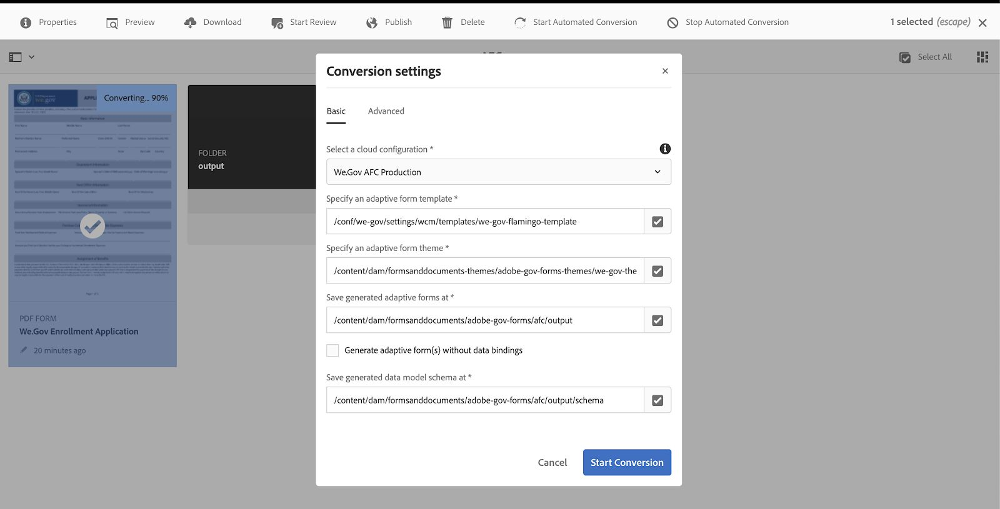

# We.Gov en We.Finance {#we-gov-reference-site-walkthrough}

## Voorwaarden {#pre-requisites}

Opstelling de verwijzingsplaats zoals die in [&#x200B; wordt beschreven Opstelling en vormt Web.Gov en Web.Finance verwijzingsplaats &#x200B;](../../forms/using/forms-install-configure-gov-reference-site.md).

## Gebruikersartikel {#user-story}

* AEM Forms

   * Automatede form conversion
   * Authoring
   * Formuliergegevensmodellen/gegevensbronnen

* AEM Forms

   * Gegevens vastleggen
   * (Optioneel) Gegevensintegratie (MS® Dynamics)
   * (Optioneel) Adobe Sign

* Workflow
* E-mailmeldingen
* (Optioneel) Communicatie door klanten

   * Afdrukkanaal
   * Webkanaal

* Adobe Analytics
* Integratie van Data Source

### Mogelijke gebruikers en groepen {#fictitious-users-and-groups}

Het Wij.Gov-demopakket wordt geleverd met de volgende ingebouwde fictieve gebruikers:

* **Aya Tan**: Burger verkiesbaar voor de Dienst van een agentschap van de Overheid


* **George Lang**: Wij.Gov de agent BedrijfsAnalyst


* **Camila Santos**: Wij.Gov Agentschap CX Lood


De volgende groepen zijn eveneens opgenomen:

* **Wij.Gov de Gebruikers van Forms**

   * George Lang
   * Camila Santos (lid)

* **Wij.Gov Gebruikers**

   * George Lang
   * Camila Santos (lid)
   * Aya Tan (lid)

### Demo-overzicht: legenda {#demo-overview-terms-legend}

1. **imiteer**: Gedefinieerde Gebruikers &amp; Groepen in AEM demo.
1. **Knoop**: De gekleurde rechthoek of cirkelde pijl voor het navigeren.
1. **klik**: Om een actie in het gebruikersverhaal in werking te stellen.
1. **Verbindingen**: Bij de bovenkant van het belangrijkste menu in plaats Wij.Gov.
1. **Instructies van de Gebruiker**: Een reeks numerieke stappen te volgen wanneer het navigeren door het verhaal van de gebruiker.
1. **Forms Portal**: *https://&lt;aemserver>:&lt;port>/content/we-gov/formsportal.html*
1. **Mobiele Mening**:Wij.Gov gebruiker om een mobiele mening met resized browser te herhalen.
1. **Mening van de Desktop**: We.gov gebruiker om demo op laptop of Desktop te bekijken.
1. **pre-screener Vorm**: Vorm op de Homepagina van de plaats Web.Gov.
1. **Aangepaste Vorm**: De toepassingsvorm van de inschrijving voor We.gov demo.

   *https://&lt;aemserver>:&lt;port>/content/forms/af/adobe-gov-forms/enrollment-application-for-health-benefits.html*

1. **Adobe wij.Gov Plaats**: *https://&lt;aemserver>:&lt;port>/content/we-gov/home.html*
1. **Adobe Inbox**: Vergrendelde hoogste menubalk [&#x200B; het pictogram van de Telling &#x200B;](assets/bell.svg) in AEM achterste.

   *https://&lt;aemserver>:&lt;port>/aem/start.html*

1. **E-mailCliënt**: Gewenste manier om uw e-mail (Gmail, Vooruitzichten) te bekijken
1. **CTA**: Vraag aan actie
1. **Navigeer**: Om van een specifiek verwijzingspunt op de browser pagina de plaats te bepalen.
1. **AFC**: Automatede form conversion

## Automatede form conversion (Camila) {#automated-forms-conversion}

**Deze sectie**: Camila het Lood CX heeft een bestaande op PDF gebaseerde vorm die als deel van een op document-gebaseerd proces werd gebruikt. Als onderdeel van een moderniseringsinspanning wil Camila dit PDF formulier gebruiken om automatisch een modern Adaptief Forms te creëren.

### Automatede form conversion - We.Gov (Camila) {#automated-forms-conversion-wegov}

1. Navigeer aan *https://&lt;aemserver>:&lt;port>/aem/start.html*

1. Aanmelden met:
   * **Gebruiker**: camila.santos
   * **Wachtwoord**: wachtwoord
1. Selecteer op de hoofdpagina Forms > Forms &amp; Documents > AEM Forms We.gov Forms > AFC.
1. Camila uploadt de PDF naar AEM Forms.

   

1. Camilla selecteert dan de vorm van de PDF en klikt **Geautomatiseerde Omzetting van het Begin** om het omzettingsproces te beginnen. U kunt **moeten klikken overschrijft omzetting** als u de vorm hebt omgezet.

   >[!NOTE]
   >
   >De instellingen in AFC zijn vooraf geconfigureerd voor de eindgebruiker, wat betekent dat deze instellingen niet mogen worden gewijzigd.

   * **Facultatief**: Als u wenst om het Toegankelijke Ultramariene thema te gebruiken, klik eenvoudig specificeer een adaptief vormthema en selecteer het Toegankelijk-Ultramarijnthema dat in de lijst van opties verschijnt.

   

   

   Het percentage voltooide status wordt weergegeven tijdens de conversie. Zodra de statusvertoningen **Omgezet**, klik de **output** omslag, selecteer de adaptieve vorm en klik **uitgeven** om de omgezette vorm te openen.

1. Camilla controleert vervolgens het formulier en controleert of alle velden aanwezig zijn

   

1. Camilla begint vervolgens met het bewerken van het formulier en selecteert Hoofdvenster > Bewerken (de moersleutel) > Tabs bovenaan in het vervolgkeuzemenu Indeling van deelvenster > Selecteert het selectievakje.

   

1. Camilla voegt vervolgens alle noodzakelijke CSS- en veldwijzigingen toe om het eindproduct te produceren.

   

### Formuliergegevensmodel en gegevensbronnen (Camila) {#data-sources}

**Deze sectie**: Nadat het document wordt omgezet en een Aangepaste Vorm veroorzaakt, moet Camila de Aanpassende Vorm met een gegevensbron verbinden.

1. Camila opent de Eigenschappen op de vorm die in [&#x200B; Automatede form conversion - wij.Gov &#x200B;](#automated-forms-conversion-wegov) werd omgezet.

1. In Camila selecteert u vervolgens Formuliermodel > Formuliergegevensmodel selecteren in het keuzemenu Selecteren uit > Selecteert We.gov Inschrijving FDM in de lijst met opties.

1. Klik op Opslaan en sluiten.

   

1. Camila klikt de **output** omslag, selecteert de adaptieve vorm, en klikt **uitgeven** om de voltooide vorm te openen We.Gov.
1. Camila selecteert een adaptief vormgebied en klikt  en leidt tot het binden met de modelentiteiten van vormgegevens gebruikend het **Bind 3&rbrace; gebied van de Verwijzing.** Camila herhaalt deze stap voor alle velden in het adaptieve formulier.

### Toegankelijkheidstest formulier (Camila) {#form-accessibility-testing}

Camila controleert ook of de gemaakte inhoud correct en volledig toegankelijk is volgens de bedrijfsnormen.

1. Camila klikt de **output** omslag, selecteert de adaptieve vorm, en klikt **Voorproef** om de voltooide vorm te openen We.Gov.

1. Hiermee opent u het tabblad Audit in het Chrome Developer Tool.

1. Voert een toegankelijkheidscontrole uit om het adaptieve formulier te valideren.

   

## Aanpassingsformulier voor mobiele weergave (Aya) {#mobile-view-demo}

**deze sectie moet vóór de demonstratie worden uitgevoerd.**

**Instructies van de Gebruiker:**

1. Navigeer aan: *https://&lt;aemserver>:&lt;port>/content/we-gov/home.html*
1. Aanmelden met:

   1. **Gebruiker**: aya.tan
   1. **Wachtwoord**: wachtwoord

1. Wijzig de grootte van het browservenster of gebruik de emulator van de browser om een mobiele apparaatgrootte te repliceren.

### Web.Gov Website (Aya) {#aya-user-story-we-gov-website}


**Deze sectie**: Aya is een burger en hoort van een vriend dat zij om de Dienst van een overheidsagentschap kan kunnen ontvangen. Aya navigeert vanaf haar mobiele telefoon naar de website We.Gov voor meer informatie over services waarvoor ze in aanmerking komt.

### We.Gov Pre-Screener (Aya) {#aya-user-story-we-gov-pre-screener}

Aya beantwoordt een paar vragen om haar geschiktheid te bevestigen door een kort adaptief formulier in te vullen op haar mobiele telefoon.

**Instructies van de Gebruiker:**

1. Maak een selectie in elk vervolgkeuzeveld.

   >[!NOTE]
   >
   >Als de gebruiker meer dan $200.000/jaar verdient, komen ze niet in aanmerking.

1. Klik **Ben ik in aanmerking komend?**.
1. Klik **toepassen nu** om te werk te gaan.

   

### We.Gov Adaptive Form (Aya) {#aya-user-story-we-gov-adaptive-form}

Aya vindt dat ze in aanmerking komt en vult haar aanvraag in om service aan te vragen op haar mobiele apparaat.

Aya moet sommige documenten thuis herzien alvorens zij de toepassing van het de dienstverzoek kan voltooien. Ze slaat de toepassing op en sluit deze af van haar mobiele apparaat.

**Instructies van de Gebruiker:**

1. Vul de velden Basisinformatie in. U moet de volgende velden en downloads invullen:

   1. Basisinformatie

      1. Voornaam
      1. Achternaam
      1. DOB
      1. E-mail

1. Gebruik de volgende **dynamische logica** om dynamische eigenschap aan te tonen gebruikend **Status van de Familie** dropdown:

   1. **Enig**: Tonen naast paneel van de hut
   1. **Gehuwd**: Toon echtelijk afhankelijk paneel
   1. **Afgekeerd**: Tonen naast paneel van de hut
   1. **Widowed**: Toon naast het paneel van de huidskleur
   1. **hebt u Kinderen?**: (Ja/Nee) keuzerondje om het onderliggende afhankelijke deelvenster weer te geven.

      1. (Toevoegen/verwijderen) om meerdere onderliggende afhankelijke deelvensters toe te voegen of te verwijderen.

1. Klik op de pijl-rechts in de grijze menubalk.
1. Klik onderaan op de knop Opslaan.

   

## Bureaubladdemo {#desktop-demo}

**Deze sectie:** terug thuis, heeft Aya de informatie gevonden die zij nodig had en hervat de toepassing van haar Desktop. Navigeert altijd naar de online Forms Portal om haar toepassing te hervatten. Met een eenvoudige aanpassing kunnen agentschappen ook automatisch een koppeling genereren en e-mailen om de toepassing te hervatten.

### Vervolg adaptief formulier (Aya) {#aya-user-story-continued-adaptive-form}

**Instructies van de Gebruiker:**

1. Navigeer aan *https://&lt;aemserver>:&lt;port>/content/we-gov/home.html*
1. Van de navigatiebar, uitgezochte **Online Diensten**.
1. Selecteer in het deelvenster &quot;Concept Forms&quot; de bestaande &quot;Inschrijvingstoepassing voor gezondheidsvoordelen&quot;.

   

   De look en feel zijn hetzelfde en ze hoeft geen gegevens opnieuw in te voeren.

   **Instructies van de Gebruiker:**

1. Klik met de rechtermuisknop op Cirkel-CTA om naar de volgende sectie te gaan.

   

   Het formulier wordt gevuld tot het punt van de laatste vermelding van Aya. Aya heeft al haar gegevens ingevoerd en is bereid deze te verzenden.

   

   >[!NOTE]
   >
   >Wanneer Aya het veld Telefoonnummer invult, moet ze het invullen als een doorlopend getal van 11 cijfers zonder streepjes, spaties of afbreekstreepjes.

   Na verzending ontvangt Aya de pagina Bedankt. Aya ontvangt desgewenst ook een e-mail die ze kan openen om het document van registratie elektronisch met Adobe Sign te ondertekenen.

### Optioneel: Adobe Sign (Aya) {#adobe-sign}

**Instructies van de Gebruiker:**

1. Navigeer naar uw e-mailclient en zoek de Adobe Sign-e-mail.
1. Klik op de koppeling naar Adobe Sign.

   

**Instructies van de Gebruiker:**

1. Controle **ik ga** akkoord.
1. Klik **goedkeuren**.
1. Blader naar de onderkant van het gereviseerde document.
1. Klik op het gemarkeerde gele tabblad, zodat u het document kunt ondertekenen.

     ondertekenen

## Regeringsagent (George) {#government-agent-george}


**Deze sectie:** George is een bedrijfsanalist bij het overheidsagentschap Aya is het verzoeken van de dienst van. George heeft één dashboard waar hij alle toepassingen van het de dienstverzoek kan zien die aan hem voor overzicht zijn toegewezen.

### AEM Inbox (George) {#george-user-story-aem-inbox}

**Instructies van de Gebruiker:**

1. Navigeer aan *https://&lt;aemserver>:&lt;port>/aem/start.html*
1. Klik het gebruikerspictogram (hoogste rechtse hoek) en gebruik **uit Teken**, of **imiteren als** menuoptie als u momenteel met een administratieve gebruiker het programma wordt geopend.

   1. Aanmelden met:

      1. **Gebruiker:** george.lang
      1. **Wachtwoord:** wachtwoord

   1. Of imiteren:

      1. Het type `George` op **impersonate als** gebied.

      1. Klik op OK om u voor te doen.

1. Klik in de rechterbovenhoek op het pictogram Melding (bel).
1. Klik **Mening allen** om aan Inbox te navigeren.
1. Van Inbox, open de recentste **taak van het Overzicht van de Toepassing van de Voordelen van de Gezondheid 0&rbrace;.**

   

### Optioneel: AEM Inbox &amp; MS® Dynamics (George) {#george-user-story-aem-inbox-and-ms-dynamics}

Dankzij gegevensintegratie en geautomatiseerde workflows wordt de toepassing van Aya samen met een CRM-record weergegeven die automatisch is gegenereerd op het moment dat de gegevens werden verzonden.

**Instructies van de Gebruiker:**

1. Open en inspecteer het alleen-lezen adaptieve formulier.
1. Klik **Open Dynamica MS®** om het verslag van de Dynamica MS® in een nieuw venster te openen.
1. In CRM, ziet u alle informatie die kan worden bijgewerkt.

   1. Voeg desgewenst enkele revisienotities rechtstreeks toe in Dynamiek.

1. Sluiten en terugkeren naar AEM Postvak IN.

   

### Terug naar AEM Postvak IN (George) {#george-user-story-back-to-aem-inbox}

George keurt de aanvraag van Aya goed en dankzij een bestaande geautomatiseerde workflow wordt ook een bevestigingsbericht naar Aya gestuurd.

**Instructies van de Gebruiker:**

1. Navigeer aan de top-left hoek en klik **goedkeuren** om de toepassing goed te keuren.
1. In de modale modus kunt u een bericht voor de CX-lead achterlaten.
1. Klik op Gereed.
1. (Burgerrol) Open uw e-mailclient om de e-mail te bekijken die naar Aya is verzonden.

   

## CX-lood (Camila) {#cx-lead-camila}


**Deze sectie:** Camila het Lood CX plaatst - omhoog een welkome telefoongesprek met Aya om te verklaren hoe te om de overheidsdiensten te gebruiken die zij voor wordt goedgekeurd.

### (Optioneel) AEM Inbox &amp; MS® Dynamics {#camila-user-story-aem-inbox-ms-dynamics}

**Instructies van de Gebruiker:**

1. Navigeer aan *https://&lt;aemserver>:&lt;port>/aem/start.html*
1. Klik het gebruikerspictogram (hoogste rechtse hoek) en gebruik **uit Teken**, of **imiteren als** menuoptie als u momenteel met een administratieve gebruiker het programma wordt geopend.

   1. Aanmelden met:

      1. **Gebruiker**: camila.santos
      1. **Wachtwoord**: wachtwoord

   1. Of imiteren:

      1. Het type `Camila` op **impersonate als** gebied.

      1. Klik op OK om u voor te doen.

1. Klik in de rechterbovenhoek op het pictogram Melding (bel).
1. Klik **Mening allen** om aan Inbox te navigeren.
1. Van Inbox, open de recentste **Nieuwe taak van de Goedkeuring van het Contact**.


**(Optioneel) Gebruikersinstructies:**

1. Open en inspecteer het alleen-lezen adaptieve formulier.
1. Klik **Open Dynamica MS®** om het verslag van de Dynamica MS® in een nieuw venster te openen.
1. In CRM kunt u alle informatie zien die kan worden bijgewerkt.

   1. Naar keuze, voeg direct een vraagactiviteit in Dynamiek toe.
   1. Open de **sectie van Activiteiten**.
   1. Klik **Nieuwe Vraag van de Telefoon**.
   1. Voeg telefoongesprekdetails toe.
   1. Sla het venster op en sluit het.

1. Terug in AEM, navigeer aan de upper-left hoek en klik **voorleggen** om de toepassing voor te leggen.
1. In de modale modus kunt u een bericht achterlaten.
1. Klik op Gereed.

    

## (Optioneel) Welkom Kit Citizen (Aya) {#welcome-kit-citizen-aya}

**Deze sectie:** Aya ontvangt een e-mail bevat een verbinding aan een interactieve mededeling die haar voordelen samenvat en ook vormgebieden omvat om te vullen. Met de PDF-uitkeringsverklaring bijgevoegd en koppeling naar interactieve communicatieletter in de e-mail (met hetzelfde thema/branding als de interactieve communicatie).

### Melding e-mailclient (Aya) {#aya-user-story-email-client}

**Instructies van de Gebruiker:**

1. Zoek en open de welkomstkit-e-mail.
1. Schuif naar PDF-bijlage onder aan de pagina.
1. Klik om de bijlage van de PDF te openen.
1. De rol omhoog in uw e-mailcliënt en klikt **Uitgezochte Kit van de Mening online**.

   1. Hierdoor wordt de webkanaalversie van hetzelfde document geopend.

1. Voor een snelle verwijzing naar PDF direct:

   *https://&lt;aemserver>:&lt;port>/aem/formdetails.html/content/dam/formsanddocuments/adobe-gov-forms/welcome-handbook/we-gov-welcome-handbook*

1. Voor een snelle verwijzing naar IC direct:

   *https://&lt;aemserver>:&lt;port>/content/dam/formsanddocuments/adobe-gov-forms/welcome-handbook/we-gov-welcome-handbook/jcr:content?channel=web&amp;mode=preview&amp;wcmmode=disabled*

    

## Herinnering burger (Aya) {#renewal-reminder-citizen-aya}

**Deze sectie:** Camila plant ook een communicatie herinnering zo één jaar later. (Workflowstap die automatiseert/uitvoert en e-mail verzendt).

### Melding e-mailclient (Aya) {#aya-user-story-email-client-updated}

**Instructies van de Gebruiker:**

1. Navigeer naar uw e-mailclient.
1. Zoek en open het e-mailbericht Herinnering voor vernieuwen.
1. Klik **voorleggen een nieuwe toepassing** zodat kunt u de adaptieve vorm openen.

   1. Deze sectie wordt opzettelijk leeg gelaten ter ondersteuning van gegevens die vooraf in fase 2 worden ingevuld.

   

## (Optioneel) Formuliergegevensmodel (Camila) {#form-data-model}

**Deze sectie**: Camila navigeert aan de Integraties van Gegevens van AEM Forms waar zij een snelle test kan in werking stellen om te zien dat de informatie die naar de externe gegevensbron via de modelintegratie van de Gegevens van de Vorm wordt verzonden inderdaad aanwezig is.

### Formuliergegevensmodel (Camila) {#form-data-model-camila}

**Deze sectie**: Camila navigeert aan de pagina van Gegevensbronnen om de gegevens te bevestigen die de server binnen het gegevensbestand van Derby heeft herhaald.

1. Nadat de gebruikerservaring volledig is en de gebruikersvoorlegging wordt voltooid, navigeert Camila aan het lusje van Gegevensbronnen binnen AEM Forms (**Forms** > **Integraties van Gegevens**)

1. Camila selecteert dan AEM Forms We.gov FDM en geeft dan **We.gov Inschrijving FDM** uit.

1. Camila selecteert dan het **Contact** > **Gelezen Dienst** om worden getest.

   

1. Camila verstrekt dan de testdienst met contactidentiteitskaart en klikt dan **Test**. 1 of 2, bijvoorbeeld als u het formulier hebt verzonden. Als u het formulier niet hebt verzonden, worden er geen gegevens geretourneerd.

   

1. Camila kan dan bevestigen dat de gegevens met succes in de gegevensbron zijn opgenomen.

   * De gegevens in de DS van Derby lijken op de volgende indeling:

   ```xml
      [
         {
         "ADDRESS_COUNTRY": "USA",
         "LAST_NAME": "Tan",
         "ADDRESS_CITY": "New York",
         "FIRST_NAME": "Aya",
         "ADDRESS_STATE": "AL",
         "ADDRESS_LINE1": "123 Street crescent",
         "GENDER_CODE": "2",
         "ADDRESS_LINE2": "123 Street crescent",
         "ADDRESS_POSTAL_CODE": "90210",
         "BIRTH_DATE": "1991-12-12",
         "CONTACT_ID": 1,
         "MIDDLE_NAME": "M",
         "HAS_CHILDREN_CODE": "0"
         }
   ]
   ```

## (Optioneel) Analytics (Camila) {#analytics-cx-lead-camila}

**Deze sectie:** Camila navigeert aan een dashboard waar zij over de agentschap KPIs zoals % van burgers kan zien die beginnen een vorm van het de dienstverzoek te vullen en te verlaten, de gemiddelde tijdsduur van verzoekvoorlegging aan goedkeuring/ontkenning reactie, en betrokkenheidsstatistieken voor de voordelenboeken die zij aan burgers heeft verzonden.

### Adobe Analytics Sites Reporting (Camila) {#camila-reviews-sites-reporting-we-gov-adobe-analytics}

1. Navigeer aan *https://&lt;aemserver>:&lt;port>/sites.html/content*
1. Selecteer **de Plaats van AEM Forms Wij.Gov** om de plaatspagina&#39;s te bekijken.
1. Selecteer één van de plaatspagina&#39;s (bijvoorbeeld, Huis), en kies **Analytics &amp; Recommendations**.

   

1. Op deze pagina ziet u opgehaalde informatie uit Adobe Analytics die betrekking heeft op de AEM Sites-pagina (OPMERKING: deze informatie wordt door het ontwerp periodiek vernieuwd vanuit Adobe Analytics en wordt niet in real-time weergegeven).

   

1. Terug op de pagina van de paginamening (die in stap 3 wordt betreden.), kunt u de informatie van de paginamening ook bekijken door de vertoning te veranderen die aan meningspunten in **Mening van de Lijst** plaatst.
1. Bepaal de plaats van **drop-down menu van de Mening** en selecteer **Mening van de Lijst**.

   

1. Van het zelfde menu, selecteert de uitgezochte **Vestiging van de Mening** en selecteert de kolommen u om van de **Analytics** sectie wenst te tonen.

   

1. Klik **Update** om de nieuwe kolommen beschikbaar te maken.

   

### Adobe Analytics Forms Reporting (Camila) {#camila-reviews-forms-reporting-we-gov-adobe-analytics}

1. Navigeren naar

   *https://&lt;aemserver>:&lt;port>/aem/forms.html/content/dam/formsanddocuments/adobe-gov-forms*

1. Selecteer de **Toepassing van de Inschrijving voor de Prestaties van de Gezondheid** adaptieve vorm en selecteer de **optie van het Rapport van de Analyse**.

   

1. Wacht tot de pagina is geladen en bekijk de analysegegevens.

   
