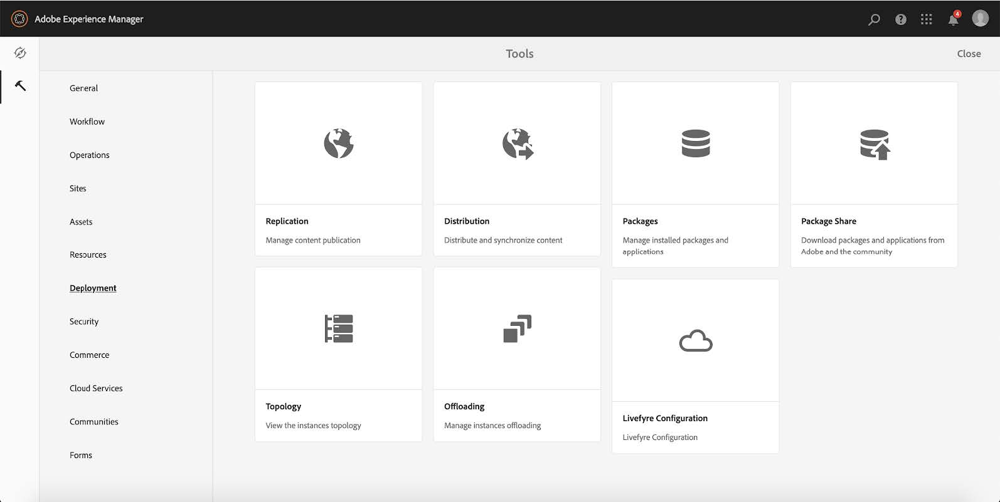
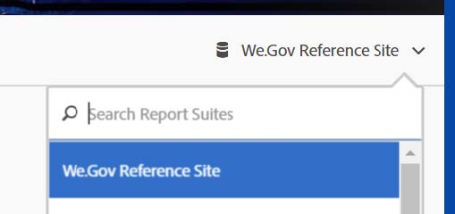

# De Web.Gov-referentiesite instellen en configureren{#set-up-and-configure-we-gov-reference-site}

## Details demopakket {#demo-package-details}

### Installatievereisten {#installation-prerequisites}

Dit pakket is gemaakt voor **AEM Forms 6.4 OSGI Author** en is getest en wordt daarom ondersteund door de volgende platformversies:

| AEM-VERSIE | VERSIE AEM-FORMULIERPAKKET | STATUS |
|---|---|---|
| 6.4 | 5.0.86 | **Ondersteund** |
| 6.5 | 6.0.80 | **Ondersteund** |

Dit pakket bevat cloudconfiguratie die de volgende platformversies ondersteunt:

| PROVIDER CLOUD | SERVICEVERSIE | STATUS |
|---|---|---|
| Adobe-handtekening | v5 API | **Ondersteund** |
| Microsoft Dynamics 365 | 1710 (9.1.0.3020) | **Ondersteund** |

**Overwegingen bij de installatie van pakketten:**

* Het pakket wordt naar verwachting geïnstalleerd op een schone server, zonder andere demopakketten of oudere demopakketversies
* Het pakket wordt naar verwachting geïnstalleerd op een OSGI-server, die wordt uitgevoerd in de modus Auteur

### Wat bevat dit pakket {#what-does-this-package-include}

Het AEM Forms We.Gov-demopakket (**we-gov-forms.pkg.all-&lt;version>.zip**) wordt geleverd als een pakket dat verschillende andere subpakketten en services bevat. Het pakket bevat de volgende modules:

* **we-gov-forms.pkg.all-&lt;version>.zip** - *Volledige demopakket*

   * **we-gov-forms.ui.apps-&lt;version>.zip** *- Bevat alle componenten, clientbibliotheken, voorbeeldgebruikers, workflowmodellen, enz.*

      * **we-gov-forms.core-&lt;version>.jar** - *Bevat alle OSGI-services, implementatie van aangepaste workflowstappen, enzovoort.*

      * **core.wcm.components.all-2.0.4.zip** - *Verzameling van WCM-componenten van het monster*

      * **grid-aem.ui.apps-1.0-SNAPSHOT.zip** - *AEM-pakket voor de lay-out Raster van sites voor het instellen van kolombesturingselementen in de sitepagina*
   * **we-gov-forms.ui.content-&lt;version>.zip** - *Bevat alle inhoud, pagina&#39;s, afbeeldingen, formulieren, interactieve communicatiemiddelen, enzovoort.*

   * **wij-gov-forms.config.public-&lt;version>.zip** - *Bevat alle standaardconfiguratieknooppunten met inbegrip van placeholder wolkenconfiguraties helpen vormgegevensmodel, en de dienstbindingskwesties vermijden.*

De elementen die in dit pakket zijn opgenomen, zijn:

* AEM-sitepagina&#39;s met bewerkbare sjablonen
* AEM-formulieren (adaptief)
* AEM vormt Interactieve Mededelingen (Druk en het Kanaal van het Web)
* AEM Forms XDP Document of Record
* AEM Forms MS Dynamics Forms Data Model
* Adobe Sign Integration
* AEM-workflowmodel
* Voorbeeldafbeeldingen van AEM-middelen

## Configuratieopties {#configuration-options}

Deze sectie bevat details over configuratieopties. Op dit moment is deze sectie opzettelijk leeg.

## Installatie van demopakket {#demo-package-installation}

Deze sectie bevat informatie over het installeren van het demopakket.

### Uit pakketshare {#from-package-share}

1. Ga naar *https://&lt;aemserver>:&lt;port>/crx/packageshare/*

   Of klik in AEM op Implementatie en navigeer naar het pictogram Delen van pakket.

   

1. Meld u aan met uw Adobe-id.
1. Zoek en zoek het pakket **we-gov-forms.pkg.all-&lt;version>** .
1. Selecteer de optie &quot;Downloaden&quot; en accepteer de Algemene voorwaarden.
1. Nadat u het pakket hebt gedownload, selecteert u de optie &quot;Gedownload&quot; om het pakket te zoeken in Pakketbeheer.
1. Selecteer de optie &quot;Installeren&quot; om het pakket te installeren.

   

1. De installatie kan worden voltooid.
1. Navigeer naar *https://&lt;aemserver>:&lt;port>/content/we-gov/home.html?wcmmode=disabled* om ervoor te zorgen dat de installatie is gelukt.

### Vanuit een lokaal ZIP-bestand {#from-a-local-zip-file}

1. Download en zoek het bestand **we-gov-forms.pkg.all-&lt;version>.zip** .
1. Ga naar *https://&lt;aemserver>:&lt;port>/crx/packmgr/index.jsp*.
1. Selecteer de optie Pakket uploaden.

   

1. Gebruik de bestandsbrowser om naar het gedownloade ZIP-bestand te navigeren en dit te selecteren.
1. Klik op Openen om te uploaden.
1. Nadat u het pakket hebt geüpload, selecteert u de optie &quot;Installeren&quot; om het pakket te installeren.

   

1. De installatie kan worden voltooid.
1. Navigeer naar *https://&lt;aemserver>:&lt;port>/content/we-gov/home.html?wcmmode=disabled* om ervoor te zorgen dat de installatie is gelukt.

### Nieuwe pakketversies installeren {#installing-new-package-versions}

Voer de stappen in 4.1 en 4.2 uit om een nieuwe pakketversie te installeren. U kunt een nieuwere pakketversie installeren terwijl al een ander ouder pakket is geïnstalleerd, maar u wordt aangeraden de oudere pakketversie eerst te verwijderen. Volg de onderstaande stappen om dit te doen.

1. Ga naar *https://&lt;aemserver>:&lt;port>/crx/packmgr/index.jsp*
1. Zoek het bestand **we-gov-forms.pkg.all-&lt;version>.zip** .
1. Selecteer de optie Meer.
1. Selecteer in het vervolgkeuzemenu de optie Verwijderen.

   

1. Selecteer na bevestiging nogmaals &quot;Verwijderen&quot; en voer de procedure voor het verwijderen uit.

## Configuratie demopakket {#demo-package-configuration}

Deze sectie bevat details en instructies over de configuratie na implementatie van het demopakket vóór de presentatie.

### Facultatieve gebruikersconfiguratie {#fictional-user-configuration}

1. Ga naar *https://&lt;aemserver>:&lt;port>/libs/granite/security/content/groupadmin.html*
1. Zoek naar &quot;**workflow**&quot;.
1. Selecteer de groep &quot;**workflowgebruikers**&quot; en klik op &quot;Eigenschappen&quot;.
1. Navigeer naar het tabblad &quot;Leden&quot;.
1. Typ in het **veld Gebruiker of Groep selecteren in het vak** &quot;Gebruiker selecteren&quot;.
1. Selecteer een optie in het vervolgkeuzemenu &quot;Gebruikers **van** We.Gov-formulieren&quot;.

   

1. Klik op &quot;Opslaan en sluiten&quot; in de menubalk.
1. Herhaal stap 2-7 door naar &quot;**Analytics**&quot; te zoeken, de groep &quot;**Analytics Administrators**&quot; te selecteren en de groep &quot;**We.Gov Form Users**&quot; als lid toe te voegen.
1. Herhaal stap 2-7 door naar &quot;**formuliergebruikers**&quot; te zoeken, de groep &quot;**gebruikers** in de formuliervoeding&quot; te selecteren en de groep &quot;**Gebruikers** in de formulierindeling We.Gov&quot; als lid toe te voegen.
1. Herhaal stap 2-7 door te zoeken naar &quot;**formuliergebruikers**&quot;, de groep &quot;**formulieren-gebruikers**&quot; te selecteren en voeg nu de groep &quot;**Gebruikers** vanWe.Gov&quot; toe als lid.

### Configuratie van e-mailserver {#email-server-configuration}

1. Documentatie voor installatie van revisie [e-mailmelding configureren](/help/sites-administering/notification.md)

1. Ga naar *https://&lt;aemserver>:&lt;port>/system/console/configMgr*
1. Zoek en klik op de **Day CQ Mail Service** om deze te configureren.

   

1. Vorm de dienst om met de server SMTP van uw keus te verbinden:

   1. **hostnaam** SMTP-server: bijv. (smtp.gmail.com)
   1. **Serverpoort**: bijv. (465) voor gmail met SSL
   1. **SMTP-gebruiker:** demo@ &lt;naam bedrijf>.com
   1. **Adres**&quot;Van&quot;: aemformsdemo@adobe.com
   

1. Klik &quot;sparen&quot;om de configuratie te bewaren.

### AEM SSL-configuratie {#aemsslconfig}

Deze sectie bevat informatie over het configureren van SSL op de AEM-instantie om de configuratie van Adobe Sign Cloud te kunnen configureren.

**Referenties:**

1. [Standaard SSL](/help/sites-administering/ssl-by-default.md)

**Opmerkingen:**

1. Navigeer naar https://&lt;aemserver>:&lt;port>/aem/inbox waar u het proces kunt voltooien dat wordt uitgelegd in de bovenstaande koppeling naar de referentiedocumentatie.
1. Het pakket **we-gov-forms.pkg.all-&lt;version>.zip** bevat een voorbeeld-SSL-sleutel en -certificaat dat u kunt openen door de map **we-gov-forms.pkg.all-&lt;version>.zip/ssl** uit het pakket te extraheren.

1. SSL-certificaat en sleutelgegevens:

   1. uitgegeven aan &quot;CN=localhost&quot;
   1. 10 jaar geldigheid
   1. password value of &quot;password&quot;

### Adobe-cloudconfiguratie ondertekenen {#adobe-sign-cloud-configuration}

Deze sectie bevat details en instructies over de Configuratie van de Wolk van de Teken van Adobe.

**Referenties:**

1. [Adobe-ondertekening integreren met AEM-formulieren](adobe-sign-integration-adaptive-forms.md)

#### Cloudconfiguratie {#cloud-configuration}

1. **Controleer de voorwaarden. Zie[AEM SSL-configuratie](../../forms/using/forms-install-configure-gov-reference-site.md#aemsslconfig)voor de vereiste SSL-configuratie.**
1. Ga naar:

   *https://&lt;aemserver>:&lt;port>/libs/adobesign/cloudservices/adobesign.html/conf/we-gov*

   >[!NOTE]
   >
   >De URL die wordt gebruikt voor toegang tot de AEM-server moet overeenkomen met de URL die is geconfigureerd in de Adobe Sign OAuth Redirect URI om configuratieproblemen te voorkomen (bijvoorbeeld *https://&lt;aemserver>:&lt;port>/mnt/overlay/adobesign/cloudservices/adobesign/properties.html*)

1. Selecteer de configuratie voor &quot;wij.gov Adobe Sign&quot;.
1. Klik op &quot;Eigenschappen&quot;.
1. Navigeer naar het tabblad &quot;Instellingen&quot;.
1. Voer de URL van Auth in, bijvoorbeeld: [https://secure.na1.echosign.com/public/oauth](https://secure.na1.echosign.com/public/oauth)
1. Geef de geconfigureerde client-id en clientgeheim op in de geconfigureerde Adobe Sign-instantie.
1. Klik op &quot;Verbinding maken met Adobe-ondertekening&quot;.
1. Klik na een geslaagde verbinding op &quot;Opslaan en sluiten&quot; om de integratie te voltooien.

### Configuratie van de cloud voor MS Dynamics {#ms-dynamics-cloud-configuration}

Deze sectie bevat details en instructies over de Configuratie van de Wolk van de Dynamica van MS.

**Referenties:**

1. [Configuratie Microsoft Dynamics OData](https://docs.adobe.com/content/help/en/experience-manager-64/forms/form-data-model/ms-dynamics-odata-configuration.html)
1. [Microsoft Dynamics for AEM Forms configureren](https://helpx.adobe.com/experience-manager/kt/forms/using/config-dynamics-for-aem-forms.html)

#### MS Dynamics OData cloudservice {#ms-dynamics-odata-cloud-service}

1. Ga naar:

   https://&lt;aemserver>:&lt;port>/libs/fd/fdm/gui/components/admin/fdmcloudservice/fdm.html/conf/we-gov

   1. Zorg ervoor dat u de server opent met dezelfde omleidings-URL als die is geconfigureerd in de toepassingsregistratie van MS Dynamics.

1. Selecteer de configuratie voor Microsoft Dynamics OData Cloud Service.
1. Klik op &quot;Eigenschappen&quot;.

   

1. Navigeer naar het tabblad &#39;Verificatie-instellingen&#39;.
1. Voer de volgende gegevens in:

   1. **Hoofdmap service:** Bijv. https://msdynamicsserver.api.crm3.dynamics.com/api/data/v9.1/
   1. **Type verificatie:** OAuth 2.0
   1. **Verificatie-instellingen** (zie de instellingen voor [de cloudconfiguratie van](../../forms/using/forms-install-configure-gov-reference-site.md#dynamicsconfig) MS Dynamics om deze informatie te verzamelen):

      1. Client-id - ook wel toepassings-id genoemd
      1. Clientgeheim
      1. OAuth URL - bijv. [https://login.windows.net/common/oauth2/authorize](https://login.windows.net/common/oauth2/authorize)
      1. Token-URL vernieuwen - bijvoorbeeld [https://login.windows.net/common/oauth2/token](https://login.windows.net/common/oauth2/token)
      1. Toegang tot token-URL - bijvoorbeeld [https://login.windows.net/common/oauth2/token](https://login.windows.net/common/oauth2/token)
      1. Reikwijdte vergunning - **open id**
      1. Koptekst verificatie - **Vergunninghouder**
      1. Bron - bijv. [https://msdynamicsserver.api.crm3.dynamics.com](https://msdynamicsserver.api.crm3.dynamics.com)
   1. Klik op &quot;Verbinding maken met OAuth&quot;.

1. Na succesvolle verificatie klikt u op &quot;Opslaan en sluiten&quot; om de integratie te voltooien.

#### Configuratie-instellingen voor MS Dynamics-cloud {#dynamicsconfig}

De stappen die in deze sectie worden beschreven zijn inbegrepen om u van Cliënt ID, Geheime cliënt en details van uw instantie van de Cloud van de Dynamica van MS te helpen de plaats bepalen.

1. Ga naar [https://portal.azure.com/](https://portal.azure.com/) en meld u aan.
1. Selecteer in het linkermenu de optie Alle services.
1. Zoek of navigeer naar &quot;Toepassingsregistratie&quot;.
1. Maak of selecteer een bestaande toepassingsregistratie.
1. Kopieer de **toepassings-id** die u wilt gebruiken als de OAuth- **client-id** in de AEM-cloudconfiguratie
1. Klik op &quot;Instellingen&quot; of &quot;Manifest&quot; om de URL&#39;s voor **beantwoorden te configureren.**

   1. Deze URL moet overeenkomen met de URL die wordt gebruikt om toegang te krijgen tot uw AEM-server wanneer de OData-service wordt geconfigureerd.

1. Klik in de weergave Instelling op &quot;Toetsen&quot; om een nieuwe sleutel weer te geven (deze wordt gebruikt als clientgeheim in AEM).

   1. Zorg ervoor dat u een kopie van de sleutel bewaart, omdat u deze later niet kunt bekijken in Azure of AEM.

1. Navigeer naar het dashboard voor de instantie van MS Dynamics om de URL van de hoofdmap van de bron/service te zoeken.
1. Klik in de bovenste navigatiebalk op &quot;Verkoop&quot; of op uw eigen instantietype en &quot;Instellingen selecteren&quot;.
1. Klik rechts onderaan op Aanpassingen en Developer Resources.
1. Hier vindt u de hoofdmap van de service: bijv.

   *[https://msdynamicsserver.api.crm3.dynamics.com/api/data/v9.1/](https://msdynamicsserver.api.crm3.dynamics.com/api/data/v9.1/)*

1. Hier vindt u meer informatie over de URL van het token Vernieuwen en Toegangstoken:

   *[https://docs.microsoft.com/en-us/rest/api/datacatalog/authenticate-a-client-app](https://docs.microsoft.com/en-us/rest/api/datacatalog/authenticate-a-client-app)*

#### Het formuliergegevensmodel testen {#testing-the-form-data-model}

Nadat de cloudconfiguratie is voltooid, wilt u mogelijk het gegevensmodel van het formulier testen.

1. Ga naar

   *https://&lt;aemserver>:&lt;port>/aem/forms.html/content/dam/formsanddocuments-fdm/we-gov*

1. Selecteer &quot;Wij.gov de Dynamica CRM FDM van Microsoft&quot;en selecteer &quot;Eigenschappen&quot;.

   

1. Navigeer naar het tabblad Bron bijwerken.
1. Zorg ervoor dat de &quot;Context-Aware Configuratie&quot;aan &quot;/conf/wij-gov&quot;wordt geplaatst en dat de gevormde gegevensbron &quot;ms-dynamics-odata-cloud-dienst is&quot;.

   

1. Bewerk het formuliergegevensmodel.

   >[!NOTE]
   Zorg ervoor dat u op **Annuleren** klikt in plaats van op **Opslaan en sluiten** om problemen te voorkomen die opnieuw moeten worden geïnstalleerd.

1. Test de diensten om ervoor te zorgen zij met succes met de gevormde Gegevensbron verbinden.

   >[!NOTE]
   Er is gemeld dat een AEM Server-herstart vereist was voor de gegevensbron om een verbinding met FDM tot stand te brengen.

### Configuratie Adobe Analytics {#adobe-analytics-configuration}

Deze sectie bevat details en instructies over de Configuratie van de Wolk van de Analyse van Adobe.

**Referenties:**

* [Integreren met Adobe Analytics](../../sites-administering/adobeanalytics.md)

* [Verbinding maken met Adobe Analytics en frameworks maken](../../sites-administering/adobeanalytics-connect.md)

* [Gegevens van paginaanalyse bekijken](../../sites-authoring/pa-using.md)

* [Analyses en rapporten configureren](configure-analytics-forms-documents.md)

* [Analyserapporten van AEM Forms weergeven en begrijpen](view-understand-aem-forms-analytics-reports.md)

### Configuratie van Adobe Analytics-cloudservice {#adobe-analytics-cloud-service-configuration}

Dit pakket wordt vooraf geconfigureerd voor verbinding met Adobe Analytics. De onderstaande stappen zijn beschikbaar om deze configuratie te kunnen bijwerken.

1. Ga naar *https://&lt;aemserver>:&lt;port>/libs/cq/core/content/tools/cloudservices.html*
1. Zoek de sectie Adobe Analytics en selecteer de koppeling &quot;Show Configurations&quot;.
1. Selecteer de configuratie voor &quot;We.Gov Adobe Analytics (Analytics Configuration)&quot;.

   

1. Klik op de knop &quot;Bewerken&quot; om de configuratie van Adobe Analytics bij te werken (hiervoor moet u het gedeelde geheim opgeven). Klik op &quot;Verbinding maken met Analytics&quot; om verbinding te maken en op &quot;OK&quot; om de verbinding te voltooien.

   

1. Klik op &#39;We.Gov Adobe Analytics Framework (Analytics Framework)&#39; op dezelfde pagina als u de frameworkconfiguraties wilt bijwerken (zie [AEM-authoring](../../forms/using/forms-install-configure-gov-reference-site.md#enableauthoring) inschakelen om Authoring in te schakelen).

### Rapportage voor Adobe Analytics {#adobe-analytics-reporting}

#### Rapportering van Adobe Analytics-sites weergeven {#view-adobe-analytics-sites-reporting}

1. Ga naar *https://&lt;aemserver>:&lt;port>/sites.html/content*
1. Selecteer de site &quot;AEM Forms We.Gov&quot; om de sitepagina&#39;s weer te geven.
1. Selecteer een van de sitepagina (bijvoorbeeld Home) en kies &quot;Analytics &amp; Recommendations&quot;.

   

1. Op deze pagina wordt opgehaalde informatie van Adobe Analytics weergegeven, die betrekking heeft op de pagina AEM Sites (opmerking: Deze informatie wordt door het ontwerp periodiek vernieuwd vanuit Adobe Analytics en wordt niet in real-time weergegeven).

   

1. Terug op de pagina van de paginamening (betreden in stap 3.), kunt u de informatie van de paginamening ook bekijken door de vertoning te veranderen die punten in de &quot;Mening van de Lijst&quot;plaatst te bekijken.
1. Zoek het vervolgkeuzemenu Weergave en selecteer Lijstweergave.

   

1. Selecteer in hetzelfde menu de optie Weergave-instelling en selecteer de kolommen die u wilt weergeven in de sectie Analytics.

   

1. Klik op &quot;Bijwerken&quot; om de nieuwe kolommen beschikbaar te maken.

   

#### Rapportage van Adobe Analytics-formulieren weergeven {#view-adobe-analytics-forms-reporting}

1. Ga naar

   *https://&lt;aemserver>:&lt;port>/aem/forms.html/content/dam/formsanddocuments/adobe-gov-forms*

1. Selecteer het adaptieve formulier &quot;Inschrijvingsaanvraag voor gezondheidsvoordelen&quot; en selecteer de optie &quot;Analyserapport&quot;.

   

1. Wacht tot de pagina is geladen en bekijk de gegevens in het Analysapport.

   

#### Adobe Analytics-rapporten weergeven {#view-adobe-analytics-reporting}

U kunt desgewenst rechtstreeks naar Adobe Analytics navigeren om de analysegegevens weer te geven.

1. Ga naar [https://my.omniture.com/login/](https://my.omniture.com/login/)
1. Aanmelden met uw referenties:

   1. **Bedrijf:** AEM Forms Demo
   1. **Gebruiker:** &lt;beschikbaar op verzoek>
   1. **Wachtwoord:** &lt;beschikbaar op verzoek>

1. Selecteer de &quot;Wij.Gov Referentieplaats&quot;van de Reeksen van het Rapport.

   

1. Selecteer een van de beschikbare rapporten om de analysegegevens van dat rapport weer te geven.

   

## Aanpassing van demopakket {#demo-package-customizations}

Deze sectie bevat instructies voor het aanpassen van de demo.

### AEM-authoring inschakelen {#enableauthoring}

Dit demopakket bevat een configuratiebestand voor de service OSGI dat het gedrag van de WCM-filterservice op de doelserver van de auteur regelt. Deze configuratie maakt de server op een gehandicapte auteurswijze (gelijkwaardig aan ?wcmmode=disabled) werken om demonstratie toe te staan. Voer de volgende stappen uit om deze configuratie bij te werken en ontwerpen in te schakelen:

1. Ga naar *https://&lt;aemserver>:&lt;port>/system/console/configMgr*
1. Zoek en klik op de **Day CQ WCM Filter** Service om te configureren.

   

1. Stel de waarde van &quot;**WCM-modus**&quot; in op &quot;**Bewerken**&quot;.
1. Klik op &quot;**Opslaan**&quot; om de configuratie toe te passen.

### Aanpassing sjablonen {#templates-customization}

Bewerkbare sjablonen vindt u op de volgende locatie:

*https://&lt;aemserver>:&lt;port>/libs/wcm/core/content/sites/templates.html/conf/we-gov*

Deze sjablonen bevatten de sjablonen AEM-site, Adaptief formulier en Interactieve communicatie, die zijn gemaakt en samengesteld met componenten die u kunt vinden op:

*https://&lt;aemserver>:&lt;port>/crx/de/index.jsp#/apps/we-gov/components*

#### Style system {#customizetemplates}

Deze site bevat ook clientbibliotheken, waarvan er een Bootstrap 4 importeert ( [https://getbootstrap.com/](https://getbootstrap.com/) ). Deze clientbibliotheek is beschikbaar op

*https://&lt;aemserver>:&lt;port>/crx/de/index.jsp#/apps/we-gov/clientlibs/client-lib-base/css/bootstrap*

De bewerkbare sjablonen in dit pakket zijn ook vooraf geconfigureerd met sjabloon-/paginabeleid dat de CSS-klassen Bootstrap 4 gebruikt voor paginering, opmaak, enzovoort. Niet alle klassen zijn toegevoegd aan het sjabloonbeleid, maar elke klasse die door Bootstrap 4 wordt ondersteund, kan aan het beleid worden toegevoegd. Zie de pagina Aan de slag voor een lijst met beschikbare klassen:

[https://getbootstrap.com/docs/4.1/getting-started/introduction/](https://getbootstrap.com/docs/4.1/getting-started/introduction/)

De malplaatjes inbegrepen in dit pakket steunen ook het Systeem van de Stijl:

[Stijlsysteem](../../sites-authoring/style-system.md)

#### Sjabloonlogo&#39;s {#template-logos}

DAM-projectelementen omvatten onder andere Wij.Gov-logo&#39;s en -afbeeldingen. Deze activa zijn beschikbaar op:

*https://&lt;aemserver>:&lt;port>/assets.html/content/dam/we-gov*

Wanneer u de pagina- en formuliersjablonen bewerkt, kunt u de logo&#39;s van een merk bijwerken door de navigatie- en voettekstcomponenten te bewerken. Deze componenten bieden een configureerbaar merk- en logodialoogvenster dat kan worden gebruikt om logo&#39;s bij te werken:

Zie Pagina-inhoud bewerken voor meer informatie:

[Paginacontent bewerken](../../sites-authoring/editing-content.md)

### Aanpassing sitepagina&#39;s {#sites-pages-customization}

Alle sitepagina&#39;s zijn beschikbaar via: *https://&lt;aemserver>:&lt;port>/sites.html/content/we-gov*

Deze sitepagina&#39;s maken ook gebruik van het AEM-rasterpakket om de lay-out van een paar componenten te bepalen.

#### Style system {#style-system}

Pagina&#39;s die in dit pakket zijn opgenomen, ondersteunen ook het stijlsysteem:

[Stijlsysteem](../../sites-authoring/style-system.md)

U kunt ook naar het systeem [van de de aanpassingsstijl van](../../forms/using/forms-install-configure-gov-reference-site.md#customizetemplates) Malplaatjes voor documentatie over gesteunde stijlen verwijzen.

### Aanpassing van adaptieve formulieren {#adaptive-forms-customization}

Alle adaptieve formulieren zijn beschikbaar op:

*https://&lt;aemserver>:&lt;port>/aem/forms.html/content/dam/formsanddocuments/adobe-gov-forms*

Deze formulieren kunnen worden aangepast aan bepaalde gebruiksgevallen. Houd er rekening mee dat bepaalde velden en verzendlogica niet moeten worden gewijzigd om ervoor te zorgen dat het formulier correct blijft functioneren. Dit omvat:

**Inschrijvingsaanvraag voor gezondheidsvoordelen:**

* contact_id - Verborgen gebied dat wordt gebruikt om identiteitskaart van de Vraag van de Dynamica van MS tijdens voorlegging te ontvangen
* Verzenden - Voor verzenden is aanpassing van knoplogica vereist ter ondersteuning van callbacks. Aanpassing is gedocumenteerd, maar er was een groot script vereist om het formulier te verzenden tijdens het uitvoeren van zowel een POST- als GET-bewerking naar MS Dynamics via het Forms Data Model.
* Hoofdvenster - De gebeurtenis Initialize wordt gebruikt om een knop MS Dynamics op de minst indringende manier aan de AEM Inbox toe te voegen, aangezien alle componenten van AEM Inbox Granite UI niet-wijzigbaar zijn.

#### Adaptieve formulieropmaak {#adaptive-form-styling}

U kunt adaptieve formulieren ook opmaken met de Stijleditor of de themaeditor:

* [Inline styling van adaptieve formuliercomponenten](inline-style-adaptive-forms.md)
* [Thema&#39;s maken en gebruiken](themes.md)

### Workflowaanpassing {#workflow-customization}

Het Aangepaste formulier voor inschrijving wordt voor verwerking naar een OSGI-workflow verzonden. Deze workflow is te vinden op *https://&lt;poort>/conf/we-gov/settings/models/we-gov-process.html*.

Vanwege bepaalde beperkingen bevat deze workflow diverse scripts en aangepaste stappen voor het proces van de OSGI-workflow. Deze workflowstappen zijn gemaakt als algemene stappen en zijn niet gemaakt met configuratievensters. Op dit moment is de configuratie van de workflowstappen afhankelijk van procesargumenten.

Alle Java-code voor workflowstappen bevindt zich in de bundel **we-gov-forms.core-&lt;version>.jar** .

## Demomogelijkheden en bekende problemen {#demo-considerations-and-known-issues}

Deze sectie bevat informatie over demo-functies en ontwerpbeslissingen die tijdens het demonstratieproces speciale aandacht behoeven.

### Demooverwegingen {#demo-considerations}

* Conform AGRS-159, zorg ervoor dat de naam (eerste, midden, en laatste) van het contact in de Aangepaste Vorm van de Inschrijving wordt gebruikt uniek is.
* Met het adaptieve formulier voor inschrijving wordt het e-mailbericht voor ondertekening van Adobe verzonden naar de e-mail die is opgegeven in het e-mailveld van het formulier. Dat e-mailadres mag niet hetzelfde e-mailadres zijn als het e-mailadres dat wordt gebruikt om de configuratie van de Adobe-cloud voor ondertekening te configureren.
* Door gebrek, omvat het demopakket verscheidene de dienstconfiguratie OSGI om het algemene gedrag van de doelserver te controleren die de demo ontvangt. Deze configuratie omvat een WCM de dienstconfiguratie van de Filter die door gebrek de server op een **gehandicapte auteurswijze** (gelijkwaardig aan ?wcmmode=disabled) laat werken. Zie [AEM-authoring](../../forms/using/forms-install-configure-gov-reference-site.md#enableauthoring) inschakelen om paginaontwerp toe te staan.

### Known issues {#known-issues}

* (AGRS-120) De component van de Navigatie van de Plaats steunt momenteel geen genestelde kindpagina&#39;s die meer dan 2 niveaus diep zijn.
* (AGRS-159) De huidige FDM van de Dynamiek van MS moet twee handelingen eerst uitvoeren, POST de Adaptieve gegevens van de Vorm van de Inschrijving aan Dynamiek, en haalt dan het gebruikersverslag op om identiteitskaart van het Contact terug te winnen. In zijn huidige staat, zal het halen van identiteitskaart van het Contact ontbreken als meer dan twee gebruikers met de zelfde naam in Dynamiek aanwezig zijn, die niet de Aangepaste Vorm van de Inschrijving zal toestaan om voor te leggen.

## Volgende stappen {#next-steps}

Nu bent u allen klaar om de Web.Gov verwijzingsplaats te onderzoeken. Voor meer informatie over het werkschema en de stappen van de de verwijzingsplaats van Web.Gov, zie de de verwijzingsplaatsanalyse van [Wij.Gov](../../forms/using/forms-gov-reference-site-user-demo.md).
