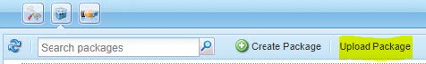
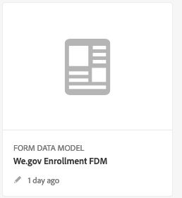

# De referentiesite Web.Gov en Web.Finance instellen en configureren {#set-up-and-configure-we-gov-reference-site}

## Details demopakket {#demo-package-details}

### Installatievereisten {#installation-prerequisites}

Dit pakket is gemaakt voor **AEM Forms 6.4 OSGI-auteur**, is getest en wordt daarom ondersteund op de volgende platformversies:

| AEM VERSIE | AEM FORMS PACKAGE VERSION | STATUS |
|---|---|---|
| 6,4 | 5,0,86 | **Ondersteund** |
| 6,5 | 6,0,80 | **Ondersteund** |
| 6.5.3. | 6,0,122 | **Ondersteund** |

Dit pakket bevat cloudconfiguratie die de volgende platformversies ondersteunt:

| PROVIDER CLOUD | SERVERSIE | STATUS |
|---|---|---|
| Adobe Sign | v5-API | **Ondersteund** |
| Microsoft® Dynamics 365 | 1710 (9.1.0.3020) | **Ondersteund** |
| Adobe Analytics | v1.4 Rest-API | **Ondersteund** |
**Overwegingen bij de installatie van pakketten:**

* Installeer het pakket op een schone server, zonder andere demopakketten of oudere demopakketversies.
* Installeer het pakket op een OSGI-server, in de modus Auteur.

### Wat bevat dit pakket {#what-does-this-package-include}

De [AEM Forms We.Gov-demopakket](https://experience.adobe.com/#/downloads/content/software-distribution/en/aem.html?package=/content/software-distribution/en/details.html/content/dam/aem/public/adobe/packages/cq650/featurepack/we-gov-forms.pkg.all-2.0.2.zip) (**we-gov-formulieren.pkg.all-&lt;version>.zip**) wordt geleverd als een pakket dat diverse andere subpakketten en diensten omvat. Het pakket bevat de volgende modules:

* **we-gov-formulieren.pkg.all-&lt;version>.zip** - *Volledig demopakket*

   * **we-gov-forms.ui.apps-&lt;version>.zip** *- Bevat alle componenten, clientbibliotheken, voorbeeldgebruikers, workflowmodellen enzovoort.*

      * **we-gov-forms.core-&lt;version>.jar** - *Bevat alle diensten OSGI, de implementatie van de douanewerkschemasstap, etc.*

      * **we-gov-forms.derby&lt;version>.jar** - *Bevat alle diensten OSGI, gegevensbestandschema, etc.*

      * **core.wcm.components.all-2.0.4.zip** - *Verzameling van WCM-monsters*

      * **grid-aem.ui.apps-1.0-SNAPSHOT.zip** - *AEM Sites Grid-lay-outpakket voor het kolombesturingselement voor sites*

   * **we-gov-forms.ui.content-&lt;version>.zip** - *Bevat alle inhoud, pagina&#39;s, afbeeldingen, formulieren, interactieve communicatiemiddelen enzovoort.*

   * **we-gov-forms.ui.analytics-&lt;version>.zip** - *Bevat alle gegevens van We.Gov Forms Analytics die in de opslagplaats moeten worden opgeslagen.*

   * **we-gov-forms.config.public-&lt;version>.zip** - *Bevat alle standaardconfiguratieknooppunten, inclusief de configuraties van de plaatsaanduidingswolk, om problemen met het gegevensmodel van formulieren en servicebinding te voorkomen.*

De elementen die in dit pakket zijn opgenomen, zijn:

* Sitepagina&#39;s AEM met bewerkbare sjablonen
* AEM Forms Adaptive Forms
* Interactieve AEM Forms-communicatie (Afdrukken en Webkanaal)
* AEM Forms XDP-document van record
* AEM Forms MS® Dynamics Forms Data Model
* Adobe Sign-integratie
* AEM workflowmodel
* AEM Assets-voorbeeldafbeeldingen
* Voorbeeld (in geheugen) Apache Derby Database
* Apache Derby Data Source (voor gebruik met formuliergegevensmodel)

## Installatie van demopakket {#demo-package-installation}

Deze sectie bevat informatie over het installeren van het demopakket.

### Van softwaredistributie {#from-software-distribution}

1. Openen [Softwaredistributie](https://experience.adobe.com/downloads). U hebt een Adobe ID nodig om u aan te melden bij de softwaredistributie.
1. Selecteren **[!UICONTROL Adobe Experience Manager]** beschikbaar in het koptekstmenu.
1. In de **[!UICONTROL Filters]** sectie:
   1. Selecteren **[!UICONTROL Forms]** van de **[!UICONTROL Solution]** vervolgkeuzelijst.
   2. Selecteer de versie en typ voor het pakket. U kunt ook de opdracht **[!UICONTROL Search Downloads]** om de resultaten te filteren.
1. Selecteer de **we-gov-formulieren.pkg.all-&lt;version>.zip** pakketnaam, selecteren **[!UICONTROL Accept EULA Terms]** en selecteert u **[!UICONTROL Download]**.
1. Openen [Pakketbeheer](https://experienceleague.adobe.com/docs/experience-manager-65/administering/contentmanagement/package-manager.html)  en klik op **[!UICONTROL Upload Package]** om het pakket te uploaden.
1. Selecteer het pakket en klik op **[!UICONTROL Install]**.

   

1. De installatie kan worden voltooid.
1. Navigeren naar *https://&lt;aemserver>:&lt;port>/content/we-gov/home.html?wcmmode=disabled* om ervoor te zorgen dat de installatie is gelukt.

### Vanuit een lokaal ZIP-bestand {#from-a-local-zip-file}

1. Download en zoek de **we-gov-formulieren.pkg.all-&lt;version>.zip** bestand.
1. Navigeren naar *https://&lt;aemserver>:&lt;port>/crx/packmgr/index.jsp*.
1. Selecteer de optie Pakket uploaden.

   

1. Gebruik de bestandsbrowser om naar het gedownloade ZIP-bestand te navigeren en dit te selecteren.
1. Klik op Openen om te uploaden.
1. Nadat u het pakket hebt geüpload, selecteert u de optie Installeren om het pakket te installeren.

   

1. De installatie kan worden voltooid.
1. Navigeren naar *https://&lt;aemserver>:&lt;port>/content/we-gov/home.html?wcmmode=disabled* om ervoor te zorgen dat de installatie is gelukt.

### Nieuwe pakketversies installeren {#installing-new-package-versions}

Voer de stappen in 4.1 en 4.2 uit om een nieuwe pakketversie te installeren. U kunt een nieuwere pakketversie installeren terwijl al een ander ouder pakket is geïnstalleerd, maar u wordt aangeraden de oudere pakketversie eerst te verwijderen. Volg de onderstaande stappen om dit te doen.

1. Navigeren naar *https://&lt;aemserver>:&lt;port>/crx/packmgr/index.jsp*
1. De map zoeken **we-gov-formulieren.pkg.all-&lt;version>.zip** bestand.
1. Selecteer de optie Meer.
1. Selecteer in het vervolgkeuzemenu de optie Verwijderen.

   

1. Selecteer bij bevestiging nogmaals &quot;Verwijderen&quot; en sta het verwijderingsproces toe.

## Configuratie demopakket {#demo-package-configuration}

Deze sectie bevat details en instructies over de configuratie na implementatie van het demopakket vóór de presentatie.

### Facultatieve gebruikersconfiguratie {#fictional-user-configuration}

1. Navigeren naar *https://&lt;aemserver>:&lt;port>/libs/granite/security/content/groupadmin.html*
1. Meld u aan als beheerder om de onderstaande taken uit te voeren.
1. Schuif omlaag naar het einde van de pagina om alle gebruikersgroepen te laden.
1. Zoeken naar &quot;**werkstroom**&quot;.
1. Selecteer &quot;**workflowgebruikers**&quot; en klik op Eigenschappen.
1. Ga naar het tabblad &quot;Leden&quot;.
1. Type in **wegov** in het veld Gebruiker of groep selecteren.
1. Selecteren in het vervolgkeuzemenu &quot;**We.Gov Forms-gebruikers**&quot;.

   

1. Klik op Opslaan en sluiten op de menubalk.
1. Herhaal stap 2-7 door te zoeken naar &quot;**analyse**&quot;, selecteert u de &quot;**Analysebeheerders**&quot; en voegt &quot;**We.Gov Forms-gebruikers**&quot;groeperen als lid.
1. Herhaal stap 2-7 door te zoeken naar &quot;**formuliergebruikers**&quot;, selecteert u de &quot;**formulieren-grootgebruikers**&quot; en voegt &quot;**We.Gov Forms-gebruikers**&quot;groeperen als lid.
1. Herhaal stap 2-7 door te zoeken naar &quot;**formulieren-gebruikers**&quot;, selecteert u de &quot;**formulieren-gebruikers**&quot; en voegt nu &quot;**Wij.Gov-gebruikers**&quot;groeperen als lid.

### Configuratie van e-mailserver {#email-server-configuration}

1. Documentatie voor installatie van revisie [E-mailmelding configureren](/help/sites-administering/notification.md)
1. Meld u aan als beheerder voor deze taak.
1. Navigeren naar *https://&lt;aemserver>:&lt;port>/system/console/configMgr*
1. Ga naar de **Day CQ Mail Service** service voor configureren.

   

1. Vorm de dienst om met de server SMTP van uw keus te verbinden:

   1. **hostnaam SMTP-server**: bijvoorbeeld (smtp.gmail.com)
   1. **Serverpoort**: bijvoorbeeld (465) voor gmail met SSL
   1. **SMTP-gebruiker:** demo@ &lt;companyname> .com
   1. **Adres &quot;Van&quot;**: aemformsdemo@adobe.com

   

1. Klik &quot;sparen&quot;om de configuratie te bewaren.

### (Optioneel) AEM SSL-configuratie {#aemsslconfig}

Deze sectie bevat informatie over het configureren van SSL op de AEM om de Adobe Sign Cloud-configuratie te kunnen configureren.

**Referenties:**

1. [Standaard SSL](/help/sites-administering/ssl-by-default.md)

**Opmerkingen:**

1. Ga naar https://&lt;aemserver>:&lt;port>/aem/inbox waar u het proces kunt voltooien dat in de verwijzing documentatiekoppeling hierboven wordt verklaard.
1. De `we-gov-forms.pkg.all-[version].zip` pakket bevat een voorbeeld-SSL-sleutel en -certificaat dat u kunt openen door het pakket uit te pakken `we-gov-forms.pkg.all-[version].zip/ssl` map die deel uitmaakt van het pakket.

1. SSL-certificaat en sleutelgegevens:

   1. uitgegeven aan &quot;CN=localhost&quot;
   1. 10 jaar geldig
   1. password value of &quot;password&quot;
1. De persoonlijke sleutel is *localhostprivate.der*.
1. Het certificaat is *localhost.crt*.
1. Klik op Volgende.
1. HTTPS Hostname zou moeten worden geplaatst aan *localhost*.
1. De haven zou aan een haven moeten worden geplaatst die het systeem heeft blootgesteld.

### (Optioneel) Adobe Sign-cloudconfiguratie {#adobe-sign-cloud-configuration}

Deze sectie bevat informatie en instructies over de Adobe Sign Cloud Configuration.

**Referenties:**

1. [Adobe Sign integreren met AEM Forms](adobe-sign-integration-adaptive-forms.md)

#### Cloud-configuratie {#cloud-configuration}

1. Controleer de voorwaarden. Zie [SSL-configuratie AEM](../../forms/using/forms-install-configure-gov-reference-site.md#aemsslconfig) voor de vereiste SSL-configuratie.
1. Navigeren naar:

   *https://&lt;aemserver>:&lt;port>/libs/adobesign/cloudservices/adobesign.html/conf/we-gov*

   >[!NOTE]
   >
   >De URL die wordt gebruikt voor toegang tot de AEM server moet overeenkomen met de URL die is geconfigureerd in de Adobe Sign OAuth Redirect URI om configuratieproblemen te voorkomen (bijvoorbeeld *https://&lt;aemserver>:&lt;port>/mnt/overlay/adobesign/cloudservices/adobesign/properties.html*)

1. Selecteer de configuratie &quot;We.gov Adobe Sign&quot;.
1. Klik op &quot;Eigenschappen&quot;.
1. Navigeer naar het tabblad &quot;Instellingen&quot;.
1. Voer bijvoorbeeld de URL Auth in: [https://secure.na1.echosign.com/public/oauth](https://secure.na1.echosign.com/public/oauth)
1. Verstrek gevormde identiteitskaart van de Cliënt en Geheime cliënt van de gevormde instantie van Adobe Sign.
1. Klik op &quot;Verbinding maken met Adobe Sign&quot;.
1. Klik na een geslaagde verbinding op &quot;Opslaan en sluiten&quot; om de integratie te voltooien.

### (Optioneel) MS® Dynamics cloud configuration {#ms-dynamics-cloud-configuration}

Deze sectie bevat details en instructies over de Configuratie van de Dynamica Cloud MS®.

**Referenties:**

1. [Microsoft](/help/forms/using/ms-dynamics-odata-configuration.md)
1. [Microsoft® Dynamics for AEM Forms configureren](https://experienceleague.adobe.com/docs/experience-manager-learn/forms/adaptive-forms/using-ms-dynamics-with-aem-forms.html)

#### MS® Dynamics OData cloudservice {#ms-dynamics-odata-cloud-service}

1. Navigeren naar:

   https://&lt;aemserver>:&lt;port>/libs/fd/fdm/gui/components/admin/fdmcloudservice/fdm.html/conf/we-gov

   1. Zorg ervoor dat u de server opent met dezelfde omleidings-URL als die is geconfigureerd in de registratie van de MS® Dynamics-toepassing.

1. Selecteer de configuratie van de &quot;Microsoft® Dynamics OData Cloud Service&quot;.
1. Klik op &quot;Eigenschappen&quot;.

   

1. Navigeer naar het tabblad &#39;Verificatie-instellingen&#39;.
1. Voer de volgende gegevens in:

   1. **Hoofdmap service:** bijvoorbeeld: `https://msdynamicsserver.api.crm3.dynamics.com/api/data/v9.1/`
   1. **Type verificatie:** OAuth 2.0
   1. **Verificatie-instellingen** (zie [Configuratie-instellingen voor de cloud MS® Dynamics](../../forms/using/forms-install-configure-gov-reference-site.md#dynamicsconfig) om deze informatie te verzamelen):

      1. Client-id - ook wel toepassings-id genoemd
      1. Clientgeheim
      1. OAuth URL - bijvoorbeeld [https://login.microsoftonline.com/common/oauth2/authorize](https://login.microsoftonline.com/common/oauth2/authorize)
      1. Token-URL vernieuwen - bijvoorbeeld [https://login.windows.net/common/oauth2/token](https://login.windows.net/common/oauth2/token)
      1. Toegang krijgen tot token-URL, bijvoorbeeld [https://login.windows.net/common/oauth2/token](https://login.windows.net/common/oauth2/token)
      1. Autorisatiebereik - **openhartig**
      1. Verificatiekoptekst - **Vergunninghouder**
      1. Bron - bijvoorbeeld `https://msdynamicsserver.api.crm3.dynamics.com`

   1. Klik op &quot;Verbinding maken met OAuth&quot;.

1. Na succesvolle verificatie klikt u op &quot;Opslaan en sluiten&quot; om de integratie te voltooien.

#### Configuratie-instellingen voor de cloud MS® Dynamics {#dynamicsconfig}

De stappen die in dit gedeelte worden beschreven, zijn inbegrepen om u te helpen bij het zoeken naar de client-id, het clientgeheim en details van uw MS® Dynamics Cloud-instantie.

1. Navigeren naar [https://portal.azure.com/](https://portal.azure.com/) en aanmelden.
1. Selecteer Alle services in het linkermenu.
1. Zoek of navigeer naar &quot;Toepassingsregistratie&quot;.
1. Maak of selecteer een bestaande toepassingsregistratie.
1. De **Toepassings-id** te gebruiken als OAuth **Client-id** in de AEM cloudconfiguratie
1. Klik op &quot;Instellingen&quot; of &quot;Manifest&quot; om het **Reageer URL&#39;s.**

   1. Deze URL moet overeenkomen met de URL die wordt gebruikt om toegang te krijgen tot uw AEM server wanneer de OData-service wordt geconfigureerd.

1. Klik in de weergave Instelling op &quot;Toetsen&quot; om een nieuwe toets weer te geven (deze toets wordt gebruikt als het clientgeheim in AEM ).

   1. Zorg ervoor dat u een kopie van de sleutel bewaart, omdat u deze later niet in Azure of AEM kunt bekijken.

1. Navigeer naar het dashboard voor de instantie MS® Dynamics om de URL van de hoofdmap van de bron/service te zoeken.
1. Klik in de bovenste navigatiebalk op &quot;Verkoop&quot; of op uw eigen instantietype en &quot;Instellingen selecteren&quot;.
1. Klik &quot;Aanpassingen&quot;en &quot;de Middelen van de Ontwikkelaar&quot;dichtbij het bodemrecht.
1. Hier vindt u de hoofdmap van de service: bijvoorbeeld

   *`https://msdynamicsserver.api.crm3.dynamics.com/api/data/v9.1/`

1. Hier vindt u meer informatie over de URL van het token Vernieuwen en Toegangstoken:

   *[https://learn.microsoft.com/en-us/rest/api/datacatalog/authenticate-a-client-app](https://learn.microsoft.com/en-us/rest/api/datacatalog/authenticate-a-client-app)*

#### Het Forms-gegevensmodel testen (Dynamics) {#testing-the-form-data-model}

Nadat de cloudconfiguratie is voltooid, wilt u mogelijk het gegevensmodel van het formulier testen.

1. Navigeren naar

   *https://&lt;aemserver>:&lt;port>/aem/forms.html/content/dam/formsanddocuments-fdm/we-gov*

1. Selecteer &quot;We.gov Microsoft® Dynamics CRM FDM&quot; en selecteer &quot;Eigenschappen&quot;.

   

1. Navigeer naar het tabblad Bron bijwerken.
1. Zorg ervoor dat de &quot;Context-Aware Configuratie&quot;aan &quot;/conf/wij-gov&quot;wordt geplaatst en dat de gevormde gegevensbron &quot;ms-dynamics-odata-cloud-dienst is&quot;.

   

1. Bewerk het formuliergegevensmodel.

1. Test de diensten om ervoor te zorgen zij met succes met de gevormde Gegevensbron verbinden.

   >[!NOTE]
   >
   Nadat u de services hebt getest, klikt u op **Annuleren** om ervoor te zorgen dat onvrijwillige wijzigingen niet worden doorgegeven aan het formuliergegevensmodel.

   >[!NOTE]
   >
   Er is gemeld dat een AEM Server opnieuw opstarten vereist was voor de gegevensbron om met succes aan FDM te binden.

   >[!NOTE]
   >
   Het wordt aanbevolen de SDK opnieuw te starten met de opdracht &#39;Ctrl + C&#39;. Het opnieuw opstarten van de AEM SDK met behulp van alternatieve methoden, bijvoorbeeld het stoppen van Java-processen, kan leiden tot inconsistenties in de AEM ontwikkelomgeving.

#### Het Forms-gegevensmodel testen (Derby) {#test-fdm-derby}

Nadat de cloudconfiguratie is voltooid, wilt u mogelijk het gegevensmodel van het formulier testen.

1. Navigeren naar *https://&lt;aemserver>:&lt;port>/aem/forms.html/content/dam/formsanddocuments-fdm/we-gov*

1. Selecteer de **We.gov Inschrijving FDM** en selecteert u **Eigenschappen**.

   

1. Ga naar de **Bron bijwerken** tab.

1. Zorg ervoor dat de **Contextbewuste configuratie** is ingesteld op `/conf/we-gov` en dat de gevormde gegevensbron is **We.Gov Derby DS**.

   

1. Klikken **Opslaan en sluiten**.

1. [De services testen](work-with-form-data-model.md#test-data-model-objects-and-services) om ervoor te zorgen dat deze verbinding maken met de geconfigureerde gegevensbron

   * Als u de verbinding wilt testen, selecteert u de **HOMEMORTGAGEACCOUNT** en geef het een dienst. Test de dienst en de systeembeheerders kunnen gegevens zien die worden teruggewonnen.

### Adobe Analytics (optioneel) {#adobe-analytics-configuration}

Deze sectie bevat details en instructies over de Configuratie van Adobe Analytics Cloud.

**Referenties:**

* [Integreren met Adobe Analytics](../../sites-administering/adobeanalytics.md)

* [Verbinding maken met Adobe Analytics en frameworks maken](../../sites-administering/adobeanalytics-connect.md)

* [Gegevens van paginaanalyse bekijken](../../sites-authoring/pa-using.md)

* [Analyses en rapporten configureren](configure-analytics-forms-documents.md)

* [AEM Forms-analyserapporten weergeven en begrijpen](view-understand-aem-forms-analytics-reports.md)

### Adobe Analytics Cloud-serviceconfiguratie {#adobe-analytics-cloud-service-configuration}

Dit pakket wordt vooraf geconfigureerd voor verbinding met Adobe Analytics. De stappen hieronder worden verstrekt om deze configuratie toe te staan om worden bijgewerkt.

1. Navigeren naar *https://&lt;aemserver>:&lt;port>/libs/cq/core/content/tools/cloudservices.html*
1. Zoek de sectie Adobe Analytics en selecteer de koppeling &quot;Configuraties tonen&quot;.
1. Selecteer de configuratie &quot;We.Gov Adobe Analytics (Analytics Configuration)&quot;.

   

1. Klik op de knop Bewerken om de Adobe Analytics-configuratie bij te werken (u moet het Gedeelde geheim opgeven). Klik op &quot;Verbinden met Analytics&quot; om verbinding te maken en op &quot;OK&quot; om de verbinding te voltooien.

   

1. Klik op dezelfde pagina op &quot;We.Gov Adobe Analytics Framework (Analytics Framework)&quot; als u de frameworkconfiguraties wilt bijwerken (zie [AEM maken inschakelen](../../forms/using/forms-install-configure-gov-reference-site.md#enableauthoring) om Authoring in te schakelen).

#### Adobe Analytics Locating User Credentials {#analytics-locating-user-credentials}

Als u de gebruikersgegevens van een Adobe Analytics-account wilt zoeken, moet de accountbeheerder de volgende taken uitvoeren.

1. Navigeer naar de Adobe Experience Cloud-portal.
   * Aanmelden met uw beheerdersreferenties
1. Selecteer het Adobe Analytics-pictogram in het hoofddashboard.
   
1. Navigeer naar het tabblad Beheer en selecteer de optie Gebruikersbeheer (Verouderd)
   
1. Selecteer de **Gebruikers** tab.
   
1. Selecteer de gewenste gebruiker in de lijst met gebruikers.
1. Blader naar de onderkant van de pagina en de verificatiegegevens van de gebruikers worden onder aan de pagina weergegeven.
   
1. De gebruikersbenaming en de gedeelde geheime informatie verschijnen op de rechterkant van de toestemmingendoos.
1. De gebruikersnaam heeft een dubbele punt binnen de naam, alle informatie op de linkerzijde van de dubbele punt is de gebruikersbenaming, en alle informatie op de rechterkant van de dubbele punt zal de bedrijfsnaam zijn.
   * Hier is een voorbeeld van: *username : bedrijfsnaam*

#### Gebruikersverificatie instellen in Adobe Analytics {#setup-user-authentication}

Beheerders kunnen gebruikers AEM analysebevoegdheden verlenen door de volgende handelingen uit te voeren.

1. Navigeer naar de Adobe Admin Console.

1. Klik op de instantie Analytics die aan de Admin Console wordt blootgesteld.

   * Deze bevindt zich op de hoofdpagina van de beheerpagina.

1. Selecteer Analytics voor volledige beheerdersrechten.

1. Voeg een gebruiker aan het Profiel toe.

   

1. Klik op het tabblad Machtigingen nadat de gebruiker-id is toegewezen aan het profiel.

1. Controleer of alle machtigingen zijn toegewezen aan het profiel.

   

1. Nadat de machtigingen zijn toegewezen over de mogelijkheid dat een gebruiker zich aanmeldt, kan dit enkele uren duren.

### Adobe Analytics-rapportage {#adobe-analytics-reporting}

#### Adobe Analytics-sites weergeven {#view-adobe-analytics-sites-reporting}

>[!NOTE]
>
AEM Forms Analytics-gegevens zijn offline of zonder Adobe Analytics Cloud-configuratie beschikbaar als de `we-gov-forms.ui.analytics-<version>.zip` -pakket is geïnstalleerd, maar voor AEM Sites-gegevens is een actieve cloudconfiguratie vereist.

1. Navigeren naar *https://&lt;aemserver>:&lt;port>/sites.html/content*
1. Selecteer de &quot;AEM Forms We.Gov-site&quot; om de sitepagina&#39;s weer te geven.
1. Selecteer een van de sitepagina&#39;s (bijvoorbeeld Home) en kies &quot;Analytics &amp; Recommendations&quot;.

   

1. Op deze pagina wordt opgehaalde informatie van Adobe Analytics weergegeven die betrekking heeft op de AEM Sites-pagina (opmerking: deze informatie wordt door het ontwerp periodiek vernieuwd vanuit Adobe Analytics en wordt niet in real-time weergegeven).

   

1. Terug op de pagina van de paginamening (betreden in stap 3.), kunt u de informatie van de paginamening ook bekijken door de vertoning te veranderen die punten in de &quot;Mening van de Lijst&quot;plaatst te bekijken.
1. Zoek het vervolgkeuzemenu Weergave en selecteer Lijstweergave.

   

1. Selecteer in hetzelfde menu de optie Weergave-instelling en selecteer de kolommen die u wilt weergeven in de sectie Analytics.

   

1. Klik op &quot;Bijwerken&quot; om de nieuwe kolommen beschikbaar te maken.

   

#### Rapporten van Adobe Analytics-formulieren weergeven {#view-adobe-analytics-forms-reporting}

>[!NOTE]
>
AEM Forms Analytics-gegevens zijn offline of zonder Adobe Analytics Cloud-configuratie beschikbaar als de `we-gov-forms.ui.analytics-<version>.zip` -pakket is geïnstalleerd, maar voor AEM Sites-gegevens is een actieve cloudconfiguratie vereist.

1. Navigeren naar

   *https://&lt;aemserver>:&lt;port>/aem/forms.html/content/dam/formsanddocuments/adobe-gov-forms*

1. Selecteer het adaptieve formulier &quot;Inschrijvingsaanvraag voor gezondheidsvoordelen&quot; en selecteer de optie &quot;Analyserapport&quot;.

   

1. Wacht tot de pagina is geladen en bekijk de gegevens in het Analysapport.

   

### Adobe Automated Forms Configuration Enablement {#automated-forms-enablement}

Voor het installeren en configureren van AEM Forms met de Adobe Forms moeten gebruikers van het gereedschap Conversie het volgende hebben.

1. Toegang tot Adobe Developer.

1. Toestemming om een integratie met de Conversieservice van Adobe Forms tot stand te brengen.

1. Adobe AEM 6.5 nieuwste servicepack die als auteur wordt uitgevoerd.

Lees het volgende voordat u verdere instructies leest:

* [De service voor automatische conversie van formulieren configureren](https://experienceleague.adobe.com/docs/aem-forms-automated-conversion-service/using/configure-service.html)

#### Een IMS-configuratie maken, deel 1 {#creating-ims-config}

Gebruikers moeten de service Identity Management System (IMS) configureren om te kunnen registreren bij Adobe I/O om de service zodanig te configureren dat de juiste communicatie met het gereedschap voor het converteren van formulieren mogelijk is.

1. Ga naar https://&lt;aemserver>:&lt;port> > Klik linksboven op Adobe Experience Manager > Gereedschappen > Beveiliging > Adobe IMS-configuratie.

1. Klik op Maken.

1. Voer de handelingen uit in de onderstaande afbeelding.

   

1. Download het certificaat.

1. Ga niet verder met de rest van de configuratie - revisiesectie [Integratie in Adobe I/O maken](#create-integration-adobeio)

>[!NOTE]
>
Het certificaat dat in deze sectie wordt gemaakt, wordt gebruikt om de integratieservice in Adobe I/O te maken. Zodra de gebruikers in de integratieservice hebben gecreeerd kunnen de gebruikers die informatie van Adobe I/O gebruiken om de configuratie te beëindigen.

#### Integratie in Adobe I/O maken {#create-integration-adobeio}

Zorg ervoor u de capaciteit hebt om een integratie binnen uw domein van de Adobe tot stand te brengen als u niet uw systeembeheerder contacteert dit.

1. Ga naar de [Adobe I/O-console](https://developer.adobe.com/console/).

1. Klik op Integratie maken.

1. Selecteer Toegang tot een API.

1. Zorg ervoor dat u zich in de juiste groep bevindt (vervolgkeuzelijst rechtsboven).

1. Selecteer in de sectie Experience Cloud het gereedschap Forms-omzetting.

1. Klik op Doorgaan.

1. Voer de naam en beschrijving van uw integratie in.

1. Als u de openbare sleutel uit paragraaf 2.1 gebruikt, plaatst u deze in de integratie van de sleutel.

1. Selecteer een profiel voor uw automatede form conversion.

   

#### IMS-configuratiedeel 2 maken {#create-ims-config-part-next}

Nu u een integratie hebt gecreeerd laten ons de installatie van de configuratie voltooien IMS.

1. Klik op uw integratie in Adobe I/O om de verbindingsgegevens weer te geven.

1. Ga naar de IMS-configuratie in AEM (Gereedschappen > Beveiliging > IMS)

1. Klik op Volgende in het scherm IMS Configuration.

1. Voer de verificatieserver in (de waarde die in de schermafbeelding wordt weergegeven).

1. Voer de API-sleutel in.

1. Ga het cliëntgeheim in (moet klikken blootstellen op de Integratie in Adobe I/O om het te onthullen).

1. Klik op het tabblad JWT in Adobe I/O om de JWT-payload op te halen en plak deze in de payload van de IMS-configuratie.

   

1. Nadat u de IMS-configuratie hebt gemaakt, klikt u op de IMS-configuratie en selecteert u Health Check. Gebruikers zien dan het volgende resultaat.

   

#### Cloud Configuration (Wij.Gov AFC-productie) configureren {#configure-cloud-configuration}

Nadat de IMS-configuratie is voltooid, kunt u de wolkenconfiguratie in AEM controleren. Als de configuratie niet bestaat, gebruikt u de volgende stappen om de wolkenconfiguratie in AEM tot stand te brengen:

1. Open uw browser en navigeer naar de URL van het systeem https://&lt;domain_name>:&lt;system_port>

1. Klik op Adobe Experience Manager in de linkerbovenhoek van het scherm > Gereedschappen > Cloud Servicen > Automated Forms Conversation Configuration.

1. Selecteer de configuratiemap waarin u de configuratie wilt plaatsen.

1. Klik op Maken.

1. Voer de gegevens in de onderstaande schermafbeelding in.

   

1. Geef de configuratie een titel en een naam.

1. De service-URL voor het systeem is ingesteld op https://aemformsconversion.adobe.io/.

1. URL van sjabloon */conf/we-gov/settings/wcm/templates/we-gov-flamingo-template*.

1. URL thema: */content/dam/formsanddocuments-themes/adobe-gov-forms-themes/we-gov-theme*

1. Klik op Volgende.

1. Voor deze configuratie, verlaten wij de twee checkbox waarden leeg.

   * Zie voor meer informatie over deze opties [De cloudservice configureren](https://experienceleague.adobe.com/docs/aem-forms-automated-conversion-service/using/configure-service.html#configure-the-cloud-service).

#### Cloud Configuration (wij.Finance AFC Production) configureren {#configure-cloud-configuration-wefinance}

Zodra de configuratie IMS volledig is, kunnen wij te werk gaan om de wolkenconfiguratie in AEM tot stand te brengen.

1. Open uw browser en navigeer naar de URL van het systeem https://&lt;domain_name>:&lt;system_port>

1. Klik op Adobe Experience Manager in de linkerbovenhoek van het scherm > Gereedschappen > Cloud Servicen > Automated Forms Conversation Configuration.

1. Selecteer de configuratiemap waarin u de configuratie wilt plaatsen.

1. Klik op Maken.

1. Voer de gegevens in de onderstaande schermafbeelding in.

   

1. Geef de configuratie een titel en een naam.

1. De service-URL voor het systeem is ingesteld op https://aemformsconversion.adobe.io/

1. URL sjabloon: */conf/we-finance/settings/wcm/templates/we-finance-adaptive-form*

1. URL thema: */content/dam/formsanddocuments-themes/adobe-finance-forms-themes/we-finance-theme*

1. Klik op Volgende.

1. Voor deze configuratie, verlaten wij de twee checkbox waarden leeg.

   * Zie voor meer informatie over deze opties [De cloudservice configureren](https://experienceleague.adobe.com/docs/aem-forms-automated-conversion-service/using/configure-service.html#configure-the-cloud-service).

#### De formulierconversie testen (Web.Gov-inschrijvingstoepassing) {#test-forms-conversion}

Wanneer de configuratie is ingesteld, kunnen gebruikers deze testen door een PDF-document te uploaden.

1. Ga naar het AEM https://&lt;domain_name>:&lt;system_port>

1. Klik op Forms > Forms &amp; Documents > AEM Forms We.gov Forms > AFC.

1. Selecteer de PDF van de Toepassing van de Inschrijving Web.Gov.

1. Klikken **Geautomatiseerde omzetting starten** in de rechterbovenhoek.

1. Gebruikers moeten de optie kunnen zien zoals hieronder wordt weergegeven.

   

1. Zodra de knop is geselecteerd, krijgen gebruikers de volgende opties te zien

   * Zorg ervoor dat gebruikers de optie *We.GOV AFC-productie* configuratie

   

   

1. Selecteer de beginomzetting nadat u alle opties hebt gevormd die u wilt gebruiken.

1. Wanneer het conversieproces begint, moeten gebruikers het volgende scherm zien:

   

1. Wanneer de conversie is voltooid, zien gebruikers het volgende scherm:

   

   Klik op de knop **Uitvoer** om het gegenereerde adaptieve formulier weer te geven.

#### Bekende problemen en notities {#known-issues-notes}

De dienst van de Automatede form conversion omvat bepaalde [best practices, bekende complexe patronen](https://experienceleague.adobe.com/docs/aem-forms-automated-conversion-service/using/styles-and-pattern-considerations-and-best-practices.html), en [bekende problemen](https://experienceleague.adobe.com/docs/aem-forms-automated-conversion-service/using/known-issues.html). Bekijk deze voordat je AEM Forms Automatede form conversion-service gaat gebruiken.

1. Genereer het formulier met Aangepaste formulieren genereren zonder gegevensbindingen ingeschakeld als u het formulier na conversie aan een FDM wilt binden.

1. Zorg ervoor dat de sjabloonmap jcr:read voor iedereen machtiging heeft ingeschakeld, anders kan de gebruiker de sjabloon niet lezen uit de opslagplaats en mislukt de conversie.

## Aanpassing van demopakket {#demo-package-customizations}

Deze sectie bevat instructies voor het aanpassen van de demo.

### Aanpassing sjablonen {#templates-customization}

Bewerkbare sjablonen vindt u op de volgende locatie:

*https://&lt;aemserver>:&lt;port>/libs/wcm/core/content/sites/templates.html/conf/we-gov*

Deze sjablonen bevatten de sjablonen AEM Site, Adaptief formulier en Interactieve communicatie, die zijn gemaakt en samengesteld met componenten die u kunt vinden op:

*https://&lt;aemserver>:&lt;port>/crx/de/index.jsp#/apps/we-gov/components*

#### Stijlsysteem {#customizetemplates}

Deze site bevat ook clientbibliotheken, waarvan er één Bootstrap 4 importeert ( [https://getbootstrap.com/](https://getbootstrap.com/) ). Deze clientbibliotheek is beschikbaar op

*https://&lt;aemserver>:&lt;port>/crx/de/index.jsp#/apps/we-gov/clientlibs/clientlib-base/css/bootstrap*

De bewerkbare sjablonen in dit pakket zijn ook vooraf geconfigureerd met sjabloon-/paginabeleid dat de Bootstrap 4 CSS-klassen gebruikt voor paginering, opmaak enzovoort. Niet alle klassen zijn toegevoegd aan het sjabloonbeleid, maar elke klasse die door Bootstrap 4 wordt ondersteund, kan aan het beleid worden toegevoegd. Zie de pagina Aan de slag voor een lijst met beschikbare klassen:

[https://getbootstrap.com/docs/4.1/getting-started/introduction/](https://getbootstrap.com/docs/4.1/getting-started/introduction/)

Sjablonen in dit pakket ondersteunen ook het stijlsysteem:

[Stijlsysteem](../../sites-authoring/style-system.md)

#### Sjabloonlogo&#39;s {#template-logos}

DAM-projectelementen omvatten onder andere Wij.Gov-logo&#39;s en -afbeeldingen. Deze activa zijn beschikbaar op:

*https://&lt;aemserver>:&lt;port>/assets.html/content/dam/we-gov*

Wanneer u de pagina- en formuliersjablonen bewerkt, kunt u de logo&#39;s van een merk bijwerken door de navigatie- en voettekstcomponenten te bewerken. Deze componenten bieden een configureerbaar merk- en logodialoogvenster dat kan worden gebruikt om logo&#39;s bij te werken:

Zie Pagina-inhoud bewerken voor meer informatie:

[Pagina-inhoud bewerken](../../sites-authoring/editing-content.md)

### Aanpassing sitepagina&#39;s {#sites-pages-customization}

Alle sitepagina&#39;s zijn beschikbaar via: *https://&lt;aemserver>:&lt;port>/sites.html/content/we-gov*

Deze sitepagina&#39;s gebruiken ook het pakket AEM raster om de lay-out van een paar componenten te bepalen.

#### Stijlsysteem {#style-system}

Pagina&#39;s die in dit pakket zijn opgenomen, ondersteunen ook het stijlsysteem:

[Stijlsysteem](../../sites-authoring/style-system.md)

U kunt ook [Sjablonen aanpassen, stijlsysteem](../../forms/using/forms-install-configure-gov-reference-site.md#customizetemplates) voor documentatie over ondersteunde stijlen.

### Aanpassing van adaptieve formulieren {#adaptive-forms-customization}

Alle adaptieve formulieren zijn beschikbaar op:

*https://&lt;aemserver>:&lt;port>/aem/forms.html/content/dam/formsanddocuments/adobe-gov-forms*

Deze formulieren kunnen worden aangepast aan bepaalde gebruiksgevallen. Bepaalde velden en verzendlogica moeten niet worden gewijzigd om ervoor te zorgen dat het formulier correct blijft functioneren. Dit omvat:

**Inschrijvingsaanvraag voor gezondheidsvoordelen:**

* contact_id - Verborgen veld dat wordt gebruikt om de contact-id van MS® Dynamics tijdens verzending te ontvangen
* Verzenden - Voor verzenden is aanpassing van knoplogica vereist ter ondersteuning van callbacks. De aanpassing wordt gedocumenteerd, maar een groot manuscript werd vereist om de vorm voor te leggen terwijl het uitvoeren van zowel een POST als GET verrichting aan de Dynamica MS® door middel van het Model van Gegevens van Forms.
* Het Comité van de wortel - de gebeurtenis initialiseert wordt gebruikt om een knoop van de Dynamica MS® aan AEM Inbox op de minst indringende manier toe te voegen mogelijk aangezien alle AEM componenten van de Vergroting UI van Inbox niet-wijzigbaar zijn.

#### Adaptieve formulieropmaak {#adaptive-form-styling}

U kunt adaptieve formulieren ook opmaken met de Stijleditor of de themaeditor:

* [Inline styling van adaptieve formuliercomponenten](inline-style-adaptive-forms.md)
* [Thema&#39;s maken en gebruiken](themes.md)

### Workflowaanpassing {#workflow-customization}

Het Aangepaste formulier voor inschrijving wordt voor verwerking naar een OSGI-workflow verzonden. Deze workflow is te vinden op *https://&lt;aemserver>:&lt;port>/conf/we-gov/settings/models/we-gov-process.html*.

Vanwege bepaalde beperkingen bevat deze workflow diverse scripts en aangepaste stappen voor het proces van de OSGI-workflow. Deze workflowstappen zijn gemaakt als algemene stappen en zijn niet gemaakt met configuratievensters. Momenteel is de configuratie van de workflowstappen afhankelijk van procesargumenten.

Alle workflowstap Java™-code is opgenomen in de **we-gov-forms.core-&lt;version>.jar** bundel.

## Demomogelijkheden en bekende problemen {#demo-considerations-and-known-issues}

Deze sectie bevat informatie over demo-functies en ontwerpbeslissingen die tijdens het demonstratieproces speciale aandacht behoeven.

### Demooverwegingen {#demo-considerations}

* Conform AGRS-159, zorg ervoor dat de naam (eerste, midden, en laatste) van het contact in de Aangepaste Vorm van de Inschrijving wordt gebruikt uniek is.
* Met het adaptieve inschrijvingsformulier wordt de e-mail van de Adobe Sign verzonden naar de e-mail die is opgegeven in het e-mailveld van het formulier. Dit e-mailadres mag niet hetzelfde e-mailadres zijn als het e-mailadres dat wordt gebruikt om de configuratie van de Adobe Sign-cloud te configureren.

### Bekende problemen {#known-issues}

* (AGRS-120) De component van de Navigatie van de Plaats steunt momenteel geen genestelde kindpagina&#39;s die meer dan twee niveaus diep zijn.
* (AGRS-159) De huidige FDM van de Dynamiek MS® moet twee handelingen eerst uitvoeren, de Adaptieve gegevens van de Vorm van de Inschrijving aan Dynamiek POSTEN, en dan het gebruikersverslag halen om identiteitskaart van het Contact terug te winnen. In zijn huidige staat, ontbreekt het halen van identiteitskaart van het Contact als meer dan twee gebruikers met de zelfde naam in Dynamiek aanwezig zijn, die niet de Aangepaste Vorm van de Inschrijving zal toestaan om voor te leggen.

## Toegankelijkheidstests configureren {#configure-accessibility-testing}

### Chrome voor toegankelijkheidstest inschakelen bij {#enable-chrome-add-on}

Installeer de Chrome-plug-in op `https://chrome.google.com/webstore/detail/accessibility-developer-t/fpkknkljclfencbdbgkenhalefipecmb?hl=en`. <!-- This URL is a 404. As such, fix and update this entire topic. We ought not to be writing about third-party software that we have no control over to avoid these 404s. Consider making this topic entirely generic and leaving it up to the user to choose their own Accessibility Testing add-on. -->

Nadat de pagina is geïnstalleerd, laadt u de pagina die u wilt testen in de Chrome-browser (Opmerking: wanneer meerdere tabbladen zijn geopend, heeft dit mogelijk invloed op de score. U kunt beter maar één tab openen). Nadat de pagina is geladen, **rechtsklikken** op de pagina en selecteer **Audits** tab. Er kunnen ontwikkelaars het type controle selecteren dat door de insteekmodule Toegankelijkheid moet worden uitgevoerd. Nadat alle gewenste opties zijn geselecteerd, kan de gebruiker op de knop Rapport genereren klikken. Hiermee wordt een PDF-document gegenereerd dat de algemene toegankelijkheidsscore weergeeft en wat kan worden gebruikt om de score voor toegankelijkheid in het algemeen te verhogen.

Nadat het rapport in werking wordt gesteld, kunnen de gebruikers het volgende verwachten te zien:

Het nummer dat voor gebruikers wordt weergegeven, is de algemene toegankelijkheidsscore die ze hebben behaald. Er is ook een beschrijving van hoe dit na de score werd berekend.

Als gebruikers dit willen exporteren, kunnen ze op de drie knoppen rechts van het scherm klikken en een van de andere opties selecteren die de plug-in biedt.

### Ultramarijnthema {#ultramarine-theme}

Het algemeen beschikbare Ultramarinesthema dat door de Adobe wordt onderhouden, is opgenomen in het
`we-gov-forms.pkg.all-<version>.zip` installeerbaar ZIP-bestand. Zodra dit pakket is geïnstalleerd met behulp van CRX.

Pakketbeheer, gebruikers hebben toegang tot het Ultramarine-thema in AEM Forms door naar **Forms** > **Thema&#39;s** > **Referentiethema&#39;s** > **Ultramarijntoegankelijk**.

## Configuratieopties {#configuration-options}

Gebruikers kunnen verschillende workflowserviceopties configureren, waaronder:

1. Microsoft® Dynamics Entry
1. Adobe Sign
1. Aangepast communicatiebeheer AEM
1. Adobe Analytics

Om hen te vormen om binnen het Werkschema worden toegelaten, moeten de gebruikers de volgende taken uitvoeren.

1. Ga naar https://&#39;[server]:[poort]&quot;/system/console/configMgr.

1. Zoek de *WeGov-configuraties*.

1. Open de de dienstdefinitie en laat de geselecteerde diensten toe om binnen het werkschema worden aangehaald.

   >[!NOTE]
   >
   Enkel omdat een gebruiker de dienst binnen de pagina van de Manager van de Configuratie toelaat, worden de gebruikers nog vereist aan opstelling een de dienstconfiguratie om met de externe gevraagde diensten te communiceren.

   

1. Klik op Opslaan als u klaar bent om de instellingen op te slaan.

## Volgende stappen {#next-steps}

Nu bent u allen klaar om de Web.Gov verwijzingsplaats te onderzoeken. Voor meer informatie over de workflow en stappen van de website Web.Gov raadpleegt u [We.Gov-referentiesite doorloopt](../../forms/using/forms-gov-reference-site-user-demo.md).
