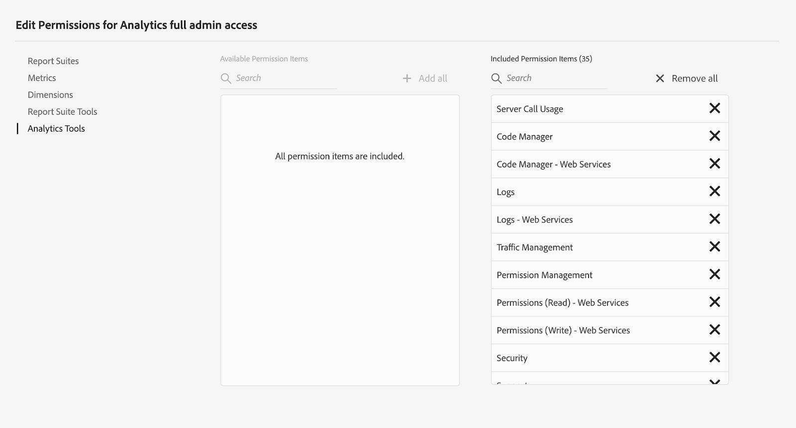

# De Web.Gov-referentiesite instellen en configureren {#set-up-and-configure-we-gov-reference-site}

## Details demopakket {#demo-package-details}

### Installatievereisten {#installation-prerequisites}

Dit pakket is gemaakt voor **AEM Forms 6.4 OSGI Author** en is getest en wordt daarom ondersteund door de volgende platformversies:

| AEM-VERSIE | AEM FORMS PAKKETVERSIE | STATUS |
|---|---|---|
| 6.4 | 5.0.86 | **Ondersteund** |
| 6.5 | 6.0.80 | **Ondersteund** |
| 6.5.3 | 6.0.122 | **Ondersteund** |

Dit pakket bevat cloudconfiguratie die de volgende platformversies ondersteunt:

| PROVIDER CLOUD | SERVICEVERSIE | STATUS |
|---|---|---|
| Adobe-handtekening | v5 API | **Ondersteund** |
| Microsoft Dynamics 365 | 1710 (9.1.0.3020) | **Ondersteund** |
| Adobe Analytics | v1.4 Rest-API | **Ondersteund** |
**Overwegingen bij de installatie van pakketten:**

* Het pakket wordt naar verwachting geïnstalleerd op een schone server, zonder andere demopakketten of oudere demopakketversies
* Het pakket wordt naar verwachting geïnstalleerd op een OSGI-server, die wordt uitgevoerd in de modus Auteur

### Wat bevat dit pakket {#what-does-this-package-include}

Het AEM Forms We.Gov-demopakket (**we-gov-forms.pkg.all-&lt;version>.zip**) wordt geleverd als een pakket dat verschillende andere subpakketten en services bevat. Het pakket bevat de volgende modules:

* **we-gov-forms.pkg.all-&lt;version>.zip** - *Volledige demopakket*

   * **we-gov-forms.ui.apps-&lt;version>.zip** *- Bevat alle componenten, clientbibliotheken, voorbeeldgebruikers, workflowmodellen, enz.*

      * **we-gov-forms.core-&lt;version>.jar** - *Bevat alle OSGI-services, implementatie van aangepaste workflowstappen, enzovoort.*

      * **we-gov-forms.derby&lt;version>.jar** - *Bevat alle OSGI-services, databaseschema, enzovoort.*

      * **core.wcm.components.all-2.0.4.zip** - *Verzameling van WCM-componenten van het monster*

      * **grid-aem.ui.apps-1.0-SNAPSHOT.zip** - *AEM Sites het lay-outpakket van het Net voor de kolomcontrole van de Pagina van Plaatsen*
   * **we-gov-forms.ui.content-&lt;version>.zip** - *Bevat alle inhoud, pagina&#39;s, afbeeldingen, formulieren, interactieve communicatiemiddelen, enzovoort.*

   * **we-gov-forms.ui.analytics-&lt;version>.zip** - *Bevat alle We.Gov Forms Analytics-gegevens die in de opslagplaats moeten worden opgeslagen.*

   * **wij-gov-forms.config.public-&lt;version>.zip** - *Bevat alle standaardconfiguratieknooppunten met inbegrip van placeholder wolkenconfiguraties helpen vormgegevensmodel, en de dienstbindingskwesties vermijden.*

De elementen die in dit pakket zijn opgenomen, zijn:

* AEM-sitepagina&#39;s met bewerkbare sjablonen
* Adaptieve AEM Forms
* AEM Forms Interactieve Mededelingen (Druk en Kanaal van het Web)
* AEM Forms XDP-document van record
* Gegevensmodel AEM Forms MS Dynamics Forms
* Adobe Sign Integration
* AEM-workflowmodel
* Voorbeeldafbeeldingen van AEM Assets
* Voorbeeld (in geheugen) Apache Derby Database
* Apache Derby Data Source (voor gebruik met formuliergegevensmodel)

## Installatie van demopakket {#demo-package-installation}

Deze sectie bevat informatie over het installeren van het demopakket.

### Uit pakketshare {#from-package-share}

1. Ga naar *https://&lt;aemserver>:&lt;port>/crx/packageshare/*

   Of klik in AEM op Implementatie en navigeer naar het pictogram Delen van pakket.

   

1. Meld u aan met uw Adobe ID.
1. Zoek en zoek het pakket **we-gov-forms.pkg.all-&lt;version>** .
1. Selecteer de optie &quot;Downloaden&quot; en accepteer de Algemene voorwaarden.
1. Nadat u het pakket hebt gedownload, selecteert u de optie &quot;Gedownload&quot; om het pakket te zoeken in Pakketbeheer.
1. Selecteer de optie &quot;Installeren&quot; om het pakket te installeren.

   

1. De installatie kan worden voltooid.
1. Navigeer naar *https://&lt;aemserver>:&lt;port>/content/we-gov/home.html?wcmmode=disabled* om ervoor te zorgen dat de installatie is gelukt.

### Vanuit een lokaal ZIP-bestand {#from-a-local-zip-file}

1. Download en zoek het bestand **we-gov-forms.pkg.all-&lt;version>.zip** .
1. Ga naar *https://&lt;aemserver>:&lt;port>/crx/packmgr/index.jsp*.
1. Selecteer de optie Pakket uploaden.

   

1. Gebruik de bestandsbrowser om naar het gedownloade ZIP-bestand te navigeren en dit te selecteren.
1. Klik op Openen om te uploaden.
1. Nadat u het pakket hebt geüpload, selecteert u de optie &quot;Installeren&quot; om het pakket te installeren.

   

1. De installatie kan worden voltooid.
1. Navigeer naar *https://&lt;aemserver>:&lt;port>/content/we-gov/home.html?wcmmode=disabled* om ervoor te zorgen dat de installatie is gelukt.

### Nieuwe pakketversies installeren {#installing-new-package-versions}

Voer de stappen in 4.1 en 4.2 uit om een nieuwe pakketversie te installeren. U kunt een nieuwere pakketversie installeren terwijl al een ander ouder pakket is geïnstalleerd, maar u wordt aangeraden de oudere pakketversie eerst te verwijderen. Volg de onderstaande stappen om dit te doen.

1. Ga naar *https://&lt;aemserver>:&lt;port>/crx/packmgr/index.jsp*
1. Zoek het bestand **we-gov-forms.pkg.all-&lt;version>.zip** .
1. Selecteer de optie Meer.
1. Selecteer in het vervolgkeuzemenu de optie Verwijderen.

   

1. Selecteer na bevestiging nogmaals &quot;Verwijderen&quot; en voer de procedure voor het verwijderen uit.

## Configuratie demopakket {#demo-package-configuration}

Deze sectie bevat details en instructies over de configuratie na implementatie van het demopakket vóór de presentatie.

### Facultatieve gebruikersconfiguratie {#fictional-user-configuration}

1. Ga naar *https://&lt;aemserver>:&lt;port>/libs/granite/security/content/groupadmin.html*
1. Meld u aan als beheerder om de onderstaande taken uit te voeren.
1. Schuif omlaag naar het einde van de pagina om alle gebruikersgroepen te laden.
1. Zoek naar &quot;**workflow**&quot;.
1. Selecteer de groep &quot;**workflowgebruikers**&quot; en klik op &quot;Eigenschappen&quot;.
1. Navigeer naar het tabblad &quot;Leden&quot;.
1. Typ in het **veld Gebruiker of Groep selecteren in het vak** &quot;Gebruiker selecteren&quot;.
1. Selecteer een optie in het vervolgkeuzemenu &quot;Gebruikers **van** We.Gov-formulieren&quot;.

   

1. Klik op &quot;Opslaan en sluiten&quot; in de menubalk.
1. Herhaal stap 2-7 door naar &quot;**Analytics**&quot; te zoeken, de groep &quot;**Analytics Administrator**&quot; te selecteren en de groep &quot;**We.Gov Forms Users**&quot; toe te voegen als lid.
1. Herhaal stap 2-7 door te zoeken naar &quot;**formuliergebruikers**&quot;, de groep &quot;**formulieren-grootgebruikers**&quot; te selecteren en de groep &quot;**We.Gov Forms Users**&quot; toe te voegen als lid.
1. Herhaal stap 2-7 door naar &quot;**formulieren-gebruikers**&quot; te zoeken, de groep &quot;**formulieren-gebruikers**&quot; te selecteren en voeg nu de groep &quot;**We.Gov-gebruikers**&quot; toe als lid.

### Configuratie van e-mailserver {#email-server-configuration}

1. Documentatie voor installatie van revisie [e-mailmelding configureren](/help/sites-administering/notification.md)
1. Meld u aan als beheerder om deze taak uit te voeren.
1. Ga naar *https://&lt;aemserver>:&lt;port>/system/console/configMgr*
1. Zoek en klik op de **Day CQ Mail Service** om deze te configureren.

   

1. Vorm de dienst om met de server SMTP van uw keus te verbinden:

   1. **hostnaam** SMTP-server: bijv. (smtp.gmail.com)
   1. **Serverpoort**: bijv. (465) voor gmail met SSL
   1. **SMTP-gebruiker:** demo@ &lt;naam bedrijf>.com
   1. **Adres**&quot;Van&quot;: aemformsdemo@adobe.com

   

1. Klik &quot;sparen&quot;om de configuratie te bewaren.

### (Optioneel) AEM SSL-configuratie {#aemsslconfig}

Deze sectie bevat informatie over het configureren van SSL op de AEM-instantie om de configuratie van Adobe Sign Cloud te kunnen configureren.

**Referenties:**

1. [Standaard SSL](/help/sites-administering/ssl-by-default.md)

**Opmerkingen:**

1. Navigeer naar https://&lt;aemserver>:&lt;port>/aem/inbox waar u het proces kunt voltooien dat wordt uitgelegd in de bovenstaande koppeling naar de referentiedocumentatie.
1. Het `we-gov-forms.pkg.all-[version].zip` `we-gov-forms.pkg.all-[version].zip/ssl` pakket bevat een voorbeeld-SSL-sleutel en -certificaat dat u kunt openen door de map uit te pakken die deel uitmaakt van het pakket.

1. SSL-certificaat en sleutelgegevens:

   1. uitgegeven aan &quot;CN=localhost&quot;
   1. 10 jaar geldigheid
   1. password value of &quot;password&quot;
1. De persoonlijke sleutel is *localhostprivate.der*.
1. Certificate is the *localhost.crt*.
1. Klik op Next.
1. HTTPS Hostname zou aan *localhost* moeten worden geplaatst.
1. De haven zou aan een haven moeten worden geplaatst die het systeem heeft blootgesteld.

### (Optioneel) Adobe-cloudconfiguratie ondertekenen {#adobe-sign-cloud-configuration}

Deze sectie bevat details en instructies over de Configuratie van de Wolk van de Teken van Adobe.

**Referenties:**

1. [Adobe-ondertekening integreren met AEM Forms](adobe-sign-integration-adaptive-forms.md)

#### Cloudconfiguratie {#cloud-configuration}

1. Controleer de voorwaarden. Zie [AEM SSL-configuratie](../../forms/using/forms-install-configure-gov-reference-site.md#aemsslconfig) voor de vereiste SSL-configuratie.
1. Ga naar:

   *https://&lt;aemserver>:&lt;port>/libs/adobesign/cloudservices/adobesign.html/conf/we-gov*

   >[!NOTE]
   >
   >De URL die wordt gebruikt voor toegang tot de AEM-server moet overeenkomen met de URL die is geconfigureerd in de Adobe Sign OAuth Redirect URI om configuratieproblemen te voorkomen (bijvoorbeeld *https://&lt;aemserver>:&lt;port>/mnt/overlay/adobesign/cloudservices/adobesign/properties.html*)

1. Selecteer de configuratie voor &quot;wij.gov Adobe Sign&quot;.
1. Klik op &quot;Eigenschappen&quot;.
1. Navigeer naar het tabblad &quot;Instellingen&quot;.
1. Voer de URL van Auth in, bijvoorbeeld: [https://secure.na1.echosign.com/public/oauth](https://secure.na1.echosign.com/public/oauth)
1. Geef de geconfigureerde client-id en clientgeheim op in de geconfigureerde Adobe Sign-instantie.
1. Klik op &quot;Verbinding maken met Adobe-ondertekening&quot;.
1. Klik na een geslaagde verbinding op &quot;Opslaan en sluiten&quot; om de integratie te voltooien.

### (Optioneel) Configuratie van de cloud voor MS Dynamics {#ms-dynamics-cloud-configuration}

Deze sectie bevat details en instructies over de Configuratie van de Wolk van de Dynamica van MS.

**Referenties:**

1. [Configuratie Microsoft Dynamics OData](https://docs.adobe.com/content/help/en/experience-manager-64/forms/form-data-model/ms-dynamics-odata-configuration.html)
1. [Microsoft Dynamics for AEM Forms configureren](https://helpx.adobe.com/experience-manager/kt/forms/using/config-dynamics-for-aem-forms.html)

#### MS Dynamics OData cloudservice {#ms-dynamics-odata-cloud-service}

1. Ga naar:

   https://&lt;aemserver>:&lt;port>/libs/fd/fdm/gui/components/admin/fdmcloudservice/fdm.html/conf/we-gov

   1. Zorg ervoor dat u de server opent met dezelfde omleidings-URL als die is geconfigureerd in de toepassingsregistratie van MS Dynamics.

1. Selecteer de configuratie &quot;van de Cloud Service van de Dynamica van Microsoft OData&quot;.
1. Klik op &quot;Eigenschappen&quot;.

   

1. Navigeer naar het tabblad &#39;Verificatie-instellingen&#39;.
1. Voer de volgende gegevens in:

   1. **Hoofdmap service:** Bijv. https://msdynamicsserver.api.crm3.dynamics.com/api/data/v9.1/
   1. **Type verificatie:** OAuth 2.0
   1. **Verificatie-instellingen** (zie de instellingen voor [de cloudconfiguratie van](../../forms/using/forms-install-configure-gov-reference-site.md#dynamicsconfig) MS Dynamics om deze informatie te verzamelen):

      1. Client-id - ook wel toepassings-id genoemd
      1. Clientgeheim
      1. OAuth URL - bijv. [https://login.windows.net/common/oauth2/authorize](https://login.windows.net/common/oauth2/authorize)
      1. Token-URL vernieuwen - bijvoorbeeld [https://login.windows.net/common/oauth2/token](https://login.windows.net/common/oauth2/token)
      1. Toegang tot token-URL - bijvoorbeeld [https://login.windows.net/common/oauth2/token](https://login.windows.net/common/oauth2/token)
      1. Reikwijdte vergunning - **open id**
      1. Koptekst verificatie - **Vergunninghouder**
      1. Bron - bijv. [https://msdynamicsserver.api.crm3.dynamics.com](https://msdynamicsserver.api.crm3.dynamics.com)
   1. Klik op &quot;Verbinding maken met OAuth&quot;.

1. Na succesvolle verificatie klikt u op &quot;Opslaan en sluiten&quot; om de integratie te voltooien.

#### Configuratie-instellingen voor MS Dynamics-cloud {#dynamicsconfig}

De stappen die in deze sectie worden beschreven zijn inbegrepen om u van Cliënt ID, Geheime cliënt en details van uw instantie van de Cloud van de Dynamica van MS te helpen de plaats bepalen.

1. Ga naar [https://portal.azure.com/](https://portal.azure.com/) en meld u aan.
1. Selecteer in het linkermenu de optie Alle services.
1. Zoek of navigeer naar &quot;Toepassingsregistratie&quot;.
1. Maak of selecteer een bestaande toepassingsregistratie.
1. Kopieer de **toepassings-id** die u wilt gebruiken als de OAuth- **client-id** in de AEM-cloudconfiguratie
1. Klik op &quot;Instellingen&quot; of &quot;Manifest&quot; om de URL&#39;s voor **beantwoorden te configureren.**

   1. Deze URL moet overeenkomen met de URL die wordt gebruikt om toegang te krijgen tot uw AEM-server wanneer de OData-service wordt geconfigureerd.

1. Klik in de weergave Instelling op &quot;Toetsen&quot; om een nieuwe sleutel weer te geven (deze wordt gebruikt als clientgeheim in AEM).

   1. Zorg ervoor dat u een kopie van de sleutel bewaart, omdat u deze later niet kunt bekijken in Azure of AEM.

1. Navigeer naar het dashboard voor de instantie van MS Dynamics om de URL van de hoofdmap van de bron/service te zoeken.
1. Klik in de bovenste navigatiebalk op &quot;Verkoop&quot; of op uw eigen instantietype en &quot;Instellingen selecteren&quot;.
1. Klik rechts onderaan op Aanpassingen en Developer Resources.
1. Hier vindt u de hoofdmap van de service: bijv.

   *[https://msdynamicsserver.api.crm3.dynamics.com/api/data/v9.1/](https://msdynamicsserver.api.crm3.dynamics.com/api/data/v9.1/)*

1. Hier vindt u meer informatie over de URL van het token Vernieuwen en Toegangstoken:

   *[https://docs.microsoft.com/en-us/rest/api/datacatalog/authenticate-a-client-app](https://docs.microsoft.com/en-us/rest/api/datacatalog/authenticate-a-client-app)*

#### Het formuliergegevensmodel testen (Dynamics) {#testing-the-form-data-model}

Nadat de cloudconfiguratie is voltooid, wilt u mogelijk het gegevensmodel van het formulier testen.

1. Ga naar

   *https://&lt;aemserver>:&lt;port>/aem/forms.html/content/dam/formsanddocuments-fdm/we-gov*

1. Selecteer &quot;Wij.gov de Dynamica CRM FDM van Microsoft&quot;en selecteer &quot;Eigenschappen&quot;.

   

1. Navigeer naar het tabblad Bron bijwerken.
1. Zorg ervoor dat de &quot;Context-Aware Configuratie&quot;aan &quot;/conf/wij-gov&quot;wordt geplaatst en dat de gevormde gegevensbron &quot;ms-dynamics-odata-cloud-dienst is&quot;.

   

1. Bewerk het formuliergegevensmodel.

1. Test de diensten om ervoor te zorgen zij met succes met de gevormde Gegevensbron verbinden.

   >[!NOTE]
   Nadat u de services hebt getest, klikt u op **Annuleren** om ervoor te zorgen dat onvrijwillige wijzigingen niet worden doorgegeven aan het formuliergegevensmodel.

   >[!NOTE]
   Er is gemeld dat een AEM Server-herstart vereist was voor de gegevensbron om een verbinding met FDM tot stand te brengen.

#### Het formuliergegevensmodel testen (Derby) {#test-fdm-derby}

Nadat de cloudconfiguratie is voltooid, wilt u mogelijk het gegevensmodel van het formulier testen.

1. Ga naar *https://&lt;aemserver>:&lt;port>/aem/forms.html/content/dam/formsanddocuments-fdm/we-gov*

1. Selecteer de **wij.gov Inschrijving FDM** en selecteer **Eigenschappen**.

   

1. Navigeer naar het tabblad Bron **** bijwerken.

1. Zorg ervoor dat de **Context-Aware Configuratie** aan wordt geplaatst `/conf/we-gov` en dat de gevormde gegevensbron **We.Gov Derby DS** is.

   

1. Klik op **Opslaan en Sluiten**.

1. [Test de diensten](work-with-form-data-model.md#test-data-model-objects-and-services) om ervoor te zorgen zij met succes met de gevormde Gegevensbron verbinden

   * Om de verbinding te testen selecteer **HOMEMORTGAGEACCOUNT** en geef het de dienst krijgen. Test de dienst en de systeembeheerders kunnen gegevens zien die worden teruggewonnen.

### Adobe Analytics-configuratie (optioneel) {#adobe-analytics-configuration}

Deze sectie bevat informatie en instructies over de Adobe Analytics Cloud Configuration.

**Referenties:**

* [Integreren met Adobe Analytics](../../sites-administering/adobeanalytics.md)

* [Verbinding maken met Adobe Analytics en frameworks maken](../../sites-administering/adobeanalytics-connect.md)

* [Analytics-gegevens pagina bekijken](../../sites-authoring/pa-using.md)

* [Analyses en rapporten configureren](configure-analytics-forms-documents.md)

* [Analyserapporten van AEM Forms weergeven en begrijpen](view-understand-aem-forms-analytics-reports.md)

### Configuratie van Adobe Analytics-cloudservice {#adobe-analytics-cloud-service-configuration}

Dit pakket wordt vooraf geconfigureerd voor verbinding met Adobe Analytics. De onderstaande stappen zijn beschikbaar om deze configuratie te kunnen bijwerken.

1. Ga naar *https://&lt;aemserver>:&lt;port>/libs/cq/core/content/tools/cloudservices.html*
1. Zoek de sectie Adobe Analytics en selecteer de koppeling &quot;Configuraties tonen&quot;.
1. Selecteer de configuratie voor &quot;We.Gov Adobe Analytics (Analytics Configuration)&quot;.

   

1. Klik op de knop Bewerken om de Adobe Analytics-configuratie bij te werken (hiervoor moet u het Gedeelde geheim opgeven). Klik op &quot;Verbinden met Analytics&quot; om verbinding te maken en op &quot;OK&quot; om te voltooien.

   

1. Klik op dezelfde pagina op &quot;We.Gov Adobe Analytics Framework (Analytics Framework)&quot; als u de frameworkconfiguraties wilt bijwerken (zie [AEM-authoring](../../forms/using/forms-install-configure-gov-reference-site.md#enableauthoring) inschakelen om Authoring in te schakelen).

#### Gebruikersreferenties voor Adobe Analytics-locaties {#analytics-locating-user-credentials}

De accountbeheerder moet de volgende taken uitvoeren om de gebruikersgegevens voor een Adobe Analytics-account te vinden.

1. Ga naar de Adobe Experience Cloud-portal.
   * Aanmelden met uw beheerdersreferenties
1. Selecteer het Adobe Analytics-pictogram in het hoofddashboard.
   
1. Navigeer naar het tabblad Beheer en selecteer de optie Gebruikersbeheer (Verouderd)
   
1. Selecteer het tabblad **Gebruikers** .
   
1. Selecteer de gewenste gebruiker in de lijst met gebruikers.
1. Blader naar de onderkant van de pagina en de verificatiegegevens van de gebruikers worden onder aan de pagina weergegeven.
   
1. De gebruikersnaam en de gedeelde geheime informatie worden rechts in het vak met machtigingen weergegeven.
1. Merk op dat de gebruikersbenaming een dubbelepunt binnen de naam zal hebben al informatie op de linkerzijde van de dubbelepunt de gebruikersbenaming is, en alle informatie op het recht van de dubbelepunt zal de bedrijfsnaam zijn.
   * Hier is een voorbeeld van: *username : bedrijfsnaam*

#### Gebruikersverificatie instellen in Adobe Analytics {#setup-user-authentication}

Beheerders kunnen gebruikers de rechten voor AEM-analyse geven door de volgende handelingen uit te voeren.

1. Navigeer naar de Adobe-Admin Console.

1. Klik op de Analytics-instantie die beschikbaar wordt gemaakt voor de beheerconsole.

   * Deze bevindt zich op de hoofdpagina van de beheerpagina.

1. Selecteer Analytics voor volledige beheertaken.

1. Voeg een gebruiker aan het Profiel toe.

   

1. Klik op het tabblad Machtigingen nadat de gebruiker-id is toegewezen aan het profiel.

1. Controleer of alle machtigingen zijn toegewezen aan het profiel.

   

1. Wanneer de machtigingen eenmaal zijn toegewezen over de mogelijkheid voor een gebruiker om zich aan te melden, kan dit enkele uren duren.

### Adobe Analytics-rapportage {#adobe-analytics-reporting}

#### Adobe Analytics-sites weergeven {#view-adobe-analytics-sites-reporting}

>[!NOTE]
AEM Forms Analytics-gegevens zijn offline of zonder een Adobe Analytics-wolkenconfiguratie beschikbaar als het `we-gov-forms.ui.analytics-<version>.zip` pakket is geïnstalleerd, maar voor AEM Sites-gegevens is een actieve wolkenconfiguratie vereist.

1. Ga naar *https://&lt;aemserver>:&lt;port>/sites.html/content*
1. Selecteer de site &quot;AEM Forms we.Gov&quot; om de sitepagina&#39;s weer te geven.
1. Selecteer een van de sitepagina (bijvoorbeeld Home) en kies &quot;Analytics &amp; Recommendations&quot;.

   

1. Op deze pagina wordt opgehaalde informatie van Adobe Analytics weergegeven die betrekking heeft op de pagina AEM Sites (opmerking: Deze informatie wordt door het ontwerp periodiek vernieuwd vanuit Adobe Analytics en wordt niet in real-time weergegeven).

   

1. Terug op de pagina van de paginamening (betreden in stap 3.), kunt u de informatie van de paginamening ook bekijken door de vertoning te veranderen die punten in de &quot;Mening van de Lijst&quot;plaatst te bekijken.
1. Zoek het vervolgkeuzemenu Weergave en selecteer Lijstweergave.

   

1. Selecteer in hetzelfde menu de optie Weergave-instelling en selecteer de kolommen die u wilt weergeven in de sectie Analytics.

   

1. Klik op &quot;Bijwerken&quot; om de nieuwe kolommen beschikbaar te maken.

   

#### Adobe Analytics-formulierrapporten weergeven {#view-adobe-analytics-forms-reporting}

>[!NOTE]
AEM Forms Analytics-gegevens zijn offline of zonder een Adobe Analytics-wolkenconfiguratie beschikbaar als het `we-gov-forms.ui.analytics-<version>.zip` pakket is geïnstalleerd, maar voor AEM Sites-gegevens is een actieve wolkenconfiguratie vereist.

1. Ga naar

   *https://&lt;aemserver>:&lt;port>/aem/forms.html/content/dam/formsanddocuments/adobe-gov-forms*

1. Selecteer het adaptieve formulier &quot;Inschrijvingstoepassing voor gezondheidsvoordelen&quot; en selecteer de optie &quot;Analytics-rapport&quot;.

   

1. Wacht tot de pagina is geladen en bekijk de gegevens van het Analytics-rapport.

   

### Configuratie van Adobe Automated Forms {#automated-forms-enablement}

Gebruikers van het gereedschap Conversie moeten het volgende hebben om AEM Forms met Adobe Forms te installeren en te configureren.

1. Toegang tot Adobe IO.

1. Machtiging voor het maken van integratie met de Adobe Forms Conversion-service.

1. Het meest recente Adobe AEM 6.5-servicepakket wordt uitgevoerd als auteur.

Lees het volgende voordat u verdere instructies leest:

* [De service voor automatische conversie van formulieren configureren](https://docs.adobe.com/content/help/en/aem-forms-automated-conversion-service/using/configure-service.html)

#### Een IMS-configuratie maken, deel 1 {#creating-ims-config}

Gebruikers moeten de service Identity Management System (IMS) configureren om zich bij Adobe I/O te kunnen registreren om de service zodanig te configureren dat de juiste communicatie met het gereedschap voor het converteren van formulieren mogelijk is.

1. Ga naar https://&lt;aemserver>:&lt;port> > Click Adobe ExperienceManager linksboven > Tools > Security > Adobe IMS Configuration.

1. Klik op Maken.

1. Voer de handelingen uit in de onderstaande afbeelding.

   

1. Zorg ervoor dat u het certificaat downloadt.

1. Ga niet verder met de rest van de configuratie - revisiesectie [Integratie maken in Adobe I/O](#create-integration-adobeio)

>[!NOTE]
Het in deze sectie gemaakte certificaat wordt gebruikt om de integratieservice in Adobe I/O te maken. Zodra gebruikers in de integratieservice hebben gecreeerd kunnen de gebruikers die informatie van Adobe I/O gebruiken om de configuratie te beëindigen.

#### Integratie maken in Adobe I/O {#create-integration-adobeio}

Zorg ervoor dat u de mogelijkheid hebt om een integratie in uw Adobe-domein te maken als u hiervoor geen contact opneemt met de systeembeheerder.

1. Navigeer naar de [Adobe I/O-console](https://console.adobe.io/).

1. Klik op Integratie maken.

1. Selecteer Toegang tot een API.

1. Zorg ervoor dat u zich in de juiste groep bevindt (vervolgkeuzelijst rechtsboven).

1. Selecteer het gereedschap Formulierconversie in de sectie Experience Cloud.

1. Klik op Doorgaan.

1. Voer de naam en beschrijving van uw integratie in.

1. Als u de openbare sleutel uit paragraaf 2.1 gebruikt, plaatst u deze in de integratie van de sleutel.

1. Selecteer een profiel voor de automatische conversie van formulieren.

   

#### IMS-configuratiedeel 2 maken {#create-ims-config-part-next}

Nu u een integratie hebt gecreeerd laten ons de installatie van de configuratie voltooien IMS.

1. Klik op de integratie in de Adobe I/O om de verbindingsgegevens weer te geven.

1. Ga naar uw IMS-configuratie in AEM (Gereedschappen > Beveiliging > IMS)

1. Klik op Volgende in het scherm IMS Configuration.

1. Voer de verificatieserver in (de waarde die in de schermafbeelding wordt weergegeven).

1. Voer de API-sleutel in.

1. Voer het clientgeheim in (klik op Openen op Integratie in Adobe I/O om dit te kunnen onthullen).

1. Klik op het tabblad JWT in Adobe I/O om de JWT-payload op te halen en deze in de payload van de IMS-configuratie te plakken.

   

1. Nadat u de IMS-configuratie hebt gemaakt, klikt u op de IMS-configuratie en selecteert u Health Check, zodat gebruikers het volgende resultaat zien.

   

#### Cloud Configuration (Wij.Gov AFC-productie) configureren {#configure-cloud-configuration}

Nadat de IMS-configuratie is voltooid, kunnen we de cloudconfiguratie in AEM controleren. Als de configuratie niet bestaat, gebruikt u de volgende stappen om de wolkenconfiguratie in AEM tot stand te brengen:

1. Open uw browser en navigeer naar de URL van het systeem https://&lt;domain_name>:&lt;system_port>

1. Klik op Adobe Experience Manager in de linkerbovenhoek van het scherm > Gereedschappen > Cloud Servicen > Configuratie automatische formulierconversie.

1. Selecteer de configuratiemap waarin u de configuratie wilt plaatsen.

1. Klik op Maken.

1. Voer de gegevens in de onderstaande schermafbeelding in.

   

1. Geef de configuratie een titel en een naam.

1. De service-URL voor het systeem is ingesteld op https://aemformsconversion.adobe.io/.

1. Sjabloon-URL */conf/we-gov/settings/wcm/templates/we-gov-flamingo-template*.

1. Thema-URL: */content/dam/formsanddocuments-themes/adobe-gov-forms-themes/we-gov-theme*

1. Klik op Next.

1. Voor deze configuratie, verlaten wij de twee checkbox waarden leeg.

   * Zie De cloudservice configureren voor meer informatie over deze opties.

#### Cloud Configuration (wij.Finance AFC Production) configureren {#configure-cloud-configuration-wefinance}

Nadat de IMS-configuratie is voltooid, kunnen we doorgaan met het maken van de cloudconfiguratie in AEM.

1. Open uw browser en navigeer naar de URL van het systeem https://&lt;domain_name>:&lt;system_port>

1. Klik op Adobe Experience Manager in de linkerbovenhoek van het scherm > Gereedschappen > Cloud Servicen > Configuratie automatische formulierconversie.

1. Selecteer de configuratiemap waarin u de configuratie wilt plaatsen.

1. Klik op Maken.

1. Voer de gegevens in de onderstaande schermafbeelding in.

   

1. Geef de configuratie een titel en een naam.

1. De service-URL voor het systeem is ingesteld op https://aemformsconversion.adobe.io/

1. Sjabloon-URL: */conf/we-finance/settings/wcm/templates/we-finance-adaptive-form*

1. Thema-URL: */content/dam/formsanddocuments-themes/adobe-finance-forms-themes/we-finance-theme*

1. Klik op Next.

1. Voor deze configuratie, verlaten wij de twee checkbox waarden leeg.

   * Zie De cloudservice configureren voor meer informatie over deze opties.

#### De formulierconversie testen (Web.Gov-inschrijvingstoepassing) {#test-forms-conversion}

Zodra de configuratie is ingesteld, kunnen gebruikers deze testen door een PDF-document te uploaden.

1. Ga naar het AEM-systeem https://&lt;domain_name>:&lt;system_port>

1. Klik op Formulieren > Formulieren en documenten > AEM Forms We.gov-formulieren > AFC.

1. Selecteer Web.Gov de Toepassing PDF van de Inschrijving.

1. Klik in de rechterbovenhoek op de knop **Geautomatiseerde omzetting** starten.

1. Gebruikers moeten de optie kunnen zien zoals hieronder wordt weergegeven.

   

1. Zodra de knop is geselecteerd, krijgen gebruikers de volgende opties te zien

   * Zorg ervoor dat gebruikers de configuratie *Web.Gov AFC-productie* selecteren

   

   

1. Selecteer de beginomzetting zodra u alle opties hebt gevormd die u zou willen gebruiken.

1. Wanneer het conversieproces begint, moeten gebruikers het volgende scherm zien:

   

1. Wanneer de conversie is voltooid, zien gebruikers het volgende scherm:

   

   Klik op de map **Uitvoer** om het gegenereerde adaptieve formulier weer te geven.

#### Bekende problemen en notities {#known-issues-notes}

De service Automated Forms Conversion bevat bepaalde [aanbevolen procedures, bekende complexe patronen](https://docs.adobe.com/content/help/en/aem-forms-automated-conversion-service/using/styles-and-pattern-considerations-and-best-practices.html)en [bekende problemen](https://docs.adobe.com/content/help/en/aem-forms-automated-conversion-service/using/known-issues.html). Controleer deze voordat u de service AEM Forms Automated Forms Conversion gaat gebruiken.

1. Genereer het formulier met adaptieve formulieren genereren zonder gegevensbindingen ingeschakeld als u het formulier na conversie aan een FDM wilt binden.

1. Zorg ervoor dat de sjabloonmap jcr:read voor iedereen machtiging heeft ingeschakeld, anders kan de gebruiker de sjabloon niet lezen uit de opslagplaats en mislukt de conversie.

## Aanpassing van demopakket {#demo-package-customizations}

Deze sectie bevat instructies voor het aanpassen van de demo.

### Aanpassing sjablonen {#templates-customization}

Bewerkbare sjablonen vindt u op de volgende locatie:

*https://&lt;aemserver>:&lt;port>/libs/wcm/core/content/sites/templates.html/conf/we-gov*

Deze sjablonen bevatten de sjablonen AEM-site, Adaptief formulier en Interactieve communicatie, die zijn gemaakt en samengesteld met componenten die u kunt vinden op:

*https://&lt;aemserver>:&lt;port>/crx/de/index.jsp#/apps/we-gov/components*

#### Style system {#customizetemplates}

Deze site bevat ook clientbibliotheken, waarvan er een Bootstrap 4 importeert ( [https://getbootstrap.com/](https://getbootstrap.com/) ). Deze clientbibliotheek is beschikbaar op

*https://&lt;aemserver>:&lt;port>/crx/de/index.jsp#/apps/we-gov/clientlibs/client-lib-base/css/bootstrap*

De bewerkbare sjablonen in dit pakket worden ook vooraf geconfigureerd met sjabloon-/paginabeleid dat de Bootstrap 4 CSS-klassen gebruikt voor paginering, opmaak enzovoort. Niet alle klassen zijn toegevoegd aan het sjabloonbeleid, maar elke klasse die door Bootstrap 4 wordt ondersteund, kan aan het beleid worden toegevoegd. Zie de pagina Aan de slag voor een lijst met beschikbare klassen:

[https://getbootstrap.com/docs/4.1/getting-started/introduction/](https://getbootstrap.com/docs/4.1/getting-started/introduction/)

De malplaatjes inbegrepen in dit pakket steunen ook het Systeem van de Stijl:

[Stijlsysteem](../../sites-authoring/style-system.md)

#### Sjabloonlogo&#39;s {#template-logos}

DAM-projectelementen omvatten onder andere Wij.Gov-logo&#39;s en -afbeeldingen. Deze activa zijn beschikbaar op:

*https://&lt;aemserver>:&lt;port>/assets.html/content/dam/we-gov*

Wanneer u de pagina- en formuliersjablonen bewerkt, kunt u de logo&#39;s van een merk bijwerken door de navigatie- en voettekstcomponenten te bewerken. Deze componenten bieden een configureerbaar merk- en logodialoogvenster dat kan worden gebruikt om logo&#39;s bij te werken:

Zie Pagina-inhoud bewerken voor meer informatie:

[Paginacontent bewerken](../../sites-authoring/editing-content.md)

### Aanpassing sitepagina&#39;s {#sites-pages-customization}

Alle sitepagina&#39;s zijn beschikbaar via: *https://&lt;aemserver>:&lt;port>/sites.html/content/we-gov*

Deze sitepagina&#39;s maken ook gebruik van het AEM-rasterpakket om de lay-out van een paar componenten te bepalen.

#### Style system {#style-system}

Pagina&#39;s die in dit pakket zijn opgenomen, ondersteunen ook het stijlsysteem:

[Stijlsysteem](../../sites-authoring/style-system.md)

U kunt ook naar het systeem [van de de aanpassingsstijl van](../../forms/using/forms-install-configure-gov-reference-site.md#customizetemplates) Malplaatjes voor documentatie over gesteunde stijlen verwijzen.

### Aanpassing van adaptieve formulieren {#adaptive-forms-customization}

Alle adaptieve formulieren zijn beschikbaar op:

*https://&lt;aemserver>:&lt;port>/aem/forms.html/content/dam/formsanddocuments/adobe-gov-forms*

Deze formulieren kunnen worden aangepast aan bepaalde gebruiksgevallen. Houd er rekening mee dat bepaalde velden en verzendlogica niet moeten worden gewijzigd om ervoor te zorgen dat het formulier correct blijft functioneren. Dit omvat:

**Inschrijvingsaanvraag voor gezondheidsvoordelen:**

* contact_id - Verborgen gebied dat wordt gebruikt om identiteitskaart van de Vraag van de Dynamica van MS tijdens voorlegging te ontvangen
* Verzenden - Voor verzenden is aanpassing van knoplogica vereist ter ondersteuning van callbacks. Aanpassing is gedocumenteerd, maar er was een groot script vereist om het formulier te verzenden tijdens het uitvoeren van zowel een POST- als GET-bewerking naar MS Dynamics via het Forms Data Model.
* Hoofdvenster - De gebeurtenis Initialize wordt gebruikt om een knop MS Dynamics op de minst indringende manier aan de AEM Inbox toe te voegen, aangezien alle componenten van AEM Inbox Granite UI niet-wijzigbaar zijn.

#### Adaptieve formulieropmaak {#adaptive-form-styling}

U kunt adaptieve formulieren ook opmaken met de Stijleditor of de themaeditor:

* [Inline styling van adaptieve formuliercomponenten](inline-style-adaptive-forms.md)
* [Thema&#39;s maken en gebruiken](themes.md)

### Workflowaanpassing {#workflow-customization}

Het Aangepaste formulier voor inschrijving wordt voor verwerking naar een OSGI-workflow verzonden. Deze workflow is te vinden op *https://&lt;poort>/conf/we-gov/settings/models/we-gov-process.html*.

Vanwege bepaalde beperkingen bevat deze workflow diverse scripts en aangepaste stappen voor het proces van de OSGI-workflow. Deze workflowstappen zijn gemaakt als algemene stappen en zijn niet gemaakt met configuratievensters. Op dit moment is de configuratie van de workflowstappen afhankelijk van procesargumenten.

Alle Java-code voor workflowstappen bevindt zich in de bundel **we-gov-forms.core-&lt;version>.jar** .

## Demomogelijkheden en bekende problemen {#demo-considerations-and-known-issues}

Deze sectie bevat informatie over demo-functies en ontwerpbeslissingen die tijdens het demonstratieproces speciale aandacht behoeven.

### Demooverwegingen {#demo-considerations}

* Conform AGRS-159, zorg ervoor dat de naam (eerste, midden, en laatste) van het contact in de Aangepaste Vorm van de Inschrijving wordt gebruikt uniek is.
* Met het adaptieve formulier voor inschrijving wordt het e-mailbericht voor ondertekening van Adobe verzonden naar de e-mail die is opgegeven in het e-mailveld van het formulier. Dat e-mailadres mag niet hetzelfde e-mailadres zijn als het e-mailadres dat wordt gebruikt om de configuratie van de Adobe-cloud voor ondertekening te configureren.

### Known issues {#known-issues}

* (AGRS-120) De component van de Navigatie van de Plaats steunt momenteel geen genestelde kindpagina&#39;s die meer dan 2 niveaus diep zijn.
* (AGRS-159) De huidige FDM van de Dynamiek van MS moet twee handelingen eerst uitvoeren, POST de Adaptieve gegevens van de Vorm van de Inschrijving aan Dynamiek, en haalt dan het gebruikersverslag op om identiteitskaart van het Contact terug te winnen. In zijn huidige staat, zal het halen van identiteitskaart van het Contact ontbreken als meer dan twee gebruikers met de zelfde naam in Dynamiek aanwezig zijn, die niet de Aangepaste Vorm van de Inschrijving zal toestaan om voor te leggen.

## Toegankelijkheidstests configureren {#configure-accessibility-testing}

### Chrome voor toegankelijkheidstest inschakelen bij {#enable-chrome-add-on}

U vindt deze [hier](https://chrome.google.com/webstore/detail/accessibility-developer-t/fpkknkljclfencbdbgkenhalefipecmb?hl=en)als u eerst de Chrome-plug-in wilt installeren om de toegankelijkheid te testen.

Wanneer de pagina is geïnstalleerd, laadt u de pagina die u wilt testen in de Chrome-browser (Opmerking: Als er meerdere tabbladen zijn geopend, heeft dit mogelijk invloed op de score. Het is aan te raden slechts één tab open te hebben.) Wanneer de pagina is geladen **, klikt** u met de rechtermuisknop op de pagina en selecteert u het tabblad **Audits** . Er kunnen ontwikkelaars het type controle selecteren dat door de insteekmodule Toegankelijkheid moet worden uitgevoerd. Nadat alle gewenste opties zijn geselecteerd, kan de gebruiker de knop Rapport genereren selecteren. Hiermee wordt een PDF-document gegenereerd met de algemene score voor toegankelijkheid en de mogelijkheden om de score voor toegankelijkheid in het algemeen te verhogen.

Zodra het rapport is uitgevoerd kunnen de gebruikers het volgende verwachten te zien:

Het nummer dat voor gebruikers wordt weergegeven, is de algemene toegankelijkheidsscore die ze hebben behaald. Er is ook een beschrijving van hoe dit na de score werd berekend.

Als gebruikers dit willen exporteren, kunnen ze op de drie knoppen aan de rechterkant van het scherm klikken en een van de andere opties voor de plug-in selecteren.

### Ultramarijnthema {#ultramarine-theme}

Het algemeen beschikbare Ultramarine-thema dat door Adobe wordt onderhouden, is ingebouwd in het`we-gov-forms.pkg.all-<version>.zip` installeerbare ZIP-bestand. Zodra dit pakket is geïnstalleerd met behulp van CRX.

Pakketbeheer, gebruikers hebben toegang tot het Ultramarine-thema in AEM Forms door naar **Forms** > **Thema** > **Referentiethema** > **Ultramarijn-Toegankelijk** te navigeren.

## Configuratieopties {#configuration-options}

Gebruikers kunnen verschillende workflowserviceopties configureren, waaronder:

1. Invoer Microsoft Dynamics
1. Adobe-handtekening
1. Aangepast communicatiebeheer voor AEM
1. Adobe Analytics

Om hen te vormen om binnen het Werkschema worden toegelaten moeten de gebruikers de volgende taken uitvoeren.

1. Ga naar https://&#39;[server]:[port]&#39;/system/console/configMgr.

1. Zoek de *WeGov-configuraties*.

1. Open de de dienstdefinitie en laat de geselecteerde diensten toe om binnen het werkschema worden aangehaald.

>[!NOTE]
Enkel omdat een gebruiker de dienst binnen de pagina van de Manager van de Configuratie toelaat, worden de gebruikers nog vereist om een de dienstconfiguratie op te zetten om met de externe gevraagde diensten te communiceren.

1. Klik op de knop Opslaan als u klaar bent om de instellingen op te slaan.

## Volgende stappen {#next-steps}

Nu bent u allen klaar om de Web.Gov verwijzingsplaats te onderzoeken. Voor meer informatie over het werkschema en de stappen van de de verwijzingsplaats van Web.Gov, zie de de verwijzingsplaatsanalyse van [Wij.Gov](../../forms/using/forms-gov-reference-site-user-demo.md).
