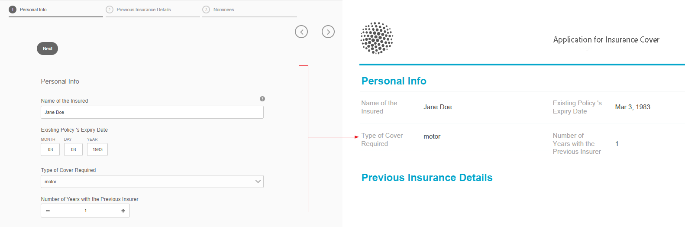

# Document met record genereren voor adaptieve formulieren{#generate-document-of-record-for-adaptive-forms}

## Overzicht {#overview}

Nadat u een formulier hebt verzonden, willen uw klanten doorgaans de informatie die zij in het formulier hebben ingevuld, afdrukken of in documentindeling bewaren voor toekomstig gebruik. Dit wordt bedoeld als document van verslag.

In dit artikel wordt uitgelegd hoe u een recorddocument voor adaptieve formulieren kunt genereren.

>[!NOTE]
>
>Automatisch genereren van een recorddocument wordt niet ondersteund voor op XFA gebaseerde adaptieve formulieren. U kunt echter de XDP gebruiken om het adaptieve formulier te maken als een recorddocument.

## Adaptieve formuliertypen en hun recorddocumenten {#adaptive-form-types-and-their-documents-of-record}

Wanneer u een adaptief formulier maakt, kunt u een formuliermodel selecteren. U kunt kiezen uit de volgende opties:

* [Met formuliersjablonen](../../forms/using/creating-adaptive-form.md#create-an-adaptive-form-based-on-an-xfa-form-template)kunt u een XFA-sjabloon selecteren voor uw aangepaste formulier. Als u een XFA-sjabloon selecteert, kunt u het bijbehorende XDP-bestand gebruiken voor een recorddocument, zoals hierboven beschreven.

* [Met XML-schema](../../forms/using/creating-adaptive-form.md#create-an-adaptive-form-based-on-xml-or-json-schema)kunt u een XML-schemadefinitie selecteren voor het aangepaste formulier. Wanneer u een XML-schema selecteert voor het aangepaste formulier, kunt u:

   * Koppel een XFA-sjabloon voor een record. Zorg ervoor dat de gekoppelde XFA-sjabloon hetzelfde XML-schema gebruikt als het aangepaste formulier
   * Automatisch een recorddocument genereren

* GeenHiermee kunt u een adaptief formulier maken zonder een formuliermodel. Het recorddocument wordt automatisch gegenereerd voor het aangepaste formulier.

Wanneer u een formuliermodel selecteert, configureert u het document met records met de opties die beschikbaar zijn onder Document of Record Template Configuration. Zie [Document of Record Template Configuration](#document-of-record-template-configuration).

## Automatisch gegenereerd document van record {#automatically-generated-document-of-record}

Met een document met records kunnen uw klanten een kopie van het verzonden formulier bewaren voor afdrukdoeleinden. Wanneer u automatisch een document met records genereert, wordt het document met records telkens wanneer u het formulier wijzigt, onmiddellijk bijgewerkt. U verwijdert bijvoorbeeld het leeftijdsveld voor klanten die de Verenigde Staten van Amerika als hun land selecteren. Wanneer dergelijke klanten een document van verslag produceren, is het leeftijdsgebied niet zichtbaar aan hen in het document van verslag.

Automatisch gegenereerde recorddocumenten hebben de volgende voordelen:

* Het zorgt voor gegevensbinding.
* Velden die op het moment van verzending zijn gemarkeerd, worden automatisch van een record uitgesloten. Er is geen extra inspanning nodig.
* Het bespaart tijd voor het ontwerpen van document van verslagmalplaatje.
* Hiermee kunt u verschillende stijlen en vormgeving proberen met verschillende basissjablonen en de beste stijl en vormgeving kiezen voor Document of Record. Stijlvormgeving is optioneel. Als u geen stijl opgeeft, worden systeemstijlen standaard ingesteld.
* Hiermee zorgt u ervoor dat elke wijziging in het formulier direct wordt doorgevoerd in het document met de record.

## Componenten die automatisch een recorddocument genereren {#components-to-automatically-generate-a-document-of-record}

Voor het genereren van een recorddocument voor adaptieve formulieren hebt u de volgende componenten nodig:

**Adaptief formulier** , adaptief formulier, waarvoor u een record wilt genereren.

**Basissjabloon (aanbevolen)** XFA-sjabloon (XDP-bestand) gemaakt in AEM Designer. De malplaatje van de basis wordt gebruikt om het stileren en het brandmerken informatie voor document van verslagmalplaatje te specificeren.

Zie [Basissjabloon van een record](#base-template-of-a-document-of-record)

>[!NOTE]
>
>De basissjabloon van een document met record wordt ook wel de meta-sjabloon van een document met record genoemd.

**Document van een recordsjabloon** XFA-sjabloon (XDP-bestand) gegenereerd uit een adaptief formulier.

Zie [Document of Record Template Configuration](#document-of-record-template-configuration).

**Formuliergegevens** Informatie die door een gebruiker in het adaptieve formulier is ingevuld. Het samenvoegt met het document van verslagmalplaatje om het document van verslag te produceren.

## Toewijzing van adaptieve formulierelementen {#mapping-of-adaptive-form-elements}

In de volgende secties wordt beschreven hoe adaptieve formulierelementen worden weergegeven in een recorddocument.

### Fields {#fields}

<table>
 <tbody>
  <tr>
   <th>Aangepast formulieronderdeel</th>
   <th>Overeenkomende XFA-component</th>
   <th>Standaard opgenomen in document van recordsjabloon?</th>
   <th>Opmerkingen</th>
  </tr>
  <tr>
   <td>Knop</td>
   <td>Knop</td>
   <td>false</td>
   <td> </td>
  </tr>
  <tr>
   <td>Selectievakje</td>
   <td>Selectievakje</td>
   <td>true</td>
   <td> </td>
  </tr>
  <tr>
   <td>Datumkiezer</td>
   <td>Datum-/tijdveld</td>
   <td>true</td>
   <td> </td>
  </tr>
  <tr>
   <td>Vervolgkeuzelijst</td>
   <td>Vervolgkeuzelijst</td>
   <td>true</td>
   <td> </td>
  </tr>
  <tr>
   <td>Krabbelhandtekening</td>
   <td>Krabbelen op handtekening</td>
   <td>true</td>
   <td> </td>
  </tr>
  <tr>
   <td>Numeriek vak</td>
   <td>Numeriek veld</td>
   <td>true</td>
   <td> </td>
  </tr>
  <tr>
   <td>Wachtwoordvak</td>
   <td>Wachtwoordveld</td>
   <td>false</td>
   <td> </td>
  </tr>
  <tr>
   <td>Keuzerondje</td>
   <td>Keuzerondje</td>
   <td>true</td>
   <td> </td>
  </tr>
  <tr>
   <td>Tekstvak</td>
   <td>Tekstveld</td>
   <td>true</td>
   <td> </td>
  </tr>
  <tr>
   <td>Knop Opnieuw instellen</td>
   <td>Knop Opnieuw instellen</td>
   <td>false</td>
   <td> </td>
  </tr>
  <tr>
   <td>Verzendknop</td>
   <td><p>Knop Verzenden via e-mail</p> <p>Knop HTTP verzenden</p> </td>
   <td>false</td>
   <td> </td>
  </tr>
  <tr>
   <td>Voorwaarden en bepalingen</td>
   <td> </td>
   <td>true</td>
   <td> </td>
  </tr>
  <tr>
   <td>Bestandsbijlage</td>
   <td> </td>
   <td>false</td>
   <td>Niet beschikbaar in document van recordsjabloon. Alleen beschikbaar in document van record via bijlagen.</td>
  </tr>
 </tbody>
</table>

### Containers {#containers}

<table>
 <tbody>
  <tr>
   <th>Aangepast formulieronderdeel</th>
   <th>Overeenkomende XFA-component</th>
   <th>Opmerkingen</th>
  </tr>
  <tr>
   <td>Deelvenster<br /> </td>
   <td>Subform<br /> </td>
   <td>Herhalbaar deelvenster verwijst naar herhaalbaar subformulier.</td>
  </tr>
 </tbody>
</table>

### Statische componenten {#static-components}

| Aangepast formulieronderdeel | Overeenkomende XFA-component | Opmerkingen |
|---|---|---|
| Afbeelding | Afbeelding | De gebonden of niet-gebonden componenten TextDraw en Image worden altijd in het recorddocument weergegeven voor een adaptief formulier op basis van XSD, tenzij ze worden uitgesloten met behulp van het document met recordinstellingen. |
| Tekst | Tekst |

>[!NOTE]
>
>In de klassieke UI krijgt u verschillende tabbladen voor het bewerken van veldeigenschappen.

### Tabellen {#tables}

De tabelcomponenten voor adaptieve formulieren, zoals koptekst, voettekst en rijtoewijzing, voor de overeenkomstige XFA-componenten. U kunt herhaalbare deelvensters toewijzen aan tabellen in een document met records.

## Basissjabloon van een record {#base-template-of-a-document-of-record}

De basissjabloon biedt opmaak- en weergavegegevens voor documenten met een record. Hiermee kunt u de standaardweergave van automatisch gegenereerd document met record aanpassen. U wilt bijvoorbeeld het bedrijfslogo in de koptekst en copyrightinformatie in de voettekst van het document met de record plaatsen. De master pagina van het basissjabloon wordt gebruikt als een master pagina voor het document met een recordsjabloon. De master pagina kan informatie bevatten, zoals paginakoptekst, voettekst en paginanummer, die u kunt toepassen op het recorddocument. U kunt dergelijke informatie op document van verslag toepassen gebruikend basissjabloon voor auto het produceren van document van verslag. Met een basissjabloon kunt u de standaardeigenschappen van velden wijzigen.

Volg de conventies [voor](#base-template-conventions) basissjablonen wanneer u basissjabloon ontwerpt.

## Basissjabloonconventies {#base-template-conventions}

Een basissjabloon wordt gebruikt om de kop-, voettekst-, opmaak- en vormgeving van een recorddocument te definiëren. De kop- en voettekst kunnen informatie bevatten zoals het bedrijfslogo en de copyrighttekst. De eerste master pagina in de basissjabloon wordt gekopieerd en gebruikt als een master pagina voor het recorddocument. Deze pagina bevat koptekst, voettekst, paginanummer of andere informatie die op alle pagina&#39;s in het recorddocument moet worden weergegeven. Als u een basissjabloon gebruikt dat niet voldoet aan de conventies voor basissjablonen, wordt de eerste master pagina van de basissjabloon nog steeds gebruikt in het document met een recordsjabloon. U wordt ten zeerste aangeraden de basissjabloon te ontwerpen volgens de conventies en deze te gebruiken voor het automatisch genereren van een document met record.

**Master paginaconventies**

* In het basissjabloon moet u het basissubformulier een naam geven `AF_METATEMPLATE` en de master pagina een naam geven `AF_MASTERPAGE`.

* De master pagina met de naam `AF_MASTERPAGE` onder het `AF_METATEMPLATE` basissubformulier krijgt de voorkeur voor het uitnemen van koptekst-, voettekst- en opmaakgegevens.

* Als dit niet het geval `AF_MASTERPAGE` is, wordt de eerste master pagina in de basissjabloon gebruikt.

**Opmaakconventies voor velden**

* Als u stijl wilt toepassen op de velden in het document van de record, bevat de basissjabloon velden in het `AF_FIELDSSUBFORM` subformulier onder het `AF_METATEMPLATE` basissubformulier.

* De eigenschappen van deze velden worden toegepast op de velden in het recorddocument. Deze velden moeten voldoen aan de `AF_<name of field in all caps>_XFO` naamgevingsconventie. De veldnaam voor het selectievakje moet bijvoorbeeld `AF_CHECKBOX_XFO`zijn.

Ga als volgt te werk in AEM Designer om een basissjabloon te maken.

1. Klik op **Bestand > Nieuw**.
1. Selecteer de optie **Gebaseerd op een sjabloon** .

1. Selecteer de categorie **Forms - Document of Record** .
1. Selecteer **DoR-basissjabloon**.
1. Klik op **Volgende** en geef de vereiste informatie op.

1. (Optioneel) Wijzig de opmaak en weergave van velden die u wilt toepassen op de velden in het document met records.
1. Sla het formulier op.

U kunt het opgeslagen formulier nu gebruiken als een basissjabloon voor een recorddocument.
Wijzig of verwijder geen scripts in de basissjabloon.

**Basissjabloon wijzigen**

* Als u geen opmaak toepast op velden in de basissjabloon, is het raadzaam deze velden uit de basissjabloon te verwijderen, zodat alle upgrades naar de basissjabloon automatisch worden opgehaald.
* Verwijder scripts niet tijdens het wijzigen van een basissjabloon, voeg ze toe of wijzig ze niet.

>[!NOTE]
>
>Ontwerp het basissjabloon met conventies en volg de bovenstaande stappen strikt.

## Document met recordsjabloonconfiguratie {#document-of-record-template-configuration}

Configureer het document met de recordsjabloon van uw formulier, zodat uw klanten een afdrukvriendelijke kopie van het verzonden formulier kunnen downloaden. Een XDP-bestand fungeert als het document van een recordsjabloon. Het document van recordgebruikers dat wordt gedownload, wordt opgemaakt volgens de indeling die is opgegeven in het XDP-bestand.

Voer de volgende stappen uit om een document van verslag voor adaptieve vormen te vormen:

1. Klik in AEM auteur op **Forms > Forms en Documenten.**
1. Selecteer een formulier en klik op **Eigenschappen** weergeven.
1. Tik in het venster Eigenschappen op **Formuliermodel**.
U kunt ook een formuliermodel selecteren wanneer u een formulier maakt.

   >[!NOTE]
   >
   >Selecteer op het tabblad Formuliermodel de optie **Schema** of **Geen** in de vervolgkeuzelijst **Selecteren vanuit** . **[!UICONTROL Document of record is not supported for XFA-based or adaptive forms with Form Template as form model.]**

1. Selecteer in het gedeelte Document of Record Template Configuration van het tabblad Formuliermodel een van de volgende opties.

   **Geen** . Selecteer deze optie als u geen document of record wilt configureren voor het formulier.

   **Formuliersjabloon koppelen als Document of Record-sjabloon** Selecteer deze optie als u een XDP-bestand hebt dat u als sjabloon wilt gebruiken voor het document met records. Als u deze optie selecteert, worden alle XDP-bestanden weergegeven die beschikbaar zijn in de AEM Forms-opslagplaats. Selecteer het juiste bestand.

   Het geselecteerde XDP-bestand wordt gekoppeld aan het adaptieve formulier.

   **Genereer Document of record** Selecteer deze optie als u een XDP-bestand wilt gebruiken als een basissjabloon voor het definiëren van de opmaak en weergave van het document of de record. Als u deze optie selecteert, worden alle XDP-bestanden weergegeven die beschikbaar zijn in de AEM Forms-opslagplaats. Selecteer het juiste bestand.

   **[!UICONTROL Select this option to use an XDP file as a base template for defining the styling and appearance for the document of record. On selecting this option, all XDP files available in AEM Forms repository are displayed. Select the appropriate file.]**

   **Selecteer Forms-sjabloon als basissjabloon om Document of Record** te genereren. Selecteer deze optie als u een XDP-bestand wilt gebruiken als basissjabloon voor het definiëren van de opmaak en weergave van het document of record. Als u deze optie selecteert, worden alle XDP-bestanden weergegeven die beschikbaar zijn in de AEM Forms-opslagplaats. Selecteer het juiste bestand.

   >[!NOTE]
   >
   >Zorg ervoor dat het schema dat wordt gebruikt om een adaptief formulier en schema (gegevensschema) van XFA-formulieren te maken, hetzelfde zijn als:
   >
   >
   >
   >    * Het adaptieve formulier is gebaseerd op een schema
   >    * U gebruikt Formuliersjabloon **koppelen als de optie Document of Record Sjabloon** voor recorddocument


1. Klik op **Gereed.**

## De brandinggegevens in het document van de record aanpassen {#customize-the-branding-information-in-document-of-record}

Tijdens het genereren van een recorddocument kunt u de brandinggegevens voor het recorddocument wijzigen op het tabblad Document of Record. Het tabblad Document of Record bevat opties zoals logo, weergave, lay-out, koptekst en voettekst, disclaimer en of u niet het selectievakje en keuzerondjes wilt inschakelen of niet.

Als u de brandinggegevens die u opgeeft op het tabblad Document of Record wilt lokaliseren, moet u ervoor zorgen dat de landinstelling van de browser correct is ingesteld. Voer de volgende stappen uit als u de brandinggegevens van een recorddocument wilt aanpassen:

1. Selecteer een deelvenster (hoofddeelvenster) in het recorddocument en tik op .
1. Tik op . Het tabblad Document of Record wordt weergegeven.
1. Selecteer de standaardsjabloon of een aangepaste sjabloon voor het weergeven van het document met records. Als u de standaardsjabloon selecteert, wordt een miniatuurvoorvertoning van het recorddocument weergegeven onder de vervolgkeuzelijst Sjabloon.

   

   Als u een aangepaste sjabloon wilt selecteren, bladert u door een selectie van een XDP op uw AEM Forms-server. Als u een sjabloon wilt gebruiken die nog niet op uw AEM Forms-server staat, moet u de XDP eerst uploaden naar uw AEM Forms-server.

1. Afhankelijk van het feit of u een standaardsjabloon of een aangepaste sjabloon selecteert, worden sommige of alle volgende eigenschappen weergegeven op het tabblad Document van record. Geef deze op de juiste manier op:

   * **Logoafbeelding**: U kunt kiezen of u de afbeelding met het logo in het adaptieve formulier wilt gebruiken, een afbeelding kiezen in DAM of een afbeelding uploaden vanaf uw computer.
   * **Formuliertitel**
   * **Koptekst**
   * **Label voor afwijzing**
   * **Disclaimer**
   * **Disclaimtekst**
   * **Accentkleur**: De kleur waarin koptekst en scheidingslijnen worden weergegeven in het document of de record-PDF
   * **Lettertypefamilie**: Lettertypefamilie van de tekst in het document van record-PDF
   * **Geef voor de componenten Selectievakje en Keuzerondje alleen de geselecteerde waarden weer**
   * **Scheidingsteken voor meerdere geselecteerde waarden**
   * **Formulierobjecten opnemen die niet aan het gegevensmodel zijn gebonden**
   * **Verborgen velden uitsluiten van het recorddocument**
   * **Beschrijving van deelvensters verbergen**

   >[!NOTE]
   >
   >Als u een adaptief formuliersjabloon gebruikt dat is gemaakt met een versie van Designer die ouder is dan 6.3, zodat de eigenschappen Accentkleur en Lettertypefamilie werken, controleert u of het volgende aanwezig is in uw adaptieve formuliersjabloon onder het basissubformulier:

   ```xml
   <proto>
   <font typeface="Arial"/>
   <fill>
   <color value="4,166,203"/>
   </fill>
   <edge>
   <color value="4,166,203"/>
   </edge>
   </proto>
   ```

1. Tik op Gereed om de wijzigingen in de branding op te slaan.

## Tabel- en kolomindelingen voor deelvensters in document van record {#table-and-column-layouts-for-panels-in-document-of-record}

Het aangepaste formulier kan lang zijn en meerdere formuliervelden bevatten. U wilt een document met records mogelijk niet opslaan als een exacte kopie van het aangepaste formulier. U kunt nu een tabel- of kolomindeling kiezen om een of meer adaptieve formuliervensters op te slaan in het document van de record-PDF.

Voordat u een recorddocument genereert, kiest u in de instellingen van een deelvenster de optie Indeling voor het document van record voor dat deelvenster als tabel of kolom. De velden in het deelvenster worden op basis van de indeling in het recorddocument ingedeeld.


Velden in een deelvenster die zijn gerenderd in een tabelindeling in het document met records



Velden in een deelvenster die zijn gerenderd in een kolomindeling in het document met records

## Document met recordinstellingen {#document-of-record-settings}

Met documenten met recordinstellingen kunt u opties kiezen die u wilt opnemen in het document met records. Een bank accepteert bijvoorbeeld naam, leeftijd, socialezekerheidsnummer en telefoonnummer in een formulier. Het formulier genereert een bankrekeningnummer en filiaalgegevens. U kunt ervoor kiezen alleen de naam, het socialezekerheidsnummer, de bankrekening en de filiaalgegevens in een document met gegevens weer te geven.

Het document met recordinstellingen van een component is beschikbaar onder de eigenschappen. Als u toegang wilt krijgen tot de eigenschappen van een component, selecteert u de component en klikt u op  in de bedekking. De eigenschappen worden vermeld in de zijbalk en u kunt de volgende instellingen erin vinden.

**Instellingen op veldniveau**

* **Uitsluiten van document van record**: Als u de eigenschap true instelt, wordt het veld van het recorddocument uitgesloten. Dit is een scripteigenschap met de naam `excludeFromDoR`. Het gedrag ervan hangt af van de eigenschap **Velden uitsluiten van DoR als de eigenschap voor het verborgen** formulierniveau.

* **Deelvenster weergeven als tabel:** Als u de eigenschap instelt, wordt het deelvenster weergegeven als een tabel in een document met record als het deelvenster minder dan 6 velden bevat. Alleen van toepassing op het deelvenster.
* **Titel van document of record uitsluiten:** Als u de eigenschap instelt, wordt de titel van het deelvenster/de tabel uitgesloten van het recorddocument. Alleen van toepassing op het deelvenster en de tabel.
* **Beschrijving uitsluiten van document van record:** Als u de eigenschap instelt, wordt de beschrijving van het deelvenster/de tabel niet opgenomen in het recorddocument. Alleen van toepassing op het deelvenster en de tabel.

**Instellingen voor formulierniveau**

* **Inclusief niet-gebonden velden in DoR:** Als u de eigenschap instelt, worden niet-gebonden velden van het op schema gebaseerde adaptieve formulier in het document of record opgenomen. Standaard is dit waar.
* **Velden uitsluiten van DoR indien verborgen:** Als u de eigenschap instelt, wordt de werking van de veldeigenschap &#39;Uitsluiten van document van record&#39; genegeerd als deze niet true is. Als velden verborgen zijn op het moment dat het formulier wordt verzonden, worden ze uitgesloten van het document met record als de eigenschap is ingesteld op true, mits de eigenschap &#39;Uitsluiten van document van record&#39; niet is ingesteld.

## Belangrijke overwegingen bij het werken met een document {#key-considerations-when-working-with-document-of-record}

Houd rekening met de volgende overwegingen en beperkingen wanneer u werkt aan een document of record voor adaptieve formulieren.

* Document met recordsjablonen ondersteunt geen RTF-bestanden. Alle RTF-tekst in het statische adaptieve formulier of in de informatie die door de eindgebruiker is ingevuld, wordt daarom als onbewerkte tekst weergegeven in het document met de record.
* Documentfragmenten in een adaptieve vorm worden niet weergegeven in het recorddocument. Aangepaste formulierfragmenten worden echter ondersteund.
* Een document met records wordt alleen voor afdrukdoeleinden gebruikt.
* Inhoudbinding in document van record die is gegenereerd voor een adaptief formulier op basis van een XML-schema, wordt niet ondersteund.
* Inhoudbinding in document van record die is gegenereerd voor een adaptief formulier op basis van een XML-schema, wordt niet ondersteund.
* De gelokaliseerde versie van document van verslag wordt gecreeerd op bestelling voor een scène wanneer de gebruiker om de teruggave van het document van verslag verzoekt. De lokalisatie van een recorddocument vindt plaats in combinatie met de lokalisatie van het adaptieve formulier. Zie [AEM vertaalworkflow gebruiken voor het lokaliseren van adaptieve formulieren en recorddocumenten](/help/forms/using/using-aem-translation-workflow-to-localize-adaptive-forms.md)voor meer informatie over de lokalisatie van documenten met opnamen en adaptieve formulieren.

