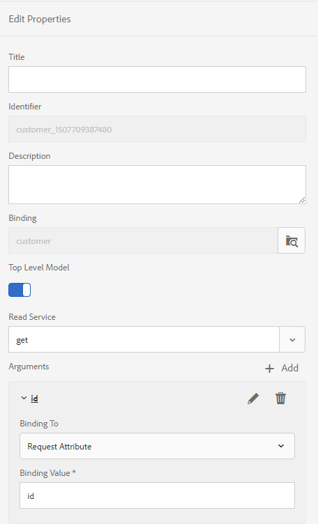

# Meerdere interactieve communicatie genereren met de Batch-API {#use-batch-api-to-generate-multiple-ic}

U kunt de batch-API gebruiken om meerdere interactieve communicatie van een sjabloon te maken. De sjabloon is een interactieve communicatie zonder gegevens. De batch-API combineert gegevens met een sjabloon voor interactieve communicatie. De API is nuttig bij de massaproductie van interactieve communicatie. Bijvoorbeeld telefoonrekeningen, creditcardoverzichten voor meerdere klanten.

De batch-API accepteert records (gegevens) in JSON-indeling en vanuit een formuliergegevensmodel. Het aantal geproduceerde interactieve mededelingen is gelijk aan de verslagen die in het inputJSON dossier in het gevormde Model van de Gegevens van de Vorm worden gespecificeerd. U kunt de API gebruiken om zowel de output van de Druk als van het Web te produceren. Met de optie AFDRUKKEN maakt u een PDF-document en met de optie WEB maakt u gegevens in de JSON-indeling voor elke afzonderlijke record.

## De batch-API gebruiken {#using-the-batch-api}

U kunt de batch-API gebruiken in combinatie met Gecontroleerde mappen of als zelfstandige Rest-API. U configureert een sjabloon, uitvoertype (HTML, PRINT of Beide), landinstelling, Prefill-service en naam voor de gegenereerde interactieve communicatie om de batch-API te gebruiken.

U combineert een record met een interactieve communicatiesjabloon om een interactieve communicatie tot stand te brengen. Batch-API&#39;s kunnen records (gegevens voor interactieve communicatiesjablonen) rechtstreeks lezen vanuit een JSON-bestand of vanuit een externe gegevensbron die via het formuliergegevensmodel wordt benaderd. U kunt elke record in een afzonderlijk JSON-bestand bewaren of een JSON-array maken om alle records in één bestand te houden.

**Eén record in een JSON-bestand**

```JSON
{
   "employee": {
       "name": "Sara",
       "id": 3,
       "mobileNo": 9871996463,
       "age": 37
   }
}
```

**Meerdere records in een JSON-bestand**

```JSON
[{
   "employee": {
       "name": "John",
       "id": 1,
       "mobileNo": 9871996461,
       "age": 39
   }
},{
   "employee": {
       "name": "Jacob",
       "id": 2,
       "mobileNo": 9871996462,
       "age": 38
   }
},{
   "employee": {
       "name": "Sara",
       "id": 3,
       "mobileNo": 9871996463,
       "age": 37
   }
}]
```

### De batch-API gebruiken met gecontroleerde mappen {#using-the-batch-api-watched-folders}

AEM Forms biedt een service voor gecontroleerde mappen die is geconfigureerd voor het gebruik van de batch-API, zodat u deze API gemakkelijk kunt ervaren. U kunt de service openen via de interface van AEM Forms om meerdere interactieve communicatie te genereren. U kunt ook naar wens aangepaste services maken. U kunt de hieronder vermelde methoden gebruiken om Batch API met gecontroleerde map te gebruiken:

* Invoergegevens (records) opgeven in JSON-bestandsindeling voor een interactieve communicatie
* Gebruik invoergegevens (records) die zijn opgeslagen in een externe gegevensbron en die via een formuliergegevensmodel zijn benaderd voor een interactieve communicatie

#### Invoergegevensrecords opgeven in JSON-bestandsindeling voor een interactieve communicatie {#specify-input-data-in-JSON-file-format}

U combineert een record met een interactieve communicatiesjabloon om een interactieve communicatie tot stand te brengen. U kunt een afzonderlijk JSON-bestand maken voor elke record of een JSON-array maken om alle records in één bestand te houden:

Interactieve communicatie maken op basis van records die zijn opgeslagen in een JSON-bestand:

1. Maak een [gecontroleerde map](https://docs.adobe.com/content/help/en/experience-manager-64/forms/publish-process-aem-forms/creating-configure-watched-folder.html) en configureer deze voor gebruik van de Batch-API:
   1. Meld u aan bij de auteur van AEM Forms.
   1. Ga naar **[!UICONTROL Tools]** > **[!UICONTROL Forms]** > **[!UICONTROL Configure Watched Folder]**. Tik op **[!UICONTROL New]**.
   1. Geef de **[!UICONTROL Name]** en fysieke kenmerken **[!UICONTROL Path]** van de map op. Bijvoorbeeld, `c:\batchprocessing`.
   1. Selecteer de **[!UICONTROL Service]** optie in het **[!UICONTROL Process File Using]** veld.
   1. Selecteer de **[!UICONTROL com.adobe.fd.ccm.multichannel.batch.impl.service.InteractiveCommunicationBatchServiceImpl]** service in het **[!UICONTROL Service Name]** veld.
   1. Geef een **[!UICONTROL Output File Pattern]** waarde op. Met het [patroon](https://helpx.adobe.com/experience-manager/6-5/forms/using/admin-help/configuring-watched-folder-endpoints.html#about_file_patterns) %F/ wordt bijvoorbeeld aangegeven dat invoerbestanden in de gecontroleerde map kunnen worden gevonden in een submap van de invoermap \ van de gecontroleerde map.
1. Geavanceerde parameters configureren:
   1. Open het **[!UICONTROL Advanced]** tabblad en voeg de volgende aangepaste eigenschappen toe:

      | Eigenschap | Type | Beschrijving |
      |--- |--- |--- |
      | templatePath | Tekenreeks | Geef het pad op van de interactieve communicatiesjabloon die u wilt gebruiken. Bijvoorbeeld /content/dam/formsanddocuments/testsample/mediumic. Het is een verplicht bezit. |
      | recordPath | Tekenreeks | De waarde van het recordPath gebied helpt plaatsnaam van een interactieve mededeling plaatsen. U kunt een pad van een veld van een record instellen als waarde van het veld recordPath. Als u bijvoorbeeld /employee/Id opgeeft, wordt de waarde van het id-veld een naam voor de bijbehorende interactieve communicatie. De standaardwaarde is een willekeurige [willekeurige UUID](https://docs.oracle.com/javase/7/docs/api/java/util/UUID.html#randomUUID()). |
      | usePrefillService | Boolean | Stel de waarde in op Onwaar. U kunt de parameter usePrefillService gebruiken om interactieve communicatie met gegevens vooraf te vullen die van prefill dienst worden gehaald die voor overeenkomstige interactieve mededeling wordt gevormd. Wanneer usePrefillService is ingesteld op true, worden JSON-invoergegevens (voor elke record) beschouwd als FDM-argumenten. De standaardwaarde is false. |
      | batchType | Tekenreeks | Stel waarde in op AFDRUKKEN, WEB of WEB_AND_PRINT. De standaardwaarde is WEB_AND_PRINT. |
      | locale | Tekenreeks | Geef de landinstelling van interactieve uitvoercommunicatie op. De out-of-the-box service maakt geen gebruik van de landinstelling, maar u kunt wel een aangepaste service maken om gelokaliseerde interactieve communicatie te genereren. De standaardwaarde is nl_NL |

   1. Tik op **[!UICONTROL Create]** de gecontroleerde map.
1. Gebruik de gecontroleerde map om interactieve communicatie te genereren:
   1. Open de gecontroleerde map. Navigeer naar de invoermap.
   1. Maak een map in de invoermap en plaats het JSON-bestand in de nieuwe map.
   1. Wacht tot de gecontroleerde map het bestand heeft verwerkt. Wanneer de verwerking start, worden het invoerbestand en de submap met het bestand naar de testmap verplaatst.
   1. Open de uitvoermap om de uitvoer weer te geven:
      * Wanneer u de optie PRINT opgeeft in Gecontroleerde mapconfiguratie, wordt PDF-uitvoer voor de interactieve communicatie gegenereerd.
      * Wanneer u de optie WEB opgeeft in Gecontroleerde mapconfiguratie, wordt een JSON-bestand per record gegenereerd. U kunt het JSON-bestand gebruiken om een [websjabloon](#web-template)vooraf in te vullen.
      * Wanneer u zowel de opties AFDRUKKEN als WEB opgeeft, worden zowel PDF-documenten als een JSON-bestand per record gegenereerd.

#### Invoergegevens gebruiken die zijn opgeslagen in een externe gegevensbron en die via het formuliergegevensmodel kunnen worden benaderd om een interactieve communicatie te produceren {#use-fdm-as-data-source}

U combineert gegevens (verslagen) die in een externe gegevensbron met een interactieve communicatie malplaatje worden bewaard om een interactieve mededeling te produceren. Wanneer u een interactieve mededeling creeert, verbindt u het met een externe gegevensbron via een Model van de Gegevens van het Vorm (FDM) om tot gegevens toegang te hebben. U kunt de Gecontroleerde service Mappen in batch verwerken om gegevens op te halen met hetzelfde formuliergegevensmodel van een externe gegevensbron. Een interactieve communicatie [maken op basis van records die zijn opgeslagen in een externe gegevensbron](https://docs.adobe.com/content/help/en/experience-manager-64/forms/form-data-model/work-with-form-data-model.html):

1. Configureer het formuliergegevensmodel van de sjabloon:
   1. Open het formuliergegevensmodel dat is gekoppeld aan de interactieve communicatiesjabloon.
   1. Selecteer het MODEL BOVENSTE NIVEAU en tik op Eigenschappen bewerken.
   1. Selecteer de ophaalfunctie of ontvang de service in het veld Leesservice onder Eigenschappen bewerken.
   1. Tik op het potloodpictogram voor het argument van de leesservice om het argument aan een kenmerk Request te binden en de bindingswaarde op te geven. Het bindt het de dienstargument aan de gespecificeerde bindende attributen of letterlijke waarde, die tot de dienst als argument wordt overgegaan om details te halen verbonden aan de gespecificeerde waarde uit de gegevensbron.

      <br>
        In dit voorbeeld neemt het id-argument de waarde van het id-kenmerk van het gebruikersprofiel en geeft dit als een argument door aan de leesservice. Het zal waarden van bijbehorende eigenschappen van het voorwerp van het werknemersgegevensmodel voor gespecificeerde identiteitskaart lezen en terugkeren. Dus als u 00250 opgeeft in het veld Id in het formulier, leest de leestoepassing details van de werknemer met 00250 werknemer-id.
        <br>

      

   1. Eigenschappen en formuliergegevensmodel opslaan.
1. Waarde configureren voor aanvraagkenmerk:
   1. Maak een .json-bestand op uw bestandssysteem en open het voor bewerking.
   1. Maak een JSON-array en geef het primaire kenmerk op om gegevens op te halen uit het formuliergegevensmodel. Bijvoorbeeld, verzoekt volgende JSON FDM om gegevens van verslagen te verzenden waar identiteitskaart 27126 of 27127 is:

      ```json
          [
              {
                  "id": 27126
              },
              {
                  "id": 27127
              }
          ]
      ```

   1. Sla het bestand op en sluit het.

1. Maak een [gecontroleerde map](https://docs.adobe.com/content/help/en/experience-manager-64/forms/publish-process-aem-forms/creating-configure-watched-folder.html) en configureer deze voor gebruik van de Batch API-service:
   1. Meld u aan bij de auteur van AEM Forms.
   1. Ga naar **[!UICONTROL Tools]** > **[!UICONTROL Forms]** > **[!UICONTROL Configure Watched Folder]**. Tik op **[!UICONTROL New]**.
   1. Geef de **[!UICONTROL Name]** en fysieke kenmerken **[!UICONTROL Path]** van de map op. Bijvoorbeeld, `c:\batchprocessing`.
   1. Selecteer de **[!UICONTROL Service]** optie in het **[!UICONTROL Process File Using]** veld.
   1. Selecteer de **[!UICONTROL com.adobe.fd.ccm.multichannel.batch.impl.service.InteractiveCommunicationBatchServiceImpl]** service in het **[!UICONTROL Service Name]** veld.
   1. Geef een **[!UICONTROL Output File Pattern]** waarde op. Met het [patroon](https://helpx.adobe.com/experience-manager/6-5/forms/using/admin-help/configuring-watched-folder-endpoints.html#about_file_patterns) %F/ wordt bijvoorbeeld aangegeven dat invoerbestanden in de gecontroleerde map kunnen worden gevonden in een submap van de invoermap \ van de gecontroleerde map.
1. Geavanceerde parameters configureren:
   1. Open het **[!UICONTROL Advanced]** tabblad en voeg de volgende aangepaste eigenschappen toe:

      | Eigenschap | Type | Beschrijving |
      |--- |--- |--- |
      | templatePath | Tekenreeks | Geef het pad op van de interactieve communicatiesjabloon die u wilt gebruiken. Bijvoorbeeld /content/dam/formsanddocuments/testsample/mediumic. Het is een verplicht bezit. |
      | recordPath | Tekenreeks | De waarde van het recordPath gebied helpt plaatsnaam van een interactieve mededeling plaatsen. U kunt een pad van een veld van een record instellen als waarde van het veld recordPath. Als u bijvoorbeeld /employee/Id opgeeft, wordt de waarde van het id-veld een naam voor de bijbehorende interactieve communicatie. De standaardwaarde is een willekeurige [willekeurige UUID](https://docs.oracle.com/javase/7/docs/api/java/util/UUID.html#randomUUID()). |  |
      | usePrefillService | Boolean | Stel de waarde in op Waar. De standaardwaarde is false.  Als de waarde is ingesteld op true, leest de batch-API gegevens uit het geconfigureerde formuliergegevensmodel en wordt deze gevuld naar de interactieve communicatie. Wanneer usePrefillService is ingesteld op true, worden JSON-invoergegevens (voor elke record) beschouwd als FDM-argumenten. |
      | batchType | Tekenreeks | Stel waarde in op AFDRUKKEN, WEB of WEB_AND_PRINT. De standaardwaarde is WEB_AND_PRINT. |
      | locale | Tekenreeks | Geef de landinstelling van interactieve uitvoercommunicatie op. De out-of-the-box service maakt geen gebruik van de landinstelling, maar u kunt wel een aangepaste service maken om gelokaliseerde interactieve communicatie te genereren. De standaardwaarde is nl_NL. |

   1. Tik op **[!UICONTROL Create]** de gecontroleerde map.
1. Gebruik de gecontroleerde map om interactieve communicatie te genereren:
   1. Open de gecontroleerde map. Navigeer naar de invoermap.
   1. Maak een map in de invoermap. Plaats het JSON-bestand dat in Stap 2 is gemaakt in de nieuwe map.
   1. Wacht tot de gecontroleerde map het bestand heeft verwerkt. Wanneer de verwerking start, worden het invoerbestand en de submap met het bestand naar de testmap verplaatst.
   1. Open de uitvoermap om de uitvoer weer te geven:
      * Wanneer u de optie PRINT opgeeft in Gecontroleerde mapconfiguratie, wordt PDF-uitvoer voor de interactieve communicatie gegenereerd.
      * Wanneer u de optie WEB opgeeft in Gecontroleerde mapconfiguratie, wordt een JSON-bestand per record gegenereerd. U kunt het JSON-bestand gebruiken om een [websjabloon](#web-template)vooraf in te vullen.
      * Wanneer u zowel de opties AFDRUKKEN als WEB opgeeft, worden zowel PDF-documenten als een JSON-bestand per record gegenereerd.

## De batch-API aanroepen met REST-aanvragen

U kunt [de batch-API](https://helpx.adobe.com/experience-manager/6-5/forms/javadocs/index.html) aanroepen via REST-verzoeken (Representational State Transfer). Het staat u toe om een REST eindpunt aan andere gebruikers te verstrekken om tot API toegang te hebben en uw eigen methodes voor verwerking, het opslaan, en het aanpassen van interactieve mededeling te vormen. U kunt uw eigen aangepaste Java-servlet ontwikkelen om de API te implementeren in uw AEM-instantie.

Voordat u de Java-servlet implementeert, moet u ervoor zorgen dat u een interactieve communicatie hebt en dat de bijbehorende gegevensbestanden gereed zijn. Voer de volgende stappen uit om het Java-servlet te maken en te implementeren:

1. Meld u aan bij uw AEM-instantie en maak een interactieve communicatie. Als u de interactieve communicatie wilt gebruiken die in de voorbeeldcode hieronder wordt vermeld, [klikt u hier](assets/SimpleMediumIC.zip).
1. [Ontwikkel en implementeer een AEM-project met Apache Maven](https://helpx.adobe.com/experience-manager/using/maven_arch13.html) op uw AEM-instantie.
1. Voeg [AEM Forms Client SDK versie 6.0.12](https://repo.adobe.com/nexus/content/repositories/public/com/adobe/aemfd/aemfd-client-sdk/) of hoger toe aan de lijst met afhankelijkheden van het POM-bestand van uw AEM-project. Bijvoorbeeld,

   ```XML
       <dependency>
           <groupId>com.adobe.aemfd</groupId>
           <artifactId>aemfd-client-sdk</artifactId>
           <version>6.0.122</version>
       </dependency>
   ```

1. Open het project van Java, creeer een .java dossier, bijvoorbeeld CCMBatchServlet.java. Voeg de volgende code toe aan het bestand:

   ```java
           package com.adobe.fd.ccm.multichannel.batch.integration;
   
           import java.io.File;
           import java.io.FileInputStream;
           import java.io.FileOutputStream;
           import java.io.IOException;
           import java.io.InputStream;
           import java.io.PrintWriter;
           import java.util.List;
           import javax.servlet.Servlet;
           import org.apache.commons.io.IOUtils;
           import org.apache.sling.api.SlingHttpServletRequest;
           import org.apache.sling.api.SlingHttpServletResponse;
           import org.apache.sling.api.servlets.SlingAllMethodsServlet;
           import org.json.JSONArray;
           import org.json.JSONObject;
           import org.osgi.service.component.annotations.Component;
           import org.osgi.service.component.annotations.Reference;
   
           import com.adobe.fd.ccm.multichannel.batch.api.builder.BatchConfigBuilder;
           import com.adobe.fd.ccm.multichannel.batch.api.factory.BatchComponentBuilderFactory;
           import com.adobe.fd.ccm.multichannel.batch.api.model.BatchConfig;
           import com.adobe.fd.ccm.multichannel.batch.api.model.BatchInput;
           import com.adobe.fd.ccm.multichannel.batch.api.model.BatchResult;
           import com.adobe.fd.ccm.multichannel.batch.api.model.BatchType;
           import com.adobe.fd.ccm.multichannel.batch.api.model.RecordResult;
           import com.adobe.fd.ccm.multichannel.batch.api.model.RenditionResult;
           import com.adobe.fd.ccm.multichannel.batch.api.service.BatchGeneratorService;
           import com.adobe.fd.ccm.multichannel.batch.util.BatchConstants;
           import java.util.Date;
   
   
           @Component(service=Servlet.class,
           property={
                   "sling.servlet.methods=GET",
                   "sling.servlet.paths="+ "/bin/batchServlet"
           })
           public class CCMBatchServlet extends SlingAllMethodsServlet {
   
               @Reference
               private BatchGeneratorService batchGeneratorService;
               @Reference
               private BatchComponentBuilderFactory batchBuilderFactory;
               public void doGet(SlingHttpServletRequest req, SlingHttpServletResponse resp) {
                   try {
                       executeBatch(req,resp);
                   } catch (Exception e) {
                       e.printStackTrace();
                   }
               }
               private void executeBatch(SlingHttpServletRequest req, SlingHttpServletResponse resp) throws Exception {
                   int count = 0;
                   JSONArray inputJSONArray = new JSONArray();
                   String filePath = req.getParameter("filePath");
                   InputStream is = new FileInputStream(filePath);
                   String data = IOUtils.toString(is);
                   try {
                       // If input file is json object, then create json object and add in json array, if not then try for json array
                       JSONObject inputJSON = new JSONObject(data);
                       inputJSONArray.put(inputJSON);
                   } catch (Exception e) {
                       try {
                           // If input file is json array, then iterate and add all objects into inputJsonArray otherwise throw exception
                           JSONArray inputArray = new JSONArray(data);
                           for(int i=0;i<inputArray.length();i++) {
                               inputJSONArray.put(inputArray.getJSONObject(i));
                           }
                       } catch (Exception ex) {
                           throw new Exception("Invalid JSON Data. File name : " + filePath, ex);
                       }
                   }
                   BatchInput batchInput = batchBuilderFactory.getBatchInputBuilder().setData(inputJSONArray).setTemplatePath("/content/dam/formsanddocuments/[path of the interactive communcation]").build();
                   BatchConfig batchConfig = batchBuilderFactory.getBatchConfigBuilder().setBatchType(BatchType.WEB_AND_PRINT).build();
                   BatchResult batchResult = batchGeneratorService.generateBatch(batchInput, batchConfig);
                   List<RecordResult> recordList = batchResult.getRecordResults();
                   JSONObject result = new JSONObject();
                   for (RecordResult recordResult : recordList) {
                       String recordId = recordResult.getRecordID();
                       for (RenditionResult renditionResult : recordResult.getRenditionResults()) {
                           if (renditionResult.isRecordPassed()) {
                               InputStream output = renditionResult.getDocumentStream().getInputStream();
                               result.put(recordId +"_"+renditionResult.getContentType(), output);
   
                               Date date= new Date();
                               long time = date.getTime();
   
                               // Print output
                               if(getFileExtension(renditionResult.getContentType()).equalsIgnoreCase(".json")) {
                                   File file = new File(time + getFileExtension(renditionResult.getContentType()));
                                   copyInputStreamToFile(output, file);
                               } else
                               {
                                   File file = new File(time + getFileExtension(renditionResult.getContentType()));
                                   copyInputStreamToFile(output, file);
                               }
                           }
                       }
                   }
                   PrintWriter writer = resp.getWriter();
                   JSONObject resultObj = new JSONObject();
                   resultObj.put("result", result);
                   writer.write(resultObj.toString());
               }
   
   
               private static void copyInputStreamToFile(InputStream inputStream, File file)
                       throws IOException {
   
                       try (FileOutputStream outputStream = new FileOutputStream(file)) {
   
                           int read;
                           byte[] bytes = new byte[1024];
   
                           while ((read = inputStream.read(bytes)) != -1) {
                               outputStream.write(bytes, 0, read);
                           }
   
                       }
   
                   }
   
   
               private String getFileExtension(String contentType) {
                   if (contentType.endsWith(BatchConstants.JSON)) {
                       return ".json";
                   } else return ".pdf";
               }
   
   
           }
   ```

1. Vervang in de bovenstaande code het sjabloonpad (setTemplatePath) door het pad van uw sjabloon en stel de waarde van de setBatchType-API in:
   * Wanneer u de optie AFDRUKKEN opgeeft, wordt PDF-uitvoer voor de interactieve communicatie gegenereerd.
   * Wanneer u de optie WEB opgeeft, wordt een JSON-bestand per record gegenereerd. U kunt het JSON-bestand gebruiken om een [websjabloon](#web-template)vooraf in te vullen.
   * Wanneer u zowel de opties AFDRUKKEN als WEB opgeeft, worden zowel PDF-documenten als een JSON-bestand per record gegenereerd.

1. [Gebruik maven om de bijgewerkte code in te voeren in uw AEM-instantie](https://helpx.adobe.com/experience-manager/using/maven_arch13.html#BuildtheOSGibundleusingMaven).
1. Roep de batch-API aan om de interactieve communicatie te genereren. Afhankelijk van het aantal records retourneert de batch-API een stroom PDF- en .json-bestanden. U kunt het JSON-bestand gebruiken om een [websjabloon](#web-template)vooraf in te vullen. Als u de bovenstaande code gebruikt, wordt de API geïmplementeerd op `http://localhost:4502/bin/batchServlet`. De code drukt en retourneert een stroom van een PDF- en JSON-bestand.

### Een websjabloon vooraf invullen {#web-template}

Wanneer u batchType plaatst om het Kanaal van het Web terug te geven, produceert API een JSON dossier voor elk gegevensverslag. Met de volgende syntaxis kunt u het JSON-bestand samenvoegen met het overeenkomende webkanaal om een interactieve communicatie te genereren:

**Syntaxis**
`http://host:port/<template-path>/jcr:content?channel=web&mode=preview&guideMergedJsonPath=<guide-merged-json-path>`

**Voorbeeld** Als uw JSON-bestand zich op `C:\batch\mergedJsonPath.json` en u de onderstaande interactieve communicatiesjabloon gebruikt: `http://host:port/content/dam/formsanddocuments/testsample/mediumic/jcr:content?channel=web`

Dan toont volgende URL op de publicatieknoop het Kanaal van het Web van de interactieve mededeling
`http://host:port/<path-to-ic>/jcr:content?channel=web&mode=preview&guideMergedJsonPath=file:///C:/batch/mergedJsonData.json`

U slaat de gegevens niet alleen op het bestandssysteem op, maar u slaat JSON-bestanden ook op in CRX-opslagruimte, bestandssysteem, webserver of u hebt toegang tot gegevens via de OSGI-prefill-service. De syntaxis om gegevens samen te voegen die diverse protocollen gebruiken is:

* **CRX-protocol**
   `http://host:port/<path-to-ic>/jcr:content?channel=web&mode=preview&guideMergedJsonPath=crx:///tmp/fd/af/mergedJsonData.json`

* **Bestandsprotocol**
   `http://host:port/<path-to-ic>/jcr:content?channel=web&mode=preview&guideMergedJsonPath=file:///C:/Users/af/mergedJsonData.json`

* **Prefill-serviceprotocol**
   `http://host:port/<path-to-ic>/jcr:content?channel=web&mode=preview&guideMergedJsonPath=service://[SERVICE_NAME]/[IDENTIFIER]`

   SERVICE_NAME verwijst naar de naam van de prefill dienst OSGI. Zie Een vooraf ingevulde service maken en uitvoeren.

   IDENTIFIER verwijst naar om het even welke meta-gegevens die door de Prefill dienst worden vereist OSGI om de Prefill gegevens te halen. Een id voor de aangemelde gebruiker is een voorbeeld van metagegevens die kunnen worden gebruikt.

* **HTTP-protocol**
   `http://host:port/<path-to-ic>/jcr:content?channel=web&mode=preview&guideMergedJsonPath=http://localhost:8000/somesamplexmlfile.xml`

>[!NOTE]
> Alleen het CRX-protocol is standaard ingeschakeld. Om andere gesteunde protocollen toe te laten, zie het [Vormen van vooraf ingevulde dienst gebruikend de Manager](https://helpx.adobe.com/experience-manager/6-5/forms/using/prepopulate-adaptive-form-fields.html#ConfiguringprefillserviceusingConfigurationManager)van de Configuratie.
