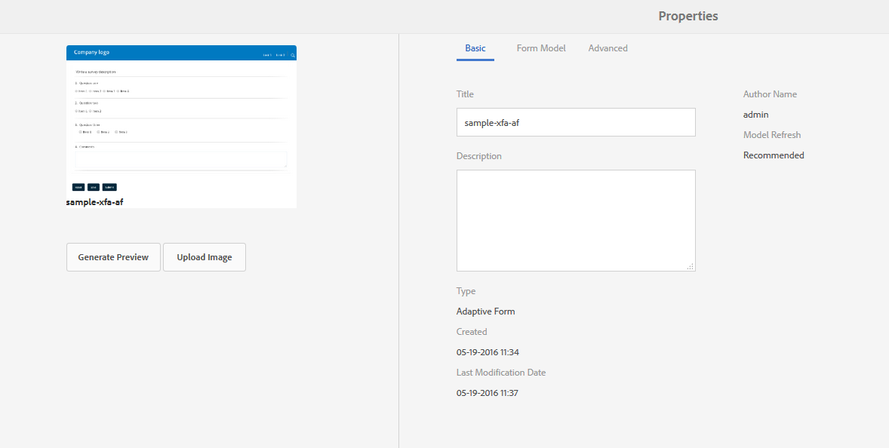

# XDP- en PDF-documenten ophalen in AEM Forms{#getting-xdp-and-pdf-documents-in-aem-forms}

## Overzicht {#overview}

U kunt uw formulieren vanuit uw lokale bestandssysteem importeren in de CRX-opslagplaats door deze te uploaden naar AEM Forms. De uploadbewerking wordt ondersteund voor de volgende elementtypen:

* Formuliersjablonen (XFA-formulieren)
* PDF forms
* Document (vlakke PDF documenten)

U kunt de ondersteunde elementtypen afzonderlijk of als ZIP-archief uploaden. U kunt een element van het type uploaden `Resource`, alleen naast een XFA-formulier in een ZIP-archief.

>[!NOTE]
>
>Zorg ervoor dat u lid bent van de `form-power-users` te uploaden XDP-bestanden. Neem contact op met de beheerder om lid te worden van de groep.

## Formulieren downloaden {#uploading-forms}

1. Meld u aan bij de gebruikersinterface van AEM Forms via `https://'[server]:[port]'/aem/forms.html`.
1. Navigeer naar de map waarin u het formulier of de map met formulieren wilt uploaden.
1. Selecteer op de werkbalk Handelingen de optie **Maken > Bestand uploaden**.

   

1. In het dialoogvenster Formulier of pakketten uploaden kunt u bladeren naar het bestand dat u wilt uploaden en het bestand kiezen. In de bestandsbrowser worden alleen de ondersteunde bestandsindelingen (ZIP, XDP en PDF) weergegeven.

   >[!NOTE]
   >
   >Een bestandsnaam mag alleen alfanumerieke tekens, afbreekstreepjes of onderstrepingstekens bevatten.

1. Klik op Uploaden na bestandsselectie om de bestanden te uploaden of klik op Annuleren om het uploaden te annuleren. Een pop-up maakt een lijst van de activa die worden toegevoegd en de activa die bij de huidige plaats worden bijgewerkt.

   >[!NOTE]
   >
   >Voor een ZIP-bestand worden de relatieve paden van alle ondersteunde elementen weergegeven. Niet-ondersteunde elementen in het ZIP-bestand worden genegeerd en niet vermeld. Als het ZIP-archief echter alleen de niet-ondersteunde elementen bevat, wordt een foutbericht weergegeven in plaats van het pop-updialoogvenster.

   

1. Als een of meer elementen een ongeldige bestandsnaam hebben, wordt een fout weergegeven. Corrigeer de in rood gemarkeerde bestandsnamen en upload ze opnieuw.

   

Wanneer het uploaden is voltooid, genereert een achtergrondworkflow miniaturen voor elk element op basis van de voorvertoning van het element. Nieuwere versies van elementen, indien geüpload, overschrijven de bestaande elementen.

### Beveiligde modus {#protected-mode}

Met AEM Forms-server kunt u JavaScript-code uitvoeren. Een kwaadaardige JavaScript-code kan schadelijk zijn voor een AEM Forms-omgeving. De beveiligde modus beperkt AEM Forms om XDP-bestanden alleen uit te voeren vanuit vertrouwde elementen en locaties. Alle XDP-gegevens die beschikbaar zijn in de gebruikersinterface van AEM Forms worden beschouwd als vertrouwde elementen.

De beveiligde modus is standaard ingeschakeld. Indien nodig kunt u de beveiligde modus uitschakelen:

1. Meld u als beheerder aan bij AEM webconsole. De URL is https://&#39;[server]:[poort]&#39;/system/console/configMgr
1. Open Mobile Forms Configurations voor bewerking.
1. Schakel de optie Beveiligde modus uit en klik op **Opslaan**. De beveiligde modus is uitgeschakeld.

## XFA-formulieren waarnaar wordt verwezen bijwerken {#updating-referenced-xfa-forms}

In AEM Forms kan naar een XFA-formuliersjabloon worden verwezen door een adaptief formulier of een andere XFA-formuliersjabloon. Ook, kan een malplaatje naar een middel of een ander malplaatje verwijzen XFA.

Voor een adaptief formulier dat verwijst naar een XFA, zijn de velden gebonden aan de velden die beschikbaar zijn in de XFA. Bij het bijwerken van een formuliersjabloon probeert het bijbehorende adaptieve formulier te synchroniseren met de XFA. Zie voor meer informatie [Aangepaste formulieren synchroniseren met de bijbehorende XFA](../../forms/using/synchronizing-adaptive-forms-xfa.md).

Als u een formuliersjabloon verwijdert, wordt het afhankelijke adaptieve formulier of de afhankelijke formuliersjabloon beschadigd. Een dergelijk adaptief formulier wordt soms informeel een vuile vorm genoemd. In de gebruikersinterface van AEM Forms kunt u op de volgende twee manieren de vuile formulieren vinden.

* Er wordt een waarschuwingspictogram weergegeven op de miniatuur van het aangepaste formulier in de lijst met elementen. Het volgende bericht wordt weergegeven wanneer u de aanwijzer boven het waarschuwingspictogram houdt.\
  `Schema/Form Template for this adaptive form has been updated so go to Authoring mode and rebase it with new version.`

Er wordt een vlag onderhouden om aan te geven of een adaptief formulier bevuild is. Deze informatie is beschikbaar op de pagina met formuliereigenschappen, naast de metagegevens van het formulier. Alleen voor vuile adaptieve formulieren, een eigenschap metadata `Model Refresh` displays `Recommended` waarde.

