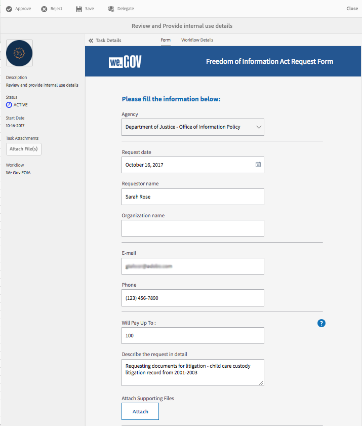
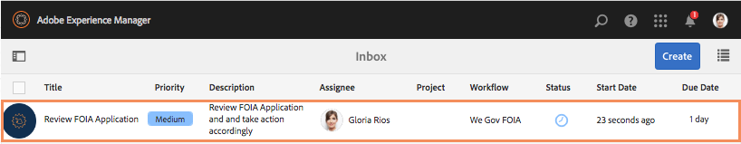

# We.Gov-referentiesite FOIA-doortocht {#we-gov-reference-site-foia-walkthrough}

## Referentiescenario voor de Freedom of Information Act {#reference-site-freedom-of-information-act-scenario}

We.Gov is een door de staat beheerde organisatie die adoptieve ouders de mogelijkheid biedt zich in te schrijven voor kinderopvang als ze een kind adopteren. We.Gov staat ouders ook toe om informatie te vragen van de volgende regeringsdepartementen in het kader van de wet op de vrijheid van informatie:

* Defense Logistics Agency
* Department of Defense Office of Inspector General
* Department of Justice - Office of Information Policy
* Departement marine
* Agentschap voor milieubescherming

Voor meer informatie over de Wet van de Vrijheid van Informatie, zie [ https://www.foia.gov/ ](https://www.foia.gov).

Het scenario omvat de volgende personen:

* Sarah Rose, de persoon die om informatie verzoekt krachtens
* John Jacobs, de persoon die het verzoek behandelt, stuurt het door naar de bevoegde dienst
* Gloria Rios, de overheidsfunctionaris die de informatie verstrekt overeenkomstig het verzoek

## Sarah initieert verzoek om informatie onder FOIA {#sarah-initiates-request-for-information-under-foia}

Op grond van de Freedom of Information Act vraagt Sarah om een kopie van de &quot;Administration for Children and Families case logs&quot; voor de jaren 2013 tot en met 2016. Sarah legt dit verzoek voor aan het Ministerie van Justitie - Office of Information Policy en geeft ook aan dat ze tot 100 dollar kan betalen voor de druk- en postkosten.

### Hoe werkt het {#how-it-works}

### Zie het zelf {#see-it-yourself}

Open `https://<hostname>:<PublishPort>/wegov` in uw browser. Selecteer Toepassingen > Alle toepassingen op de website Web.Gov. Selecteer Toepassen onder Toepassing voor FOIA-verzoek op de pagina Alle toepassingen.

## Sarah start haar verzoek om informatie onder FOIA {#sarah-starts-her-application-for-information-under-foia}

Sarah klikt **toepassen** en in de pagina van het Verzoek van de Vorm van het Verzoek van de Akte van de Vrijheid van Informatie, gaat Sarah informatie met inbegrip van het volgende in:

* **Agentschap:** Sarah specificeert het agentschap waaraan het verzoek als Afdeling van Justitie - Bureau van het Beleid van de Informatie werd gericht.

* **zal tot** betalen: Sarah specificeert dat zij bereid is tot USD 100 voor druk en postage uitgaven te betalen.
* **beschrijf het verzoek in detail**: Sarah specificeert &quot;het Verzoeken exemplaar van het Beleid voor Kinderen en Families caselogboeken voor begrotingsjaren 2013 door 2016.&quot;

Verzoek om een kopie van het dossier Administratie voor kinderen en gezinnen voor de begrotingsjaren 2013 tot en met 2016

Op elk ogenblik, kan Sarah **sparen** selecteren om een ontwerp van de vorm op te slaan en aan het later terug te komen om de vorm in te vullen en het voor te leggen. Sarah legt het formulier voor.

>[!NOTE]
>
>De workflow voor het hervatten van e-mailberichten werkt alleen met aangemelde gebruikers. In het scenario van de verwijzingsplaats, zorg ervoor dat de gebruiker Sarah Rose wordt toegevoegd. Sarah&#39;s aanmeldgegevens zijn `srose/password` .

## John Jacobs ontvangt de aanvraag en keurt deze goed {#john-jacobs-receives-and-approves-the-application}

John Jacobs ontvangt het verzoek en leidt het naar de juiste persoon. AEM Inbox laat John alle ingediende aanvragen op één plaats zien.

### Hoe werkt het {#how-it-works-1}

Wanneer Sarah de FOIA-toepassing invult en verzendt, wordt een record van de toepassing verzonden naar de inbox van John Jacobs. John Jacobs kan de ingediende aanvraag bekijken en deze accepteren of afwijzen.

### Zie het zelf {#see-it-yourself-1}

U kunt tot AEM Inbox in https://&lt;***toegang hebben hostname***>:&lt; ***PublishPort***>/content/we-finance/global/en/login.html?resource=/aem/inbox.html. Meld u aan bij AEM Inbox met jjacobs/password als gebruikersnaam/wachtwoord voor John Jacobs en zie de FOIA-toepassing. Voor informatie over het gebruiken van AEM Inbox voor vorm-centric werkschematoepassingen, zie [ de toepassingen en de taken van Forms in AEM Inbox ](/help/forms/using/manage-applications-inbox.md) leiden.

John Jacobs kan de toepassing van het toepassingsdashboard zien, goedkeuren of afwijzen. John Jacobs selecteert en opent de verzoekdetails en na het herzien van het verzoek, keurt het goed.

### <strong> Sarah ontvangt een erkenningse-mail </strong> {#strong-sarah-receives-an-acknowledgement-email-strong}

Nadat John Jacobs de toepassing goedkeurt, ontvangt Sarah een ontvangstbevestiging-e-mail van de website We.Gov. Sarah wordt op de hoogte gebracht van de kosten en de tijd die nodig zijn voor de behandeling van haar aanvraag. Het e-mailbericht bevat ook e-mail- en telefoongegevens die Sarah kan raadplegen voor updates van haar toepassing.

## Gloria ontvangt het FOIA-verzoek om goedkeuring op het tweede niveau {#gloria-receives-the-foia-request-for-second-level-approval}

Nadat John Jacobs de vereiste informatie heeft ingevuld en het verzoek van Sarah heeft goedgekeurd, gaat het naar Gloria Rios voor de definitieve goedkeuring. Gloria herziet het bijgevoegde stuk met stukken en keurt het verzoek goed.

### Hoe werkt het {#how-it-works-2}

Wanneer John Jacobs het FOIA-verzoek goedkeurt, wordt een PDF of Document of Record van de aanvraag gemaakt en naar Gloria Rios&#39; inbox verzonden. Gloria kan het ingediende verzoek bekijken en het goedkeuren of afwijzen.

### Zie voor uzelf {#see-for-yourself}

U kunt tot AEM Inbox in https://&lt;***toegang hebben hostname***>:&lt; ***PublishPort***>/content/we-finance/global/en/login.html?resource=/aem/inbox.html. Meld u aan bij de AEM Inbox met behulp van grios/wachtwoord als gebruikersnaam/wachtwoord voor Gloria Rios en raadpleeg het FOIS-verzoek.

Gloria opent het verzoek en onderzoekt de bijzonderheden van het FOIA-verzoek. Na bestudering van de bijzonderheden van het verzoek en na te gaan of het haalbaar is de vereiste documenten over te leggen, keurt Gloria het verzoek goed.

 goed

## Sarah ontvangt een melding dat haar verzoek is goedgekeurd {#sarah-receives-notification-that-her-request-is-approved}

Nadat Gloria het FOIA-verzoek heeft goedgekeurd, ontvangt Sarah een e-mail met de kennisgeving dat haar verzoek is goedgekeurd. Het e-mailbericht bevat ook de informatie over de voorlopige tijdlijn voor het verzenden van het document en contactgegevens voor de follow-up van het verzoek.

