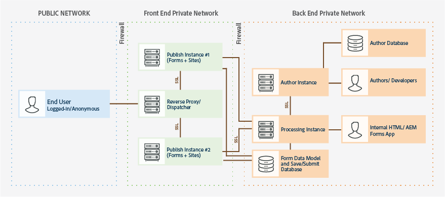

# Verharden en beveiligen van AEM formulieren op OSGi-omgeving {#hardening-and-securing-aem-forms-on-osgi-environment}

Leer aanbevelingen en beste praktijken voor het beveiligen van AEM Forms op server OSGi.

Het beveiligen van een serveromgeving is van het grootste belang voor een organisatie. In dit artikel worden aanbevelingen en aanbevolen procedures beschreven voor het beveiligen van servers waarop AEM Forms wordt uitgevoerd. Dit is geen uitgebreid host-hardend document voor uw besturingssysteem. In plaats daarvan, beschrijft dit artikel diverse veiligheid-verhardende montages die u zou moeten uitvoeren om de veiligheid van uw opgestelde toepassing te verbeteren. Om ervoor te zorgen dat de toepassingsservers veilig blijven, echter, zou u veiligheid controle, opsporing, en reactieprocedures naast aanbevelingen ook moeten uitvoeren die in dit artikel worden verstrekt. Het document bevat ook beproefde methoden en richtlijnen voor het beveiligen van PII (Persoonlijk identificeerbare informatie).

Het artikel is bedoeld voor consultants, beveiligingsspecialisten, systeemarchitecten en IT-professionals die verantwoordelijk zijn voor de planning van de toepassing of de ontwikkeling en implementatie van de infrastructuur van AEM Forms. Deze rollen omvatten de volgende gemeenschappelijke rollen:

* IT en de ingenieurs van verrichtingen die veilige Webtoepassingen en servers in hun eigen of klantenorganisaties moeten opstellen.
* Architecten en planners die verantwoordelijk zijn voor de planning van de architectuurinspanningen voor de klanten in hun organisaties.
* IT-beveiligingsspecialisten die zich richten op het bieden van beveiliging op alle platforms binnen hun organisatie.
* Adviseurs van Adobe en partners die gedetailleerde middelen voor klanten en partners vereisen.

De volgende afbeelding toont componenten en protocollen die worden gebruikt in een standaard AEM Forms-implementatie, inclusief de juiste firewalltopologie:

AEM Forms is zeer aanpasbaar en kan in veel verschillende omgevingen werken. Sommige aanbevelingen zijn mogelijk niet van toepassing op uw organisatie.

## Beveiligde transportlaag {#secure-transport-layer}

De kwetsbaarheid van de laagveiligheid van het vervoer is onder de eerste bedreigingen aan om het even welke Internet-Onder ogen ziet of intranet-Onder ogen ziet toepassingsserver. Deze sectie beschrijft het proces om gastheren op het netwerk tegen deze kwetsbaarheid te verharden. Het richt netwerksegmentatie, de stapelverharding van het Protocol van de Controle van de Transmissie/van Internet-protocol (TCP/IP), en het gebruik van firewalls voor gastheerbescherming.

### Open eindpunten beperken  {#limit-open-endpoints}

Een organisatie kan een externe firewall hebben om toegang tussen een eindgebruiker en AEM Forms te beperken publiceer Farm. De organisatie kan een interne firewall ook hebben om toegang tussen te beperken publiceer landbouwbedrijf en andere binnen organisatieelementen (bijvoorbeeld, auteursinstantie, verwerkingsinstantie, gegevensbestanden). firewalls toestaan toegang tot een beperkt aantal AEM Forms URL&#39;s voor eindgebruikers en binnen organisaties toe te staan:

#### Externe firewall configureren  {#configure-external-firewall}

U kunt een externe firewall zo configureren dat bepaalde AEM Forms-URL&#39;s toegang hebben tot internet. U hebt toegang tot deze URL&#39;s nodig om een adaptief formulier, HTML5, een brief voor correspondentiebeheer of een aanmelding bij een AEM Forms-server in te vullen of te verzenden:

<table> 
 <tbody>
  <tr>
   <td>Component</td> 
   <td>URI</td> 
  </tr>
  <tr>
   <td>Aangepaste formulieren</td> 
   <td>
    <ul> 
     <li>/content/dam/formsanddocuments/AF_PATH/jcr:content</li> 
     <li>/etc/clientlibs/fd/</li> 
     <li>/content/forms/af/AF_PATH</li> 
     <li>/libs/graniet/csrf/</li> 
    </ul> </td> 
  </tr>
  <tr>
   <td>HTML5-formulieren</td> 
   <td>
    <ul> 
     <li>/content/forms/formsets/profiles/</li> 
    </ul> </td> 
  </tr>
  <tr>
   <td>Correspondentenbeheer </td> 
   <td>
    <ul> 
     <li>/aem/forms/createcorrespondence* </li> 
    </ul> </td> 
  </tr>
  <tr>
   <td>Forms Portal </td> 
   <td>
    <ul> 
     <li>/content/forms/portal/</li> 
     <li>/libs/cq/ui/widgets*</li> 
     <li>/libs/cq/security/</li> 
    </ul> </td> 
  </tr>
  <tr>
   <td> AEM Forms App</td> 
   <td>
    <ul> 
     <li>/j_security_check*</li> 
     <li>/soap/services/AuthenticationManagerService</li> 
    </ul> </td> 
  </tr>
 </tbody>
</table>

#### Interne firewall configureren  {#configure-internal-firewall}

U kunt de interne firewall vormen om bepaalde componenten van AEM Forms (bijvoorbeeld, auteursinstantie, verwerkingsinstantie, gegevensbestanden) toe te staan om met te communiceren publiceer landbouwbedrijf en andere interne componenten die in het topologiediagram worden vermeld:

<table> 
 <tbody>
  <tr>
   <td>Host  </td> 
   <td>URI</td> 
  </tr>
  <tr>
   <td>Publish Farm (publicatieknooppunten)</td> 
   <td>/bin/receive</td> 
  </tr>
  <tr>
   <td>Verwerkingsserver</td> 
   <td>/content/forms/fp/*</td> 
  </tr>
  <tr>
   <td>Forms Workflow-add-onserver (AEM Forms op JEE-server)</td> 
   <td>/soap/sdk</td> 
  </tr>
 </tbody>
</table>

#### Machtigingen van de bewaarplaats van de opstelling en toegangsbeheerlijsten (ACLs) {#setup-repository-permissions-and-access-control-lists-acls}

Standaard zijn de middelen op de publicatieknooppunten toegankelijk voor iedereen. Alleen-lezen toegang is ingeschakeld voor alle elementen. Het is vereist anonieme toegang toe te laten. Als u de formulierweergave wilt beperken en alleen voor geverifieerde gebruikers toegang wilt geven, gebruikt u een algemene groep om alleen geverifieerde gebruikers alleen-lezentoegang te geven tot de elementen die beschikbaar zijn op de publicatieknooppunten. De volgende locaties/mappen bevatten formulierelementen die verharding vereisen (alleen-lezen toegang voor geverifieerde gebruikers):

* /content/&amp;ast;
* /etc.clientlibs/fd/&amp;ast;
* /libs/fd/&amp;ast;

## Formuliergegevens veilig verwerken  {#securely-handle-forms-data}

AEM Forms slaat gegevens op vooraf gedefinieerde locaties en tijdelijke mappen op. U moet de gegevens beveiligen om onbevoegd gebruik te voorkomen.

### Periodieke opschoning van tijdelijke map instellen {#setup-periodic-cleanup-of-temporary-folder}

Wanneer u formulieren configureert voor bestandsbijlagen, controleert u of voorbeeldcomponenten, worden de bijbehorende gegevens opgeslagen op de publicatieknooppunten op /tmp/fd/. De gegevens worden periodiek gewist. U kunt de standaardtaak voor het wissen van gegevens wijzigen en deze agressiever maken. Als u de taak die is gepland voor het wissen van gegevens wilt wijzigen, opent u AEM webconsole, opent u de tijdelijke taak voor het opschonen van opslagruimte van AEM Forms en wijzigt u de expressie voor uitsnijden.

In de bovenstaande scenario&#39;s worden de gegevens alleen opgeslagen voor geverifieerde gebruikers. Bovendien wordt het gegeven beschermd met toegangsbeheerlijsten (ACLs). Het wijzigen van de gegevenswissing is dus een extra stap om informatie te beveiligen.

### Beveiligde gegevens opgeslagen door verzendactie van formulierportal {#secure-data-saved-by-forms-portal-submit-action}

Standaard slaat de verzendactie van een portal Formulieren met aangepaste formulieren gegevens op in de lokale opslagplaats van het publicatieknooppunt. De gegevens worden opgeslagen op /content/forms/fp. **Het wordt afgeraden gegevens op te slaan in een publicatie-instantie.**

U kunt de opslagdienst vormen om over-de-draad naar de verwerkingscluster te verzenden zonder om het even wat plaatselijk op te slaan publiceer knoop. De verwerkingscluster bevindt zich in een veilige zone achter de privéfirewall en de gegevens blijven veilig.

Gebruik de referenties van de verwerkingsserver voor AEM DS-instellingenservice om gegevens van het publicatieknooppunt naar de verwerkingsserver te posten. Gebruik de referenties van een niet-beheerbare gebruiker met lees-schrijftoegang tot de opslagplaats van de verwerkingsserver. Zie voor meer informatie [Opslagservices configureren voor concepten en verzending](/help/forms/using/configuring-draft-submission-storage.md).

### Beveiligde gegevens die worden verwerkt door FDM (Form Data Model) {#secure-data-handled-by-form-data-model-fdm}

Gebruik gebruikersaccounts met minimaal vereiste rechten om gegevensbronnen voor het formuliergegevensmodel (FDM) te configureren. Het gebruik van een beheeraccount kan onbevoegde gebruikers toegang bieden tot metagegevens en schema-entiteiten.\
De integratie van gegevens verstrekt ook methodes om FDM de dienstverzoeken toe te laten. U kunt machtigingsmechanismen vóór en na uitvoering invoegen om een aanvraag te valideren. De serviceaanvragen worden gegenereerd tijdens het vooraf invullen van een formulier, het verzenden van een formulier en het aanroepen van services via een regel.

**Voorafgaande goedkeuring:** U kunt de pre-procesvergunning gebruiken om authentificatie van een verzoek te bevestigen alvorens het uit te voeren. U kunt input, de dienst en verzoekdetails gebruiken om uitvoering van het verzoek toe te staan of tegen te houden. U kunt een uitzondering OPERATION_ACCESS_DENIED van de gegevensintegratie terugkeren als de uitvoering wordt tegengehouden. U kunt ook de clientaanvraag wijzigen voordat u deze ter uitvoering verzendt. U kunt bijvoorbeeld de invoer wijzigen en aanvullende informatie toevoegen.

**Toelating na de verwerking:** U kunt de postprocesvergunning gebruiken om de resultaten te bevestigen en te controleren alvorens de resultaten aan aanvrager terug te keren. U kunt ook aanvullende gegevens filteren, verwijderen en invoegen.

### Gebruikerstoegang beperken {#limit-user-access}

Voor auteur-, publicatie- en verwerkingsinstanties is een andere set met gebruikersinstellingen vereist. Voer geen enkel exemplaar met beheerdersreferenties uit.

**Op een publicatie-instantie:**

* Alleen gebruikers van een groep met formuliergebruikers kunnen formulieren voorvertonen, ontwerpen maken en verzenden.
* Alleen gebruikers van een cm-user-agent-groep kunnen een voorbeeld van correspondentiebeheerletters bekijken.
* Alle niet-essentiële anonieme toegang uitschakelen.

**Op een instantie van de auteur:**

* Er is een andere set vooraf gedefinieerde groepen met specifieke rechten voor elke persoon. Wijs gebruikers toe aan groep.

   * Een gebruiker van een gebruikersgroep voor formulieren:

      * U kunt een formulier maken, invullen, publiceren en verzenden.
      * kan geen adaptief formulier op basis van XDP maken.
      * geen machtigingen hebben om scripts voor adaptieve formulieren te schrijven.
      * kan XDP of een pakket dat XDP bevat niet importeren

   * Een gebruiker van een gebruikersgroep voor formulieren maakt, vult, publiceert en verzendt alle typen formulieren, schrijft scripts voor adaptieve formulieren en importeert pakketten met XDP.
   * Een gebruiker van malplaatje-auteurs en malplaatje-macht-gebruiker kan voorproef en een malplaatje creëren.
   * Een gebruiker van fdm-auteurs kan een model van vormgegevens tot stand brengen en wijzigen.
   * Een gebruiker van cm-user-agent groep kan correspondentiebeheerbrieven creëren, voorproef, en publiceren.
   * Een gebruiker van een groep workfloweditors kan een inbox-toepassing en workflowmodel maken.

**Bij de verwerkingsauteur:**

* Voor het op afstand opslaan en verzenden van gebruiksgevallen maakt u een gebruiker met lees-, maak- en wijzigingsmachtigingen voor de inhoud/het formulier/fp-pad van de crx-gegevensopslagruimte.
* Voeg gebruiker aan werkstroom-gebruikersgroep toe om een gebruiker toe te laten om AEM inbox toepassingen te gebruiken.

## Beveiligde intranetelementen van een AEM Forms-omgeving {#secure-intranet-elements-of-an-aem-forms-environment}

Over het algemeen worden verwerkingsclusters en de invoegtoepassing Forms Workflow (AEM Forms on JEE) achter een firewall uitgevoerd. Dus deze worden als veilig beschouwd. U kunt nog steeds een paar stappen uitvoeren om deze omgevingen te beschadigen:

### Veilig verwerkingscluster {#secure-processing-cluster}

Een verwerkingscluster wordt uitgevoerd in de auteursmodus, maar gebruikt deze niet voor ontwikkelingsactiviteiten. Sta niet toe dat een normale gebruiker wordt opgenomen in de groepen van inhoudsauteurs en gebruikers van formulieren in een verwerkingscluster.

### Gebruik AEM beste praktijken om een milieu van AEM Forms te beveiligen {#use-aem-best-practices-to-secure-an-aem-forms-environment}

Dit document bevat specifieke instructies voor de AEM Forms-omgeving. U zou moeten nemen om ervoor te zorgen dat uw onderliggende AEM installatie wanneer opgesteld veilig is. Zie voor gedetailleerde instructies [Beveiligingschecklist AEM](/help/sites-administering/security-checklist.md) documentatie.
