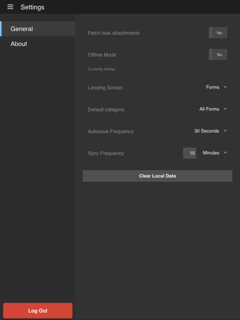

# Startscherm{#home-screen}

Wanneer u zich aanmeldt bij de AEM Forms-toepassing, wordt u omgeleid naar het Basisscherm.

## Standaardstartscherm {#default-home-screen}

Standaard worden in het scherm Home alle formulieren weergegeven, inclusief startpunten en taken (als AEM Forms Workflow ingeschakeld is op de verbonden server), samen met de bijbehorende miniaturen. U kunt de miniaturen opgeven op de AEM Forms-server.

Het volgende cijfer is geannoteerd met vraag-outs aan de essentiële componenten op het standaardscherm van het Huis.

<!--Click to enlarge

-->

1. **Knop Menu**: Tik op de knop **Menu** om naar Taken, Forms, Postvak UIT en Instellingen te navigeren. Als uw AEM Forms-app is verbonden met een AEM Forms JEE-server, kunt u de optie Taken zien. De optie Taken slaat ook de concepten op die van taken in een proces worden gecreeerd. Voor AEM Forms OSGi-servers is de optie Taken verborgen. De opgeslagen formulieren en concepten worden opgeslagen voordat deze worden gesynchroniseerd met de server. Alle opgeslagen formulieren en concepten in het Postvak UIT worden geüpload naar de AEM Forms-server wanneer de toepassing wordt [gesynchroniseerd met de server](../../forms/using/sync-app.md). Voor informatie over Instellingen raadpleegt u [Algemene instellingen bijwerken](../../forms/using/update-general-settings.md).
1. **Taak of formulier**: Tik op de weergegeven taak of het formulier waarmee u wilt werken.
1. **Horizontale ovaal**: Hiermee geeft u aan dat er acties beschikbaar zijn voor het formulier. Als u op de ellips tikt, worden de acties weergegeven die de auteur van de beschrijving heeft opgegeven. De **Concept verwijderen** en **Voltooid** is zichtbaar wanneer u op de ellips tikt.
1. **Pictogram Vernieuwen**: Tik op het pictogram Vernieuwen om uw app te synchroniseren met de AEM Forms-server.

### Het startscherm aanpassen {#customizing-the-home-screen}

U kunt het standaardstartscherm van de app wijzigen vanuit het dialoogvenster **[Algemene instellingen](../../forms/using/update-general-settings.md)** van de app of van de **Voorkeur** op HTML Workspace.

De wijziging in de instelling voor het startscherm op de app is van invloed op het Basisscherm van de huidige aangemelde gebruiker of de gebruiker op het huidige mobiele apparaat.

De wijziging in de werkruimte HTML heeft echter gevolgen voor alle gebruikers van de AEM Forms-app die zich hebben aangemeld bij de AEM Forms-server.
