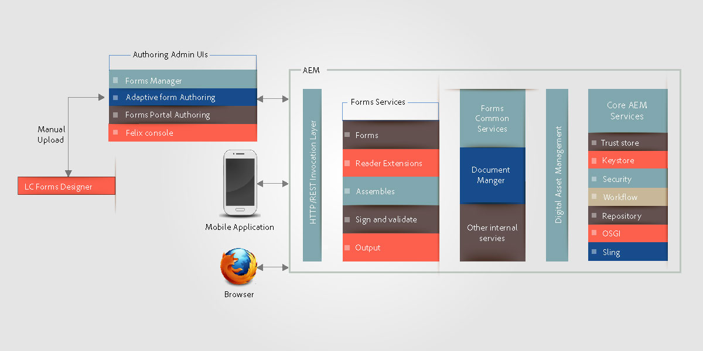

# Architectuur van HTML5-formulieren{#architecture-of-html-forms}

## Architectuur {#architecture}

De functionaliteit voor HTML5-formulieren wordt geïmplementeerd als een pakket binnen de ingesloten AEM-instantie en wordt beschikbaar gesteld als een REST-eindpunt via HTTP/S met behulp van RESTful [Apache Sling Architecture](https://sling.apache.org/).

`` [ 01-aem-vormen-architectuur *Volledige grootte van de Mening *](javascript:void(0).md)

.md)

### Sling Framework gebruiken {#using-sling-framework}

[Apache Sling](https://sling.apache.org/) is hulpbronnengericht. Er wordt een aanvraag-URL gebruikt om de bron eerst op te lossen. Elke bron heeft een **sling:resourceType** (of **sling:resourceSuperType**)-eigenschap. Gebaseerd op dit bezit, de verzoekmethode, en de eigenschappen van het verzoek URL, wordt een sling manuscript dan geselecteerd om het verzoek te behandelen. Dit sling script kan een JSP of een servlet zijn. Voor HTML5-formulieren fungeren **profielknooppunten** als slingerbronnen en fungeert **profielrenderer** als slingscript dat de aanvraag verwerkt om het mobiele formulier te genereren met een bepaald profiel. Een renderer van het **Profiel** is JSP die parameters van een verzoek leest en de Dienst OSGi van Vormen roept.

Voor details over REST eindpunt en gesteunde verzoekparameters, zie het [Teruggeven van het Malplaatje](/help/forms/using/rendering-form-template.md)van de Vorm.

Wanneer een gebruiker een aanvraag indient van een clientapparaat zoals een iOS- of Android-browser, lost Sling eerst het profielknooppunt op op basis van de aanvraag-URL. Van dit Knoop van Profiel, leest het **sling:resourceSuperType** en **sling:resourceType** om alle beschikbare manuscripten te bepalen die dit verzoek van de Render van Vorm kunnen behandelen. Het gebruikt dan het Verdelen verzoekselecteurs samen met verzoekmethode om het manuscript te identificeren het meest geschikt voor de behandeling van dit verzoek. Zodra het verzoek een Renderer JSP van het Profiel bereikt, roept JSP de dienst van Forms OSGi.

Zie [AEM Sling Cheat Sheet](https://docs.adobe.com/content/docs/en/cq/current/developing/sling_cheatsheet.html) of Apache Sling [URL decomposition](https://sling.apache.org/site/url-decomposition.html)voor meer informatie over sling script resolution.

#### Typische stroom van de de vraagvraag van de vormverwerking {#typical-form-processing-call-flow}

In HTML5-formulieren worden alle tussenliggende objecten opgeslagen die vereist zijn om een formulier op de eerste aanvraag te verwerken (uitvoering of verzending). De objecten die afhankelijk zijn van de gegevens worden niet in het cachegeheugen opgeslagen, omdat dergelijke objecten waarschijnlijk worden gewijzigd.

Mobiel formulier behoudt twee verschillende niveaus van cache, namelijk de PreRender-cache en de Render-cache. Het preRender-cache bevat alle fragmenten en afbeeldingen van een opgeloste sjabloon en het Render-cache bevat gerenderde inhoud, zoals HTML.

HTML5-formulierworkflow

In HTML5-formulieren worden geen sjablonen met ontbrekende verwijzingen naar fragmenten en afbeeldingen in de cache opgeslagen. Als HTML5-formulieren meer tijd in beslag nemen dan normaal, controleert u in het serverlogbestand of er ontbrekende verwijzingen en waarschuwingen zijn. Zorg er ook voor dat de maximumgrootte van het object niet wordt bereikt.

De dienst van Vormen OSGi verwerkt een verzoek in twee stappen:

* **Indeling en initiële formulierstatus genereren**: Forms OSGi geeft dienst terug roept de component van het Geheime voorgeheugen van Vormen om te bepalen als de vorm reeds in het voorgeheugen ondergebracht is en niet ongeldig is gemaakt. Als het formulier in de cache is opgeslagen en geldig is, wordt de gegenereerde HTML-code vanuit de cache weergegeven. Als het formulier ongeldig wordt gemaakt, genereert de Forms OSGi-renderservice de Initial Form Layout and Form State in XML-indeling. Deze XML wordt door de Forms OSGi-service getransformeerd in de HTML-indeling en de initiële JSON-formulierstatus en vervolgens in de cache geplaatst voor volgende aanvragen.
* **Voorgevulde formulieren**: Als een gebruiker tijdens het renderen formulieren aanvraagt met vooraf ingevulde gegevens, roept de service Forms OSGi de servicecontainer Forms aan en wordt een nieuwe formulierstatus gegenereerd met samengevoegde gegevens. Nochtans, aangezien de lay-out reeds in de bovengenoemde stap wordt geproduceerd, is deze vraag sneller dan de eerste vraag. Met deze aanroep worden alleen de gegevenssamenvoeging uitgevoerd en worden de scripts op de gegevens uitgevoerd.

Als er een update in het formulier is of een van de elementen die in het formulier worden gebruikt, detecteert de component in de formuliercache dit en wordt de cache voor dat formulier ongeldig gemaakt. Zodra de service Forms OSGi de verwerking heeft voltooid, voegt de Profile Renderer jsp JavaScript-bibliotheekverwijzingen en -stijlen toe aan dit formulier en wordt de reactie op de client geretourneerd. Een typische webserver zoals [Apache](https://httpd.apache.org/) kan hier worden gebruikt met HTML-compressie ingeschakeld. Een webserver zou de responsgrootte, het netwerkverkeer en de tijd die nodig is om de gegevens tussen de server en de clientcomputer te streamen aanzienlijk verminderen.

Wanneer een gebruiker het formulier verzendt, verzendt de browser de status van het formulier in JSON-indeling naar de [verzendserviceproxy](../../forms/using/service-proxy.md). dan produceert de voorleggingsde dienstvolmacht gegevens XML gebruikend JSON gegevens en legt dat gegevens XML voor om eindpunt voor te leggen.

## Onderdelen {#components}

U hebt invoegpakket voor AEM-formulieren nodig om HTML5-formulieren in te schakelen. Zie AEM Forms installeren en configureren voor informatie over het installeren van het invoegpakket voor AEM Forms.

### OSGi-componenten (adobe-lc-forms-core.jar) {#osgi-components-adobe-lc-forms-core-jar}

**Adobe XFA Forms Renderer (com.adobe.livecycle.adobe-lc-forms-core)** is de weergavenaam van de OSGi-bundel voor HTML5-formulieren, bekeken vanuit de Bundle View of Felix admin console (https://[host]:[poort]/systeem/console/bundles).

Deze component bevat componenten OSGi voor teruggeven, geheim voorgeheugenbeheer, en configuratiemontages.

#### Forms OSGi Service {#forms-osgi-service}

This OSGi Service contains the logic to render an XDP as HTML and handle the submission of a form to generate data XML. Deze service gebruikt Forms-servicecontainer. De servicecontainer van Forms roept intern native componenten aan `XMLFormService.exe` die de verwerking uitvoeren.

Als een renderverzoek wordt ontvangen, roept deze component de dienstcontainer van Forms om lay-out en staatsinformatie te produceren die verder wordt verwerkt om de staten van HTML en van JSON vorm DOM te produceren.

Deze component is ook verantwoordelijk voor het genereren van gegevens-XML van de verzonden formulierstatus JSON.

#### Cache-component {#cache-component}

HTML5-formulieren gebruiken caching om de doorvoer en de reactietijd te optimaliseren. U kunt het niveau van de geheim voorgeheugendienst vormen om het compromis tussen prestaties en ruimtegebruik te verfijnen.

<table>
 <tbody>
  <tr>
   <th>Cachestrategie</th>
   <th>Beschrijving</th>
  </tr>
  <tr>
   <td>Geen</td>
   <td>Artefacten niet in cache plaatsen  </td>
  </tr>
  <tr>
   <td>conservatief</td>
   <td>Alleen tussenliggende artefacten opslaan die zijn gegenereerd voordat het formulier wordt gegenereerd, zoals een sjabloon met inline fragmenten en afbeeldingen</td>
  </tr>
  <tr>
   <td>Agressief</td>
   <td>Gerenderde HTML-inhoud  in cache plaatsen plaatst alle artefacten in cache op conservatief niveau.  <strong>Opmerking</strong>: Deze strategie levert de beste prestaties, maar verbruikt meer geheugen voor het opslaan van de artefacten in de cache.</td>
  </tr>
 </tbody>
</table>

HTML5-formulieren voeren in het geheugen caching uit met behulp van LRU-strategie. Als de cachestrategie aan niets geheim voorgeheugen wordt geplaatst zal niet worden gecreeerd en de bestaande geheim voorgeheugengegevens, als om het even welk, zouden worden ontruimd. Naast de caching strategie, kunt u de totale grootte van het in-geheugengeheime voorgeheugen ook vormen die in het hebben van het maximum gebonden aan geheim voorgeheugengrootte kan helpen en als het verder gaat dan dat het wijze LRU zal gebruiken om geheim voorgeheugenmiddelen vrij te maken.

>[!NOTE]
>
>Cache in het geheugen wordt niet gedeeld tussen clusterknooppunten.

#### Configuratieservice {#configuration-service}

De Dienst van de configuratie laat het stemmen van de configuratieparameters en geheim voorgeheugenmontages voor HTML5 vormen toe.

Als u deze instellingen wilt bijwerken, gaat u naar de CQ Felix Admin Console (beschikbaar op https://&lt;&#39;[server]:[port]&#39;/system/console/configMgr), zoekt en selecteert u Configuratie mobiele formulieren.

U kunt de geheim voorgeheugengrootte vormen of het geheime voorgeheugen onbruikbaar maken gebruikend de configuratieservice. U kunt foutopsporing ook inschakelen met de parameter Opties voor foutopsporing. Meer informatie over foutopsporing in formulieren vindt u in [Foutopsporing in HTML5-formulieren](/help/forms/using/debug.md).

### Runtime Components (adobe-lc-forms-runtime-pkg.zip) {#runtime-components-adobe-lc-forms-runtime-pkg-zip}

Het Runtime-pakket bevat de clientbibliotheken die worden gebruikt om HTML-formulieren te genereren.

**Belangrijke componenten die beschikbaar zijn als onderdeel van het runtimepakket:**

#### Scriptengine {#scripting-engine}

De implementatie van Adobe XFA steunt twee soorten scripting talen om user-defined logische uitvoering in vormen toe te laten: JavaScript en FormCalc.

De scripting engine van HTML Forms is geschreven in JavaScript om XFA scripting API in beide talen te steunen.

Tijdens het renderen wordt het FormCalc-script vertaald (en in cache geplaatst) in JavaScript op de server die transparant is voor de gebruiker of ontwerper.

Deze scriptengine gebruikt een deel van de functie van ECMAScript5, zoals Object.defineProperty. De engine/bibliotheek wordt geleverd als CQ Client Lib met de categorienaam **xfaforms.profile**. Het biedt ook **FormBridge API** waarmee externe portals of apps kunnen werken met formulieren. Met FormBridge kan een externe toepassing via programmacode bepaalde elementen verbergen, de waarden ervan ophalen of instellen of de kenmerken ervan wijzigen.

Zie het artikel [Form Bridge](/help/forms/using/form-bridge-apis.md) voor meer informatie.

#### Layout Engine {#layout-engine}

De indeling en visuele aspecten van de HTML5-formulieren zijn gebaseerd op de functies SVG 1.1, jQuery, BackBone en CSS3. De aanvankelijke weergave van een formulier wordt gegenereerd en in cache geplaatst op de server. De aanpassing van de oorspronkelijke indeling en eventuele verdere incrementele wijzigingen in de formulierindeling worden op de client beheerd. Hiertoe bevat het runtimepakket een lay-outengine die in JavaScript is geschreven en is gebaseerd op jQuery/Backbone. Deze motor behandelt al dynamisch gedrag, zoals toevoegen/verwijderen herhaalbare instanties, Growable objecten lay-out. Deze indelingsengine genereert een formulier per pagina. In eerste instantie bekijkt een gebruiker slechts één pagina en de horizontale schuifbalk geldt alleen voor de eerste pagina. Wanneer de gebruiker echter naar beneden schuift, wordt de volgende pagina gestart met de rendering. Deze paginaweergave verkort de tijd die nodig is om de eerste pagina in een browser weer te geven en verbetert de waargenomen prestaties van het formulier. Deze engine/bibliotheek maakt deel uit van de CQ Client Lib met de categorienaam **xfaforms.profile**.

De Layout Engine bevat ook een set widgets die worden gebruikt om de waarde van formuliervelden van een gebruiker vast te leggen. Deze widgets zijn gemodelleerd als [jQuery UI-widgets](https://api.jqueryui.com/jQuery.widget/) die een bepaald aanvullend contract implementeren om naadloos met de Layout-engine te werken.

Zie [Aangepaste widgets voor HTML5-formulieren](/help/forms/using/introduction-widgets.md)voor meer informatie over widgets en de bijbehorende contracten.

#### Stijlen {#styling}

De stijl die aan de HTML-elementen is gekoppeld, wordt inline toegevoegd of gebaseerd op ingesloten CSS-blokken. Sommige veelvoorkomende stijlen die niet afhankelijk zijn van het formulier, maken deel uit van de CQ-clientbibliotheek met de categorienaam xfaforms.profile.

Naast de standaardeigenschappen voor stijlen bevat elk formulierelement ook bepaalde CSS-klassen op basis van het elementtype, de naam en andere eigenschappen. Met deze klassen kunt u elementen opnieuw opmaken door hun eigen CSS op te geven.

Zie [Inleiding tot stijlen](/help/forms/using/css-styles.md)voor meer informatie over standaardstijlen en -klassen.

#### Server-kant manuscript en de Diensten van het Web {#server-side-script-and-web-services}

Om het even welke manuscripten die duidelijk aan looppas-bij-server of duidelijk zijn om de Dienst van het Web te roepen (ongeacht waar het duidelijk is uit te voeren) voert altijd op server uit.

De clientscriptengine:

1. Maakt een synchrone aanroep naar de server die de huidige formulierstatus doorgeeft in de vorm van JSON
1. Voert het manuscript of de Dienst van het Web op de server uit
1. Genereert een nieuwe JSON-status
1. Voegt de nieuwe JSON-status op de client samen wanneer de reactie wordt geretourneerd.

#### Bronnen voor lokalisatie {#localization-resource-bundles}

HTML5-formulieren ondersteunen Italiaans (it), Spaans (es), Braziliaans Portugees (pt_BR), Vereenvoudigd Chinees (zh_CN), Traditioneel Chinees (alleen beperkte ondersteuning) (zh_TW), Koreaans (ko_KR), Engels (en_US), Frans (fr_FR), Duits (de_DE) en Japans (ja). Op basis van de landinstelling die in de aanvraagheader is ontvangen, wordt de corresponderende bronnenbundel naar de client verzonden. Deze resourcebundel wordt toegevoegd aan Profile JSP als een CQ Client Lib met categorienaam **xfaforms.I18N**. U kunt de logica negeren om het pakket met landinstellingen in het profiel op te nemen.

### Sling Components (adobe-lc-forms-content-pkg.zip) {#sling-components-adobe-lc-forms-content-pkg-zip}

Het pakket Sling bevat inhoud die gerelateerd is aan profielen en profielrenderer.

#### Profielen {#profiles}

Profielen zijn de bronknooppunten in sling die een formulier of een familie van formulieren vertegenwoordigen. Op CQ-niveau zijn deze profielen JCR-knooppunten. De knooppunten bevinden zich onder de map **/content** in de JCR-opslagruimte en kunnen zich in elke submap onder de map **/content** bevinden.

#### Profielrenderers {#profile-renderers}

Het knooppunt Profile heeft een eigenschap **sling:resourceSuperType** met waarde **xfaforms/profile**. Deze eigenschap verzendt intern aanvragen naar het script voor doorverbinden voor profielknooppunten in de map **/libs/xfaforms/profile** . Dit zijn JSP-pagina&#39;s die containers zijn voor het samenstellen van de HTML-formulieren en vereiste JS/CSS-artefacten. De pagina&#39;s bevatten verwijzingen naar:

* **xfaforms.I18N.&lt;locale>**: Deze bibliotheek bevat gelokaliseerde gegevens.
* **xfaforms.profile**: Deze bibliotheek bevat implementatie voor XFA Scripting en Layout Engine.

Deze bibliotheken zijn gemodelleerd als CQ-clientbibliotheken, waarbij gebruik wordt gemaakt van de automatische functies voor samenvoeging, minificatie en compressie van de JavaScript-bibliotheken van het CQ-framework.
Zie [CQ Clientlib Documentation](https://docs.adobe.com/docs/en/cq/current/developing/components/clientlibs.html)voor meer informatie over CQ Client Libs.

Zoals hierboven beschreven, roept de profielrenderer JSP de Dienst van Vormen via een het slingeren omvat. Dit JSP plaatst ook diverse zuivert opties die op adminconfiguratie of verzoekparameters worden gebaseerd.

Met HTML5-formulieren kunnen ontwikkelaars Profiel en Profielrenderer maken om de weergave van de formulieren aan te passen. Met HTML-formulieren kunnen ontwikkelaars bijvoorbeeld formulieren integreren in een deelvenster of sectie &lt;div> van een bestaande HTML-portal.
Zie Aangepast profiel [maken voor meer informatie over het maken van aangepaste profielen](/help/forms/using/custom-profile.md).
