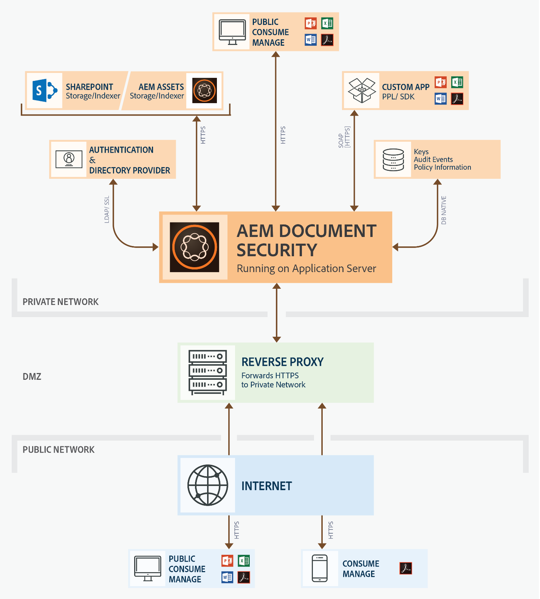

# De documentbeveiligingsserver installeren en configureren {#installing-and-configuring-the-document-security-server}

Met documentbeveiliging kunt u alle gegevens die u in een ondersteunde indeling hebt opgeslagen, veilig verspreiden. Alleen geautoriseerde gebruikers hebben toegang tot beveiligde documenten.

De documentbeveiliging van Adobe Experience Manager Forms zorgt ervoor dat alleen geautoriseerde gebruikers uw documenten kunnen gebruiken. Met documentbeveiliging kunt u veilig alle informatie verspreiden die u in een ondersteunde indeling hebt opgeslagen. Ondersteunde bestandsindelingen zijn onder andere Adobe Portable Document Format (PDF)- en Microsoft Word-, Excel- en PowerPoint-bestanden.

U kunt documenten beschermen door beleid te gebruiken. De vertrouwelijkheidsmontages u in een beleid specificeert bepalen hoe een ontvanger een document kan gebruiken waarop u het beleid toepast. U kunt bijvoorbeeld opgeven of ontvangers tekst kunnen afdrukken of kopiëren, tekst kunnen bewerken of handtekeningen en opmerkingen kunnen toevoegen aan beveiligde documenten.

Het beleid wordt opgeslagen op de server van de Veiligheid van het Document; u past het beleid op documenten toe door uw cliënttoepassing. Wanneer u een beleid op een document toepast, beschermen de vertrouwelijkheidsmontages die in het beleid worden gespecificeerd de informatie die het document bevat. U kunt het document dat met een beleid is beveiligd, verspreiden onder ontvangers die door het beleid zijn gemachtigd.

Documentbeveiliging biedt ook clients, viewers en indexeerders om documenten te beveiligen, beveiligde documenten weer te geven en beveiligde documenten te indexeren. Zie [over documentbeveiliging](/help/forms/using/admin-help/document-security.md)voor meer informatie over documentbeveiliging.

## Implementatietopologie {#deployment-topology}

De beveiligingsfunctie voor documenten is alleen beschikbaar in AEM Forms on JEE. U hebt één exemplaar van AEM Forms op JEE nodig. U kunt een cluster of een landbouwbedrijf van de servers van Vormen AEM, indien nodig ook tot stand brengen. De volgende topologie is indicatieve topologie om het vermogen van de documentveiligheid in werking te stellen. Voor gedetailleerde informatie over de topologie, zie [Architectuur en plaatsingstopologieën voor Vormen](aem-forms-architecture-deployment.md)AEM.

<!--fix above link-->

In het volgende diagram wordt de typische architectuur voor AEM Forms Document Security weergegeven:

## AEM-formulieren installeren op JEE {#installing-aem-forms-on-jee}

Voer de volgende stappen uit om AEM Forms op JEE te installeren en te vormen:

1. Download AEM 6.5 Forms in het JEE-installatieprogramma van de [Adobe-licentiewebsite (LWS)](https://licensing.adobe.com/). U hebt een geldig onderhouds- en ondersteuningscontract nodig om het installatieprogramma te downloaden.
1. Lees het document  AEM Forms on JEE Supported Platform (Door JEE ondersteunde platforms) en zorg ervoor dat de software, hardware, besturingssystemen, toepassingsserver, databases, JDK&#39;s en andere infrastructuren klaar zijn om AEM Forms op JEE te installeren.
1. (Alleen niet-kant-en-klare installatieprogramma&#39;s) Lees de [Voorbereiding voor de installatie van één server](https://www.adobe.com/go/learn_aemforms_prepareInstallsingle_64) voor AEM Forms of [Voorbereiden voor de installatie van de AEM Forms-servercluster](https://www.adobe.com/go/learn_aemforms_prepareInstallcluster_64) en klaar voor uw omgeving voor de installatie en configuratie van AEM Forms in JEE.
1. Afhankelijk van uw omgeving en toepassingsserver kiest u een van de volgende documenten en volgt u de instructies om de installatie te voltooien

   * [AEM Forms installeren en implementeren op JEE met JBoss turnkey](https://www.adobe.com/go/learn_aemforms_installTurnkey_64)
   * [AEM Forms installeren en implementeren op JEE voor JBoss](https://www.adobe.com/go/learn_aemforms_installJBoss_64)
   * [AEM Forms installeren en implementeren op JEE for WebLogic](https://www.adobe.com/go/learn_aemforms_installWebLogic_64)
   * [AEM Forms installeren en implementeren op JEE for WebSphere](https://www.adobe.com/go/learn_aemforms_installWebSphere_64)
   * [AEM-formulieren configureren op JEE in JBoss-cluster](https://www.adobe.com/go/learn_aemforms_clusterJBoss_64)
   * [AEM-formulieren configureren op JEE in WebLogic-cluster](https://www.adobe.com/go/learn_aemforms_clusterWebLogic_64)
   * [AEM-formulieren configureren op JEE in WebSphere-cluster](https://www.adobe.com/go/learn_aemforms_clusterWebSphere_64)
   >[!NOTE]
   >
   >Selecteer de optie Documentbeveiliging in het selectiescherm Module van AEM Forms on JEE Configuration Manager. Voor de optie Documentbeveiliging hoeft u geen andere module te selecteren.

## Volgende stappen {#next-steps}

* [Client- en serveropties configureren](/help/forms/using/admin-help/configuring-client-server-options.md)
* [Beleid maken en beheren](/help/forms/using/admin-help/creating-policies.md)
* [Beleidssets maken en beheren](/help/forms/using/admin-help/creating-policy-sets.md)
