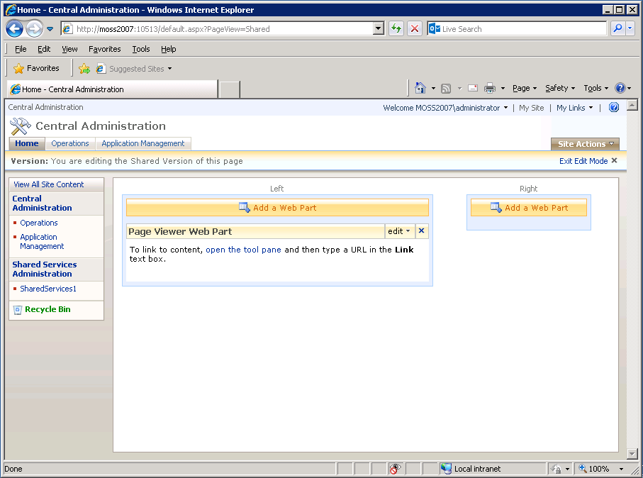

# De werkruimte AEM formulieren integreren met Microsoft Office SharePoint Server{#integrating-aem-forms-workspace-with-microsoft-office-sharepoint-server}

**- Vereisten**

**Vereiste kennis**
Voordat u AEM Forms Workspace kunt toevoegen aan SharePoint Server, moet u toegang hebben tot SharePoint Server met de juiste rechten en moet u de URL kennen om toegang te krijgen tot Workspace. In de onderstaande stappen wordt ervan uitgegaan dat u bekend bent met SharePoint Server. Voor meer informatie over de Delen van het Web in de Server van SharePoint, zie de Delen van het Web in de Diensten van SharePoint van Vensters.

**Gebruikersniveau**
Begin

U kunt AEM Forms Workspace als Deel van het Web in de Server van SharePoint van Microsoft Office gebruiken (bijvoorbeeld, de Server 2007 van SharePoint van Microsoft Office). Gebruikers hebben toegang tot AEM Forms Workspace door verbinding te maken met uw SharePoint Server via een webbrowser voor een uniforme ervaring. In dit artikel, leert u de basisstappen om AEM Forms Workspace als Deel van het Web in de Server van SharePoint van Microsoft Office te tonen. U kunt de in dit artikel beschreven stappen uitvoeren om een uniforme ervaring te bieden, zodat gebruikers die verbinding maken met uw SharePoint-server toegang hebben tot AEM Forms Workspace vanaf dezelfde poort.

>[!NOTE]
>
>De stappen die in dit artikel worden vermeld, zijn specifiek Microsoft SharePoint Server 2007. U kunt HTML Workspace ook configureren met andere ondersteunde versies van Microsoft SharePoint.

## AEM Forms Workspace integreren met Microsoft Office SharePoint Server 2007 {#integrate-aem-forms-workspace-with-microsoft-office-sharepoint-server}

Voer de volgende stappen uit om AEM Forms Workspace in een Deel van het Web te integreren:

1. Navigeer in een webbrowser naar de SharePoint-site, bijvoorbeeld `https://[myMOSSserver]:44299/default.aspx` waar `[myMOSSserver]` de naam of het IP-adres van de SharePoint-server is.

   >[!NOTE]
   >
   >44299 is het standaardpoortnummer voor de SharePoint-server. Het poortnummer is afhankelijk van uw installatie van SharePoint Server.

1. Op de hoger-juiste kant van de Web-pagina, klik &lbrace;de Acties van de Plaats **en selecteer** uitgeven Pagina **.**
1. Klik **toevoegen een Deel van het Web** knoop.
1. In Add de Delen van het Web - de dialoogdoos van de Web-pagina, onder Dialoogvenster, selecteert het **Deel van het Web van de Kijker van de Pagina 0&rbrace; en klikt dan** **toevoegen.**
1. In de doos van het Deel van het Web van de Kijker van de Pagina, geeft de klik **uit en selecteert** Gedeeld Deel van het Web **wijzigen.**

   >[!NOTE]
   >
   >Het Deel van het Web van de Kijker van de Pagina verschijnt onder **een Deel van het Web** knoop die u in stap 3 zoals aangetoond in de volgende illustratie (Figuur 1) klikte:

   

   Figuur 1. - Het vak Webonderdeel van paginaviewer op de Microsoft Office SharePoint-server.

1. Voer op de pagina Paginaviewer de volgende taken uit:

   1. Typ in het vak Koppeling de URL van AEM Forms Workspace, bijvoorbeeld `https://[AEM_forms_Server]:8080/lc/ws` waarbij `[AEM_forms_Server]` de IP of de naam van AEM Forms Server vertegenwoordigt.
   1. Klik **Verschijning** en wijzig de hoogte, de breedte, en de titel zodat u het volledige gebruikersinterface van Workspace kunt zien. U kunt de hoogte en breedte bijvoorbeeld instellen op respectievelijk 6 en 11 inch.
   1. Klik **Verbinding van de Test**. Er wordt een nieuw webbrowservenster weergegeven waarin Workspace wordt weergegeven.
   1. (Facultatief) klik **Lay-out** en wijzig de lay-out van Workspace in Deel van het Web.
   1. (Facultatief) klik **Geavanceerd** en wijzig andere montages, zoals de beschrijving en of Workspace in het Deel van het Web kan worden geminimaliseerd of worden gesloten.

      Klik **toepassen**.

1. Klik **Uitgang geeft Wijze** uit en verifieer dat u tot Workspace kunt toegang hebben.

Nadat u de bovenstaande stappen hebt uitgevoerd, ziet uw SharePoint-site eruit zoals in de volgende afbeelding (Afbeelding 2):

Afbeelding 2 - AEM Forms Workspace geïntegreerd met Microsoft Office SharePoint Server
