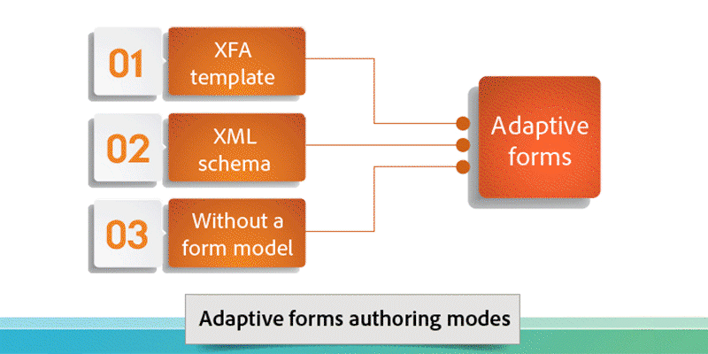

# Inleiding tot AEM Forms{#introduction-to-aem-forms}

| Versie | Artikelkoppeling |
| -------- | ---------------------------- |
| AEM as a Cloud Service | [&#x200B; klik hier &#x200B;](https://experienceleague.adobe.com/docs/experience-manager-cloud-service/content/forms/forms-overview/home.html) |
| AEM 6.5 | Dit artikel |

Voor informatie over recentste eigenschappen en verhogingen in AEM Forms, zie [&#x200B; wat in AEM Forms &#x200B;](../../forms/using/whats-new.md) nieuw is.

## Informatie over AEM Forms {#about-aem-forms}

Adobe Experience Manager (AEM) biedt een gebruiksvriendelijke oplossing voor het maken, beheren, publiceren en bijwerken van complexe digitale formulieren en voor integratie met back-endprocessen, bedrijfsregels en gegevens.

AEM Forms combineert mogelijkheden voor formulierontwerp, -beheer en -publicatie in combinatie met mogelijkheden voor correspondentiebeheer, documentbeveiliging en geïntegreerde analyses om aantrekkelijke end-to-end ervaringen te creëren. AEM Forms is ontworpen om via internet en mobiele kanalen te werken en kan efficiënt in uw bedrijfsprocessen worden geïntegreerd, waardoor papierprocessen en fouten worden verminderd en de efficiëntie wordt verbeterd.

In grote bedrijven worden formulieren vaak één keer gemaakt en opnieuw gebruikt door te kopiëren naar een contentbeheersysteem. Het kan een grote uitdaging zijn om een grote databank van formulieren up-to-date te houden en te ontdekken. AEM biedt een aanpasbaar Forms Portal dat ervoor zorgt dat klanten formulieren vinden en openen die ze nodig hebben, zowel via het web als via mobiele kanalen.

AEM Forms biedt hulpmiddelen voor formulierbeheer waarmee u niet alleen adaptieve formulieren kunt beheren, maar ook XFA-formulieren, PDF forms en gerelateerde elementen. Voor meer informatie, zie [&#x200B; Inleiding aan het beheren van vormen &#x200B;](../../forms/using/introduction-managing-forms.md).

>[!NOTE]
>
>De Adaptieve eigenschap van Forms, beschikbaar in [&#x200B; AEM 6.5 QuickStart &#x200B;](https://experienceleague.adobe.com/docs/experience-manager-65/deploying/deploying/deploy.html), wordt ontworpen voor exploratie en evaluatiedoeleinden slechts. Voor productiegebruik is het van essentieel belang een geldige licentie voor AEM Forms te verkrijgen, aangezien voor de adaptieve Forms-functionaliteit een correcte licentie vereist is.

### Belangrijkste mogelijkheden {#key-capabilities}

Samenvattend biedt AEM Forms krachtige functies voor formulierbeheer, zoals de volgende, die handmatige processen verminderen en de tevredenheid van klanten verhogen.

* Een gecentraliseerd Forms Portal voor het ontwerpen en implementeren van dynamische formulieren, waaronder PDF, HTML5 en adaptieve formulieren
* Een gebruiksvriendelijke grafische gebruikersinterface waarmee zakelijke gebruikers eenvoudig formulieren kunnen importeren, beheren, voorvertonen en publiceren
* Een responsieve formuliermap met krachtige zoekfuncties die trefwoorden, tags en metagegevens gebruiken
* Dynamische detectie van het apparaat en de locatie van een gebruiker om het formulier op de juiste wijze te genereren via internet en mobiele kanalen
* Integratie met Adobe Analytics om gegevens over formuliergebruik effectief te meten
* Integratie met eSign services van Adobe Document Cloud of Scriptservice voor het elektronisch ondertekenen van documenten die vertrouwelijke informatie bevatten
* Geautomatiseerde mogelijkheden voor het publiceren van formulieren en de mogelijkheid om tijdige, gepersonaliseerde en consistente communicatie via meerdere kanalen te leveren

## AEM-formuliertypen {#aem-form-types}

Met AEM Forms kunt u nieuwe en bestaande formulieren uitbreiden om te maken:

* Pixel Perfect, gepagineerde HTML en PDF forms die er bijna als papier uitzien, of
* adaptieve formulieren die automatisch worden weergegeven voor het apparaat en de browser van de gebruiker.

**PDF forms**

PDF forms kan offline worden ingevuld, lokaal worden opgeslagen en formuliergegevens worden verzonden wanneer u de volgende keer online bent. U kunt tweedimensionale streepjescodes gebruiken om formuliergegevens vast te leggen en digitale handtekeningen gebruiken om de authenticiteit voor gebruikers te valideren.

**de vormen van HTML**

Op HTML5-browsers gebaseerde formulieren kunnen zowel op mobiele apparaten als in desktopbrowsers worden weergegeven. U kunt HTML-formulieren elektronisch ondertekenen met de services Krabbelen of elektronisch ondertekenen.

**Aangepaste vormen**

Met adaptieve formulieren kunt u zich dynamisch aanpassen aan de reacties van gebruikers door naar wens velden of secties toe te voegen of te verwijderen. Met AEM kunt u Adobe XML-formuliersjablonen opnieuw gebruiken om adaptieve formulieren te maken.

### Ondersteunde functies {#supported-features}

Alle formuliertypen ondersteunen de volgende functies:

* Dynamische indeling
* Validatie van formulierveld
* Context-gevoelige Help
* Scripts en XML-gegevensverwerking
* Toegankelijkheidsontwerp en -controle
* Formulieren opslaan op de server
* Ondersteuning voor bestandsbijlagen
* Integratie met HTML Workspace for Data Capture

## Offline gegevensverzameling {#offline-data-collection}

Zodra de vormgegevens worden voorgelegd, verbindt Adobe Experience Manager de vormgegevens met bestaande systemen, bedrijfsregels, en de vereiste mensen.

AEM Forms biedt Forms Workspace, een mobiele toepassing die uw digitale bedrijfsprocessen uitbreidt tot mobiele apparaten. Met Forms Workspace kunt u zelfs offline gegevens verzamelen en opnemen. Forms Workspace gebruikt de mogelijkheden van uw mobiele apparaat en biedt u de mogelijkheid om foto&#39;s, video&#39;s en gegevens zoals tijdstempels en andere informatie vast te leggen. De volgende keer dat u verbinding maakt met een netwerk, kunt u de verzamelde gegevens synchroniseren.

Met name voor mensen in het veld is het handig om gegevens offline vast te leggen en deze de volgende keer online te synchroniseren. Het verbetert productiviteit en vermindert fouten.

**Voordelen om Forms Workspace voor off-line gegevensinzameling te gebruiken**

* Gebruiksvriendelijke HTML-werkruimtetoepassing voor taaktoewijzing en -opvolging
* Workflowontwerpomgeving voor slepen en neerzetten
* ECM (Enterprise Content Management Connectors)
* Ondersteuning voor open standaarden, waaronder XML en SOAP, voor het verbinden van formuliergegevens met bedrijfssystemen
* De uit-van-de-doos HTML rapporten controleren achterstand, werkrijen, en Zeer belangrijke Indicatoren van Prestaties (KPIs)
* Aanpasbare dashboards voor real-time insight voor zakelijke activiteiten
* API voor verbinding met rapportagehulpprogramma&#39;s van derden

## Persoonlijke communicatie {#personalized-communication}

Een belangrijke component van een efficiënte zelfbedienings digitale ervaring moet geschikte, gepersonaliseerde informatie communiceren die de gebruikers van overal, en op om het even welk apparaat kunnen toegang hebben. De gepersonaliseerde en geschikte mededelingen kunnen zowel omzettingspercentages als gebruikerstevredenheid verbeteren.

Met AEM Forms kunnen zakelijke gebruikers aansprekende persoonlijke gebruikerservaringen maken door documentsjablonen aan te passen, door informatie van back-endprocessen op te nemen en interactieve componenten op te nemen. Een intuïtieve gebruikersinterface helpt niet-technische gebruikers bedrijfsregels ontwikkelen die besluiten wanneer om een mededeling te produceren die op een onderzoek wordt gebaseerd, of een user-generated reactie in werking te stellen.

Persoonlijke documenten, zoals ontvangstbewijzen, welkomstkits en instructies, kunnen gemakkelijk op meerdere kanalen worden afgeleverd. Organisaties kunnen het verkeer naar gepersonaliseerde webportalen sturen, wat leidt tot inschrijving of aanschaf van extra services.

**Zeer belangrijke eigenschappen**

* Correspondentie-ontwerpomgeving met ondersteuning voor sjablonen, inhoudsblokken, bedrijfsregels en meer
* Documentconversie en -assemblage
* Ondersteuning voor documentlevering op aanvraag of in batches via meerdere kanalen, waaronder web, e-mail en papier
* Controletrails met wijzigingshistorie
* Ondersteuning voor digitale handtekeningen om de integriteit van de inhoud en de identiteit van de ondertekenaar te valideren
* Invoegtoepassing voor documentbeveiliging voor AEM Forms, inclusief codering, gebruiksbeleid, bijhouden en controleren

Gestroomlijnde workflow voor persoonlijke communicatie

