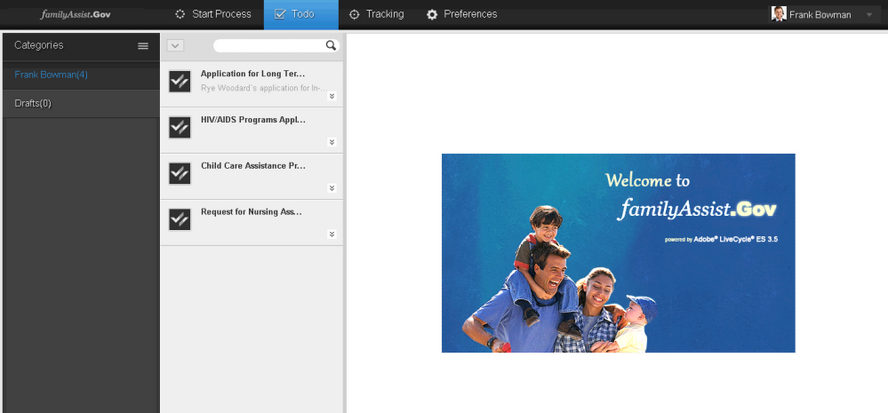

# Inleiding tot de werkruimte van AEM-formulieren aanpassen{#introduction-to-customizing-aem-form-workspace}

De AEM-formulierwerkruimte biedt mogelijkheden om de semantiek en functionaliteit van de presentatie van de interface te wijzigen. De typen aanpassingen waarmee u de stijl, lay-out, opmaak, branding en kernfunctionaliteit kunt wijzigen, worden hieronder beschreven.

Een voorbeeld van een aangepaste werkruimte

## Typen aanpassingen {#types-of-customizations}

De werkruimte van AEM Forms ondersteunt een groot aantal aanpassingen om de lay-out van de gebruikersinterface, de weergave, functionaliteit en nog veel meer bij te werken. Bij de aanpassingen moet u een of meer van de volgende handelingen bijwerken:

* Weergaven van de gebruikersinterface
* Functionaliteit met semantische aanpassingen
* HTML-componenten opnieuw gebruiken in andere toepassingen

### Wijzigingen in gebruikersinterface {#user-interface-changes}

U kunt de vormgeving, lay-out en andere semantische functies van de AEM Forms-werkruimte wijzigen. De werkruimte wijzigen door de CSS-, HTML-sjablonen en JavaScript™-bestanden aan te passen. Alle standaardbestanden worden weergegeven in de standaardinstallatie.

De meest gangbare stappen worden beschreven in [Algemene stappen voor aanpassing](../../forms/using/generic-steps-html-workspace-customization.md)van de werkruimte van AEM Forms. Zie de verwante artikelen aan het einde van dit artikel voor specifieke voorbeelden van dergelijke aanpassingen, waaronder de gedetailleerde stappen.

#### De stijlpagina begrijpen {#understanding-the-style-sheet}

Voordat u de werkruimte aanpast, moet u bekend zijn met het standaardstijlblad dat bij AEM Forms wordt geleverd op /libs/ws/css/style.css.

Als u de werkruimte wilt aanpassen, kunt u het beste vertrouwd raken met het bestaande stijlblad style.css in de map /libs/ws/css. Hieronder worden een aantal belangrijke componenten beschreven.

<table>
 <tbody>
  <tr>
   <th>
CSS-element
 </th>
   <th>
Gebruikersinterfacecomponent gewijzigd
 </th>
  </tr>
  <tr>
   <td>
#header
 </td>
   <td>
Koptekst van de werkruimte AEM Forms
 </td>
  </tr>
  <tr>
   <td>
.categoryList
 </td>
   <td>
Categorie
 </td>
  </tr>
  <tr>
   <td>
.categoryList.header
 </td>
   <td>
Koptekst van categorielijst
 </td>
  </tr>
  <tr>
   <td>
.categorieën, .filters
 </td>
   <td>
Ruimte onder categorielijst
 </td>
  </tr>
  <tr>
   <td>
.category, .filter
 </td>
   <td>
Categorie
 </td>
  </tr>
  <tr>
   <td>
.category:hover, .category.selected, .filter:hover, .filter.selected
 </td>
   <td>
Geselecteerde categorie en muis over stijl van categorie
 </td>
  </tr>
  <tr>
   <td>
categoryListBar.tool, categoryListBar.content
 </td>
   <td>
Procespagina starten (lijst met gesloten rubrieken)
 </td>
  </tr>
  <tr>
   <td>
filterListBar.tool, filterListBar.content
 </td>
   <td>
De pagina Taak (gesloten filterlijst)
 </td>
  </tr>
  <tr>
   <td>
processNameListBar.tool, processNameListBar.content
 </td>
   <td>
Pagina bijhouden (gesloten lijst met procesnamen)
 </td>
  </tr>
  <tr>
   <td>
.startPointList, .tasklist
 </td>
   <td>
De lijst met startpunten of de takenlijst
 </td>
  </tr>
  <tr>
   <td>
.startPointList.header, .tasklist.header
 </td>
   <td>
De kopbal van een startpuntlijst of een taaklijst
 </td>
  </tr>
  <tr>
   <td>
.startpoint.selected, .task.selected
 </td>
   <td>
Het geselecteerde startpunt of de geselecteerde taak
 </td>
  </tr>
  <tr>
   <td>
.startpoint.selected.description, .task.selected.description
 </td>
   <td>
Beschrijving van het geselecteerde startpunt of de geselecteerde taak
 </td>
  </tr>
  <tr>
   <td>
#taskarea
 </td>
   <td>
Het taakgebied
 </td>
  </tr>
  <tr>
   <td>
#header.dropdown
 </td>
   <td>
Vervolgkeuzelijst gebruiker in koptekst
 </td>
  </tr>
  <tr>
   <td>
.sortDrop dd ul
 </td>
   <td>
Vervolgkeuzelijst voor taken sorteren
 </td>
  </tr>
 </tbody>
</table>

#### CSS {#css}

De vormgeving van de werkruimte AEM Forms leent de vormgeving van een CSS. Door de CSS aan te passen, kunt u de presentatiessemantiek van werkruimte zoals doopvonten, kleuren, branding, en lay-out veranderen.

De stappen op hoofdniveau voor CSS-aanpassing zijn:

* Maak een CSS-bestand.
* Stijlitems toevoegen aan deze CSS. Zie Werken met CSS-stijlen voor meer informatie.
* Werk de referenties bij in `html.jsp`.

Voor de nauwkeurige stappen om deze aanpassingen te doen, zie [Algemene stappen voor de werkruimte van AEM Forms aanpassing](../../forms/using/generic-steps-html-workspace-customization.md). Het CSS-bestand dat wordt geleverd met de werkruimte AEM Forms, bevindt zich op /libs/ws/css/. Gebruik het [verzendpakket](../../forms/using/introduction-customizing-html-workspace.md#p-crx-package-p)voor aan CSS gerelateerde aanpassingen. Zie de verwante Help-onderwerpen aan het einde van dit artikel voor specifieke voorbeelden van CSS-gerelateerde aanpassingen.

#### Image {#image}

U kunt de werkruimte van AEM Forms aanpassen om avatars van gebruikers toe te voegen of het embleem van uw organisatie toe te voegen. Gebruik [Verzendpakket](../../forms/using/introduction-customizing-html-workspace.md#p-crx-package-p)voor deze aanpassingen.

De stappen op hoofdniveau voor aanpassingen aan de afbeeldingen zijn:

* WebDAV installeren en configureren.
* Voeg nieuwe afbeeldingen toe.
* Voeg nieuwe stijlen toe die overeenkomen met de toegevoegde afbeeldingen.
* Koppeling maken naar het nieuwe CSS-bestand in het `html.jsp` bestand.

Volg de [algemene stappen voor het aanpassen van de werkruimte van AEM Forms om te beginnen met het aanpassen van de afbeeldingen in de werkruimte van AEM Forms](../../forms/using/generic-steps-html-workspace-customization.md). Voor specifieke voorbeelden van beeld-verwante aanpassingen, zie de verwante onderwerpen van de Hulp aan het eind van dit artikel.

#### HTML-sjabloon {#html-template}

Met HTML-sjablonen kunt u de weergave en lay-out van de gebruikersinterface van de werkruimte definiëren. Door de standaard HTML- malplaatjes bij te werken kunt u de lay-out standaardgebruikersinterface aanpassen.

De stappen op hoofdniveau voor aanpassingen aan de HTML-sjabloon zijn:

* Maak kopieën van de vereiste standaardbestanden in een door de gebruiker gemaakte map.
* Nieuwe sjablonen toevoegen in een door de gebruiker gedefinieerde map.
* Maak relevante updates aan de gekopieerde dossiers als, de weg van het nieuwe malplaatje.

Voor specifieke voorbeelden van dergelijke aanpassingen, zie de onderwerpen van de Hulp die aan het eind van dit artikel worden verstrekt. Kies tussen het [Verzendpakket](../../forms/using/introduction-customizing-html-workspace.md#p-crx-package-p) of het [Dev-pakket](../../forms/using/introduction-customizing-html-workspace.md#p-crx-package-p), afhankelijk van de sjabloon die u wilt aanpassen.

### Semantische wijzigingen {#semantic-changes}

Wijzig de JavaScript-broncode als u de functionaliteit van de werkruimte AEM Forms wilt wijzigen. Wijzigingen in de kernfunctionaliteit worden aangeduid als Semantische wijzigingen. U wijzigt modellen, mening, en malplaatjes die als deel van de broncode van de werkruimte van AEM Forms worden verstrekt.

De stappen op hoofdniveau voor het uitvoeren van semantische wijzigingen om de functionaliteit van de werkruimte AEM Forms te wijzigen zijn:

* Maak kopieën van de juiste standaardbestanden in een door de gebruiker gemaakte map.
* Voeg nieuwe modellen en meningen in de user-defined omslag toe.
* Breng relevante updates aan, zoals het bijwerken van paden van nieuw toegevoegde modellen en weergaven in de standaard JavaScript-bestanden.
* Minimaal het pakket om de prestaties te optimaliseren.

Voor meer conceptuele informatie over de componenten die deel van de broncode uitmaken, zie de [Beschrijving van herbruikbare componenten](/help/forms/using/description-reusable-components.md). Voor deze aanpassingen, gebruik het Dev Pakket.

### Herbruikbare componenten {#reusable-components}

Aangezien de werkruimte van AEM Forms een op componenten-gebaseerde software is, kan het gemakkelijk worden aangepast en worden opnieuw gebruikt. U kunt de werkruimtecomponenten gemakkelijk met uw Webtoepassingen integreren.

Voor meer conceptuele informatie, zie de [Beschrijving van herbruikbare componenten](/help/forms/using/description-reusable-components.md) en voor instructies over het gebruiken van de componenten, zie het [Integreren van de de werkruimtecomponenten van AEM Forms in Webtoepassingen](/help/forms/using/description-reusable-components.md).

## Code voor de werkruimte AEM Forms samenstellen {#building-html-workspace-code}

### SDK-pakket {#sdk-package}

Het pakket bevat de broncode van de werkruimte AEM Forms. Het pakket is beschikbaar op `[LC root]\sdk\html-workspace\adobe-lc-workspace-src.zip`.

Het is hoofdzakelijk bedoeld voor aanpassingen, aangezien het de capaciteit verstrekt om te produceren:

* CRX-pakketten voor profielen voor verzending, foutopsporing en ontwikkeling (vermeld in [CRX-pakketten](../../forms/using/introduction-customizing-html-workspace.md#p-crx-package-p)).
* Gimiteerde versie van aangepaste code (voor semantische wijzigingen).

#### WS-inhoud {#ws-content}

* client-pkg:

   * src - Bevat artefacten nodig om CRX knopen tot stand te brengen.
   * pom.xml - Script om implementatiepakketten voor verschillende profielen op te bouwen WS-Deplotion Package

* client-html:

   * assemblage - bevat zip.xml die door manuscript voor het creëren van de werkruimte SDK van AEM Forms wordt gebruikt.
   * src/main/webapp -

      * css - Bevat stijlbladen voor de werkruimte van AEM Forms.
      * afbeeldingen - Bevat afbeeldingen die worden gebruikt in de werkruimte AEM Forms.
      * js:

         * libs - Bevat alle bibliotheken van derden die in de werkruimte AEM Forms worden gebruikt.
         * licenties - Bevat licenties voor HTML- en JS-bestanden en code voor het voorvoegsel van deze licenties voor de respectievelijke bronbestanden.
         * minifier - Wordt gebruikt voor combinatie, minificatie en verzwaring van aangepaste JavaScript-code.
         * resource_optimizer - Gebruikt voor combinatie, minificatie, en vergroting van een bron JavaScript.
         * resource_generator - Gebruikt voor het produceren van register.js en modelcontrollerpath.js.
         * runtime:

            * initializer - Bevat initializer.js die wordt gebruikt om backboneweergaven en modellen te initialiseren die in de werkruimte AEM Forms worden gebruikt.
            * modellen - Bevat backbonemodellen van alle componenten aanwezig in de werkruimte van AEM Forms.
            * routes - Bevat JavaScript-bestanden en HTML-bestanden waarmee het beginproces, taken, bijhouden en voorkeuren in de werkruimte AEM Forms worden geladen.
            * services - Bevat service.js die wordt gebruikt in de werkruimte AEM Forms. Alle servervraag wordt gemaakt door service.js.
            * sjablonen - Bevat alle sjablonen, dat wil zeggen HTML-bestanden van alle weergaven in de werkruimte AEM Forms.
            * util - Bevat alle hulpprogrammabestanden (javascript) die in de werkruimte AEM Forms worden gebruikt.
            * weergaven - Bevat backboneweergaven van alle componenten in de werkruimte AEM Forms.
         * main.js
         * router.js
      * libs/ws: pdf.html en pluginPing.pdf worden gebruikt voor het laden van PDF forms in de werkruimte van AEM Forms en WSNextAdapter.swf wordt gebruikt om SWF-formulieren en hulplijnen in de werkruimte van AEM Forms te laden.
      * landinstellingen:

         * de-DE - Bevat vertaling.json voor het Duits.
         * en-US - Bevat translatie.json voor het Engels.
         * fr-FR - Bevat translatie.json voor het Frans.
         * ja-JP - Bevat translatie.json voor Japans.
         * html.jsp - Bevat code om de huidige browserlandinstelling te achterhalen.
      * html.jsp
      * GET.jsp

### CRX-pakket {#crx-package}

CRX-pakket kan worden geïmplementeerd in de CRX™-opslagplaats. Het is beschikbaar om `[LC root]\crx-repository\install\adobe-lc-workspace-pkg.zip`.

Dit pakket kan worden gemaakt met de drie hieronder beschreven profielen.

| **Profiel** | **Beschrijving** | **Gebruik** |
|---|---|---|
| Verzendprofiel | Met dit profiel maakt u een CRX-pakket van de kleinst mogelijke grootte met miniatuur. Dit pakket is het meest efficiënt. Alle JavaScript™-bestanden worden gecombineerd en geminiateerd in één JS-bestand. | Gebruik dit profiel als er geen semantische wijzigingen meer vereist zijn in JS-bestanden. |
| Foutopsporingsprofiel | Met dit profiel wordt een matig efficiënt CRX-pakket gemaakt. De grootte van het pakket is iets groter dan het pakket dat is gemaakt met het profiel Verzenden. Dit pakket bevat de meeste JavaScript-bestanden die in één JS-bestand worden gecombineerd. | Gebruik dit profiel voor foutopsporing. |
| Profiel dev | Met dit profiel wordt een CRX-pakket van de grootst mogelijke grootte gemaakt. Alle JavaScript-bestanden zijn afzonderlijk beschikbaar, net als in het SDK-pakket. | Gebruik dit profiel wanneer u semantische wijzigingen opneemt. |

#### Verzendprofiel {#ship-profile}

#### Command {#command}

* mvn clean -P Ship install on client-pkg folder of Source package sent to client.
* De uitvoering van de opdracht Verzenden van profielen werkt alleen op een 64-bits JVM.

#### WS-inhoud {#ws-content-1}

* css - Bevat style.css, ie.css, en jquery-ui.css.
* afbeeldingen - Bevat alle afbeeldingen.
* js:

   * libs:

      * require - Bevat require.js.
      * jqueryui - Bevat jquery.ui.datepicker.ja.js.
   * runtime:

      * sjablonen - Bevat alle sjablonen, dat wil zeggen HTML-bestanden van alle componenten in de werkruimte AEM Forms.
   * main.js (gecombineerd, geminificeerd en aangevuld).
   * registry.js

* libs:

   * ws - Bevat pluginPing.pdf, pdf.html, en WSNextAdapter.swf.

* Landinstelling - Bevat .content.xml.
* landinstellingen:

   * de-DE - Bevat vertaling.json voor het Duits.
   * en-US - Bevat translatie.json voor het Engels.
   * fr-FR - Bevat translatie.json voor het Frans.
   * ja-JP - Bevat translatie.json voor Japans.
   * html.jsp - Bevat code om de huidige browserlandinstelling te achterhalen.

* Index - Bevat .content.xml
* profiel - Bevat offline.jsp.
* GET.jsp
* html.jsp
* content.xml
* _rep_policy.xml

#### Foutopsporingsprofiel {#debug-profile}

#### Command {#command-1}

* mvn clean -P Debug install on client-pkg
* De uitvoering van foutopsporingsprofielopdrachten werkt alleen op 64-bits JVM.

#### WS-inhoud {#ws-content-2}

* css - Bevat style.css, ie.css, en jqueri-ui.css.
* afbeeldingen - Bevat alle afbeeldingen.
* js:

   * libs:

      * require - Bevat require.js.
      * jqueryui - Bevat jquery.ui.datepicker.ja.js.
   * runtime:

      * sjablonen - Bevat alle sjablonen, dat wil zeggen HTML-bestanden van alle componenten in de werkruimte AEM Forms.
   * main.js (gecombineerd).
   * registry.js

* libs:

   * ws - Bevat pluginPing.pdf, pdf.html, en WSNextAdapter.swf.

* Landinstelling - Bevat .content.xml.
* landinstellingen:

   * de-DE - Bevat vertaling.json voor het Duits.
   * en-US - Bevat translatie.json voor het Engels.
   * fr-FR - Bevat translatie.json voor het Frans.
   * ja-JP - Bevat translatie.json voor Japans.
   * html.jsp - Bevat code om de huidige browserlandinstelling te achterhalen.

* Index - Bevat .content.xml
* profiel - Bevat offline.jsp.
* GET.jsp
* html.jsp
* content.xml
* _rep_policy.xml

#### Dev-profiel {#dev-profile}

#### Command {#command-2}

mvn clean -P Dev install on client pkg

#### WS-inhoud {#ws-content-3}

* css - Bevat style.css, ie.css, en jqueri-ui.css.
* afbeeldingen - Bevat alle afbeeldingen.
* js:

   * libs - Bevat alle bibliotheken die in de werkruimte AEM Forms worden gebruikt.
   * require - Bevat require.js
   * jqueryui - Bevat jquery.ui.datepicker.ja.js
   * runtime:

      * initializer - Bevat initializer.js en modelcontrollerpath.js.
      * modellen - Bevat modellen van alle componenten in de werkruimte van AEM Forms.
      * routes - Bevat JavaScript-bestanden en HTML-bestanden waarmee het beginproces, taken, bijhouden en voorkeuren in de werkruimte AEM Forms worden geladen.
      * services - Bevat service.js die wordt gebruikt in de werkruimte AEM Forms.
      * sjablonen - Bevat alle sjablonen, dat wil zeggen HTML-bestanden van alle componenten in de werkruimte AEM Forms.
      * util - Bevat alle hulpprogrammabestanden (JavaScript) die worden gebruikt in de werkruimte AEM Forms.
      * weergaven - Bevat weergaven van alle componenten in de werkruimte AEM Forms.
   * main.js
   * registry.js
   * router.js

* libs:

   * ws - Bevat pluginPing.pdf, pdf.html, en WSNextAdapter.swf.

* Landinstelling - Bevat .content.xml.
* landinstellingen:

   * de-DE - Bevat vertaling.json voor het Duits.
   * en-US - Bevat translatie.json voor het Engels.
   * fr-FR - Bevat translatie.json voor het Frans.
   * ja-JP - Bevat translatie.json voor Japans.
   * html.jsp - Bevat code om de huidige browserlandinstelling te achterhalen.

* Index - Bevat .content.xml
* profiel - Bevat offline.jsp.
* GET.jsp
* html.jsp
* content.xml
* _rep_policy.xml
