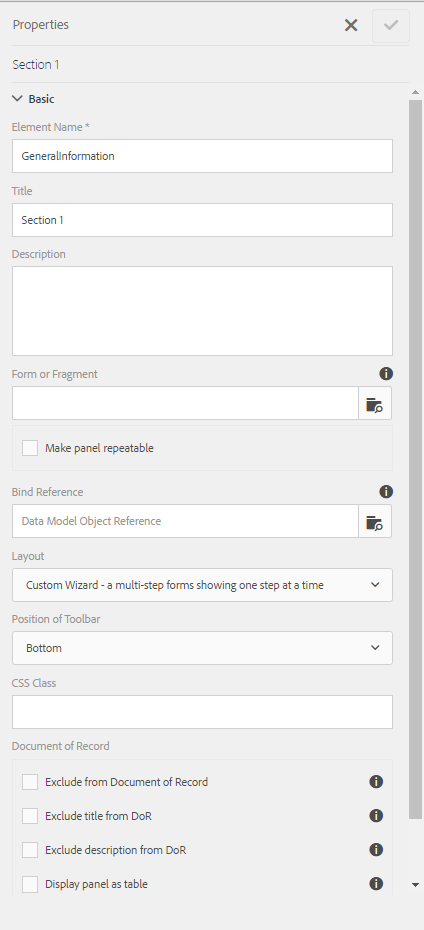

# Indelingsmogelijkheden van adaptieve formulieren{#layout-capabilities-of-adaptive-forms}

<span class="preview"> de Adobe adviseert gebruikend de moderne en verlengbare gegevens vangen [ Componenten van de Kern ](https://experienceleague.adobe.com/docs/experience-manager-core-components/using/adaptive-forms/introduction.html) voor [ het creëren van nieuwe Aangepaste Forms ](/help/forms/using/create-an-adaptive-form-core-components.md) of [ het toevoegen van Aangepaste Forms aan de pagina&#39;s van AEM Sites ](/help/forms/using/create-or-add-an-adaptive-form-to-aem-sites-page.md). Deze componenten betekenen een aanzienlijke vooruitgang in de aanmaak van Adaptive Forms en zorgen voor indrukwekkende gebruikerservaring. In dit artikel wordt een oudere aanpak beschreven voor de auteur Adaptive Forms die gebruikmaakt van stichtingscomponenten. </span>

| Versie | Artikelkoppeling |
| -------- | ---------------------------- |
| AEM as a Cloud Service | [ klik hier ](https://experienceleague.adobe.com/docs/experience-manager-cloud-service/content/forms/adaptive-forms-authoring/authoring-adaptive-forms-foundation-components/configure-layout-of-an-adaptive-form/layout-capabilities-adaptive-forms.html) |
| AEM 6,5 | Dit artikel |


Met Adobe Experience Manager (AEM) kunt u gebruiksvriendelijke adaptieve formulieren maken die eindgebruikers een dynamische ervaring bieden. De formulierindeling bepaalt hoe items of componenten in een adaptief formulier worden weergegeven.

## Vereiste kennis {#prerequisite-knowledge}

Lees de volgende artikelen voor meer informatie over adaptieve formulieren voordat u meer leert over de verschillende lay-outmogelijkheden van adaptieve formulieren.

[Inleiding tot AEM Forms](../../forms/using/introduction-aem-forms.md)

[Inleiding tot ontwerpformulieren](../../forms/using/introduction-forms-authoring.md)

## Typen lay-outs {#types-of-layouts}

Een adaptief formulier biedt u de volgende typen indelingen:

**Lay-out van het Comité** controleert hoe de punten of de componenten binnen een paneel op een apparaat worden getoond.

**Mobiele Lay-out** controleert de navigatie van een vorm op een mobiel apparaat. Als de apparaatbreedte 768 pixels of meer is, wordt de lay-out beschouwd als een mobiele lay-out en geoptimaliseerd voor een mobiel apparaat.

**de Lay-out van de Toolbar** controleert de plaatsing van de knopen van de Actie in de toolbar of paneeltoolbar in een vorm.

Al deze paneellay-outs worden bepaald in de volgende plaats:

`/libs/fd/af/layouts`.

>[!NOTE]
>
>Gebruik de ontwerpmodus in AEM om de indeling van een adaptief formulier te wijzigen.


## Deelvensterlay-out {#panel-layout}

Een auteur van een formulier kan een indeling koppelen aan elk deelvenster van een adaptief formulier, inclusief het hoofddeelvenster.

De schermindelingen van het deelvenster zijn beschikbaar op de locatie `/libs/fd/af/layouts/panel` .


Lijst met deelvensterindelingen in adaptieve formulieren

### Responsief - alles op één pagina zonder navigatie {#responsive-everything-on-one-page-without-navigation-br}

Met deze deelvensterlay-out maakt u een responsieve lay-out die zich aanpast aan de schermgrootte van uw apparaat zonder dat u hiervoor speciale navigatie nodig hebt.

Met deze lay-out kunt u meerdere **[!UICONTROL Panel adaptive form]** componenten achter elkaar in het deelvenster plaatsen.

 gebruikt

Een formulier met een responsieve indeling zoals wordt weergegeven op een klein scherm

 gebruikt

Een formulier met een responsieve indeling zoals weergegeven op een groot scherm

### Wizard - Een formulier dat uit meerdere stappen bestaat en één stap tegelijk weergeeft {#wizard-a-multi-step-form-showing-one-step-at-a-time}

Met deze deelvensterindeling kunt u navigatie met instructies in een formulier bieden. Gebruik deze indeling bijvoorbeeld wanneer u verplichte gegevens in een formulier wilt vastleggen en gebruikers stapsgewijs wilt begeleiden.

Gebruik de component `Panel adaptive form` om stapsgewijze navigatie binnen een deelvenster te bieden. Als u deze lay-out gebruikt, gaat een gebruiker pas naar de volgende stap nadat de huidige stap is voltooid

```javascript
window.guideBridge.validate([], this.panel.navigationContext.currentItem.somExpression)
```



De voltooiingsuitdrukking van de stap in de lay-out van de Tovenaar voor een multi-step vorm


Een formulier met wizard

### Layout voor accordeonontwerp {#layout-for-accordion-design}

Met deze lay-out kunt u de component `Panel adaptive form` plaatsen in een deelvenster met accordeonstijlnavigatie. Met deze indeling kunt u ook herhaalbare deelvensters maken. Met herhalende deelvensters kunt u, indien nodig, deelvensters dynamisch toevoegen of verwijderen. U kunt het minimum en het maximum aantal keren bepalen dat een paneel herhaalt. De titel van het deelvenster kan ook dynamisch worden bepaald op basis van de informatie in de deelvensteritems.

De summiere uitdrukking kan worden gebruikt om de waarden te tonen die door de eindgebruiker in de titel van het geminimaliseerde paneel worden verstrekt.


Herhaalbare deelvensters die zijn gemaakt met de accordeonindeling

### Lay-out met tabs - links worden tabs weergegeven {#tabbed-layout-tabs-appear-on-the-left}

Met deze indeling kunt u de component `Panel adaptive form` in een deelvenster met tabnavigatie plaatsen. De tabbladen worden links van de inhoud van het deelvenster geplaatst.


Tabs die links van een deelvenster worden weergegeven

### Lay-out met tabs - tabs worden boven weergegeven {#tabbed-layout-tabs-appear-on-the-top}

Met deze indeling kunt u de component `Panel adaptive form` in een deelvenster met tabnavigatie plaatsen. De tabbladen worden boven op de inhoud van het deelvenster geplaatst.


Tabs die boven in een deelvenster worden weergegeven

## Mobiele lay-outs {#mobile-layouts}

Mobiele lay-outs maken gebruikersvriendelijke navigatie op mobiele apparaten met relatief kleinere schermen mogelijk. Mobiele lay-outs maken gebruik van tabbladen of wizards voor formuliernavigatie. Als u een mobiele indeling toepast, beschikt u over één indeling voor het hele formulier.

Deze indeling bepaalt de navigatie met behulp van een navigatiebalk en een navigatiemenu. De navigatiebar toont **&lt;** en **>** pictogram om **volgende** en **vorige** navigatiestappen in de vorm aan te geven.

De mobiele lay-outs zijn beschikbaar op `/libs/fd/af/layouts/mobile/` locatie. De volgende mobiele lay-outs zijn standaard beschikbaar in adaptieve formulieren.


Lijst met mobiele lay-outs in adaptieve formulieren

Wanneer het gebruiken van een mobiele lay-out, is het vormmenu, om tot diverse vormpanelen toegang te hebben, beschikbaar door  pictogram.

### Indeling met titels van deelvensters in de formulierkoptekst {#layout-with-panel-titles-in-the-form-header}

In deze indeling worden, zoals in de naam wordt gesuggereerd, deelvenstertitels weergegeven, samen met het navigatiemenu en de navigatiebalk. Deze indeling biedt ook de pictogrammen Volgende en Vorige voor navigatie.


Mobiele lay-outs met titels van deelvensters in de formulierkoppen

### Indeling zonder deelvenstertitels in de koptekst van het formulier {#layout-without-panel-titles-in-the-form-header}

In deze indeling worden, zoals in de naam wordt gesuggereerd, alleen het navigatiemenu en de navigatiebalk zonder venstertitels weergegeven. Deze indeling biedt ook de pictogrammen Volgende en Vorige voor navigatie.


Mobiele lay-outs zonder titels in de formulierkoppen

## Werkbalklay-outs {#toolbar-layouts}

Met een werkbalkindeling bepaalt u de positie en weergave van alle actieknoppen die u toevoegt aan uw aangepaste formulieren. De indeling kan op formulierniveau of deelvensterniveau worden toegevoegd.


Een lijst met werkbalkindelingen in adaptieve formulieren

De lay-outs van de toolbar zijn beschikbaar bij `/libs/fd/af/layouts/toolbar` plaats. Aangepaste formulieren bieden standaard de volgende werkbalkopmaak.

### Standaardindeling voor werkbalk {#default-layout-for-toolbar}

Deze indeling wordt geselecteerd als de standaardindeling wanneer u actieknoppen toevoegt in een adaptief formulier. Als u deze lay-out selecteert, wordt dezelfde lay-out weergegeven voor zowel mobiele als desktopapparaten.

U kunt ook meerdere werkbalken toevoegen die actieknoppen bevatten die zijn geconfigureerd met deze indeling. Een actieknop is gekoppeld aan een formulierbesturingselement. U kunt de werkbalken configureren voor of na een deelvenster.


Standaardweergave voor werkbalk

### Vaste mobiele lay-out voor werkbalk {#mobile-fixed-layout-for-toolbar}

Selecteer deze lay-out om alternatieve lay-outs voor desktop- en mobiele apparaten te bieden.

Voor de computerlay-out kunt u knoppen Handeling toevoegen met behulp van bepaalde labels. Met deze indeling kan slechts één werkbalk worden geconfigureerd. Als er meerdere werkbalken zijn geconfigureerd met deze lay-out, is er een overlapping voor mobiele apparaten en is er slechts één werkbalk zichtbaar. U kunt bijvoorbeeld een werkbalk boven of onder aan het formulier of deelvensters na of voor het formulier weergeven.

Voor de mobiele lay-out kunt u actieknoppen toevoegen met behulp van pictogrammen.


Vaste mobiele lay-out voor werkbalk
