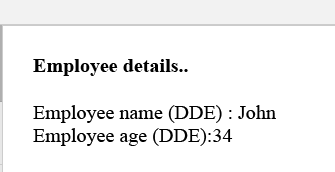

# Documentfragmenten{#document-fragments}

## Documentfragmenten {#document-fragments-1}

Documentfragmenten zijn herbruikbare onderdelen/onderdelen van een correspondentie waarmee u letters/correspondentie kunt samenstellen. De documentfragmenten zijn van de volgende typen:

* **Tekst**: Een tekstactiva is een stuk van inhoud dat uit één of meerdere paragrafen van tekst bestaat. Een alinea kan statisch of dynamisch zijn.
* **Lijst**: De lijst is een groep documentfragmenten, met inbegrip van tekst, lijsten, voorwaarden, en beelden. De volgorde van de lijstelementen kan vast of bewerkbaar zijn. Tijdens het maken van een letter kunt u enkele of alle lijstelementen gebruiken om een herbruikbaar patroon van elementen te repliceren.
* **Voorwaarde**: De voorwaarden laten u toe om te bepalen welke inhoud inbegrepen bij de tijd van de brievenverwezenlijking wordt, die op de geleverde gegevens wordt gebaseerd. De voorwaarde wordt beschreven in termen van controlevariabelen. Een besturingsvariabele kan een gegevenswoordenboekelement of een plaatsaanduiding zijn.
* **het fragment van de Lay-out**: Een lay-outfragment is een lay-out die binnen één of meerdere brieven kan worden gebruikt. Een lay-outfragment wordt gebruikt om herhaalbare patronen, vooral dynamische lijsten tot stand te brengen. De indeling kan typische formuliervelden bevatten, zoals &quot;Adres&quot; en &quot;Referentienummer&quot;. Het bevat ook lege subformulieren die doelgebieden aangeven. De lay-outs (XDP&#39;s) worden gemaakt in Designer en worden vervolgens geüpload naar AEM Forms.

## Tekst {#text}

Een tekstelement is een stuk inhoud dat bestaat uit een of meer tekstalinea&#39;s. Een alinea kan statisch of dynamisch zijn. Een dynamische alinea bevat verwijzingen naar gegevenselementen waarvan de waarden bij uitvoering worden verschaft. De naam van de klant in een letterlijke aanhef kan bijvoorbeeld een dynamisch gegevenselement zijn, waarbij de waarde ervan tijdens runtime beschikbaar wordt gemaakt. Door deze waarden te wijzigen, kan het zelfde brievenmalplaatje worden gebruikt om brieven voor verschillende klanten te produceren.

De oplossing van het Beheer van de Correspondentie steunt twee soorten aan dynamische gegevenspunten (veranderlijke gegevens):

* **de woordenboekelementen van Gegevens**: Deze elementen zijn verbindend aan het gegevenswoordenboek en krijgen hun waarden van de geleverde gegevensbron. Een gegevenswoordenboekvariabele kan worden beveiligd of niet worden beveiligd. Tijdens het maken van correspondentie kan de gebruiker de standaardwaarde van niet-beveiligde gegevenswoordenboekvariabelen wijzigen, maar de variabelen van het beveiligde gegevenswoordenboek kunnen niet worden gewijzigd.
* **Plaatsaanduidingen**: Dit zijn variabelen die niet aan een achtereind gegevensbron verbindend zijn. Ze vereisen dat de gebruiker een waarde invult tijdens het maken van correspondentie. De plaatsaanduidingen zijn standaard niet beveiligd.

>[!NOTE]
>
>De sjablonen voor Correspondentiebeheer dwingen u niet unieke namen te maken wanneer u plaatsaanduidingen maakt. Als u twee plaatsaanduidingen met dezelfde naam maakt, zoals tekst en een voorwaarde, en deze beide gebruikt in een lettertypesjabloon, worden de waarden van de plaatsaanduiding die het laatst is ingevoegd, gebruikt voor beide plaatsaanduidingen. Als twee plaatsaanduidingen dezelfde naam hebben, worden de typen vergeleken. Als de typen verschillend zijn, wordt het type String. Binnen een module kunt u echter geen meerdere plaatsaanduidingen met dezelfde naam maken.

### Tekst maken {#create-text}

1. Selecteer **Forms** > **Fragmenten van het Document**.
1. Selecteer **creeer** > **Tekst** of selecteer een tekstactiva en selecteer **uitgeven**.
1. Geef de volgende informatie op voor de tekst:

   * **Titel: (Facultatieve)** ga de titel voor de tekstactiva in. Titels hoeven niet uniek te zijn en kunnen speciale tekens en niet-Engelse tekens bevatten. De teksten worden bedoeld door hun titels (indien beschikbaar) zoals in duimnagels en activa eigenschappen.
   * **Naam:** de unieke naam voor de tekstactiva. Er kunnen in geen enkele staat twee elementen (tekst, voorwaarde of lijst) bestaan met dezelfde naam. In het veld Naam kunt u alleen Engelse tekens, cijfers en afbreekstreepjes invoeren. Het veld Naam wordt automatisch ingevuld op basis van het veld Titel. De speciale tekens, spaties, getallen en niet-Engelse tekens die in het veld Titel zijn ingevoerd, worden vervangen door afbreekstreepjes in het veld Naam. Hoewel de waarde in het veld Titel automatisch naar de naam wordt gekopieerd, kunt u de waarde bewerken.
   * **Beschrijving**: Type een beschrijving van de activa.
   * **Woordenboek van Gegevens**: Naar keuze, selecteer het gegevenswoordenboek waarin aan kaart te brengen. Met dit kenmerk kunt u verwijzingen naar gegevenswoordenboekelementen in het tekstelement toevoegen.
   * **Markeringen**: Naar keuze, om douanemarkering tot stand te brengen ga waarde op tekstgebied in en druk binnengaan. U ziet de tag onder het tekstveld met tags. Wanneer u deze tekst opslaat, worden ook de toegevoegde tags gemaakt.

1. Selecteer **daarna**. Met Correspondentiebeheer wordt de Editor-pagina weergegeven waar u tekstalinea&#39;s en gegevenselementen aan de tekst kunt toevoegen.

   De standaardspellingcontrole in uw browser controleert spelling in de redacteur van de Tekst. Als u de spelling en grammatica wilt controleren, kunt u de instellingen voor spellingcontrole van uw browser bewerken of browserinsteekmodules/invoegtoepassingen installeren om de spelling en de grammatica te controleren.

   U kunt ook de verschillende sneltoetsen in de teksteditor gebruiken voor het beheren, bewerken en opmaken van tekst. Voor meer informatie over ](/help/forms/using/keyboard-shortcuts.md#p-formatting-p) toetsenbordkortere weg van de Redacteur van de Tekst van 0} {in de Sneltoetsen van het Beheer van de Correspondentie.[

1. Er wordt een teksteditor geopend en u voert de tekst in. Gebruik de werkbalk boven aan de pagina om de tekst, invoegvoorwaarden, koppeling en pagina-einden op te maken.

   

   * **Verbinding**: De hypertext van het Tussenvoegsel  verbinding in de tekst.
   * **Herhaal**: Herhaal het element van de drukinzameling in het Woordenboek van Gegevens gebruikend een afbakening.
   * **Voorwaarde**: Uitgezocht om een voorwaarde op te nemen. Voeg op voorwaarde gebaseerde tekst in. Als de voorwaarde waar is, dan is de tekst zichtbaar in brief, anders niet.
   * **voeg Beschrijving** toe: Voeg aantekening aan een stuk van tekst toe. Dit zijn metagegevens die zichtbaar zijn voor de auteur, maar geen deel van de gemaakte brief.
   * **de Onderbreking van de Pagina**: Als u de attributen van de paginauze van een tekstmodule aan vals plaatst, breekt de tekstmodule niet over pagina&#39;s.

   Er wordt een teksteditor geopend. Voer de tekst in. De werkbalk verandert afhankelijk van het type bewerkingen dat u wilt uitvoeren: Alinea, Uitlijning of Lijst:

   

   Selecteer het type werkbalk: Alinea, Uitlijning of Lijst

   

   Alinea, werkbalk
   ](assets/paragrapheditingtoolbar.png)](assets/paragrapheditingtoolbar-1.png) de toolbar van de Groepering van de 1} Uitlijning[

   De werkbalk Lijst (klik om een afbeelding op volledige grootte te openen)

1. Als u een of meer tekstalinea&#39;s wilt hergebruiken die in een andere toepassing voorkomen, zoals MS Word- of HTML-pagina&#39;s, kopieert en plakt u de tekst in de teksteditor. De opmaak van de gekopieerde tekst blijft behouden in de teksteditor.

   U kunt een of meer alinea&#39;s tekst in een bewerkbare tekstmodule kopiëren en plakken. U hebt bijvoorbeeld een MS Word-document met een lijst met geldige verblijfstitels, zoals:

   

   U kunt de tekst rechtstreeks vanuit het MS Word-document naar een bewerkbare tekstmodule kopiëren en plakken. De opmaak, zoals een lijst met opsommingstekens, lettertype en tekstkleur, blijft behouden in de tekstmodule.

   

   >[!NOTE]
   >
   >Het formatteren van gekleefde tekst, echter, heeft sommige [ beperkingen ](https://helpx.adobe.com/aem-forms/kb/cm-copy-paste-text-limitations.html).

1. Voeg zo nodig speciale tekens in het documentfragment in. U kunt bijvoorbeeld het palet Speciale tekens gebruiken om het volgende in te voegen:

   * Valutasymbolen zoals €, ¥ en £
   * Wiskundige symbolen zoals A, Ö, ∂ en ^
   * Interpunctiesymbolen zoals ‟ en &quot;

   

   Correspondence Management biedt ondersteuning voor 210 speciale tekens. Admin kan [ steun voor meer/douane speciale karakters door aanpassing ](/help/forms/using/custom-special-characters.md) toevoegen.

1. Als u\gedeelten van tekst in een bewerkbare inline-module wilt benadrukken, selecteert u de tekst en selecteert u Markeringskleur.

   

   U kunt of een basiskleur `**[A]**` direct selecteren in het Basispalet van Kleuren of **Uitgezocht** selecteren na het gebruiken van de schuif `**[B]**` om de aangewezen schaduw van de kleur te kiezen.

   U kunt ook naar het tabblad Geavanceerd gaan om de juiste kleurtoon, helderheid en verzadiging `**[C]**` te selecteren en vervolgens Selecteren `**[D]**` selecteren om de tekst te markeren.

   

1. Sleep vanuit het gegevensvenster gegevenswoordenboekelementen en plaatsaanduidingselementen naar de tekst.

   Aan:

   * Voeg een element van het gegevenswoordenboek in de tekst toe, selecteer een gegevenselement van de lijst, en selecteer Tussenvoegsel ( ). Als u Beveiligd selecteert, is het gegevenswoordenboekelement alleen-lezen en wordt het weergegeven in de lettereditor, maar niet in de gebruikersinterface Correspondentie maken of Correspondence Creator.
   * Voeg een plaatsaanduidingselement toe aan de tekst. Selecteer in het deelvenster Gegevenselementen de optie Nieuw maken, voer de details voor het nieuwe gegevenselement in en selecteer Maken om het nieuwe element aan de lijst toe te voegen. De nieuwe plaatsaanduiding kan op dezelfde manier in de tekst worden ingevoegd als het gegevenswoordenboekelement. Als u een tijdelijke aanduiding wilt bewerken, selecteert u een tijdelijke aanduiding en kiest u Bewerken.

   

   Plaatsaanduidingselementen zoals opgegeven in het bestand met voorbeeldgegevens van een gegevenswoordenboek

   

   Plaatsaanduidingselementwaarden in de CCR-weergave die zijn gevuld met de gegevenswoordenboekvariabelen zoals opgegeven in het bestand met voorbeeldgegevens

   Met het @-symbool kunt u ook gegevenswoordenboek en plaatsaanduidingselementen zoeken en toevoegen aan de teksteditor. Plaats de cursor op de plaats waar u het element wilt invoegen. Typ @ gevolgd door de zoekreeks. De teksteditor voert de zoekbewerking uit op alle gegevenswoordenboeken en plaatsaanduidingselementen die beschikbaar zijn in het tekstdocumentfragment. De zoekbewerking haalt de elementen met de zoekreeks op en geeft deze weer als een vervolgkeuzelijst. Navigeer door de onderzoeksresultaten en klik het element dat u bij de cursorplaats wilt opnemen. Druk op Esc om de zoekresultaten te verbergen.

1. U kunt inline voorwaarden en herhaling gebruiken om uw brief te maken in hoge context en goed gestructureerd. Voor meer informatie over gealigneerde voorwaarde en herhaling, zie [ Gealigneerde voorwaarden en herhaal in brieven ](/help/forms/using/cm-inline-condition.md).
1. Selecteer **sparen**.

#### Hyperlink invoegen in tekst {#insert-hyperlink}

Voer de volgende stappen uit om een hyperlink in een tekstelement te maken:

1. Selecteer de tekst of het gegevensmodelobject in de teksteditor.

2. Selecteer **[!UICONTROL Link]**. Selecteer **[!UICONTROL Alt Text]** veld om de bestaande naam of tekst van het gegevensmodel te verwijderen.

3. Specificeer URL en selecteer .

#### Tekst zoeken en vervangen {#searching-and-replacing-text}

Wanneer u werkt met tekstelementen die een grote hoeveelheid tekst bevatten, moet u zoeken naar een specifieke tekstreeks. U moet mogelijk ook een specifieke tekenreeks vervangen door een alternatieve tekenreeks.

Met de functie Zoeken en vervangen kunt u elke tekenreeks in een tekstelement zoeken (en vervangen). De functie bevat ook een krachtige zoekopdracht met een reguliere expressie.

#### Tekst zoeken in een tekstmodule {#to-search-text-in-a-text-module}

1. Open de tekstmodule in de teksteditor.

1. Selecteer Zoeken en vervangen.
1. Typ de tekst die u wilt zoeken in het tekstvak Zoeken en druk op Zoeken. De zoektekst wordt gemarkeerd in de tekstmodule.
1. Druk nogmaals op Zoeken om naar het volgende exemplaar van de tekst te zoeken.

   Als u op de knop Zoeken blijft drukken, gaat de zoekopdracht verder op de pagina. Nadat de laatste instantie van de tekst wordt gevonden, wijst het bericht **bereikte eind van module** erop dat niet meer onderzoeksresultaten werden gevonden.

   Nochtans, als geen geval van de onderzoekstekst in de tekstmodule wordt gevonden, is het getoonde bericht: **Overeenkomst niet Gevonden**.

1. Als u nogmaals op Zoeken drukt, gaat de zoekopdracht verder boven aan de pagina.

#### Zoekopties {#search-options}

**Geval van de Gelijke:** het onderzoek keert resultaten met het zelfde slechts geval terug.

**Hele woord:** het Onderzoek keert slechts hele woorden terug.

>[!NOTE]
>
>Als u speciale tekens invoert in het tekstvak Zoeken, is de optie Heel woord uitgeschakeld.

**Reg ex:** Onderzoek gebruikend regelmatige uitdrukkingen. Met de volgende reguliere expressie wordt bijvoorbeeld gezocht naar e-mailadressen in een tekstmodule:

`[a-zA-Z0-9._%+-]+@[a-zA-Z0-9.-]+\.[a-zA-Z]{2,4}`

#### Tekst zoeken en vervangen in een tekstmodule {#to-search-and-replace-text-in-a-text-module}

1. Open de tekstmodule in de teksteditor.
1. Selecteer Zoeken en vervangen.
1. Typ de tekst die u wilt zoeken in het tekstvak Zoeken en de tekst waarmee u de zoektekst wilt vervangen en druk op Vervangen.
1. Als de zoektekst wordt gevonden, wordt de tekst vervangen door de tekst Vervangen.

   * Als er een ander exemplaar van de zoektekst wordt gevonden, wordt dat exemplaar gemarkeerd in de tekstmodule. Als u nogmaals op Vervangen drukt, wordt het gemarkeerde exemplaar vervangen en gaat de cursor verder als een derde exemplaar wordt gevonden.
   * Als een andere instantie niet wordt gevonden, stopt de cursor bij de laatste vervangen instantie.

1. Als u nogmaals op Zoeken drukt, gaat de zoekopdracht verder boven aan de pagina.

   Met de optie Alles vervangen kunt u alle instanties van een tekst in de tekstmodule vervangen. Wanneer u ons &quot; doet, wordt het aantal vervangingen weergegeven als een bericht in het dialoogvenster Zoeken en vervangen.

#### Tips en trucs voor beste praktijken/trucs voor tekstmodules {#best-practices-tips-and-tricks-for-text-modules}

* Gebruik een consistente naamgevingsconventie om dubbel werk te voorkomen.
* Gebruik de juiste gegevenswoordenboekbinding in tekstmodules.
* De volgende regels zijn van toepassing wanneer u de Teksteditor gebruikt bij het wijzigen van een tekstelement:

   * **Toevoeging van variabele:** Toegestaan
   * **Verwijdering van variabele:** Toegestaan
   * **Update van eigenschappen:** Toegestaan
   * **Verandering van gegevenswoordenboek:** Toegestaan tot het element van het gegevenswoordenboek niet wordt gebruikt. U kunt het gegevenswoordenboek niet wijzigen tijdens het bijwerken.

## Lijst {#list}

Een lijst is een groep documentfragmenten, waaronder tekst, of (andere) lijsten, voorwaarden en afbeeldingen. De volgorde van de lijstelementen kan vast of bewerkbaar zijn. Tijdens het maken van een letter kunt u enkele of alle lijstelementen gebruiken om een herbruikbaar patroon van elementen te repliceren. Lijsten gedragen zich in feite als doelen die binnen andere doelen kunnen worden genest.

### Uitvoeringslijsten {#implementing-lists}

De uitvoeringslijsten bestaan uit twee stappen:

1. Basiseigenschappen definiëren, zoals naam, beschrijving en gegevenswoordenboek.
1. Sectie van inhoud die deel uitmaakt van de lijst, en dan plaatsend eigenschappen zoals slotorde en bibliotheektoegang voor de lijst.

### Een lijst maken {#create-a-list}

Een lijst is een groep gerelateerde inhoud die in een lettertypesjabloon als één eenheid kan worden gebruikt. Elke soort inhoud kan aan een lijst worden toegevoegd. Lijsten kunnen ook worden genest. Lijstmodules kunnen worden opgegeven als:

* **GEORDERD**: De orde kan niet in Create Correspondence runtime worden veranderd.
* **Toegang van de Bibliotheek**: De gebruikers kunnen modules aan de lijst toevoegen. Deze markering geeft aan of bibliotheektoegang is ingeschakeld. Indien ingeschakeld (open), kan de gebruiker modules aan de lijst toevoegen terwijl de letter wordt voorvertoond.
* Wanneer u een lijst maakt, kunt u een type opgeven, zoals:
* **normaal**: Geen extra stijl het formatteren wordt toegepast op de lijst.
* **Bulleted**: Een lijst die met een eenvoudige kogel wordt geformatteerd.
* **Genummerde**: Een numerieke lijst met de keus van Standaard (1,2,...), Bovenste Romeins (I, II, ...), en Onderste Romeinse (i, ii,...) cijfers.
* **Verlaten**: Een alfabetische lijst met de keus van kleine letters (a,b,...) en hoofdletters (A,B,...).
* **Douane**: U kunt om het even welk Genummerd/Verlaten type en prefix en achtervoegselwaarden van uw keus tot stand brengen.

1. Selecteer **Forms** > **Fragmenten van het Document**.

1. Selecteer **creëren** > **Lijst**.

1. Geef de volgende informatie voor de lijst op:

   * **Titel (Facultatief): Ga** de titel voor de lijst in. De titel hoeft niet uniek te zijn en kan speciale tekens en niet-Engelse tekens bevatten. Lijsten worden aangeduid door hun titels (indien beschikbaar), zoals in miniaturen en de eigenschappen van elementen.
   * **Naam:** de unieke naam voor de lijst. Er kunnen in geen enkele staat twee elementen (tekst, voorwaarde of lijst) bestaan met dezelfde naam. In het veld Naam kunt u alleen Engelse tekens, cijfers en afbreekstreepjes invoeren. Het veld Naam wordt automatisch gevuld met de waarde in het veld Titel. De speciale tekens, spaties, getallen en niet-Engelse tekens die in het veld Titel zijn ingevoerd, worden vervangen door afbreekstreepjes in het veld Naam. Hoewel de waarde in het veld Titel automatisch naar de naam wordt gekopieerd, kunt u de waarde bewerken.
   * **Beschrijving (Facultatief)**: Type een beschrijving van de activa.
   * **Woordenboek van Gegevens (Facultatief)**: Naar keuze, selecteer het gegevenswoordenboek waarmet om te verbinden. Alleen elementen die hetzelfde gegevenswoordenboek gebruiken als de lijst, of elementen waaraan geen gegevenswoordenboek is toegewezen, kunnen aan de lijst worden toegevoegd. Door een gegevenswoordenboek aan een lijst toe te wijzen, kan de persoon die een lettertypesjabloon maakt, gemakkelijker de juiste lijst vinden.
   * **Markeringen (Facultatief)**: Selecteer de markeringen om toe te passen. U kunt ook de naam van een nieuwe tag typen en deze maken. (De nieuwe markering wordt gecreeerd wanneer u **selecteert sparen**.)

1. Selecteer **daarna**.
1. Selecteer **Activa** toevoegen.
1. Om activa aan de lijst toe te voegen, selecteer hen in de Uitgezochte pagina van Assets en selecteer **Gereed**.

    toe te voegen

1. De elementen worden toegevoegd aan de pagina Lijstitems.
Om de orde van de activa binnen de lijst te veranderen, selecteer en houd het pijlpictogram ( ) en belemmering-en-daling. Wanneer de gebruiker een lettertypesjabloon opent in de gebruikersinterface Correspondentie maken, wordt de inhoud samengesteld in de volgorde die u hier hebt gedefinieerd.

   

1. U kunt de volgende opties selecteren om te specificeren hoe de lijst zich in het CCR gebruikersinterface gedraagt:

   * **Toegang van de Bibliotheek**: Om bibliotheektoegang voor het toevoegen van activa toe te laten, de uitgezochte Toegang van de Bibliotheek. Wanneer de Toegang van de Bibliotheek wordt toegelaten, beweert aanpast of kan meer inhoud aan de lijst toevoegen. Anders is de functie Aanpassing claims beperkt tot de inhoud die u voor de lijst hebt gedefinieerd.
   * **Orde van het Slot**: Om de orde van de activa in de lijst te sluiten zodat de Aanpasser van Vorderingen niet de orde kan veranderen, uitgezochte Orde van het Slot. Als u deze optie niet selecteert, kan de Aanpassing van claims de volgorde van de lijstitems wijzigen.

   * **voegt Opsommingstekens** toe: Gebruik deze optie om een kogel of nummeringsstijl op de module toe te passen. U kunt een vooraf ontworpen lijststijl of een aangepaste stijl gebruiken. U kunt ook de tekst opgeven die voor en na elk van de lijstitems moet worden weergegeven.
   * **de Onderbreking van de Pagina**: Selecteer deze optie ( ) om een paginaonderbreking tussen de lijstinhoud toe te voegen. Wanneer deze optie niet wordt geselecteerd ( ), als de inhoud van de lijst aan de volgende pagina overvloeit, wordt de volledige lijst verplaatst naar de volgende pagina in plaats van het breken in de pagina tussen de lijst.

   * **Configuratie van de Taak**: Gebruik deze optie om minimum en maximumaantal activa te specificeren die aan de lijst kunnen worden toegevoegd.

1. U kunt de volgende opties selecteren om op te geven hoe elk element in de lijst zich gedraagt bij uitvoering:

   * **Bewerkbaar:** wanneer deze optie wordt geselecteerd, kan de inhoud in Create Correspondence gebruikersinterface worden uitgegeven. (Deze optie is niet beschikbaar voor de modules Lijst en Afbeelding.)
   * **Verplicht:** wanneer deze optie wordt geselecteerd, wordt de inhoud vereist in Create Correspondence gebruikersinterface.
   * **Geselecteerd:** wanneer deze optie wordt geselecteerd, wordt de inhoud vooraf geselecteerd in Create Correspondence gebruikersinterface.
   * **Skip Stijl:** wanneer deze optie wordt geselecteerd, slaat de inhoud kogels en nummering in Create de gebruikersinterface van de Correspondentie over. (Deze optie is niet beschikbaar voor afbeeldingsmodules. Tussen Stijl overslaan, Samengesteld en Lijststijl negeren kan slechts een van de opties worden toegepast op een module. Een van deze opties kan voor een module worden gebruikt wanneer u Opsommingstekens toevoegen voor een module selecteert.)
   * **Inspringing:** u kunt het inkepingsniveau van elke module/inhoud veranderen die als deel van de Lijst wordt geselecteerd. De inspringing wordt opgegeven in termen van niveaus (te beginnen met nul), zodat elk inspringingsniveau overeenkomt met een opvulling van 36 punten.
   * **Samengesteld:** wanneer geselecteerd, wordt de samengestelde nummering toegepast als combinatie van de stijl van de buitenste (ouder) Lijst en zijn eigen stijl. De samengestelde nummering in deze geneste lijst is gebaseerd op de volgorde waarin deze geneste lijst wordt weergegeven in de buitenste lijst.
   * **negeert lijststijl:** als de Samengestelde optie van de Nummering wordt geschrapt, dan wordt de optie om de Stijl van de Lijst te negeren toegelaten. Bij deze selectie wordt de eigen stijl van de geneste lijst genegeerd. De nummering gaat verder vanaf de buitenste lijst. Daarom worden de modules van de genestelde lijst behandeld als deel van de buitenlijst zelf, die om het even welke stijlen veronachtzamen die op de genestelde Lijst worden gespecificeerd. Als de optie Lijststijl negeren is uitgeschakeld voor een geneste lijst, hebben de modules die deel uitmaken van die geneste lijst een eigen nummeringsstijl.
   * **houd met daarna:** plaatst de pagina onderbreking voor de activa in een lijst. Als u het Levensonderhoud met Volgende bezit van één activa van een lijst aan **** plaatst, blijven dat activa en de volgende activa op de zelfde pagina. Dit houdt in dat de inhoud van het geselecteerde element en het volgende element niet worden verdeeld over pagina&#39;s.

1. Selecteer **sparen**.

### Tips en trucs {#best-practices-tips-and-tricks}

* Gebruik een consistente naamgevingsconventie om dubbel werk te voorkomen.
* Gebruik de juiste gegevenswoordenboekbinding
* De volgende regels zijn van toepassing wanneer u de List Editor gebruikt om een lijst te wijzigen:

   * Bijwerken van eigenschappen: toegestaan
   * **Verandering van gegevenswoordenboek:** Toegestaan tot geen punt dat het gegevenswoordenboek gebruikt wordt geassocieerd met het. U kunt het gegevenswoordenboek niet wijzigen tijdens het bijwerken.

## Voorwaarden {#conditions}

Aan de hand van voorwaarden kunt u bepalen welke inhoud tijdens het aanmaken van de brief of brief wordt opgenomen, op basis van de verschafte gegevens. De voorwaarde wordt beschreven in termen van controlevariabelen. Wanneer u een voorwaarde toevoegt, kunt u verkiezen om een activa op te nemen die op de waarde wordt gebaseerd die de controlevariabele heeft.

Op basis van de opties die u kiest, wordt alleen de eerste expressie die op basis van de huidige voorwaardelijke variabele waar is gevonden, geëvalueerd of alle voorwaarde. Wanneer u de letter in Create Correspondence (CCR) vult, gedragen de voorwaarden zich als &quot;witte vakken&quot;. Als een voorwaarde een lijst oplevert, worden alle verplichte en vooraf geselecteerde items van de lijst uitgevoerd. Als een van deze items voorwaarden zijn of zichzelf opsomt, wordt de resulterende inhoud ook uitgevoerd in de volgorde top-down, depth-first als een platte lijst met tekst en afbeeldingsinhoud. Voorwaarderesultaten kunnen van elk type zijn (tekst, lijst, voorwaarde of afbeelding).

### Uitvoeringsvoorwaarden {#implementing-conditions}

De redacteur van de Voorwaarde komt met een ](/help/forms/using/expression-builder.md) gebruikersinterface van de Bouwer van de Uitdrukking 0} die het creëren van uitdrukkingen gebruikend zowel veelvoudige placeholders als elementen van het Woordenboek van Gegevens steunt. [ In dergelijke expressies kunt u algemene operanden en lokale/algemene functies gebruiken. Elke expressie kan aan bepaalde inhoud worden gekoppeld en optioneel kan er een standaardsectie zijn als geen van de expressies true oplevert. Alle expressies worden geëvalueerd in de volgorde waarin ze zijn gedefinieerd en de eerste expressies die true retourneren worden geselecteerd en de bijbehorende inhoud wordt geretourneerd door die voorwaardelijke module.

Als de tekst van de voorwaarden in een brief bijvoorbeeld verschilt, afhankelijk van de status waarin de klant zich bevindt en het gegevenswoordenboek een element bevat met de naam &quot;state&quot;, kunt u de voorwaarde als volgt toevoegen:
* state = NY, selecteer T&amp;C_NY tekstparagraaf
* state = NC, selecteer T&amp;C_NC tekstparagraaf

Met de Condition-editor kunt u een standaardvoorwaarde opgeven. Als de waarde van de besturingsvariabelen niet overeenkomt met een van de voorwaarden, wordt de inhoud gebruikt die aan de standaardvoorwaarde is gekoppeld. In het volgende voorbeeld kunt u deze voorwaardenrij toevoegen:
* Standaard, selecteer T&amp;C_Resten

### Een voorwaarde maken {#create-a-condition}

1. Selecteer **Forms** > **Fragmenten van het Document**.
1. Selecteer **creeer > Voorwaarde**.
1. Geef de volgende informatie voor de lijst op:

   * **Titel (Facultatief):** ga de titel voor de voorwaarde in. De titel hoeft niet uniek te zijn en kan speciale tekens en niet-Engelse tekens bevatten. De voorwaarden worden verwezen door hun titels (indien beschikbaar) zoals in duimnagels en activa eigenschappen.
   * **Naam:** de unieke naam voor de voorwaarde. Er kunnen in geen enkele staat twee elementen (tekst, voorwaarde of lijst) bestaan met dezelfde naam. In het veld Naam kunt u alleen Engelse tekens, cijfers en afbreekstreepjes invoeren. Het veld Naam wordt automatisch ingevuld op basis van het veld Titel. De speciale tekens, spaties, getallen en niet-Engelse tekens die in het veld Titel zijn ingevoerd, worden vervangen door afbreekstreepjes in het veld Naam. Hoewel de waarde in het veld Titel automatisch naar de naam wordt gekopieerd, kunt u de waarde bewerken.
   * **Beschrijving (Facultatief)** Type een beschrijving van de voorwaarde.
   * **Woordenboek van Gegevens (Facultatief)**: Naar keuze, selecteer het gegevenswoordenboek waarmet om te verbinden. Alleen elementen die hetzelfde gegevenswoordenboek gebruiken als de voorwaarde, of elementen waaraan geen gegevenswoordenboek is toegewezen, kunnen aan de lijst worden toegevoegd. Door een gegevenswoordenboek aan een lijst toe te wijzen, kan de persoon die een lettertypesjabloon maakt, gemakkelijker de juiste voorwaarde vinden.
   * **Markeringen (Facultatief)**: Naar keuze, selecteer de markeringen om toe te passen. U kunt ook de naam van een nieuwe tag typen en deze maken. (De nieuwe markering wordt gecreeerd wanneer u **selecteert sparen**.)

1. Selecteer **daarna**.
1. Selecteer **Activa** toevoegen.
1. Om activa aan de Voorwaarde toe te voegen, selecteer het in de Uitgezochte pagina van Assets en selecteer **Gereed**. De elementen worden toegevoegd aan het deelvenster Expressie.
1. U kunt de volgende opties selecteren om op te geven hoe de voorwaarde zich gedraagt bij uitvoering:

   * **maak de Veelvoudige Evaluatie van Resultaten onbruikbaar \ toelaten Veelvoudige Evaluatie van Resultaten**: Wanneer deze optie wordt toegelaten (verschijnt als &quot;Veelvoud...&quot;toelaten), worden alle voorwaarden geëvalueerd en het resultaat is de som van alle ware voorwaarden. Als deze optie is uitgeschakeld (wordt &#39;&#39;Meerdere uitschakelen...&#39;&#39; weergegeven), wordt alleen de eerste voorwaarde waarvan is vastgesteld dat deze true is, geëvalueerd en wordt deze de uitvoer van de voorwaarde.
   * **de Onderbreking van de Pagina**: Selecteer deze optie ( ) om een paginaonderbreking tussen de modules van de voorwaarden toe te voegen. Wanneer deze optie niet wordt geselecteerd ( ), als een voorwaarde aan de volgende pagina overvloeit, wordt de volledige voorwaarde verplaatst naar de volgende pagina in plaats van het breken in de pagina tussen de voorwaarde.

1. Om de orde van de activa binnen de voorwaarde te veranderen, selecteer en houd het pijlpictogram ( ) en belemmering-en-daling. Wanneer de gebruiker een lettertypesjabloon opent in de gebruikersinterface Correspondentie maken, wordt de inhoud samengesteld in de volgorde die u hier hebt gedefinieerd.
1. Selecteer **Schrapping** om de rij te schrappen. Als u Verwijderen selecteert voor de standaardrij, worden alleen de elementgegevens gewist.
1. Selecteer **Exemplaar** om een rij te dupliceren.
1. Selecteer **uitgeven** om de activa te veranderen of de uitdrukking uit te geven.

   Verder:

   * Als u het element wilt bijwerken, selecteert u het mappictogram onder de kolom Element.
   * Als u de expressiebouwer wilt openen om een expressie in te voegen, selecteert u het mappictogram onder de kolom Expressie. Voor meer informatie over de Bouwer van de Uitdrukking, zie [ Bouwer van de Uitdrukking ](/help/forms/using/expression-builder.md).

### Tips en trucs {#best-practices-tips-and-tricks-1}

* Gebruik een consistente naamgevingsconventie voor eenvoudig zoeken en om dubbel werk te voorkomen.
* Voorwaarden gedragen zich als case statements, dus de volgorde van condities is belangrijk. De eerste overeenkomst wordt geretourneerd.
* Gebruik de juiste gegevenswoordenboekbinding
* De volgende regels zijn van toepassing wanneer u de Condition Editor gebruikt om een voorwaarde te bewerken:

   * **Toevoeging van variabele:** Toegestaan
   * **Verwijdering van variabele:** Toegestaan
   * **Update van eigenschappen:** Toegestaan
   * **Verandering van gegevenswoordenboek:** Toegestaan tot het element van het gegevenswoordenboek niet wordt gebruikt.

## Layoutfragmenten {#layoutfragments}

Een lay-outfragment is gebaseerd op XDPs die in Designer wordt gecreeerd. Voor het creëren van lay-outfragmenten, moet u XDPs tot stand brengen en [ uploadt hen aan AEM Forms ](/help/forms/using/import-export-forms-templates.md).

Een of meer lay-outfragmenten kunnen onderdelen van een letter vormen en de grafische lay-out van die onderdelen definiëren. Een indelingsfragment kan typische formuliervelden bevatten, zoals Adres en Referentienummer, en lege subformulieren die doelgebieden aangeven. Bovendien kunt u met layoutfragmenten tabellen maken en deze in letters invoegen.

Doorgaans worden layout-patronen die u opnieuw kunt gebruiken, gezocht in Letters en worden er lay-outfragmenten voor gemaakt. Bijvoorbeeld de aanhef, het adres en het onderwerpgedeelte van de letter, die in dezelfde volgorde staat als meerdere letters. Een ander voorbeeld kan een tabel zijn met een vergelijkbaar aantal rijen en kolommen die in meerdere letters worden gebruikt.

U kunt een lay-outfragment maken op basis van een bestaande XDP. Een lay-outfragment kan bestaan uit velden en doelgebieden of uit een of meer tabellen. De tabellen in een layout kunnen statisch of dynamisch zijn. XDP wordt gecreeerd in Designer en [ geupload aan AEM Forms ](/help/forms/using/import-export-forms-templates.md). Een XDP kan de structuur of van een lay-outfragment of van een brief vormen. Meer informatie over [ Ontwerp van de Lay-out ](/help/forms/using/layout-design-details.md).

Met fragmenten die zijn gebonden aan doelgebieden, kan de letter worden gewijzigd op het moment van ontwerpen. U kunt een lay-outfragment met verschillende afmetingen maken en het juiste fragment kan aan het doelgebied worden gebonden. Met layoutfragmenten kunt u ook enkele tabeleigenschappen aanpassen:

1. U kunt het rij- en kolomaantal verhogen.
1. U kunt de kop- en voettekst opgeven voor meer rijen en kolommen.
1. U kunt de verhouding van de breedte van de tabelkolom definiëren. De grootte van de tabelkolommen bij uitvoering wordt aangepast aan de gedefinieerde verhouding en de beschikbare ruimte. De som van de breedteverhouding moet 100 zijn. Anders is het niet van toepassing.
1. Als een tabel een plaatsaanduiding is (slechts één lege cel bevat), kunt u het type (doelgebied/veld) van nieuwe kolommen definiëren.
1. U kunt kop- en voettekstrijen verbergen.

Maak eerst een XFA-fragment met Designer voordat u deze procedure uitvoert. Het fragment kan tabellen bevatten voor het ordenen van velden en doelgebieden. Met Designer kunt u twee typen tabellen maken: statisch en dynamisch. Statische tabellen bevatten een vast aantal rijen. Statische tabellen kunnen doelgebieden en -velden bevatten. Deze doelgebieden en velden kunnen niet worden gebonden aan herhalende DDE&#39;s. Een dynamische tabel kan ook uit één rij bestaan. De gegevens die aan tabelcellen zijn gebonden, bepalen het aantal rijen voor dynamische tabellen. Een dynamische tabel kan alleen velden bevatten. DDEs kan herhalend of niet-herhalend zijn.

Houd rekening met de volgende punten bij het ontwerpen van tabellen:

1. Tabellen kunnen worden aangepast op het moment dat u het fragment maakt. De optie Aanpassen is echter alleen ingeschakeld wanneer het bovenliggende subformulier van de tabel wordt weergegeven.
1. Voor dynamische tabellen gebruiken alle velden, herhaalbare rijen en tabellen &#39;use name binding&#39; voor gegevens die correct worden samengevoegd.
1. Voor dynamische tabellen maken alle herhalende DDE&#39;s die aan de tabelvelden zijn gebonden, deel uit van dezelfde hiërarchie. Voor niet-herhalende DDE&#39;s bestaat een dergelijke beperking niet.
1. Op het moment dat het lay-outfragment wordt samengevoegd in bovenliggende doeltabellen, wordt de grootte aangepast aan de beschikbare ruimte. De grootte wordt echter alleen aangepast als het lay-outfragment geen doelgebied of veld bevat dat zich direct binnen het bovenste subformulier bevindt. Doelgebied en velden binnen tabel zijn toegestaan.
1. U kunt plaatsaanduidingstabellen maken. Tabellen voor plaatsaanduidingen hebben slechts één lege cel.

* Voor plaatsaanduidingstabellen kunt u de volgende eigenschappen aanpassen op het moment dat het fragment wordt gemaakt.

   * aantal rijen
   * aantal kolommen
   * kop- en voettekst voor elke kolom
   * type (doelgebied/veld) van elke kolom
   * breedteverhouding voor elke kolom

* Voor een niet-plaatsaanduidingstabel kunt u de volgende eigenschappen aanpassen:

   * aantal rijen
   * aantal kolommen
   * kop- en voettekst voor extra kolom
   * breedteverhouding voor elke kolom

U kunt fragmenten in een letter nesten. Dit betekent dat u een fragment kunt toevoegen binnen een fragment. De oplossing van het Beheer van de Correspondentie steunt tot vier niveaus van het nesten binnen een brief: **Brief *>* Fragment *>* Fragment *>* Fragment *>* Fragment.**

Voor een gedetailleerd voorbeeld om statische en dynamische lijsten in lay-outfragmenten te gebruiken, zie [ Voorbeeld met steekproefdossiers: het gebruiken van statische en dynamische lijsten in een brief ](#examplewithsamplefiles).

### Een lay-outfragment maken {#creating-a-layout-fragment}

1. Selecteer **creeer** > **Fragment van de Lay-out**.
1. Correspondence Management geeft de beschikbare XDP&#39;s weer. Selecteer XDP waarop u uw lay-outfragment wilt baseren en **daarna** selecteren.
1. Geef de volgende informatie op voor de lay-out:

   * **Titel (Facultatief):** ga de titel voor het lay-outfragment in. De titel hoeft niet uniek te zijn en kan speciale tekens en niet-Engelse tekens bevatten. Indelingsfragmenten worden aangeduid met hun titels (indien beschikbaar), zoals miniaturen en elementeigenschappen.
   * **Naam:** de unieke naam voor het lay-outfragment. Er kunnen in geen enkele staat twee elementen (tekst, voorwaarde of lijst) bestaan met dezelfde naam. In het veld Naam kunt u alleen Engelse tekens, cijfers en afbreekstreepjes invoeren. Het veld Naam wordt automatisch ingevuld op basis van het veld Titel. De speciale tekens, spaties, getallen en niet-Engelse tekens die in het veld Titel zijn ingevoerd, worden vervangen door afbreekstreepjes in het veld Naam. Hoewel de waarde in het veld Titel automatisch naar de naam wordt gekopieerd, kunt u de waarde bewerken. Deze naam wordt weergegeven in de lijst in de gebruikersinterface Assets beheren.
   * **Beschrijving (Facultatief)**: Beschrijving die in de lijst in het Manage gebruikersinterface van Assets verschijnt.
   * **Markeringen (Facultatief)**: Naar keuze, selecteer de markeringen om op de voorwaarde van toepassing te zijn. U kunt ook de naam van een nieuwe tag typen en deze maken.

1. Selecteer het **lusje van de Lijst** en specificeer de volgende informatie voor de lay-out:

   * **Configuratie voor**: Selecteer de lijst die wordt gevormd.Als achtervoegsel aan de lijstnaam in dropdown is (Statisch) als de lijst statisch is of (Dynamisch) als de lijst een dynamische lijst is. Statische tabellen bevatten een vast aantal rijen. Statische tabellen kunnen doelgebieden en -velden bevatten. Deze doelgebieden en velden kunnen niet worden gebonden aan herhalende DDE&#39;s. De gegevens die aan tabelcellen zijn gebonden, bepalen het aantal rijen voor dynamische tabellen.

   * **Rijen**: Selecteer het aantal rijen voor de lay-out. De gevormde rijtelling moet groter dan of gelijk aan de originele rijtelling zijn.
   * **Kolommen**: selecteer het aantal kolommen voor de lay-out. De gevormde kolomtelling moet groter dan of gelijk aan de originele kolomtelling zijn.

   Voor elke kolom zijn de volgende gegevens vereist:

   * **Kopbal**: tekst voor de kopbal te tonen
   * **Voettekst**: tekst voor footer te tonen
   * **Type**: type van extra kolom. Veld of doelgebied. Type is ingeschakeld voor statische plaatshaartabellen. Het type kan op kolomniveau en niet op celniveau worden bepaald. Alle cellen in een uitgebreide kolom zouden van het zelfde type zijn. Voor een dynamische tabel zijn alle kolommen van het veldtype. Voor tabellen zonder plaatsaanduiding kunt u het type van extra kolommen niet definiëren. In dit geval is het type van extra cellen in uitgebreide kolom hetzelfde als het type van de laatste kolom in die rij en is het type van de cel in extra rij hetzelfde als het type van de laatste cel in die kolom.
   * **verhouding van de Breedte:** verhouding van de breedten van de lijstkolom.

   Voor een gedetailleerd voorbeeld om statische en dynamische lijsten in lay-outfragmenten te gebruiken, zie [ Voorbeeld met steekproefdossiers: het gebruiken van statische en dynamische lijsten in een brief ](#examplewithsamplefiles).

1. Selecteer **sparen**.

### Een XDP uploaden naar Correspondentenbeheer {#upload-an-xdp-to-correspondence-management}

Voor instructies bij het uploaden van/het invoeren van XDP aan het Beheer van de Correspondentie, zie [ het Invoeren van en het uitvoeren van activa naar AEM Forms ](/help/forms/using/import-export-forms-templates.md).

### Tips en trucs {#best-practices-tips-and-tricks-2}

#### De standaardbinding van het subformulier instellen {#set-the-default-subform-binding}

Wanneer u doelgebieden maakt in Designer, kunt u de standaardbinding voor alle nieuwe subformulieren instellen op Geen.

De standaardbinding instellen:

1. In Designer, uitgezochte **Hulpmiddelen** > **Opties** > **Bindingen van Gegevens** > **Binding van het Subform**.

1. In het Standaard Bindend voor Nieuwe Subforms lijst, uitgezochte **Geen Bindende Gegevens**.

Zo zorgt u ervoor dat subformulieren die worden ingevoegd met de opdracht Invoegen > Subformulier of door slepen en neerzetten vanuit het palet Object, standaard de binding &quot;none&quot; hebben. Dit betekent dat elk nieuw subformulier standaard een doelgebied is, tenzij u er inhoud aan toevoegt, de bindingsinstelling wijzigt of het subformulier een naam geeft met het achtervoegsel &quot;_int&quot;.

#### Sectie 508 — Naleving {#section-compliance}

Als de voltooide brief die in Create Correspondence wordt gecreeerd voor het invullen van een recentere werkschema wordt gebruikt. Volg deze aanbevelingen met betrekking tot Sectie 508 wanneer het creëren van de lay-out. Anders is de letter PDF bestemd voor weergave en kunt u deze aanbevelingen negeren:

* Alle subformulieren van het doelgebied en alle velden in een indeling hebben een tabvolgorde.
* Velden met bijschriften zijn standaard 508-compatibel. Het kenmerk /field/assist/speak@priority van het veld is standaard ingesteld op &quot;custom&quot;. Dit betekent dat de schermlezer het bijschrift van het veld leest, tenzij aangepaste schermlezertekst wordt opgegeven.
* Velden zonder bijschriften geven knopinfo op en geven aan dat schermlezers de knopinfo lezen door de instelling

`/field/assist/speak@priority="toolTip"` en het opgeven van knopinfo in `/field/assist/toolTip` .

#### Datumnotaties in Designer en Asset Configuration Manager {#date-formats-in-designer-and-asset-configuration-manager}

Terwijl het ontwerpen van een lay-out in Designer, zorg ervoor dat de formaten voor datumgebieden de datumformaten aanpassen die in de Formaten van de Vertoning van Gegevens in [ worden gespecificeerd de Eigenschappen van de Configuratie van het Beheer van de Correspondentie ](/help/forms/using/cm-configuration-properties.md). Zie &quot;Veldwaarden opmaken en patronen gebruiken&quot; in de Help van Designer voor meer informatie.

#### Datumbereiken vastleggen {#capturing-date-ranges}

Wanneer u werkt met een combinatie van datums, zoals startDate - endDate, gebruikt u één subformulier om de correcte uitlijning van de voltooide letter te garanderen en het aantal velden tot een minimum te beperken.

#### Binding op formulierniveau instellen {#setting-form-level-binding}

Wanneer een indeling veel velden en doelgebieden bevat die zijn toegewezen aan één XML-element, gebruikt u binding op formulierniveau en maakt u een afzonderlijk knooppunt voor elk element. Velden die op formulierniveau zijn gebonden, worden genegeerd bij het toewijzen van gegevens in Correspondentiebeheer.

#### Doelgebieden van subformulieren in een basispagina niet gebruiken {#do-not-use-subform-target-areas-in-a-master-page}

Subformulieren zijn bedoeld voor gebieden in een basispagina en zijn niet zichtbaar in de gebruikersinterface Assets beheren en er kunnen geen gegevens aan worden toegewezen.

#### De juiste posities en typen kiezen voor de doelgebieden {#choosing-appropriate-positions-and-types-for-target-areas}

Let bij het ontwerpen van de indeling op het kiezen van subformulieren. Als de indeling één subformulier bevat, kan het een stroomtype zijn. Nadat u de velden in het subformulier hebt geplaatst, kunt u het subformulier onderbrengen in een ander subformulier, zodat het subformulier met terugloop ook wordt weergegeven en de indeling niet wordt verstoord.

#### Velden op stramienpagina&#39;s plaatsen {#placing-fields-on-master-pages}

Let op het volgende wanneer u een veld op een stramienpagina plaatst:

* De binding van stramienpaginavelden instellen op Globale gegevens gebruiken
* Plaats het veld niet rechtstreeks onder het basisgebied PageArea van de basispagina.
* Plaats het veld in een benoemd subformulier en zorg ervoor dat de binding van het benoemde subformulier is ingesteld op Naam gebruiken.

## Tabellen maken met behulp van lay-outfragmenten {#creating-tables-using-layout-fragments}

Veel lettertypesjablonen bevatten tabellen. Tabellen kunnen statisch zijn, zoals een lijst met voorwaarden, waarbij elke rij één voorwaarde vertegenwoordigt en elk onderdeel in een aparte kolom wordt weergegeven. Tabellen kunnen ook dynamisch zijn, zoals accountgegevens, die informatie bevatten zoals de naam van de klant, de account-id, het transactienummer en het transactiebedrag.

* **Statische Lijsten**: De lijsten worden soms gecreeerd met rijen die een verschillend aantal kolommen, zoals voor een lijst van termijnen &amp; voorwaarden hebben. Waar elke rij één voorwaarde vertegenwoordigt en elke voorwaarde kan verschillende subdelen hebben. Elk onderdeel wordt in een aparte kolom weergegeven.
* **Dynamische Lijsten**: De fragmenten van de lay-out verstrekken vermogen om de gebieden van een dynamische lijst aan inzameling DDEs te binden. Op het tijdstip van de de lijstrijen van de lettergeneratie worden geproduceerd volgens de grootte van inzameling DDEs.

DD heeft een inzamelingselement Nominee_details die een samengesteld element met drie primitieve elementen heeft: Nominee_name, Nominee_address, en Nominee_gender.
De dynamische XDP heeft ook de zelfde kopballen. Zo kunt u de dynamische XDP gebieden met de bovengenoemde gebieden van DD in kaart brengen.

### Voorbeeld met voorbeeldbestanden: Statische en dynamische tabellen in een letter gebruiken {#examplewithsamplefiles}

In dit voorbeeld wordt getoond hoe u een dynamische en een statische tabel kunt maken, de dynamische tabel aan DDE&#39;s kunt binden en vervolgens een letter kunt maken die deze twee tabellen bevat. Wanneer u met dit voorbeeld werkt, kunt u geheel nieuwe bestanden maken of de invoerbestanden in de stappen gebruiken.

1. Maak een gegevenswoordenboek (DD) dat u in het voorbeeld wilt gebruiken, zoals wordt weergegeven in de afbeelding.

   Selecteer vervolgens DD en exporteer voorbeeldgegevens. Het XML-bestand dat u krijgt, bevat werknemersgegevens en drie instanties voor Nomine_details (standaard worden 3 instanties gedownload. U kunt toevoegen of verwijderen (afhankelijk van uw vereiste). Werk de waarden bij en importeer vervolgens de testgegevens in DD. Het CMP-bestand is het pakket en bevat de DD. Zo, voer DD in Correspondence Management in.

   Voor meer informatie bij het werken met het Woordenboek van Gegevens en testgegevens, zie {het Woordenboek van 0} Gegevens ](/help/forms/using/data-dictionary.md#p-working-with-test-data-p).[

   

[Bestand ophalen](assets/exportpackage_1431709897770.cmp.zip)

1. Maak in Designer twee XDP&#39;s (layoutfragmenten): een dynamische tabel en een statische tabel. Voor beide lay-outs:

   * Voeg subformulier toe aan de tabelkolom. Zorg ervoor dat u de indeling van het bovenliggende subformulier van de tabel wijzigt in Stroominhoud en dat u de bindingen van het subformulier uit de tabel verwijdert.
   * Voeg een subformulier toe aan de tabelcel. Zorg ervoor dat u de indeling van het bovenliggende subformulier van de tabel wijzigt in Stroominhoud en dat u de bindingen van het subformulier uit de tabel verwijdert.

   U kunt ook de statische en dynamische XDP&#39;s gebruiken die bij deze stap zijn gevoegd.

   Voor meer informatie bij het werken met de Fragmenten van de Lay-out, zie [ Fragmenten van de Lay-out ](#layoutfragments).
Voor meer informatie bij het ontwerpen van lay-outs, zie [ Hulp van Designer ](https://help.adobe.com/en_US/AEMForms/6.1/DesignerHelp/).

[Bestand ophalen](assets/static.xdp.zip)

[Bestand ophalen](assets/dynamic.xdp.zip)

1. Upload de XDP&#39;s naar AEM Forms.
1. Maak een lay-outfragment op basis van de dynamische XDP. Het lusje van de Lijst van de eigenschappen toont dat de lijst dynamisch is (Configuratie voor gebied). Het aantal rijen (1) en kolommen (3) worden afgeleid van het XDP/Layout-fragment.

   De velden van deze indeling worden later gebonden aan de geïmporteerde DD en in de letter wordt het aantal rijen dynamisch gemaakt op basis van het aantal records in het bestand met testgegevens (het XML-gegevensbestand dat is gekoppeld aan de DD).

   

   Klik om een afbeelding op volledige grootte te openen

1. Maak een lay-outfragment op basis van de statische XDP. Het lusje van de Lijst van de eigenschappen toont dat de lijst statisch is (Configuratie voor gebied). Het aantal rijen (1) en kolommen (3) worden afgeleid van het XDP/Layout-fragment.

   U kunt het aantal kolommen en rijen hier wijzigen. Afhankelijk van wat u in dit scherm kiest, blijft het aantal rijen en kolommen van een statische tabel vast in de letter die met deze indeling wordt gemaakt.
   

1. Maak een letter met beide lay-outfragmenten erin. Wanneer u dynamische XDP in de brief opneemt, plaats de band van zijn gebieden aan de de inzamelingselementen van het Woordenboek van Gegevens.

   Voor meer informatie bij het creëren van Brieven en de malplaatjes van de Brief, zie [ Brief ](/help/forms/using/create-letter.md) creëren.

1. Sla de brief op en geef een voorvertoning weer. Wanneer u een voorvertoning van de letter weergeeft, worden de waarden uit het gegevenswoordenboek in de letter weergegeven. Voor de dynamische tabel zijn er drie rijen. Dit komt doordat de testgegevens drie records voor deze rijen hebben.

   Voor de statische tabel zijn er evenveel rijen en kolommen als u hebt opgegeven bij het maken van het lay-outfragment.

   

   Voor de dynamische tabel worden de drie rijen weergegeven op basis van het aantal records in het bestand met testgegevens. Dit is gebeurd omdat u tijdens het toevoegen van de layout aan de letter een binding hebt gemaakt tussen de velden van de dynamische tabel en de verzamelingselementen van het gegevenswoordenboek. De waarden Naam, Adres en Geslacht worden ingevuld in het bestand met testgegevens dat u hebt gebruikt.

   

## Een kopie van een documentfragment maken {#create-a-copy-of-a-document-fragment}

Als u snel een documentfragment wilt maken met eigenschappen en inhoud die vergelijkbaar zijn met een bestaand documentfragment, kunt u dit kopiëren en plakken.

1. Selecteer een of meer documentfragmenten in de lijst met documentfragmenten. In de gebruikersinterface wordt het pictogram Kopiëren weergegeven.
1. Selecteer Copy. In de gebruikersinterface wordt het pictogram Plakken weergegeven. U kunt er ook voor kiezen om in een map te gaan voordat u plakt. Verschillende mappen kunnen elementen met dezelfde naam bevatten. Voor meer informatie over omslagen, zie [ Omslagen en het organiseren van activa ](/help/forms/using/import-export-forms-templates.md#folders-and-organizing-assets).
1. Selecteer Plakken. Het dialoogvenster Plakken wordt geopend. Als u de documentfragmenten op dezelfde plaats kopieert en plakt, wijst het systeem automatisch namen en titels toe aan de nieuwe exemplaren van letters, maar u kunt de titels en namen van de letters bewerken.
1. Bewerk indien nodig de titel en de naam waarmee u de kopie van het documentfragment wilt opslaan.
1. Selecteer Plakken. De kopie van het documentfragment wordt gemaakt.
