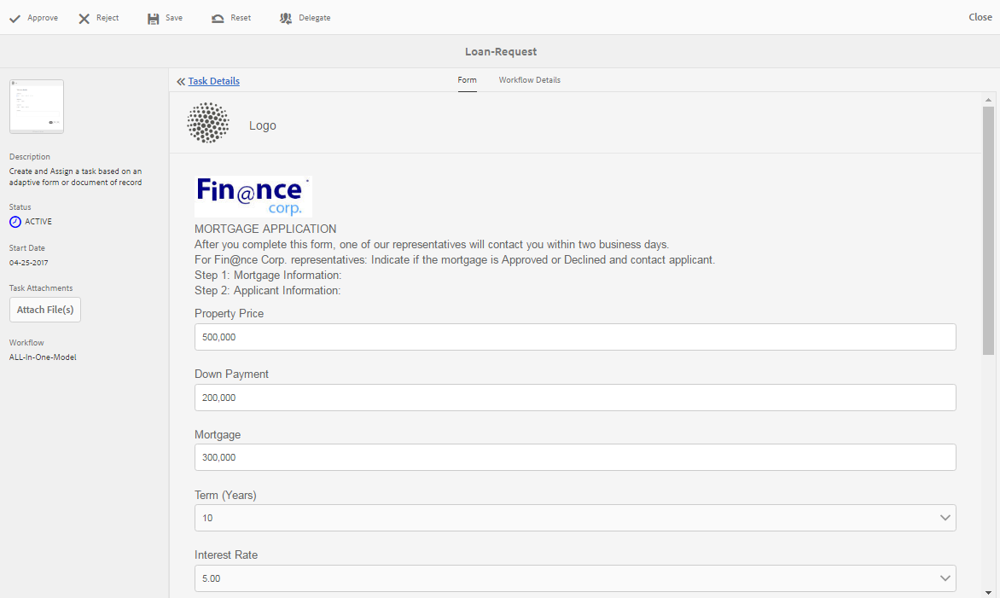
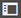

# Forms-toepassingen en -taken beheren in AEM Postvak In{#manage-forms-applications-and-tasks-in-aem-inbox}

Een van de vele manieren om een Forms-centric workflow te starten of activeren is via toepassingen in AEM Inbox. U moet een workflowtoepassing maken om een Forms-workflow als toepassing beschikbaar te maken in Inbox. Zie Een op Forms gerichte workflow [starten op OSGi voor meer informatie over workflowtoepassingen en andere manieren om Forms-workflows te starten](../../forms/using/aem-forms-workflow.md#launch).

Daarnaast consolideert AEM Inbox meldingen en taken van verschillende AEM, waaronder Forms-workflows. Wanneer een formulierwerkstroom met een taakstap Toewijzen wordt geactiveerd, wordt de bijbehorende toepassing weergegeven als een taak in het Postvak In van de ontvanger. Als de toegewezen persoon een groep is, wordt de taak in het Postvak In van alle groepsleden weergegeven totdat een persoon de taak aanvraagt of delegeert.

De gebruikersinterface van Inbox verstrekt lijst en kalendermeningen om taken te bekijken. U kunt ook de weergave-instellingen configureren. U kunt taken filteren op basis van verschillende parameters. Zie [Uw Postvak IN](/help/sites-authoring/inbox.md)voor meer informatie over weergave en filters.

Samenvattend kunt u met Inbox een nieuwe toepassing maken en toegewezen taken beheren.

>[!NOTE]
>
>U moet lid van de werkstroom-gebruikers groep zijn om AEM Inbox te kunnen gebruiken.

## Toepassing maken {#create-application}

1. Ga naar AEM Inbox op https://&#39;[server]:[port]&#39;/aem/inbox.
1. Tik in de gebruikersinterface van het Postvak IN op **[!UICONTROL Create > Application]**. De pagina Select Application (Toepassing selecteren) wordt weergegeven.
1. Selecteer een toepassing en klik op **[!UICONTROL Create]**. Het adaptieve formulier dat aan de toepassing is gekoppeld, wordt geopend. Vul de gegevens in het adaptieve formulier in en tik op **[!UICONTROL Submit]**. De bijbehorende workflow wordt gestart en er wordt een taak gemaakt in het Postvak In van de ontvanger.

## Taken beheren {#manage-tasks}

Wanneer een Forms-workflow wordt geactiveerd en u bent een ontvanger of onderdeel van de groep waaraan u bent toegewezen, wordt een taak weergegeven in uw Postvak In. U kunt taakdetails bekijken en beschikbare acties op de taak van binnen Inbox uitvoeren.

### Vorderingen of gedelegeerde taken {#claim-or-delegate-tasks}

De taken die aan een groep worden toegewezen verschijnen in Inbox van alle groepsleden. Om het even welk groepslid kan die taak beweren of het aan een ander groepslid delegeren. Daartoe:

1. Tik om de miniatuur van de taak te selecteren. Opties voor het openen of delegeren van de taak worden bovenaan weergegeven.

   

1. Voer een van de volgende handelingen uit:

   * Tik op **[!UICONTROL Delegate]** om de taak te delegeren. Het dialoogvenster Item delegeren wordt geopend. Selecteer een gebruiker, voeg desgewenst een opmerking toe en tik op **[!UICONTROL OK]**.

   

   * Tik op **[!UICONTROL Open]** om de taak op te eisen. Het dialoogvenster Toewijzen aan zelf wordt geopend. Tik **[!UICONTROL Proceed]** om de taak op te eisen. De geclaimde taak wordt met u weergegeven als de toegewezen persoon in uw Postvak IN.

   

### Details weergeven en handelingen uitvoeren op taken {#view-details-and-perform-actions-on-tasks}

Wanneer u een taak opent, kunt u taakdetails bekijken en beschikbare acties uitvoeren. De acties die beschikbaar zijn voor een taak worden gedefinieerd in de taakstap Toewijzen van de bijbehorende Forms-workflow.

1. Tik om de miniatuur van de taak te selecteren. Opties voor het openen of delegeren van de geselecteerde taak worden bovenaan weergegeven.
1. Tik op **Openen** om de taakdetails weer te geven en acties te ondernemen. De gedetailleerde taakweergave wordt geopend. In deze weergave kunt u taakdetails weergeven en acties ondernemen voor de taak.

   >[!NOTE]
   >
   >Als een taak aan een groep wordt toegewezen, moet u beweren het in gedetailleerde mening kan openen.



De gedetailleerde taakmening omvat de volgende secties:

* Taakdetails
* formulier
* Workflowdetails
* Werkbalk Handelingen

#### Taakdetails {#task-details}

In de sectie Taakdetails wordt informatie over de taak weergegeven. De weergegeven informatie is afhankelijk van de configuratie-instellingen van de taakstap [](/help/sites-developing/workflows-step-ref.md) toewijzen in de workflow. In het bovenstaande voorbeeld worden de beschrijving, de status, de begindatum en de workflow weergegeven die voor de taak worden gebruikt. U kunt ook een bestand aan de taak koppelen.

#### formulier {#form}

Op het tabblad Formulier in het hoofdinhoudsgebied worden het verzonden formulier en eventuele bijlagen op veldniveau weergegeven.

#### Workflowdetails {#workflow-details}

Het tabblad Workflowdetails bovenaan geeft de voortgang van de taak in verschillende fasen van de workflow weer. Het toont voltooide, huidige, en hangende stadia voor de taak. De fasen voor een workflow worden gedefinieerd in de taakstap [](/help/sites-developing/workflows-step-ref.md) Toewijzen van de bijbehorende workflow.

Bovendien geeft het tabblad de taakgeschiedenis weer voor elk voltooid werkgebied in de workflow. U kunt tikken **[!UICONTROL View Details]** voor een voltooid werkgebied om details over dat werkgebied te kennen. Er worden opmerkingen, formulier- en taakbijlagen, status, begin- en einddatums enzovoort over de taak weergegeven.


#### Werkbalk Handelingen {#actions-toolbar}

Op de werkbalk Handelingen staan alle beschikbare opties voor de taak. Terwijl sparen, het Terugstellen, en de Afgevaardigde standaardacties zijn, worden andere beschikbare acties gevormd in de [Assign taakstap](/help/sites-developing/workflows-step-ref.md). In het bovenstaande voorbeeld worden Goedkeuren en Afwijzen geconfigureerd in de workflow.

Wanneer u de taak uitvoert, gaat deze verder in de workflow.

### Voltooide taken weergeven {#view-completed-tasks}

AEM In Postvak In worden alleen actieve taken weergegeven. Voltooide taken worden niet in de lijst weergegeven. U kunt echter Inbox-filters gebruiken om taken te filteren op basis van verschillende parameters, zoals taaktype, status, begin- en einddatum enzovoort. Voltooide taken weergeven:

1. Tik in AEM Inbox op  om de filterkiezer te openen.
1. Tik op **[!UICONTROL Task Status]** accordeon en selecteer **[!UICONTROL Complete]**. Alle voltooide taken worden weergegeven.

   

1. Tik om een taak te selecteren en klik op **[!UICONTROL Open]**.

De taak wordt geopend om het document of het adaptieve formulier weer te geven dat aan de taak is gekoppeld. Voor een adaptief formulier geeft de taak het alleen-lezen adaptieve formulier of het bijbehorende PDF-document met record weer, zoals geconfigureerd op het tabblad Formulier/Document van de stap [Werkstroom](/help/sites-developing/workflows-step-ref.md)toewijzen.

In de sectie met taakdetails wordt informatie weergegeven zoals de ondernomen actie, taakstatus, begindatum en einddatum.


Op het **[!UICONTROL Workflow Details]** tabblad ziet u elke stap van de workflow. Tik op **[!UICONTROL View details]** voor gedetailleerde informatie.


## Problemen oplossen {#troubleshooting-workflows}

### Kan geen items weergeven die gerelateerd zijn aan AEM workflow in AEM inbox {#unable-to-see-aem-worklow-items}

Een eigenaar van een workflowmodel kan geen items met betrekking tot AEM workflow in AEM inbox weergeven. Om het probleem op te lossen, voegt u de onderstaande indexen toe aan uw AEM opslagplaats en maakt u de index opnieuw.

1. Gebruik een van de volgende methoden om indexen toe te voegen:

   * Maak de volgende knooppunten in CRX DE met `/oak:index/workflowDataLucene/indexRules/granite:InboxItem/properties` de respectievelijke eigenschappen zoals opgegeven in de volgende tabel:

      | Knooppunt | Eigenschap | Type |
      |---|---|---|
      | sharedWith | sharedWith | TEKENREEKS |
      | vergrendeld | vergrendeld | BOOLEAN |
      | geretourneerd | geretourneerd | BOOLEAN |
      | allowInboxSharing | allowInboxSharing | BOOLEAN |
      | allowExplicitSharing | allowExplicitSharing | BOOLEAN |


   * Implementeer de indices via een AEM. U kunt een [AEM project gebruiken Archetype](https://docs.adobe.com/content/help/en/experience-manager-core-components/using/developing/archetype) om een plaatsbaar AEM pakket tot stand te brengen. Gebruik de volgende steekproefcode om indexen aan een project van het type van AEM toe te voegen.

   ```Java
      .property("sharedWith", "sharedWith").type(TYPENAME_STRING).propertyIndex()
      .property("locked", "locked").type(TYPENAME_BOOLEAN).propertyIndex()
      .property("returned", "returned").type(TYPENAME_BOOLEAN).propertyIndex()
      .property("allowInboxSharing", "allowInboxSharing").type(TYPENAME_BOOLEAN).propertyIndex()
      .property("allowExplicitSharing", "allowExplicitSharing").type(TYPENAME_BOOLEAN).propertyIndex()
   ```

1. [Maak een index met eigenschappen en stel deze in op true](https://docs.adobe.com/content/help/en/experience-manager-65/deploying/deploying/queries-and-indexing.html#the-property-index).

1. Na het vormen van indexen in CRX DE of het opstellen via een pakket, [herindexeer de bewaarplaats](https://helpx.adobe.com/in/experience-manager/kb/HowToCheckLuceneIndex.html#Completelyrebuildtheindex).

https://docs.adobe.com/content/help/en/experience-manager-65/deploying/deploying/queries-and-indexing.html
