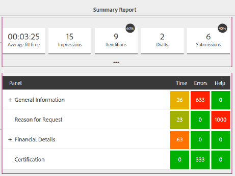

# De doeltreffendheid en conversie van formulieren meten en verbeteren{#measure-and-improve-effectiveness-and-conversion-of-forms}

## De uitdaging {#the-challenge-br}

Organisaties geven hun klanten steeds meer de mogelijkheid om via digitale zelfdiensten op meerdere kanalen te communiceren. Als er echter geen één-op-één terugkoppelingsmechanisme is, wordt het lastig om succes te meten en te experimenteren met digitale formulieren om de gebruikerservaring te verbeteren en conversies te vergroten.

Om ROI te maximaliseren, moeten de organisaties controleren hoe hun klanten met de diensten interactie aangaan, en met hun digitale artefacten (vormen) experimenteren om klantenervaringen te verbeteren. Organisaties hebben antwoorden nodig op vragen als:

* Hoeveel klanten hebben geprobeerd toegang te krijgen tot of te communiceren met mijn formulieren?
* Hoeveel van hen hebben de transactie met succes voltooid?
* Hoeveel van hen hebben het formulier verlaten?
* Wat zijn de probleemgebieden waar de klanten met problemen worden geconfronteerd?
* Welke veranderingen breng ik binnen en hoe test ik wat betere omzetting veroorzaakt?

## De oplossing {#the-solution}

AEM Forms is geïntegreerd met [Adobe Marketing Cloud](https://www.adobe.com/marketing-cloud.html)-oplossingen - [Adobe Analytics](https://www.adobe.com/marketing-cloud/web-analytics.html) en [Adobe Target](https://www.adobe.com/marketing-cloud/testing-targeting.html) - waarmee u kunt controleren en analyseren hoe uw formulieren werken en waarmee u kunt experimenteren en de ervaring kunt identificeren die tot een betere conversiesnelheid leidt.

## De werkstroom {#the-workflow}

We gaan verder met de details over hoe u de prestaties kunt meten en de conversietarieven voor formulieren kunt verbeteren.

### Doelpubliek {#target-audience}

* Zakelijke gebruikers en analisten die verantwoordelijk zijn voor marketingstrategieën en succes
* IT-personeel dat zorg draagt voor de installatie en het onderhoud van infrastructuur en oplossingen

### AEM Forms-componenten en -functies {#aem-forms-components-and-features-involved}

* Aangepaste formulieren
* Integratie met Adobe Analytics voor het verzamelen, organiseren en rapporteren van klantinteracties met uw aangepaste formulieren
* Integratie met Adobe Target om A/B-tests uit te voeren voor adaptieve formulieren

### Aannames {#assumptions}

* U hebt al een Adobe Marketing Cloud-account en bent geregistreerd voor Analytics en Target-oplossingen.
* U hebt een gepubliceerd adaptief formulier waartoe klanten toegang hebben.

### Workflowstappen {#workflow-steps}

#### Stap 1: Analyse en doel configureren in AEM Forms {#step-configure-analytics-and-target-in-aem-forms-br}

**Analyses configureren**

Om diepgaande inzichten in uw klanteninteractie met uw vormen te verkrijgen, moet u Analytics eerst in AEM Forms vormen. Voer de volgende stappen uit:

1. Een rapportsuite maken in Adobe Analytics
1. Cloudserviceconfiguratie maken in AEM
1. Cloudserviceframework maken in AEM
1. Configuratieservice voor AEM Forms Analytics configureren in AEM
1. Analyses inschakelen op het formulier in AEM

Zie [Analyses en rapporten configureren voor adaptieve formulieren](../../forms/using/configure-analytics-forms-documents.md) voor gedetailleerde stappen.

**Doel configureren**

Als u A/B-tests voor uw adaptieve formulieren wilt maken en uitvoeren, configureert u Target in AEM Forms zoals beschreven in [Doel instellen en integreren in AEM Forms](../../forms/using/ab-testing-adaptive-forms.md#p-set-up-and-integrate-target-in-aem-forms-p).

#### Stap 2: Analyserapport {#step-view-analytics-report-br} weergeven

Aangezien uw klanten tot en met vormen toegang hebben waarop u Analytics hebt toegelaten, worden hun interactie gevangen in hoogst beveiligde gegevensbestanden van Analytics. De databases worden gesegmenteerd door clients en zijn toegankelijk via beveiligde verbindingen.

U kunt een rapport vanuit AEM weergeven voor formulieren die analyses ondersteunen en gegevens analyseren. Het rapport weergeven:

1. Navigeer op AEM server naar **Forms > Forms &amp; Documents**.
1. Selecteer het formulier waarvoor u het analyserapport wilt gebruiken.
1. Klik op het pictogram Analytische rapporten. Het rapport wordt weergegeven.

Laten we eens kijken naar de gegevenspunten die Analytics verzamelt en rapporteert voor formulieren.

**Forms Analytics-rapport**

In het analyserapport voor adaptieve formulieren worden de volgende prestatiekernindicatoren (KPI&#39;s) op formulierniveau vastgelegd:

* **Gemiddelde vultijd**: Gemiddelde tijd die is besteed aan het invullen van het formulier
* **Afbeeldingen**: Aantal keren dat het formulier in de zoekresultaten is weergegeven

* **Uitvoeringen**: Aantal keer dat het formulier is gegenereerd of geopend
* **Concepten**: Aantal keer dat het formulier is opgeslagen als concept

* **Indieningen**: Aantal keer dat het formulier is ingediend
* **Afbreken**: Aantal resterende gebruikers zonder formulier in te vullen
* **Bezoeken/verzenden**: Verhouding van de bezoeken per indiening

Bovendien krijgt u de volgende details over elk paneel in de vorm:

* **Tijd**: Gemiddelde tijd (seconden) die aan het paneel en zijn gebieden wordt doorgebracht

* **Fout**: Aantal fouten aangetroffen in het deelvenster en de bijbehorende velden per 1000 formulieruitvoeringen

* **Help**: Aantal keren dat gebruikers de Help in de context voor het deelvenster en de bijbehorende velden hebben geopend per 1000 formulieruitvoeringen

Zie [AEM Forms-analyserapporten weergeven en begrijpen](../../forms/using/view-understand-aem-forms-analytics-reports.md) voor meer informatie over formulieranalytische rapporten.

>[!NOTE]
>
>U kunt gedetailleerde rapporten weergeven en meer inzicht krijgen in uw klanten en hun interactie met uw formulieren via uw Analytics-account op Adobe Marketing Cloud.

#### Stap 3: Gegevenspunten analyseren {#step-analyze-data-points}

In deze stap analyseert u de gegevenspunten in het analyserapport en geeft u aan hoe het formulier functioneert. Als het niet aan uw succes KPIs voldoet, zult u hypotheses construeren, die op gegevens worden gebaseerd, en mogelijke oplossingen vinden om de kwesties te bevestigen. Bijvoorbeeld:

* Als de gemiddelde vultijd voor het formulier hoger is dan u verwacht, is het mogelijk dat uw formulier complex is voor klanten om te begrijpen, het formulier geen standaardterminologie gebruikt, het formulier te lang is, enzovoort. In dit geval kunt u de formulierstructuur en velden vereenvoudigen, het formulierontwerp opnieuw bewerken, de lengte van het formulier verkorten of Help-beschrijvingen en voorbeelden toevoegen voor niet-standaardformuliervelden.
* Als uit de gegevens blijkt dat de meeste klanten de Help voor een formuliervenster openen, is het duidelijk dat klanten zich afvragen welke informatie moet worden ingevuld. U kunt alternatieve terminologie gebruiken of wat voorbeeldinput en hulpbeschrijving voor dat paneel toevoegen.
* Als het afbreken of verlaten van de plaats voor een vorm hoger is dan verwacht, zou het wegens het formulier kunnen zijn die lange tijd te geven duurt, landen de klanten onbedoeld op het formulier, of het is te ingewikkeld. In dit geval wilt u wellicht de formulierbeschrijving in de zoekresultaten optimaliseren, het formulier vereenvoudigen, het formulier optimaliseren zodat het sneller kan worden geladen, enzovoort.

Als u deze gegevenspunten hebt geanalyseerd en tot een hypothese bent gekomen, brengt u de vereiste wijzigingen aan in het formulier.

#### Stap 4: Uw analyse en correcties {#step-validate-your-analysis-and-fixes} valideren

In deze stap valideert u de wijzigingen die u in het formulier hebt aangebracht en controleert u of deze van invloed zijn op de conversiesnelheid.

**Een A/B-test uitvoeren**

Dankzij de integratie van AEM Forms met Target kunnen A/B-tests voor adaptieve formulieren worden gemaakt. In tests A/B, presenteert u willekeurig verschillende ervaringen van een vorm aan uw klanten in echt - tijd om te weten welke ervaring werkt beter of veroorzaakt meer omzettingen. Zodra u significante gegevens hebt die op één ervaring wijzen die betere omzetting levert dan andere, kunt u dat ervaringen als winnaar verklaren, en de toekomst, het wordt de standaardervaring zichtbaar aan alle klanten.

Zie [A/B testen op adaptieve formulieren](../../forms/using/ab-testing-adaptive-forms.md) voor meer informatie over het maken van een A/B test op een adaptieve vorm.

## Aanbevolen werkwijzen {#best-practices}

De echte beste praktijken zijn degenen die u zich tijdens het uitvoeren van deze werkschema identificeert. Ze zijn uniek voor uw omgeving en vereisten. Leg uw lessen vast in de workflow en documenteer ze als aanbevolen procedures.

Sommige aanbevelingen voor het ontwerpen van formulieren en het uitvoeren van A/B-tests zijn als volgt:

**Forms-ontwerp**

* Houd het formulier eenvoudig, kort en eenvoudig om te navigeren. Gebruik richtingsaanwijzingen voor navigatie.
* Standaardterminologie of algemene terminologie gebruiken voor formuliervelden.
* Beschrijf het veld en de vereiste invoer met voorbeelden of Help, waarbij gebruikers door elkaar kunnen raken.
* Valideer gebruikersinvoer tijdens het typen, waar mogelijk, om fouten bij het verzenden van formulieren te voorkomen.
* Optimaliseer lay-outs voor zowel desktops als mobiele apparaten.
* Gegevens automatisch invullen voor bekende gebruikers.

**A/B-tests**

* Construeer een hypothese en identificeer succeswaarden voordat u de A/B-test uitvoert.
* Voer minimale variaties (idealiter één voor één) uit in uw alternatieve ervaring om te weten wat de conversiesnelheid beïnvloedt.
* Test regelmatig om inefficiënties te voorkomen.

