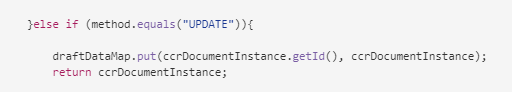

# Bereid en verzend Interactieve Communicatie gebruikend de Agent UI voor {#prepare-and-send-interactive-communication-using-the-agent-ui}

De agent UI staat de agenten toe om Interactieve Communicatie aan het postproces voor te bereiden en te verzenden. De agent brengt de vereiste wijzigingen aan zoals toegestaan, en legt de Interactieve Mededeling aan een postproces, zoals e-mail of druk voor.

## Overzicht {#overview}

Nadat een Interactieve Communicatie wordt gecreeerd, kan de Agent de Interactieve Communicatie in de Agent UI openen en een ontvankelijk-specifiek exemplaar voorbereiden door gegevens in te gaan en inhoud en gehechtheid te beheren. Tot slot kan de Agent de Interactieve Mededeling aan een postproces voorleggen.

Terwijl het voorbereiden van de Interactieve Mededeling gebruikend de Agent UI, beheert de agent de volgende aspecten van de Interactieve Mededeling in de Agent UI alvorens het aan een postproces voor te leggen:

* **Gegevens**: Het lusje van Gegevens van de Agent UI toont om het even welke agent-editable variabelen en ontgrendelde eigenschappen van het model van vormgegevens in de Interactieve Mededeling. Deze variabelen/eigenschappen worden gemaakt tijdens het bewerken of maken van documentfragmenten die zijn opgenomen in de interactieve communicatie. Het tabblad Gegevens bevat ook alle velden die zijn ingebouwd in de XDP/afdruksjabloon. Het tabblad Gegevens wordt alleen weergegeven wanneer er variabelen, eigenschappen van het formuliergegevensmodel of velden in de interactieve communicatie zijn die door de agent kunnen worden bewerkt.
* **Inhoud**: In het lusje van de Inhoud, beheert de Agent de inhoud zoals documentfragmenten en inhoudsvariabelen in de Interactieve Mededeling. De agent kan de wijzigingen in het documentfragment doorvoeren zoals is toegestaan tijdens het maken van de interactieve communicatie in de eigenschappen van die documentfragmenten. De agent kan ook een documentfragment opnieuw ordenen, toevoegen/verwijderen en pagina-einden toevoegen, indien toegestaan.
* **Gehechtheid**: Het lusje van Gehechtheid verschijnt in de Agent UI slechts als de Interactieve Communicatie om het even welke gehechtheid heeft of de Agent bibliotheektoegang heeft. De agent mag de bijlagen wel of niet wijzigen of bewerken.

## Bereid Interactieve Communicatie gebruikend de Agent UI voor {#prepare-interactive-communication-using-the-agent-ui}

1. Selecteer **[!UICONTROL Forms]** > **[!UICONTROL Forms & Documents]** .
1. Selecteer de gewenste interactieve communicatie en selecteer **[!UICONTROL Open Agent UI]** .

   >[!NOTE]
   >
   >De gebruikersinterface van de agent werkt slechts als geselecteerde Interactieve Communicatie een drukkanaal heeft.

   

   Gebaseerd op de inhoud en de eigenschappen van de Interactieve Mededeling, verschijnt de agent UI met de volgende drie lusjes: Gegevens, Inhoud, en Bijlage.

   

   Ga door met het invoeren van gegevens, het beheren van de inhoud en het beheren van de bijlagen.

### Gegevens invoeren {#enter-data}

1. Voer op het tabblad Gegevens de vereiste gegevens in voor variabelen, eigenschappen van het formuliergegevensmodel en velden voor de afdruksjabloon (XDP). Vul alle verplichte gebieden duidelijk met een asterisk (&ast;) om **toe te laten legt** knoop voor.

   Selecteer een waarde voor een gegevensveld in de voorvertoning Interactieve communicatie om het bijbehorende gegevensveld op het tabblad Gegevens te markeren of om de andere reden.

### Inhoud beheren {#manage-content}

Beheer op het tabblad Inhoud de inhoud, zoals documentfragmenten en inhoudsvariabelen in de interactieve communicatie.

1. Selecteer **[!UICONTROL Content]**. Het tabblad Inhoud van de interactieve communicatie wordt weergegeven.

   

1. Bewerk de documentfragmenten desgewenst op het tabblad Inhoud. Als u het relevante fragment in de inhoudshiërarchie de focus wilt geven, kunt u de desbetreffende regel of alinea in de voorvertoning Interactieve communicatie selecteren of het fragment rechtstreeks in de inhoudshiërarchie selecteren.

   Het documentfragment met de regel &quot;Nu online betalen...&quot; wordt bijvoorbeeld geselecteerd in de voorvertoning in de onderstaande afbeelding en hetzelfde documentfragment is geselecteerd op het tabblad Inhoud.

   

   Op de Inhoud of het lusje van Gegevens, door Hoogtepunt Geselecteerde Modules in Inhoud ( ) op hogere linkerzijde van de voorproef, kunt u functionaliteit onbruikbaar maken of toelaten om naar het documentfragment te gaan wanneer de relevante tekst, de paragraaf, of het gegevensgebied in de voorproef wordt aangewezen of wordt geselecteerd.

   De fragmenten die door de agent kunnen worden uitgegeven terwijl het creëren van de Interactieve Mededeling hebben de Edit Geselecteerde Inhoud ( ) pictogram. Selecteer het pictogram Geselecteerde inhoud bewerken om het fragment in de bewerkingsmodus te starten en er wijzigingen in aan te brengen. Gebruik de volgende opties voor het opmaken en beheren van tekst:

   * [Opmaakopties](#formattingtext)

      * [Opgemaakte tekst uit andere toepassingen kopiëren](#pasteformattedtext)
      * [Tekstgedeelten markeren](#highlightemphasize)

   * [Speciale tekens](#specialcharacters)
   * [Sneltoetsen](/help/forms/using/keyboard-shortcuts.md)

   Voor meer informatie over de acties beschikbaar voor diverse documentfragmenten in het gebruikersinterface van de Agent, zie [ Acties en info beschikbaar in het gebruikersinterface van de Agent ](#actionsagentui).

1. Als u een pagina-einde wilt toevoegen aan de afdrukuitvoer van de interactieve communicatie, plaatst u de cursor op de plaats waar u een pagina-einde wilt invoegen en selecteert u Pagina-einde voor of Pagina-einde na (  ).

   Een expliciete plaatsaanduiding voor een pagina-einde wordt ingevoegd in de interactieve communicatie. Zie het afdrukvoorbeeld voor informatie over de invloed van een expliciet pagina-einde op de interactieve communicatie.

   

   Ga verder met het beheer van de bijlagen van de interactieve communicatie.

### Bijlagen beheren {#manage-attachments}

1. Selecteer **[!UICONTROL Attachment]**. De agent UI toont de beschikbare gehechtheid zoals opstelling terwijl het creëren van de Interactieve Communicatie.

   U kunt verkiezen om een gehechtheid samen met de Interactieve Mededeling niet voor te leggen door het meningspictogram te tikken en u kunt het kruis in de gehechtheid selecteren om het (als de agent wordt toegestaan om de gehechtheid te schrappen of te verbergen) van de Interactieve Mededeling te schrappen. Voor de bijlagen die verplicht zijn opgegeven tijdens het maken van de interactieve communicatie, zijn de pictogrammen Weergeven en Verwijderen uitgeschakeld.

   

1. Selecteer het pictogram van de Toegang van de Bibliotheek ( ) om tot de Bibliotheek van de Inhoud toegang te hebben om activa DAM als gehechtheid op te nemen.

   >[!NOTE]
   >
   >Bibliotheektoegangspictogram is alleen beschikbaar als bibliotheektoegang is ingeschakeld tijdens het maken van de interactieve communicatie (in de eigenschappen Documentcontainer van het afdrukkanaal).

1. Als de volgorde van de bijlagen niet is vergrendeld tijdens het maken van de interactieve communicatie, kunt u de bijlagen opnieuw ordenen door een bijlage te selecteren en op de pijl-omlaag en -omhoog te tikken.
1. Met Webvoorvertoning en Afdrukvoorbeeld kunt u zien of de twee uitvoerbestanden aan uw eisen voldoen.

   Als u de voorvertoningen bevredigend vindt, selecteert u **[!UICONTROL Submit]** om de interactieve communicatie naar een postproces te verzenden. Als u wijzigingen wilt aanbrengen, sluit u de voorvertoning af en gaat u terug naar de wijzigingen.

## Tekst opmaken {#formattingtext}

Tijdens het bewerken van een tekstfragment in de gebruikersinterface van de agent verandert de werkbalk afhankelijk van het type bewerkingen dat u wilt uitvoeren: Lettertype, Alinea of Lijst:

 

Font, werkbalk


Alinea, werkbalk


Lijst, werkbalk

### Tekstgedeelten markeren/benadrukken {#highlightemphasize}

Als u\gedeelten van tekst in een bewerkbaar fragment wilt benadrukken, selecteert u de tekst en selecteert u Markeringskleur.


### Opgemaakte tekst plakken {#pasteformattedtext}


### Speciale tekens in tekst invoegen {#specialcharacters}

De interface van de Agent heeft ingebouwde steun voor 210 speciale karakters gebouwd. Admin kan [ steun voor meer/douane speciale karakters door aanpassing ](/help/forms/using/custom-special-characters.md) toevoegen.

#### Oplevering van bijlage {#attachmentdelivery}

* Wanneer de Interactieve Communicatie gebruikend server-kant APIs als interactieve of niet-interactieve PDF wordt teruggegeven, bevat de teruggegeven PDF gehechtheid als PDF gehechtheid.
* Wanneer een postproces verbonden aan een Interactieve Mededeling als deel van wordt geladen Submit gebruikend de UI van de Agent, worden de gehechtheid overgegaan als parameter List&lt;com.adobe.idp.Document> in AttachmentDocs.
* Workflows in het leveringsmechanisme, zoals e-mail en afdrukken, leveren ook bijlagen samen met de PDF-versie van de interactieve communicatie.

## Handelingen en informatie beschikbaar in de gebruikersinterface van de Agent {#actionsagentui}

### Documentfragmenten {#document-fragments}


* **omhoog/onderaan pijlen**: Pijlen om documentfragmenten omhoog of omlaag in de Interactieve Mededeling te bewegen.
* **Schrapping**: Indien toegestaan, schrap het documentfragment van de Interactieve Mededeling.
* **de Onderbreking van de Pagina vóór** (van toepassing op kindfragmenten van doelgebied): Voegt pagina onderbreking vóór het documentfragment in.
* **Inspringen**: Verhoog of verklein paragraaf van een documentfragment.
* **de Onderbreking van de Pagina na** (van toepassing op kindfragmenten van doelgebied): voegt pagina onderbreking na het documentfragment in.


* Bewerken (alleen tekstfragmenten): RTF-editor openen voor het bewerken van het tekstdocumentfragment. Voor meer informatie, zie [ Formatterende tekst ](#formattingtext).

* Selectie (oogpictogram): hiermee wordt het\ndocumentfragment uitgesloten van de interactieve communicatie.
* Niet-gevulde waarden (info): geeft het aantal niet-gevulde variabelen in het documentfragment aan.

### Documentfragmenten weergeven {#list-document-fragments}


* Lege regel invoegen: voegt nieuwe lege regel in.
* Selectie (oogpictogram): hiermee wordt het\ndocumentfragment uitgesloten van de interactieve communicatie.
* Opsommingstekens/nummering overslaan: inschakelen als u opsommingstekens/nummering in het documentfragment van de lijst wilt overslaan.
* Niet-gevulde waarden (info): geeft het aantal niet-gevulde variabelen in het documentfragment aan.

## Interactieve communicatie opslaan als concept {#save-as-draft}

U kunt de Agent UI gebruiken om één of meerdere concepten voor elke Interactieve Mededeling te bewaren en het ontwerp later terug te winnen om aan het verder te werken. U kunt voor elk concept een andere naam opgeven om het te identificeren.

Adobe raadt u aan deze instructies op volgorde uit te voeren om een interactieve communicatie als concept op te slaan.

### De functie Opslaan als concept inschakelen {#before-save-as-draft}

De functie Opslaan als concept is niet standaard ingeschakeld. Voer de volgende stappen uit om de functie in te schakelen:

1. Voer [ ccrDocumentInstance ](https://helpx.adobe.com/experience-manager/6-5/forms/javadocs/com/adobe/fd/ccm/ccr/ccrDocumentInstance/api/services/CCRDocumentInstanceService.html) Interface van de Dienstverlener uit (SPI).

   SPI laat u toe om de ontwerp versie van de Interactieve Mededeling aan het gegevensbestand met een ontwerpidentiteitskaart als uniek herkenningsteken te bewaren. Deze instructies veronderstellen dat u vroegere kennis op hoe te om een bundel te bouwen OSGi gebruikend een Geweven project hebt.

   Voor de implementatie van steekproefSPI, zie [ de implementatie van crDocumentInstance SPI van de Steekproef crDocumentInstance ](#sample-ccrDocumentInstance-spi).
1. Open `http://<hostname>:<port>/ system/console/bundles` en selecteer **[!UICONTROL Install/Update]** om de OSGi-bundel te uploaden. Verifieer dat het statuut van het geuploade pakket als **Actieve** toont. Begin de server opnieuw als het statuut van het pakket niet als **Actieve** toont.
1. Ga naar `https://'[server]:[port]'/system/console/configMgr` .
1. Selecteer **[!UICONTROL Create Correspondence Configuration]** .
1. Selecteer **[!UICONTROL Enable Save Using CCRDocumentInstanceService]** en selecteer **[!UICONTROL Save]** .

### Een interactieve communicatie opslaan als concept {#save-as-draft-agent-ui}

Voer de volgende stappen uit om een Interactieve Mededeling als ontwerp te bewaren:

1. Selecteer een interactieve communicatie in Forms Manager en selecteer **[!UICONTROL Open Agent UI]** .

1. Breng de gewenste wijzigingen aan in de gebruikersinterface van de agent en selecteer **[!UICONTROL Save as Draft]** .

1. Geef de naam van het concept op in het veld **[!UICONTROL Name]** en selecteer **[!UICONTROL Done]** .

Als u de interactieve communicatie eenmaal als concept hebt opgeslagen, selecteert u **[!UICONTROL Save Changes]** om eventuele verdere wijzigingen in het concept op te slaan.

### Het concept van een interactieve communicatie ophalen {#retrieve-draft}

Nadat u een interactieve communicatie als concept hebt opgeslagen, kunt u deze ophalen om er verder aan te werken. Haal de Interactieve Mededeling terug gebruikend:

`https://server:port/aem/forms/createcorrespondence.hmtl?draftid=[draftid]`

[ ontleed ] verwijst naar het unieke herkenningsteken voor de ontwerp versie die na het bewaren van een Interactieve Mededeling als ontwerp wordt geproduceerd.

### Voorbeeld crDocumentInstance SPI-implementatie {#sample-ccrDocumentInstance-spi}

Implementeer de SPI van `ccrDocumentInstance` om een Interactieve Mededeling als ontwerp te bewaren. Hier volgt een voorbeeldimplementatie van de SPI `ccrDocumentInstance` .

```javascript
package Implementation;

import com.adobe.fd.ccm.ccr.ccrDocumentInstance.api.exception.CCRDocumentException;
import com.adobe.fd.ccm.ccr.ccrDocumentInstance.api.model.CCRDocumentInstance;
import com.adobe.fd.ccm.ccr.ccrDocumentInstance.api.services.CCRDocumentInstanceService;
import org.apache.commons.lang3.StringUtils;
import org.osgi.service.component.annotations.Component;
import org.slf4j.Logger;
import org.slf4j.LoggerFactory;

import java.util.*;


@Component(service = CCRDocumentInstanceService.class, immediate = true)
public class CCRDraftService implements CCRDocumentInstanceService {

    private static final Logger logger = LoggerFactory.getLogger(CCRDraftService.class);

    private HashMap<String, Object> draftDataMap = new HashMap<>();

    @Override
    public String save(CCRDocumentInstance ccrDocumentInstance) throws CCRDocumentException {
        String documentInstanceName = ccrDocumentInstance.getName();
        if (StringUtils.isNotEmpty(documentInstanceName)) {
            logger.info("Saving ccrData with name : {}", ccrDocumentInstance.getName());
            if (!CCRDocumentInstance.Status.SUBMIT.equals(ccrDocumentInstance.getStatus())) {
                ccrDocumentInstance = mySQLDataBaseServiceCRUD(ccrDocumentInstance,null, "SAVE");
            }
        } else {
            logger.error("Could not save data as draft name is empty");
        }
        return ccrDocumentInstance.getId();
    }

    @Override
    public void update(CCRDocumentInstance ccrDocumentInstance) throws CCRDocumentException {
        String documentInstanceName = ccrDocumentInstance.getName();
        if (StringUtils.isNotEmpty(documentInstanceName)) {
            logger.info("Saving ccrData with name : {}", documentInstanceName);
            mySQLDataBaseServiceCRUD(ccrDocumentInstance, ccrDocumentInstance.getId(), "UPDATE");
        } else {
            logger.error("Could not save data as draft Name is empty");
        }
    }

    @Override
    public CCRDocumentInstance get(String id) throws CCRDocumentException {
        CCRDocumentInstance cCRDocumentInstance;
        if (StringUtils.isEmpty(id)) {
            logger.error("Could not retrieve data as draftId is empty");
            cCRDocumentInstance = null;
        } else {
            cCRDocumentInstance = mySQLDataBaseServiceCRUD(null, id,"GET");
        }
        return cCRDocumentInstance;
    }

    @Override
    public List<CCRDocumentInstance> getAll(String userId, Date creationTime, Date updateTime,
                                            Map<String, Object> optionsParams) throws CCRDocumentException {
        List<CCRDocumentInstance> ccrDocumentInstancesList = new ArrayList<>();

        HashMap<String, Object> allSavedDraft = mySQLGetALLData();
        for (String key : allSavedDraft.keySet()) {
            ccrDocumentInstancesList.add((CCRDocumentInstance) allSavedDraft.get(key));
        }
        return ccrDocumentInstancesList;
    }

    //The APIs call the service in the database using the following section.
    private CCRDocumentInstance mySQLDataBaseServiceCRUD(CCRDocumentInstance ccrDocumentInstance,String draftId, String method){
        if(method.equals("SAVE")){

            String autoGenerateId = draftDataMap.size() + 1 +"";
            ccrDocumentInstance.setId(autoGenerateId);
            draftDataMap.put(autoGenerateId, ccrDocumentInstance);
            return ccrDocumentInstance;

        }else if (method.equals("UPDATE")){

            draftDataMap.put(ccrDocumentInstance.getId(), ccrDocumentInstance);
            return ccrDocumentInstance;

        }else if(method.equals("GET")){

            return (CCRDocumentInstance) draftDataMap.get(draftId);

        }
        return null;
    }

    private HashMap<String, Object> mySQLGetALLData(){
        return draftDataMap;
    }
}
```

De bewerkingen `save`, `update`, `get` en `getAll` roepen de databaseservice op om een interactieve communicatie als concept op te slaan, een interactieve communicatie bij te werken, gegevens uit de database op te halen en gegevens op te halen voor alle interactieve communicatie die beschikbaar is in de database. In dit voorbeeld wordt `mySQLDataBaseServiceCRUD` gebruikt als de naam van de databaseservice.

In de volgende tabel wordt de voorbeeldimplementatie van de `ccrDocumentInstance` SPI uitgelegd. Hierin wordt getoond hoe de `save` -, `update` -, `get` - en `getAll` -bewerkingen de databaseservice oproepen in de voorbeeldimplementatie.

<table> 
 <tbody>
 <tr>
  <td><p><strong>Bewerking</strong></p></td>
  <td><p><strong>Voorbeelden van databaseservices</strong></p></td> 
   </tr>
  <tr>
   <td><p>U kunt een concept voor een interactieve communicatie maken of deze rechtstreeks verzenden. De API voor de opslagbewerking controleert of de interactieve communicatie als concept wordt verzonden en of deze een conceptnaam bevat. De API roept dan de dienst mySQLDataBaseServiceCRUD met sparen als inputmethode.</p></br></td>
   <td><p>De mySQLDataBaseServiceCRUD-service verifieert Opslaan als de invoermethode en genereert een automatisch gegenereerde concept-id en retourneert deze naar AEM. De logica om een ontwerpID te produceren kan variëren gebaseerd op het gegevensbestand.</p></br></td>
   </tr>
  <tr>
   <td><p>De API voor de updateverrichting wint de status van Interactief Communicatie ontwerp terug en controleert als de Interactieve Communicatie een ontwerpnaam omvat. De API roept de mySQLDataBaseServiceCRUD-service aan om die status in de database bij te werken.</p></br></td>
   <td><p>De mySQLDataBaseServiceCRUD dienst verifieert Update als inputmethode en bewaart de status van Interactief Communicatie ontwerp in het gegevensbestand.</br></p></td>
   </tr>
   <tr>
   <td><p>De API voor de get-bewerking controleert of de interactieve communicatie een concept-id bevat. De API roept dan de dienst mySQLDataBaseServiceCRUD met krijgen als inputmethode om de gegevens voor de Interactieve Mededeling terug te winnen.</br></p></td>
   <td><p>De mySQLDataBaseServiceCRUD dienst verifieert krijgen als inputmethode en wint de gegevens voor de Interactieve Communicatie terug die op ontwerpidentiteitskaart wordt gebaseerd.</p></br></td>
   </tr>
   <tr>
   <td><p>De API voor de bewerking getAll roept de mySQLGetALLData-service aan om gegevens op te halen voor alle interactieve communicatie die in de database is opgeslagen.</br></p></td>
   <td><p>De mySQLGetALLData-service haalt gegevens op voor alle interactieve communicatie die in de database is opgeslagen.</p></br></td>
   </tr>
  </tbody>
</table>

Hieronder ziet u een voorbeeld van het bestand `pom.xml` dat deel uitmaakt van de implementatie:

```xml
<?xml version="1.0" encoding="UTF-8"?>
<project xmlns="https://maven.apache.org/POM/4.0.0"
         xmlns:xsi="https://www.w3.org/2001/XMLSchema-instance"
         xsi:schemaLocation="https://maven.apache.org/POM/4.0.0 https://maven.apache.org/xsd/maven-4.0.0.xsd">
    <modelVersion>4.0.0</modelVersion>

    <groupId>com.adobe.livecycle</groupId>
    <artifactId>draft-sample</artifactId>
    <version>2.0.0-SNAPSHOT</version>

    <name>Interact</name>
    <packaging>bundle</packaging>

    <dependencies>
        <dependency>
            <groupId>com.adobe.aemfd</groupId>
            <artifactId>aemfd-client-sdk</artifactId>
            <version>6.0.160</version>
        </dependency>
    </dependencies>


    <!-- ====================================================================== -->
    <!-- B U I L D D E F I N I T I O N -->
    <!-- ====================================================================== -->
    <build>
        <plugins>
            <plugin>
                <groupId>org.apache.felix</groupId>
                <artifactId>maven-bundle-plugin</artifactId>
                <version>3.3.0</version>
                <extensions>true</extensions>
                <executions>
                    <!--Configure extra execution of 'manifest' in process-classes phase to make sure SCR metadata is generated before unit test runs-->
                    <execution>
                        <id>scr-metadata</id>
                        <goals>
                            <goal>manifest</goal>
                        </goals>
                    </execution>
                </executions>
                <configuration>
                    <exportScr>true</exportScr>
                    <instructions>
                        <!-- Enable processing of OSGI DS component annotations -->
                        <_dsannotations>*</_dsannotations>
                        <!-- Enable processing of OSGI metatype annotations -->
                        <_metatypeannotations>*</_metatypeannotations>
                        <Bundle-SymbolicName>${project.groupId}-${project.artifactId}</Bundle-SymbolicName>
                    </instructions>
                </configuration>
            </plugin>
            <plugin>
                <groupId>org.apache.maven.plugins</groupId>
                <artifactId>maven-surefire-plugin</artifactId>
            </plugin>
            <plugin>
                <groupId>org.apache.maven.plugins</groupId>
                <artifactId>maven-compiler-plugin</artifactId>
                <configuration>
                    <source>8</source>
                    <target>8</target>
                </configuration>
            </plugin>
        </plugins>
    </build>
    <profiles>
        <profile>
            <id>autoInstall</id>
            <build>
                <plugins>
                    <plugin>
                        <groupId>org.apache.sling</groupId>
                        <artifactId>maven-sling-plugin</artifactId>
                        <executions>
                            <execution>
                                <id>install-bundle</id>
                                <phase>install</phase>
                                <goals>
                                    <goal>install</goal>
                                </goals>
                            </execution>
                        </executions>
                    </plugin>
                </plugins>
            </build>
        </profile>
    </profiles>

</project>
```

>[!NOTE]
>
>Zorg ervoor dat u de `aemfd-client-sdk` afhankelijkheid in het `pom.xml` -bestand bijwerkt naar 6.0.160.
