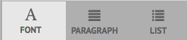

# Bereid en verzend Interactieve Communicatie gebruikend de Agent UI voor {#prepare-and-send-interactive-communication-using-the-agent-ui}

De agent UI staat de agenten toe om Interactieve Communicatie aan het postproces voor te bereiden en te verzenden. De agent brengt de vereiste wijzigingen aan zoals toegestaan, en legt de Interactieve Mededeling aan een postproces, zoals e-mail of druk voor.

## Overzicht {#overview}

Nadat een Interactieve Communicatie wordt gecreeerd, kan de Agent de Interactieve Communicatie in de Agent UI openen en een ontvankelijk-specifiek exemplaar voorbereiden door gegevens in te gaan en inhoud en gehechtheid te beheren. Tot slot kan de Agent de Interactieve Mededeling aan een postproces voorleggen.

Terwijl het voorbereiden van de Interactieve Mededeling gebruikend de Agent UI, beheert de agent de volgende aspecten van de Interactieve Mededeling in de Agent UI alvorens het aan een postproces voor te leggen:

* **Gegevens**: Het lusje van Gegevens van de Agent UI toont om het even welke agent-editable variabelen en ontgrendelde eigenschappen van het model van vormgegevens in de Interactieve Mededeling. Deze variabelen/eigenschappen worden gemaakt tijdens het bewerken of maken van documentfragmenten die zijn opgenomen in de interactieve communicatie. Het tabblad Gegevens bevat ook alle velden die zijn ingebouwd in de XDP/afdruksjabloon. Het tabblad Gegevens wordt alleen weergegeven wanneer er variabelen, eigenschappen van het formuliergegevensmodel of velden in de interactieve communicatie zijn die door de agent kunnen worden bewerkt.
* **Inhoud**: In het lusje van de Inhoud, beheert de Agent de inhoud zoals documentfragmenten en inhoudsvariabelen in de Interactieve Mededeling. De agent kan de wijzigingen in het documentfragment doorvoeren zoals is toegestaan tijdens het maken van de interactieve communicatie in de eigenschappen van die documentfragmenten. De agent kan ook een documentfragment opnieuw ordenen, toevoegen/verwijderen en pagina-einden toevoegen, indien toegestaan.
* **Bijlagen**: Het lusje van Bijlagen verschijnt in de Agent UI slechts als de Interactieve Communicatie om het even welke gehechtheid heeft of de Agent bibliotheektoegang heeft. De agent mag de bijlagen wel of niet wijzigen of bewerken.

## Bereid Interactieve Communicatie gebruikend de Agent UI voor {#prepare-interactive-communication-using-the-agent-ui}

1. Selecteer **[!UICONTROL Forms]** > **[!UICONTROL Forms & Documents]**.
1. Selecteer de gewenste interactieve communicatie en tik op **[!UICONTROL Open Agent UI]**.

   >[!NOTE]
   >
   >De gebruikersinterface van de agent werkt slechts als geselecteerde Interactieve Communicatie een drukkanaal heeft.

   

   Gebaseerd op de inhoud en de eigenschappen van de Interactieve Mededeling, verschijnt de agent UI met de volgende drie lusjes: Gegevens, inhoud en bijlage.

   

   Ga door met het invoeren van gegevens, het beheren van de inhoud en het beheren van de bijlagen.

### Gegevens invoeren {#enter-data}

1. Voer op het tabblad Gegevens de vereiste gegevens in voor variabelen, eigenschappen van het formuliergegevensmodel en velden voor de afdruksjabloon (XDP). Vul alle verplichte velden in die zijn gemarkeerd met een sterretje (&amp;ast;) om de knop **Verzenden** in te schakelen.

   Tik op de waarde van een gegevensveld in de voorvertoning Interactieve communicatie om het bijbehorende gegevensveld op het tabblad Gegevens te markeren, of andersom.

### Inhoud beheren {#manage-content}

Beheer op het tabblad Inhoud de inhoud, zoals documentfragmenten en inhoudsvariabelen in de interactieve communicatie.

1. Selecteer **[!UICONTROL Content]**. Het tabblad Inhoud van de interactieve communicatie wordt weergegeven.

   

1. Bewerk de documentfragmenten desgewenst op het tabblad Inhoud. Als u het relevante fragment in de inhoudshiërarchie de focus wilt geven, kunt u op de relevante regel of alinea in de voorvertoning Interactieve communicatie tikken of rechtstreeks in de inhoudshiërarchie op het fragment tikken.

   Het documentfragment met de regel &quot;Nu een betaling online verrichten... &quot; is geselecteerd in de voorvertoning in de onderstaande afbeelding en hetzelfde documentfragment is geselecteerd op het tabblad Inhoud.

   

   Als u op het tabblad Inhoud of Gegevens op Geselecteerde modules markeren in inhoud ( markeren) linksboven in de voorvertoning tikt, kunt u de functionaliteit uitschakelen of inschakelen om naar het documentfragment te gaan wanneer in de voorvertoning op de desbetreffende tekst, alinea of gegevensveld wordt getikt of geselecteerd.

   De fragmenten die door de agent mogen worden bewerkt tijdens het maken van de interactieve communicatie hebben het pictogram Geselecteerde inhoud ( ) bewerken. Tik op het pictogram Geselecteerde inhoud bewerken om het fragment in de bewerkingsmodus te starten en er wijzigingen in aan te brengen. Gebruik de volgende opties voor het opmaken en beheren van tekst:

   * [Opmaakopties](#formattingtext)

      * [Opgemaakte tekst uit andere toepassingen kopiëren](#pasteformattedtext)
      * [Tekstgedeelten markeren](#highlightemphasize)
   * [Speciale tekens](#specialcharacters)
   * [Sneltoetsen](/help/forms/using/keyboard-shortcuts.md)
   Voor meer informatie over de acties beschikbaar voor diverse documentfragmenten in het gebruikersinterface van de Agent, zie [Acties en info beschikbaar in het gebruikersinterface](#actionsagentui)van de Agent.

1. Als u een pagina-einde wilt toevoegen aan de afdrukuitvoer van de interactieve communicatie, plaatst u de cursor op de plaats waar u een pagina-einde wilt invoegen en selecteert u Pagina-einde voor of Pagina-einde na ( ).

   Een expliciete plaatsaanduiding voor een pagina-einde wordt ingevoegd in de interactieve communicatie. Zie het afdrukvoorbeeld voor informatie over de invloed van een expliciet pagina-einde op de interactieve communicatie.

   

   Ga verder met het beheer van de bijlagen van de interactieve communicatie.

### Bijlagen beheren {#manage-attachments}

1. Selecteer **[!UICONTROL Attachment]**. De agent UI toont de beschikbare gehechtheid zoals opstelling terwijl het creëren van de Interactieve Communicatie.

   U kunt verkiezen om een gehechtheid samen met de Interactieve Mededeling niet voor te leggen door het meningspictogram te tikken en u kunt het kruis in de gehechtheid tikken om het (als de agent wordt toegestaan om de gehechtheid te schrappen of te verbergen) van de Interactieve Mededeling te schrappen. Voor de bijlagen die verplicht zijn opgegeven tijdens het maken van de interactieve communicatie, zijn de pictogrammen Weergeven en Verwijderen uitgeschakeld.

   

1. Tik op het pictogram Library Access ( ) om toegang te krijgen tot de inhoudsbibliotheek en DAM-elementen in te voegen als bijlagen.

   >[!NOTE]
   >
   >Het pictogram Bibliotheektoegang is alleen beschikbaar als bibliotheektoegang is ingeschakeld tijdens het maken van de interactieve communicatie (in de eigenschappen Documentcontainer van het afdrukkanaal).

1. Als de volgorde van de bijlagen niet is vergrendeld tijdens het maken van de interactieve communicatie, kunt u de bijlagen opnieuw ordenen door een bijlage te selecteren en op de pijl-omlaag en -omhoog te tikken.
1. Met Webvoorvertoning en Afdrukvoorbeeld kunt u zien of de twee uitvoerbestanden aan uw eisen voldoen.

   Als u de voorvertoningen bevredigend vindt, tikt u **[!UICONTROL Submit]** om de interactieve communicatie naar een postproces te verzenden. Als u wijzigingen wilt aanbrengen, sluit u de voorvertoning af en gaat u terug naar de wijzigingen.

## Tekst opmaken {#formattingtext}

Tijdens het bewerken van een tekstfragment in de gebruikersinterface van de agent verandert de werkbalk afhankelijk van het type bewerkingen dat u wilt uitvoeren: Lettertype, Alinea of Lijst:

 

Font, werkbalk

Alinea, werkbalk

Lijst, werkbalk

### Tekstgedeelten markeren/benadrukken {#highlightemphasize}

Selecteer de tekst en tik op Markeringskleur om\gedeelten van tekst in een bewerkbaar fragment te benadrukken.

### Opgemaakte tekst plakken {#pasteformattedtext}

### Speciale tekens in tekst invoegen {#specialcharacters}

De interface van de Agent heeft ingebouwde steun voor 210 speciale karakters gebouwd. De beheerder kan ondersteuning voor meer/aangepaste speciale tekens [toevoegen door deze aan te passen](/help/forms/using/custom-special-characters.md).

#### Oplevering van bijlage {#attachmentdelivery}

* Wanneer de interactieve communicatie wordt gerenderd met server-side API&#39;s als een interactieve of niet-interactieve PDF, bevat de gerenderde PDF bijlagen als PDF-bijlagen.
* Wanneer een postproces verbonden aan een Interactieve Mededeling als deel van wordt geladen Submit gebruikend de UI van de Agent, worden de gehechtheid overgegaan als parameter List&lt;com.adobe.idp.Document> in AttachmentDocs.
* Workflows in het leveringsmechanisme, zoals e-mail en afdrukken, leveren ook bijlagen samen met de PDF-versie van de interactieve communicatie.

## Handelingen en informatie beschikbaar in de gebruikersinterface van de Agent {#actionsagentui}

### Documentfragmenten {#document-fragments}

* **Pijlen** omhoog en omlaag: Pijlt om documentfragmenten omhoog of omlaag te verplaatsen in de interactieve communicatie.
* **Verwijderen**: Verwijder, indien toegestaan, het documentfragment uit de interactieve communicatie.
* **Pagina-einde voor** (van toepassing op onderliggende fragmenten van het doelgebied): Hiermee voegt u een pagina-einde in vóór het documentfragment.
* **Inspringen**: De inspringing van een documentfragment vergroten of verkleinen.
* **Pagina-einde na** (van toepassing op onderliggende fragmenten van het doelgebied): Hiermee voegt u een pagina-einde in na het documentfragment.

* Bewerken (alleen tekstfragmenten): Open een RTF-editor voor het bewerken van het tekstdocumentfragment. Zie [Tekst opmaken](#formattingtext) voor meer informatie.

* Selectie (oogpictogram): Hiermee\nHiermee sluit u het documentfragment uit van de interactieve communicatie.
* Niet-gevulde waarden (info): Hiermee geeft u het aantal niet-gevulde variabelen in het documentfragment aan.

### Documentfragmenten weergeven {#list-document-fragments}

* Lege regel invoegen: Hiermee voegt u een nieuwe lege regel in.
* Selectie (oogpictogram): Hiermee\nHiermee sluit u het documentfragment uit van de interactieve communicatie.
* Opsommingstekens/nummering overslaan: Schakel deze optie in om opsommingstekens/nummering in het lijstdocumentfragment over te slaan.
* Niet-gevulde waarden (info): Hiermee geeft u het aantal niet-gevulde variabelen in het documentfragment aan.

## Interactieve communicatie opslaan als concept {#save-as-draft}

U kunt de Agent UI gebruiken om één of meerdere concepten voor elke Interactieve Mededeling te bewaren en het ontwerp later terug te winnen om aan het verder te werken. U kunt voor elk concept een andere naam opgeven om het te identificeren.

Adobe raadt u aan deze instructies op volgorde uit te voeren om een interactieve communicatie als concept op te slaan.

### De functie Opslaan als concept inschakelen {#before-save-as-draft}

De functie Opslaan als concept is niet standaard ingeschakeld. Voer de volgende stappen uit om de functie in te schakelen:

1. Implementeer de [ccrDocumentInstance](https://helpx.adobe.com/experience-manager/6-5/forms/javadocs/index.html) Service Provider Interface (SPI). SPI laat u toe om de ontwerp versie van de Interactieve Mededeling aan het gegevensbestand met een ontwerpidentiteitskaart als uniek herkenningsteken te bewaren.
1. Go to `https://'[server]:[port]'/system/console/configMgr`.
1. Tik op **[!UICONTROL Create Correspondence Configuration]**.
1. Selecteer **[!UICONTROL Enable Save Using CCRDocumentInstanceService]** en tik op **[!UICONTROL Save]**.

### Een interactieve communicatie opslaan als concept {#save-as-draft-agent-ui}

Voer de volgende stappen uit om een Interactieve Mededeling als ontwerp te bewaren:

1. Selecteer een interactieve communicatie in Forms Manager en tik op **[!UICONTROL Open Agent UI]**.

1. Breng aangewezen veranderingen in de Agent UI aan en tik **[!UICONTROL Save as Draft]**.

1. Geef de naam van het concept op in het **[!UICONTROL Name]** veld en tik op **[!UICONTROL Done]**.

Als u de interactieve communicatie eenmaal als concept hebt opgeslagen, tikt u **[!UICONTROL Save Changes]** om eventuele verdere wijzigingen in het concept op te slaan.

### Het concept van een interactieve communicatie ophalen {#retrieve-draft}

Nadat u een interactieve communicatie als concept hebt opgeslagen, kunt u deze ophalen om er verder aan te werken. Haal de Interactieve Mededeling terug gebruikend:

`https://server:port/aem/forms/createcorrespondence.hmtl?draftid=[draftid]`

[Conceptid] verwijst naar de unieke id voor de conceptversie die wordt gegenereerd nadat een interactieve communicatie als concept is opgeslagen.

>[!NOTE]
>
>Als u wijzigingen aanbrengt in de interactieve communicatie nadat u deze hebt opgeslagen als concept, kan de conceptversie niet worden geopend.
