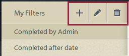
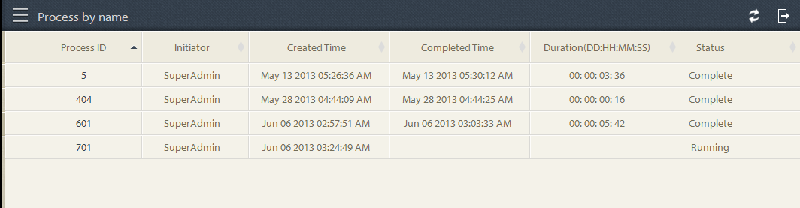
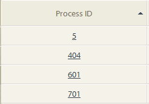
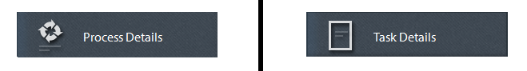

# Ad hoc Vragen in Proces het Melden{#ad-hoc-queries-in-process-reporting}

## Ad-hocquery&#39;s in procesrapportage {#ad-hoc-queries-in-process-reporting-1}

Met ad-hocquery&#39;s in Process Reporting kunt u aangepaste query&#39;s maken die u kunt gebruiken om te zoeken naar proces- en taakdetails van de AEM Forms-procesinstanties die in uw AEM Forms-omgeving zijn gedefinieerd.

Ook, kunnen de ad hoc vragen worden bepaald gebruikend proces en de filters van het taakbezit. Deze filters kunnen vervolgens worden opgeslagen en gebruikt om de rapporten later uit te voeren.

[**Onderzoek van het Proces**](/help/forms/using/process-reporting/adhoc-queries-in-process-reporting.md#p-process-task-search-p): Onderzoek naar procesinstanties met een user-defined onderzoeksfilter dat op procesattributen wordt gebaseerd.

[**Details van het Proces**](/help/forms/using/process-reporting/adhoc-queries-in-process-reporting.md#p-process-task-details-p): De details van de mening van een procesinstantie door procesidentiteitskaart te specificeren.

**Onderzoek van de Taak**: Onderzoek naar taakinstanties met een user-defined onderzoeksfilter dat op taakattributen wordt gebaseerd.

**Details van de Taak**: De details van de mening van een taakinstantie door taakidentiteitskaart te specificeren.

### Processen en taken {#processes-and-tasks}

De stappen die u volgt om filters tot stand te brengen en vragen voor procesdetails in werking te stellen zijn het zelfde als dat voor taken.

Dit betekent dat de gebruikersinterface voor het Onderzoek van het Proces en het Onderzoek van de Taak slechts op de gebieden verschilt die u kunt zoeken door en de gebieden terugkomen in de onderzoeksresultaten. Dit komt omdat veel velden identiek zijn, maar bepaalde velden specifiek zijn voor processen en bepaalde velden specifiek zijn voor taken.

In dit artikel worden de beschrijvingen van de secties Zoeken/Taak en Proces/Taakdetails beschreven. Op aangewezen plaatsen, zullen om het even welke specifieke verschillen specifiek worden geroepen.

## Proces/taak zoeken {#process-task-search}

U gebruikt Proces/Taak Onderzoek om filters te bepalen voor het vragen van proces/taakinstanties.

### Een zoekquery voor proces/taak maken {#to-create-a-process-task-search-query}

1. Om de opgeslagen vragen van het Proces/van het Onderzoek van de Taak te bekijken of een vraag tot stand te brengen, klik **Adhoc Vragen** en klik dan **Proces/het Onderzoek van de Taak**.

   

   Het **Mijn paneel van Filters** wordt getoond rechts van de boommening.

   In het **Mijn paneel van Filters**, kunt u nieuwe ad hoc vragen tot stand brengen en klikken om eerder bewaarde vragen uit te voeren.

   

1. Om een bestaande vraag uit te voeren, klikt u eenvoudig de vraag in het **Mijn paneel van Filters**.
1. Om een vraag tot stand te brengen, voegt de klik **&#x200B;**&#x200B;toe (+).

   **creeer het paneelvertoningen van de Filter**.

   

   Een query bestaat uit een of meer queryfilters. Als u een filter wilt maken, voegt u een filterrij toe aan de query. Standaard wordt één filterrij aan de query toegevoegd.

   **om een filter** te bepalen

   1. Selecteer een veld.

      

      >[!NOTE]
      >
      >De veldlijst bevat de velden die specifiek zijn voor AEM Forms-proces/-taak.

   1. Selecteer een voorwaarde.

      

      >[!NOTE]
      >
      >De vermelde voorwaarden hangen van de attributen af die voor het filtreren wordt geselecteerd.

   1. Voer een waarde in.

      

   1. Om een andere filter aan de vraag toe te voegen, klik **toevoegen (+)** op het recht van de filterrij.

      Om een filter uit de vraag te verwijderen, klik **Schrapping (-)** op het recht van de filterrij.

      

Nadat u een vraag creeert, gebruik de opties in de hogere juiste hoek van **creeer het paneel van de Filter** om:

* **annuleert**: Annuleer de veranderingen en ga terug naar het **Mijn paneel van Filters**.
* **Looppas**: Voer de huidige vraag uit om de resultaten te zien en/of te verifiëren. In dit geval hoeft u de query niet op te slaan voordat u de query uitvoert. U kunt de resultaten verifiëren, indien nodig wijzigingen aanbrengen en de query opslaan als u tevreden bent met de uitvoer.
* **sparen**: Sparen de filter. Het filter kan dan van het **Mijn paneel van Filters** worden bekeken en worden uitgevoerd.

### Opties in het deelvenster Mijn filters {#options-in-my-filters-panel}

Gebruik de opties in het **Mijn paneel van Filters** **&#x200B;**&#x200B; toevoegen, **&#x200B;**&#x200B;, of **Schrapping**  een ad-hoc vraag.

### Een zoekquery uitvoeren {#to-execute-a-search-query}

1. Om een vraag uit te voeren, klik de filter in het **Mijn paneel van Filters** of klik de **Looppas** knoop als u creeert of een filter uitgeeft.
1. De resultaten van de vraagvertoning in het **paneel van het Rapport** van het **Proces Meldend** venster.

   

   U kunt de onderzoeksresultaten met de hulp van het pagineringspaneel pagineren dat bij de bodem van het rapport wordt getoond.

   

   In de **drop-down lijst van de Vertoning**, kies het aantal resultaten dat per pagina moet worden getoond.

   In het **de tekstvakje van de Pagina**, ga een paginanummer in om rechtstreeks naar die pagina te gaan.

1. De volgende velden worden weergegeven in een zoekresultaat van het proces:

   * **identiteitskaart van het Proces**: identiteitskaart van het proces. Het veld is aan hyperlinks gekoppeld. Als u in dit veld op een proces-id klikt, wordt u voor het proces omgeleid naar het deelvenster **[!UICONTROL Process Details]** .
   * **Initiator**: De gebruiker van AEM Forms die de procesinstantie begon
   * **Gemaakt Tijd**: De datum en de tijd toen de procesinstantie begon
   * **Voltooide Tijd**: De datum en de tijd toen de procesinstantie voltooide
   * **Duur**: De duur van begin tot voltooiing van de procesinstantie
   * **Status**: De huidige status van de procesinstantie.

   Standaard wordt het resultaat gesorteerd op procesid. Als u het resultaat echter op een van de velden wilt sorteren, klikt u op de veldtitel.

   Aangezien het sorteren een knevelverrichting is, klik een kolomkopbal om het resultaat oplopend te sorteren en het opnieuw te klikken om aflopend te sorteren.

   Op dezelfde manier worden de volgende gebieden getoond in een Resultaat van het Onderzoek van de Taak:

   * **identiteitskaart van de Taak**: identiteitskaart van de taak. Het veld is aan hyperlinks gekoppeld. Als u in dit veld op een taak-id klikt, wordt u voor de taak omgeleid naar het deelvenster **[!UICONTROL Task Details]** .
   * **Initiator**: De gebruiker van AEM Forms die de procesinstantie begon
   * **Gemaakt Tijd**: De datum en de tijd toen de procesinstantie begon
   * **Voltooide Tijd**: De datum en de tijd toen de procesinstantie voltooide
   * **Duur**: De duur van begin tot voltooiing van de procesinstantie
   * **Status**: De huidige status van de procesinstantie.

   Standaard wordt het resultaat gesorteerd op Taak-id. Als u het resultaat echter op een van de velden wilt sorteren, klikt u op de veldtitel. Het resultaat wordt gesorteerd op de kolom die wordt aangegeven met een donkerdere pijl naast de kolomkop.

   Aangezien het sorteren een knevelverrichting is, klik een gebiedsheader om het resultaat oplopend te sorteren en het opnieuw te klikken om aflopend te sorteren. De huidige sorteervolgorde (oplopend/aflopend) wordt aangegeven door de richting van de donkere pijl naast de kolomkop.

   

1. Klik de spoorknoop  op upper-left om de **Mijn ruit van Filters** samen te vouwen en breidt de ruimte beschikbaar voor het **Rapport** paneel uit.
1. Gebruik de opties in de hogere juiste hoek van het **Rapport &#x200B;** paneel om verrichtingen op het vraagresultaat uit te voeren.

   * **verfrist zich**: Verfrist het rapport met recentste gegevens die in de opslag liggen

   * **Uitvoer naar CSV**: Exporteer de rapportgegevens naar een komma-gescheiden dossier.

   >[!NOTE]
   >
   >Wanneer u een rapport exporteert, wordt het volledige resultaat van de zoekopdracht geëxporteerd naar een CSV-bestand en niet alleen naar de huidige pagina

## Proces-/taakdetails {#process-task-details}

U gebruikt het **paneel van de Details van het Proces** om de details van een specifiek proces te bekijken.

Op dezelfde manier gebruikt u het **paneel van de Details van de Taak** om de details van een specifieke taak te bekijken.

### Proces-/taakdetails weergeven {#to-view-process-task-details}

U kunt de details van een specifiek AEM Forms-proces/een specifieke-taak bekijken:

* **van een Resultaat van het Proces/van het Onderzoek van de Taak**
* **door Proces/Taak ID in het Proces/het paneel van Details van de Taak in te gaan**

#### Van een Proces/Taak het Resultaat {#from-a-process-task-search-result}

1. Een proces-/taakzoekopdracht uitvoeren. Voor details, zie [&#x200B; om een vraag van het Onderzoek van het Proces uit te voeren &#x200B;](#to-execute-a-search-query).

   De proces-id&#39;s die in het resultaat worden weergegeven, zijn aan hyperlinks gekoppeld.

   

1. Klik op een procesidentiteitskaart in de lijst om de details van dit proces in het **paneel van de Details van het Proces** te bekijken.

   Het **Proces/de Details van de Taak** vraagresultaat toont details van de taken/de vormen bevat in het proces/de taak.

   Standaard wordt het resultaat gesorteerd op Taak-/Formulier-id. Als u het resultaat echter op een van de velden wilt sorteren, klikt u op de veldtitel. De kolom waarmee het resultaat wordt gesorteerd, wordt aangegeven met een donkerdere pijl naast de kolomkop.

   Aangezien het sorteren een knevelverrichting is, klik een gebiedsheader om het resultaat oplopend te sorteren en het opnieuw te klikken om aflopend te sorteren. De huidige sorteervolgorde (oplopend/aflopend) wordt aangegeven door de richting van de donkere pijl naast de kolomkop.

   **Resultaat van de Details van het Proces**

   

   **Linkerpaneel:** toont de volgende details van het geselecteerde proces:

   * Naam van het proces
   * Datum aanmaakdatum proces
   * Einddatum proces
   * Procesduur
   * Processtatus
   * Procesinitiator

   **boven-juiste paneel:** toont de volgende details van de taken die omhoog geselecteerd proces maken:

   * Taak-id
   * Taaknaam
   * Taakeigenaar
   * Tijd van aanmaakdatum van taak
   * Tijdstip van update van taak
   * Einddatum taak
   * Taakduur
   * Taakstatus

   **laag-juiste paneel:** toont de volgende details van de procesgeschiedenis van het geselecteerde proces:

   * Procesnaam
   * Procesinitiator
   * Tijdstip van procesupdate
   * Einddatum proces
   * Processtatus

   **Resultaat van de Details van de Taak**

   

   **Linkerpaneel:** toont de volgende details van de geselecteerde taak:

   * Taaknaam
   * Id van proces waartoe deze taak behoort
   * Taakbeschrijving
   * Tijd van aanmaakdatum van taak
   * Einddatum taak
   * Taakduur
   * Taakstatus
   * Geselecteerde taakroute

   **boven-juiste paneel:** toont de volgende details van de vormen die omhoog geselecteerde taak maken:

   * Foprm-id
   * Aanmaakdatum van formulier
   * Tijdstip van bijwerken van formulier
   * URL van formuliersjabloon

   **laag-Juist paneel:** toont de volgende details van de procesgeschiedenis van de geselecteerde taak:

   * Type taaktoewijzing
   * Taakeigenaar
   * Aanmaakdatum taak
   * Tijdstip van update van taak

1. Klik **terug naar het Onderzoek van het Proces/van de Taak** om naar het onderzoeksresultaat terug te gaan waarvan de proces/taakdetails neer werden geboord.

   

   Nochtans, als de proces/taakdetails door een specifiek proces/taakidentiteitskaart in te gaan werden gevonden, die terug naar het Onderzoek van het Proces/van de Taak klikken neemt u terug naar **Onderzoek van het Proces/van de Taak**, zonder om het even welk onderzoeksresultaat te tonen.

#### Door de proces-/taak-id in te voeren in het deelvenster Proces/Taakdetails {#by-entering-the-process-task-id-in-the-process-task-details-panel-br}

1. Ga naar het **Proces/Details van de Taak** paneel.

   

1. Voer in het tekstvak Proces/Taak-id de proces-/taak-id in.

   

   De gebieden in het **Proces/de Details van de Taak** vraagresultaat zijn gebieden specifiek voor een proces/een taak van AEM Forms.

   Voor een proces, toont het vraagresultaat de details van de taken in het proces.

   Voor een taak, toont het vraagresultaat de details de vormen in de taak.
