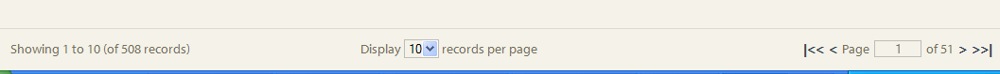
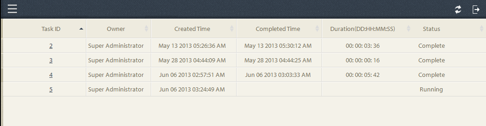

# Ad hoc Vragen in Proces het Melden{#ad-hoc-queries-in-process-reporting}

## Ad-hocquery&#39;s in procesrapportage {#ad-hoc-queries-in-process-reporting-1}

Ad-hoc vragen in het Rapport van het Proces staan u toe om douanequery&#39;s tot stand te brengen die u kunt gebruiken om naar proces en taakdetails van de AEM Forms procesinstanties te zoeken die in uw milieu van Vormen AEM worden bepaald.

Ook, kunnen de ad hoc vragen worden bepaald gebruikend proces en de filters van het taakbezit. Deze filters kunnen vervolgens worden opgeslagen en gebruikt om de rapporten later uit te voeren.

[**Proceszoekopdracht **](/help/forms/using/process-reporting/adhoc-queries-in-process-reporting.md#p-process-task-search-p): Zoek naar procesinstanties met een user-defined onderzoeksfilter die op procesattributen wordt gebaseerd.

[**Procesdetails **](/help/forms/using/process-reporting/adhoc-queries-in-process-reporting.md#p-process-task-details-p): Geef details van een procesinstantie weer door de proces-id op te geven.

**Taakzoekopdracht**: Zoek naar taakinstanties met een user-defined onderzoeksfilter die op taakattributen wordt gebaseerd.

**Taakdetails**: Geef details van een taakinstantie weer door de taak-id op te geven.

### Processen en taken {#processes-and-tasks}

De stappen die u volgt om filters tot stand te brengen en vragen voor procesdetails in werking te stellen zijn het zelfde als dat voor taken.

Dit betekent dat de gebruikersinterface voor het Onderzoek van het Proces en het Onderzoek van de Taak slechts op de gebieden verschilt die u kunt zoeken door en de gebieden terugkomen in de onderzoeksresultaten. Dit komt omdat veel velden identiek zijn, maar bepaalde velden specifiek zijn voor processen en bepaalde velden specifiek zijn voor taken.

In dit artikel worden de beschrijvingen van de secties Zoeken/Taak en Proces/Taakdetails beschreven. Op aangewezen plaatsen, zullen om het even welke specifieke verschillen specifiek worden geroepen.

## Proces/taak zoeken {#process-task-search}

U gebruikt Proces/Taak Onderzoek om filters te bepalen voor het vragen van proces/taakinstanties.

### Een zoekquery voor proces/taak maken {#to-create-a-process-task-search-query}

1. Als u de opgeslagen zoekopdrachten voor Proces/Taak wilt weergeven of een query wilt maken, klikt u op **Adhoc-query&#39;s** en vervolgens op **Proces/Taak zoeken**.

   

   Het deelvenster **Mijn filters** wordt rechts van de structuurweergave weergegeven.

   In het deelvenster **Mijn filters** kunt u nieuwe ad-hocquery&#39;s maken en klikken om eerder opgeslagen query&#39;s uit te voeren.

   

1. Als u een bestaande query wilt uitvoeren, klikt u gewoon op de query in het deelvenster **Mijn filters** .
1. Als u een query wilt maken, klikt u op **Toevoegen** (+).

   Het deelvenster **Filter** maken wordt weergegeven.

   

   Een query bestaat uit een of meer queryfilters. Als u een filter wilt maken, voegt u een filterrij toe aan de query. Standaard wordt één filterrij aan de query toegevoegd.

   **Een filter definiëren**

   1. Selecteer een veld.

      

      >[!NOTE]
      >
      >De veldlijst bevat de velden die specifiek zijn voor het proces/de taak van AEM Forms.

   1. Selecteer een voorwaarde.

      

      >[!NOTE]
      >
      >De vermelde voorwaarden hangen van de attributen af die voor het filtreren wordt geselecteerd.

   1. Voer een waarde in.

      

   1. Als u nog een filter aan de query wilt toevoegen, klikt u op **Toevoegen (+)** rechts van de filterrij.

      Als u een filter uit de query wilt verwijderen, klikt u op **Verwijderen (-)** rechts van de filterrij.

      

Nadat u een query hebt gemaakt, gebruikt u de opties in de rechterbovenhoek van het deelvenster **Filter** maken om:

* **Annuleren**: Annuleer de wijzigingen en ga terug naar het deelvenster **Mijn filters** .
* **Uitvoeren**: Voer de huidige vraag uit om de resultaten te zien en/of te verifiëren. In dit geval hoeft u de query niet op te slaan voordat u de query uitvoert. U kunt de resultaten verifiëren, indien nodig wijzigingen aanbrengen en de query opslaan als u tevreden bent met de uitvoer.
* **Opslaan**: Sla het filter op. Het filter kan vervolgens worden weergegeven en uitgevoerd vanuit het deelvenster **Mijn filters** .

### Opties in het deelvenster Mijn filters {#options-in-my-filters-panel}

Met de opties in het deelvenster **Mijn filters** kunt u **lc_pr_add_filter** , **lc_pr_delete_filter** ofDeletelc_pr_filteran ad-hocquery **** _lc_pr_bewerken.

### Een zoekquery uitvoeren {#to-execute-a-search-query}

1. Als u een query wilt uitvoeren, klikt u op het filter in het deelvenster **Mijn filters** of klikt u op de knop **Uitvoeren** als u een filter maakt of bewerkt.
1. De resultaten van de vraagvertoning in het paneel van het **Rapport** van het **Proces Meldend** venster.

   

   U kunt de onderzoeksresultaten met de hulp van het pagineringspaneel pagineren dat bij de bodem van het rapport wordt getoond.

   

   Kies in de vervolgkeuzelijst **Weergave** het aantal resultaten dat per pagina moet worden weergegeven.

   Voer in het tekstvak **Pagina** een paginanummer in om rechtstreeks naar die pagina te gaan.

1. De volgende velden worden weergegeven in een zoekresultaat van het proces:

   * **Proces-id**: De id van het proces. Het veld is aan hyperlinks gekoppeld. Als u in dit veld op een proces-id klikt, wordt u voor het proces omgeleid naar het deelvenster **[!UICONTROL Procesdetails]** .
   * **Initiator**: De gebruiker van de Vormen AEM die de procesinstantie begon
   * **Aanmaaktijd**: De datum en tijd waarop de procesinstantie is gestart
   * **Voltooide tijd**: De datum en tijd waarop de procesinstantie is voltooid
   * **Duur**: De duur van begin tot voltooiing van de procesinstantie
   * **Status**: De huidige status van de procesinstantie.
   Standaard wordt het resultaat gesorteerd op procesid. Als u het resultaat echter op een van de velden wilt sorteren, klikt u op de veldtitel.

   Aangezien het sorteren een knevelverrichting is, klik een kolomkopbal om het resultaat oplopend te sorteren en het opnieuw te klikken om aflopend te sorteren.

   Op dezelfde manier worden de volgende gebieden getoond in een Resultaat van het Onderzoek van de Taak:

   * **Taak-id**: De id van de taak. Het veld is aan hyperlinks gekoppeld. Als u in dit veld op een taak-id klikt, wordt u voor de taak omgeleid naar het deelvenster **[!UICONTROL Taakdetails]** .
   * **Initiator**: De gebruiker van de Vormen AEM die de procesinstantie begon
   * **Aanmaaktijd**: De datum en tijd waarop de procesinstantie is gestart
   * **Voltooide tijd**: De datum en tijd waarop de procesinstantie is voltooid
   * **Duur**: De duur van begin tot voltooiing van de procesinstantie
   * **Status**: De huidige status van de procesinstantie.
   Door gebrek, wordt het resultaat gesorteerd door identiteitskaart van de Taak. Als u het resultaat echter op een van de velden wilt sorteren, klikt u op de veldtitel. Het resultaat wordt gesorteerd op de kolom die wordt aangegeven met een donkerdere pijl naast de kolomkop.

   Aangezien het sorteren een knevelverrichting is, klik een gebiedsheader om het resultaat oplopend te sorteren en het opnieuw te klikken om aflopend te sorteren. De huidige sorteervolgorde (oplopend/aflopend) wordt aangegeven door de richting van de donkere pijl naast de kolomkop.

   

1. Klik op de knop  linksboven om het deelvenster **Mijn filters** samen te vouwen en vergroot de beschikbare ruimte voor het deelvenster **Rapport** .
1. Gebruik de opties in de hogere juiste hoek van het **Rapport **paneel om verrichtingen op het vraagresultaat uit te voeren.

   * **Vernieuwen**: Verfrist het rapport met de recentste gegevens die in de opslag liggen

   * **Exporteren naar CSV**: Exporteer de rapportgegevens naar een bestand met komma&#39;s als scheidingsteken.
   >[!NOTE]
   >
   >Wanneer u een rapport exporteert, wordt het volledige resultaat van de zoekopdracht geëxporteerd naar een CSV-bestand en niet alleen naar de huidige pagina

## Proces-/taakdetails {#process-task-details}

U gebruikt het deelvenster **Procesdetails** om de details van een bepaald proces weer te geven.

Op dezelfde manier gebruikt u het deelvenster **Taakdetails** om de details van een bepaalde taak weer te geven.

### Proces-/taakdetails weergeven {#to-view-process-task-details}

U kunt de details van een specifiek proces/een specifieke taak van Vormen bekijken AEM:

* **Van een Proces/Taak het Resultaat van het Onderzoek**
* **Door de proces-/taak-id in te voeren in het deelvenster Proces/Taakdetails**

#### Van een Proces/Taak het Resultaat van het Onderzoek {#from-a-process-task-search-result}

1. Een proces-/taakzoekopdracht uitvoeren. Zie [Een zoekquery](#to-execute-a-search-query)uitvoeren voor meer informatie.

   De proces-id&#39;s die in het resultaat worden weergegeven, zijn aan hyperlinks gekoppeld.

   

1. Klik op een proces-id in de lijst om de details van dit proces weer te geven in het deelvenster **Procesdetails** .

   Het de vraagresultaat van **Proces/van de Details** van de Taak toont details van de taken/vormen in het proces/de taak.

   Standaard wordt het resultaat gesorteerd op Taak-/Formulier-id. Als u het resultaat echter op een van de velden wilt sorteren, klikt u op de veldtitel. De kolom waarmee het resultaat wordt gesorteerd, wordt aangegeven met een donkere pijl naast de kolomkop.

   Aangezien het sorteren een knevelverrichting is, klik een gebiedsheader om het resultaat oplopend te sorteren en het opnieuw te klikken om aflopend te sorteren. De huidige sorteervolgorde (oplopend/aflopend) wordt aangegeven door de richting van de donkere pijl naast de kolomkop.

   **Resultaat van procesdetails**

   

   **Deelvenster Links:** Geeft de volgende details van het geselecteerde proces weer:

   * Naam van het proces
   * Datum aanmaakdatum proces
   * Einddatum proces
   * Procesduur
   * Processtatus
   * Procesinitiator
   **Deelvenster rechtsboven:** Geeft de volgende details weer van de taken waaruit het geselecteerde proces bestaat:

   * Taak-id
   * Taaknaam
   * Taakeigenaar
   * Tijd van aanmaakdatum van taak
   * Tijdstip van update van taak
   * Einddatum taak
   * Taakduur
   * Taakstatus
   **Deelvenster Rechtsonder:** Geeft de volgende details van de procesgeschiedenis van het geselecteerde proces weer:

   * Procesnaam
   * Procesinitiator
   * Tijdstip van procesupdate
   * Einddatum proces
   * Processtatus
   **Resultaat taakdetails**

   

   **Deelvenster Links:** Geeft de volgende details van de geselecteerde taak weer:

   * Taaknaam
   * Id van proces waartoe deze taak behoort
   * Taakbeschrijving
   * Tijd van aanmaakdatum van taak
   * Einddatum taak
   * Taakduur
   * Taakstatus
   * Geselecteerde taakroute
   **Deelvenster rechtsboven:** Hier worden de volgende details weergegeven van de formulieren waaruit de geselecteerde taak bestaat:

   * Foprm-id
   * Aanmaakdatum van formulier
   * Tijdstip van updatedatum van formulier
   * URL van formuliersjabloon
   **Deelvenster Rechtsonder:** Geeft de volgende details van de procesgeschiedenis van de geselecteerde taak weer:

   * Type taaktoewijzing
   * Taakeigenaar
   * Aanmaakdatum taak
   * Tijdstip van update van taak

1. Klik op **Terug naar Zoeken** in proces/taak om terug te keren naar het zoekresultaat waaruit de proces-/taakdetails zijn neergezet.

   

   Als de proces-/taakdetails echter zijn gevonden door een specifieke proces-/taak-id in te voeren, kunt u door op Terug naar zoeken in proces/taak te klikken terug naar Zoeken **in** proces/taak zonder zoekresultaten weer te geven.

#### Door de proces-/taak-id in te voeren in het deelvenster Proces/Taakdetails {#by-entering-the-process-task-id-in-the-process-task-details-panel-br}

1. Ga naar het deelvenster **Proces/Taakdetails** .

   

1. Voer in het tekstvak Proces/Taak-id de proces-/taak-id in.

   

   De velden in het resultaat van de query&#39;s **Proces/Taakdetails** zijn velden die specifiek zijn voor een AEM Forms-proces/taak.

   Voor een proces, toont het vraagresultaat de details van de taken in het proces.

   Voor een taak, toont het vraagresultaat de details de vormen in de taak.
