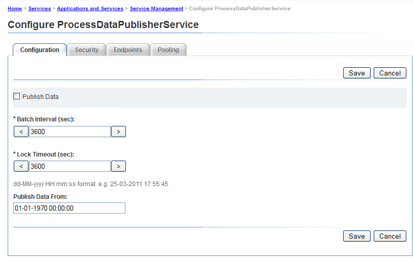

# Aan de slag met Process Reporting{#getting-started-with-process-reporting}

Met behulp van Process Reporting kunnen gebruikers van AEM Forms informatie opvragen over AEM Forms-processen die momenteel zijn gedefinieerd in de implementatie van AEM Forms. Procesrapportage heeft echter niet rechtstreeks toegang tot gegevens in de opslagplaats van AEM Forms. De gegevens worden voor het eerst op een geplande basis gepubliceerd naar de Process Reporting repository (*door de ProcessDataPublisher &amp; ProcessDataStorage-* services). De rapporten en vragen in de Rapportering van het Proces worden dan geproduceerd uit het Proces Meldend gegevens die aan de bewaarplaats worden gepubliceerd. De Rapportering van het proces wordt geïnstalleerd als deel van de module van het Werkschema van Vormen.

In dit artikel worden de stappen beschreven die het publiceren van AEM Forms-gegevens naar de Process Reporting-opslagplaats mogelijk maken. Daarna, zult u het Rapport van het Proces kunnen gebruiken om rapporten en vragen in werking te stellen. Het artikel behandelt ook de opties beschikbaar om de diensten van de Rapportering van het Proces te vormen.

## Voorwaarden voor procesrapportage {#process-reporting-pre-requisites}

### Niet-essentiële processen zuiveren {#purge-non-essential-processes}

Als u momenteel de Forms Workflow gebruikt, kan de AEM Forms-database mogelijk een grote hoeveelheid gegevens bevatten

Met de publicatieservices Process Reporting worden alle momenteel in de database beschikbare gegevens van AEM Forms gepubliceerd. Dit houdt in dat als de database verouderde gegevens bevat waarop u geen rapporten en query&#39;s wilt uitvoeren, alle gegevens ook naar de gegevensopslagruimte worden gepubliceerd, ook al is dit niet vereist voor rapportage. U wordt aangeraden deze gegevens te wissen voordat u de services uitvoert om de gegevens naar de Process Reporting-opslagplaats te publiceren. Dit zal de prestaties van zowel de uitgeversdienst als de dienst verbeteren die de gegevens voor rapportering vraagt.

Zie [Procesgegevens](https://help.adobe.com/en_US/livecycle/11.0/AdminHelp/WS92d06802c76abadb-5145d5d12905ce07e7-7cb2.2.html)leegmaken voor meer informatie over het wissen van procesgegevens van AEM Forms.

>[!NOTE]
>
>Voor de tips en trucs van het Nut van de Leegheid, zie het artikel van de Verbinding van de Ontwikkelaar van Adobe over het [Zuiveren processen en banen](https://www.adobe.com/content/dam/Adobe/en/devnet/livecycle/pdfs/purging_processes_jobs.pdf).

## Services voor Process Reporting configureren {#configuring-process-reporting-services}

### Publiceren van procesgegevens plannen {#schedule-process-data-publishing}

De Process Reporting-services publiceren op geregelde basis gegevens van de AEM Forms-database naar de Process Reporting-opslagplaats.

Deze bewerking kan bronintensief zijn en de prestaties van de AEM Forms-servers beïnvloeden. U wordt aangeraden dit buiten de bezige tijdsleuven van de AEM Forms-server te plannen.

Door gebrek, is het publiceren van gegevens planning om elke dag om 2:00 uur in werking te stellen.

Voer de volgende stappen uit om het publicatieschema te wijzigen:

>[!NOTE]
>
>Als u de implementatie van AEM Forms uitvoert op een cluster, voert u de volgende stappen uit op elk knooppunt van de cluster.

1. Stop de AEM Forms server-instantie.
1. &#x200B;

   * (Voor Windows) Open het `[JBoss root]/bin/run.conf.bat` bestand in een editor.
   * (Voor Linux, AIX en Solaris) `[JBoss root]/bin/run.conf.sh` dossier in een redacteur.

1. Het JVM-argument toevoegen `-Dreporting.publisher.cron = <expression>.`

   Voorbeeld: Met de volgende uitsnijdexpressie worden bij Process Reporting de AEM Forms-gegevens elke 5 uur naar de Process Reporting-opslagplaats gepubliceerd:

   * `-Dreporting.publisher.cron = 0_0_0/5_*_*_?`

1. Sla het `run.conf.bat` bestand op en sluit het.

1. Start de AEM Forms-serverinstantie opnieuw.

1. Stop de AEM Forms server-instantie.
1. Meld u aan bij de beheerconsole van WebSphere. Klik in de navigatiestructuur op **Servers** > **Toepassingsservers** en klik vervolgens in het rechterdeelvenster op de naam van de server.

1. Klik onder Serverinfrastructuur op **Java en Process Management** > **Process Definition**.

1. Klik onder Extra eigenschappen op **Java Virtual Machine**.

   Voeg het argument toe in het vak Generic JVM-argumenten `-Dreporting.publisher.cron = <expression>.`

   **Voorbeeld**: Met de volgende uitsnijdexpressie worden bij Process Reporting de AEM Forms-gegevens elke 5 uur naar de Process Reporting-opslagplaats gepubliceerd:

   * `-Dreporting.publisher.cron = 0_0_0/5_*_*_?`

1. Klik op **Toepassen**, klik op OK en klik vervolgens rechtstreeks op **Opslaan in de hoofdconfiguratie**.
1. Start de AEM Forms-serverinstantie opnieuw.
1. Stop de AEM Forms server-instantie.
1. Meld u aan bij de WebLogic-beheerconsole. Het standaardadres van de Console van het Beleid WebLogic is `https://[hostname]:[port]/console`.
1. Klik onder Midden wijzigen op **Vergrendelen en bewerken**.
1. Klik onder Domeinstructuur op **Omgeving** > **Servers** en klik in het rechterdeelvenster op de naam van de beheerde server.
1. Klik in het volgende scherm op het tabblad **Configuratie** > **Serverstart** .
1. Voeg het JVM-argument toe in het vak Argumenten `-Dreporting.publisher.cron = <expression>`.

   **Voorbeeld**: Met de volgende uitsnijdexpressie worden bij Process Reporting de AEM Forms-gegevens elke 5 uur naar de Process Reporting-opslagplaats gepubliceerd:

   `-Dreporting.publisher.cron = 0_0_0/5_*_*_?`

1. Klik op **Opslaan** en vervolgens op Wijzigingen **activeren**.
1. Start de AEM Forms-serverinstantie opnieuw.

### ProcessDataStorage-service {#processdatastorage-service}

De dienst ProcessDataStorageProvider ontvangt procesgegevens van de dienst ProcessDataPublisher en bewaart de gegevens aan de bewaarplaats van de Rapportering van het Proces.

Bij elke publicatiecyclus worden de gegevens opgeslagen in submappen van een vooraf gedefinieerde hoofdmap.

U kunt de console van het Beleid gebruiken om de wortel (**gebrek**) te vormen: `/content/reporting/pm`) locatie en submap (**standaard**: `/yyyy/mm/dd/hh/mi/ss`) hiërarchie-indeling waarin de procesgegevens worden opgeslagen.

#### De locaties van de Process Reporting repository configureren {#to-configure-the-process-reporting-repository-locations}

1. Meld u aan bij de **beheerconsole** met beheerdersreferenties. De standaard-URL van de beheerconsole is `https://'[server]:[port]'/adminui`
1. Ga naar **Home** > **Services** > **Toepassingen en services** >**Servicebeheer** en open de **ProcessDataStorageProvider** -service.

   

   **RootFolder**

   De CRX-locatie waarin de procesgegevens worden opgeslagen voor rapportage.

   `Default`: `/content/reporting/pm`

   **Maphiërarchie**

   De mappenhiërarchie waarin de procesgegevens worden opgeslagen op basis van de aanmaaktijd van het proces.

   `Default`: `/yyyy/mm/dd/hh/mi/ss`

1. Click **Save**.

### ReportConfiguration-service {#reportconfiguration-service}

De dienst ReportConfiguration wordt gebruikt door Proces dat voor het vormen van het proces meldt de vraagdienst.

#### Om de dienst te vormen ReportingConfiguration {#to-configure-the-reportingconfiguration-service}

1. Meld u aan bij **Configuratiebeheer** met CRX-beheerdersreferenties. De standaard-URL van Configuration Manager is `https://'[server]:[port]'/lc/system/console/configMgr`
1. Open de **dienst ReportingConfiguration** .
1. **Aantal records**

   Wanneer het runnen van een vraag op de bewaarplaats, kan een resultaat een groot aantal verslagen potentieel bevatten. Als de resultaatreeks groot is, kan de vraaguitvoering servermiddelen verbruiken.

   Om grote resultaatsets te behandelen, splitst de dienst ReportConfiguration de vraagverwerking in partijen verslagen. Hierdoor wordt de systeembelasting verminderd.

   `Default`: `1000`

   **CRX-opslagpad**

   De CRX-locatie waarin de procesgegevens moeten worden opgeslagen voor rapportage.

   `Default`: `/content/reporting/pm`

   >[!NOTE]
   >
   >Dit is dezelfde locatie als is opgegeven in de **hoofdmap** van de configuratieoptie ProcessDataStorage.
   >
   >
   >Als u de optie van de Omslag van de Wortel in de configuratie ProcessDataStorage bijwerkt, moet u de plaats van de Weg van de Opslag CRX in de dienst ReportConfiguration bijwerken.

1. Klik op **Opslaan** en sluit **CQ Configuration Manager**.

### ProcessDataPublisher-service {#processdatapublisher-service}

De service ProcessDataPublisher importeert procesgegevens uit de AEM Forms-database en publiceert de gegevens naar de ProcessDataStorageProvider-service voor opslag.

#### De service ProcessDataPublisher configureren {#to-configure-processdatapublisher-service-nbsp}

1. Meld u aan bij de **beheerconsole** met beheerdersreferenties.

   De standaard-URL is `https://'server':port]/adminui/`.

1. Ga naar **Home** > **Services** > **Toepassingen en services** >**Servicebeheer** en open de **ProcessDataPublisher** -service.

**Gegevens publiceren**

Schakel deze optie in om te beginnen met het publiceren van procesgegevens. De optie is standaard uitgeschakeld.

Schakel Process Reporting alleen in als alle configuraties met betrekking tot Process Reporting-componenten op de juiste wijze zijn ingesteld.

U kunt deze optie ook gebruiken om het publiceren van procesgegevens uit te schakelen wanneer dit niet langer verplicht is.

`Default`: `Off`

**Batchinterval (sec)**

Telkens als de dienst ProcessDataPublisher loopt, verdeelt de dienst eerst de tijd sinds de laatste looppas van de dienst door het Interval van de Partij. De dienst verwerkt dan elk interval van de gegevens van Vormen AEM afzonderlijk.

Zo kunt u de grootte bepalen van de gegevens die de uitgever verwerkt tijdens elke uitvoering (batch) binnen een cyclus.

Bijvoorbeeld, als de uitgever elke dag in werking stelt, dan in plaats van het verwerken van de volledige gegevens één dag in één enkele looppas, door gebrek, wordt het de verwerking in 24 partijen van elk één uur verdeeld.

`Default`: `3600`

`Unit`: `Seconds`

**Time-out vergrendelen (sec)**

De uitgeversservice verkrijgt een vergrendeling wanneer de verwerking van gegevens wordt gestart, zodat meerdere exemplaren van de uitgever niet gelijktijdig met het uitvoeren en verwerken van gegevens beginnen.

Als een uitgeversdienst die een slot heeft verworven, nutteloos voor het aantal seconden is die door de waarde van de Onderbreking van het Slot wordt bepaald, dan wordt zijn slot vrijgegeven zodat andere instanties van de uitgeversdienst kunnen blijven verwerken.

`Default`: `3600`

`Unit`: `Seconds`

**Gegevens publiceren vanuit**

De omgeving van AEM Forms bevat gegevens uit de tijd dat de omgeving is ingesteld.

Standaard importeert de dienst ProcessDataPublisher alle gegevens uit de database van AEM Forms.

Afhankelijk van uw rapporteringsbehoeften, als u van plan bent om rapporten en vragen over gegevens na een bepaalde datum en een tijd in werking te stellen, adviseert men dat u de datum en de tijd specificeert. De publicatieservice publiceert vervolgens de datum vanaf die datum.

`Default`: `01-01-1970 00:00:00`

`Format`: `dd-MM-yyyy HH:mm:ss`

## Toegang tot de gebruikersinterface Process Reporting {#accessing-the-process-reporting-user-interface}

De gebruikersinterface voor Process Reporting is browsergebaseerd.

Nadat u de Rapportering van het Proces van de opstelling hebt, kunt u beginnen met het Proces Meldend bij de volgende plaats in uw installatie van Vormen AEM:

`https://<server>:<port>/lc/pr`

### Aanmelden bij procesrapportage {#log-in-to-process-reporting}

Wanneer u naar de URL voor Process Reporting (https://&lt;server>:&lt;port>/lc/pr) navigeert, wordt het aanmeldingsscherm weergegeven.

Specificeer uw geloofsbrieven aan login aan de module van de Rapportering van het Proces.

>[!NOTE]
>
>Als u zich wilt aanmelden bij de gebruikersinterface Process Reporting, hebt u de volgende AEM Forms-machtigingen nodig:
>
>`PERM_PROCESS_REPORTING_USER`

Als u zich aanmeldt bij Process Reporting, wordt het scherm **[!UICONTROL Home]** weergegeven.

### Process Reporting Home-scherm {#process-reporting-home-screen}

**De mening van de boom van de Rapportering van het proces:** De boomstructuurweergave aan de linkerkant van het Homescherm bevat de items voor de modules Procesrapportage.

De boomstructuurweergave bestaat uit de volgende items op hoofdniveau:

**Rapporten:** Dit item bevat de out-of-the-box rapporten die worden verzonden met Process Reporting.

Zie [Vooraf gedefinieerde rapporten in Process Reporting](/help/forms/using/process-reporting/pre-defined-reports-in-process-reporting.md)voor meer informatie over de vooraf gedefinieerde rapporten.

**Adhoc-query&#39;s:** Dit item bevat opties voor het uitvoeren van op filters gebaseerde zoekopdrachten naar processen en taken.

Voor details op ad-hoc vragen, zie [Ad-hoc Vragen in het Rapporteren](/help/forms/using/process-reporting/adhoc-queries-in-process-reporting.md)van het Proces.

**Aangepast:** Het knooppunt Aangepast geeft aangepaste rapporten weer die u maakt.

Voor de procedure om douanerapporten tot stand te brengen en te tonen, zie de Rapporten van de [Douane in de Rapportering](/help/forms/using/process-reporting/process-reporting-custom-reports.md)van het Proces.

**Procesrapportage, titelbalk:** De de titelbar van de Rapportering van het Proces bevat sommige generische opties die u wanneer het werken in het gebruikersinterface kunt gebruiken.

**Titel van procesrapportage:** De titel Procesrapportage wordt in de linkerhoek van de titelbalk weergegeven.

Klik op de titel om terug te keren naar het scherm Home.

**Tijd laatste update:** De procesgegevens worden op geplande basis gepubliceerd vanuit de AEM Forms-database naar de Process Reporting-opslagplaats.

De laatste tijd van de Update toont de laatste datum en de tijd tot waarvan de gegevensupdates aan de bewaarplaats van de Rapportering van het Proces werden geduwd.

Voor details op de gegevens het publiceren dienst en hoe te om deze dienst te plannen, zie het [procesgegevens van het Programma publiceren](/help/forms/using/process-reporting/install-start-process-reporting.md#p-schedule-process-data-publishing-p) in het artikel dat met het Melden van het Proces wordt begonnen.

**Gebruiker voor procesrapportage:** De aangemelde gebruikersnaam wordt rechts van de laatste update weergegeven.

**Verwerking van vervolgkeuzelijst titelbalk rapportage:** De vervolgkeuzelijst in de rechterhoek van de titelbalk van Procesrapportage bevat de volgende opties:

* **[!UICONTROL Synchroniseren]**: Synchroniseer de ingesloten Process Reporting-opslagplaats met de AEM Forms-database.
* **[!UICONTROL Help]**: Raadpleeg de Help-documentatie bij Process Reporting.
* **[!UICONTROL Afmelden]**: Afmelden bij procesrapportage
